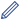

# Herbert Stothart

## Biografía

Herbert Pope Stothart (Milwaukee, 11 de septiembre de 1885-Los Ángeles, 1 de febrero de 1949) fue un compositor, arreglista y director de orquesta estadounidense. También fue nominado a doce Premios de la Academia, ganando el de la mejor banda sonora original por El mago de Oz. Stothart fue ampliamente reconocido como compositor de alto nivel de Hollywood durante las décadas de 1930 y 1940.

## Estilo musical

Stothart fue contratado inicialmente por el productor Arthur Hammerstein para trabajar como director musical para compañías en gira de espectáculos de Broadway. Pronto empezó a componer música para Oscar Hammerstein II, sobrino del productor. En particular, Stothart compuso música para la famosa opereta Rose-Marie. Colaboró ​​con compositores de renombre como Vincent Youmans, George Gershwin y Franz Lehár. Stothart logró el éxito en las listas de éxitos con estándares como "Cute Little Two by Four", "Wildflower", "Bambalina", "The Mounties", "Totem Tom-Tom", "¿Why Shouldn't We?", "Fly Away", "Song of the Flame", "The Cossack Love Song", "Dawn", "I Wanna Be Loved by You", "Cuban Love Song", "The Rogue Song" y "The Donkey Serenade".

## Anécdotas y curiosidades

Herbert Stothart nació en Milwaukee, Wisconsin. Estudió música en Europa y en la Universidad de Wisconsin-Madison, donde más tarde impartió clases.

## Top 10 bandas sonoras

1. ***Waterloo Bridge (Título en España: El puente de Waterloo)***
    * **Póster:** [link](001_herbert_stothart/posters/poster_waterloo_bridge_1940.jpg)
2. ***Anna Karenina (Título en España: Ana Karenina)***
    * **Póster:** [link](001_herbert_stothart/posters/poster_anna_karenina_1935.jpg)
3. ***Mutiny on the Bounty (Título en España: La tragedia de la Bounty)***
    * **Póster:** [link](001_herbert_stothart/posters/poster_mutiny_on_the_bounty_1935.jpg)
4. ***A Tale of Two Cities (Título en España: Historia de dos ciudades)***
    * **Póster:** [link](001_herbert_stothart/posters/poster_a_tale_of_two_cities_1935.jpg)
5. ***The Picture of Dorian Gray (Título en España: El retrato de Dorian Gray)***
    * **Póster:** [link](001_herbert_stothart/posters/poster_the_picture_of_dorian_gray_1945.jpg)
6. ***National Velvet (Título en España: Fuego de juventud)***
    * **Póster:** [link](001_herbert_stothart/posters/poster_national_velvet_1945.jpg)
7. ***The Three Musketeers (Título en España: Los tres mosqueteros)***
    * **Póster:** [link](001_herbert_stothart/posters/poster_the_three_musketeers_1948.jpg)
8. ***Mrs. Miniver (Título en España: La señora Miniver)***
    * **Póster:** [link](001_herbert_stothart/posters/poster_mrs_miniver_1942.jpg)
9. ***After the Thin Man (Título en España: Ella, él y Asta)***
    * **Póster:** [link](001_herbert_stothart/posters/poster_after_the_thin_man_1936.jpg)
10. ***Treasure Island (Título en España: La isla del tesoro)***
    * **Póster:** [link](001_herbert_stothart/posters/poster_treasure_island_1934.jpg)

## Filmografía completa

- The Florodora Girl (Título en España: The Florodora Girl) (1930) · [Póster](001_herbert_stothart/posters/poster_the_florodora_girl_1930.jpg)
- The Cuban Love Song (Título en España: Bajo el cielo de Cuba) (1931) · [Póster](001_herbert_stothart/posters/poster_the_cuban_love_song_1931.jpg)
- The Son-Daughter (Título en España: The Son-Daughter) (1932) · [Póster](001_herbert_stothart/posters/poster_the_son_daughter_1932.jpg)
- The Cat and the Fiddle (Título en España: El Gato y el Violín) (1934) · [Póster](001_herbert_stothart/posters/poster_the_cat_and_the_fiddle_1934.jpg)
- The Painted Veil (Título en España: El velo pintado) (1934) · [Póster](001_herbert_stothart/posters/poster_the_painted_veil_1934.jpg)
- Chained (Título en España: Encadenada) (1934) · [Póster](001_herbert_stothart/posters/poster_chained_1934.jpg)
- Treasure Island (Título en España: La isla del tesoro) (1934) · [Póster](001_herbert_stothart/posters/poster_treasure_island_1934.jpg)
- Laughing Boy (Título en España: Laughing Boy) (1934) · [Póster](001_herbert_stothart/posters/poster_laughing_boy_1934.jpg)
- Viva Villa! (Título en España: Viva Villa!) (1934) · [Póster](001_herbert_stothart/posters/poster_viva_villa_1934.jpg)
- What Every Woman Knows (Título en España: What Every Woman Knows) (1934) · [Póster](001_herbert_stothart/posters/poster_what_every_woman_knows_1934.jpg)
- Anna Karenina (Título en España: Ana Karenina) (1935) · [Póster](001_herbert_stothart/posters/poster_anna_karenina_1935.jpg)
- Ah, Wilderness! (Título en España: Ayer como hoy) (1935) · [Póster](001_herbert_stothart/posters/poster_ah_wilderness_1935.jpg)
- The Personal History, Adventures, Experience, & Observation of David Copperfield the Younger (Título en España: David Copperfield) (1935) · [Póster](001_herbert_stothart/posters/poster_the_personal_history_adventures_experience_observation_of_david_copperfield_the_younger_1935.jpg)
- A Tale of Two Cities (Título en España: Historia de dos ciudades) (1935) · [Póster](001_herbert_stothart/posters/poster_a_tale_of_two_cities_1935.jpg)
- Mutiny on the Bounty (Título en España: La tragedia de la Bounty) (1935) · [Póster](001_herbert_stothart/posters/poster_mutiny_on_the_bounty_1935.jpg)
- China Seas (Título en España: Los mares de China) (1935) · [Póster](001_herbert_stothart/posters/poster_china_seas_1935.jpg)
- Sequoia (Título en España: Sequoia) (1935) · [Póster](001_herbert_stothart/posters/poster_sequoia_1935.jpg)
- After the Thin Man (Título en España: Ella, él y Asta) (1936) · [Póster](001_herbert_stothart/posters/poster_after_the_thin_man_1936.jpg)
- Wife vs. Secretary (Título en España: Entre esposa y secretaria) (1936) · [Póster](001_herbert_stothart/posters/poster_wife_vs_secretary_1936.jpg)
- Camille (Título en España: La dama de las camelias) (1936) · [Póster](001_herbert_stothart/posters/poster_camille_1936.jpg)
- Moonlight Murder (Título en España: Moonlight Murder) (1936) · [Póster](001_herbert_stothart/posters/poster_moonlight_murder_1936.jpg)
- Robin Hood of El Dorado (Título en España: Robin Hood of El Dorado) (1936) · [Póster](001_herbert_stothart/posters/poster_robin_hood_of_el_dorado_1936.jpg)
- Rose Marie (Título en España: Rose Marie) (1936) · [Póster](001_herbert_stothart/posters/poster_rose_marie_1936.jpg)
- The Good Earth (Título en España: La buena tierra) (1937) · [Póster](001_herbert_stothart/posters/poster_the_good_earth_1937.jpg)
- Conquest (Título en España: Maria Walewska) (1937) · [Póster](001_herbert_stothart/posters/poster_conquest_1937.jpg)
- Maytime (Título en España: Maytime) (1937) · [Póster](001_herbert_stothart/posters/poster_maytime_1937.jpg)
- The Romance of Celluloid (Título en España: The Romance of Celluloid) (1937) · [Póster](001_herbert_stothart/posters/poster_the_romance_of_celluloid_1937.jpg)
- Sweethearts (Título en España: Enamorados) (1938) · [Póster](001_herbert_stothart/posters/poster_sweethearts_1938.jpg)
- Marie Antoinette (Título en España: Maria Antonieta) (1938) · [Póster](001_herbert_stothart/posters/poster_marie_antoinette_1938.jpg)
- Balalaika (Título en España: Balalaika) (1939) · [Póster](001_herbert_stothart/posters/poster_balalaika_1939.jpg)
- Cavalcade of the Academy Awards (Título en España: Cavalcade of the Academy Awards) (1940) · [Póster](001_herbert_stothart/posters/poster_cavalcade_of_the_academy_awards_1940.jpg)
- Waterloo Bridge (Título en España: El puente de Waterloo) (1940) · [Póster](001_herbert_stothart/posters/poster_waterloo_bridge_1940.jpg)
- Pride and Prejudice (Título en España: Más fuerte que el orgullo) (1940) · [Póster](001_herbert_stothart/posters/poster_pride_and_prejudice_1940.jpg)
- Northwest Passage (Título en España: Paso al noroeste) (1940) · [Póster](001_herbert_stothart/posters/poster_northwest_passage_1940.jpg)
- Blossoms in the Dust (Título en España: De corazón a corazón) (1941) · [Póster](001_herbert_stothart/posters/poster_blossoms_in_the_dust_1941.jpg)
- Smilin' Through (Título en España: Smilin' Through) (1941) · [Póster](001_herbert_stothart/posters/poster_smilin_through_1941.jpg)
- The Chocolate Soldier (Título en España: The Chocolate Soldier) (1941) · [Póster](001_herbert_stothart/posters/poster_the_chocolate_soldier_1941.jpg)
- Mrs. Miniver (Título en España: La señora Miniver) (1942) · [Póster](001_herbert_stothart/posters/poster_mrs_miniver_1942.jpg)
- I Married an Angel (Título en España: Me casé con un ángel) (1942) · [Póster](001_herbert_stothart/posters/poster_i_married_an_angel_1942.jpg)
- Tennessee Johnson (Título en España: Tennessee Johnson) (1942) · [Póster](001_herbert_stothart/posters/poster_tennessee_johnson_1942.jpg)
- We Must Have Music (Título en España: We Must Have Music) (1942) · [Póster](001_herbert_stothart/posters/poster_we_must_have_music_1942.jpg)
- Thousands Cheer (Título en España: El desfile de las estrellas) (1943) · [Póster](001_herbert_stothart/posters/poster_thousands_cheer_1943.jpg)
- A Guy Named Joe (Título en España: Dos en el cielo) (1944) · [Póster](001_herbert_stothart/posters/poster_a_guy_named_joe_1944.jpg)
- Kismet (Título en España: El príncipe mendigo) (1944) · [Póster](001_herbert_stothart/posters/poster_kismet_1944.jpg)
- The White Cliffs of Dover (Título en España: Las rocas blancas de Dover) (1944) · [Póster](001_herbert_stothart/posters/poster_the_white_cliffs_of_dover_1944.jpg)
- Thirty Seconds Over Tokyo (Título en España: Treinta segundos sobre Tokio) (1944) · [Póster](001_herbert_stothart/posters/poster_thirty_seconds_over_tokyo_1944.jpg)
- The Picture of Dorian Gray (Título en España: El retrato de Dorian Gray) (1945) · [Póster](001_herbert_stothart/posters/poster_the_picture_of_dorian_gray_1945.jpg)
- The Valley of Decision (Título en España: El valle del destino) (1945) · [Póster](001_herbert_stothart/posters/poster_the_valley_of_decision_1945.jpg)
- National Velvet (Título en España: Fuego de juventud) (1945) · [Póster](001_herbert_stothart/posters/poster_national_velvet_1945.jpg)
- They Were Expendable (Título en España: No eran imprescindibles) (1945) · [Póster](001_herbert_stothart/posters/poster_they_were_expendable_1945.jpg)
- Undercurrent (Título en España: Corrientes ocultas) (1946) · [Póster](001_herbert_stothart/posters/poster_undercurrent_1946.jpg)
- The Yearling (Título en España: El despertar) (1946) · [Póster](001_herbert_stothart/posters/poster_the_yearling_1946.jpg)
- The Green Years (Título en España: The Green Years) (1946) · [Póster](001_herbert_stothart/posters/poster_the_green_years_1946.jpg)
- Desire Me (Título en España: Desire Me) (1947) · [Póster](001_herbert_stothart/posters/poster_desire_me_1947.jpg)
- High Barbaree (Título en España: La isla encantada) (1947) · [Póster](001_herbert_stothart/posters/poster_high_barbaree_1947.jpg)
- The Sea of Grass (Título en España: Mar de hierba) (1947) · [Póster](001_herbert_stothart/posters/poster_the_sea_of_grass_1947.jpg)
- Hills of Home (Título en España: Las colinas de mi tierra) (1948) · [Póster](001_herbert_stothart/posters/poster_hills_of_home_1948.jpg)
- The Three Musketeers (Título en España: Los tres mosqueteros) (1948) · [Póster](001_herbert_stothart/posters/poster_the_three_musketeers_1948.jpg)
- Three Daring Daughters (Título en España: Three Daring Daughters) (1948) · [Póster](001_herbert_stothart/posters/poster_three_daring_daughters_1948.jpg)
- Big Jack (Título en España: Big Jack) (1949) · [Póster](001_herbert_stothart/posters/poster_big_jack_1949.jpg)

## Premios y nominaciones

* 1939 – Premio de la Academia a la mejor banda sonora original – por *Marie Antoinette (Título en España: Maria Antonieta)* – (Nominación)
* 1939 – Premio de la Academia a la mejor banda sonora, adaptación o tratamiento – por *Sweethearts (Título en España: Enamorados)* – (Nominación)
* 1940 – Premio de la Academia a la mejor banda sonora original – por *The Wizard of Oz (Título en España: El mago de Oz)* – (Ganador)
* 1940 – Premio de la Academia a la mejor banda sonora original – por *The Wizard of Oz (Título en España: El mago de Oz)* – (Nominación)
* 1941 – Premio de la Academia a la mejor banda sonora original – por *Waterloo Bridge (Título en España: El puente de Waterloo)* – (Nominación)
* 1942 – Premio de la Academia a la mejor partitura musical original – por *The Chocolate Soldier (Título en España: The Chocolate Soldier)* – (Nominación)
* 1943 – Premio de la Academia a la mejor banda sonora original de comedia o drama – por *Random Harvest (Título en España: Niebla en el pasado)* – (Nominación)
* 1944 – Premio de la Academia a la mejor banda sonora original de comedia o drama – por *Madame Curie (Título en España: Madame Curie)* – (Nominación)
* 1944 – Premio de la Academia a la mejor partitura musical original – por *Thousands Cheer (Título en España: El desfile de las estrellas)* – (Nominación)
* 1945 – Premio de la Academia a la mejor banda sonora original de comedia o drama – por *Kismet (Título en España: El príncipe mendigo)* – (Nominación)
* 1946 – Premio de la Academia a la mejor banda sonora original de comedia o drama – por *The Valley of Decision (Título en España: El valle del destino)* – (Nominación)

## Fuentes adicionales

* [MundoBSO](https://www.mundobso.com/compositor/stothart-herbert) — site:mundobso.com
* [MundoBSO (2)](https://www.mundobso.com/bso/perdicion) — site:mundobso.com
* [MundoBSO (3)](https://www.mundobso.com/bso/star-trek-insurrection) — site:mundobso.com
* [Film Score Monthly](https://www.filmscoremonthly.com/notes/son_of_lassie.html) — site:filmscoremonthly.com
* [Film Score Monthly (2)](https://www.filmscoremonthly.com/notes/northwest_passage.html) — site:filmscoremonthly.com
* [Film Score Monthly (3)](https://filmscoremonthly.com/cds/detail.cfm/CDID/369/Random-Harvest-The-Yearling/) — site:filmscoremonthly.com
* [SoundtrackCollector](https://www.soundtrackcollector.com/catalog/composerdiscography.php?composerid=2036) — site:soundtrackcollector.com
* [SoundtrackCollector (2)](https://www.soundtrackcollector.com/title/90084/Code+Two) — site:soundtrackcollector.com
* [SoundtrackCollector (3)](https://www.soundtrackcollector.com/title/46737/Mutiny+On+The+Bounty) — site:soundtrackcollector.com
* [WhatSong](https://www.whatsong.org/tvshow/how-i-met-your-mother/episode/44483) — site:whatsong.org
* [WhatSong (2)](https://www.whatsong.org/tvshow/fresh-meat/episode/29192) — site:whatsong.org
* [WhatSong (3)](https://www.whatsong.org/tvshow/grown-ish/episode/82123) — site:whatsong.org

## Notas externas

* MundoBSO: Nació en Milwakee, Wisconsin (EE UU), el 11 de septiembre de 1885, y murió en Los Ángeles (EE UU), el 1 de febrero de 1949. Prolífico compositor al servicio de la Metro Goldwyn Mayer, estudio para el que trabajó durante toda su carrera y del que fue jefe de departamento. En su haber tiene todas las grandes producciones de los años 30 y 40, tanto en los títulos protagonizados por Greta Garbo como otras estrellas (Judy Garland, Mickey Rooney, Norma Shearer, los hermanos Marx, etc). Nació en Milwakee, Wisconsin (EE UU), el 11 de septiembre de 1885, y murió en Los Ángeles (EE UU), el 1 de febrero de 1949. Prolífico compositor al servicio de la Metro Goldwyn Mayer, estudio para el que trabajó...
* MundoBSO (2): Compositor: Rózsa, Miklós Sello: Koch Duración: 71 minutos Información de la película Título original: Double Indemnity Director: Billy Wilder Nacionalidad: EE UU Año: 1944 Argumento Cine negro americano en estado puro, con irónicos diálogos, en el que una viperina mujerseduce a un agente de seguros para que mate a su marido, todo ello con nefastas consecuencias. Premios Oscar: 1 nominación Compositor: Rózsa, Miklós Sello: Koch Duración: 71 minutos
* MundoBSO (3): Compositor: Goldsmith, Jerry Sello: GNP Duración: 79 minutos Información de la película Título original: Star Trek: Insurrection Director: Jonathan Frakes Nacionalidad: EE UU Año: 1998 Argumento La tripulación de la nave Enterprise encuentra un planeta con propiedades mágicas, en el que sus habitantes viven en eterna paz... hasta que surge la amenaza de invasión. Compositor: Goldsmith, Jerry Sello: GNP Duración: 79 minutos
* WhatSong: Lily y Robin bailan con los dos nerds del último año de secundaria. Se reproduce de fondo cuando Lilly, Robin y Barney intentan entrar a la fiesta. La canción es una canción que está incluida en iMovie.
* WhatSong (2): Vod y Oregon organizan una fiesta para Kingsley para celebrar la pérdida de su virginidad. Public Enemy - Poder para la gente y los ritmos - Los mayores éxitos de Public Enemy
* WhatSong (3): Luca está pensando en él y en el encuentro sexual de Zoey de la noche anterior. Luca está estresado por su "yo". Texto a Zoey y su falta de respuesta.
* www.rottentomatoes.com: -- The Great American Baking Show: Celebrity Big Game: Temporada 2 80% Bridgerton: Temporada 4 Enlace a Bridgerton: Temporada 4
* silverscenesblog.blogspot.com: La luciérnaga - también compuso la famosa "Serenata del burro" (1937) Esta no es una película familiar. Esta no es una película que verías en una cita nocturna o disfrutarías con amigos. Esta es una película que probablemente te gustaría...
* themoviescores.com: Milwakee, Wisconsin, Estados Unidos, 11 de septiembre de 1885 – Los Angeles, California, Estados Unidos, 1 de febrero de 1949 (63 años) Herbert Pope Stothart fue un arreglista, director de orquesta y compositor estadounidense, de ascendencia escocesa y alemana, de extensa e importante performance en la música de cine, considerado el más trascendente de la MGM de los años treinta y cuarenta, estudio para el que trabajó como director musical durante toda su carrera.
* www.encyclopedia.com: Diccionarios tesauros fotografías y notas de prensa Compositor y director musical. Nacionalidad: Americana. Nacido: Milwaukee, Wisconsin, el 11 de septiembre de 1885. Educación: Asistió a la Universidad de Wisconsin, Madison; También estudió en Europa. Carrera: Maestro; luego compositor y director de orquesta en Broadway en la década de 1920: compositor de musicales (incluido Rose Marie con Friml) y música orquestal (incluido Heart Attack: A Symphonic Poem, 1947); 1928: compositor de películas: se convirtió en director musical general de la MGM. Premio: Premio de la Academia por El Mago de Oz, 1939. Fallecido: De cáncer, en Los Ángeles, California, el 1 de febrero de 1949.
* www.allocine.fr: Ej.: Olivia Wilde, Robert De Niro, Dakota Johnson, Brad Pitt Encuentra todos los horarios e información de tu cine en el número de AlloCiné: 0 892 892 892 (0,90 €/minuto)
* kids.kiddle.co: Herbert Pope Stothart (nacido el 11 de septiembre de 1885 - fallecido el 1 de febrero de 1949) fue un talentoso compositor, compositor, arreglista y director de orquesta estadounidense. Fue nominado a doce premios de la Academia, que son como los Oscar del cine. Ganó un Oscar a la Mejor Música Original por la famosa película El Mago de Oz. Stothart fue conocido como uno de los mejores compositores de Hollywood durante las décadas de 1930 y 1940. Herbert Stothart nació en Milwaukee, Wisconsin. Amaba la música desde muy joven. Estudió música en Europa y en la Universidad de Wisconsin-Madison. Incluso enseñó música allí durante un tiempo.
