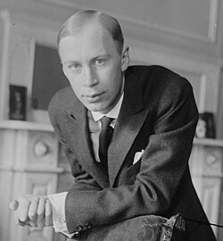

# Sergei Prokofiev

## Biografía

Serguéi Serguéievich Prokófiev (en ruso: Серге́й Серге́евич Проко́фьев; Sóntsovka, 23 de abril de 1891​-Moscú, 5 de marzo de 1953), conocido como Serguéi Prokófiev, fue un compositor, pianista y director de orquesta soviético. Como creador de obras maestras reconocidas en numerosos géneros musicales, es considerado uno de los principales compositores del siglo XX. Sus obras incluyen piezas tan escuchadas como la marcha de El amor de las tres naranjas, la suite El teniente Kijé, el ballet Romeo y Julieta, de donde se toma la «Danza de los caballeros», y Pedro y el lobo. Dentro de las formas y géneros establecidos en los que trabajó, creó siete óperas completas, siete sinfonías, ocho ballets, cinco conciertos para piano, dos conciertos para violín, un concierto para violonchelo, un concierto sinfónico para violonchelo y orquesta, y nueve sonatas para piano completadas. Graduado en el Conservatorio de San Petersburgo, Prokófiev inicialmente se dio a conocer como compositor-pianista iconoclasta y logró notoriedad con una serie de obras ferozmente disonantes y virtuosas para su instrumento, incluidos sus dos primeros conciertos para piano. En 1915, Prokófiev hizo una ruptura decisiva de la categoría estándar de compositor-pianista con su orquestal Suite escita, compilada a partir de música originalmente compuesta para un ballet encargado por Serguéi Diáguilev de los Ballets Rusos. Diáguilev encargó otros tres ballets a Prokófiev: El bufón, El paso de acero y El hijo pródigo, que en el momento de su producción original causaron sensación entre críticos y colegas. Sin embargo, el mayor interés de Prokófiev fue la ópera y compuso varias obras en ese género, incluyendo El jugador y El ángel de fuego. El único éxito operístico de Prokófiev durante su vida fue El amor de las tres naranjas, compuesto para la Ópera de Chicago y posteriormente interpretado durante la siguiente década en Europa y Rusia. Después de la Revolución de 1917, Prokófiev dejó Rusia con la bendición oficial del ministro soviético Anatoli Lunacharski y residió en los Estados Unidos, luego en Alemania, luego en París, y se ganó la vida como compositor, pianista y director de orquesta. Durante ese tiempo, se casó con una cantante española, Carolina (Lina) Codina, con quien tuvo dos hijos. A principios de la década de 1930, la Gran Depresión disminuyó las oportunidades para que los ballets y óperas de Prokófiev se presentaran en Estados Unidos y Europa occidental. Prokófiev, que se consideraba a sí mismo ante todo como compositor, resentía el tiempo que le tomaba hacer una gira como pianista, y recurría cada vez más a la Unión Soviética para solicitar encargos de nueva música. En 1936, finalmente regresó a su tierra natal con su familia. Disfrutó de cierto éxito allí, especialmente con El teniente Kijé, Pedro y el Lobo, Romeo y Julieta, y quizás sobre todo con Alejandro Nevski. La invasión nazi a la Unión Soviética lo impulsó a componer su obra más ambiciosa, una versión operística de Guerra y paz de León Tolstói. En 1948, Prokófiev fue acusado de producir «formalismo antidemocrático». Pese a esa acusación, disfrutó del apoyo personal y artístico de una nueva generación de intérpretes rusos, especialmente Sviatoslav Richter y Mstislav Rostropóvich: escribió su Novena sonata para piano para el primero y su Sinfonía concertante para el segundo.

## Estilo musical

2 Obra Alternar subsección Obra 2.1 Composiciones 2.1.1 Música escénica 2.1.2 Música cinematográfica 2.1.3 Música orquestal 2.1.4 Otras composiciones 2.2 Grabaciones

## Anécdotas y curiosidades

1 Vida y carrera Toggle Subsección Vida y carrera 1.1 Infancia y primeras composiciones 1.2 Educación y primeros trabajos 1.3 Primeros ballets 1.4 Primera Guerra Mundial y Revolución 1.5 Vida en el extranjero 1.6 Primeras visitas a la Unión Soviética 1.7 Regreso a Rusia 1.8 Años de guerra 1.9 Posguerra 1.10 Muerte

## Top 10 bandas sonoras

1. ***Bruckner: Symphony No. 5 (Título en España: Bruckner: Symphony No. 5 (2013))***
    * **Póster:** [link](005_sergei_prokofiev/posters/poster_bruckner_symphony_no_5.jpg)
2. ***The Giant (Título en España: The Giant)***
    * **Póster:** [link](005_sergei_prokofiev/posters/poster_the_giant.jpg)
3. ***Anna Karenina (Título en España: Anna Karenina)***
    * **Póster:** [link](005_sergei_prokofiev/posters/poster_anna_karenina_1997.jpg)
4. ***Je suis le seigneur du château (Título en España: El señor de la gran mansión)***
    * **Póster:** [link](005_sergei_prokofiev/posters/poster_je_suis_le_seigneur_du_ch_teau_1989.jpg)
5. ***Ivan the Terrible. Part III (Título en España: Iván el Terrible, tercera parte)***
    * **Póster:** [link](005_sergei_prokofiev/posters/poster_ivan_the_terrible_part_iii_1988.jpg)
6. ***Бибигон (Título en España: Бибигон)***
    * **Póster:** [link](005_sergei_prokofiev/posters/poster_poster_1981.jpg)
7. ***Caligola (Título en España: Calígula)***
    * **Póster:** [link](005_sergei_prokofiev/posters/poster_caligola_1979.jpg)
8. ***I Believe in Father Christmas (Título en España: I Believe in Father Christmas)***
    * **Póster:** [link](005_sergei_prokofiev/posters/poster_i_believe_in_father_christmas_1975.jpg)
9. ***Love and Death (Título en España: La última noche de Boris Grushenko)***
    * **Póster:** [link](005_sergei_prokofiev/posters/poster_love_and_death_1975.jpg)
10. ***Winstanley (Título en España: Winstanley)***
    * **Póster:** [link](005_sergei_prokofiev/posters/poster_winstanley_1975.jpg)

## Filmografía completa

- Seven, They Are Seven (Título en España: Seven, They Are Seven) (1917) · [Póster](005_sergei_prokofiev/posters/poster_seven_they_are_seven_1917.jpg)
- Violin Concerto No. 1 (Título en España: Concierto para violín n.º 1) (1917) · [Póster](005_sergei_prokofiev/posters/poster_violin_concerto_no_1_1917.jpg)
- Tales of an Old Grandmother (Título en España: Cuentos de la vieja abuela) (1918) · [Póster](005_sergei_prokofiev/posters/poster_tales_of_an_old_grandmother_1918.jpg)
- Kickaroo (Título en España: Kickaroo) (1921) · [Póster](https://example.com/placeholder.jpg)
- Contes de la vieille grand-mère (Título en España: Contes de la vieille grand-mère) (1922) · [Póster](005_sergei_prokofiev/posters/poster_contes_de_la_vieille_grand_m_re_1922.jpg)
- Trapeze (Título en España: Trapeze) (1924) · [Póster](005_sergei_prokofiev/posters/poster_trapeze_1924.jpg)
- The Prodigal Son (Título en España: El hijo pródigo) (1929) · [Póster](005_sergei_prokofiev/posters/poster_the_prodigal_son_1929.jpg)
- Piano Concerto No. 4 (Título en España: Concierto para piano n.º 4) (1931) · [Póster](005_sergei_prokofiev/posters/poster_piano_concerto_no_4_1931.jpg)
- Symphonic Song (Título en España: Symphonic Song) (1933) · [Póster](005_sergei_prokofiev/posters/poster_symphonic_song_1933.jpg)
- Поручик Киже (Título en España: Поручик Киже) (1934) · [Póster](005_sergei_prokofiev/posters/poster_poster_1934.jpg)
- Peter and the Wolf (Título en España: Pedro y el lobo) (1936) · [Póster](005_sergei_prokofiev/posters/poster_peter_and_the_wolf_1936.jpg)
- Songs of Our Days (Título en España: Songs of Our Days) (1937) · [Póster](005_sergei_prokofiev/posters/poster_songs_of_our_days_1937.jpg)
- Arise, Russian people! (Título en España: Arise, Russian people!) (1938) · [Póster](005_sergei_prokofiev/posters/poster_arise_russian_people_1938.jpg)
- Cello Concerto in E minor (Título en España: Cello Concerto in E minor) (1938) · [Póster](005_sergei_prokofiev/posters/poster_cello_concerto_in_e_minor_1938.jpg)
- Zdravitsa (Título en España: Zdravitsa) (1939) · [Póster](https://example.com/placeholder.jpg)
- Partisans in the Steppes of Ukraine (Título en España: Partisans in the Steppes of Ukraine) (1942) · [Póster](005_sergei_prokofiev/posters/poster_partisans_in_the_steppes_of_ukraine_1942.jpg)
- Piano Sonata No. 7 (Título en España: Sonata para piano n.º 7 (Prokófiev)) (1942) · [Póster](005_sergei_prokofiev/posters/poster_piano_sonata_no_7_1942.jpg)
- Violin Sonata No. 2 (Título en España: Violin Sonata No. 2) (1943) · [Póster](005_sergei_prokofiev/posters/poster_violin_sonata_no_2_1943.jpg)
- Flute Sonata (Título en España: Sonata para flauta) (1944) · [Póster](005_sergei_prokofiev/posters/poster_flute_sonata_1944.jpg)
- Piano Sonata No. 8 (Título en España: Sonata para piano n.° 8 (Prokófiev)) (1944) · [Póster](005_sergei_prokofiev/posters/poster_piano_sonata_no_8_1944.jpg)
- Violin Sonata No. 1 in F Minor, Op. 80 (Título en España: Violin Sonata No. 1 in F Minor, Op. 80) (1946) · [Póster](https://example.com/placeholder.jpg)
- Flourish, Mighty Land (Título en España: Flourish, Mighty Land) (1947) · [Póster](005_sergei_prokofiev/posters/poster_flourish_mighty_land_1947.jpg)
- Piano Sonata No. 9 in C major (Título en España: Sonata para piano n.º 9) (1947) · [Póster](005_sergei_prokofiev/posters/poster_piano_sonata_no_9_in_c_major_1947.jpg)
- Symphony-Concerto (Título en España: Sinfonía concertante) (1952) · [Póster](005_sergei_prokofiev/posters/poster_symphony_concerto_1952.jpg)
- Troїka (Título en España: Troїka) (1964) · [Póster](005_sergei_prokofiev/posters/poster_tro_ka_1964.jpg)
- I Believe in Father Christmas (Título en España: I Believe in Father Christmas) (1975) · [Póster](005_sergei_prokofiev/posters/poster_i_believe_in_father_christmas_1975.jpg)
- Love and Death (Título en España: La última noche de Boris Grushenko) (1975) · [Póster](005_sergei_prokofiev/posters/poster_love_and_death_1975.jpg)
- Winstanley (Título en España: Winstanley) (1975) · [Póster](005_sergei_prokofiev/posters/poster_winstanley_1975.jpg)
- Caligola (Título en España: Calígula) (1979) · [Póster](005_sergei_prokofiev/posters/poster_caligola_1979.jpg)
- Caligola (Título en España: Calígula) (1979) · [Póster](005_sergei_prokofiev/posters/poster_caligola_1979.jpg)
- Бибигон (Título en España: Бибигон) (1981) · [Póster](005_sergei_prokofiev/posters/poster_poster_1981.jpg)
- Ivan the Terrible. Part III (Título en España: Iván el Terrible, tercera parte) (1988) · [Póster](005_sergei_prokofiev/posters/poster_ivan_the_terrible_part_iii_1988.jpg)
- Je suis le seigneur du château (Título en España: El señor de la gran mansión) (1989) · [Póster](005_sergei_prokofiev/posters/poster_je_suis_le_seigneur_du_ch_teau_1989.jpg)
- Anna Karenina (Título en España: Anna Karenina) (1997) · [Póster](005_sergei_prokofiev/posters/poster_anna_karenina_1997.jpg)
- Khan Buzay (Título en España: Khan Buzay) (2000) · [Póster](005_sergei_prokofiev/posters/poster_khan_buzay_2000.jpg)
- L'Amour des trois oranges (Título en España: El amor de las tres naranjas) (2000) · [Póster](005_sergei_prokofiev/posters/poster_l_amour_des_trois_oranges_2000.jpg)
- The Fiery Angel (Título en España: El ángel de fuego) (2000) · [Póster](005_sergei_prokofiev/posters/poster_the_fiery_angel_2000.jpg)
- Undina (Título en España: Undina) (2000) · [Póster](005_sergei_prokofiev/posters/poster_undina_2000.jpg)
- Peter und der Wolf (Título en España: Peter und der Wolf) (2003) · [Póster](005_sergei_prokofiev/posters/poster_peter_und_der_wolf_2003.jpg)
- Russian Violin Concertos (Título en España: Russian Violin Concertos) (2004) · [Póster](005_sergei_prokofiev/posters/poster_russian_violin_concertos_2004.jpg)
- Jeu (Título en España: Jeu) (2006) · [Póster](005_sergei_prokofiev/posters/poster_jeu_2006.jpg)
- Peter & the Wolf (Título en España: Pedro y El Lobo) (2006) · [Póster](005_sergei_prokofiev/posters/poster_peter_the_wolf_2006.jpg)
- Alexander Nevsky, op 78 : [programme] (Título en España: Alexander Nevsky, op 78 : [programme]) (2008) · [Póster](005_sergei_prokofiev/posters/poster_alexander_nevsky_op_78_programme_2008.jpg)
- Attends-moi dans l'oubli (Título en España: Attends-moi dans l'oubli) (2024) · [Póster](005_sergei_prokofiev/posters/poster_attends_moi_dans_l_oubli_2024.jpg)
- Boris Godunov (Título en España: Boris Godunov) · [Póster](005_sergei_prokofiev/posters/poster_boris_godunov.jpg)
- Cantata for the 20th Anniversary of the October Revolution (Título en España: Cantata for the 20th Anniversary of the October Revolution) · [Póster](005_sergei_prokofiev/posters/poster_cantata_for_the_20th_anniversary_of_the_october_revolution.jpg)
- Cello Concertino (Título en España: Cello Concertino) · [Póster](005_sergei_prokofiev/posters/poster_cello_concertino.jpg)
- Rostropovich/Richter: Beethoven - The Cello Sonatas (Título en España: Rostropovich/Richter: Beethoven - The Cello Sonatas) · [Póster](005_sergei_prokofiev/posters/poster_rostropovich_richter_beethoven_the_cello_sonatas.jpg)
- Cinderella (Título en España: Cenicienta) · [Póster](005_sergei_prokofiev/posters/poster_cinderella.jpg)
- Divertissement (Prokofiev) (Título en España: Divertissement (Prokofiev)) · [Póster](005_sergei_prokofiev/posters/poster_divertissement_prokofiev.jpg)
- Eugene Onegin (Título en España: Eugene Onegin) · [Póster](005_sergei_prokofiev/posters/poster_eugene_onegin.jpg)
- Four Etudes for Piano (Título en España: Four Etudes for Piano) · [Póster](005_sergei_prokofiev/posters/poster_four_etudes_for_piano.jpg)
- Four Pieces for Piano, Op. 3 (Título en España: Four Pieces for Piano, Op. 3) · [Póster](https://example.com/placeholder.jpg)
- Four Pieces for Piano, Op. 32 (Título en España: Four Pieces for Piano, Op. 32) · [Póster](005_sergei_prokofiev/posters/poster_four_pieces_for_piano_op_32.jpg)
- Four Pieces for Piano, Op. 4 (Prokofiev) (Título en España: Four Pieces for Piano, Op. 4 (Prokofiev)) · [Póster](https://example.com/placeholder.jpg)
- Hamlet (Título en España: Hamlet) · [Póster](005_sergei_prokofiev/posters/poster_hamlet.jpg)
- Ivan The Terrible (Título en España: Ivan The Terrible) · [Póster](005_sergei_prokofiev/posters/poster_ivan_the_terrible.jpg)
- The Man on the Flying Trapeze (Título en España: The Man on the Flying Trapeze) · [Póster](005_sergei_prokofiev/posters/poster_the_man_on_the_flying_trapeze.jpg)
- Le pas d'acier (Título en España: El paso de acero) · [Póster](005_sergei_prokofiev/posters/poster_le_pas_d_acier.jpg)
- March from 'Love for Three Oranges' (Título en España: March from 'Love for Three Oranges') · [Póster](005_sergei_prokofiev/posters/poster_march_from_love_for_three_oranges.jpg)
- Na pustynnikh ostrovakh (Título en España: Na pustynnikh ostrovakh) · [Póster](005_sergei_prokofiev/posters/poster_na_pustynnikh_ostrovakh.jpg)
- На страже мира (Título en España: На страже мира) · [Póster](005_sergei_prokofiev/posters/poster_poster.jpg)
- Голлівуд над Дніпром. Сни з Атлантиди (Título en España: Голлівуд над Дніпром. Сни з Атлантиди) · [Póster](005_sergei_prokofiev/posters/poster_poster.jpg)
- Overture on Hebrew Themes (Título en España: Obertura sobre temas hebreos) · [Póster](005_sergei_prokofiev/posters/poster_overture_on_hebrew_themes.jpg)
- Pensées (Título en España: Pensées) · [Póster](005_sergei_prokofiev/posters/poster_pens_es.jpg)
- Abbado Conducts Mahler No. 1 & Prokofiev Piano Concerto No. 3 (Título en España: Abbado Conducts Mahler No. 1 & Prokofiev Piano Concerto No. 3) · [Póster](005_sergei_prokofiev/posters/poster_abbado_conducts_mahler_no_1_prokofiev_piano_concerto_no_3.jpg)
- Achucarro Brahms Piano Concerto No. 2 (Título en España: Achucarro Brahms Piano Concerto No. 2) · [Póster](005_sergei_prokofiev/posters/poster_achucarro_brahms_piano_concerto_no_2.jpg)
- Abbado Conducts Mahler No. 1 & Prokofiev Piano Concerto No. 3 (Título en España: Abbado Conducts Mahler No. 1 & Prokofiev Piano Concerto No. 3) · [Póster](005_sergei_prokofiev/posters/poster_abbado_conducts_mahler_no_1_prokofiev_piano_concerto_no_3.jpg)
- Beethoven: Piano Concerto No 5, op. 73 (Título en España: Beethoven: Piano Concerto No 5, op. 73) · [Póster](005_sergei_prokofiev/posters/poster_beethoven_piano_concerto_no_5_op_73.jpg)
- Piano Concerto No. 6 (Título en España: Piano Concerto No. 6) · [Póster](005_sergei_prokofiev/posters/poster_piano_concerto_no_6.jpg)
- Piano Sonata No. 1 (Título en España: Piano Sonata No. 1) · [Póster](005_sergei_prokofiev/posters/poster_piano_sonata_no_1.jpg)
- Piano Sonata No. 10 (Título en España: Piano Sonata No. 10) · [Póster](005_sergei_prokofiev/posters/poster_piano_sonata_no_10.jpg)
- Piano Sonata No. 2 (Título en España: Piano Sonata No. 2) · [Póster](005_sergei_prokofiev/posters/poster_piano_sonata_no_2.jpg)
- Piano Sonata No. 3 in A Minor, Op. 28 (Título en España: Sonata para piano n.° 3 (Prokófiev)) · [Póster](005_sergei_prokofiev/posters/poster_piano_sonata_no_3_in_a_minor_op_28.jpg)
- Piano Sonata No. 4 (Título en España: Sonata para piano n.° 4 (Prokófiev)) · [Póster](005_sergei_prokofiev/posters/poster_piano_sonata_no_4.jpg)
- Piano Sonata No. 5 (Título en España: Sonata para piano n.° 5 (Prokófiev)) · [Póster](005_sergei_prokofiev/posters/poster_piano_sonata_no_5.jpg)
- Piano Sonata No. 6 (Título en España: Sonata para piano n.º 6 (Prokófiev)) · [Póster](005_sergei_prokofiev/posters/poster_piano_sonata_no_6.jpg)
- Pushkin Waltzes (Título en España: Dos valses de Pushkin) · [Póster](https://example.com/placeholder.jpg)
- Quintet in G minor (Título en España: Quintet in G minor) · [Póster](005_sergei_prokofiev/posters/poster_quintet_in_g_minor.jpg)
- Romeo and Juliet (Título en España: Romeo y Julieta) · [Póster](005_sergei_prokofiev/posters/poster_romeo_and_juliet.jpg)
- Romeo and Juliet (Título en España: Romeo y Julieta) · [Póster](005_sergei_prokofiev/posters/poster_romeo_and_juliet.jpg)
- Multiple Sarcasms (Título en España: Multiple Sarcasms) · [Póster](005_sergei_prokofiev/posters/poster_multiple_sarcasms.jpg)
- Scythian Suite (Título en España: Suite escita) · [Póster](005_sergei_prokofiev/posters/poster_scythian_suite.jpg)
- Semyon Kotko (Título en España: Semyon Kotko) · [Póster](005_sergei_prokofiev/posters/poster_semyon_kotko.jpg)
- Hacken Lee And Hong Kong Sinfonietta  Live 2011 (Título en España: Hacken Lee And Hong Kong Sinfonietta  Live 2011) · [Póster](005_sergei_prokofiev/posters/poster_hacken_lee_and_hong_kong_sinfonietta_live_2011.jpg)
- Sonata for Solo Cello in C-sharp Minor (Título en España: Sonata for Solo Cello in C-sharp Minor) · [Póster](005_sergei_prokofiev/posters/poster_sonata_for_solo_cello_in_c_sharp_minor.jpg)
- Sonata for Solo Violin (Título en España: Sonata for Solo Violin) · [Póster](005_sergei_prokofiev/posters/poster_sonata_for_solo_violin.jpg)
- Sonata for Two Violins (Título en España: Sonata for Two Violins) · [Póster](005_sergei_prokofiev/posters/poster_sonata_for_two_violins.jpg)
- Schubert - String Quartet No. 14 - Death and the Maiden (Título en España: Schubert - String Quartet No. 14 - Death and the Maiden) · [Póster](005_sergei_prokofiev/posters/poster_schubert_string_quartet_no_14_death_and_the_maiden.jpg)
- String Quartet No. 2 in F Major (Título en España: String Quartet No. 2 in F Major) · [Póster](005_sergei_prokofiev/posters/poster_string_quartet_no_2_in_f_major.jpg)
- Lucerne Festival: Mahler: Symphony No. 1; Prokofiev: Piano Concerto No.3 (Título en España: Lucerne Festival: Mahler: Symphony No. 1; Prokofiev: Piano Concerto No.3) · [Póster](005_sergei_prokofiev/posters/poster_lucerne_festival_mahler_symphony_no_1_prokofiev_piano_concerto_no_3.jpg)
- Bruckner: Symphony No. 2 (Título en España: Bruckner: Symphony No. 2 (2019)) · [Póster](005_sergei_prokofiev/posters/poster_bruckner_symphony_no_2.jpg)
- Bruckner: Symphony No. 3 (Título en España: Bruckner: Symphony No. 3 (2016)) · [Póster](005_sergei_prokofiev/posters/poster_bruckner_symphony_no_3.jpg)
- Bruckner: Symphony No. 4 (Título en España: Bruckner: Symphony No. 4 (2015)) · [Póster](005_sergei_prokofiev/posters/poster_bruckner_symphony_no_4.jpg)
- Bruckner: Symphony No. 5 (Título en España: Bruckner: Symphony No. 5 (2013)) · [Póster](005_sergei_prokofiev/posters/poster_bruckner_symphony_no_5.jpg)
- Bruckner: Symphony No. 6 (Título en España: Bruckner: Symphony No. 6 (2015)) · [Póster](005_sergei_prokofiev/posters/poster_bruckner_symphony_no_6.jpg)
- Bruckner: Symphony No. 7 (Título en España: Bruckner: Symphony No. 7) · [Póster](005_sergei_prokofiev/posters/poster_bruckner_symphony_no_7.jpg)
- Ten Pieces for Piano (Título en España: Ten Pieces for Piano) · [Póster](005_sergei_prokofiev/posters/poster_ten_pieces_for_piano.jpg)
- The Giant (Título en España: The Giant) · [Póster](005_sergei_prokofiev/posters/poster_the_giant.jpg)
- The Queen of Spades (Título en España: La dama blanca (Reina de espadas)) · [Póster](005_sergei_prokofiev/posters/poster_the_queen_of_spades.jpg)
- The Tale of the Stone Flower (Título en España: The Tale of the Stone Flower) · [Póster](005_sergei_prokofiev/posters/poster_the_tale_of_the_stone_flower.jpg)
- The Ugly Duckling (Título en España: El patito feo) · [Póster](005_sergei_prokofiev/posters/poster_the_ugly_duckling.jpg)
- Theodor W. Adorno Rüsselmanns Heimkehr (Título en España: Theodor W. Adorno Rüsselmanns Heimkehr) · [Póster](005_sergei_prokofiev/posters/poster_theodor_w_adorno_r_sselmanns_heimkehr.jpg)
- Three Pieces, Op. 59 (Título en España: Three Pieces, Op. 59) · [Póster](005_sergei_prokofiev/posters/poster_three_pieces_op_59.jpg)
- Three Pieces, Op. 96 (Título en España: Three Pieces, Op. 96) · [Póster](005_sergei_prokofiev/posters/poster_three_pieces_op_96.jpg)
- Toccata (Título en España: Toccata) · [Póster](005_sergei_prokofiev/posters/poster_toccata.jpg)
- Williams: Violin Concerto No. 2 & Selected Film Themes (Título en España: Williams: Violin Concerto No. 2 & Selected Film Themes) · [Póster](005_sergei_prokofiev/posters/poster_williams_violin_concerto_no_2_selected_film_themes.jpg)
- Visions Fugitives (Título en España: Visions Fugitives) · [Póster](005_sergei_prokofiev/posters/poster_visions_fugitives.jpg)
- 新機動戦記ガンダムＷ Endless Waltz 特別篇 (Título en España: Mobile Suit Gundam Wing ENDLESS WALTZ) · [Póster](005_sergei_prokofiev/posters/poster_endless_waltz.jpg)
- Winter Bonfire (Título en España: Winter Bonfire) · [Póster](005_sergei_prokofiev/posters/poster_winter_bonfire.jpg)
- Cinderella (Título en España: Cenicienta) · [Póster](005_sergei_prokofiev/posters/poster_cinderella.jpg)
- Детская музыка. 12 легких пьес для ф-п. (Título en España: Детская музыка. 12 легких пьес для ф-п.) · [Póster](005_sergei_prokofiev/posters/poster_12.jpg)

## Premios y nominaciones

* 1943 – Premio Stalin – (Ganador)
* 1944 – Medalla de oro de la Real Sociedad Filarmónica – (Ganador)
* 1946 – Premio Stalin – (Ganador)
* 1946 – Premio Stalin – por *Bruckner: Symphony No. 5 (Título en España: Bruckner: Symphony No. 5 (2013))* – (Ganador)
* 1947 – Premio Stalin – (Ganador)
* 1952 – Premio Stalin – (Ganador)
* 1957 – Premio Lenin – (Ganador)
* Artista del Pueblo de la RSFSR – (Ganador)
* Honrado trabajador del arte de la República Socialista Federativa Soviética de Rusia – (Ganador)
* Medalla "En Conmemoración del 800 Aniversario de Moscú" – (Ganador)
* Medalla "Por el trabajo valiente en la Gran Guerra Patria 1941-1945" – (Ganador)
* Orden de la Bandera Roja del Trabajo – (Ganador)
* Premio Estatal Stalin, 1er grado – (Ganador)
* Premio Stalin, 2do grado – (Ganador)

## Fuentes adicionales

* [MundoBSO](https://w.mundobso.com/bso/cartero-siempre-llama-dos-veces-el) — site:mundobso.com
* [MundoBSO (2)](https://www.mundobso.com/bso/milla-verde-la) — site:mundobso.com
* [MundoBSO (3)](https://www.mundobso.com/bso/bucaneros-los) — site:mundobso.com
* [Film Score Monthly](https://www.filmscoremonthly.com/board/posts.cfm?threadID=60129&archive=0) — site:filmscoremonthly.com
* [Film Score Monthly (2)](https://www.filmscoremonthly.com/board/posts.cfm?forumID=1&pageID=2&threadID=37305&archive=1) — site:filmscoremonthly.com
* [Film Score Monthly (3)](https://www.filmscoremonthly.com/faq.cfm) — site:filmscoremonthly.com
* [SoundtrackCollector](https://www.soundtrackcollector.com) — site:soundtrackcollector.com
* [SoundtrackCollector (2)](https://soundtrackcollector.com) — site:soundtrackcollector.com
* [SoundtrackCollector (3)](https://www.soundtrackcollector.com/title/39858/Prokofiev:+The+Film+Music) — site:soundtrackcollector.com
* [WhatSong](https://www.whatsong.org/movie/sing-2) — site:whatsong.org
* [WhatSong (2)](https://www.whatsong.org/movie/analyze-this) — site:whatsong.org
* [WhatSong (3)](https://www.whatsong.org) — site:whatsong.org

## Notas externas

* MundoBSO (2): Compositor: Newman, Thomas Sello: Warner Duración: 66 minutos Información de la película Título original: The Green Mile Director: Frank Darabont Nacionalidad: EE UU Año: 1999 Argumento A mediados de los años treinta, un guarda de prisiones que custodia a los condenados a muerte descubre poderes sobrenaturales en un inmenso hombre negro, acusado de haber asesinado a dos niñas. Eso le llevará a creer en su inocencia. Premios Saturn: 1 nominación Compositor: Newman, Thomas Sello: Warner Duración: 66 minutos
* MundoBSO (3): Compositor: Bernstein, Elmer Sello: DRG Duración: 41 minutos Información de la película Título original: The Buccaneer Director: Anthony Quinn Nacionalidad: EE UU Año: 1958 Argumento Aventuras de corsarios y piratas ambientada en el marco histórico de dos guerras: la franco-británica y la marítima de 1812 contra Estados Unidos a causa de la ley de no intercambio comercial con éste país. Compositor: Bernstein, Elmer Sello: DRG Duración: 41 minutos
* SoundtrackCollector: 14 de enero - Confesión de un comisionado de policía de Riz Ortolani a la fiscalía 3 de diciembre - Wolf Hall de Debbie Wiseman: El espejo y la luz
* WhatSong: Tori Kelly - Sing 2 (Banda sonora original de la película) Kiana Ledé - Sing 2 (Banda sonora original de la película)
* WhatSong (2): Louis Prima - Serie Capitol Collectors: Louis Prima Marky Mark and the Funky Bunch - Blades of Glory (banda sonora original de la película)
* WhatSong (3): La mejor fuente en línea de música de películas y televisión. Copyright © 2018 - 2026 Whatsong.org. Reservados todos los derechos.
* www.classical-music.com: Conozca a Sergey Prokofiev, el maestro ruso del drama, la orquestación y el ingenio sardónico. Compite con Dimitri Shostakovich como el compositor ruso más importante del siglo XX. Sin embargo, Sergey Prokofiev no siempre pareció el típico compositor.
* open.spotify.com: Iván el Terrible, op. 116, parte. 1: Prólogo. Obertura Sergei Prokofiev, Sinfónica de San Luis, Leonard Slatkin
* www.pnb.org: Planifique su visita Direcciones e información sobre el lugar de estacionamiento Ofertas de accesibilidad Plano de asientos de McCaw Hall Certificados de regalo Clases y programas escolares Verano // Seattle FRC Verano // Bellevue Acerca de la escuela PNB
* www.jeanmichelserres.com: Jean-Michel Serres, compositor y pianista (Apfel Café Music): sitio web Lanzamientos de música clásica Todos los lanzamientos de música clásica Charles Koechlin Mel Bonis Moritz Moszkowski Oskar Merikanto Cécile Chaminade Erik Satie
* www.britannica.com: Nuestros editores revisarán lo que ha enviado y determinarán si deben revisar el artículo. Sociedad de Música de Cámara del Lincoln Center - ¿Quién fue Sergei Prokofiev? Una breve introducción
* www.moviemusic.com: ¡Registros aleatorios! El largo viaje a casa Temas de General Electric Theatre (TV) Nunca digas nunca jamás Capitán América El primer vengador Pura suerte... buscar más Centro de ayuda Mi cuenta Cómo realizar un pedido Consejos de búsqueda Política de devolución/reembolso Cancelación de su pedido Comuníquese con la tienda
