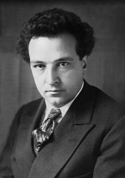

# Arthur Honegger

## Biografía

Arthur Honegger (El Havre, 10 de marzo de 1892 - París, 27 de noviembre de 1955) fue un compositor suizo nacido en Francia y que vivió la mayor parte de su vida en París. Fue miembro del grupo de Los Seis. Su obra más interpretada probablemente es la pieza orquestal Pacific 231, inspirada por el sonido de una locomotora de vapor.

## Estilo musical

Entre sus primeras obras notables se encuentran sus Six Poèmes d'Apollinaire (poemas de Alcools), estrenado en 1916 y 1918; 'Hommage à Ravel' de las Trois pièces pour piano (1915); Cuatro poemas H. 7 (1914-1916); [6] Tres poemas de Paul Fort (1916); su muy debussiano Prélude pour Aglavaine et Sélysette (inspirado en la obra de Maurice Maeterlinck: el preludio se estrenó en la clase orquestal en 1917, con un estreno público en 1920); Le Dit des Jeux du monde, encargado en abril de 1918 por el poeta belga Paul Méral [fr], estrenado por Walther Straram en el Théâtre du Vieux-Colombier de Jane Bathori, en diciembre de 1918 (Compuesto por trece piezas breves que a veces evocan a Schönberg, esta obra dedicada a Fernand Ochsé, "causó un escándalo comparable en todos los sentidos a los de La consagración de la primavera o de Desfile " [ 7 ] ); Le Chant de Nigamon (1918, estreno público por la Orquesta Pasdeloup en 1920: su primera pieza sinfónica, inspirada en la novela de aventuras Le Souriquet de Gustave Aimard con temas nativos americanos (gracias a las Notes d'ethnographie musicale de Julien Tiersot); su primer cuarteto de cuerda, "la primera obra maestra plenamente realizada del compositor" (Halbreich 1992, p. 311) estrenado en 1919 por el Quatuor Capelle; música para Vérité Mensonge?, un ballet de André Hellé: [ 8 ] cuatro de los diez cuadros se estrenaron en el Salon d'automne, el 25 de noviembre de 1920, [ 9 ] con Yvonne Daunt y en 1920-1921 Pastorale d'été estrenado por Vladimir Golschmann.

## Anécdotas y curiosidades

Gran Oficial de la Orden Nacional de la Legión de Honor

Compositor: Williams, John Sello: La-La Land Duración: 229 minutos Información de la película Título original: Superman Director: Richard Donner Nacionalidad: EE UU Año: 1978 Argumento Las aventuras del volador héroe del cómic llevadas a la gran pantalla, en su empeño de mantener la paz contra los planes de un villano. Premios Oscar: 1 nominación Globos de oro: 1 nominación Grammy: 1 premio Saturn: 1 premio Compositor: Williams, John Sello: La-La Land Duración: 229 minutos

## Top 10 bandas sonoras

1. ***Napoléon (Título en España: Napoléon)***
    * **Póster:** [link](006_arthur_honegger/posters/poster_napol_on_1927.jpg)
2. ***Les Misérables (Título en España: Los miserables)***
    * **Póster:** [link](006_arthur_honegger/posters/poster_les_mis_rables_1934.jpg)
3. ***Mayerling (Título en España: Sueños de príncipe)***
    * **Póster:** [link](006_arthur_honegger/posters/poster_mayerling_1936.jpg)
4. ***Un revenant (Título en España: Un revenant)***
    * **Póster:** [link](006_arthur_honegger/posters/poster_un_revenant_1946.jpg)
5. ***Rapt (Título en España: Rapt)***
    * **Póster:** [link](006_arthur_honegger/posters/poster_rapt_1934.jpg)
6. ***Fait-divers (Título en España: Fait-divers)***
    * **Póster:** [link](006_arthur_honegger/posters/poster_fait_divers_1923.jpg)
7. ***Cavalcade d'amour (Título en España: Cavalcade d'amour)***
    * **Póster:** [link](006_arthur_honegger/posters/poster_cavalcade_d_amour_1939.jpg)
8. ***La fin du monde (Título en España: El fin del mundo)***
    * **Póster:** [link](006_arthur_honegger/posters/poster_la_fin_du_monde_1931.jpg)
9. ***The Woman I Love (Título en España: The Woman I Love)***
    * **Póster:** [link](006_arthur_honegger/posters/poster_the_woman_i_love_1937.jpg)
10. ***La Citadelle du silence (Título en España: La Citadelle du silence)***
    * **Póster:** [link](006_arthur_honegger/posters/poster_la_citadelle_du_silence_1937.jpg)

## Filmografía completa

- Fait-divers (Título en España: Fait-divers) (1923) · [Póster](006_arthur_honegger/posters/poster_fait_divers_1923.jpg)
- Napoléon (Título en España: Napoléon) (1927) · [Póster](006_arthur_honegger/posters/poster_napol_on_1927.jpg)
- La fin du monde (Título en España: El fin del mundo) (1931) · [Póster](006_arthur_honegger/posters/poster_la_fin_du_monde_1931.jpg)
- Les Misérables (Título en España: Los miserables) (1934) · [Póster](006_arthur_honegger/posters/poster_les_mis_rables_1934.jpg)
- Rapt (Título en España: Rapt) (1934) · [Póster](006_arthur_honegger/posters/poster_rapt_1934.jpg)
- Roi de Camargue (Título en España: Roi de Camargue) (1935) · [Póster](006_arthur_honegger/posters/poster_roi_de_camargue_1935.jpg)
- Mayerling (Título en España: Sueños de príncipe) (1936) · [Póster](006_arthur_honegger/posters/poster_mayerling_1936.jpg)
- La Citadelle du silence (Título en España: La Citadelle du silence) (1937) · [Póster](006_arthur_honegger/posters/poster_la_citadelle_du_silence_1937.jpg)
- The Woman I Love (Título en España: The Woman I Love) (1937) · [Póster](006_arthur_honegger/posters/poster_the_woman_i_love_1937.jpg)
- Cavalcade d'amour (Título en España: Cavalcade d'amour) (1939) · [Póster](006_arthur_honegger/posters/poster_cavalcade_d_amour_1939.jpg)
- Un revenant (Título en España: Un revenant) (1946) · [Póster](006_arthur_honegger/posters/poster_un_revenant_1946.jpg)
- Honegger’s “Jeanne d’Arc au bûcher” with Alan Gilbert and Marion Cotillard (Título en España: Honegger’s “Jeanne d’Arc au bûcher” with Alan Gilbert and Marion Cotillard) (2024) · [Póster](006_arthur_honegger/posters/poster_honegger_s_jeanne_d_arc_au_b_cher_with_alan_gilbert_and_marion_cotillard_2024.jpg)
- Arthur Honegger : Le Roi David Avec Amira Casar et Lambert Wilson (Título en España: Arthur Honegger : Le Roi David Avec Amira Casar et Lambert Wilson) (2025) · [Póster](006_arthur_honegger/posters/poster_arthur_honegger_le_roi_david_avec_amira_casar_et_lambert_wilson_2025.jpg)

## Premios y nominaciones

* Gran Oficial de la Legión de Honor – (Ganador)
* Miembro Honorario de la Sociedad Internacional de Música Contemporánea – (Ganador)

## Fuentes adicionales

* [MundoBSO](https://www.mundobso.com/bso/superman) — site:mundobso.com
* [MundoBSO (2)](https://www.mundobso.com/compositor/honegger-arthur) — site:mundobso.com
* [MundoBSO (3)](https://www.mundobso.com/bso/capitan-america-civil-war) — site:mundobso.com
* [Film Score Monthly](https://www.filmscoremonthly.com/board/posts.cfm?archive=0&forumID=1&threadID=147393) — site:filmscoremonthly.com
* [Film Score Monthly (2)](https://www.filmscoremonthly.com/board/posts.cfm?threadID=147393&forumID=1&archive=0) — site:filmscoremonthly.com
* [Film Score Monthly (3)](https://filmscoremonthly.com/board/posts.cfm?threadID=80553&forumID=1&archive=0) — site:filmscoremonthly.com
* [SoundtrackCollector](https://www.soundtrackcollector.com/title/11585/Crime+Et+Ch%C3%A2timent) — site:soundtrackcollector.com
* [SoundtrackCollector (2)](https://www.soundtrackcollector.com/title/2160/Napol%C3%A9on) — site:soundtrackcollector.com
* [SoundtrackCollector (3)](https://www.soundtrackcollector.com/title/11935/Mayerling) — site:soundtrackcollector.com
* [WhatSong](https://www.whatsong.org/tvshow/how-i-met-your-mother/episode/44483) — site:whatsong.org
* [WhatSong (2)](https://www.whatsong.org/tvshow/grown-ish/episode/82123) — site:whatsong.org
* [WhatSong (3)](https://www.whatsong.org/tvshow/prison-break/episode/37396) — site:whatsong.org

## Notas externas

* MundoBSO: Compositor: Williams, John Sello: La-La Land Duración: 229 minutos Información de la película Título original: Superman Director: Richard Donner Nacionalidad: EE UU Año: 1978 Argumento Las aventuras del volador héroe del cómic llevadas a la gran pantalla, en su empeño de mantener la paz contra los planes de un villano. Premios Oscar: 1 nominación Globos de oro: 1 nominación Grammy: 1 premio Saturn: 1 premio Compositor: Williams, John Sello: La-La Land Duración: 229 minutos
* MundoBSO (2): Nació en Le Havre (Francia), el 10 de marzo de 1892 y muerto en París (Francia), el 27 de noviembre de 1955. En la década de los veinte formó parte del grupo "Les Six", en el que desenvolvió lenta, pero cómodamente, hasta madurar su propio estilo musical, imbuido por el jazz pero también por músicos como Debussy o Stravinsky. Colaboró en el cine de su país y en él escribió buena parte de su mejor obra sinfónica. Nació en Le Havre (Francia), el 10 de marzo de 1892 y muerto en París (Francia), el 27 de noviembre de 1955. En la década de los veinte formó parte del grupo "Les Six", en el que desenvolvió lenta, pero cómodamente, hasta madurar su propio estilo musical, imbuido por el jazz pero...
* MundoBSO (3): Compositor: Jackman, Henry Sello: Hollywood Duración: 69 minutos Información de la película Título original: Captain America: Civil War Director: Anthony Russo, Joe Russo Nacionalidad: EE UU Año: 2016 Argumento Continuación de Captain America: The Winter Soldier (14). Cuando otro incidente internacional involucra a Los Vengadores y causan varios daños colaterales, aumentan las presiones políticas para exigir más responsabilidades y determinar cuándo deben contratar los servicios del grupo de superhéroes. Esta nueva situación dividirá a Los Vengadores, mientras intentan proteger al mundo de un nuevo y terrible villano. Compositor: Jackman, Henry Sello: Hollywood Duración: 69 minutos
* WhatSong: Lily y Robin bailan con los dos nerds del último año de secundaria. Se reproduce de fondo cuando Lilly, Robin y Barney intentan entrar a la fiesta. La canción es una canción que está incluida en iMovie.
* WhatSong (2): Luca está pensando en él y en el encuentro sexual de Zoey de la noche anterior. Luca está estresado por su "yo". Texto a Zoey y su falta de respuesta.
* WhatSong (3): Ramin Djawadi - Prison Break: Temporadas 3 y 4 (Banda sonora original de televisión) Ramin Djawadi - Prison Break: Temporadas 3 y 4 (Banda sonora original de televisión)
* www.historiadelasinfonia.es: Arthur Honegger (1892-1955) es de origen suizo, pero nació y transcurrió la mayor parte de su vida en Francia, siendo uno de los más destacados miembros del Grupo de los Seis, aunque discrepaba de su estilo. Su obra sinfónica es un trabajo de madurez, que muestra un estilo personal inclinado hacia una seria interpretación del drama humano, sin abandonar la tonalidad. Un acusado pesimismo y escepticismo le acompañará durante los últimos años de su vida. Nació en Le Havre, ciudad del norte de Francia, el 10 de marzo de 1892. Sus padres eran suizos de religión protestante, del cantón de Zürich. Su padre se había instalado en la colonia suiza que vivía en Le Havre, trabajando en el comercio del...
* holocaustmusic.ort.org: Temas arrow_drop_down Política y propaganda Resistencia y exilio Restauración y restitución Respuestas Memoria Música y genocidio Película del Holocausto Honegger nació en Le Havre, Suiza, en 1892. Mostró aptitudes para componer desde muy joven y se unió al Conservatorio de Zurich en 1909, donde asistió a recitales de obras de compositores contemporáneos como Richard Strauss y Max Reger. Se mudó a París para estudiar en el Conservatorio de París bajo la dirección de Gabriel Fauré, donde conoció a sus compañeros Darius Milhaud, Jacques Ibert y Germaine Tailleferre. En 1915 conoció a Francis Poulenc, Erik Satie y Jean Cocteau. Honegger, Poulenc, Milhaud y Tailleferre – con Georges Auric y Louis Durey...
* www.diy.org: Arthur Honegger fue un compositor suizo conocido por su música imaginativa, nacido en Francia y pasó la mayor parte de su vida en París, contribuyendo significativamente a la música clásica. Arthur Honegger fue un talentoso compositor suizo nacido el 10 de marzo de 1892 en Le Havre, Francia. 🎶Es mejor conocido por su estilo único, que mezcla música clásica y jazz. Honegger vivió en París la mayor parte de su vida, lo que dio forma a su música. Se convirtió en miembro de un grupo llamado "Les Six", un grupo de seis compositores que querían crear nueva música después de la Primera Guerra Mundial, ¡haciéndola emocionante y diferente! Las obras de Honegger todavía son amadas hoy en día y creó música tanto para conciertos como para películas. 🌟
* academia-lab.com: Arthur Honegger ( francés: [aʁtyʁ ɔnɛɡɛːʁ]; 10 de marzo de 1892 - 27 de noviembre de 1955) fue un compositor suizo que nació en Francia y vivió gran parte de su vida en París. Miembro de Les Six, su obra más conocida es probablemente Antigone, compuesta entre 1924 y 1927 con libreto en francés de Jean Cocteau a partir de la tragedia Antigone de Sófocles. Se estrenó el 28 de diciembre de 1927 en el Théâtre Royal de la Monnaie con decorados diseñados por Pablo Picasso y vestuario de Coco Chanel. Sin embargo, su obra interpretada con mayor frecuencia es probablemente la obra orquestal Pacific 231, que se inspiró en el sonido de una locomotora de vapor. Nacido Oscar-Arthur Honegger (el primer...
* www.britannica.com: Nuestros editores revisarán lo que ha enviado y determinarán si deben revisar el artículo. La música y el Holocausto - Biografía de Arthur Honegger
* arthur-honegger.com: La Obra Catálogo de obras Música de Cámara Música orquestal Música lírica Extractos musicales Discografía selectiva Catálogo de obras Música de Cámara Música orquestal Música lírica
