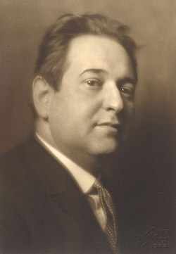

# Erich Wolfgang Korngold

## Biografía

Erich Wolfgang Korngold (Brno, 29 de mayo de 1897-Los Ángeles, Estados Unidos, 29 de noviembre de 1957) fue un compositor y director de orquesta nacido en el Imperio austrohúngaro y posteriormente nacionalizado estadounidense en 1943. Fue un niño prodigio, que llegó a ser uno de los más importantes e influyentes compositores de la historia de Hollywood, así como un notable pianista.​​ Compuso además cinco óperas y varias obras orquestales, de cámara y canciones.

## Estilo musical

Compositor y director de orquesta, niño prodigio, notable pianista, austríaco de origen y nacionalizado estadounidense en 1943, que llegó a ser uno de los más grandes e influyentes de la época de oro de Hollywood y de la historia de la música de cine. Además de su incursión en el séptimo arte brilló en la música culta, con 5 óperas y varias obras orquestales, de cámara y canciones en su haber.

## Anécdotas y curiosidades

Erich Wolfgang Korngold, uno de los prodigios de la composición más célebres de todos los tiempos y pionero en el desarrollo de la banda sonora clásica de Hollywood, nació en Brünn, Moravia, el 29 de mayo de 1897, segundo hijo de Julius Korngold y Josephine Witrofsky. La familia se mudó a Viena en 1901, y en 1904 Julius sucedió a su mentor, Eduard Hanslick, como crítico musical jefe del influyente diario Neue Freie Presse, cargo que ocupó hasta 1934.

## Top 10 bandas sonoras

1. ***The Sea Hawk (Título en España: El halcón del mar)***
    * **Póster:** [link](010_erich_wolfgang_korngold/posters/poster_the_sea_hawk_1940.jpg)
2. ***The Private Lives of Elizabeth and Essex (Título en España: La vida privada de Elisabeth y Essex)***
    * **Póster:** [link](010_erich_wolfgang_korngold/posters/poster_the_private_lives_of_elizabeth_and_essex_1939.jpg)
3. ***The Adventures of Robin Hood (Título en España: Robin de los bosques)***
    * **Póster:** [link](010_erich_wolfgang_korngold/posters/poster_the_adventures_of_robin_hood_1938.jpg)
4. ***Captain Blood (Título en España: El capitán Blood)***
    * **Póster:** [link](010_erich_wolfgang_korngold/posters/poster_captain_blood_1935.jpg)
5. ***Deception (Título en España: Engaño)***
    * **Póster:** [link](010_erich_wolfgang_korngold/posters/poster_deception_1946.jpg)
6. ***Kings Row (Título en España: Abismo de pasión)***
    * **Póster:** [link](010_erich_wolfgang_korngold/posters/poster_kings_row_1942.jpg)
7. ***Anthony Adverse (Título en España: El caballero Adverse)***
    * **Póster:** [link](010_erich_wolfgang_korngold/posters/poster_anthony_adverse_1936.jpg)

## Filmografía completa

- A Dream Comes True (Título en España: A Dream Comes True) (1935) · [Póster](010_erich_wolfgang_korngold/posters/poster_a_dream_comes_true_1935.jpg)
- Captain Blood (Título en España: El capitán Blood) (1935) · [Póster](010_erich_wolfgang_korngold/posters/poster_captain_blood_1935.jpg)
- Anthony Adverse (Título en España: El caballero Adverse) (1936) · [Póster](010_erich_wolfgang_korngold/posters/poster_anthony_adverse_1936.jpg)
- Give Us This Night (Título en España: Give Us This Night) (1936) · [Póster](010_erich_wolfgang_korngold/posters/poster_give_us_this_night_1936.jpg)
- The Green Pastures (Título en España: The Green Pastures) (1936) · [Póster](010_erich_wolfgang_korngold/posters/poster_the_green_pastures_1936.jpg)
- The Prince and the Pauper (Título en España: El príncipe y el mendigo) (1937) · [Póster](010_erich_wolfgang_korngold/posters/poster_the_prince_and_the_pauper_1937.jpg)
- Another Dawn (Título en España: Otro amanecer) (1937) · [Póster](010_erich_wolfgang_korngold/posters/poster_another_dawn_1937.jpg)
- The Adventures of Robin Hood (Título en España: Robin de los bosques) (1938) · [Póster](010_erich_wolfgang_korngold/posters/poster_the_adventures_of_robin_hood_1938.jpg)
- Juarez (Título en España: Juárez) (1939) · [Póster](010_erich_wolfgang_korngold/posters/poster_juarez_1939.jpg)
- The Private Lives of Elizabeth and Essex (Título en España: La vida privada de Elisabeth y Essex) (1939) · [Póster](010_erich_wolfgang_korngold/posters/poster_the_private_lives_of_elizabeth_and_essex_1939.jpg)
- The Sea Hawk (Título en España: El halcón del mar) (1940) · [Póster](010_erich_wolfgang_korngold/posters/poster_the_sea_hawk_1940.jpg)
- The Sea Wolf (Título en España: El lobo de mar) (1941) · [Póster](010_erich_wolfgang_korngold/posters/poster_the_sea_wolf_1941.jpg)
- Kings Row (Título en España: Abismo de pasión) (1942) · [Póster](010_erich_wolfgang_korngold/posters/poster_kings_row_1942.jpg)
- The Constant Nymph (Título en España: La ninfa constante) (1943) · [Póster](010_erich_wolfgang_korngold/posters/poster_the_constant_nymph_1943.jpg)
- Between Two Worlds (Título en España: Entre dos mundos) (1944) · [Póster](010_erich_wolfgang_korngold/posters/poster_between_two_worlds_1944.jpg)
- Of Human Bondage (Título en España: Cautivo del deseo) (1946) · [Póster](010_erich_wolfgang_korngold/posters/poster_of_human_bondage_1946.jpg)
- Deception (Título en España: Engaño) (1946) · [Póster](010_erich_wolfgang_korngold/posters/poster_deception_1946.jpg)
- Devotion (Título en España: Predilección) (1946) · [Póster](010_erich_wolfgang_korngold/posters/poster_devotion_1946.jpg)
- Escape Me Never (Título en España: Nunca huyas de mí) (1947) · [Póster](010_erich_wolfgang_korngold/posters/poster_escape_me_never_1947.jpg)
- Magic Fire (Título en España: Fuego mágico) (1955) · [Póster](010_erich_wolfgang_korngold/posters/poster_magic_fire_1955.jpg)
- Die tote Stadt (Título en España: Die tote Stadt) (1999) · [Póster](010_erich_wolfgang_korngold/posters/poster_die_tote_stadt_1999.jpg)
- Die Tote Stadt (Título en España: Die Tote Stadt) (2009) · [Póster](010_erich_wolfgang_korngold/posters/poster_die_tote_stadt_2009.jpg)
- Die tote Stadt (Título en España: Die tote Stadt) (2010) · [Póster](010_erich_wolfgang_korngold/posters/poster_die_tote_stadt_2010.jpg)
- Die tote Stadt (Título en España: Die tote Stadt) (2018) · [Póster](010_erich_wolfgang_korngold/posters/poster_die_tote_stadt_2018.jpg)
- Pioniere der Filmmusik - Europas Sound für Hollywood (Título en España: Pioniere der Filmmusik - Europas Sound für Hollywood) (2024) · [Póster](010_erich_wolfgang_korngold/posters/poster_pioniere_der_filmmusik_europas_sound_f_r_hollywood_2024.jpg)

## Premios y nominaciones

* 1939 – Premio de la Academia a la mejor banda sonora original – por *The Adventures of Robin Hood (Título en España: Robin de los bosques)* – (Ganador)
* 1939 – Premio de la Academia a la mejor banda sonora original – por *The Adventures of Robin Hood (Título en España: Robin de los bosques)* – (Nominación)
* 1940 – Premio de la Academia a la mejor banda sonora, adaptación o tratamiento – por *The Private Lives of Elizabeth and Essex (Título en España: La vida privada de Elisabeth y Essex)* – (Nominación)
* 1941 – Premio de la Academia a la mejor banda sonora, adaptación o tratamiento – por *The Sea Hawk (Título en España: El halcón del mar)* – (Nominación)

## Fuentes adicionales

* [MundoBSO](https://www.mundobso.com/agoras/anos-dorados-i-de-korngold-a-steiner) — site:mundobso.com
* [MundoBSO (2)](https://www.mundobso.com/bso/sueno-de-una-noche-de-verano-el) — site:mundobso.com
* [MundoBSO (3)](https://w.mundobso.com/bso/cartero-siempre-llama-dos-veces-el) — site:mundobso.com
* [Film Score Monthly](https://www.filmscoremonthly.com/cds/detail.cfm/CDID/392/Kings-Row-The-Sea-Wolf/) — site:filmscoremonthly.com
* [Film Score Monthly (2)](https://filmscoremonthly.com/cds/detail.cfm/CDID/31/Prince-of-Foxes/) — site:filmscoremonthly.com
* [Film Score Monthly (3)](https://www.filmscoremonthly.com/daily/article.cfm/articleID/3643/CD-Reviews-Green-Dragon-and-The-Sea-Hawk/) — site:filmscoremonthly.com
* [SoundtrackCollector](https://www.soundtrackcollector.com/title/8816/Music+By+Erich+Wolfgang+Korngold) — site:soundtrackcollector.com
* [SoundtrackCollector (2)](https://www.soundtrackcollector.com/title/2508/Sea+Hawk,+The) — site:soundtrackcollector.com
* [SoundtrackCollector (3)](https://www.soundtrackcollector.com/title/1929/Kings+Row) — site:soundtrackcollector.com
* [WhatSong](https://www.whatsong.org/movie/the-big-lebowski) — site:whatsong.org
* [WhatSong (2)](https://www.whatsong.org/tvshow/how-i-met-your-mother/episode/44483) — site:whatsong.org
* [WhatSong (3)](https://www.whatsong.org) — site:whatsong.org

## Notas externas

* MundoBSO (2): Compositores: Clásicos | Korngold, Erich Wolfgang Sello: CPO Duración: 60 minutos Título original: A Midsummer Night´s Dream Director: William Dieterle, Max Reinhardt Nacionalidad: EE UU Año: 1935
* WhatSong: 00:01 Se abre la película, la cámara sigue una planta rodadora. El narrador está hablando de 'The Dude' y Las Ángeles 00:05 Aparece el título. En la bolera. Tomas de diferentes personas jugando a los bolos.
* WhatSong (2): Lily y Robin bailan con los dos nerds del último año de secundaria. Se reproduce de fondo cuando Lilly, Robin y Barney intentan entrar a la fiesta. La canción es una canción que está incluida en iMovie.
* WhatSong (3): La mejor fuente en línea de música de películas y televisión. Copyright © 2018 - 2026 Whatsong.org. Reservados todos los derechos.
* www.britannica.com: Nuestros editores revisarán lo que ha enviado y determinarán si deben revisar el artículo. La Fundación Orel - Biografía de Erich Wolfgang Korngold
* www.korngold-society.org: Helen Korngold es nuera del compositor Erich Wolfgang Korngold, casado con su primer hijo Ernst en los años 40. La siguiente entrevista con ella se publicó originalmente en junio de 2001.
* www.classical-music.com: Como niño prodigio, Korngold parecía destinado a convertirse en uno de los compositores más preciados de Austria, pero eso fue antes de cruzar el Atlántico para encontrar el éxito en Hollywood. ¿Pero qué delicias encierra su música? El instinto de Korngold para retratar narrativa en música, repleta de atmósfera y acción, era evidente cuando sólo tenía 11 años, cuando escribió sus encantadoras Piezas de personajes de Don Quijote para piano.
* www.loc.gov: Erich Wolfgang Korngold, 1897-1957, retrato de busto, mirando a la izquierda. Colección George Grantham Bain. No es sorprendente que las notables dotes melódicas del compositor de origen austriaco Erich Wolfgang Korngold, heredero de las tradiciones musicales del romanticismo tardío de Gustav Mahler y Richard Strauss, se manifiesten en un número significativo de composiciones para voz. De hecho, las obras vocales forman el núcleo de la obra de Korngold, en la que se representan al menos cinco óperas de larga duración, siete ciclos de canciones y composiciones adicionales con la voz. El interés de Korngold por la facilidad expresiva de la voz quedó patente desde sus primeras composiciones. Su primera obra conocida, compuesta a la edad...
* blogs.loc.gov: Celebrando el Mes de la Herencia Judía Estadounidense: Erich Wolfgang Korngold y la configuración de la música cinematográfica 2025 Enero Marzo Abril Mayo Junio ​​Julio Agosto Septiembre Noviembre Diciembre
* korngold-society.org: Medios Discografía Libros Grabaciones en CD recomendadas Grabaciones en DVD recomendadas Vídeos de Youtube Korngold en Twitter Libro electrónico multimedia gratuito Eventos Festspiel de Salzburgo 2004 Die Tote Stadt 2006 Nueva York 2001 Memorial 2007 Mucho ruido y pocas nueces Violanta La serenata silenciosa Die tote Stadt 2016 Mucho ruido y pocas nueces, actuación de la UNCSA
* www.charlottesymphony.org: Conciertos y entradas Próximos eventos Programas de descuentos Certificados de regalo Ventas grupales Suscripciones a la temporada 2025-26 Planifique su visita Preguntas frecuentes sobre accesibilidad Estacionamiento y transporte público Charlas previas al concierto Lugares
* korngold-society.org: Medios Discografía Libros Grabaciones en CD recomendadas Grabaciones en DVD recomendadas Vídeos de Youtube Korngold en Twitter Libro electrónico multimedia gratuito Eventos Festspiel de Salzburgo 2004 Die Tote Stadt 2006 Nueva York 2001 Memorial 2007 Mucho ruido y pocas nueces Violanta La serenata silenciosa Die tote Stadt 2016 Mucho ruido y pocas nueces, actuación de la UNCSA
