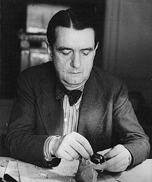

# Georges Auric

## Biografía

Georges Auric (Lodève, Hérault, Languedoc-Roussillon, 15 de febrero de 1899-París, 23 de julio de 1983), fue un compositor francés. Fue un niño prodigio y a los quince años ya tenía su primera composición publicada. Antes de los 20 años ya había orquestado y escrito música incidental para varios ballets y obras de teatro.

## Estilo musical

Conservatorio Nacional Superior de Música y Danza de París

Jean-Michel Serres, compositor y pianista (Apfel Café Music): sitio web Lanzamientos de música clásica Todos los lanzamientos de música clásica Charles Koechlin Mel Bonis Moritz Moszkowski Oskar Merikanto Cécile Chaminade Erik Satie

## Anécdotas y curiosidades

Georges Auric (francés: [ʒɔʁʒ ɔʁik]; 15 de febrero de 1899 - 23 de julio de 1983) fue un compositor francés, nacido en Lodève, Hérault, Francia. [ 1 ] Fue considerado uno de Les Six, un grupo de artistas asociados informalmente con Jean Cocteau y Erik Satie. [ 2 ] Antes de cumplir 20 años había orquestado y escrito música incidental para varios ballets y producciones teatrales. También tuvo una larga y distinguida carrera como compositor de cine.

## Top 10 bandas sonoras

1. ***Roman Holiday (Título en España: Vacaciones en Roma)***
    * **Póster:** [link](012_georges_auric/posters/poster_roman_holiday_1953.jpg)
2. ***La Grande Vadrouille (Título en España: La gran juerga)***
    * **Póster:** [link](012_georges_auric/posters/poster_la_grande_vadrouille_1966.jpg)
3. ***Orphée (Título en España: Orfeo)***
    * **Póster:** [link](012_georges_auric/posters/poster_orph_e_1950.jpg)
4. ***La Belle et la Bête (Título en España: La bella y la bestia)***
    * **Póster:** [link](012_georges_auric/posters/poster_la_belle_et_la_b_te_1946.jpg)
5. ***Moulin Rouge (Título en España: Moulin Rouge)***
    * **Póster:** [link](012_georges_auric/posters/poster_moulin_rouge_1952.jpg)
6. ***Notre-Dame de Paris (Título en España: El jorobado de Notre Dame)***
    * **Póster:** [link](012_georges_auric/posters/poster_notre_dame_de_paris_1956.jpg)
7. ***Passport to Pimlico (Título en España: Pasaporte para Pimlico)***
    * **Póster:** [link](012_georges_auric/posters/poster_passport_to_pimlico_1949.jpg)

## Filmografía completa

- Entr'acte (Título en España: Entreacto) (1924) · [Póster](012_georges_auric/posters/poster_entr_acte_1924.jpg)
- Les Mystères du château du dé (Título en España: Les Mystères du château du dé) (1929) · [Póster](012_georges_auric/posters/poster_les_myst_res_du_ch_teau_du_d_1929.jpg)
- À nous la liberté (Título en España: Viva la libertad) (1931) · [Póster](012_georges_auric/posters/poster_nous_la_libert_1931.jpg)
- Le Sang d'un poète (Título en España: La sangre de un poeta) (1932) · [Póster](012_georges_auric/posters/poster_le_sang_d_un_po_te_1932.jpg)
- Lac aux dames (Título en España: El lago de las damas) (1934) · [Póster](012_georges_auric/posters/poster_lac_aux_dames_1934.jpg)
- La Danseuse rouge (Título en España: La Danseuse rouge) (1937) · [Póster](012_georges_auric/posters/poster_la_danseuse_rouge_1937.jpg)
- Le Messager (Título en España: Le Messager) (1937) · [Póster](012_georges_auric/posters/poster_le_messager_1937.jpg)
- Entrée des artistes (Título en España: Entrée des artistes) (1938) · [Póster](012_georges_auric/posters/poster_entr_e_des_artistes_1938.jpg)
- L'Affaire Lafarge (Título en España: L'Affaire Lafarge) (1938) · [Póster](012_georges_auric/posters/poster_l_affaire_lafarge_1938.jpg)
- Orage (Título en España: Orage) (1938) · [Póster](012_georges_auric/posters/poster_orage_1938.jpg)
- La Mode rêvée (Título en España: La Mode rêvée) (1940) · [Póster](012_georges_auric/posters/poster_la_mode_r_v_e_1940.jpg)
- L'assassin a peur la nuit (Título en España: L'assassin a peur la nuit) (1942) · [Póster](012_georges_auric/posters/poster_l_assassin_a_peur_la_nuit_1942.jpg)
- Macao, l'enfer du jeu (Título en España: Macao, l'enfer du jeu) (1942) · [Póster](012_georges_auric/posters/poster_macao_l_enfer_du_jeu_1942.jpg)
- Dead of Night (Título en España: Al morir la noche) (1945) · [Póster](012_georges_auric/posters/poster_dead_of_night_1945.jpg)
- Caesar and Cleopatra (Título en España: César y Cleopatra) (1945) · [Póster](012_georges_auric/posters/poster_caesar_and_cleopatra_1945.jpg)
- La Symphonie pastorale (Título en España: La Symphonie pastorale) (1946) · [Póster](012_georges_auric/posters/poster_la_symphonie_pastorale_1946.jpg)
- La Belle et la Bête (Título en España: La bella y la bestia) (1946) · [Póster](012_georges_auric/posters/poster_la_belle_et_la_b_te_1946.jpg)
- It Always Rains on Sunday (Título en España: Siempre llueve en domingo) (1947) · [Póster](012_georges_auric/posters/poster_it_always_rains_on_sunday_1947.jpg)
- Corridor of Mirrors (Título en España: La extraña cita) (1948) · [Póster](012_georges_auric/posters/poster_corridor_of_mirrors_1948.jpg)
- Les Parents terribles (Título en España: Los padres terribles) (1948) · [Póster](012_georges_auric/posters/poster_les_parents_terribles_1948.jpg)
- The Queen of Spades (Título en España: La dama blanca (Reina de espadas)) (1949) · [Póster](012_georges_auric/posters/poster_the_queen_of_spades_1949.jpg)
- Maya (Título en España: Maya) (1949) · [Póster](012_georges_auric/posters/poster_maya_1949.jpg)
- Passport to Pimlico (Título en España: Pasaporte para Pimlico) (1949) · [Póster](012_georges_auric/posters/poster_passport_to_pimlico_1949.jpg)
- The Spider and the Fly (Título en España: The Spider and the Fly) (1949) · [Póster](012_georges_auric/posters/poster_the_spider_and_the_fly_1949.jpg)
- Cage of Gold (Título en España: Cage of Gold) (1950) · [Póster](012_georges_auric/posters/poster_cage_of_gold_1950.jpg)
- Ce siècle a cinquante ans (Título en España: Ce siècle a cinquante ans) (1950) · [Póster](012_georges_auric/posters/poster_ce_si_cle_a_cinquante_ans_1950.jpg)
- Orphée (Título en España: Orfeo) (1950) · [Póster](012_georges_auric/posters/poster_orph_e_1950.jpg)
- The Lavender Hill Mob (Título en España: Oro en barras) (1951) · [Póster](012_georges_auric/posters/poster_the_lavender_hill_mob_1951.jpg)
- The Galloping Major (Título en España: The Galloping Major) (1951) · [Póster](012_georges_auric/posters/poster_the_galloping_major_1951.jpg)
- La P..... respectueuse (Título en España: La P..... respectueuse) (1952) · [Póster](012_georges_auric/posters/poster_la_p_respectueuse_1952.jpg)
- Moulin Rouge (Título en España: Moulin Rouge) (1952) · [Póster](012_georges_auric/posters/poster_moulin_rouge_1952.jpg)
- Nez de cuir (Título en España: Nariz de cuero) (1952) · [Póster](012_georges_auric/posters/poster_nez_de_cuir_1952.jpg)
- Le Salaire de la peur (Título en España: El salario del miedo) (1953) · [Póster](012_georges_auric/posters/poster_le_salaire_de_la_peur_1953.jpg)
- The Titfield Thunderbolt (Título en España: Los apuros de un pequeño tren) (1953) · [Póster](012_georges_auric/posters/poster_the_titfield_thunderbolt_1953.jpg)
- Roman Holiday (Título en España: Vacaciones en Roma) (1953) · [Póster](012_georges_auric/posters/poster_roman_holiday_1953.jpg)
- The Divided Heart (Título en España: Corazón dividido) (1954) · [Póster](012_georges_auric/posters/poster_the_divided_heart_1954.jpg)
- Father Brown (Título en España: El detective) (1954) · [Póster](012_georges_auric/posters/poster_father_brown_1954.jpg)
- The Good Die Young (Título en España: Los buenos mueren jóvenes) (1954) · [Póster](012_georges_auric/posters/poster_the_good_die_young_1954.jpg)
- Lola Montès (Título en España: Lola Montes) (1955) · [Póster](012_georges_auric/posters/poster_lola_mont_s_1955.jpg)
- Du rififi chez les hommes (Título en España: Rififi) (1955) · [Póster](012_georges_auric/posters/poster_du_rififi_chez_les_hommes_1955.jpg)
- Notre-Dame de Paris (Título en España: El jorobado de Notre Dame) (1956) · [Póster](012_georges_auric/posters/poster_notre_dame_de_paris_1956.jpg)
- Gervaise (Título en España: Gervaise) (1956) · [Póster](012_georges_auric/posters/poster_gervaise_1956.jpg)
- Les aventures de Till l'Espiègle (Título en España: Les aventures de Till l'Espiègle) (1956) · [Póster](012_georges_auric/posters/poster_les_aventures_de_till_l_espi_gle_1956.jpg)
- Les Sorcières de Salem (Título en España: Les Sorcières de Salem) (1957) · [Póster](012_georges_auric/posters/poster_les_sorci_res_de_salem_1957.jpg)
- Heaven Knows, Mr. Allison (Título en España: Sólo Dios lo sabe) (1957) · [Póster](012_georges_auric/posters/poster_heaven_knows_mr_allison_1957.jpg)
- Christine (Título en España: Amoríos) (1958) · [Póster](012_georges_auric/posters/poster_christine_1958.jpg)
- Bonjour Tristesse (Título en España: Buenos días, tristeza) (1958) · [Póster](012_georges_auric/posters/poster_bonjour_tristesse_1958.jpg)
- Les bijoutiers du clair de lune (Título en España: Los joyeros del claro de luna) (1958) · [Póster](012_georges_auric/posters/poster_les_bijoutiers_du_clair_de_lune_1958.jpg)
- Goodbye Again (Título en España: No me digas adiós) (1961) · [Póster](012_georges_auric/posters/poster_goodbye_again_1961.jpg)
- Bridge to the Sun (Título en España: Puente al sol) (1961) · [Póster](012_georges_auric/posters/poster_bridge_to_the_sun_1961.jpg)
- Carillons sans joie (Título en España: Carillons sans joie) (1962) · [Póster](012_georges_auric/posters/poster_carillons_sans_joie_1962.jpg)
- La Chambre ardente (Título en España: La Chambre ardente) (1962) · [Póster](012_georges_auric/posters/poster_la_chambre_ardente_1962.jpg)
- Le rendez-vous de minuit (Título en España: Le rendez-vous de minuit) (1962) · [Póster](012_georges_auric/posters/poster_le_rendez_vous_de_minuit_1962.jpg)
- The Mind Benders (Título en España: El extraño caso del doctor Longman) (1963) · [Póster](012_georges_auric/posters/poster_the_mind_benders_1963.jpg)
- Thomas l'imposteur (Título en España: Thomas l'imposteur) (1965) · [Póster](012_georges_auric/posters/poster_thomas_l_imposteur_1965.jpg)
- La Grande Vadrouille (Título en España: La gran juerga) (1966) · [Póster](012_georges_auric/posters/poster_la_grande_vadrouille_1966.jpg)
- The Poppy Is Also a Flower (Título en España: Las flores del diablo) (1966) · [Póster](012_georges_auric/posters/poster_the_poppy_is_also_a_flower_1966.jpg)
- Therese and Isabelle (Título en España: Therese and Isabelle) (1968) · [Póster](012_georges_auric/posters/poster_therese_and_isabelle_1968.jpg)
- L'Arbre de Noël (Título en España: Vidas truncadas) (1969) · [Póster](012_georges_auric/posters/poster_l_arbre_de_no_l_1969.jpg)
- Return to Reason: Four Films by Man Ray (Título en España: Return to Reason: Four Films by Man Ray) (2024) · [Póster](012_georges_auric/posters/poster_return_to_reason_four_films_by_man_ray_2024.jpg)

## Premios y nominaciones

* 1984 – Óscar – (Nominación)
* Premio de la Academia – (Ganador)
* Premio de la Academia – (Nominación)
* Premio de la Academia – por *柴咲コウ CONCERT TOUR 2023 ACTOR'S THE BEST (Título en España: 柴咲コウ CONCERT TOUR 2023 ACTOR'S THE BEST)* – (Nominación)
* Premio de la Academia – por *Best Actress (Título en España: Best Actress)* – (Nominación)
* Premio de la Academia – por *the Academy Award for Best International Feature Film* – (Nominación)
* Óscar – (Nominación)

## Fuentes adicionales

* [MundoBSO](https://w.mundobso.com/bso/cartero-siempre-llama-dos-veces-el) — site:mundobso.com
* [MundoBSO (2)](https://www.mundobso.com/bso/milla-verde-la) — site:mundobso.com
* [MundoBSO (3)](https://www.mundobso.com/bso/star-trek-insurrection) — site:mundobso.com
* [Film Score Monthly](https://www.filmscoremonthly.com/notes/goodbye_again.html) — site:filmscoremonthly.com
* [Film Score Monthly (2)](https://www.filmscoremonthly.com/cds/detail.cfm/CDID/402/MGM-Soundtrack-Treasury/) — site:filmscoremonthly.com
* [Film Score Monthly (3)](https://www.filmscoremonthly.com/backissues/viewissue.cfm?issueID=52) — site:filmscoremonthly.com
* [SoundtrackCollector](https://www.soundtrackcollector.com/catalog/composerdiscography.php?composerid=1256) — site:soundtrackcollector.com
* [SoundtrackCollector (2)](https://www.soundtrackcollector.com/title/15734/Moulin+Rouge) — site:soundtrackcollector.com
* [SoundtrackCollector (3)](https://www.soundtrackcollector.com/title/18994/Innocents,+The) — site:soundtrackcollector.com
* [WhatSong](https://whatsong.org) — site:whatsong.org
* [WhatSong (2)](https://whatsong.org) — site:whatsong.org
* [WhatSong (3)](https://whatsong.org) — site:whatsong.org

## Notas externas

* MundoBSO (2): Compositor: Newman, Thomas Sello: Warner Duración: 66 minutos Información de la película Título original: The Green Mile Director: Frank Darabont Nacionalidad: EE UU Año: 1999 Argumento A mediados de los años treinta, un guarda de prisiones que custodia a los condenados a muerte descubre poderes sobrenaturales en un inmenso hombre negro, acusado de haber asesinado a dos niñas. Eso le llevará a creer en su inocencia. Premios Saturn: 1 nominación Compositor: Newman, Thomas Sello: Warner Duración: 66 minutos
* MundoBSO (3): Compositor: Goldsmith, Jerry Sello: GNP Duración: 79 minutos Información de la película Título original: Star Trek: Insurrection Director: Jonathan Frakes Nacionalidad: EE UU Año: 1998 Argumento La tripulación de la nave Enterprise encuentra un planeta con propiedades mágicas, en el que sus habitantes viven en eterna paz... hasta que surge la amenaza de invasión. Compositor: Goldsmith, Jerry Sello: GNP Duración: 79 minutos
* jeanmichelserres.com: Jean-Michel Serres, compositor y pianista (Apfel Café Music): sitio web Lanzamientos de música clásica Todos los lanzamientos de música clásica Charles Koechlin Mel Bonis Moritz Moszkowski Oskar Merikanto Cécile Chaminade Erik Satie
* www.wisemusicclassical.com: 1925 Las bodas de Monsieur le Trouhadec Música incidental
* www.pianorarescores.com: Carrito / $ 0.00 No hay productos en el carrito. Volver a la tienda Compositores Compositores Compositores soviéticos Compositores franceses Mujeres compositoras La música de Italia Novedades Partituras especiales Alumnos de Chopin Alumnos de Liszt El círculo Belaieff Herencia de Carl Czerny Ediciones raras de Chopin Tipo Estudio Sonata para piano Variaciones Preludio Concierto para piano Must Have Rudolph Ganz Walter Niemann Billy Mayerl Karol Szymanowski Jonas, Alberto
* www.larousse.fr: Este artículo está extraído de la obra de Larousse “Diccionario de Música”. Estudió en el conservatorio de Montpellier, luego en el de París, donde fue alumno de G. Caussade para contrapunto y fuga, y se hizo amigo de Honegger y Milhaud; En la Schola Cantorum recibió lecciones de composición de V. d'Indy. Admira a Satie, Stravinsky y Chabrier. No es casualidad que Cocteau le dedicó, en 1919, Le Coq et l'Arlequin, un verdadero manifiesto del nuevo espíritu puesto bajo la dirección de Satie: miembro del grupo de los Six, Auric es sin duda el representante más auténtico del espíritu contestatario, incluso provocador, que anima a estos músicos. Posteriormente accede...
* www.mfiles.co.uk: Cuando era joven músico, Auric se hizo amigo de Erik Satie, estudió con D'Indy y asistió al Conservatorio de París. Se convirtió en miembro del grupo conocido como "Les Six", que incluía a Milhaud, Poulenc, Honegger, Tailleferre y Durey. Fue crítico musical durante un tiempo y por supuesto compositor. Sus primeros trabajos fueron en gran medida de corte clásico, para conciertos, ópera y ballet. Su pertenencia a Lex Six le puso en contacto con el escritor Jean Cocteau (en aquel momento poeta y dramaturgo) y esa relación le llevó a escribir escenarios de poesía y otros textos como canciones y musicales. Cuando Cocteau se dedicó a la realización de películas, era natural que Auric también se dedicara a la música cinematográfica. Áurico...
* www.soundtrack.net: Explora canciones de películas y programas de televisión, escúchalas en su totalidad con la profunda integración de Spotify y guarda pistas directamente en tus listas de reproducción. Muestra amor por tus canciones, películas y comentarios favoritos con Me gusta: tus elecciones impulsan recomendaciones de canciones personalizadas.
* www.britannica.com: Nuestros editores revisarán lo que ha enviado y determinarán si deben revisar el artículo. Georges Auric (nacido el 15 de febrero de 1899 en Lodève, Francia; fallecido el 24 de julio de 1983 en París) fue un compositor francés mejor conocido por sus bandas sonoras de películas y ballets. En estas y otras obras, estuvo entre quienes reaccionaron contra el lenguaje armónico cromático y las estructuras simbolistas de Claude Debussy.
* soundtrackbeat.com: La historia más famosa de Jeanne-Marie Le Prince de Beaumont, aunque se publicó por primera vez en 1757 como parte de una antología de cuentos de hadas, sigue siendo encantadora y popular hasta el día de hoy. La historia de La Bella y la Bestia cuenta con muchas adaptaciones cinematográficas y televisivas que hicieron historia y fueron amadas por los seguidores de ambos medios. La época, los escenarios y algunos aspectos individuales de la historia pueden cambiar, pero el amor de la bella por la bestia sigue siendo el mismo, ofreciendo una de las mejores historias románticas de la historia. Una historia de amor, de hecho, que afecta emocionalmente profundamente a los espectadores. En todas las adaptaciones de la historia para televisión o cine, la música ha sido el componente más importante y el activo más valioso para la ambientación...
* www.jesuismort.com: Compositor francés de música clásica y de cine, conocido por ser autor (junto a Diaghilev) de los ballets “Les Fâcheux” y “Les Matelots”, así como de la tragedia coreográfica “Phèdre”, creó música para películas tan famosas como “Le Sang d'un poet” (1930), “La Belle et la Bête” (1946) y “Orphée” (1950) de Jean Cocteau, “Moulin Rouge” (1952), dirigida por John Huston, “Lola Montès” (1955) de Max Ophüls, “Notre-Dame de Paris” de Jean Delannoy y “La Grande Vadrouille” de Gérard Oury. Fue miembro del grupo de los Seis y fue presidente de la Sociedad de Autores, Compositores y Editores de Música (SACEM) de 1954 a 1978 y administrador de la Réunion des...
* cinema.encyclopedie.personnalites.bifi.fr: Después del Conservatorio de París, Georges Auric aprendió composición en la Schola Cantorum. Algún tiempo después de la guerra, fundó el Grupo de los Seis con otros músicos y participó en el resurgimiento de la música. Georges Auric hizo su debut cinematográfico en 1930 escribiendo la banda sonora de la película de Jean Cocteau, Le sang d'un père. Esta primera película lo impulsó entre los más grandes compositores franceses. Posteriormente, Jean Cocteau lo recurrió sistemáticamente para sus películas: La Bella y la Bestia (1946), El águila de dos cabezas (1947) y Orfeo (1949). También produjo la banda sonora de las películas de Marc Allégret Lac aux dames (1934), Entree des artistas (1938) y L'assassin a...
