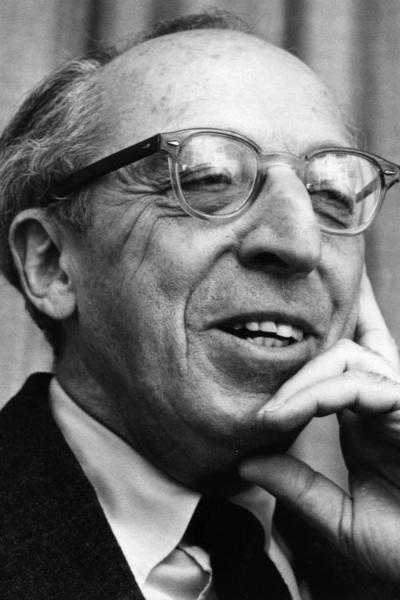

# Aaron Copland

## Biografía

El Concierto para clarinete y orquesta de cuerda con arpa y piano fue compuesto en el año 1949​por Aaron Copland y dedicado al clarinetista Benny Goodman. Sé estrenó el 6 de noviembre de 1950, con Fritz Reiner como director de la Orquesta Sinfónica de los estudios de la NBC.

## Estilo musical

3 Subsección Música Alternar música 3.1 Influencias 3.2 Obras tempranas 3.3 Obras populistas 3.4 Bandas sonoras de películas 3.5 Obras posteriores

## Anécdotas y curiosidades

Aaron Copland (1900-1990) nació en New York, en el barrio de Brooklyn, el 14 de noviembre de 1900. Sus padres eran emigrantes judíos que habían llegado procedentes de Polonia y de Lituania en su adolescencia. El nombre original de su padre era Kaplan pero lo convirtió al inglés como Copland durante su estancia en Inglaterra, antes de marchar a los Estados Unidos. Aaron fue el quinto hijo de una familia que ya se había acomodado en los Estados Unidos. Su padre poseía una tienda en Brooklyn.

## Top 10 bandas sonoras

1. ***The Heiress (Título en España: La heredera)***
    * **Póster:** [link](014_aaron_copland/posters/poster_the_heiress_1949.jpg)
2. ***Of Mice and Men (Título en España: La fuerza bruta (De ratones y hombres))***
    * **Póster:** [link](014_aaron_copland/posters/poster_of_mice_and_men_1939.jpg)
3. ***Our Town (Título en España: Sinfonía de la vida)***
    * **Póster:** [link](014_aaron_copland/posters/poster_our_town_1940.jpg)
4. ***Something Wild (Título en España: Algo salvaje)***
    * **Póster:** [link](014_aaron_copland/posters/poster_something_wild_1961.jpg)
5. ***The City (Título en España: The City)***
    * **Póster:** [link](014_aaron_copland/posters/poster_the_city_1939.jpg)
6. ***The Red Pony (Título en España: El pony rojo)***
    * **Póster:** [link](014_aaron_copland/posters/poster_the_red_pony_1949.jpg)
7. ***Paris: The Luminous Years (Título en España: Paris: The Luminous Years)***
    * **Póster:** [link](014_aaron_copland/posters/poster_paris_the_luminous_years_2010.jpg)
8. ***Copland Conducts Copland (Título en España: Copland Conducts Copland)***
    * **Póster:** [link](014_aaron_copland/posters/poster_copland_conducts_copland_1976.jpg)
9. ***Tanglewood: A Place for Music (Título en España: Tanglewood: A Place for Music)***
    * **Póster:** [link](014_aaron_copland/posters/poster_tanglewood_a_place_for_music_1985.jpg)
10. ***Aaron Copland: A Self Portrait (Título en España: Aaron Copland: A Self Portrait)***
    * **Póster:** [link](014_aaron_copland/posters/poster_aaron_copland_a_self_portrait_1985.jpg)

## Filmografía completa

- 145 W. 21 (Título en España: 145 W. 21) (1936) · [Póster](014_aaron_copland/posters/poster_145_w_21_1936.jpg)
- Of Mice and Men (Título en España: La fuerza bruta (De ratones y hombres)) (1939) · [Póster](014_aaron_copland/posters/poster_of_mice_and_men_1939.jpg)
- The City (Título en España: The City) (1939) · [Póster](014_aaron_copland/posters/poster_the_city_1939.jpg)
- Our Town (Título en España: Sinfonía de la vida) (1940) · [Póster](014_aaron_copland/posters/poster_our_town_1940.jpg)
- The Cummington Story (Título en España: The Cummington Story) (1945) · [Póster](014_aaron_copland/posters/poster_the_cummington_story_1945.jpg)
- The Red Pony (Título en España: El pony rojo) (1949) · [Póster](014_aaron_copland/posters/poster_the_red_pony_1949.jpg)
- The Heiress (Título en España: La heredera) (1949) · [Póster](014_aaron_copland/posters/poster_the_heiress_1949.jpg)
- Tanglewood Music School and Music Festival (Título en España: Tanglewood Music School and Music Festival) (1949) · [Póster](014_aaron_copland/posters/poster_tanglewood_music_school_and_music_festival_1949.jpg)
- Something Wild (Título en España: Algo salvaje) (1961) · [Póster](014_aaron_copland/posters/poster_something_wild_1961.jpg)
- Copland Conducts Copland (Título en España: Copland Conducts Copland) (1976) · [Póster](014_aaron_copland/posters/poster_copland_conducts_copland_1976.jpg)
- Are My Ears on Wrong?: A Profile of Charles Ives (Título en España: Are My Ears on Wrong?: A Profile of Charles Ives) (1979) · [Póster](014_aaron_copland/posters/poster_are_my_ears_on_wrong_a_profile_of_charles_ives_1979.jpg)
- Bachianas Brasileiras: Meu Nome é Villa-Lobos (Título en España: Bachianas Brasileiras: Meu Nome é Villa-Lobos) (1979) · [Póster](014_aaron_copland/posters/poster_bachianas_brasileiras_meu_nome_villa_lobos_1979.jpg)
- Aaron Copland: A Self Portrait (Título en España: Aaron Copland: A Self Portrait) (1985) · [Póster](014_aaron_copland/posters/poster_aaron_copland_a_self_portrait_1985.jpg)
- Tanglewood: A Place for Music (Título en España: Tanglewood: A Place for Music) (1985) · [Póster](014_aaron_copland/posters/poster_tanglewood_a_place_for_music_1985.jpg)
- Paris: The Luminous Years (Título en España: Paris: The Luminous Years) (2010) · [Póster](014_aaron_copland/posters/poster_paris_the_luminous_years_2010.jpg)
- Copland, Bernstein (Título en España: Copland, Bernstein) (2014) · [Póster](014_aaron_copland/posters/poster_copland_bernstein_2014.jpg)
- Concours international de l'ARD Concert des lauréats (Título en España: Concours international de l'ARD Concert des lauréats) (2025) · [Póster](014_aaron_copland/posters/poster_concours_international_de_l_ard_concert_des_laur_ats_2025.jpg)

## Premios y nominaciones

* 1925 – Beca Guggenheim – (Ganador)
* 1926 – Beca Guggenheim – (Ganador)
* 1940 – Premio de la Academia a la mejor banda sonora original – por *Of Mice and Men (Título en España: La fuerza bruta (De ratones y hombres))* – (Nominación)
* 1940 – Premio de la Academia a la mejor banda sonora, adaptación o tratamiento – por *Of Mice and Men (Título en España: La fuerza bruta (De ratones y hombres))* – (Nominación)
* 1941 – Premio de la Academia a la mejor banda sonora original – por *Our Town (Título en España: Sinfonía de la vida)* – (Nominación)
* 1941 – Premio de la Academia a la mejor banda sonora, adaptación o tratamiento – por *Our Town (Título en España: Sinfonía de la vida)* – (Nominación)
* 1944 – Premio de la Academia a la mejor banda sonora original de comedia o drama – por *The North Star (Título en España: The North Star)* – (Nominación)
* 1945 – Premio Pulitzer de Música – por *Appalachian Spring (Título en España: Appalachian Spring)* – (Ganador)
* 1950 – Premio de la Academia a la mejor banda sonora original de comedia o drama – por *The Heiress (Título en España: La heredera)* – (Ganador)
* 1950 – Premio de la Academia a la mejor banda sonora original de comedia o drama – por *The Heiress (Título en España: La heredera)* – (Nominación)
* 1964 – Medalla Presidencial de la Libertad – (Ganador)
* 1970 – Cruz de Comendador de la Orden del Mérito de la República Federal de Alemania – (Ganador)
* 1970 – Premio al Hombre de Música Charles E. Lutton – (Ganador)
* 1979 – Honores del Centro Kennedy – (Ganador)
* 1981 – Premio Grammy de los Fideicomisarios – (Ganador)
* Beca Fulbright – (Ganador)
* Medalla Nacional de las Artes – (Ganador)
* Medalla de oro del Congreso – (Ganador)
* Medallón de Händel – (Ganador)
* Miembro Honorario de la Sociedad Internacional de Música Contemporánea – (Ganador)
* Premio Hoja de Laurel – (Ganador)
* Premio Roma – (Ganador)

## Fuentes adicionales

* [MundoBSO](https://www.mundobso.com/agoras/anos-dorados-vii-tres-en-la-cumbre) — site:mundobso.com
* [MundoBSO (2)](https://www.mundobso.com/bso/capitan-america-civil-war) — site:mundobso.com
* [MundoBSO (3)](https://w.mundobso.com/bso/cartero-siempre-llama-dos-veces-el) — site:mundobso.com
* [Film Score Monthly](https://www.filmscoremonthly.com/backissues/viewissue.cfm?issueID=109) — site:filmscoremonthly.com
* [Film Score Monthly (2)](https://www.filmscoremonthly.com/resources/calendar.cfm?calmonth=12) — site:filmscoremonthly.com
* [Film Score Monthly (3)](https://www.filmscoremonthly.com/fsmonline/video_archive.cfm) — site:filmscoremonthly.com
* [SoundtrackCollector](https://www.soundtrackcollector.com/title/14683/Red+Pony,+The) — site:soundtrackcollector.com
* [SoundtrackCollector (2)](https://www.soundtrackcollector.com/title/39139/Copland+Film+Scores) — site:soundtrackcollector.com
* [SoundtrackCollector (3)](https://www.soundtrackcollector.com/title/9543/He+Got+Game) — site:soundtrackcollector.com
* [WhatSong](https://www.whatsong.org/tvshow/how-i-met-your-mother/episode/44483) — site:whatsong.org
* [WhatSong (2)](https://www.whatsong.org/tvshow/smallville/episode/39263) — site:whatsong.org
* [WhatSong (3)](https://www.whatsong.org/tvshow/grown-ish/episode/82123) — site:whatsong.org

## Notas externas

* MundoBSO (2): Compositor: Jackman, Henry Sello: Hollywood Duración: 69 minutos Información de la película Título original: Captain America: Civil War Director: Anthony Russo, Joe Russo Nacionalidad: EE UU Año: 2016 Argumento Continuación de Captain America: The Winter Soldier (14). Cuando otro incidente internacional involucra a Los Vengadores y causan varios daños colaterales, aumentan las presiones políticas para exigir más responsabilidades y determinar cuándo deben contratar los servicios del grupo de superhéroes. Esta nueva situación dividirá a Los Vengadores, mientras intentan proteger al mundo de un nuevo y terrible villano. Compositor: Jackman, Henry Sello: Hollywood Duración: 69 minutos
* WhatSong: Lily y Robin bailan con los dos nerds del último año de secundaria. Se reproduce de fondo cuando Lilly, Robin y Barney intentan entrar a la fiesta. La canción es una canción que está incluida en iMovie.
* WhatSong (2): Actuó mientras Pete mastica chicle de kriptonita y luego salva a Kara. OneRepublic - Soñando en voz alta (edición ampliada)
* WhatSong (3): Luca está pensando en él y en el encuentro sexual de Zoey de la noche anterior. Luca está estresado por su "yo". Texto a Zoey y su falta de respuesta.
* cinescores.dudaone.com: Una entrevista con Aaron Copland por Roger Hall Publicado originalmente en Soundtrack Magazine Vol.19/No.75, 2000 Texto reproducido con la amable autorización del editor, Luc Van de Ven y Roger Hall Entre 1939 y 1949, el distinguido compositor estadounidense Aaron Copland (1900-1990) compuso cinco bandas sonoras cinematográficas importantes: OF MICE AND MEN, OUR TOWN, THE NORTH STAR, THE RED PONY y THE HEIRESS. También compuso música para dos documentales: THE CITY (Feria Mundial de Nueva York, 1939) y THE CUMMINGTON STORY en 1943. Su última música cinematográfica fue para el drama de 1961, SOMETHING WILD, que no debe confundirse con la película posterior de 1986.
* www.loc.gov: A mediados de la década de 1930, Copland comenzó a recibir encargos de compañías de danza. El primero, de la coreógrafa de Chicago Ruth Page, resultó en la partitura de 1935 Hear Ye! Hear Ye!, un ballet con una trama similar a Rashomon ambientada en un tribunal de justicia. ¡Oíd! ¡Oíd! fue un éxito local pero no hizo la transición al repertorio; Cuando se le preguntó al respecto en años posteriores, Copland dijo: "Escribí ese artículo muy rápido". Su segundo encargo, del Ballet Caravan de Lincoln Kirstein en Nueva York, resultó en Billy the Kid (1938), una de sus obras más conocidas y la que primero lo identificó definitivamente con el oeste americano. (Música para radio, escrita en 1937, recibió el título Saga de la pradera como...
* americanarchive.org: una colaboración entre la Biblioteca del Congreso y GBH Para organizaciones participantes Contribuya con contenido Acceda al AMS Obtenga sus metadatos Kit de herramientas de comunicación Recursos Wiki
* courses.lumenlearning.com: Copland representa una novedad en nuestros estudios: un compositor nacido en Estados Unidos. Nacido en Brooklyn, Nueva York, Aaron Copland estudió en París y luego regresó a los Estados Unidos, donde fue influenciado por el compositor Aaron Stieglitz. Stieglitz consideró que los artistas estadounidenses deberían crear obras que expresaran la democracia estadounidense. Copland ciertamente hizo esto en varios ballets populares que utilizaban melodías populares estadounidenses, particularmente canciones de vaqueros. El ballet Rodeo y el movimiento de ese trabajo que aparece en nuestra lista de reproducción, “Hoedown”, es inconfundible en su referencia al oeste americano. Este nacionalismo estadounidense contrasta marcadamente con la música modernista de los contemporáneos de Copland. Figura 1. Aarón...
* www.britannica.com: Nuestros editores revisarán lo que ha enviado y determinarán si deben revisar el artículo. La Sociedad de Música de Cámara del Lincoln Center: ¿Quién era Aaron Copland? Una breve introducción
* www.coplandhouse.org: Acerca de Copland House Inc. Junta directiva y personal Rock Hill Copland House en Bluestone Apóyenos Amigos de Copland House Gala de patrocinios y donaciones
* www.aaroncopland.com: Eventos Recursos Contacto Búsqueda Permisos y Derechos Ayuda del Sitio Mapa del Sitio Recursos Contacto Búsqueda Permisos y Derechos Ayuda del Sitio Mapa del Sitio
* www.aaroncopland.com: Eventos Recursos Contacto Búsqueda Permisos y Derechos Ayuda del Sitio Mapa del Sitio Recursos Contacto Búsqueda Permisos y Derechos Ayuda del Sitio Mapa del Sitio
