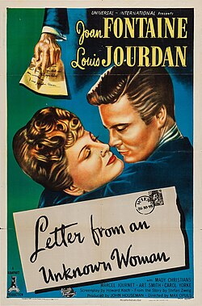

# Daniele Amfitheatrof

## Biografía

Carta de una desconocida (Letter from an Unknown Woman) es una película estadounidense de 1948 dirigida por Max Ophüls y protagonizada por Joan Fontaine y Louis Jourdan. Fue adaptada al cine por Howard Koch de la novela homónima de Stefan Zweig, publicada en 1922. Cuenta la historia de un pianista que recibe la carta de una mujer que no conoce y que ha estado enamorada de él toda su vida. En 1992, la película fue considerada «cultural, histórica y estéticamente significativa» por la Biblioteca del Congreso de Estados Unidos y seleccionada para su preservación en el National Film Registry.​

## Estilo musical

Orquesta Filarmónica Real y Yuri Simonov - Tchaikovsky: The Nutcracker & Swan Lake Suites Case pelea con Victor después de que el joyero lo entrega.

## Anécdotas y curiosidades

Amfitheatrof nació en San Petersburgo, Rusia, el 29 de octubre de 1901; su abuelo fue Nikolay Sokolov. [ 1 ]

Compositores: Beck, Christophe | Lopez, Robert Sello: Disney Duración: 98 minutos Título original: Frozen Director: Chris Buck, Jennifer Lee Nacionalidad: EE UU Año: 2013

## Top 10 bandas sonoras

1. ***Lassie Come Home (Título en España: Lassie, la cadena invisible)***
    * **Póster:** [link](016_daniele_amfitheatrof/posters/poster_lassie_come_home_1943.jpg)
2. ***Letter from an Unknown Woman (Título en España: Carta de una desconocida)***
    * **Póster:** [link](016_daniele_amfitheatrof/posters/poster_letter_from_an_unknown_woman_1948.jpg)
3. ***House of Strangers (Título en España: Odio entre hermanos)***
    * **Póster:** [link](016_daniele_amfitheatrof/posters/poster_house_of_strangers_1949.jpg)
4. ***The Desperate Hours (Título en España: Horas desesperadas)***
    * **Póster:** [link](016_daniele_amfitheatrof/posters/poster_the_desperate_hours_1955.jpg)
5. ***Major Dundee (Título en España: Mayor Dundee)***
    * **Póster:** [link](016_daniele_amfitheatrof/posters/poster_major_dundee_1965.jpg)
6. ***Human Desire (Título en España: Deseos humanos)***
    * **Póster:** [link](016_daniele_amfitheatrof/posters/poster_human_desire_1954.jpg)
7. ***The Naked Jungle (Título en España: Cuando ruge la marabunta)***
    * **Póster:** [link](016_daniele_amfitheatrof/posters/poster_the_naked_jungle_1954.jpg)
8. ***Dr. Jekyll and Mr. Hyde (Título en España: El extraño caso del Dr. Jekyll)***
    * **Póster:** [link](016_daniele_amfitheatrof/posters/poster_dr_jekyll_and_mr_hyde_1941.jpg)
9. ***The Damned Don't Cry (Título en España: Los condenados no lloran)***
    * **Póster:** [link](016_daniele_amfitheatrof/posters/poster_the_damned_don_t_cry_1950.jpg)
10. ***I Married a Monster from Outer Space (Título en España: Me casé con un monstruo del espacio exterior)***
    * **Póster:** [link](016_daniele_amfitheatrof/posters/poster_i_married_a_monster_from_outer_space_1958.jpg)

## Filmografía completa

- La signora di tutti (Título en España: La mujer de todos) (1934) · [Póster](016_daniele_amfitheatrof/posters/poster_la_signora_di_tutti_1934.jpg)
- Fast and Furious (Título en España: Fast and Furious) (1939) · [Póster](016_daniele_amfitheatrof/posters/poster_fast_and_furious_1939.jpg)
- Nick Carter, Master Detective (Título en España: Nick Carter, Master Detective) (1939) · [Póster](016_daniele_amfitheatrof/posters/poster_nick_carter_master_detective_1939.jpg)
- A Failure at Fifty (Título en España: A Failure at Fifty) (1940) · [Póster](016_daniele_amfitheatrof/posters/poster_a_failure_at_fifty_1940.jpg)
- Comrade X (Título en España: Camarada X) (1940) · [Póster](016_daniele_amfitheatrof/posters/poster_comrade_x_1940.jpg)
- Dreams (Título en España: Dreams) (1940) · [Póster](016_daniele_amfitheatrof/posters/poster_dreams_1940.jpg)
- XXX Medico (Título en España: XXX Medico) (1940) · [Póster](016_daniele_amfitheatrof/posters/poster_xxx_medico_1940.jpg)
- Dr. Jekyll and Mr. Hyde (Título en España: El extraño caso del Dr. Jekyll) (1941) · [Póster](016_daniele_amfitheatrof/posters/poster_dr_jekyll_and_mr_hyde_1941.jpg)
- Out of Darkness (Título en España: Out of Darkness) (1941) · [Póster](016_daniele_amfitheatrof/posters/poster_out_of_darkness_1941.jpg)
- Johnny Eager (Título en España: Senda prohibida) (1941) · [Póster](016_daniele_amfitheatrof/posters/poster_johnny_eager_1941.jpg)
- The Get-Away (Título en España: The Get-Away) (1941) · [Póster](016_daniele_amfitheatrof/posters/poster_the_get_away_1941.jpg)
- This Is the Bowery (Título en España: This Is the Bowery) (1941) · [Póster](016_daniele_amfitheatrof/posters/poster_this_is_the_bowery_1941.jpg)
- Calling Dr. Gillespie (Título en España: Calling Dr. Gillespie) (1942) · [Póster](016_daniele_amfitheatrof/posters/poster_calling_dr_gillespie_1942.jpg)
- Eyes in the Night (Título en España: Eyes in the Night) (1942) · [Póster](016_daniele_amfitheatrof/posters/poster_eyes_in_the_night_1942.jpg)
- Fingers at the Window (Título en España: Fingers at the Window) (1942) · [Póster](016_daniele_amfitheatrof/posters/poster_fingers_at_the_window_1942.jpg)
- Joe Smith, American (Título en España: Joe Smith, American) (1942) · [Póster](016_daniele_amfitheatrof/posters/poster_joe_smith_american_1942.jpg)
- White Cargo (Título en España: La sirena del Congo) (1942) · [Póster](016_daniele_amfitheatrof/posters/poster_white_cargo_1942.jpg)
- Sunday Punch (Título en España: Sunday Punch) (1942) · [Póster](016_daniele_amfitheatrof/posters/poster_sunday_punch_1942.jpg)
- Dr. Gillespie's Criminal Case (Título en España: Dr. Gillespie's Criminal Case) (1943) · [Póster](016_daniele_amfitheatrof/posters/poster_dr_gillespie_s_criminal_case_1943.jpg)
- Lassie Come Home (Título en España: Lassie, la cadena invisible) (1943) · [Póster](016_daniele_amfitheatrof/posters/poster_lassie_come_home_1943.jpg)
- Lost Angel (Título en España: Lost Angel) (1943) · [Póster](016_daniele_amfitheatrof/posters/poster_lost_angel_1943.jpg)
- Swing Shift Maisie (Título en España: Swing Shift Maisie) (1943) · [Póster](016_daniele_amfitheatrof/posters/poster_swing_shift_maisie_1943.jpg)
- I'll Be Seeing You (Título en España: Te volveré a ver) (1944) · [Póster](016_daniele_amfitheatrof/posters/poster_i_ll_be_seeing_you_1944.jpg)
- Guest Wife (Título en España: Lo que desea toda mujer) (1945) · [Póster](016_daniele_amfitheatrof/posters/poster_guest_wife_1945.jpg)
- The Virginian (Título en España: El virginiano) (1946) · [Póster](016_daniele_amfitheatrof/posters/poster_the_virginian_1946.jpg)
- Miss Susie Slagle's (Título en España: Miss Susie Slagle's) (1946) · [Póster](016_daniele_amfitheatrof/posters/poster_miss_susie_slagle_s_1946.jpg)
- Suspense (Título en España: Suspense) (1946) · [Póster](016_daniele_amfitheatrof/posters/poster_suspense_1946.jpg)
- Ivy (Título en España: Abismos) (1947) · [Póster](016_daniele_amfitheatrof/posters/poster_ivy_1947.jpg)
- The Lost Moment (Título en España: Viviendo el pasado) (1947) · [Póster](016_daniele_amfitheatrof/posters/poster_the_lost_moment_1947.jpg)
- The Beginning or the End (Título en España: ¿Principio o Fin?) (1947) · [Póster](016_daniele_amfitheatrof/posters/poster_the_beginning_or_the_end_1947.jpg)
- Letter from an Unknown Woman (Título en España: Carta de una desconocida) (1948) · [Póster](016_daniele_amfitheatrof/posters/poster_letter_from_an_unknown_woman_1948.jpg)
- You Gotta Stay Happy (Título en España: ¡Viva la vida!) (1948) · [Póster](016_daniele_amfitheatrof/posters/poster_you_gotta_stay_happy_1948.jpg)
- House of Strangers (Título en España: Odio entre hermanos) (1949) · [Póster](016_daniele_amfitheatrof/posters/poster_house_of_strangers_1949.jpg)
- Copper Canyon (Título en España: El desfiladero del cobre) (1950) · [Póster](016_daniele_amfitheatrof/posters/poster_copper_canyon_1950.jpg)
- The Capture (Título en España: La captura) (1950) · [Póster](016_daniele_amfitheatrof/posters/poster_the_capture_1950.jpg)
- Devil's Doorway (Título en España: La puerta del diablo) (1950) · [Póster](016_daniele_amfitheatrof/posters/poster_devil_s_doorway_1950.jpg)
- The Damned Don't Cry (Título en España: Los condenados no lloran) (1950) · [Póster](016_daniele_amfitheatrof/posters/poster_the_damned_don_t_cry_1950.jpg)
- Backfire (Título en España: Pasión desenfrenada) (1950) · [Póster](016_daniele_amfitheatrof/posters/poster_backfire_1950.jpg)
- Under My Skin (Título en España: Under My Skin) (1950) · [Póster](016_daniele_amfitheatrof/posters/poster_under_my_skin_1950.jpg)
- Bird of Paradise (Título en España: Ave del paraíso) (1951) · [Póster](016_daniele_amfitheatrof/posters/poster_bird_of_paradise_1951.jpg)
- Storm Warning (Título en España: Aviso de tormenta) (1951) · [Póster](016_daniele_amfitheatrof/posters/poster_storm_warning_1951.jpg)
- The Painted Hills (Título en España: Lassie: Las colinas pintadas) (1951) · [Póster](016_daniele_amfitheatrof/posters/poster_the_painted_hills_1951.jpg)
- Angels in the Outfield (Título en España: Ángeles en el campo abierto) (1951) · [Póster](016_daniele_amfitheatrof/posters/poster_angels_in_the_outfield_1951.jpg)
- Devil's Canyon (Título en España: Noche salvaje) (1953) · [Póster](016_daniele_amfitheatrof/posters/poster_devil_s_canyon_1953.jpg)
- The Naked Jungle (Título en España: Cuando ruge la marabunta) (1954) · [Póster](016_daniele_amfitheatrof/posters/poster_the_naked_jungle_1954.jpg)
- Human Desire (Título en España: Deseos humanos) (1954) · [Póster](016_daniele_amfitheatrof/posters/poster_human_desire_1954.jpg)
- The Desperate Hours (Título en España: Horas desesperadas) (1955) · [Póster](016_daniele_amfitheatrof/posters/poster_the_desperate_hours_1955.jpg)
- Trial (Título en España: La furia de los justos) (1955) · [Póster](016_daniele_amfitheatrof/posters/poster_trial_1955.jpg)
- The Mountain (Título en España: La montaña siniestra) (1956) · [Póster](016_daniele_amfitheatrof/posters/poster_the_mountain_1956.jpg)
- Spanish Affair (Título en España: Aventura para dos) (1957) · [Póster](016_daniele_amfitheatrof/posters/poster_spanish_affair_1957.jpg)
- The Unholy Wife (Título en España: The Unholy Wife) (1957) · [Póster](016_daniele_amfitheatrof/posters/poster_the_unholy_wife_1957.jpg)
- I Married a Monster from Outer Space (Título en España: Me casé con un monstruo del espacio exterior) (1958) · [Póster](016_daniele_amfitheatrof/posters/poster_i_married_a_monster_from_outer_space_1958.jpg)
- Edge of Eternity (Título en España: Al borde de la eternidad) (1959) · [Póster](016_daniele_amfitheatrof/posters/poster_edge_of_eternity_1959.jpg)
- That Kind of Woman (Título en España: Esa clase de mujer) (1959) · [Póster](016_daniele_amfitheatrof/posters/poster_that_kind_of_woman_1959.jpg)
- Heller in Pink Tights (Título en España: El pistolero de Cheyenne) (1960) · [Póster](016_daniele_amfitheatrof/posters/poster_heller_in_pink_tights_1960.jpg)
- Major Dundee (Título en España: Mayor Dundee) (1965) · [Póster](016_daniele_amfitheatrof/posters/poster_major_dundee_1965.jpg)

## Premios y nominaciones

* 1946 – Premio de la Academia a la mejor banda sonora original de comedia o drama – por *Guest Wife (Título en España: Lo que desea toda mujer)* – (Nominación)
* 1948 – Premio de la Academia a la mejor partitura musical original – por *Song of the South (Título en España: Canción del Sur)* – (Nominación)

## Fuentes adicionales

* [MundoBSO](https://www.mundobso.com/bso/frozen-el-reino-del-hielo) — site:mundobso.com
* [MundoBSO (2)](https://w.mundobso.com/bso/cartero-siempre-llama-dos-veces-el) — site:mundobso.com
* [MundoBSO (3)](https://www.mundobso.com/bso/million-dollar-baby) — site:mundobso.com
* [Film Score Monthly](https://www.filmscoremonthly.com/cds/detail.cfm?cdID=459) — site:filmscoremonthly.com
* [Film Score Monthly (2)](https://www.filmscoremonthly.com/notes/fsmcd1320_notes.pdf) — site:filmscoremonthly.com
* [Film Score Monthly (3)](https://www.filmscoremonthly.com/notes/painted_hills.html) — site:filmscoremonthly.com
* [SoundtrackCollector](https://www.soundtrackcollector.com/catalog/composerdiscography.php?composerid=1062) — site:soundtrackcollector.com
* [SoundtrackCollector (2)](https://www.soundtrackcollector.com/title/16251/Big+Heat,+The) — site:soundtrackcollector.com
* [SoundtrackCollector (3)](https://www.soundtrackcollector.com/title/13170/Lassie+Come+Home) — site:soundtrackcollector.com
* [WhatSong](https://www.whatsong.org/tvshow/vikings/episode/41727) — site:whatsong.org
* [WhatSong (2)](https://www.whatsong.org/tvshow/agent-x/episode/6975) — site:whatsong.org
* [WhatSong (3)](https://www.whatsong.org/tvshow/9-1-1/episode/71629) — site:whatsong.org

## Notas externas

* MundoBSO: Compositores: Beck, Christophe | Lopez, Robert Sello: Disney Duración: 98 minutos Título original: Frozen Director: Chris Buck, Jennifer Lee Nacionalidad: EE UU Año: 2013
* MundoBSO (3): Compositor: Eastwood, Clint Sello: Varèse Sarabande Duración: 35 minutos Información de la película Título original: Million Dollar Baby Director: Clint Eastwood Nacionalidad: EE UU Año: 2004 Argumento Un veterano entrenador de boxeo acepta hacerse cargo de una mujer empeñada en triunfar en el ring, y la lleva hasta las competiciones más importantes. Premios Globos de oro: 1 nominación Grammy: 1 nominación Compositor: Eastwood, Clint Sello: Varèse Sarabande Duración: 35 minutos
* Film Score Monthly: FSM HOME FilmScoreDaily FilmScoreFriday The Aisle Seat LukasKendall.com TABLERO DE MENSAJES Discusión general Puesto comercial Discusión sobre partituras no cinematográficas
* WhatSong: Trevor Morris, Einar Selvik, Steve Tavaglione y Brian Kilgore - Los vikingos II (banda sonora original de la película) Trevor Morris - Los vikingos II (banda sonora original de la película)
* WhatSong (2): Orquesta Filarmónica Real y Yuri Simonov - Tchaikovsky: The Nutcracker & Swan Lake Suites Case pelea con Victor después de que el joyero lo entrega.
* WhatSong (3): Talking Heads - Favoritos populares 1976-1992: Sand In the Vaseline The Naked and Famous - Passive Me, Aggressive You (Remixes y caras B)
* www.ivi.tv: Películas Géneros Acción Detectives militares Para toda la familia Para niños Drama Histórico Comedia Crimen Melodrama Aventuras Thrillers Terror Ciencia ficción Fantástico Países Ruso Extranjero Cine soviético Años Películas de 2025 Películas de 2024 Películas de 2023 Películas de 2023 Películas de 2022 Películas de 2021 Novedades Colecciones Ivi.Rating Trailers Nuevas suscripciones Ver en SmartTV Serie Géneros Acción Detective militar Para niños Drama Comedia histórica Crimen Romance médico Suspense místico Fantasía fantástica Países Ruso Extranjero Años turcos Serie 2025 Serie 2024 Serie 2023 Serie 2022 Serie de televisión 2021 Nueva serie de televisión Evie.Rating en HD Ver en SmartTV
* www.musicweb-international.com: DANIELE AMFITHEATROF nació en San Petersburgo, Rusia, el 29 de octubre de 1901 en una familia distinguida en la Rusia presoviética en diversos campos del arte y la cultura. Su padre, Alejandro V Amfitheatrof [1862-1938], fue un destacado historiador y escritor. Su madre, Illaria (Sokolof), una consumada cantante y pianista, había estudiado en privado con Rimsky-Korsakoff. Los primeros años de vida del compositor fueron de extrema dificultad. En enero de 1902, cuando tenía tres meses de edad, fue trasladado a Siberia, donde su padre fue encarcelado por publicar artículos antizaristas. En 1904 las autoridades devolvieron a la familia a San Petersburgo, tras lo cual emigraron a Italia. A los seis años comenzó sus estudios musicales...
* music.apple.com: Príncipe Igor: Obertura Cinema Maestro: El proyecto Daniele Amfitheatrofâ·â1994 Cinema Maestro: El proyecto Daniele Amfitheatrofâ·â1994
* www.film.at: Películas y series Tráiler Críticas Archivo de películas Archivo de series Programa de cine Ahora en el cine Próximamente en el cine Viena Baja Austria Alta Austria Estiria Burgenland Carintia Salzburgo Tirol Vorarlberg
* www.senscritique.com: Principales compositores de música de cine: https://www.senscritique.com/liste/Top_entreprises_de_musique_de_film_par_nombre_de_films_n_p/2128600 1 h 37 min. Publicado: 23 de noviembre de 1943 (Estados Unidos).
* theseconddisc.com: Todo lo demás Clásica/Ópera Disco/Dance Funk Gospel Rap/Hip-Hop Funciones Resumen de lanzamientos ¡Obsequios de transmisión del fin de semana! Entrevistas
