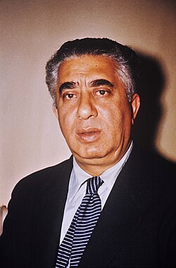

# Aram Khachaturian

## Biografía

Arám Ilích Jachaturián​ (en ruso: Ара́м Ильи́ч Хачатуря́н; en armenio: Արամ Խաչատրյան, Aram Xačatryan; Tiflis, Georgia, 6 de junio de 1903 – Moscú, Rusia, 1 de mayo de 1978) fue un compositor y director soviético de origen armenio. Se considera que fue uno de los principales compositores soviéticos.​​​ Nacido y criado en Tbilisi, la capital de Georgia, Jachaturián se mudó a Moscú en 1921 tras la sovietización del Cáucaso. Sin formación musical previa, se matriculó en el Instituto Musical Gnesin, posteriormente estudió en el Conservatorio de Moscú en la clase de Nikolái Miaskovski, así como lo haría también su futura esposa Nina Makárova. Su primera gran obra, el Concierto para piano (1936), popularizó su nombre dentro y fuera de la Unión Soviética. Le siguieron el Concierto para violín (1940) y el Concierto para violonchelo (1946). Sus otras composiciones significativas incluyen Masquerade Suite (1941), el Himno de la RSS de Armenia (1944), tres sinfonías (1935, 1943, 1947) y alrededor de 25 bandas sonoras. Jachaturián es conocido por su música de ballet: Gayaneh (1942) y Espartaco (1954). Su pieza más popular, la "Danza del sable" de Gayaneh, se ha utilizado ampliamente en la cultura popular y ha sido versionada por músicos de todo el mundo.​ Su estilo se "caracteriza por armonías coloridas, ritmos cautivadores, virtuosismo, improvisaciones y melodías sensuales".​ Durante la mayor parte de su carrera, Jachaturián fue aprobado por el gobierno soviético y ocupó varios puestos importantes en la Unión de Compositores Soviéticos desde finales de la década de 1930, aunque se unió al Partido Comunista solo en 1943. Junto con Serguéi Prokófiev y Dmitri Shostakóvich, fue oficialmente denunciado como un "formalista", y su música apodada "anti-personas" en 1948, pero fue restaurada más tarde ese año. Después de 1950, enseñó en el Instituto Gnessin y en el Conservatorio de Moscú, y pasó a dirigir. Viajó a Europa, América Latina y los Estados Unidos con conciertos de sus propias obras. En 1957, Jachaturián se convirtió en el secretario de la Unión de Compositores Soviéticos, cargo que ocupó hasta su muerte. Jachaturián, que creó la primera partitura de música, sinfonía, concierto y cine de ballet armenio, es considerado el compositor armenio más famoso del siglo XX. Siguiendo las tradiciones musicales establecidas de Rusia, utilizó ampliamente la música popular armenia y, en menor medida, caucásicas, oriental y centroeuropea y de Oriente Medio en sus obras. Es muy apreciado en Armenia, donde es considerado un "tesoro nacional".​

## Estilo musical

2 Subsección Música Alternar música 2.1 Obras 2.1.1 Ballet 2.1.2 Música orquestal 2.1.3 Otras composiciones 2.2 Influencias 2.2.1 Música folclórica armenia 2.2.2 Otra música folclórica 2.2.3 Música clásica rusa

## Anécdotas y curiosidades

Aram Khachaturian (nacido el 24 de mayo [6 de junio, Nuevo Estilo] de 1903, Tiflis, Georgia, Imperio Ruso [ahora Tbilisi, Georgia]; fallecido el 1 de mayo de 1978, Moscú, Rusia, U.R.S.S.) fue un compositor armenio soviético mejor conocido por su Concierto para piano (1936) y su ballet Gayane (1942), que incluye la popular y rítmicamente conmovedora “Danza del sable”.

## Top 10 bandas sonoras

1. ***Накануне (Título en España: Накануне)***
    * **Póster:** [link](018_aram_khachaturian/posters/poster_poster_1959.jpg)
2. ***Адмирал Ушаков (Título en España: Адмирал Ушаков)***
    * **Póster:** [link](018_aram_khachaturian/posters/poster_poster_1953.jpg)
3. ***Спартак (Título en España: Спартак)***
    * **Póster:** [link](018_aram_khachaturian/posters/poster_poster_1977.jpg)
4. ***Люди и звери (Título en España: Люди и звери)***
    * **Póster:** [link](018_aram_khachaturian/posters/poster_poster_1962.jpg)
5. ***Корабли штурмуют бастионы (Título en España: Корабли штурмуют бастионы)***
    * **Póster:** [link](018_aram_khachaturian/posters/poster_poster_1953.jpg)
6. ***Отелло (Título en España: Отелло)***
    * **Póster:** [link](018_aram_khachaturian/posters/poster_poster_1955.jpg)
7. ***Поединок (Título en España: Поединок)***
    * **Póster:** [link](018_aram_khachaturian/posters/poster_poster_1957.jpg)
8. ***Секретная миссия (Título en España: Секретная миссия)***
    * **Póster:** [link](018_aram_khachaturian/posters/poster_poster_1950.jpg)
9. ***Человек №217 (Título en España: Человек №217)***
    * **Póster:** [link](018_aram_khachaturian/posters/poster_217_1945.jpg)
10. ***Պեպո (Título en España: Պեպո)***
    * **Póster:** [link](018_aram_khachaturian/posters/poster_poster_1935.jpg)

## Filmografía completa

- Спартак (Título en España: Спартак) (1926) · [Póster](018_aram_khachaturian/posters/poster_poster_1926.jpg)
- Պեպո (Título en España: Պեպո) (1935) · [Póster](018_aram_khachaturian/posters/poster_poster_1935.jpg)
- Զանգեզուր (Título en España: Զանգեզուր) (1938) · [Póster](018_aram_khachaturian/posters/poster_poster_1938.jpg)
- Салават Юлаев (Título en España: Салават Юлаев) (1941) · [Póster](018_aram_khachaturian/posters/poster_poster_1941.jpg)
- Человек №217 (Título en España: Человек №217) (1945) · [Póster](018_aram_khachaturian/posters/poster_217_1945.jpg)
- Свет над Россией (Título en España: Свет над Россией) (1947) · [Póster](018_aram_khachaturian/posters/poster_poster_1947.jpg)
- Русский вопрос (Título en España: Русский вопрос) (1948) · [Póster](018_aram_khachaturian/posters/poster_poster_1948.jpg)
- Владимир Ильич Ленин (Título en España: Владимир Ильич Ленин) (1949) · [Póster](018_aram_khachaturian/posters/poster_poster_1949.jpg)
- Сталинградская битва (Título en España: Сталинградская битва) (1949) · [Póster](018_aram_khachaturian/posters/poster_poster_1949.jpg)
- У них есть Родина (Título en España: У них есть Родина) (1949) · [Póster](018_aram_khachaturian/posters/poster_poster_1949.jpg)
- Первые крылья (Título en España: Первые крылья) (1950) · [Póster](018_aram_khachaturian/posters/poster_poster_1950.jpg)
- Секретная миссия (Título en España: Секретная миссия) (1950) · [Póster](018_aram_khachaturian/posters/poster_poster_1950.jpg)
- Адмирал Ушаков (Título en España: Адмирал Ушаков) (1953) · [Póster](018_aram_khachaturian/posters/poster_poster_1953.jpg)
- Корабли штурмуют бастионы (Título en España: Корабли штурмуют бастионы) (1953) · [Póster](018_aram_khachaturian/posters/poster_poster_1953.jpg)
- Отелло (Título en España: Отелло) (1955) · [Póster](018_aram_khachaturian/posters/poster_poster_1955.jpg)
- Салтанат (Título en España: Салтанат) (1955) · [Póster](018_aram_khachaturian/posters/poster_poster_1955.jpg)
- Поединок (Título en España: Поединок) (1957) · [Póster](018_aram_khachaturian/posters/poster_poster_1957.jpg)
- Накануне (Título en España: Накануне) (1959) · [Póster](018_aram_khachaturian/posters/poster_poster_1959.jpg)
- Люди и звери (Título en España: Люди и звери) (1962) · [Póster](018_aram_khachaturian/posters/poster_poster_1962.jpg)
- Спартак (Título en España: Спартак) (1977) · [Póster](018_aram_khachaturian/posters/poster_poster_1977.jpg)
- Carlos Acosta: Spartacus (Título en España: Carlos Acosta: Spartacus) (2008) · [Póster](018_aram_khachaturian/posters/poster_carlos_acosta_spartacus_2008.jpg)
- Bolshoi Ballet: Spartacus (Título en España: Bolshoi Ballet: Spartacus) (2013) · [Póster](018_aram_khachaturian/posters/poster_bolshoi_ballet_spartacus_2013.jpg)
- Plein Été (Título en España: Pleno verano) (2016) · [Póster](018_aram_khachaturian/posters/poster_plein_t_2016.jpg)

## Premios y nominaciones

* 1938 – Artista de honor de la República Socialista Soviética de Armenia – (Ganador)
* 1939 – Orden de Lenin – (Ganador)
* 1941 – Premio Stalin – por *Violin Concerto (Título en España: Violin Concerto)* – (Ganador)
* 1943 – Premio Estatal Stalin, 1er grado – por *가양 7단지 (Título en España: 가양 7단지)* – (Ganador)
* 1944 – Honrado trabajador del arte de la República Socialista Federativa Soviética de Rusia – (Ganador)
* 1944 – Medalla "Por la defensa de Moscú" – (Ganador)
* 1944 – Medalla "Por la defensa del Cáucaso" – (Ganador)
* 1945 – Medalla "Por el trabajo valiente en la Gran Guerra Patria 1941-1945" – (Ganador)
* 1945 – Orden de la Bandera Roja del Trabajo – (Ganador)
* 1946 – Premio Estatal Stalin, 1er grado – (Ganador)
* 1947 – Artista del Pueblo de la RSFSR – (Ganador)
* 1950 – Premio Estatal Stalin, 1er grado – por *Сталинградская битва (Título en España: Сталинградская битва)* – (Ganador)
* 1954 – Artista del Pueblo de la URSS – (Ganador)
* 1955 – Artista del Pueblo de la RSS de Armenia – (Ganador)
* 1959 – Premio Lenin – por *Spartacus (Título en España: Espartaco)* – (Ganador)
* 1963 – Artista popular de la República Socialista Soviética de Georgia. – (Ganador)
* 1963 – Orden de Lenin – (Ganador)
* 1966 – Orden de la Bandera Roja del Trabajo – (Ganador)
* 1970 – orden de trabajo – (Ganador)
* 1971 – Orden de Cirilo y Metodio – (Ganador)
* 1971 – Orden de la Revolución de Octubre – (Ganador)
* 1971 – Premio Estatal de la URSS – (Ganador)
* 1972 – Orden del Mérito Cultural Polaco – (Ganador)
* 1973 – Artista del Pueblo de la RSS de Azerbaiyán – (Ganador)
* 1973 – Héroe del Trabajo Socialista – (Ganador)
* 1973 – Orden de Lenin – (Ganador)
* 1974 – Comendador de Artes y Letras – (Ganador)
* 1974 – Orden de las Artes y las Letras – (Ganador)
* Medalla "En Conmemoración del 800 Aniversario de Moscú" – (Ganador)
* Medalla del Jubileo "En conmemoración del centenario del nacimiento de Vladimir Ilich Lenin" – (Ganador)
* Medalla del Jubileo "Treinta años de victoria en la Gran Guerra Patria, 1941-1945" – (Ganador)
* Premio Estatal de la RSS de Armenia – (Ganador)
* Premio Stalin, 2do grado – (Ganador)

## Fuentes adicionales

* [MundoBSO](https://w.mundobso.com/bso/cartero-siempre-llama-dos-veces-el) — site:mundobso.com
* [MundoBSO (2)](https://www.mundobso.com/bso/frozen-el-reino-del-hielo) — site:mundobso.com
* [MundoBSO (3)](https://www.mundobso.com/bso/lobo-y-el-leon-el) — site:mundobso.com
* [Film Score Monthly](https://filmscoremonthly.com/board/posts.cfm?pageID=11&threadID=84083) — site:filmscoremonthly.com
* [Film Score Monthly (2)](https://filmscoremonthly.com/board/posts.cfm?threadID=64987&forumID=1&archive=0) — site:filmscoremonthly.com
* [Film Score Monthly (3)](https://www.filmscoremonthly.com/notes/fortune_cookie.html) — site:filmscoremonthly.com
* [SoundtrackCollector](https://www.soundtrackcollector.com/title/1002/2001:+A+Space+Odyssey) — site:soundtrackcollector.com
* [SoundtrackCollector (2)](https://www.soundtrackcollector.com/title/84090/Ice+Age:+Dawn+Of+The+Dinosaurs) — site:soundtrackcollector.com
* [SoundtrackCollector (3)](https://www.soundtrackcollector.com/title/38837/Strauss+Family,+The) — site:soundtrackcollector.com
* [WhatSong](https://whatsong.org) — site:whatsong.org
* [WhatSong (2)](https://whatsong.org) — site:whatsong.org
* [WhatSong (3)](https://whatsong.org) — site:whatsong.org

## Notas externas

* MundoBSO (2): Compositores: Beck, Christophe | Lopez, Robert Sello: Disney Duración: 98 minutos Título original: Frozen Director: Chris Buck, Jennifer Lee Nacionalidad: EE UU Año: 2013
* MundoBSO (3): Compositor: Amar, Armand Sello: Long Distance Duración: 54 minutos Información de la película Título original: Le loup et le lion Director: Gilles de Maistre Nacionalidad: Francia Año: 2021 Argumento Una joven regresa a la casa de su infancia en una isla de Canadá. Allí su vida da un vuelco cuando rescata a un cachorro de lobo y a un cachorro de león. A medida que los animales crecen, los tres forman un vínculo inseparable, hasta que son separados. Compositor: Amar, Armand Sello: Long Distance Duración: 54 minutos
* SoundtrackCollector: Dos mil uno: una odisea en el espacio (1968, Estados Unidos, ortografía alternativa) Viaje más allá de las estrellas (1967, Estados Unidos, título provisional)
* www.britannica.com: Nuestros editores revisarán lo que ha enviado y determinarán si deben revisar el artículo. Aram Khachaturian - Enciclopedia para estudiantes (de 11 años en adelante)
* classical.music.apple.com: Tocar el concierto de piano KHACHATURIAN es DÃ013
* www.boosey.com: Publicaciones Descripción general Publicaciones nuevas Noticias Destacados Ver y Escuchar Presentados Nuevo Las 10 principales Todos
* www.aso.org: Entradas para grupos y membresías IN UNISON BRAVO Jóvenes profesionales Veteranos Descuentos para grupos AMPLIFY COUNTERPOINT RushPass College Pass Estudiantes y familias Música para los más jóvenes UpTempo Teen Night College Pass Conciertos familiares Vivo Summer String Institute
* www.khachaturian.am: “Componer para cine siempre fue para mí una tarea difícil, pero también sumamente interesante y merecedora”. Aram Khachaturian Aram Khachaturian ha creado música para 25 películas. Durante los años 1930-40 trabajó con entusiasmo en la música de cine, introduciendo una excelente percepción de sus reglas específicas y comprendiendo el papel de la música a la hora de revelar la idea. Como resultado de la cooperación con el renombrado director Amo Bek-Nazarov, se crearon dos películas notables: la obra clásica de G. Sundukian "Pepo" (1935) y la película histórico-revolucionaria "Zangezur" (1938). “Pepo” y “Zangezur” son las primeras películas musicales nacionales. La película “Pepo” es el debut de Khachaturian en el cine; al mismo tiempo también se convirtió en...
* database.unearthingthemusic.eu: Aram Il'yich Khachaturian (ruso: Арам Ильич Хачатурян, armenio: void րրִ րրրրրրրրրրրրրրրրրրրրրրրրրրրրրրրրրրրրրրրրրրրրրրրրրրրրրրրրրրրրրրրրրրրրրրրրրրר)) fue un compositor y director de orquesta armenio soviético. Se le considera uno de los principales compositores soviéticos. [5][6][7] Nacido y criado en Tbilisi, la capital multicultural de Georgia, Khachaturian se mudó a Moscú en 1921 tras la sovietización del Cáucaso. Sin formación musical previa, se matriculó en el Instituto Musical Gnessin, estudiando posteriormente en el Conservatorio de Moscú en la clase de Nikolai Myaskovsky, entre otros. Su primera obra importante, el Concierto para piano (1936), popularizó su nombre dentro y fuera de la Unión Soviética. Fue seguido por el...
* www.windrep.org: Aram Il'yich Khachaturian (6 de junio de 1903, Tbilisi, Georgia - 1 de mayo de 1978, Moscú) fue un compositor y director de orquesta armenio soviético. Se le considera uno de los principales compositores soviéticos. Nacido y criado en Tbilisi, la capital multicultural de Georgia, Khachaturian se mudó a Moscú en 1921 tras la sovietización del Cáucaso. Sin formación musical previa, se matriculó en el Instituto Musical Gnessin, estudiando posteriormente en el Conservatorio de Moscú en la clase de Nikolai Myaskovsky, entre otros. Su primera obra importante, el Concierto para piano (1936), popularizó su nombre dentro y fuera de la Unión Soviética. Le siguieron el Concierto para violín (1940) y el Concierto para violonchelo (1946). Su otro...
* grandpianorecords.com: Catálogo Todos los títulos Serie Ciclos de compositores Orígenes nacionales Estreno mundial Grabaciones Nacido en Tbilisi el 6 de junio de 1903, Aram Khachaturian se convirtió en la figura musical más importante del siglo XX en la ex República Soviética de Armenia. Estudió violonchelo en el Instituto Gnesin de Moscú entre 1922 y 1925, de donde proceden sus primeras obras conocidas, y luego composición con Reinhold Glière hasta 1929. Luego estudió en el Conservatorio de Moscú con figuras como Nikolay Myaskovsky hasta 1936, habiéndose unido a la Unión de Compositores cuatro años antes. A pesar de la pausa ocasionada por su denuncia como parte del "Decreto Zhdanov" de 1948, mantuvo un papel importante en la música soviética...
* russiasperiphery.pages.wm.edu: ESTONIA Cronología de Estonia Monumento General a la Guerra de Estonia LETONIA Monumento General a la Libertad en Riga Cronología de Letonia
