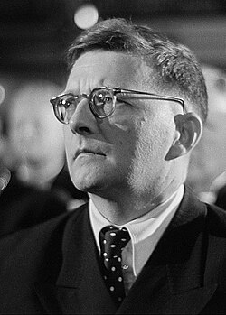

# Dmitri Shostakovich

## Biografía

Dmitri Dmítrievich Shostakóvich (en ruso: Дмитрий Дмитриевич Шостакович, romanización: Dmitrij Dmitrijević Šostaković,; San Petersburgo, 25 de septiembre de 1906-Moscú, 9 de agosto de 1975), conocido como Dmitri Shostakóvich, fue un compositor, director de orquesta y pianista soviético, uno de los músicos más importantes del siglo XX. Shostakóvich se hizo famoso en los años iniciales de la Unión Soviética, con obras como su Primera Sinfonía o la ópera La nariz, que combinaban con gran originalidad la tradición rusa y las corrientes modernas procedentes de occidente. Posteriormente, su música fue unas veces denunciada como decadente y reaccionaria y otras alabada como representativa del nuevo arte socialista por el Partido Comunista de la Unión Soviética (PCUS). En público, siempre se mostró leal con el sistema soviético, ocupó responsabilidades importantes en las instituciones artísticas, aceptó pertenecer al PCUS en 1960 y llegó a ser miembro del Sóviet Supremo de la Unión Soviética. Su actitud frente al gobierno y el Estado soviético ha sido objeto de agrias polémicas y se ha discutido enconadamente si fue o no un disidente clandestino frente a la URSS. Tras un período inicial en el que parecen primar las influencias de Serguéi Prokófiev, Ígor Stravinski y Paul Hindemith, Shostakóvich desarrolló un estilo híbrido del que es representativa su ópera Lady Macbeth de Mtsensk (1934). Posteriormente, derivó hacia un estilo posromántico, donde destaca la Quinta Sinfonía (1937), y en el que la influencia de Gustav Mahler se combina con la tradición musical rusa, con Modest Músorgski y Stravinski como referentes importantes. Integró todas esas influencias creando un estilo muy personal. Su música suele incluir contrastes agudos y elementos grotescos,​ con un componente rítmico muy destacado. En su obra orquestal destacan quince sinfonías y seis conciertos, en su música de cámara cabe mencionar especialmente sus quince cuartetos de cuerdas, también compuso varias óperas, así como música de cine y ballet.

## Estilo musical

2 Subsección Música Alternar música 2.1 Descripción general 2.2 Temas judíos 2.3 Autocitas 2.4 Publicaciones póstumas 2.5 Reputación

## Anécdotas y curiosidades

Compositor: Bernstein, Elmer Sello: DRG Duración: 41 minutos Información de la película Título original: The Buccaneer Director: Anthony Quinn Nacionalidad: EE UU Año: 1958 Argumento Aventuras de corsarios y piratas ambientada en el marco histórico de dos guerras: la franco-británica y la marítima de 1812 contra Estados Unidos a causa de la ley de no intercambio comercial con éste país. Compositor: Bernstein, Elmer Sello: DRG Duración: 41 minutos

## Top 10 bandas sonoras

1. ***Гамлет (Título en España: Hamlet)***
    * **Póster:** [link](020_dmitri_shostakovich/posters/poster_poster_1964.jpg)
2. ***Октябрь (Título en España: Octubre)***
    * **Póster:** [link](020_dmitri_shostakovich/posters/poster_poster_1928.jpg)
3. ***12 Стульев (Título en España: 12 Стульев)***
    * **Póster:** [link](020_dmitri_shostakovich/posters/poster_12_1966.jpg)
4. ***I sequestrati di Altona (Título en España: Los condenados de Altona)***
    * **Póster:** [link](020_dmitri_shostakovich/posters/poster_i_sequestrati_di_altona_1962.jpg)
5. ***Ентузіязм. Симфонія Донбасу (Título en España: Entusiasmo. Sinfonía del Donbass)***
    * **Póster:** [link](020_dmitri_shostakovich/posters/poster_poster_1930.jpg)
6. ***Первый эшелон (Título en España: Первый эшелон)***
    * **Póster:** [link](020_dmitri_shostakovich/posters/poster_poster_1955.jpg)
7. ***Король Лир (Título en España: El rey Lear)***
    * **Póster:** [link](020_dmitri_shostakovich/posters/poster_poster_1970.jpg)
8. ***Черёмушки (Título en España: Черёмушки)***
    * **Póster:** [link](020_dmitri_shostakovich/posters/poster_poster_1963.jpg)
9. ***Мичурин (Título en España: Мичурин)***
    * **Póster:** [link](020_dmitri_shostakovich/posters/poster_poster_1949.jpg)
10. ***Rostropovich: L'archet Indomptable (Título en España: Rostropovich: L'archet Indomptable)***
    * **Póster:** [link](020_dmitri_shostakovich/posters/poster_rostropovich_l_archet_indomptable_2019.jpg)

## Filmografía completa

- Октябрь (Título en España: Octubre) (1928) · [Póster](020_dmitri_shostakovich/posters/poster_poster_1928.jpg)
- Новый Вавилон (Título en España: La nueva Babilonia) (1929) · [Póster](020_dmitri_shostakovich/posters/poster_poster_1929.jpg)
- Ентузіязм. Симфонія Донбасу (Título en España: Entusiasmo. Sinfonía del Donbass) (1930) · [Póster](020_dmitri_shostakovich/posters/poster_poster_1930.jpg)
- Златые горы (Título en España: Златые горы) (1931) · [Póster](020_dmitri_shostakovich/posters/poster_poster_1931.jpg)
- Одна (Título en España: Одна) (1931) · [Póster](020_dmitri_shostakovich/posters/poster_poster_1931.jpg)
- Встречный (Título en España: Встречный) (1932) · [Póster](020_dmitri_shostakovich/posters/poster_poster_1932.jpg)
- Сказка о попе и его работнике Балде (Título en España: Сказка о попе и его работнике Балде) (1933) · [Póster](020_dmitri_shostakovich/posters/poster_poster_1933.jpg)
- Любовь и ненависть (Título en España: Любовь и ненависть) (1935) · [Póster](020_dmitri_shostakovich/posters/poster_poster_1935.jpg)
- Юность Максима (Título en España: Юность Максима) (1935) · [Póster](020_dmitri_shostakovich/posters/poster_poster_1935.jpg)
- Подруги (Título en España: Подруги) (1936) · [Póster](020_dmitri_shostakovich/posters/poster_poster_1936.jpg)
- Возвращение Максима (Título en España: Возвращение Максима) (1937) · [Póster](020_dmitri_shostakovich/posters/poster_poster_1937.jpg)
- Великий гражданин (Título en España: Великий гражданин) (1938) · [Póster](020_dmitri_shostakovich/posters/poster_poster_1938.jpg)
- Волочаевские дни (Título en España: Волочаевские дни) (1938) · [Póster](020_dmitri_shostakovich/posters/poster_poster_1938.jpg)
- Человек с ружьем (Título en España: Человек с ружьем) (1938) · [Póster](020_dmitri_shostakovich/posters/poster_poster_1938.jpg)
- Выборгская сторона (Título en España: Выборгская сторона) (1939) · [Póster](020_dmitri_shostakovich/posters/poster_poster_1939.jpg)
- Друзья (Título en España: Друзья) (1939) · [Póster](020_dmitri_shostakovich/posters/poster_poster_1939.jpg)
- Сказка о глупом мышонке (Título en España: Сказка о глупом мышонке) (1940) · [Póster](020_dmitri_shostakovich/posters/poster_poster_1940.jpg)
- Концерт-вальс (Título en España: Концерт-вальс) (1941) · [Póster](020_dmitri_shostakovich/posters/poster_poster_1941.jpg)
- Приключения Корзинкиной (Título en España: Приключения Корзинкиной) (1941) · [Póster](020_dmitri_shostakovich/posters/poster_poster_1941.jpg)
- Зоя (Título en España: Зоя) (1944) · [Póster](020_dmitri_shostakovich/posters/poster_poster_1944.jpg)
- Берлин (Título en España: Берлин) (1945) · [Póster](020_dmitri_shostakovich/posters/poster_poster_1945.jpg)
- Простые люди (Título en España: Простые люди) (1945) · [Póster](020_dmitri_shostakovich/posters/poster_poster_1945.jpg)
- Пирогов (Título en España: Пирогов) (1947) · [Póster](020_dmitri_shostakovich/posters/poster_poster_1947.jpg)
- Молодая гвардия (Título en España: Молодая гвардия) (1948) · [Póster](020_dmitri_shostakovich/posters/poster_poster_1948.jpg)
- Встреча на Эльбе (Título en España: Встреча на Эльбе) (1949) · [Póster](020_dmitri_shostakovich/posters/poster_poster_1949.jpg)
- Мичурин (Título en España: Мичурин) (1949) · [Póster](020_dmitri_shostakovich/posters/poster_poster_1949.jpg)
- Падение Берлина (Título en España: La caída de Berlín (primera parte)) (1950) · [Póster](020_dmitri_shostakovich/posters/poster_poster_1950.jpg)
- Незабываемый 1919 год (Título en España: Незабываемый 1919 год) (1951) · [Póster](020_dmitri_shostakovich/posters/poster_1919_1951.jpg)
- Прощай, Америка! (Título en España: Прощай, Америка!) (1951) · [Póster](020_dmitri_shostakovich/posters/poster_poster_1951.jpg)
- Белинский (Título en España: Белинский) (1953) · [Póster](020_dmitri_shostakovich/posters/poster_poster_1953.jpg)
- Овод (Título en España: Овод) (1955) · [Póster](020_dmitri_shostakovich/posters/poster_poster_1955.jpg)
- Первый эшелон (Título en España: Первый эшелон) (1955) · [Póster](020_dmitri_shostakovich/posters/poster_poster_1955.jpg)
- Пять дней – пять ночей (Título en España: Пять дней – пять ночей) (1961) · [Póster](020_dmitri_shostakovich/posters/poster_poster_1961.jpg)
- I sequestrati di Altona (Título en España: Los condenados de Altona) (1962) · [Póster](020_dmitri_shostakovich/posters/poster_i_sequestrati_di_altona_1962.jpg)
- Волшебный луч (Título en España: Волшебный луч) (1963) · [Póster](020_dmitri_shostakovich/posters/poster_poster_1963.jpg)
- Черёмушки (Título en España: Черёмушки) (1963) · [Póster](020_dmitri_shostakovich/posters/poster_poster_1963.jpg)
- Гамлет (Título en España: Hamlet) (1964) · [Póster](020_dmitri_shostakovich/posters/poster_poster_1964.jpg)
- Год как жизнь (Título en España: Год как жизнь) (1965) · [Póster](020_dmitri_shostakovich/posters/poster_poster_1965.jpg)
- 12 Стульев (Título en España: 12 Стульев) (1966) · [Póster](020_dmitri_shostakovich/posters/poster_12_1966.jpg)
- Софья Перовская (Título en España: Софья Перовская) (1968) · [Póster](020_dmitri_shostakovich/posters/poster_poster_1968.jpg)
- Сыны отечества (Título en España: Сыны отечества) (1969) · [Póster](020_dmitri_shostakovich/posters/poster_poster_1969.jpg)
- Король Лир (Título en España: El rey Lear) (1970) · [Póster](020_dmitri_shostakovich/posters/poster_poster_1970.jpg)
- Посланники вечности (Título en España: Посланники вечности) (1971) · [Póster](020_dmitri_shostakovich/posters/poster_poster_1971.jpg)
- Памятник (Título en España: Памятник) (1975) · [Póster](020_dmitri_shostakovich/posters/poster_poster_1975.jpg)
- The Nose (Título en España: The Nose) (1979) · [Póster](020_dmitri_shostakovich/posters/poster_the_nose_1979.jpg)
- Дмитрий Шостакович. Альтовая соната (Título en España: Дмитрий Шостакович. Альтовая соната) (1981) · [Póster](020_dmitri_shostakovich/posters/poster_poster_1981.jpg)
- Ты должен жить (Título en España: Ты должен жить) (1981) · [Póster](020_dmitri_shostakovich/posters/poster_poster_1981.jpg)
- Цветомузыка (Título en España: Цветомузыка) (1981) · [Póster](020_dmitri_shostakovich/posters/poster_poster_1981.jpg)
- Девятое января (Título en España: Девятое января) (1985) · [Póster](020_dmitri_shostakovich/posters/poster_poster_1985.jpg)
- The War Symphonies: Shostakovich Against Stalin (Título en España: The War Symphonies: Shostakovich Against Stalin) (1997) · [Póster](020_dmitri_shostakovich/posters/poster_the_war_symphonies_shostakovich_against_stalin_1997.jpg)
- Небо. Последний сон (Título en España: Небо. Последний сон) (1997) · [Póster](020_dmitri_shostakovich/posters/poster_poster_1997.jpg)
- Lady Macbeth of Mtsensk (Título en España: Lady Macbeth of Mtsensk) (2002) · [Póster](020_dmitri_shostakovich/posters/poster_lady_macbeth_of_mtsensk_2002.jpg)
- A Journey of Dmitry Shostakovich (Título en España: A Journey of Dmitry Shostakovich) (2007) · [Póster](020_dmitri_shostakovich/posters/poster_a_journey_of_dmitry_shostakovich_2007.jpg)
- Shostakovich: Lady Macbeth of Mtsensk (Título en España: Shostakovich: Lady Macbeth of Mtsensk) (2007) · [Póster](020_dmitri_shostakovich/posters/poster_shostakovich_lady_macbeth_of_mtsensk_2007.jpg)
- Bolshoi Ballet: The Bright Stream (Título en España: Bolshoi Ballet: The Bright Stream) (2012) · [Póster](020_dmitri_shostakovich/posters/poster_bolshoi_ballet_the_bright_stream_2012.jpg)
- The Metropolitan Opera: The Nose (Título en España: The Metropolitan Opera: The Nose) (2013) · [Póster](020_dmitri_shostakovich/posters/poster_the_metropolitan_opera_the_nose_2013.jpg)
- Orango (Título en España: Orango) (2014) · [Póster](020_dmitri_shostakovich/posters/poster_orango_2014.jpg)
- Hypothetically Murdered (Título en España: Hypothetically Murdered) (2015) · [Póster](020_dmitri_shostakovich/posters/poster_hypothetically_murdered_2015.jpg)
- Chostakovitch: Lady Macbeth de Mzensk (Título en España: Chostakovitch: Lady Macbeth de Mzensk) (2016) · [Póster](020_dmitri_shostakovich/posters/poster_chostakovitch_lady_macbeth_de_mzensk_2016.jpg)
- Concerto / Enigma Variations / Raymonda Act III (Royal Ballet) (Título en España: Concerto / Enigma Variations / Raymonda Act III (Royal Ballet)) (2019) · [Póster](020_dmitri_shostakovich/posters/poster_concerto_enigma_variations_raymonda_act_iii_royal_ballet_2019.jpg)
- Rostropovich: L'archet Indomptable (Título en España: Rostropovich: L'archet Indomptable) (2019) · [Póster](020_dmitri_shostakovich/posters/poster_rostropovich_l_archet_indomptable_2019.jpg)
- Shostakovich: Lady Macbeth of Mtsensk (Título en España: Shostakovich: Lady Macbeth of Mtsensk) (2019) · [Póster](020_dmitri_shostakovich/posters/poster_shostakovich_lady_macbeth_of_mtsensk_2019.jpg)
- Архитектура Блокады (Título en España: Архитектура Блокады) (2020) · [Póster](020_dmitri_shostakovich/posters/poster_poster_2020.jpg)
- New Year's Eve Concert 2022 With the Berlin Philharmonic Orchestra (Título en España: New Year's Eve Concert 2022 With the Berlin Philharmonic Orchestra) (2022) · [Póster](020_dmitri_shostakovich/posters/poster_new_year_s_eve_concert_2022_with_the_berlin_philharmonic_orchestra_2022.jpg)
- P-FACTOR Piano Musical Duels (Título en España: P-FACTOR Piano Musical Duels) (2024) · [Póster](020_dmitri_shostakovich/posters/poster_p_factor_piano_musical_duels_2024.jpg)
- Alain Altinoglu conducts Shostakovich Symphony no.8 (Título en España: Alain Altinoglu conducts Shostakovich Symphony no.8) (2025) · [Póster](020_dmitri_shostakovich/posters/poster_alain_altinoglu_conducts_shostakovich_symphony_no_8_2025.jpg)
- Daniil Trifonov et Andris Nelsons Festival Chostakovitch 2025 (Título en España: Daniil Trifonov et Andris Nelsons Festival Chostakovitch 2025) (2025) · [Póster](020_dmitri_shostakovich/posters/poster_daniil_trifonov_et_andris_nelsons_festival_chostakovitch_2025_2025.jpg)
- Lady Macbeth of Mtsensk (Título en España: Lady Macbeth of Mtsensk) (2025) · [Póster](020_dmitri_shostakovich/posters/poster_lady_macbeth_of_mtsensk_2025.jpg)
- Shostakovich: Symphony No. 7 'Leningrad' Gewandhaus, Leipzig (Título en España: Shostakovich: Symphony No. 7 'Leningrad' Gewandhaus, Leipzig) (2025) · [Póster](020_dmitri_shostakovich/posters/poster_shostakovich_symphony_no_7_leningrad_gewandhaus_leipzig_2025.jpg)
- Tabita Berglund and Julian Steckel Sibelius, Shostakovich, Thorvaldsdottir (Título en España: Tabita Berglund and Julian Steckel Sibelius, Shostakovich, Thorvaldsdottir) (2025) · [Póster](020_dmitri_shostakovich/posters/poster_tabita_berglund_and_julian_steckel_sibelius_shostakovich_thorvaldsdottir_2025.jpg)
- Una Lady Macbeth del distretto di Mcensk (Título en España: Una Lady Macbeth del distretto di Mcensk) (2025) · [Póster](020_dmitri_shostakovich/posters/poster_una_lady_macbeth_del_distretto_di_mcensk_2025.jpg)

## Premios y nominaciones

* 1940 – Orden de la Bandera Roja del Trabajo – (Ganador)
* 1941 – Premio Stalin – (Ganador)
* 1942 – Honrado trabajador del arte de la República Socialista Federativa Soviética de Rusia – (Ganador)
* 1942 – Premio Stalin – por *Bruckner: Symphony No. 7 (Título en España: Bruckner: Symphony No. 7)* – (Ganador)
* 1946 – Orden de Lenin – (Ganador)
* 1946 – Premio Stalin – (Ganador)
* 1947 – Artista del Pueblo de la RSFSR – (Ganador)
* 1950 – Premio Stalin – por *The Fall of Berlin (Título en España: The Fall of Berlin)* – (Ganador)
* 1952 – Premio Stalin – (Ganador)
* 1954 – Artista del Pueblo de la URSS – (Ganador)
* 1954 – Premios del Consejo Mundial de la Paz – (Ganador)
* 1956 – Orden de Lenin – (Ganador)
* 1958 – Premio Lenin – por *Bruckner 11 - Symphony F minor / D minor / No. 5 (Título en España: Bruckner 11 - Symphony F minor / D minor / No. 5)* – (Ganador)
* 1958 – Premio Wihur Sibelius – (Ganador)
* 1962 – Premio de la Academia a la mejor partitura musical original – por *Khovanshchina (Título en España: Khovanshchina)* – (Nominación)
* 1966 – Medalla de oro "Hoz y Martillo" – (Ganador)
* 1966 – Medalla de oro de la Real Sociedad Filarmónica – (Ganador)
* 1966 – Orden de Lenin – (Ganador)
* 1967 – Gran Medalla de Honor de Plata por Servicios a la República de Austria – (Ganador)
* 1968 – Premio Estatal de la URSS – (Ganador)
* 1971 – Orden de la Revolución de Octubre – (Ganador)
* 1972 – Artista del Pueblo de la RSS de Azerbaiyán – (Ganador)
* 1972 – Estrella de la amistad popular – (Ganador)
* 1972 – Orden de Amistad de los Pueblos – (Ganador)
* 1973 – Premio de Música Léonie Sonning – (Ganador)
* 1974 – Condecoración austriaca para la ciencia y el arte – (Ganador)
* 1974 – Premio Estatal Glinka de la RSFSR – (Ganador)
* 1976 – Premio Nacional Shevchenko – (Ganador)
* Artista del Pueblo de la República de Bashkortostán – (Ganador)
* Condecoración de Honor por Servicios a la República de Austria – (Ganador)
* Héroe del Trabajo Socialista – (Ganador)
* Medalla "Por el trabajo valiente en la Gran Guerra Patria 1941-1945" – (Ganador)
* Medalla "Por la defensa de Leningrado" – (Ganador)
* Medalla "Veterano del Trabajo" – (Ganador)
* Medalla del Jubileo "En conmemoración del 250 aniversario de Leningrado" – (Ganador)
* Medalla del Jubileo "En conmemoración del centenario del nacimiento de Vladimir Ilich Lenin" – (Ganador)
* Medalla del Jubileo "Treinta años de victoria en la Gran Guerra Patria, 1941-1945" – (Ganador)
* Orden de las Artes y las Letras – (Ganador)
* Premio Estatal Stalin, 1er grado – (Ganador)
* Premio Stalin, 2do grado – (Ganador)

## Fuentes adicionales

* [MundoBSO](https://w.mundobso.com/bso/cartero-siempre-llama-dos-veces-el) — site:mundobso.com
* [MundoBSO (2)](https://www.mundobso.com/bso/bucaneros-los) — site:mundobso.com
* [MundoBSO (3)](https://www.mundobso.com/bso/dmitri-shostakovich-music-from-the-films) — site:mundobso.com
* [Film Score Monthly](https://www.filmscoremonthly.com/board/posts.cfm?forumID=1&pageID=2&threadID=30302&archive=1) — site:filmscoremonthly.com
* [Film Score Monthly (2)](https://www.filmscoremonthly.com/backissues/viewissue.cfm?issueID=60) — site:filmscoremonthly.com
* [Film Score Monthly (3)](https://www.filmscoremonthly.com/board/posts.cfm?threadID=15854&forumID=1&archive=1) — site:filmscoremonthly.com
* [SoundtrackCollector](https://www.soundtrackcollector.com/title/37123/Gamlet) — site:soundtrackcollector.com
* [SoundtrackCollector (2)](https://soundtrackcollector.com) — site:soundtrackcollector.com
* [SoundtrackCollector (3)](https://www.soundtrackcollector.com) — site:soundtrackcollector.com
* [WhatSong](https://www.whatsong.org/tvshow/how-i-met-your-mother/episode/44483) — site:whatsong.org
* [WhatSong (2)](https://whatsong.org) — site:whatsong.org
* [WhatSong (3)](https://whatsong.org) — site:whatsong.org

## Notas externas

* MundoBSO (2): Compositor: Bernstein, Elmer Sello: DRG Duración: 41 minutos Información de la película Título original: The Buccaneer Director: Anthony Quinn Nacionalidad: EE UU Año: 1958 Argumento Aventuras de corsarios y piratas ambientada en el marco histórico de dos guerras: la franco-británica y la marítima de 1812 contra Estados Unidos a causa de la ley de no intercambio comercial con éste país. Compositor: Bernstein, Elmer Sello: DRG Duración: 41 minutos
* MundoBSO (3): Compositor: Shostakovich, Dmitri Sello: Delos Duración: 62 minutos Información de la película Título original: Dmitri Shostakovich: Music from the Films Nacionalidad: EE UU Año: 2011 Compositor: Shostakovich, Dmitri Sello: Delos Duración: 62 minutos
* SoundtrackCollector (3): 14 de enero - Confesión de un comisionado de policía de Riz Ortolani a la fiscalía 3 de diciembre - Wolf Hall de Debbie Wiseman: El espejo y la luz
* WhatSong: Lily y Robin bailan con los dos nerds del último año de secundaria. Se reproduce de fondo cuando Lilly, Robin y Barney intentan entrar a la fiesta. La canción es una canción que está incluida en iMovie.
* interlude.hk: Interludio Conozca a nuestros colaboradores Acerca de Joanna Latala Acerca de The Sokolover Acerca de Bruce Robinson Acerca de Siri Livingston Acerca de Emily E. Hogstad Acerca de Hermione Lai Acerca de Fanny Po Sim Head Acerca de Philip Eisenbeiss Acerca de Frances Wilson Acerca de Frank Xu Acerca de Serenade Acerca de Rudolph Tang Acerca de Guy Francis Acerca de Anson Yeung Acerca de Rob J Kennedy Acerca de Chris Lloyd Acerca de Doug Thomas Acerca de Maureen Buja Acerca de William Cole Acerca de Desiree Ho Acerca de Janet Horvath Acerca de Jenny Lee Acerca de Marco Moraes Acerca de Oliver Pashley Acerca de Georg Predota Acerca de Ellen Wong Tso Acerca de Nicolette Wong Acerca de Ursula Rehn Wolfman Conozca a nuestros colaboradores Acerca de Joanna Latala Acerca de The Sokolover Acerca de Bruce Robinson Acerca de Siri Livingston Acerca de...
* classicallife.net: [De los archivos: Publicado por primera vez el 7 de diciembre de 1998] MÚSICA CLÁSICA: Maxim Shostakovich, quien dirige la Sinfónica del Pacífico esta semana, dedica su vida a defender a su padre.
* gulfcoastsymphony.org: Serie Serie Pops Jazz en el MACC Serie de Teatro MACC Presenta Conjuntos Residentes Sinfónica de la Costa del Golfo Compañía de Teatro del Suroeste de Florida Colectivo de Jazz de la Costa del Golfo
* jeanmichelserres.com: Jean-Michel Serres, compositor y pianista (Apfel Café Music): sitio web Lanzamientos de música clásica Todos los lanzamientos de música clásica Charles Koechlin Mel Bonis Moritz Moszkowski Oskar Merikanto Cécile Chaminade Erik Satie
* courses.lumenlearning.com: Como ya se ha mencionado, Shostakovich abordó preocupaciones políticas que ninguno de los otros compositores que hemos estudiado afrontó. Durante la época de Stalin, un artista soviético cuyo trabajo fuera denunciado por el aparato del partido comunista podría haber enfrentado prisión o ejecución. Preste mucha atención a los ajustes que tuvo que hacer en su estilo musical, particularmente en relación con la Quinta Sinfonía, por temor a su seguridad y la de su familia. Observe también la cantidad de amigos y colegas que fueron ejecutados durante el período conocido como el Gran Terror. Dmitri Dmitriyevich Shostakovich (25 de septiembre de 1906 – 9 de agosto de 1975) fue un compositor y pianista ruso, y una figura destacada de...
* www.dallassymphony.org: Formación de músicos Programa de Jóvenes Músicos Kim Noltemy Cuerdas jóvenes Coro Infantil de la Sinfónica de Dallas Para estudiantes Consejo de Adolescentes DSO Concursos Becas
* www.dallassymphony.org: Conciertos y boletos Calendario Suscripciones y paquetes Ventas grupales Ofertas especiales Capacitación para músicos Programa de jóvenes músicos The Kim Noltemy Young Strings Dallas Symphony Children’s Chorus
* www.britannica.com: Nuestros editores revisarán lo que ha enviado y determinarán si deben revisar el artículo. BBC - Shostakovich: El compositor que casi fue purgado
