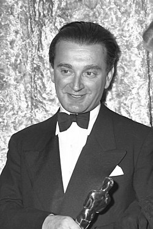

# Miklós Rózsa

## Biografía

Miklós Rózsa (Budapest, 18 de abril de 1907 - Los Ángeles, 27 de julio de 1995) fue un compositor de música sinfónica y cinematográfica, especializado en películas de corte histórico. Nacido en Hungría, consiguió la ciudadanía estadounidense. Se formó musicalmente en Alemania (1925–1931) y desarrolló su vida profesional en Francia (1931–1935), el Reino Unido (1935–1940) y los Estados Unidos (1940–1995), con extensas estancias en Italia de 1953 en adelante.​ Es sobre todo conocido por sus casi cien bandas sonoras para películas. Sin embargo, mantuvo una firme lealtad a los conciertos de música clásica, a través de lo que llamaba su «doble vida.»​ Rózsa alcanzó el éxito en Europa, cuando todavía era muy joven, con su composición orquestal Theme, Variations, and Finale (Op. 13) de 1933; destacó pronto en la industria cinematográfica con música para películas como Las cuatro plumas (The Four Feathers, 1939) and El ladrón de Bagdad (The Thief of Bagdad, 1940). Este último proyecto le llevó a Hollywood cuando la producción se trasladó allí desde una Gran Bretaña en guerra; Rózsa permaneció en los Estados Unidos y consiguió la ciudadanía en 1946.

## Estilo musical

Rózsa logró un éxito temprano en Europa con su tema orquestal, variaciones y final (Op. 13) de 1933, y se hizo prominente en la industria cinematográfica con partituras tan tempranas como Las cuatro plumas (1939) y El ladrón de Bagdad (1940). Este último proyecto lo llevó a Hollywood cuando la producción fue trasladada desde Gran Bretaña en tiempos de guerra, y Rózsa permaneció en los Estados Unidos, convirtiéndose en ciudadano estadounidense en 1946.

## Anécdotas y curiosidades

Miklós Rózsa (húngaro: [ˈmikloːʃ ˈroːʒɒ]; 18 de abril de 1907 - 27 de julio de 1995) [1] fue un compositor húngaro-estadounidense formado en Alemania (1925-1931) y activo en Francia (1931-1935), el Reino Unido (1935-1940) y los Estados Unidos. (1940-1995), con extensas estancias en Italia desde 1953 en adelante. [ 2 ] Más conocido por sus casi cien bandas sonoras cinematográficas, mantuvo sin embargo una firme lealtad a la música de concierto absoluta a lo largo de lo que llamó su "doble vida". [ 3 ]

## Top 10 bandas sonoras

1. ***Ben-Hur (Título en España: Ben-Hur)***
    * **Póster:** [link](021_mikl_s_r_zsa/posters/poster_ben_hur_1959.jpg)
2. ***Double Indemnity (Título en España: Perdición)***
    * **Póster:** [link](021_mikl_s_r_zsa/posters/poster_double_indemnity_1944.jpg)
3. ***Spellbound (Título en España: Recuerda)***
    * **Póster:** [link](021_mikl_s_r_zsa/posters/poster_spellbound_1945.jpg)
4. ***Ivanhoe (Título en España: Ivanhoe)***
    * **Póster:** [link](021_mikl_s_r_zsa/posters/poster_ivanhoe_1952.jpg)
5. ***The Lost Weekend (Título en España: Días sin huella)***
    * **Póster:** [link](021_mikl_s_r_zsa/posters/poster_the_lost_weekend_1945.jpg)
6. ***Quo Vadis (Título en España: Quo Vadis)***
    * **Póster:** [link](021_mikl_s_r_zsa/posters/poster_quo_vadis_1951.jpg)
7. ***The Killers (Título en España: Forajidos)***
    * **Póster:** [link](021_mikl_s_r_zsa/posters/poster_the_killers_1946.jpg)
8. ***El Cid (Título en España: El Cid)***
    * **Póster:** [link](021_mikl_s_r_zsa/posters/poster_el_cid_1961.jpg)
9. ***The Thief of Bagdad (Título en España: El ladrón de Bagdad)***
    * **Póster:** [link](021_mikl_s_r_zsa/posters/poster_the_thief_of_bagdad_1940.jpg)
10. ***A Double Life (Título en España: Doble vida)***
    * **Póster:** [link](021_mikl_s_r_zsa/posters/poster_a_double_life_1947.jpg)

## Filmografía completa

- Knight Without Armour (Título en España: La condesa Alexandra) (1937) · [Póster](021_mikl_s_r_zsa/posters/poster_knight_without_armour_1937.jpg)
- The Green Cockatoo (Título en España: The Green Cockatoo) (1937) · [Póster](021_mikl_s_r_zsa/posters/poster_the_green_cockatoo_1937.jpg)
- The Squeaker (Título en España: The Squeaker) (1937) · [Póster](021_mikl_s_r_zsa/posters/poster_the_squeaker_1937.jpg)
- Thunder in the City (Título en España: Thunder in the City) (1937) · [Póster](021_mikl_s_r_zsa/posters/poster_thunder_in_the_city_1937.jpg)
- The Divorce of Lady X (Título en España: El divorcio de la señorita X) (1938) · [Póster](021_mikl_s_r_zsa/posters/poster_the_divorce_of_lady_x_1938.jpg)
- The Spy in Black (Título en España: El espía negro) (1939) · [Póster](021_mikl_s_r_zsa/posters/poster_the_spy_in_black_1939.jpg)
- The Four Feathers (Título en España: Las cuatro plumas) (1939) · [Póster](021_mikl_s_r_zsa/posters/poster_the_four_feathers_1939.jpg)
- On the Night of the Fire (Título en España: Mientras arde el fuego) (1939) · [Póster](021_mikl_s_r_zsa/posters/poster_on_the_night_of_the_fire_1939.jpg)
- The Thief of Bagdad (Título en España: El ladrón de Bagdad) (1940) · [Póster](021_mikl_s_r_zsa/posters/poster_the_thief_of_bagdad_1940.jpg)
- Ten Days in Paris (Título en España: Ten Days in Paris) (1940) · [Póster](021_mikl_s_r_zsa/posters/poster_ten_days_in_paris_1940.jpg)
- Sundown (Título en España: Cuando muere el día) (1941) · [Póster](021_mikl_s_r_zsa/posters/poster_sundown_1941.jpg)
- That Hamilton Woman (Título en España: Lady Hamilton) (1941) · [Póster](021_mikl_s_r_zsa/posters/poster_that_hamilton_woman_1941.jpg)
- The Saint's Vacation (Título en España: Las vacaciones del Santo) (1941) · [Póster](021_mikl_s_r_zsa/posters/poster_the_saint_s_vacation_1941.jpg)
- Lydia (Título en España: Lydia) (1941) · [Póster](021_mikl_s_r_zsa/posters/poster_lydia_1941.jpg)
- New Wine (Título en España: New Wine) (1941) · [Póster](021_mikl_s_r_zsa/posters/poster_new_wine_1941.jpg)
- Jungle Book (Título en España: El libro de la selva) (1942) · [Póster](021_mikl_s_r_zsa/posters/poster_jungle_book_1942.jpg)
- Jacaré (Título en España: Jacaré) (1942) · [Póster](021_mikl_s_r_zsa/posters/poster_jacar_1942.jpg)
- Five Graves to Cairo (Título en España: Cinco tumbas al Cairo) (1943) · [Póster](021_mikl_s_r_zsa/posters/poster_five_graves_to_cairo_1943.jpg)
- Sahara (Título en España: Sahara) (1943) · [Póster](021_mikl_s_r_zsa/posters/poster_sahara_1943.jpg)
- So Proudly We Hail (Título en España: Sangre en Filipinas) (1943) · [Póster](021_mikl_s_r_zsa/posters/poster_so_proudly_we_hail_1943.jpg)
- The Woman of the Town (Título en España: Una dama en el oeste) (1943) · [Póster](021_mikl_s_r_zsa/posters/poster_the_woman_of_the_town_1943.jpg)
- Dark Waters (Título en España: Aguas turbias) (1944) · [Póster](021_mikl_s_r_zsa/posters/poster_dark_waters_1944.jpg)
- Double Indemnity (Título en España: Perdición) (1944) · [Póster](021_mikl_s_r_zsa/posters/poster_double_indemnity_1944.jpg)
- The Hour Before the Dawn (Título en España: The Hour Before the Dawn) (1944) · [Póster](021_mikl_s_r_zsa/posters/poster_the_hour_before_the_dawn_1944.jpg)
- The Lost Weekend (Título en España: Días sin huella) (1945) · [Póster](021_mikl_s_r_zsa/posters/poster_the_lost_weekend_1945.jpg)
- The Man in Half Moon Street (Título en España: El hombre que quiso ser Dios) (1945) · [Póster](021_mikl_s_r_zsa/posters/poster_the_man_in_half_moon_street_1945.jpg)
- Lady on a Train (Título en España: La dama del tren) (1945) · [Póster](021_mikl_s_r_zsa/posters/poster_lady_on_a_train_1945.jpg)
- Spellbound (Título en España: Recuerda) (1945) · [Póster](021_mikl_s_r_zsa/posters/poster_spellbound_1945.jpg)
- Blood on the Sun (Título en España: Sangre sobre el sol) (1945) · [Póster](021_mikl_s_r_zsa/posters/poster_blood_on_the_sun_1945.jpg)
- The Strange Love of Martha Ivers (Título en España: El extraño amor de Martha Ivers) (1946) · [Póster](021_mikl_s_r_zsa/posters/poster_the_strange_love_of_martha_ivers_1946.jpg)
- The Killers (Título en España: Forajidos) (1946) · [Póster](021_mikl_s_r_zsa/posters/poster_the_killers_1946.jpg)
- Because of Him (Título en España: Su primera noche) (1946) · [Póster](021_mikl_s_r_zsa/posters/poster_because_of_him_1946.jpg)
- Time Out of Mind (Título en España: Almas borrascosas) (1947) · [Póster](021_mikl_s_r_zsa/posters/poster_time_out_of_mind_1947.jpg)
- A Double Life (Título en España: Doble vida) (1947) · [Póster](021_mikl_s_r_zsa/posters/poster_a_double_life_1947.jpg)
- The Other Love (Título en España: El Otro Amor) (1947) · [Póster](021_mikl_s_r_zsa/posters/poster_the_other_love_1947.jpg)
- Brute Force (Título en España: Fuerza bruta) (1947) · [Póster](021_mikl_s_r_zsa/posters/poster_brute_force_1947.jpg)
- The Red House (Título en España: La casa roja) (1947) · [Póster](021_mikl_s_r_zsa/posters/poster_the_red_house_1947.jpg)
- Desert Fury (Título en España: La hija del pecado) (1947) · [Póster](021_mikl_s_r_zsa/posters/poster_desert_fury_1947.jpg)
- The Macomber Affair (Título en España: Pasión en la selva) (1947) · [Póster](021_mikl_s_r_zsa/posters/poster_the_macomber_affair_1947.jpg)
- Song of Scheherazade (Título en España: Scheherezade) (1947) · [Póster](021_mikl_s_r_zsa/posters/poster_song_of_scheherazade_1947.jpg)
- Secret Beyond the Door (Título en España: Secreto tras la puerta) (1947) · [Póster](021_mikl_s_r_zsa/posters/poster_secret_beyond_the_door_1947.jpg)
- The Naked City (Título en España: La ciudad desnuda) (1948) · [Póster](021_mikl_s_r_zsa/posters/poster_the_naked_city_1948.jpg)
- Kiss the Blood Off My Hands (Título en España: Sangre en las manos) (1948) · [Póster](021_mikl_s_r_zsa/posters/poster_kiss_the_blood_off_my_hands_1948.jpg)
- Command Decision (Título en España: Sublime decisión) (1948) · [Póster](021_mikl_s_r_zsa/posters/poster_command_decision_1948.jpg)
- A Woman's Vengeance (Título en España: Venganza de mujer) (1948) · [Póster](021_mikl_s_r_zsa/posters/poster_a_woman_s_vengeance_1948.jpg)
- The Red Danube (Título en España: El Danubio rojo) (1949) · [Póster](021_mikl_s_r_zsa/posters/poster_the_red_danube_1949.jpg)
- Criss Cross (Título en España: El abrazo de la muerte) (1949) · [Póster](021_mikl_s_r_zsa/posters/poster_criss_cross_1949.jpg)
- Adam's Rib (Título en España: La costilla de Adán) (1949) · [Póster](021_mikl_s_r_zsa/posters/poster_adam_s_rib_1949.jpg)
- Madame Bovary (Título en España: Madame Bovary) (1949) · [Póster](021_mikl_s_r_zsa/posters/poster_madame_bovary_1949.jpg)
- East Side, West Side (Título en España: Mundos opuestos) (1949) · [Póster](021_mikl_s_r_zsa/posters/poster_east_side_west_side_1949.jpg)
- The Bribe (Título en España: Soborno) (1949) · [Póster](021_mikl_s_r_zsa/posters/poster_the_bribe_1949.jpg)
- Crisis (Título en España: Crisis) (1950) · [Póster](021_mikl_s_r_zsa/posters/poster_crisis_1950.jpg)
- The Asphalt Jungle (Título en España: La jungla de asfalto) (1950) · [Póster](021_mikl_s_r_zsa/posters/poster_the_asphalt_jungle_1950.jpg)
- The Light Touch (Título en España: El milagro del cuadro) (1951) · [Póster](021_mikl_s_r_zsa/posters/poster_the_light_touch_1951.jpg)
- Quo Vadis (Título en España: Quo Vadis) (1951) · [Póster](021_mikl_s_r_zsa/posters/poster_quo_vadis_1951.jpg)
- Ivanhoe (Título en España: Ivanhoe) (1952) · [Póster](021_mikl_s_r_zsa/posters/poster_ivanhoe_1952.jpg)
- Plymouth Adventure (Título en España: La nave del destino) (1952) · [Póster](021_mikl_s_r_zsa/posters/poster_plymouth_adventure_1952.jpg)
- Young Bess (Título en España: La reina virgen) (1953) · [Póster](021_mikl_s_r_zsa/posters/poster_young_bess_1953.jpg)
- Knights of the Round Table (Título en España: Los caballeros del rey Arturo) (1953) · [Póster](021_mikl_s_r_zsa/posters/poster_knights_of_the_round_table_1953.jpg)
- All the Brothers Were Valiant (Título en España: Todos los hermanos eran valientes) (1953) · [Póster](021_mikl_s_r_zsa/posters/poster_all_the_brothers_were_valiant_1953.jpg)
- The Story of Three Loves (Título en España: Tres amores) (1953) · [Póster](021_mikl_s_r_zsa/posters/poster_the_story_of_three_loves_1953.jpg)
- Valley of the Kings (Título en España: El valle de los reyes) (1954) · [Póster](021_mikl_s_r_zsa/posters/poster_valley_of_the_kings_1954.jpg)
- Men of the Fighting Lady (Título en España: Escuadrilla heroica) (1954) · [Póster](021_mikl_s_r_zsa/posters/poster_men_of_the_fighting_lady_1954.jpg)
- Green Fire (Título en España: Fuego verde) (1954) · [Póster](021_mikl_s_r_zsa/posters/poster_green_fire_1954.jpg)
- Seagulls Over Sorrento (Título en España: La cresta de la ola) (1954) · [Póster](021_mikl_s_r_zsa/posters/poster_seagulls_over_sorrento_1954.jpg)
- The King's Thief (Título en España: El capitán del rey) (1955) · [Póster](021_mikl_s_r_zsa/posters/poster_the_king_s_thief_1955.jpg)
- Moonfleet (Título en España: Los contrabandistas de Moonfleet) (1955) · [Póster](021_mikl_s_r_zsa/posters/poster_moonfleet_1955.jpg)
- Diane (Título en España: Astucias de mujer) (1956) · [Póster](021_mikl_s_r_zsa/posters/poster_diane_1956.jpg)
- Bhowani Junction (Título en España: Cruce de destinos) (1956) · [Póster](021_mikl_s_r_zsa/posters/poster_bhowani_junction_1956.jpg)
- Lust for Life (Título en España: El loco del pelo rojo) (1956) · [Póster](021_mikl_s_r_zsa/posters/poster_lust_for_life_1956.jpg)
- Tribute to a Bad Man (Título en España: La ley de la horca) (1956) · [Póster](021_mikl_s_r_zsa/posters/poster_tribute_to_a_bad_man_1956.jpg)
- Tip on a Dead Jockey (Título en España: Apuesta por un jinete) (1957) · [Póster](021_mikl_s_r_zsa/posters/poster_tip_on_a_dead_jockey_1957.jpg)
- Something of Value (Título en España: Sangre sobre la tierra) (1957) · [Póster](021_mikl_s_r_zsa/posters/poster_something_of_value_1957.jpg)
- The Seventh Sin (Título en España: The Seventh Sin) (1957) · [Póster](021_mikl_s_r_zsa/posters/poster_the_seventh_sin_1957.jpg)
- A Time to Love and a Time to Die (Título en España: Tiempo de amar, tiempo de morir) (1958) · [Póster](021_mikl_s_r_zsa/posters/poster_a_time_to_love_and_a_time_to_die_1958.jpg)
- Ben-Hur (Título en España: Ben-Hur) (1959) · [Póster](021_mikl_s_r_zsa/posters/poster_ben_hur_1959.jpg)
- The World, the Flesh and the Devil (Título en España: El mundo, la carne y el diablo) (1959) · [Póster](021_mikl_s_r_zsa/posters/poster_the_world_the_flesh_and_the_devil_1959.jpg)
- El Cid (Título en España: El Cid) (1961) · [Póster](021_mikl_s_r_zsa/posters/poster_el_cid_1961.jpg)
- King of Kings (Título en España: Rey de reyes) (1961) · [Póster](021_mikl_s_r_zsa/posters/poster_king_of_kings_1961.jpg)
- Sodom and Gomorrah (Título en España: Sodoma y Gomorra) (1962) · [Póster](021_mikl_s_r_zsa/posters/poster_sodom_and_gomorrah_1962.jpg)
- The V.I.P.s (Título en España: Hotel Internacional) (1963) · [Póster](021_mikl_s_r_zsa/posters/poster_the_v_i_p_s_1963.jpg)
- The Green Berets (Título en España: Boinas verdes) (1968) · [Póster](021_mikl_s_r_zsa/posters/poster_the_green_berets_1968.jpg)
- The Power (Título en España: El poder) (1968) · [Póster](021_mikl_s_r_zsa/posters/poster_the_power_1968.jpg)
- The Private Life of Sherlock Holmes (Título en España: La vida privada de Sherlock Holmes) (1970) · [Póster](021_mikl_s_r_zsa/posters/poster_the_private_life_of_sherlock_holmes_1970.jpg)
- The Golden Voyage of Sinbad (Título en España: El viaje fantástico de Simbad) (1973) · [Póster](021_mikl_s_r_zsa/posters/poster_the_golden_voyage_of_sinbad_1973.jpg)
- Hollywood's Musical Moods (Título en España: Hollywood's Musical Moods) (1976) · [Póster](021_mikl_s_r_zsa/posters/poster_hollywood_s_musical_moods_1976.jpg)
- Providence (Título en España: Providence) (1977) · [Póster](021_mikl_s_r_zsa/posters/poster_providence_1977.jpg)
- The Private Files of J. Edgar Hoover (Título en España: The Private Files of J. Edgar Hoover) (1977) · [Póster](021_mikl_s_r_zsa/posters/poster_the_private_files_of_j_edgar_hoover_1977.jpg)
- Fedora (Título en España: Fedora) (1978) · [Póster](021_mikl_s_r_zsa/posters/poster_fedora_1978.jpg)
- Last Embrace (Título en España: El eslabón del Niágara) (1979) · [Póster](021_mikl_s_r_zsa/posters/poster_last_embrace_1979.jpg)
- Time After Time (Título en España: Los pasajeros del tiempo) (1979) · [Póster](021_mikl_s_r_zsa/posters/poster_time_after_time_1979.jpg)
- Eye of the Needle (Título en España: El ojo de la aguja) (1981) · [Póster](021_mikl_s_r_zsa/posters/poster_eye_of_the_needle_1981.jpg)
- Dead Men Don't Wear Plaid (Título en España: Cliente muerto no paga) (1982) · [Póster](021_mikl_s_r_zsa/posters/poster_dead_men_don_t_wear_plaid_1982.jpg)
- En quête des sœurs Papin (Título en España: En quête des sœurs Papin) (2000) · [Póster](021_mikl_s_r_zsa/posters/poster_en_qu_te_des_s_urs_papin_2000.jpg)

## Premios y nominaciones

* 1941 – Premio de la Academia a la mejor banda sonora original – por *The Thief of Bagdad (Título en España: El ladrón de Bagdad)* – (Nominación)
* 1942 – Premio de la Academia a la mejor banda sonora dramática original – por *Lydia (Título en España: Lydia)* – (Nominación)
* 1942 – Premio de la Academia a la mejor banda sonora dramática original – por *Sundown (Título en España: Cuando muere el día)* – (Nominación)
* 1943 – Premio de la Academia a la mejor banda sonora original de comedia o drama – por *Jungle Book (Título en España: El libro de la selva)* – (Nominación)
* 1945 – Premio de la Academia a la mejor banda sonora original de comedia o drama – por *Double Indemnity (Título en España: Perdición)* – (Nominación)
* 1945 – Premio de la Academia a la mejor banda sonora original de comedia o drama – por *The Woman of the Town (Título en España: Una dama en el oeste)* – (Nominación)
* 1946 – Premio de la Academia a la mejor banda sonora original – por *Spellbound (Título en España: Recuerda)* – (Ganador)
* 1946 – Premio de la Academia a la mejor banda sonora original de comedia o drama – por *A Song to Remember (Título en España: Canción inolvidable)* – (Nominación)
* 1946 – Premio de la Academia a la mejor banda sonora original de comedia o drama – por *Spellbound (Título en España: Recuerda)* – (Nominación)
* 1946 – Premio de la Academia a la mejor banda sonora original de comedia o drama – por *The Lost Weekend (Título en España: Días sin huella)* – (Nominación)
* 1947 – Premio de la Academia a la mejor banda sonora original de comedia o drama – por *The Killers (Título en España: Forajidos)* – (Nominación)
* 1948 – Premio de la Academia a la mejor banda sonora original – por *A Double Life (Título en España: Doble vida)* – (Ganador)
* 1948 – Premio de la Academia a la mejor banda sonora original de comedia o drama – por *A Double Life (Título en España: Doble vida)* – (Nominación)
* 1952 – Premio de la Academia a la mejor banda sonora original de comedia o drama – por *Quo Vadis (Título en España: Quo Vadis)* – (Nominación)
* 1953 – Premio de la Academia a la mejor banda sonora original de comedia o drama – por *Ivanhoe (Título en España: Ivanhoe)* – (Nominación)
* 1954 – Premio de la Academia a la mejor banda sonora original de comedia o drama – por *National Theatre Live: Julius Caesar (Título en España: National Theatre Live: Julius Caesar)* – (Nominación)
* 1960 – Premio de la Academia a la mejor banda sonora original – por *Ben-Hur (Título en España: Ben-Hur)* – (Ganador)
* 1960 – Premio de la Academia a la mejor banda sonora original de comedia o drama – por *Ben-Hur (Título en España: Ben-Hur)* – (Nominación)
* 1962 – Premio de la Academia a la mejor banda sonora original de comedia o drama – por *El Cid (Título en España: El Cid)* – (Nominación)
* 1962 – Premio de la Academia a la mejor canción original – por *Love Theme from El Cid (The Falcon and the Dove)* – (Nominación)
* 1978 – Premio César a la mejor música escrita para una película – por *Providence (Título en España: Providence)* – (Ganador)

## Fuentes adicionales

* [MundoBSO](https://w.mundobso.com/compositor/rozsa-miklos) — site:mundobso.com
* [MundoBSO (2)](https://www.mundobso.com/bso/miklos-rozsa-music-for-films) — site:mundobso.com
* [MundoBSO (3)](https://www.mundobso.com) — site:mundobso.com
* [Film Score Monthly](https://www.filmscoremonthly.com/notes/great_movie_themes.html) — site:filmscoremonthly.com
* [Film Score Monthly (2)](https://www.filmscoremonthly.com/cds/detail.cfm/CDID/438/Mikl%C3%B3s-R%C3%B3zsa-Treasury/) — site:filmscoremonthly.com
* [Film Score Monthly (3)](https://www.filmscoremonthly.com/notes/vips.html) — site:filmscoremonthly.com
* [SoundtrackCollector](https://www.soundtrackcollector.com/catalog/composerdiscography.php?composerid=81&offset=1040) — site:soundtrackcollector.com
* [SoundtrackCollector (2)](https://www.soundtrackcollector.com/title/90084/Code+Two) — site:soundtrackcollector.com
* [SoundtrackCollector (3)](https://www.soundtrackcollector.com/title/8295/Ivanhoe) — site:soundtrackcollector.com
* [WhatSong](https://www.whatsong.org) — site:whatsong.org
* [WhatSong (2)](https://www.whatsong.org/tvshow/how-i-met-your-mother/episode/44483) — site:whatsong.org
* [WhatSong (3)](https://www.whatsong.org/tvshow/supernatural/episode/3659) — site:whatsong.org

## Notas externas

* MundoBSO (2): Compositor: Rózsa, Miklós Sello: Citadel Duración: 43 minutos Información de la película Título original: Miklós Rózsa - Music For Films Nacionalidad: EE UU Año: 1981 Compositor: Rózsa, Miklós Sello: Citadel Duración: 43 minutos
* MundoBSO (3): Ludwig Göransson ha ganado el Premio Grammy por la banda sonora de Sinners, en el que es su tercer premio. La película también ha ganado en el apartado de mejor banda sonora de canciones, el Grammy a la mejor canción ha sido para Golden, de K-Pop Demon Hunters, y la mejor banda sonora de videojuego la ha ganado Austin Wintory por Sword of the Sea. Todos los textos, salvo los firmados por otros, están registrados y son propiedad de Conrado Xalabarder. Prohibida la reproducción total o parcial sin el consentimiento expreso y por escrito del autor.
* WhatSong: La mejor fuente en línea de música de películas y televisión. Copyright © 2018 - 2026 Whatsong.org. Reservados todos los derechos.
* WhatSong (2): Lily y Robin bailan con los dos nerds del último año de secundaria. Se reproduce de fondo cuando Lilly, Robin y Barney intentan entrar a la fiesta. La canción es una canción que está incluida en iMovie.
* WhatSong (3): Sam y Dean cortan leña para una pira funeraria mientras recuerdan su tiempo con Charlie. La mejor fuente en línea de música de películas y televisión. Copyright © 2018 - 2026 Whatsong.org. Reservados todos los derechos.
* cinescores.dudaone.com: Publicación: Parte 1, mayo de 1977, páginas 20-24 y Parte 2, junio de 1977, páginas 30-34 Bueno, como sabes, durante años me he negado a escribir música para la nueva trinidad de Hollywood: sexo, violencia y horror. La PROVIDENCIA de Resnais no tuvo nada de esto. Es una obra muy original, como lo es todo lo que hace porque es un verdadero artista y un cineasta verdaderamente creativo. Tiene un estilo propio y, como dijo Buffon, "Le style est l'homme même". Fue un placer trabajar con él tanto como con Minnelli, Wilder o Wyler; sabía lo que quería y como es muy consciente de la música y conocía tanto mi película como mi música sinfónica, esto hizo que nuestra colaboración fuera fácil y relajada. Su suegro, André Malraux, llamó a su...
* cinescores.dudaone.com: Publicación: Banda sonora, The Collector’s Quarterly, Vol.1/No.3 &No.4, 1982 Texto reproducido con la amable autorización del editor, Luc Van de Ven
* mjq.net: ¿Es esto cierto? ¡No! Por supuesto que no, probablemente nunca había visto La Traviata. Además, como director de orquesta, ¡era una vaca española [expresión que sugiere que destrozó el idioma inglés 4]! Dos días después leeríamos: El embajador de los Estados Unidos en Roma dio una recepción en honor del señor Dimitri Tiomkin. Ni una palabra de verdad. Y todos los días algo así. Cuando estaba haciendo una película para Hitchcock, afirmó que tenía una pieza de Debussy que quería incluir, pero que no se podía conseguir la partitura. (Por supuesto, puede obtener todas las partituras de Debussy). Afirmó haber escuchado esta pieza en Moscú en su juventud y que podía reescribir cada nota de memoria. Todo era pura ficción. Eso es...
* www.mrs.miklosrozsa.info: Miklós Rózsa (a menudo mal escrito como Rosza) nació en Budapest el 18 de abril de 1907. Su padre era un industrial terrateniente acomodado con una perspectiva liberal, y el niño creció en una atmósfera de comodidad, cultura y afecto. La vida en la ciudad atraía poco al joven Miklós, especialmente cuando se la comparaba con los múltiples atractivos de la finca de campo de la familia, que se encontraba al norte de Budapest en un pueblo llamado Nagylócz en el condado de Nógrád, al pie de las montañas de Mátra. Nunca fui un coleccionista metódico de canciones populares como Kodály o Bartók; Sólo me interesaba la música, de la que estaba continuamente consciente y que encontraba fuerte en expresión y fascinante rítmicamente. No tuve Edison...
* classicalm.com: Género Ballet Cantata de Cámara Coral de Cámara y Vocal Música Coral Concierto Folk Música de clavecín Lírica instrumental Monodrama Madrigal Misa Melodrama Motete Música para laúd, mandolina y guitarra Música para orquesta de cuerdas Música para cuerdas Música para cine y teatro Música para vientos Musical Comedia musical Oda Ópera Ópera - serenata Ópera buffa Ópera seria Ópera-ballet Opereta Oratorios Órgano orquestal Pastoral Música de piano Cuarteto Quinteto Música sacra Semiópera Serenata Sideshow Singspiel Sonata Suite Sinfónica / Música sinfónica Música de violín Música de violonchelo Vocal y sinfónica Música vocal e instrumental Zarzuela Miklós Rózsa o Miklos Rozsa (18 de abril de 1907 – 27 de julio de 1995) fue un...
* www.wisemusicclassical.com: Miklós Rózsa fue un compositor húngaro-estadounidense formado en Alemania (1925-1931) y activo en Francia (1931-1935), el Reino Unido (1935-1940) y los Estados Unidos (1940-1995), con extensas estancias en Italia desde 1953. Más conocido por sus casi cien bandas sonoras cinematográficas, sin embargo mantuvo una firme lealtad a la música de concierto absoluta a lo largo de lo que llamó su "doble vida". Rózsa logró un éxito temprano en Europa con su tema orquestal, variaciones y final (Op. 13) de 1933 y se hizo prominente en la industria cinematográfica con partituras tan tempranas como Las cuatro plumas (1939) y El ladrón de Bagdad (1940). Este último proyecto lo trajo a Estados Unidos cuando la producción estaba...
* decine21.com: Estrenos Estrenos de la semana Estrenos familiares Calendario Cine Calendario Plataformas Streaming Streaming Netflix Apple TV HBO Max Prime Video Movistar+ Disney+ Filmin FlixOlé acontra+ SkyShowtime
