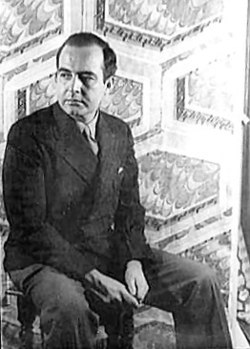

# Samuel Barber

## Biografía

Samuel Osmond Barber (West Chester, Pensilvania, 9 de marzo de 1910-Nueva York, 23 de enero de 1981) fue un compositor estadounidense de música de cámara y orquestal.

## Estilo musical

Samuel Osmond Barber II (9 de marzo de 1910 - 23 de enero de 1981) fue un compositor, pianista, director de orquesta, barítono y educador musical estadounidense, y uno de los compositores más célebres de mediados del siglo XX. [ 1 ] Principalmente influenciado por nueve años de estudios de composición con Rosario Scalero en el Instituto Curtis y más de 25 años de estudio con su tío, el compositor Sidney Homer, la música de Barber generalmente evitaba las tendencias experimentales del modernismo musical en favor del lenguaje armónico tradicional del siglo XIX y la estructura formal que abrazaba el lirismo y la expresión emocional. Sin embargo, adoptó elementos del modernismo después de 1940 en algunas de sus composiciones, como un mayor uso de la disonancia y el cromatismo en el Concierto para violonchelo (1945) y la Danza de la venganza de Medea (1955); y el uso de la ambigüedad tonal y un uso restringido del serialismo en su Sonata para piano (1949), Oraciones de Kierkegaard (1954) y Nocturno (1959).

## Anécdotas y curiosidades

1 Biografía Alternar subsección de biografía 1.1 Infancia (1910–1923) 1.2 Educación y comienzos de la carrera (1924–1941) 1.3 Mitad de la carrera (1942–1966) 1.4 Años posteriores (1966–1981)

## Top 10 bandas sonoras

1. ***Lorenzo's Oil (Título en España: El aceite de la vida)***
    * **Póster:** [link](024_samuel_barber/posters/poster_lorenzo_s_oil_1992.jpg)
2. ***The Music Lovers (Título en España: La pasión de vivir)***
    * **Póster:** [link](024_samuel_barber/posters/poster_the_music_lovers_1971.jpg)
3. ***The Deep Blue Sea (Título en España: The Deep Blue Sea)***
    * **Póster:** [link](024_samuel_barber/posters/poster_the_deep_blue_sea_2011.jpg)
4. ***Third Essay (Título en España: Third Essay)***
    * **Póster:** [link](https://example.com/placeholder.jpg)
5. ***Agnus Dei (Título en España: Agnus Dei)***
    * **Póster:** [link](024_samuel_barber/posters/poster_agnus_dei_1967.jpg)
6. ***Summer Music, Op. 31 (Título en España: Summer Music, Op. 31)***
    * **Póster:** [link](024_samuel_barber/posters/poster_summer_music_op_31_1956.jpg)
7. ***Medea's Dance of Vengeance (Título en España: Medea's Dance of Vengeance)***
    * **Póster:** [link](024_samuel_barber/posters/poster_medea_s_dance_of_vengeance_1955.jpg)
8. ***Symphony No. 2 (Título en España: Symphony No. 2)***
    * **Póster:** [link](024_samuel_barber/posters/poster_symphony_no_2_1950.jpg)
9. ***Concerto for Violoncello and Orchestra (Título en España: Concerto for Violoncello and Orchestra)***
    * **Póster:** [link](024_samuel_barber/posters/poster_concerto_for_violoncello_and_orchestra_1945.jpg)
10. ***Capricorn Concerto (Título en España: Capricorn Concerto)***
    * **Póster:** [link](024_samuel_barber/posters/poster_capricorn_concerto_1944.jpg)

## Filmografía completa

- Music for a Scene from Shelley (Título en España: Música para una escena de Shelley) (1933) · [Póster](024_samuel_barber/posters/poster_music_for_a_scene_from_shelley_1933.jpg)
- Adagio for Strings (Título en España: Adagio para cuerdas) (1936) · [Póster](024_samuel_barber/posters/poster_adagio_for_strings_1936.jpg)
- Violin Concerto (Título en España: Concierto para violín) (1939) · [Póster](https://example.com/placeholder.jpg)
- Excursions (Título en España: Excursions) (1942) · [Póster](024_samuel_barber/posters/poster_excursions_1942.jpg)
- Capricorn Concerto (Título en España: Capricorn Concerto) (1944) · [Póster](024_samuel_barber/posters/poster_capricorn_concerto_1944.jpg)
- Concerto for Violoncello and Orchestra (Título en España: Concerto for Violoncello and Orchestra) (1945) · [Póster](024_samuel_barber/posters/poster_concerto_for_violoncello_and_orchestra_1945.jpg)
- Symphony No. 2 (Título en España: Symphony No. 2) (1950) · [Póster](024_samuel_barber/posters/poster_symphony_no_2_1950.jpg)
- Medea's Dance of Vengeance (Título en España: Medea's Dance of Vengeance) (1955) · [Póster](024_samuel_barber/posters/poster_medea_s_dance_of_vengeance_1955.jpg)
- Summer Music, Op. 31 (Título en España: Summer Music, Op. 31) (1956) · [Póster](024_samuel_barber/posters/poster_summer_music_op_31_1956.jpg)
- Agnus Dei (Título en España: Agnus Dei) (1967) · [Póster](024_samuel_barber/posters/poster_agnus_dei_1967.jpg)
- The Music Lovers (Título en España: La pasión de vivir) (1971) · [Póster](024_samuel_barber/posters/poster_the_music_lovers_1971.jpg)
- Third Essay (Título en España: Third Essay) (1978) · [Póster](https://example.com/placeholder.jpg)
- Vanessa (Título en España: Vanessa) (1978) · [Póster](024_samuel_barber/posters/poster_vanessa_1978.jpg)
- Super Platoon (Título en España: Super Platoon) (1987) · [Póster](024_samuel_barber/posters/poster_super_platoon_1987.jpg)
- Lorenzo's Oil (Título en España: El aceite de la vida) (1992) · [Póster](024_samuel_barber/posters/poster_lorenzo_s_oil_1992.jpg)
- The Deep Blue Sea (Título en España: The Deep Blue Sea) (2011) · [Póster](024_samuel_barber/posters/poster_the_deep_blue_sea_2011.jpg)
- The Problemless Anonymous (Título en España: The Problemless Anonymous) (2016) · [Póster](024_samuel_barber/posters/poster_the_problemless_anonymous_2016.jpg)
- A Hand of Bridge (Título en España: A Hand of Bridge) · [Póster](024_samuel_barber/posters/poster_a_hand_of_bridge.jpg)
- わが恋の旅路 (Título en España: わが恋の旅路) · [Póster](024_samuel_barber/posters/poster_poster.jpg)
- Antony and Cleopatra (Título en España: Marco Antonio y Cleopatra) · [Póster](024_samuel_barber/posters/poster_antony_and_cleopatra.jpg)
- Cave of the Heart (Título en España: Cave of the Heart) · [Póster](024_samuel_barber/posters/poster_cave_of_the_heart.jpg)
- Cello Sonata in C Minor, Op. 6 (Título en España: Cello Sonata in C Minor, Op. 6) · [Póster](024_samuel_barber/posters/poster_cello_sonata_in_c_minor_op_6.jpg)
- Marcia o crepa (Título en España: Marcha o muere) · [Póster](024_samuel_barber/posters/poster_marcia_o_crepa.jpg)
- Do not utter a word (Título en España: Do not utter a word) · [Póster](024_samuel_barber/posters/poster_do_not_utter_a_word.jpg)
- Essay for Orchestra (Título en España: Essay for Orchestra) · [Póster](024_samuel_barber/posters/poster_essay_for_orchestra.jpg)
- First Symphony (in One Movement) (Título en España: First Symphony (in One Movement)) · [Póster](024_samuel_barber/posters/poster_first_symphony_in_one_movement.jpg)
- For ev'ry love there is a last farewell (Título en España: For ev'ry love there is a last farewell) · [Póster](024_samuel_barber/posters/poster_for_ev_ry_love_there_is_a_last_farewell.jpg)
- Four Songs (Título en España: Four Songs) · [Póster](024_samuel_barber/posters/poster_four_songs.jpg)
- Give me some music (Título en España: Give me some music) · [Póster](024_samuel_barber/posters/poster_give_me_some_music.jpg)
- Hark! The land bids me (Título en España: Hark! The land bids me) · [Póster](024_samuel_barber/posters/poster_hark_the_land_bids_me.jpg)
- Hermit songs, op. 29 (Título en España: Hermit songs, op. 29) · [Póster](024_samuel_barber/posters/poster_hermit_songs_op_29.jpg)
- Knoxville: Take a Look (Título en España: Knoxville: Take a Look) · [Póster](024_samuel_barber/posters/poster_knoxville_take_a_look.jpg)
- Medea (Título en España: Medea) · [Póster](024_samuel_barber/posters/poster_medea.jpg)
- Must the Winter Come so Soon? (Título en España: Must the Winter Come so Soon?) · [Póster](024_samuel_barber/posters/poster_must_the_winter_come_so_soon.jpg)
- Drei Wege zum See (Título en España: Drei Wege zum See) · [Póster](024_samuel_barber/posters/poster_drei_wege_zum_see.jpg)
- Outside this house (Título en España: Outside this house) · [Póster](024_samuel_barber/posters/poster_outside_this_house.jpg)
- Achucarro Brahms Piano Concerto No. 2 (Título en España: Achucarro Brahms Piano Concerto No. 2) · [Póster](024_samuel_barber/posters/poster_achucarro_brahms_piano_concerto_no_2.jpg)
- Beethoven: The Complete Piano Sonatas (Título en España: Beethoven: The Complete Piano Sonatas) · [Póster](024_samuel_barber/posters/poster_beethoven_the_complete_piano_sonatas.jpg)
- Prayers of Kierkegaard (Título en España: Prayers of Kierkegaard) · [Póster](024_samuel_barber/posters/poster_prayers_of_kierkegaard.jpg)
- Second Essay (Título en España: Second Essay) · [Póster](024_samuel_barber/posters/poster_second_essay.jpg)
- Souvenirs (Título en España: Souvenirs) · [Póster](024_samuel_barber/posters/poster_souvenirs.jpg)
- Anatomy of a String Quartet (Título en España: Anatomy of a String Quartet) · [Póster](024_samuel_barber/posters/poster_anatomy_of_a_string_quartet.jpg)
- Sure on This Shining Night (Título en España: Sure on This Shining Night) · [Póster](024_samuel_barber/posters/poster_sure_on_this_shining_night.jpg)
- The School for Scandal (Título en España: The School for Scandal) · [Póster](024_samuel_barber/posters/poster_the_school_for_scandal.jpg)
- The breaking of so great a thing (Título en España: The breaking of so great a thing) · [Póster](024_samuel_barber/posters/poster_the_breaking_of_so_great_a_thing.jpg)
- ¿Quién me quiere a mí? (Título en España: ¿Quién me quiere a mí?) · [Póster](024_samuel_barber/posters/poster_qui_n_me_quiere_a_m.jpg)
- Why must the greatest sorrows (Título en España: Why must the greatest sorrows) · [Póster](024_samuel_barber/posters/poster_why_must_the_greatest_sorrows.jpg)
- You rascal you! I never knew you had a soul (Título en España: You rascal you! I never knew you had a soul) · [Póster](024_samuel_barber/posters/poster_you_rascal_you_i_never_knew_you_had_a_soul.jpg)

## Premios y nominaciones

* 1934 – Premio Roma – (Ganador)
* 1945 – Beca Guggenheim – (Ganador)
* 1947 – Beca Guggenheim – (Ganador)
* 1949 – Beca Guggenheim – (Ganador)
* 1958 – Premio Pulitzer de Música – por *Vanessa (Título en España: Vanessa)* – (Ganador)
* 1961 – Miembro de la Academia Estadounidense de Artes y Ciencias – (Ganador)
* 1963 – Premio Pulitzer de Música – (Ganador)
* 1980 – Medalla Edward MacDowell – (Ganador)
* Premio Joseph H. Bearns – (Ganador)

## Fuentes adicionales

* [MundoBSO](https://www.mundobso.com/bso/superman) — site:mundobso.com
* [MundoBSO (2)](https://w.mundobso.com/bso/cartero-siempre-llama-dos-veces-el) — site:mundobso.com
* [MundoBSO (3)](https://www.mundobso.com/bso/star-trek-insurrection) — site:mundobso.com
* [Film Score Monthly](https://www.filmscoremonthly.com/board/posts.cfm?threadID=54139) — site:filmscoremonthly.com
* [Film Score Monthly (2)](https://www.filmscoremonthly.com/fsmonline/free_article.cfm?ID=1809&issueID=49&page=3) — site:filmscoremonthly.com
* [Film Score Monthly (3)](https://www.filmscoremonthly.com/backissues/viewissue.cfm?issueID=39) — site:filmscoremonthly.com
* [SoundtrackCollector](https://www.soundtrackcollector.com/title/5850/Elephant+Man,+The) — site:soundtrackcollector.com
* [SoundtrackCollector (2)](https://www.soundtrackcollector.com/index.php) — site:soundtrackcollector.com
* [SoundtrackCollector (3)](https://www.soundtrackcollector.com/title/5903/Scarlet+Letter,+The) — site:soundtrackcollector.com
* [WhatSong](https://www.whatsong.org/tvshow/supernatural/episode/3659) — site:whatsong.org
* [WhatSong (2)](https://www.whatsong.org/tvshow/prison-break/episode/37396) — site:whatsong.org
* [WhatSong (3)](https://www.whatsong.org/tvshow/vikings/episode/41727) — site:whatsong.org

## Notas externas

* MundoBSO: Compositor: Williams, John Sello: La-La Land Duración: 229 minutos Información de la película Título original: Superman Director: Richard Donner Nacionalidad: EE UU Año: 1978 Argumento Las aventuras del volador héroe del cómic llevadas a la gran pantalla, en su empeño de mantener la paz contra los planes de un villano. Premios Oscar: 1 nominación Globos de oro: 1 nominación Grammy: 1 premio Saturn: 1 premio Compositor: Williams, John Sello: La-La Land Duración: 229 minutos
* MundoBSO (3): Compositor: Goldsmith, Jerry Sello: GNP Duración: 79 minutos Información de la película Título original: Star Trek: Insurrection Director: Jonathan Frakes Nacionalidad: EE UU Año: 1998 Argumento La tripulación de la nave Enterprise encuentra un planeta con propiedades mágicas, en el que sus habitantes viven en eterna paz... hasta que surge la amenaza de invasión. Compositor: Goldsmith, Jerry Sello: GNP Duración: 79 minutos
* SoundtrackCollector (2): 14 de enero - Confesión de un comisionado de policía de Riz Ortolani a la fiscalía 3 de diciembre - Wolf Hall de Debbie Wiseman: El espejo y la luz
* WhatSong: Sam y Dean cortan leña para una pira funeraria mientras recuerdan su tiempo con Charlie. La mejor fuente en línea de música de películas y televisión. Copyright © 2018 - 2026 Whatsong.org. Reservados todos los derechos.
* WhatSong (2): Ramin Djawadi - Prison Break: Temporadas 3 y 4 (Banda sonora original de televisión) Ramin Djawadi - Prison Break: Temporadas 3 y 4 (Banda sonora original de televisión)
* WhatSong (3): Trevor Morris, Einar Selvik, Steve Tavaglione y Brian Kilgore - Los vikingos II (banda sonora original de la película) Trevor Morris - Los vikingos II (banda sonora original de la película)
* www.cambridge.org: Enseñanza del idioma inglés: recursos para profesores Centro de Estudios e Investigaciones Estratégicas de Emirates
* www.commentary.org: ¿Perdiste tu contraseña? Por favor ingrese su dirección de correo electrónico. Recibirá un enlace para crear una nueva contraseña por correo electrónico. Desde su muerte en 1981, Barber ha sido objeto de algo que podría llamarse una rehabilitación. Prácticamente toda su música ha sido regrabada por una nueva generación de músicos admiradores y, esta vez, también ha sido elogiada con entusiasmo por una nueva generación de críticos para quienes el serialismo no tiene más interés que el marxismo o el freudismo. Este “renacimiento”, y la revalorización crítica que lo acompaña de la obra de Barber, es el capítulo final de una historia que dice mucho sobre la carrera de la música estadounidense del siglo XX y sus defensores.
* www.britannica.com: Nuestros editores revisarán lo que ha enviado y determinarán si deben revisar el artículo. Samuel Barber - Enciclopedia para estudiantes (de 11 años en adelante)
* jeanmichelserres.com: Jean-Michel Serres, compositor y pianista (Apfel Café Music): sitio web Lanzamientos de música clásica Todos los lanzamientos de música clásica Charles Koechlin Mel Bonis Moritz Moszkowski Oskar Merikanto Cécile Chaminade Erik Satie
* www.wisemusicclassical.com: En cualquier panteón de músicos estadounidenses, Samuel Barber ocupa un lugar destacado. Junto con las obras de Aaron Copland y George Gershwin, las suyas son las más interpretadas. Se ha vuelto casi popular, una palabra que le daría vergüenza. A Barber le divertiría y sorprendería todo esto, ya que a menudo se llamaba a sí mismo un compositor estadounidense "muerto en vida". Durante los embriagadores años de nuestra adolescencia musical, las décadas de 1930 y 1940, fue prácticamente ignorado en cualquier libro sobre la vida musical estadounidense, relegado a una nota a pie de página educada y a menudo descortés, por no creer en elevar los decibelios de las ondas de choque auditivas. Siguió siendo un letrista romántico inconformista en una época turbulenta. Además, cometió lo imperdonable...
* www.buscabiografias.com: Autor: Víctor Moreno, María E. Ramírez, Cristian de la Oliva, Estrella Moreno y otros Website: buscabiografias.com URL: https://www.buscabiografias.com/biografia/verDetalle/1485/Samuel%20Barber Publicación: 01/05/2002 Última actualización: 09/03/2025 ¿Corrección? ¿Actualización? ¿Falta alguna bio? Háganos saber su opinión para mejorar buscabiografias.com.
