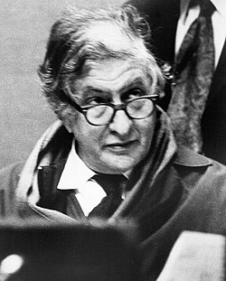

# Bernard Herrmann

## Biografía

Bernard Herrmann (Nueva York; 29 de junio de 1911-Los Ángeles; 24 de diciembre de 1975) fue un compositor estadounidense especializado en el género cinematográfico.​ Galardonado con un premio de la Academia a la mejor música de película dramática por su trabajo en El hombre que vendió su alma (The Devil and Daniel Webster, 1941), es principalmente conocido por sus colaboraciones con Orson Welles (Ciudadano Kane, La guerra de los mundos) y con Alfred Hitchcock, director con el que Herrmann cosechó la mayoría de sus grandes éxitos (Vértigo, The Man Who Knew Too Much y Psicosis).​

## Estilo musical

6 Estilo compositivo y filosofía Toggle Estilo compositivo y filosofía subsección 6.1 Uso de instrumentos electrónicos

Bernard Herrmann fue quizás el compositor cinematográfico más destacado del siglo XX. Con una importante base de seguidores a lo largo de los años, es uno de los compositores cinematográficos de los que más se habla y objeto de numerosos debates y artículos académicos. Trabajó con cineastas legendarios como Orson Welles, Alfred Hitchcock, Ray Harryhausen y compuso películas históricas como Citizen Kane, Vertigo y Psycho. Su música única ciertamente llamó la atención, seas o no un verdadero fanático de la música. Ciertamente fue una música interesante e imaginativa que tuvo un impacto dramático sustancial. También era buena música, bien formulada, bien construida, inteligente y engañosamente simple (musical...

## Anécdotas y curiosidades

Bernard Herrmann fue un compositor que dejó una huella imborrable en la industria del cine y la televisión. Era un maestro en su oficio y creó algunas de las partituras más memorables de la historia del cine. Trabajó con algunos de los mejores directores de todos los tiempos, incluidos Alfred Hitchcock, Orson Welles y Martin Scorsese. En este artículo, analizaremos más de cerca la vida, la carrera y el legado de Bernard Herrmann. Bernard Herrmann nació el 29 de junio de 1911 en la ciudad de Nueva York. Mostró una temprana aptitud para la música y comenzó a estudiar violín a la edad de nueve años. Asistió a la escuela secundaria DeWitt Clinton en el Bronx, donde formó un cuarteto de cuerda con tres de sus compañeros de clase. Después de graduarse de la secundaria...

## Top 10 bandas sonoras

1. ***Citizen Kane (Título en España: Ciudadano Kane)***
    * **Póster:** [link](025_bernard_herrmann/posters/poster_citizen_kane_1941.jpg)
2. ***Taxi Driver (Título en España: Taxi Driver)***
    * **Póster:** [link](025_bernard_herrmann/posters/poster_taxi_driver_1976.jpg)
3. ***Obsession (Título en España: Fascinación (Obsession))***
    * **Póster:** [link](025_bernard_herrmann/posters/poster_obsession_1976.jpg)
4. ***Psycho (Título en España: Psicosis)***
    * **Póster:** [link](025_bernard_herrmann/posters/poster_psycho_1960.jpg)
5. ***Vertigo (Título en España: Vértigo)***
    * **Póster:** [link](025_bernard_herrmann/posters/poster_vertigo_1958.jpg)
6. ***The Day the Earth Stood Still (Título en España: Ultimátum a la Tierra)***
    * **Póster:** [link](025_bernard_herrmann/posters/poster_the_day_the_earth_stood_still_1951.jpg)
7. ***North by Northwest (Título en España: Con la muerte en los talones)***
    * **Póster:** [link](025_bernard_herrmann/posters/poster_north_by_northwest_1959.jpg)
8. ***Cape Fear (Título en España: El cabo del miedo)***
    * **Póster:** [link](025_bernard_herrmann/posters/poster_cape_fear_1991.jpg)
9. ***Marnie (Título en España: Marnie, la ladrona)***
    * **Póster:** [link](025_bernard_herrmann/posters/poster_marnie_1964.jpg)
10. ***All That Money Can Buy (Título en España: El hombre que vendió su alma)***
    * **Póster:** [link](025_bernard_herrmann/posters/poster_all_that_money_can_buy_1941.jpg)

## Filmografía completa

- Citizen Kane (Título en España: Ciudadano Kane) (1941) · [Póster](025_bernard_herrmann/posters/poster_citizen_kane_1941.jpg)
- All That Money Can Buy (Título en España: El hombre que vendió su alma) (1941) · [Póster](025_bernard_herrmann/posters/poster_all_that_money_can_buy_1941.jpg)
- The Magnificent Ambersons (Título en España: El cuarto mandamiento) (1942) · [Póster](025_bernard_herrmann/posters/poster_the_magnificent_ambersons_1942.jpg)
- Jane Eyre (Título en España: Alma rebelde) (1943) · [Póster](025_bernard_herrmann/posters/poster_jane_eyre_1943.jpg)
- Hangover Square (Título en España: Concierto macabro) (1945) · [Póster](025_bernard_herrmann/posters/poster_hangover_square_1945.jpg)
- Anna and the King of Siam (Título en España: Ana y el rey de Siam) (1946) · [Póster](025_bernard_herrmann/posters/poster_anna_and_the_king_of_siam_1946.jpg)
- The Ghost and Mrs. Muir (Título en España: El fantasma y la señora Muir) (1947) · [Póster](025_bernard_herrmann/posters/poster_the_ghost_and_mrs_muir_1947.jpg)
- On Dangerous Ground (Título en España: La casa en la sombra) (1951) · [Póster](025_bernard_herrmann/posters/poster_on_dangerous_ground_1951.jpg)
- The Day the Earth Stood Still (Título en España: Ultimátum a la Tierra) (1951) · [Póster](025_bernard_herrmann/posters/poster_the_day_the_earth_stood_still_1951.jpg)
- The Snows of Kilimanjaro (Título en España: Las nieves del Kilimanjaro) (1952) · [Póster](025_bernard_herrmann/posters/poster_the_snows_of_kilimanjaro_1952.jpg)
- 5 Fingers (Título en España: Operación Cicerón) (1952) · [Póster](025_bernard_herrmann/posters/poster_5_fingers_1952.jpg)
- Beneath the 12-Mile Reef (Título en España: Duelo en el fondo del mar) (1953) · [Póster](025_bernard_herrmann/posters/poster_beneath_the_12_mile_reef_1953.jpg)
- King of the Khyber Rifles (Título en España: El capitán King) (1953) · [Póster](025_bernard_herrmann/posters/poster_king_of_the_khyber_rifles_1953.jpg)
- White Witch Doctor (Título en España: La hechicera blanca) (1953) · [Póster](025_bernard_herrmann/posters/poster_white_witch_doctor_1953.jpg)
- Garden of Evil (Título en España: El jardín del diablo) (1954) · [Póster](025_bernard_herrmann/posters/poster_garden_of_evil_1954.jpg)
- The Egyptian (Título en España: Sinuhé, el egipcio) (1954) · [Póster](025_bernard_herrmann/posters/poster_the_egyptian_1954.jpg)
- The Kentuckian (Título en España: El hombre de Kentucky) (1955) · [Póster](025_bernard_herrmann/posters/poster_the_kentuckian_1955.jpg)
- The Trouble with Harry (Título en España: Pero... ¿quién mató a Harry?) (1955) · [Póster](025_bernard_herrmann/posters/poster_the_trouble_with_harry_1955.jpg)
- Prince of Players (Título en España: Prince of Players) (1955) · [Póster](025_bernard_herrmann/posters/poster_prince_of_players_1955.jpg)
- The Man in the Gray Flannel Suit (Título en España: El hombre del traje gris) (1956) · [Póster](025_bernard_herrmann/posters/poster_the_man_in_the_gray_flannel_suit_1956.jpg)
- The Man Who Knew Too Much (Título en España: El hombre que sabía demasiado) (1956) · [Póster](025_bernard_herrmann/posters/poster_the_man_who_knew_too_much_1956.jpg)
- The Wrong Man (Título en España: Falso culpable) (1956) · [Póster](025_bernard_herrmann/posters/poster_the_wrong_man_1956.jpg)
- A Hatful of Rain (Título en España: Un sombrero lleno de lluvia) (1957) · [Póster](025_bernard_herrmann/posters/poster_a_hatful_of_rain_1957.jpg)
- The Naked and the Dead (Título en España: Los desnudos y los muertos) (1958) · [Póster](025_bernard_herrmann/posters/poster_the_naked_and_the_dead_1958.jpg)
- The 7th Voyage of Sinbad (Título en España: Simbad y la princesa) (1958) · [Póster](025_bernard_herrmann/posters/poster_the_7th_voyage_of_sinbad_1958.jpg)
- Vertigo (Título en España: Vértigo) (1958) · [Póster](025_bernard_herrmann/posters/poster_vertigo_1958.jpg)
- Blue Denim (Título en España: Blue Denim) (1959) · [Póster](025_bernard_herrmann/posters/poster_blue_denim_1959.jpg)
- North by Northwest (Título en España: Con la muerte en los talones) (1959) · [Póster](025_bernard_herrmann/posters/poster_north_by_northwest_1959.jpg)
- Journey to the Center of the Earth (Título en España: Viaje al centro de la Tierra) (1959) · [Póster](025_bernard_herrmann/posters/poster_journey_to_the_center_of_the_earth_1959.jpg)
- The 3 Worlds of Gulliver (Título en España: Los viajes de Gulliver) (1960) · [Póster](025_bernard_herrmann/posters/poster_the_3_worlds_of_gulliver_1960.jpg)
- Psycho (Título en España: Psicosis) (1960) · [Póster](025_bernard_herrmann/posters/poster_psycho_1960.jpg)
- Mysterious Island (Título en España: La isla misteriosa) (1961) · [Póster](025_bernard_herrmann/posters/poster_mysterious_island_1961.jpg)
- Cape Fear (Título en España: El cabo del terror) (1962) · [Póster](025_bernard_herrmann/posters/poster_cape_fear_1962.jpg)
- Tender Is the Night (Título en España: Suave es la noche) (1962) · [Póster](025_bernard_herrmann/posters/poster_tender_is_the_night_1962.jpg)
- Jason and the Argonauts (Título en España: Jasón y los argonautas) (1963) · [Póster](025_bernard_herrmann/posters/poster_jason_and_the_argonauts_1963.jpg)
- A Talk with Hitchcock (Título en España: A Talk with Hitchcock) (1964) · [Póster](025_bernard_herrmann/posters/poster_a_talk_with_hitchcock_1964.jpg)
- Marnie (Título en España: Marnie, la ladrona) (1964) · [Póster](025_bernard_herrmann/posters/poster_marnie_1964.jpg)
- Fahrenheit 451 (Título en España: Fahrenheit 451) (1966) · [Póster](025_bernard_herrmann/posters/poster_fahrenheit_451_1966.jpg)
- Companions in Nightmare (Título en España: Companions in Nightmare) (1968) · [Póster](025_bernard_herrmann/posters/poster_companions_in_nightmare_1968.jpg)
- La mariée était en noir (Título en España: La novia vestía de negro) (1968) · [Póster](025_bernard_herrmann/posters/poster_la_mari_e_tait_en_noir_1968.jpg)
- Mort dans l'après-midi (Título en España: Mort dans l'après-midi) (1968) · [Póster](025_bernard_herrmann/posters/poster_mort_dans_l_apr_s_midi_1968.jpg)
- Twisted Nerve (Título en España: Nervios rotos) (1968) · [Póster](025_bernard_herrmann/posters/poster_twisted_nerve_1968.jpg)
- Bezeten - Het gat in de muur (Título en España: Bezeten - Het gat in de muur) (1969) · [Póster](025_bernard_herrmann/posters/poster_bezeten_het_gat_in_de_muur_1969.jpg)
- Bitka na Neretvi (Título en España: La batalla del río Neretva) (1969) · [Póster](025_bernard_herrmann/posters/poster_bitka_na_neretvi_1969.jpg)
- The Road Builder (Título en España: The Road Builder) (1971) · [Póster](025_bernard_herrmann/posters/poster_the_road_builder_1971.jpg)
- Endless Night (Título en España: Noche sin fin) (1972) · [Póster](025_bernard_herrmann/posters/poster_endless_night_1972.jpg)
- Sisters (Título en España: Hermanas) (1973) · [Póster](025_bernard_herrmann/posters/poster_sisters_1973.jpg)
- It's Alive (Título en España: ¡Estoy vivo!) (1974) · [Póster](025_bernard_herrmann/posters/poster_it_s_alive_1974.jpg)
- Obsession (Título en España: Fascinación (Obsession)) (1976) · [Póster](025_bernard_herrmann/posters/poster_obsession_1976.jpg)
- Taxi Driver (Título en España: Taxi Driver) (1976) · [Póster](025_bernard_herrmann/posters/poster_taxi_driver_1976.jpg)
- It Lives Again (Título en España: Sigue vivo) (1978) · [Póster](025_bernard_herrmann/posters/poster_it_lives_again_1978.jpg)
- Cada ver es... (Título en España: Cada ver es...) (1983) · [Póster](025_bernard_herrmann/posters/poster_cada_ver_es_1983.jpg)
- Cape Fear (Título en España: El cabo del miedo) (1991) · [Póster](025_bernard_herrmann/posters/poster_cape_fear_1991.jpg)
- Psycho (Título en España: Psycho (Psicosis)) (1998) · [Póster](025_bernard_herrmann/posters/poster_psycho_1998.jpg)
- Back to Room 666 (Título en España: Back to Room 666) (2008) · [Póster](025_bernard_herrmann/posters/poster_back_to_room_666_2008.jpg)
- The Twilight Zone: A 60th Anniversary Celebration (Título en España: The Twilight Zone: A 60th Anniversary Celebration) (2019) · [Póster](025_bernard_herrmann/posters/poster_the_twilight_zone_a_60th_anniversary_celebration_2019.jpg)
- Matthew Bourne's The Red Shoes (Título en España: Matthew Bourne's The Red Shoes) (2020) · [Póster](025_bernard_herrmann/posters/poster_matthew_bourne_s_the_red_shoes_2020.jpg)

## Premios y nominaciones

* 1942 – Premio de la Academia a la mejor banda sonora dramática original – por *Citizen Kane (Título en España: Ciudadano Kane)* – (Nominación)
* 1942 – Premio de la Academia a la mejor banda sonora dramática original – por *All That Money Can Buy (Título en España: El hombre que vendió su alma)* – (Ganador)
* 1942 – Premio de la Academia a la mejor banda sonora dramática original – por *All That Money Can Buy (Título en España: El hombre que vendió su alma)* – (Nominación)
* 1947 – Premio de la Academia a la mejor banda sonora original de comedia o drama – por *Anna and the King of Siam (Título en España: Ana y el rey de Siam)* – (Nominación)
* 1977 – Premio de la Academia a la mejor banda sonora original – por *Obsession (Título en España: Fascinación (Obsession))* – (Nominación)
* 1977 – Premio de la Academia a la mejor banda sonora original – por *Taxi Driver (Título en España: Taxi Driver)* – (Nominación)
* Premio Artes y Letras en Música – (Ganador)
* Premios Grammy – (Ganador)

## Fuentes adicionales

* [MundoBSO](https://www.mundobso.com/compositor/herrmann-bernard) — site:mundobso.com
* [MundoBSO (2)](https://www.mundobso.com/agoras/los-convulsos-60-ix-la-nueva-ola-francesa) — site:mundobso.com
* [MundoBSO (3)](https://www.mundobso.com/agoras/la-ruptura) — site:mundobso.com
* [Film Score Monthly](https://www.filmscoremonthly.com/board/posts.cfm?threadID=43097) — site:filmscoremonthly.com
* [Film Score Monthly (2)](https://www.filmscoremonthly.com/board/posts.cfm?threadID=51756) — site:filmscoremonthly.com
* [Film Score Monthly (3)](https://filmscoremonthly.com/cds/detail.cfm/CDID/281/On-Dangerous-Ground/) — site:filmscoremonthly.com
* [SoundtrackCollector](https://www.soundtrackcollector.com) — site:soundtrackcollector.com
* [SoundtrackCollector (2)](https://soundtrackcollector.com) — site:soundtrackcollector.com
* [SoundtrackCollector (3)](https://www.soundtrackcollector.com/catalog/composerdiscography.php?composerid=7&offset=800) — site:soundtrackcollector.com
* [WhatSong](https://www.whatsong.org/movie/taxi-driver) — site:whatsong.org
* [WhatSong (2)](https://www.whatsong.org/movie/wayne-s-world) — site:whatsong.org
* [WhatSong (3)](https://www.whatsong.org/movie/hotel-transylvania-transformania) — site:whatsong.org

## Notas externas

* MundoBSO: Todos los textos, salvo los firmados por otros, están registrados y son propiedad de Conrado Xalabarder. Prohibida la reproducción total o parcial sin el consentimiento expreso y por escrito del autor. Las fotos tienen únicamente propósitos identificativos, sin ninguna intención de vulneración de copyright. Si eres el autor/a o propietario de la foto escríbenos un email a cxa@mundobso para acreditarte o, si lo prefieres, para que la borremos
* SoundtrackCollector: 14 de enero - Confesión de un comisionado de policía de Riz Ortolani a la fiscalía 3 de diciembre - Wolf Hall de Debbie Wiseman: El espejo y la luz
* WhatSong: 01:09 Travis observa a un grupo de parejas bailando lentamente la canción en la televisión. Travis observa a un grupo de parejas bailando lentamente la canción en la televisión.
* WhatSong (2): Wayne convence a otro conductor para que baje la ventanilla. Queen - Una noche en la ópera (versión remasterizada de lujo)
* WhatSong (3): Johnny hace su entrada a la fiesta del 125 aniversario del hotel. Una de las canciones que suenan en la escena del baile después de que Drácula hace su anuncio.
* bernardherrmann.org: Bernard Herrmann fue quizás el compositor cinematográfico más destacado del siglo XX. Con una importante base de seguidores a lo largo de los años, es uno de los compositores cinematográficos de los que más se habla y objeto de numerosos debates y artículos académicos. Trabajó con cineastas legendarios como Orson Welles, Alfred Hitchcock, Ray Harryhausen y compuso películas históricas como Citizen Kane, Vertigo y Psycho. Su música única ciertamente llamó la atención, seas o no un verdadero fanático de la música. Ciertamente fue una música interesante e imaginativa que tuvo un impacto dramático sustancial. También era buena música, bien formulada, bien construida, inteligente y engañosamente simple (musical...
* www.musicnotes.com: Bernard Herrmann (1911-1975) fue un compositor y director de orquesta estadounidense considerado uno de los mejores compositores cinematográficos de todos los tiempos. Herrmann fue un colaborador frecuente del cineasta Alfred Hitchcock, componiendo las partituras de varias de las películas más conocidas de Hitchcock. Muchos consideran a Herrmann un revolucionario en la composición de música cinematográfica, que abandonó el estilo ilustrativo de música cinematográfica de la década de 1930 e infundió a las partituras enfoques poco convencionales del ritmo y la armonía. Un compositor prolífico, compuso la música de más de 200 películas, y los entusiastas del cine hoy disfrutan de muchas de esas partituras. Algunas de las razones por las que las películas de Bernard Herrmann son ampliamente apreciadas y estudiadas incluyen las siguientes:
* the.hitchcock.zone: Bernard Herrmann, cuyo nombre real era Max Herman, fue un compositor considerado hoy en día como uno de los más grandes compositores cinematográficos. Herrmann está más estrechamente asociado con el director Alfred Hitchcock y trabajó en todas las películas de Hitchcock, desde The Trouble with Harry (1955) hasta Marnie (1964), incluyendo Vertigo (1958) y North by Northwest (1959). La relación de Herrmann con Hitchcock llegó a su fin cuando no estuvieron de acuerdo sobre la partitura de Torn Curtain (1966).
* enriqueconstans.com: Bernard Herrmann (1911-1975) fue uno de los compositores más influyentes en la historia de la Música de Cine. Su capacidad para fusionar la narrativa cinematográfica con un lenguaje musical único lo convirtió en un narrador musical referente en su género. Dedico esta entrada a Bernard Herrmann y su contribución a la música de cine en 6 películas. Su estilo musical se caracteriza por el uso de estructuras armónicas inusuales, instrumentaciones distintivas y una tensión emocional latente. Estos elementos le sirvieron para redefinir la relación entre música e imagen como nadie. A lo largo de su carrera, trabajó mano a mano con algunos de los Directores de Cine Más Influyentes al igual que lo...
* www.britannica.com: Nuestros editores revisarán lo que ha enviado y determinarán si deben revisar el artículo. Bernard Herrmann - Enciclopedia para estudiantes (de 11 años en adelante)
* www.yellowbrick.co: Bernard Herrmann fue un compositor que dejó una huella imborrable en la industria del cine y la televisión. Era un maestro en su oficio y creó algunas de las partituras más memorables de la historia del cine. Trabajó con algunos de los mejores directores de todos los tiempos, incluidos Alfred Hitchcock, Orson Welles y Martin Scorsese. En este artículo, analizaremos más de cerca la vida, la carrera y el legado de Bernard Herrmann. Bernard Herrmann nació el 29 de junio de 1911 en la ciudad de Nueva York. Mostró una temprana aptitud para la música y comenzó a estudiar violín a la edad de nueve años. Asistió a la escuela secundaria DeWitt Clinton en el Bronx, donde formó un cuarteto de cuerda con tres de sus compañeros de clase. Después de graduarse de la secundaria...
* brahms.ircam.fr: Compositor estadounidense nacido el 29 de junio de 1911 en la ciudad de Nueva York; Murió el 24 de diciembre de 1975 en Los Ángeles. Bernard Herrmann fue un compositor y director de orquesta estadounidense nacido en la ciudad de Nueva York en 1911. De 1929 a 1933 asistió a la escuela secundaria DeWitt Clinton, la escuela Juilliard y la Universidad de Nueva York, donde estudió dirección de orquesta con Albert Stoessel y composición con Bernard Wagenaar y Percy Grainger. Fue con Grainger, quien detectó el talento del joven compositor y su gusto por buscar sonidos y ambientes inusuales, que Herrmann comenzó a florecer creativamente. En 1933, Herrmann fundó y dirigió la New Chamber Orchestra, que interpretaba principalmente música contemporánea, particularmente británica,...
