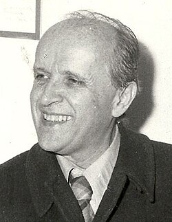

# Nino Rota

## Biografía

Giovanni Rota Rinaldi (Milán; 3 de diciembre de 1911 - Roma; 10 de abril de 1979), más conocido como Nino Rota, fue un compositor italiano de música clásica y cinematográfica.​

## Estilo musical

David de Donatello a la mejor música cinematográfica

Sam y Dean cortan leña para una pira funeraria mientras recuerdan su tiempo con Charlie. La mejor fuente en línea de música de películas y televisión. Copyright © 2018 - 2026 Whatsong.org. Reservados todos los derechos.

## Anécdotas y curiosidades

Nino Rota (1911-1979) fue un influyente compositor italiano reconocido por su extenso trabajo tanto en música de concierto como en bandas sonoras de películas. Nacido en una familia de músicos, Rota mostró un talento prodigioso desde temprana edad, componiendo a la edad de ocho años y actuando profesionalmente cuando era adolescente. Continuó su educación formal en composición en Italia y Estados Unidos, donde fue influenciado por figuras prominentes como Aaron Copland y Samuel Barber. Rota se hizo particularmente conocido por sus colaboraciones con el famoso director Federico Fellini, componiendo juntos dieciséis películas, y por su trabajo ganador del Premio de la Academia en la serie "El Padrino" dirigida por Francis Ford Coppola.

## Top 10 bandas sonoras

1. ***The Godfather (Título en España: El padrino)***
    * **Póster:** [link](026_nino_rota/posters/poster_the_godfather_1972.jpg)
2. ***The Godfather Part II (Título en España: El Padrino Parte II)***
    * **Póster:** [link](026_nino_rota/posters/poster_the_godfather_part_ii_1974.jpg)
3. ***La dolce vita (Título en España: La dolce vita)***
    * **Póster:** [link](026_nino_rota/posters/poster_la_dolce_vita_1960.jpg)
4. ***Romeo and Juliet (Título en España: Romeo y Julieta)***
    * **Póster:** [link](026_nino_rota/posters/poster_romeo_and_juliet_1968.jpg)
5. ***8½ (Título en España: Fellini, ocho y medio)***
    * **Póster:** [link](026_nino_rota/posters/poster_8_1963.jpg)
6. ***Amarcord (Título en España: Amarcord)***
    * **Póster:** [link](026_nino_rota/posters/poster_amarcord_1973.jpg)
7. ***Death on the Nile (Título en España: Muerte en el Nilo)***
    * **Póster:** [link](026_nino_rota/posters/poster_death_on_the_nile_1978.jpg)
8. ***I vitelloni (Título en España: Los inútiles)***
    * **Póster:** [link](026_nino_rota/posters/poster_i_vitelloni_1953.jpg)
9. ***La strada (Título en España: La strada)***
    * **Póster:** [link](026_nino_rota/posters/poster_la_strada_1954.jpg)
10. ***Il gattopardo (Título en España: El gatopardo)***
    * **Póster:** [link](026_nino_rota/posters/poster_il_gattopardo_1963.jpg)

## Filmografía completa

- Treno Popolare (Título en España: Treno Popolare) (1933) · [Póster](026_nino_rota/posters/poster_treno_popolare_1933.jpg)
- Giorno di nozze (Título en España: Giorno di nozze) (1942) · [Póster](026_nino_rota/posters/poster_giorno_di_nozze_1942.jpg)
- La donna della montagna (Título en España: La donna della montagna) (1944) · [Póster](026_nino_rota/posters/poster_la_donna_della_montagna_1944.jpg)
- Zazà (Título en España: Zazà) (1944) · [Póster](026_nino_rota/posters/poster_zaz_1944.jpg)
- La freccia nel fianco (Título en España: La freccia nel fianco) (1945) · [Póster](026_nino_rota/posters/poster_la_freccia_nel_fianco_1945.jpg)
- Le miserie del signor Travet (Título en España: Le miserie del signor Travet) (1945) · [Póster](026_nino_rota/posters/poster_le_miserie_del_signor_travet_1945.jpg)
- Lo sbaglio di essere vivo (Título en España: Lo sbaglio di essere vivo) (1945) · [Póster](026_nino_rota/posters/poster_lo_sbaglio_di_essere_vivo_1945.jpg)
- Mio figlio professore (Título en España: Mi hijo profesor) (1946) · [Póster](026_nino_rota/posters/poster_mio_figlio_professore_1946.jpg)
- Roma città libera (Título en España: Roma città libera) (1946) · [Póster](026_nino_rota/posters/poster_roma_citt_libera_1946.jpg)
- Un americano in vacanza (Título en España: Un americano in vacanza) (1946) · [Póster](026_nino_rota/posters/poster_un_americano_in_vacanza_1946.jpg)
- Come persi la guerra (Título en España: Come persi la guerra) (1947) · [Póster](026_nino_rota/posters/poster_come_persi_la_guerra_1947.jpg)
- Daniele Cortis (Título en España: Daniele Cortis) (1947) · [Póster](026_nino_rota/posters/poster_daniele_cortis_1947.jpg)
- Vivere in pace (Título en España: Vivir en paz) (1947) · [Póster](026_nino_rota/posters/poster_vivere_in_pace_1947.jpg)
- Amanti senza amore (Título en España: Amanti senza amore) (1948) · [Póster](026_nino_rota/posters/poster_amanti_senza_amore_1948.jpg)
- Arrivederci, papà! (Título en España: Arrivederci, papà!) (1948) · [Póster](026_nino_rota/posters/poster_arrivederci_pap_1948.jpg)
- Fuga in Francia (Título en España: Fuga in Francia) (1948) · [Póster](026_nino_rota/posters/poster_fuga_in_francia_1948.jpg)
- L'eroe della strada (Título en España: L'eroe della strada) (1948) · [Póster](026_nino_rota/posters/poster_l_eroe_della_strada_1948.jpg)
- Molti sogni per le strade (Título en España: Molti sogni per le strade) (1948) · [Póster](026_nino_rota/posters/poster_molti_sogni_per_le_strade_1948.jpg)
- Proibito rubare (Título en España: Proibito rubare) (1948) · [Póster](026_nino_rota/posters/poster_proibito_rubare_1948.jpg)
- Senza pietà (Título en España: Sin piedad) (1948) · [Póster](026_nino_rota/posters/poster_senza_piet_1948.jpg)
- Sotto il sole di Roma (Título en España: Sotto il sole di Roma) (1948) · [Póster](026_nino_rota/posters/poster_sotto_il_sole_di_roma_1948.jpg)
- Totò al giro d'Italia (Título en España: Totò al Giro d'Italia) (1948) · [Póster](026_nino_rota/posters/poster_tot_al_giro_d_italia_1948.jpg)
- Come scopersi l'America (Título en España: Come scopersi l'America) (1949) · [Póster](026_nino_rota/posters/poster_come_scopersi_l_america_1949.jpg)
- Obsession (Título en España: Obsession) (1949) · [Póster](026_nino_rota/posters/poster_obsession_1949.jpg)
- Campane a martello (Título en España: Renunciación) (1949) · [Póster](026_nino_rota/posters/poster_campane_a_martello_1949.jpg)
- The Pirates of Capri (Título en España: The Pirates of Capri) (1949) · [Póster](026_nino_rota/posters/poster_the_pirates_of_capri_1949.jpg)
- Donne e briganti (Título en España: Donne e briganti) (1950) · [Póster](026_nino_rota/posters/poster_donne_e_briganti_1950.jpg)
- Il monello della strada (Título en España: Il monello della strada) (1950) · [Póster](026_nino_rota/posters/poster_il_monello_della_strada_1950.jpg)
- Napoli milionaria (Título en España: Nápoles millonaria) (1950) · [Póster](026_nino_rota/posters/poster_napoli_milionaria_1950.jpg)
- Quel bandito sono io (Título en España: Quel bandito sono io) (1950) · [Póster](026_nino_rota/posters/poster_quel_bandito_sono_io_1950.jpg)
- Vita da cani (Título en España: Vida de perros) (1950) · [Póster](026_nino_rota/posters/poster_vita_da_cani_1950.jpg)
- È arrivato il Cavaliere (Título en España: È arrivato il Cavaliere) (1950) · [Póster](026_nino_rota/posters/poster_arrivato_il_cavaliere_1950.jpg)
- È primavera... (Título en España: È primavera...) (1950) · [Póster](026_nino_rota/posters/poster_primavera_1950.jpg)
- Anna (Título en España: Ana) (1951) · [Póster](026_nino_rota/posters/poster_anna_1951.jpg)
- Due mogli sono troppe (Título en España: Due mogli sono troppe) (1951) · [Póster](026_nino_rota/posters/poster_due_mogli_sono_troppe_1951.jpg)
- Era lui, sì, sì! (Título en España: El gerente General) (1951) · [Póster](026_nino_rota/posters/poster_era_lui_s_s_1951.jpg)
- Filumena Marturano (Título en España: Filumena Marturano) (1951) · [Póster](026_nino_rota/posters/poster_filumena_marturano_1951.jpg)
- Valley of the Eagles (Título en España: Valley of the Eagles) (1951) · [Póster](026_nino_rota/posters/poster_valley_of_the_eagles_1951.jpg)
- White Corridors (Título en España: White Corridors) (1951) · [Póster](026_nino_rota/posters/poster_white_corridors_1951.jpg)
- Lo sceicco bianco (Título en España: El jeque blanco) (1952) · [Póster](026_nino_rota/posters/poster_lo_sceicco_bianco_1952.jpg)
- I tre corsari (Título en España: I tre corsari) (1952) · [Póster](026_nino_rota/posters/poster_i_tre_corsari_1952.jpg)
- La Regina di Saba (Título en España: La reina de Saba) (1952) · [Póster](026_nino_rota/posters/poster_la_regina_di_saba_1952.jpg)
- Le meravigliose avventure di Guerrin Meschino (Título en España: Le meravigliose avventure di Guerrin Meschino) (1952) · [Póster](026_nino_rota/posters/poster_le_meravigliose_avventure_di_guerrin_meschino_1952.jpg)
- Marito e Moglie (Título en España: Marito e Moglie) (1952) · [Póster](026_nino_rota/posters/poster_marito_e_moglie_1952.jpg)
- Noi due soli (Título en España: Noi due soli) (1952) · [Póster](026_nino_rota/posters/poster_noi_due_soli_1952.jpg)
- Ragazze da marito (Título en España: Ragazze da marito) (1952) · [Póster](026_nino_rota/posters/poster_ragazze_da_marito_1952.jpg)
- Totò e i re di Roma (Título en España: Totò e i re di Roma) (1952) · [Póster](026_nino_rota/posters/poster_tot_e_i_re_di_roma_1952.jpg)
- Un ladro in paradiso (Título en España: Un ladro in paradiso) (1952) · [Póster](026_nino_rota/posters/poster_un_ladro_in_paradiso_1952.jpg)
- Venetian Bird (Título en España: Venetian Bird) (1952) · [Póster](026_nino_rota/posters/poster_venetian_bird_1952.jpg)
- I sette dell'orsa maggiore (Título en España: Alarma en la flota) (1953) · [Póster](026_nino_rota/posters/poster_i_sette_dell_orsa_maggiore_1953.jpg)
- Anni facili (Título en España: Anni facili) (1953) · [Póster](026_nino_rota/posters/poster_anni_facili_1953.jpg)
- Lo scocciatore (Título en España: El suceso de Via Padova) (1953) · [Póster](026_nino_rota/posters/poster_lo_scocciatore_1953.jpg)
- Jolanda la figlia del corsaro nero (Título en España: Jolanda la figlia del corsaro nero) (1953) · [Póster](026_nino_rota/posters/poster_jolanda_la_figlia_del_corsaro_nero_1953.jpg)
- La nave delle donne maledette (Título en España: La nave delle donne maledette) (1953) · [Póster](026_nino_rota/posters/poster_la_nave_delle_donne_maledette_1953.jpg)
- Le Boulanger de Valorgue (Título en España: Le Boulanger de Valorgue) (1953) · [Póster](026_nino_rota/posters/poster_le_boulanger_de_valorgue_1953.jpg)
- I vitelloni (Título en España: Los inútiles) (1953) · [Póster](026_nino_rota/posters/poster_i_vitelloni_1953.jpg)
- Riscatto - Tu sei il mio giudice (Título en España: Riscatto - Tu sei il mio giudice) (1953) · [Póster](026_nino_rota/posters/poster_riscatto_tu_sei_il_mio_giudice_1953.jpg)
- La domenica della buona gente (Título en España: Sucedió en Roma) (1953) · [Póster](026_nino_rota/posters/poster_la_domenica_della_buona_gente_1953.jpg)
- Appassionatamente (Título en España: Appassionatamente) (1954) · [Póster](026_nino_rota/posters/poster_appassionatamente_1954.jpg)
- Cento anni d'amore (Título en España: Cento anni d'amore) (1954) · [Póster](026_nino_rota/posters/poster_cento_anni_d_amore_1954.jpg)
- Divisione Folgore (Título en España: Divisione Folgore) (1954) · [Póster](026_nino_rota/posters/poster_divisione_folgore_1954.jpg)
- La grande speranza (Título en España: El último submarino) (1954) · [Póster](026_nino_rota/posters/poster_la_grande_speranza_1954.jpg)
- La strada (Título en España: La strada) (1954) · [Póster](026_nino_rota/posters/poster_la_strada_1954.jpg)
- Le due orfanelle (Título en España: Las dos huerfanitas) (1954) · [Póster](026_nino_rota/posters/poster_le_due_orfanelle_1954.jpg)
- Mambo (Título en España: Mambo) (1954) · [Póster](026_nino_rota/posters/poster_mambo_1954.jpg)
- Vergine moderna (Título en España: Vergine moderna) (1954) · [Póster](026_nino_rota/posters/poster_vergine_moderna_1954.jpg)
- Accadde al Penitenziario (Título en España: Accadde al Penitenziario) (1955) · [Póster](026_nino_rota/posters/poster_accadde_al_penitenziario_1955.jpg)
- Il bidone (Título en España: Almas sin conciencia) (1955) · [Póster](026_nino_rota/posters/poster_il_bidone_1955.jpg)
- La bella di Roma (Título en España: La bella de Roma) (1955) · [Póster](026_nino_rota/posters/poster_la_bella_di_roma_1955.jpg)
- Un eroe dei nostri tempi (Título en España: Un héroe de nuestro tiempo) (1955) · [Póster](026_nino_rota/posters/poster_un_eroe_dei_nostri_tempi_1955.jpg)
- War and Peace (Título en España: Guerra y paz) (1956) · [Póster](026_nino_rota/posters/poster_war_and_peace_1956.jpg)
- Londra chiama Polo Nord (Título en España: Londra chiama Polo Nord) (1956) · [Póster](026_nino_rota/posters/poster_londra_chiama_polo_nord_1956.jpg)
- Il momento più bello (Título en España: El momento más hermoso) (1957) · [Póster](026_nino_rota/posters/poster_il_momento_pi_bello_1957.jpg)
- ll medico e lo stregone (Título en España: El médico y el curandero) (1957) · [Póster](026_nino_rota/posters/poster_ll_medico_e_lo_stregone_1957.jpg)
- Le notti di Cabiria (Título en España: Las noches de Cabiria) (1957) · [Póster](026_nino_rota/posters/poster_le_notti_di_cabiria_1957.jpg)
- Le notti bianche (Título en España: Noches blancas) (1957) · [Póster](026_nino_rota/posters/poster_le_notti_bianche_1957.jpg)
- This Angry Age (Título en España: Tiempos de ira) (1957) · [Póster](026_nino_rota/posters/poster_this_angry_age_1957.jpg)
- Città di notte (Título en España: Città di notte) (1958) · [Póster](026_nino_rota/posters/poster_citt_di_notte_1958.jpg)
- Fortunella (Título en España: Fortunella) (1958) · [Póster](026_nino_rota/posters/poster_fortunella_1958.jpg)
- Il Pranzo di Natale di Mario Soldati (Título en España: Il Pranzo di Natale di Mario Soldati) (1958) · [Póster](026_nino_rota/posters/poster_il_pranzo_di_natale_di_mario_soldati_1958.jpg)
- La loi c'est la loi (Título en España: La ley es la ley) (1958) · [Póster](026_nino_rota/posters/poster_la_loi_c_est_la_loi_1958.jpg)
- Un ettaro di cielo (Título en España: Una hectárea de cielo) (1958) · [Póster](026_nino_rota/posters/poster_un_ettaro_di_cielo_1958.jpg)
- La grande guerra (Título en España: La gran guerra) (1959) · [Póster](026_nino_rota/posters/poster_la_grande_guerra_1959.jpg)
- Plein soleil (Título en España: A pleno sol) (1960) · [Póster](026_nino_rota/posters/poster_plein_soleil_1960.jpg)
- La dolce vita (Título en España: La dolce vita) (1960) · [Póster](026_nino_rota/posters/poster_la_dolce_vita_1960.jpg)
- Rocco e i suoi fratelli (Título en España: Rocco y sus hermanos) (1960) · [Póster](026_nino_rota/posters/poster_rocco_e_i_suoi_fratelli_1960.jpg)
- Fantasmi a Roma (Título en España: Fantasmas en Roma) (1961) · [Póster](026_nino_rota/posters/poster_fantasmi_a_roma_1961.jpg)
- Il brigante (Título en España: Il brigante) (1961) · [Póster](026_nino_rota/posters/poster_il_brigante_1961.jpg)
- The Best of Enemies (Título en España: Su mejor enemigo) (1961) · [Póster](026_nino_rota/posters/poster_the_best_of_enemies_1961.jpg)
- Boccaccio '70 (Título en España: Boccaccio '70) (1962) · [Póster](026_nino_rota/posters/poster_boccaccio_70_1962.jpg)
- The Reluctant Saint (Título en España: El hombre que no quería ser santo) (1962) · [Póster](026_nino_rota/posters/poster_the_reluctant_saint_1962.jpg)
- Le tentazioni del Dottor Antonio (Título en España: Le tentazioni del Dottor Antonio) (1962) · [Póster](026_nino_rota/posters/poster_le_tentazioni_del_dottor_antonio_1962.jpg)
- Il gattopardo (Título en España: El gatopardo) (1963) · [Póster](026_nino_rota/posters/poster_il_gattopardo_1963.jpg)
- 8½ (Título en España: Fellini, ocho y medio) (1963) · [Póster](026_nino_rota/posters/poster_8_1963.jpg)
- Il maestro di Vigevano (Título en España: Il maestro di Vigevano) (1963) · [Póster](026_nino_rota/posters/poster_il_maestro_di_vigevano_1963.jpg)
- Giulietta degli spiriti (Título en España: Giulietta de los espiritus) (1965) · [Póster](026_nino_rota/posters/poster_giulietta_degli_spiriti_1965.jpg)
- Oggi, domani, dopodomani (Título en España: Hoy, mañana, pasado mañana) (1965) · [Póster](026_nino_rota/posters/poster_oggi_domani_dopodomani_1965.jpg)
- Spara forte, più forte, non capisco (Título en España: Dispara fuerte, más fuerte... no lo entiendo) (1966) · [Póster](026_nino_rota/posters/poster_spara_forte_pi_forte_non_capisco_1966.jpg)
- The Taming of the Shrew (Título en España: La mujer indomable) (1967) · [Póster](026_nino_rota/posters/poster_the_taming_of_the_shrew_1967.jpg)
- Much Ado About Nothing (Título en España: Much Ado About Nothing) (1967) · [Póster](026_nino_rota/posters/poster_much_ado_about_nothing_1967.jpg)
- Histoires extraordinaires (Título en España: Historias extraordinarias) (1968) · [Póster](026_nino_rota/posters/poster_histoires_extraordinaires_1968.jpg)
- Romeo and Juliet (Título en España: Romeo y Julieta) (1968) · [Póster](026_nino_rota/posters/poster_romeo_and_juliet_1968.jpg)
- Block-notes di un regista (Título en España: Block-notes di un regista) (1969) · [Póster](026_nino_rota/posters/poster_block_notes_di_un_regista_1969.jpg)
- Fellini – satyricon (Título en España: Satiricón) (1969) · [Póster](026_nino_rota/posters/poster_fellini_satyricon_1969.jpg)
- I Clowns (Título en España: Los clowns) (1970) · [Póster](026_nino_rota/posters/poster_i_clowns_1970.jpg)
- Waterloo (Título en España: Waterloo) (1970) · [Póster](026_nino_rota/posters/poster_waterloo_1970.jpg)
- The Godfather (Título en España: El padrino) (1972) · [Póster](026_nino_rota/posters/poster_the_godfather_1972.jpg)
- Roma (Título en España: Roma) (1972) · [Póster](026_nino_rota/posters/poster_roma_1972.jpg)
- Amarcord (Título en España: Amarcord) (1973) · [Póster](026_nino_rota/posters/poster_amarcord_1973.jpg)
- Film d'amore e d'anarchia - Ovvero "Stamattina alle 10 in via dei Fiori nella nota casa di tolleranza..." (Título en España: Amor y anarquía) (1973) · [Póster](026_nino_rota/posters/poster_film_d_amore_e_d_anarchia_ovvero_stamattina_alle_10_in_via_dei_fiori_nella_nota_casa_di_tolleranza_1973.jpg)
- Diario segreto di Amarcord (Título en España: Diario segreto di Amarcord) (1974) · [Póster](026_nino_rota/posters/poster_diario_segreto_di_amarcord_1974.jpg)
- The Godfather Part II (Título en España: El Padrino Parte II) (1974) · [Póster](026_nino_rota/posters/poster_the_godfather_part_ii_1974.jpg)
- Caro Michele (Título en España: Caro Michele) (1976) · [Póster](026_nino_rota/posters/poster_caro_michele_1976.jpg)
- Il Casanova di Federico Fellini (Título en España: Casanova) (1976) · [Póster](026_nino_rota/posters/poster_il_casanova_di_federico_fellini_1976.jpg)
- Death on the Nile (Título en España: Muerte en el Nilo) (1978) · [Póster](026_nino_rota/posters/poster_death_on_the_nile_1978.jpg)
- Prova d'orchestra (Título en España: Ensayo de orquesta) (1979) · [Póster](026_nino_rota/posters/poster_prova_d_orchestra_1979.jpg)
- Hurricane (Título en España: Huracán) (1979) · [Póster](026_nino_rota/posters/poster_hurricane_1979.jpg)
- The Godfather: The Complete Epic 1901–1959 (Título en España: The Godfather: The Complete Epic 1901–1959) (1981) · [Póster](026_nino_rota/posters/poster_the_godfather_the_complete_epic_1901_1959_1981.jpg)
- Мурад Кажлаев. Ритмы и годы (Título en España: Мурад Кажлаев. Ритмы и годы) (1981) · [Póster](026_nino_rota/posters/poster_poster_1981.jpg)
- I soliti ignoti vent'anni dopo (Título en España: Rufufú... 20 años después) (1985) · [Póster](026_nino_rota/posters/poster_i_soliti_ignoti_vent_anni_dopo_1985.jpg)
- Zwischen Kino und Konzert - Der Komponist Nino Rota (Título en España: Zwischen Kino und Konzert - Der Komponist Nino Rota) (1993) · [Póster](026_nino_rota/posters/poster_zwischen_kino_und_konzert_der_komponist_nino_rota_1993.jpg)
- Un amico magico: il maestro Nino Rota (Título en España: Un amico magico: il maestro Nino Rota) (1994) · [Póster](026_nino_rota/posters/poster_un_amico_magico_il_maestro_nino_rota_1994.jpg)
- The Magic of Fellini (Título en España: The Magic of Fellini) (2002) · [Póster](026_nino_rota/posters/poster_the_magic_of_fellini_2002.jpg)
- La visita meravigliosa: Viaggio in Italia sulle tracce di Nino Rota (Título en España: La visita meravigliosa: Viaggio in Italia sulle tracce di Nino Rota) (2011) · [Póster](026_nino_rota/posters/poster_la_visita_meravigliosa_viaggio_in_italia_sulle_tracce_di_nino_rota_2011.jpg)
- New Year's Eve Concert 2022 With the Berlin Philharmonic Orchestra (Título en España: New Year's Eve Concert 2022 With the Berlin Philharmonic Orchestra) (2022) · [Póster](026_nino_rota/posters/poster_new_year_s_eve_concert_2022_with_the_berlin_philharmonic_orchestra_2022.jpg)
- Chelsea Zurflüh & Jonathan Tetelman Château de Neuschwanstein 2025 (Título en España: Chelsea Zurflüh & Jonathan Tetelman Château de Neuschwanstein 2025) (2025) · [Póster](026_nino_rota/posters/poster_chelsea_zurfl_h_jonathan_tetelman_ch_teau_de_neuschwanstein_2025_2025.jpg)
- Nino (Título en España: Nino) · [Póster](026_nino_rota/posters/poster_nino.jpg)

## Premios y nominaciones

* 1962 – Premio Grammy a la mejor banda sonora para medios visuales – por *La dolce vita (Título en España: La dolce vita)* – (Nominación)
* 1968 – Premio Globo de Oro a la mejor banda sonora original – por *Romeo and Juliet (Título en España: Romeo y Julieta)* – (Nominación)
* 1969 – Premio BAFTA a la mejor música original – por *Romeo and Juliet (Título en España: Romeo y Julieta)* – (Nominación)
* 1969 – Premio Grammy a la Canción del Año – por *Love Theme from Romeo and Juliet* – (Nominación)
* 1972 – Premio Globo de Oro a la mejor banda sonora original – por *The Godfather (Título en España: El padrino)* – (Ganador)
* 1972 – Premio Globo de Oro a la mejor banda sonora original – por *The Godfather (Título en España: El padrino)* – (Nominación)
* 1972 – Premio Grammy a la mejor banda sonora para medios visuales – por *The Godfather – Original Soundtrack Recording* – (Ganador)
* 1972 – Premio Grammy a la mejor banda sonora para medios visuales – por *The Godfather – Original Soundtrack Recording* – (Nominación)
* 1973 – Premio BAFTA a la mejor música original – por *The Godfather (Título en España: El padrino)* – (Ganador)
* 1973 – Premio BAFTA a la mejor música original – por *The Godfather (Título en España: El padrino)* – (Nominación)
* 1973 – Premio de la Academia a la mejor banda sonora dramática original – por *The Godfather (Título en España: El padrino)* – (Nominación)
* 1975 – Premio de la Academia a la mejor banda sonora dramática original – por *The Godfather Part II (Título en España: El Padrino Parte II)* – (Ganador)
* 1975 – Premio de la Academia a la mejor banda sonora dramática original – por *The Godfather Part II (Título en España: El Padrino Parte II)* – (Nominación)
* 1976 – Premio BAFTA a la mejor música original – por *The Godfather Part II (Título en España: El Padrino Parte II)* – (Nominación)
* Cinta de plata a la mejor puntuación – (Ganador)
* David di Donatello a la mejor música – (Ganador)

## Fuentes adicionales

* [MundoBSO](https://mundobso.com) — site:mundobso.com
* [Film Score Monthly](https://www.filmscoremonthly.com/board/posts.cfm?threadID=14556&forumID=1&archive=1) — site:filmscoremonthly.com
* [Film Score Monthly (2)](https://www.filmscoremonthly.com/board/posts.cfm?threadID=148724&forumID=1&archive=0) — site:filmscoremonthly.com
* [Film Score Monthly (3)](https://www.filmscoremonthly.com/daily/article.cfm/articleID/3648/Rota-Fellini-Orchestra-Rehearsal-1979/) — site:filmscoremonthly.com
* [SoundtrackCollector](https://www.soundtrackcollector.com/catalog/search.php?searchon=track&searchtext=Fellini+Rota%3A+Music+From+The+Classic+Films+Of+Federico+Fellini) — site:soundtrackcollector.com
* [SoundtrackCollector (2)](https://www.soundtrackcollector.com/title/14594/Ladri+Di+Biciclette) — site:soundtrackcollector.com
* [SoundtrackCollector (3)](https://www.soundtrackcollector.com/title/21967/Waterloo) — site:soundtrackcollector.com
* [WhatSong](https://www.whatsong.org/tvshow/supernatural/episode/3659) — site:whatsong.org
* [WhatSong (2)](https://www.whatsong.org/tvshow/prison-break/episode/37396) — site:whatsong.org
* [WhatSong (3)](https://www.whatsong.org/tvshow/how-i-met-your-mother/episode/44483) — site:whatsong.org

## Notas externas

* WhatSong: Sam y Dean cortan leña para una pira funeraria mientras recuerdan su tiempo con Charlie. La mejor fuente en línea de música de películas y televisión. Copyright © 2018 - 2026 Whatsong.org. Reservados todos los derechos.
* WhatSong (2): Ramin Djawadi - Prison Break: Temporadas 3 y 4 (Banda sonora original de televisión) Ramin Djawadi - Prison Break: Temporadas 3 y 4 (Banda sonora original de televisión)
* WhatSong (3): Lily y Robin bailan con los dos nerds del último año de secundaria. Se reproduce de fondo cuando Lilly, Robin y Barney intentan entrar a la fiesta. La canción es una canción que está incluida en iMovie.
* filmsymphony.es: Otros proyectos FSO FSO Big Band FSO Film in Concert Total Soundtrack Los Bridgerton en Concierto Galería FSO en Imágenes FSO en Vídeos FSO en Prensa escrita FSO en Televisión
* ressources.ircam.fr: Compositor italiano nacido el 3 de diciembre de 1911 en Milán; Murió el 10 de abril de 1979 en Roma. Dos valses en nombre de Bach, para piano, Ricordi, 3 min
* www.mundobso.com: Todos los textos, salvo los firmados por otros, están registrados y son propiedad de Conrado Xalabarder. Prohibida la reproducción total o parcial sin el consentimiento expreso y por escrito del autor. Las fotos tienen únicamente propósitos identificativos, sin ninguna intención de vulneración de copyright. Si eres el autor/a o propietario de la foto escríbenos un email a cxa@mundobso para acreditarte o, si lo prefieres, para que la borremos
* www.britannica.com: Nuestros editores revisarán lo que ha enviado y determinarán si deben revisar el artículo. Nino Rota (nacido el 3 de diciembre de 1911 en Milán, Italia; fallecido el 10 de abril de 1979 en Roma) fue un compositor italiano de bandas sonoras cinematográficas. Rota había compuesto un oratorio y una ópera cuando tenía 13 años. Después de estudiar en el Instituto Curtis de Filadelfia, comenzó a escribir bandas sonoras para películas. De 1950 a 1978 fue director del Liceo Musicale, un conservatorio de Bari. En 1950 también inició su larga asociación con Federico Fellini, para quien componería películas como La strada (1955), La dolce vita (1960), 8 1/2 (1963) y Amarcord (1973). Proporcionó bandas sonoras para muchas otras películas, incluida El Padrino de Francis Ford Coppola...
* www.wbjc.com: Nuestros anfitriones Mark Malinowski Dyana Neal Judith Krummeck Abhinn Malhotra Kati Harrison Jonathan Palevsky Apoyo WBJC Donaciones de automóviles Apoyo corporativo Membresía Tours WBJC
* www.ninorota.com: El compositor Nino Rota (1911 – 1979) nació en una familia de músicos en Milán. Inicialmente fue alumno de Giacomo Orefice e Ildebrando Pizzetti hasta que se mudó a Roma cuando aún era un niño y completó sus estudios con Alfredo Casella en el Conservatorio de Santa Cecilia en 1929. Mientras tanto, se convirtió en un niño prodigio, famoso como compositor y director de orquesta. Su primer oratorio, L'infanzia di San Giovanni Battista, se representó en Milán y París ya en 1923, y su comedia lírica, Il Principe Porcaro, fue compuesta en 1926. De 1930 a 1932, Rota vivió en Estados Unidos. Ganó una beca para el Instituto Curtis de Filadelfia y estudió composición con Rosario...
* ums.org: Temporada y eventos Temporada y eventos Ver todos los próximos eventos Eventos de temporada 25/26 Paquetes de boletos de temporada Información de boletos, descuentos y preguntas frecuentes Guía de boletos digitales Certificados de regalo de UMS PRÓXIMO EVENTO Visita a la big band indígena de Julia Keefe Visitar lugares Restaurantes Hoteles Accesibilidad Qué esperar
* ressources.ircam.fr: Compositor italiano nacido el 3 de diciembre de 1911 en Milán; Murió el 10 de abril de 1979 en Roma. Nacido el 3 de diciembre de 1911 en Milán, Nino Rota fue un niño prodigio: compuso el oratorio L'infanzia di San Giovanni Battista a la edad de 11 años. Provenía de una familia profundamente musical: su abuelo materno, Giovanni Rinaldo, era un estimado pianista y compositor, mientras que su madre, Ernesta, abandonó una prometedora carrera como pianista para criar a su familia y supervisar el progreso del talento incipiente de su hijo. La casa de la infancia de Nino era uno de los salones musicales más importantes de Milán; Las visitas regulares de los compositores más destacados de la época contribuyeron al desarrollo del joven Nino. De hecho, el compositor mantuvo un...
* www.yellowbrick.co: Nino Rota fue un compositor, pianista y director de orquesta italiano mejor conocido por sus bandas sonoras cinematográficas. Nació en Milán el 3 de diciembre de 1911 y murió en Roma el 10 de abril de 1979. Rota compuso partituras para más de 150 películas, incluidas las icónicas partituras de El Padrino y sus secuelas. Su música es celebrada por su capacidad para capturar la esencia de las películas que acompaña, y su trabajo ha sido reconocido con numerosos premios y honores. En este artículo, echaremos un vistazo a las 10 mejores películas de Nino Rota que deberías ver ahora mismo. Estas películas muestran el increíble talento de Rota y demuestran por qué es considerado uno de los mejores compositores cinematográficos de todos los tiempos.
