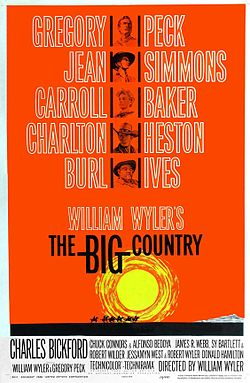

# Jerome Moross

## Biografía

Horizontes de grandeza (The Big Country) es una película estadounidense de 1958 del género western, basada en la novela homónima escrita por Donald Hamilton a partir de su cuento Ambush at Blanco Canyon y publicada por entregas en 1957 en The Saturday Evening Post con el mismo título del cuento.​ La película fue dirigida por William Wyler y contó con Gregory Peck como actor principal y con la producción de ambos y de Robert Wyler. La cinta contó con un gran elenco integrado por destacados artistas como Burl Ives, Charlton Heston, Jean Simmons, Carroll Baker, Charles Bickford, Chuck Connors y Alfonso Bedoya. Burl Ives ganó un Oscar al mejor actor de reparto, así como un Globo de Oro. Además, la película tuvo otra candidatura al premio Oscar a la mejor música, por el trabajo del compositor y director de orquesta Jerome Moross.

## Estilo musical

Moross utilizó sus ganancias para asistir a la Universidad de Nueva York, así como a la Escuela de Música Juilliard, para la cual obtuvo la admisión como miembro de dirección durante su último año en la Universidad de Nueva York. Se graduó en la Universidad de Nueva York en 1931 a la asombrosa edad de 18 años. A pesar de este sorprendente logro, Moross creía que realmente no necesitaba lecciones formales de composición, prefiriendo en cambio sus actuaciones musicales fuera del mundo académico. Él relató;

## Anécdotas y curiosidades

Jerome Moross (1 de agosto de 1913 - 25 de julio de 1983) fue un compositor estadounidense más conocido por su música para cine y televisión. [ 1 ] También compuso obras para orquestas sinfónicas, conjuntos de cámara, solistas y teatro musical, además de orquestar partituras para otros compositores.

## Top 10 bandas sonoras

1. ***The Big Country (Título en España: Horizontes de grandeza)***
    * **Póster:** [link](028_jerome_moross/posters/poster_the_big_country_1958.jpg)
2. ***The Jayhawkers! (Título en España: Los rebeldes de Kansas)***
    * **Póster:** [link](028_jerome_moross/posters/poster_the_jayhawkers_1959.jpg)
3. ***Rachel, Rachel (Título en España: Raquel, Raquel)***
    * **Póster:** [link](028_jerome_moross/posters/poster_rachel_rachel_1968.jpg)
4. ***Close-Up (Título en España: Close-Up)***
    * **Póster:** [link](028_jerome_moross/posters/poster_close_up_1948.jpg)
5. ***The Valley of Gwangi (Título en España: El valle de Gwangi)***
    * **Póster:** [link](028_jerome_moross/posters/poster_the_valley_of_gwangi_1969.jpg)
6. ***The War Lord (Título en España: El señor de la guerra)***
    * **Póster:** [link](028_jerome_moross/posters/poster_the_war_lord_1965.jpg)
7. ***The Captive City (Título en España: La ciudad cautiva)***
    * **Póster:** [link](028_jerome_moross/posters/poster_the_captive_city_1952.jpg)
8. ***The Sharkfighters (Título en España: The Sharkfighters)***
    * **Póster:** [link](028_jerome_moross/posters/poster_the_sharkfighters_1956.jpg)
9. ***The Cardinal (Título en España: El cardenal)***
    * **Póster:** [link](028_jerome_moross/posters/poster_the_cardinal_1963.jpg)
10. ***The Adventures of Huckleberry Finn (Título en España: Las aventuras de Huckleberry Finn)***
    * **Póster:** [link](028_jerome_moross/posters/poster_the_adventures_of_huckleberry_finn_1960.jpg)

## Filmografía completa

- Close-Up (Título en España: Close-Up) (1948) · [Póster](028_jerome_moross/posters/poster_close_up_1948.jpg)
- The Captive City (Título en España: La ciudad cautiva) (1952) · [Póster](028_jerome_moross/posters/poster_the_captive_city_1952.jpg)
- The Sharkfighters (Título en España: The Sharkfighters) (1956) · [Póster](028_jerome_moross/posters/poster_the_sharkfighters_1956.jpg)
- The Big Country (Título en España: Horizontes de grandeza) (1958) · [Póster](028_jerome_moross/posters/poster_the_big_country_1958.jpg)
- The Jayhawkers! (Título en España: Los rebeldes de Kansas) (1959) · [Póster](028_jerome_moross/posters/poster_the_jayhawkers_1959.jpg)
- The Adventures of Huckleberry Finn (Título en España: Las aventuras de Huckleberry Finn) (1960) · [Póster](028_jerome_moross/posters/poster_the_adventures_of_huckleberry_finn_1960.jpg)
- The Mountain Road (Título en España: Sendero de furia) (1960) · [Póster](028_jerome_moross/posters/poster_the_mountain_road_1960.jpg)
- Five Finger Exercise (Título en España: Ejercicio para cinco dedos) (1962) · [Póster](028_jerome_moross/posters/poster_five_finger_exercise_1962.jpg)
- The Cardinal (Título en España: El cardenal) (1963) · [Póster](028_jerome_moross/posters/poster_the_cardinal_1963.jpg)
- The War Lord (Título en España: El señor de la guerra) (1965) · [Póster](028_jerome_moross/posters/poster_the_war_lord_1965.jpg)
- Rachel, Rachel (Título en España: Raquel, Raquel) (1968) · [Póster](028_jerome_moross/posters/poster_rachel_rachel_1968.jpg)
- The Valley of Gwangi (Título en España: El valle de Gwangi) (1969) · [Póster](028_jerome_moross/posters/poster_the_valley_of_gwangi_1969.jpg)
- Hail, Hero! (Título en España: Hail, Hero!) (1969) · [Póster](028_jerome_moross/posters/poster_hail_hero_1969.jpg)

## Premios y nominaciones

* 1947 – Beca Guggenheim – (Ganador)
* 1959 – Premio de la Academia a la mejor banda sonora original de comedia o drama – por *The Big Country (Título en España: Horizontes de grandeza)* – (Nominación)

## Fuentes adicionales

* [MundoBSO](https://www.mundobso.com/bso/capitan-america-civil-war) — site:mundobso.com
* [MundoBSO (2)](https://www.mundobso.com/bso/star-trek-insurrection) — site:mundobso.com
* [MundoBSO (3)](https://www.mundobso.com/bso/fenix-1123) — site:mundobso.com
* [Film Score Monthly](https://www.filmscoremonthly.com/cds/detail.cfm/CDID/270/Adventures-of-Huckleberry-Finn-The/) — site:filmscoremonthly.com
* [Film Score Monthly (2)](https://www.filmscoremonthly.com/backissues/viewissue.cfm?issueID=79) — site:filmscoremonthly.com
* [Film Score Monthly (3)](https://filmscoremonthly.com/board/posts.cfm?threadID=145177) — site:filmscoremonthly.com
* [SoundtrackCollector](https://www.soundtrackcollector.com/catalog/composerdiscography.php?composerid=1957&offset=160) — site:soundtrackcollector.com
* [SoundtrackCollector (2)](https://ssl.soundtrackcollector.com/catalog/composerdiscuss.php?composerid=1957) — site:soundtrackcollector.com
* [SoundtrackCollector (3)](https://www.soundtrackcollector.com/title/1179/Big+Country,+The) — site:soundtrackcollector.com
* [WhatSong](https://www.whatsong.org/tvshow/how-i-met-your-mother/episode/44483) — site:whatsong.org
* [WhatSong (2)](https://www.whatsong.org/tvshow/grown-ish/episode/82123) — site:whatsong.org
* [WhatSong (3)](https://www.whatsong.org/tvshow/prison-break/episode/37396) — site:whatsong.org

## Notas externas

* MundoBSO: Compositor: Jackman, Henry Sello: Hollywood Duración: 69 minutos Información de la película Título original: Captain America: Civil War Director: Anthony Russo, Joe Russo Nacionalidad: EE UU Año: 2016 Argumento Continuación de Captain America: The Winter Soldier (14). Cuando otro incidente internacional involucra a Los Vengadores y causan varios daños colaterales, aumentan las presiones políticas para exigir más responsabilidades y determinar cuándo deben contratar los servicios del grupo de superhéroes. Esta nueva situación dividirá a Los Vengadores, mientras intentan proteger al mundo de un nuevo y terrible villano. Compositor: Jackman, Henry Sello: Hollywood Duración: 69 minutos
* MundoBSO (2): Compositor: Goldsmith, Jerry Sello: GNP Duración: 79 minutos Información de la película Título original: Star Trek: Insurrection Director: Jonathan Frakes Nacionalidad: EE UU Año: 1998 Argumento La tripulación de la nave Enterprise encuentra un planeta con propiedades mágicas, en el que sus habitantes viven en eterna paz... hasta que surge la amenaza de invasión. Compositor: Goldsmith, Jerry Sello: GNP Duración: 79 minutos
* MundoBSO (3): Compositor: Julià, Roger Sello: Propaganda pel Fet! Duración: 33 minutos Información de la película Título original: Fènix 11·23 Director: Joel Joan, Sergi Lara Nacionalidad: España Año: 2011 Argumento Un joven crea una web para defender la lengua catalana. Una noche, la brigada antiterrorista irrumpe en su casa y lo acusa de terrorismo informático por haber enviadp un e-mail a una cadena de supermercados pidiendo el etiquetaje en catalán. Compositor: Julià, Roger Sello: Propaganda pel Fet! Duración: 33 minutos
* WhatSong: Lily y Robin bailan con los dos nerds del último año de secundaria. Se reproduce de fondo cuando Lilly, Robin y Barney intentan entrar a la fiesta. La canción es una canción que está incluida en iMovie.
* WhatSong (2): Luca está pensando en él y en el encuentro sexual de Zoey de la noche anterior. Luca está estresado por su "yo". Texto a Zoey y su falta de respuesta.
* WhatSong (3): Ramin Djawadi - Prison Break: Temporadas 3 y 4 (Banda sonora original de televisión) Ramin Djawadi - Prison Break: Temporadas 3 y 4 (Banda sonora original de televisión)
* jeromemoross.com: RECURSOS MOROSS PAPERS VIDEOS PUBLICACIONES FOTOS RECURSOS MOROSS PAPERS VIDEOS PUBLICACIONES FOTOS
* jeromemoross.com: RECURSOS MOROSS PAPERS VIDEOS PUBLICACIONES FOTOS RECURSOS MOROSS PAPERS VIDEOS PUBLICACIONES FOTOS
* cinescores.dudaone.com: Jerome Moross en conversación con Noah Andre Trudeau Publicado originalmente en Music from the Movies Número 1, 1992 Texto reproducido con la amable autorización del editor, Paul Place. Comenzaré con una pregunta que me sugirió Bernard Herrmann. ¿Te etiquetarías como compositor de música de cine o como compositor que escribe música de cine?
* classical.music.apple.com: La Edad de Oro de Hollywood La Edad de Oro de Hollywood Patrick Savage, Martin Cousin Una canción suena en mí (melodías de opereta, éxitos de entonces, Clásicos de Broadway) Una canción suena dentro de mí (melodías de opereta, éxitos de entonces, Clásicos de Broadway) John Thade
* classical.music.apple.com: La Edad de Oro de Hollywood La Edad de Oro de Hollywood Patrick Savage, Martin Cousin Una canción suena en mí (melodías de opereta, éxitos de entonces, Clásicos de Broadway) Una canción suena dentro de mí (melodías de opereta, éxitos de entonces, Clásicos de Broadway) John Thade
* jeromemoross.com: RECURSOS MOROSS PAPERS VIDEOS PUBLICACIONES FOTOS RECURSOS MOROSS PAPERS VIDEOS PUBLICACIONES FOTOS
