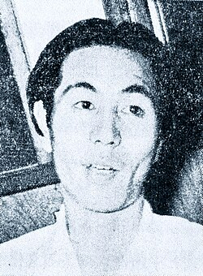

# Akira Ifukube

## Biografía

Akira Ifukube (伊福部 昭 Ifukube Akira: Kushiro, 31 de mayo de 1914 - Tokio, 8 de febrero del 2006) fue un compositor japonés de música clásica y cinematográfica; en el segundo campo, sus obras más conocidas son aquellas que compuso para la serie de películas de Godzilla, de la casa productora japonesa Tōhō.

## Estilo musical

2 Listado de Obras Alternar subsección Listado de Obras 2.1 Obras para Orquesta 2.2 Música de Cámara o Instrumental 2.3 Vocal 2.4 Música cinematográfica

## Anécdotas y curiosidades

Akira Ifukube nació el 31 de mayo de 1914 en Kushiro, localidad en la isla japonesa de Hokkaidō. Fue el tercer hijo de un monje japonés Shinto. La mayor parte de su niñez la pasó entre población japonesa y grupos étnicos de los Ainu, contando con que su padre llevaba buenas relaciones con estos últimos. Ifukube estuvo fuertemente influenciado por las tradiciones musicales de las dos culturas y estudiaba el violín y el shamisen. Su primer encuentro con la música clásica ocurrió cuando estudiaba en la escuela secundaria de Sapporo, la capital de Hokkaidō. Pero tomó la decisión de ser compositor después de haber escuchado en una emisión de radio el ballet La consagración de la primavera, de Ígor Stravinski

## Top 10 bandas sonoras

1. ***ゴジラ-1.0 (Título en España: Godzilla Minus One)***
    * **Póster:** [link](029_akira_ifukube/posters/poster_1_0_2023.jpg)
2. ***シン・ゴジラ (Título en España: Shin Godzilla)***
    * **Póster:** [link](029_akira_ifukube/posters/poster_poster_2016.jpg)
3. ***Godzilla, King of the Monsters! (Título en España: Godzilla)***
    * **Póster:** [link](029_akira_ifukube/posters/poster_godzilla_king_of_the_monsters_1956.jpg)
4. ***ゴジラ (Título en España: Godzilla, Japón bajo el terror del monstruo)***
    * **Póster:** [link](029_akira_ifukube/posters/poster_poster_1954.jpg)
5. ***ゴジラvsデストロイア (Título en España: Godzilla vs Destoroyah)***
    * **Póster:** [link](029_akira_ifukube/posters/poster_vs_1995.jpg)
6. ***ビルマの竪琴 (Título en España: El arpa Birmana)***
    * **Póster:** [link](029_akira_ifukube/posters/poster_poster_1956.jpg)
7. ***座頭市物語 (Título en España: La historia de Zatoichi)***
    * **Póster:** [link](029_akira_ifukube/posters/poster_poster_1962.jpg)
8. ***キングコング対ゴジラ (Título en España: King Kong contra Godzilla)***
    * **Póster:** [link](029_akira_ifukube/posters/poster_poster_1962.jpg)
9. ***モスラ対ゴジラ (Título en España: Godzilla contra los monstruos)***
    * **Póster:** [link](029_akira_ifukube/posters/poster_poster_1964.jpg)
10. ***怪獣総進撃 (Título en España: Invasión extraterrestre)***
    * **Póster:** [link](029_akira_ifukube/posters/poster_poster_1968.jpg)

## Filmografía completa

- 幸福への招待 (Título en España: 幸福への招待) (1947) · [Póster](029_akira_ifukube/posters/poster_poster_1947.jpg)
- 銀嶺の果て (Título en España: 銀嶺の果て) (1947) · [Póster](029_akira_ifukube/posters/poster_poster_1947.jpg)
- Kuro-uma no danshichi (Título en España: Kuro-uma no danshichi) (1948) · [Póster](029_akira_ifukube/posters/poster_kuro_uma_no_danshichi_1948.jpg)
- 社長と女店員 (Título en España: 社長と女店員) (1948) · [Póster](029_akira_ifukube/posters/poster_poster_1948.jpg)
- 第二の人生 (Título en España: 第二の人生) (1948) · [Póster](029_akira_ifukube/posters/poster_poster_1948.jpg)
- 颱風圏の女 (Título en España: 颱風圏の女) (1948) · [Póster](029_akira_ifukube/posters/poster_poster_1948.jpg)
- 静かなる決闘 (Título en España: Duelo silencioso) (1949) · [Póster](029_akira_ifukube/posters/poster_poster_1949.jpg)
- ジャコ萬と鉄 (Título en España: ジャコ萬と鉄) (1949) · [Póster](029_akira_ifukube/posters/poster_poster_1949.jpg)
- 斬られの仙太 (Título en España: 斬られの仙太) (1949) · [Póster](029_akira_ifukube/posters/poster_poster_1949.jpg)
- 深夜の告白 (Título en España: 深夜の告白) (1949) · [Póster](029_akira_ifukube/posters/poster_poster_1949.jpg)
- 虹男 (Título en España: 虹男) (1949) · [Póster](029_akira_ifukube/posters/poster_poster_1949.jpg)
- 白い野獣 (Título en España: La bestia blanca) (1950) · [Póster](029_akira_ifukube/posters/poster_poster_1950.jpg)
- てんやわんや (Título en España: てんやわんや) (1950) · [Póster](029_akira_ifukube/posters/poster_poster_1950.jpg)
- レ・ミゼラブル　あゝ無情　第一部　神と悪魔 (Título en España: レ・ミゼラブル　あゝ無情　第一部　神と悪魔) (1950) · [Póster](029_akira_ifukube/posters/poster_poster_1950.jpg)
- レ・ミゼラブル　あゝ無情　第二部 愛と自由の旗 (Título en España: レ・ミゼラブル　あゝ無情　第二部 愛と自由の旗) (1950) · [Póster](029_akira_ifukube/posters/poster_poster_1950.jpg)
- 七色の花 (Título en España: 七色の花) (1950) · [Póster](029_akira_ifukube/posters/poster_poster_1950.jpg)
- 俺は用心棒 (Título en España: 俺は用心棒) (1950) · [Póster](029_akira_ifukube/posters/poster_poster_1950.jpg)
- 戦火を越えて (Título en España: 戦火を越えて) (1950) · [Póster](029_akira_ifukube/posters/poster_poster_1950.jpg)
- 日本戦歿学生の手記 きけ、わだつみの声 (Título en España: 日本戦歿学生の手記 きけ、わだつみの声) (1950) · [Póster](029_akira_ifukube/posters/poster_poster_1950.jpg)
- 熱泥地 (Título en España: 熱泥地) (1950) · [Póster](029_akira_ifukube/posters/poster_poster_1950.jpg)
- 遙かなり母の国 (Título en España: 遙かなり母の国) (1950) · [Póster](029_akira_ifukube/posters/poster_poster_1950.jpg)
- 魔の黄金 (Título en España: 魔の黄金) (1950) · [Póster](029_akira_ifukube/posters/poster_poster_1950.jpg)
- 偽れる盛装 (Título en España: 偽れる盛装) (1951) · [Póster](029_akira_ifukube/posters/poster_poster_1951.jpg)
- 愛と憎しみの彼方へ (Título en España: 愛と憎しみの彼方へ) (1951) · [Póster](029_akira_ifukube/posters/poster_poster_1951.jpg)
- 源氏物語 (Título en España: 源氏物語) (1951) · [Póster](029_akira_ifukube/posters/poster_poster_1951.jpg)
- 無国籍者 (Título en España: 無国籍者) (1951) · [Póster](029_akira_ifukube/posters/poster_poster_1951.jpg)
- 盗まれた恋 (Título en España: 盗まれた恋) (1951) · [Póster](029_akira_ifukube/posters/poster_poster_1951.jpg)
- 自由学校 (Título en España: 自由学校) (1951) · [Póster](029_akira_ifukube/posters/poster_poster_1951.jpg)
- 誰が私を裁くのか (Título en España: 誰が私を裁くのか) (1951) · [Póster](029_akira_ifukube/posters/poster_poster_1951.jpg)
- 阿修羅判官 (Título en España: 阿修羅判官) (1951) · [Póster](029_akira_ifukube/posters/poster_poster_1951.jpg)
- 限りなき情熱 (Título en España: 限りなき情熱) (1951) · [Póster](029_akira_ifukube/posters/poster_poster_1951.jpg)
- 原爆の子 (Título en España: Los niños de Hiroshima) (1952) · [Póster](029_akira_ifukube/posters/poster_poster_1952.jpg)
- 暴力 (Título en España: 暴力) (1952) · [Póster](029_akira_ifukube/posters/poster_poster_1952.jpg)
- 死の街を脱れて (Título en España: 死の街を脱れて) (1952) · [Póster](029_akira_ifukube/posters/poster_poster_1952.jpg)
- 激流 (Título en España: 激流) (1952) · [Póster](029_akira_ifukube/posters/poster_poster_1952.jpg)
- 西陣の姉妹 (Título en España: 西陣の姉妹) (1952) · [Póster](029_akira_ifukube/posters/poster_poster_1952.jpg)
- 縮図 (Título en España: Epítome) (1953) · [Póster](029_akira_ifukube/posters/poster_poster_1953.jpg)
- アナタハン (Título en España: La saga de Anatahan) (1953) · [Póster](029_akira_ifukube/posters/poster_poster_1953.jpg)
- ひろしま (Título en España: ひろしま) (1953) · [Póster](029_akira_ifukube/posters/poster_poster_1953.jpg)
- 千羽鶴 (Título en España: 千羽鶴) (1953) · [Póster](029_akira_ifukube/posters/poster_poster_1953.jpg)
- 夜明け前 (Título en España: 夜明け前) (1953) · [Póster](029_akira_ifukube/posters/poster_poster_1953.jpg)
- 女の一生 (Título en España: 女の一生) (1953) · [Póster](029_akira_ifukube/posters/poster_poster_1953.jpg)
- 愛情について (Título en España: 愛情について) (1953) · [Póster](029_akira_ifukube/posters/poster_poster_1953.jpg)
- 慾望 (Título en España: 慾望) (1953) · [Póster](029_akira_ifukube/posters/poster_poster_1953.jpg)
- 村八分 (Título en España: 村八分) (1953) · [Póster](029_akira_ifukube/posters/poster_poster_1953.jpg)
- 生れかわる客車 (Título en España: 生れかわる客車) (1953) · [Póster](029_akira_ifukube/posters/poster_poster_1953.jpg)
- 白魚 (Título en España: 白魚) (1953) · [Póster](029_akira_ifukube/posters/poster_poster_1953.jpg)
- 蟹工船 (Título en España: 蟹工船) (1953) · [Póster](029_akira_ifukube/posters/poster_poster_1953.jpg)
- ゴジラ (Título en España: Godzilla, Japón bajo el terror del monstruo) (1954) · [Póster](029_akira_ifukube/posters/poster_poster_1954.jpg)
- どぶ (Título en España: La zanja) (1954) · [Póster](029_akira_ifukube/posters/poster_poster_1954.jpg)
- 人生劇場望郷篇 三州吉良港 (Título en España: 人生劇場望郷篇 三州吉良港) (1954) · [Póster](029_akira_ifukube/posters/poster_poster_1954.jpg)
- 泥だらけの青春 (Título en España: 泥だらけの青春) (1954) · [Póster](029_akira_ifukube/posters/poster_poster_1954.jpg)
- 番町皿屋敷　お菊と播磨 (Título en España: 番町皿屋敷　お菊と播磨) (1954) · [Póster](029_akira_ifukube/posters/poster_poster_1954.jpg)
- 若い人たち (Título en España: 若い人たち) (1954) · [Póster](029_akira_ifukube/posters/poster_poster_1954.jpg)
- 足摺岬 (Título en España: 足摺岬) (1954) · [Póster](029_akira_ifukube/posters/poster_poster_1954.jpg)
- 狼 (Título en España: Lobo) (1955) · [Póster](029_akira_ifukube/posters/poster_poster_1955.jpg)
- ブルーバ (Título en España: ブルーバ) (1955) · [Póster](029_akira_ifukube/posters/poster_poster_1955.jpg)
- 三つの顔 (Título en España: 三つの顔) (1955) · [Póster](029_akira_ifukube/posters/poster_poster_1955.jpg)
- 台風の眼 (Título en España: 台風の眼) (1955) · [Póster](029_akira_ifukube/posters/poster_poster_1955.jpg)
- 女中ッ子 (Título en España: 女中ッ子) (1955) · [Póster](029_akira_ifukube/posters/poster_poster_1955.jpg)
- 明治一代女 (Título en España: 明治一代女) (1955) · [Póster](029_akira_ifukube/posters/poster_poster_1955.jpg)
- 続警察日記 (Título en España: 続警察日記) (1955) · [Póster](029_akira_ifukube/posters/poster_poster_1955.jpg)
- 美女と怪龍 (Título en España: 美女と怪龍) (1955) · [Póster](029_akira_ifukube/posters/poster_poster_1955.jpg)
- 銀座の女 (Título en España: 銀座の女) (1955) · [Póster](029_akira_ifukube/posters/poster_poster_1955.jpg)
- ビルマの竪琴 (Título en España: El arpa Birmana) (1956) · [Póster](029_akira_ifukube/posters/poster_poster_1956.jpg)
- Godzilla, King of the Monsters! (Título en España: Godzilla) (1956) · [Póster](029_akira_ifukube/posters/poster_godzilla_king_of_the_monsters_1956.jpg)
- 空の大怪獸 ラドン (Título en España: Los hijos del volcán) (1956) · [Póster](029_akira_ifukube/posters/poster_poster_1956.jpg)
- 女優 (Título en España: 女優) (1956) · [Póster](029_akira_ifukube/posters/poster_poster_1956.jpg)
- 流離の岸 (Título en España: 流離の岸) (1956) · [Póster](029_akira_ifukube/posters/poster_poster_1956.jpg)
- 真昼の暗黒 (Título en España: 真昼の暗黒) (1956) · [Póster](029_akira_ifukube/posters/poster_poster_1956.jpg)
- 銀心中 (Título en España: 銀心中) (1956) · [Póster](029_akira_ifukube/posters/poster_poster_1956.jpg)
- 霧の音 (Título en España: 霧の音) (1956) · [Póster](029_akira_ifukube/posters/poster_poster_1956.jpg)
- 鬼火 (Título en España: 鬼火) (1956) · [Póster](029_akira_ifukube/posters/poster_poster_1956.jpg)
- 黒帯三国志 (Título en España: 黒帯三国志) (1956) · [Póster](029_akira_ifukube/posters/poster_poster_1956.jpg)
- Godzilla, le Monstre de L'Océan Pacifique (Título en España: Godzilla, le Monstre de L'Océan Pacifique) (1957) · [Póster](029_akira_ifukube/posters/poster_godzilla_le_monstre_de_l_oc_an_pacifique_1957.jpg)
- 地球防衛軍 (Título en España: Los Bárbaros invaden La Tierra) (1957) · [Póster](029_akira_ifukube/posters/poster_poster_1957.jpg)
- Rodan! The Flying Monster (Título en España: Rodan! The Flying Monster) (1957) · [Póster](029_akira_ifukube/posters/poster_rodan_the_flying_monster_1957.jpg)
- 下町 (Título en España: 下町) (1957) · [Póster](029_akira_ifukube/posters/poster_poster_1957.jpg)
- 地上 (Título en España: 地上) (1957) · [Póster](029_akira_ifukube/posters/poster_poster_1957.jpg)
- 地獄花 (Título en España: 地獄花) (1957) · [Póster](029_akira_ifukube/posters/poster_poster_1957.jpg)
- 大阪物語 (Título en España: 大阪物語) (1957) · [Póster](029_akira_ifukube/posters/poster_poster_1957.jpg)
- 柳生武芸帳 (Título en España: 柳生武芸帳) (1957) · [Póster](029_akira_ifukube/posters/poster_poster_1957.jpg)
- 殺したのは誰だ (Título en España: 殺したのは誰だ) (1957) · [Póster](029_akira_ifukube/posters/poster_poster_1957.jpg)
- 海の野郎ども (Título en España: 海の野郎ども) (1957) · [Póster](029_akira_ifukube/posters/poster_poster_1957.jpg)
- 爆音と大地 (Título en España: 爆音と大地) (1957) · [Póster](029_akira_ifukube/posters/poster_poster_1957.jpg)
- 二人だけの橋 (Título en España: 二人だけの橋) (1958) · [Póster](029_akira_ifukube/posters/poster_poster_1958.jpg)
- 大怪獣バラン (Título en España: 大怪獣バラン) (1958) · [Póster](029_akira_ifukube/posters/poster_poster_1958.jpg)
- 季節風の彼方に (Título en España: 季節風の彼方に) (1958) · [Póster](029_akira_ifukube/posters/poster_poster_1958.jpg)
- 悲しみは女だけに (Título en España: 悲しみは女だけに) (1958) · [Póster](029_akira_ifukube/posters/poster_poster_1958.jpg)
- 柳生武芸帳　双龍秘剣 (Título en España: 柳生武芸帳　双龍秘剣) (1958) · [Póster](029_akira_ifukube/posters/poster_poster_1958.jpg)
- 氷壁 (Título en España: 氷壁) (1958) · [Póster](029_akira_ifukube/posters/poster_poster_1958.jpg)
- 宇宙大戦争 (Título en España: Batalla en el Espacio Exterior) (1959) · [Póster](029_akira_ifukube/posters/poster_poster_1959.jpg)
- コタンの口笛 (Título en España: El silbido de Kotan) (1959) · [Póster](029_akira_ifukube/posters/poster_poster_1959.jpg)
- その壁を砕け (Título en España: その壁を砕け) (1959) · [Póster](029_akira_ifukube/posters/poster_poster_1959.jpg)
- 女と海賊 (Título en España: 女と海賊) (1959) · [Póster](029_akira_ifukube/posters/poster_poster_1959.jpg)
- 或る剣豪の生涯 (Título en España: 或る剣豪の生涯) (1959) · [Póster](029_akira_ifukube/posters/poster_poster_1959.jpg)
- 日本誕生 (Título en España: 日本誕生) (1959) · [Póster](029_akira_ifukube/posters/poster_poster_1959.jpg)
- 暗黒街の顔役 (Título en España: 暗黒街の顔役) (1959) · [Póster](029_akira_ifukube/posters/poster_poster_1959.jpg)
- 殺されたスチュワーデス 白か黒か (Título en España: 殺されたスチュワーデス 白か黒か) (1959) · [Póster](029_akira_ifukube/posters/poster_poster_1959.jpg)
- 忠直卿行状記 (Título en España: 忠直卿行状記) (1960) · [Póster](029_akira_ifukube/posters/poster_poster_1960.jpg)
- 炎の城 (Título en España: 炎の城) (1960) · [Póster](029_akira_ifukube/posters/poster_poster_1960.jpg)
- 疵千両 (Título en España: 疵千両) (1960) · [Póster](029_akira_ifukube/posters/poster_poster_1960.jpg)
- 続親鸞 (Título en España: 続親鸞) (1960) · [Póster](029_akira_ifukube/posters/poster_poster_1960.jpg)
- 親鸞 (Título en España: 親鸞) (1960) · [Póster](029_akira_ifukube/posters/poster_poster_1960.jpg)
- 二人の息子 (Título en España: 二人の息子) (1961) · [Póster](029_akira_ifukube/posters/poster_poster_1961.jpg)
- 反逆児 (Título en España: 反逆児) (1961) · [Póster](029_akira_ifukube/posters/poster_poster_1961.jpg)
- 大阪城物語 (Título en España: 大阪城物語) (1961) · [Póster](029_akira_ifukube/posters/poster_poster_1961.jpg)
- 宮本武蔵 (Título en España: 宮本武蔵) (1961) · [Póster](029_akira_ifukube/posters/poster_poster_1961.jpg)
- 釈迦 (Título en España: 釈迦) (1961) · [Póster](029_akira_ifukube/posters/poster_poster_1961.jpg)
- 忠臣蔵 花の巻・雪の巻 (Título en España: 47 Ronin) (1962) · [Póster](029_akira_ifukube/posters/poster_poster_1962.jpg)
- キングコング対ゴジラ (Título en España: King Kong contra Godzilla) (1962) · [Póster](029_akira_ifukube/posters/poster_poster_1962.jpg)
- 秦・始皇帝 (Título en España: La gran muralla) (1962) · [Póster](029_akira_ifukube/posters/poster_poster_1962.jpg)
- 座頭市物語 (Título en España: La historia de Zatoichi) (1962) · [Póster](029_akira_ifukube/posters/poster_poster_1962.jpg)
- ちいさこべ (Título en España: ちいさこべ) (1962) · [Póster](029_akira_ifukube/posters/poster_poster_1962.jpg)
- 婦系図 (Título en España: 婦系図) (1962) · [Póster](029_akira_ifukube/posters/poster_poster_1962.jpg)
- 王将 (Título en España: 王将) (1962) · [Póster](029_akira_ifukube/posters/poster_poster_1962.jpg)
- 鯨神 (Título en España: 鯨神) (1962) · [Póster](029_akira_ifukube/posters/poster_poster_1962.jpg)
- 十三人の刺客 (Título en España: 13 asesinos) (1963) · [Póster](029_akira_ifukube/posters/poster_poster_1963.jpg)
- 海底軍艦 (Título en España: Agente 04 del imperio sumergido) (1963) · [Póster](029_akira_ifukube/posters/poster_poster_1963.jpg)
- わんぱく王子の大蛇退治 (Título en España: El pequeño príncipe y el dragón de 8 cabezas) (1963) · [Póster](029_akira_ifukube/posters/poster_poster_1963.jpg)
- 新・座頭市物語 (Título en España: La nueva historia de Zatoichi) (1963) · [Póster](029_akira_ifukube/posters/poster_poster_1963.jpg)
- 座頭市兇状旅 (Título en España: Zatoichi el fugitivo) (1963) · [Póster](029_akira_ifukube/posters/poster_poster_1963.jpg)
- 座頭市喧嘩旅 (Título en España: Zatoichi en el camino) (1963) · [Póster](029_akira_ifukube/posters/poster_poster_1963.jpg)
- この首一万石 (Título en España: この首一万石) (1963) · [Póster](029_akira_ifukube/posters/poster_poster_1963.jpg)
- 妖僧 (Título en España: 妖僧) (1963) · [Póster](029_akira_ifukube/posters/poster_poster_1963.jpg)
- 手討 (Título en España: 手討) (1963) · [Póster](029_akira_ifukube/posters/poster_poster_1963.jpg)
- 宇宙大怪獣ドゴラ (Título en España: Dogora, el Monstruo del Espacio) (1964) · [Póster](029_akira_ifukube/posters/poster_poster_1964.jpg)
- 三大怪獣　地球最大の決戦 (Título en España: Godzilla contra Ghidorah, el dragón de tres cabezas) (1964) · [Póster](029_akira_ifukube/posters/poster_poster_1964.jpg)
- モスラ対ゴジラ (Título en España: Godzilla contra los monstruos) (1964) · [Póster](029_akira_ifukube/posters/poster_poster_1964.jpg)
- 座頭市血笑旅 (Título en España: Lucha, Zatoichi, lucha) (1964) · [Póster](029_akira_ifukube/posters/poster_poster_1964.jpg)
- 乞食大将 (Título en España: 乞食大将) (1964) · [Póster](029_akira_ifukube/posters/poster_poster_1964.jpg)
- 士魂魔道 大龍巻 (Título en España: 士魂魔道 大龍巻) (1964) · [Póster](029_akira_ifukube/posters/poster_poster_1964.jpg)
- 帝銀事件　死刑囚 (Título en España: 帝銀事件　死刑囚) (1964) · [Póster](029_akira_ifukube/posters/poster_poster_1964.jpg)
- 忍びの者 霧隠才蔵 (Título en España: 忍びの者 霧隠才蔵) (1964) · [Póster](029_akira_ifukube/posters/poster_poster_1964.jpg)
- 駿河遊侠傳 破れ鉄火 (Título en España: 駿河遊侠傳 破れ鉄火) (1964) · [Póster](029_akira_ifukube/posters/poster_poster_1964.jpg)
- フランケンシュタイン対地底怪獣 (Título en España: Frankentein conquista el mundo) (1965) · [Póster](029_akira_ifukube/posters/poster_poster_1965.jpg)
- 座頭市二段斬り (Título en España: La venganza de Zatoichi) (1965) · [Póster](029_akira_ifukube/posters/poster_poster_1965.jpg)
- 怪獣大戦争 (Título en España: Los monstruos invaden la Tierra) (1965) · [Póster](029_akira_ifukube/posters/poster_poster_1965.jpg)
- 座頭市地獄旅 (Título en España: Zatoichi and the Chess Expert) (1965) · [Póster](029_akira_ifukube/posters/poster_poster_1965.jpg)
- 徳川家康 (Título en España: 徳川家康) (1965) · [Póster](029_akira_ifukube/posters/poster_poster_1965.jpg)
- 日本列島 (Título en España: 日本列島) (1965) · [Póster](029_akira_ifukube/posters/poster_poster_1965.jpg)
- 奇巌城の冒険 (Título en España: Aventura en el castillo de Kigan) (1966) · [Póster](029_akira_ifukube/posters/poster_poster_1966.jpg)
- 大魔神怒る (Título en España: Daimajin, contraataque del dios diabólico) (1966) · [Póster](029_akira_ifukube/posters/poster_poster_1966.jpg)
- 大魔神 (Título en España: Daimajin, el dios diabólico) (1966) · [Póster](029_akira_ifukube/posters/poster_poster_1966.jpg)
- 大魔神逆襲 (Título en España: Daimajin, la ira del dios diabólico) (1966) · [Póster](029_akira_ifukube/posters/poster_poster_1966.jpg)
- フランケンシュタインの怪獣 サンダ対ガイラ (Título en España: La batalla de los simios gigantes) (1966) · [Póster](029_akira_ifukube/posters/poster_poster_1966.jpg)
- 一万三千人の容疑者 (Título en España: 一万三千人の容疑者) (1966) · [Póster](029_akira_ifukube/posters/poster_poster_1966.jpg)
- 大殺陣 雄呂血 (Título en España: 大殺陣 雄呂血) (1966) · [Póster](029_akira_ifukube/posters/poster_poster_1966.jpg)
- 座頭市の歌が聞える (Título en España: 座頭市の歌が聞える) (1966) · [Póster](029_akira_ifukube/posters/poster_poster_1966.jpg)
- 眠狂四郎多情剣 (Título en España: 眠狂四郎多情剣) (1966) · [Póster](029_akira_ifukube/posters/poster_poster_1966.jpg)
- 眠狂四郎無頼剣 (Título en España: 眠狂四郎無頼剣) (1966) · [Póster](029_akira_ifukube/posters/poster_poster_1966.jpg)
- キングコングの逆襲 (Título en España: King Kong escapa) (1967) · [Póster](029_akira_ifukube/posters/poster_poster_1967.jpg)
- 座頭市血煙り街道 (Título en España: Zatoichi Challenged) (1967) · [Póster](029_akira_ifukube/posters/poster_poster_1967.jpg)
- 十一人の侍 (Título en España: 十一人の侍) (1967) · [Póster](029_akira_ifukube/posters/poster_poster_1967.jpg)
- 怪獣総進撃 (Título en España: Invasión extraterrestre) (1968) · [Póster](029_akira_ifukube/posters/poster_poster_1968.jpg)
- 怪談雪女郎 (Título en España: 怪談雪女郎) (1968) · [Póster](029_akira_ifukube/posters/poster_poster_1968.jpg)
- 河内フーテン族 (Título en España: 河内フーテン族) (1968) · [Póster](029_akira_ifukube/posters/poster_poster_1968.jpg)
- 若者よ挑戦せよ (Título en España: 若者よ挑戦せよ) (1968) · [Póster](029_akira_ifukube/posters/poster_poster_1968.jpg)
- 緯度0大作戦 (Título en España: Latitud cero (Donde el mundo acaba)) (1969) · [Póster](029_akira_ifukube/posters/poster_0_1969.jpg)
- 鬼の棲む館 (Título en España: 鬼の棲む館) (1969) · [Póster](029_akira_ifukube/posters/poster_poster_1969.jpg)
- ゲゾラ・ガニメ・カメーバ 決戦!南海の大怪獣 (Título en España: Gezora, Ganime, Kameba: Batalla decisiva) (1970) · [Póster](029_akira_ifukube/posters/poster_poster_1970.jpg)
- 座頭市と用心棒 (Título en España: Zatoichi meets Yojimbo) (1970) · [Póster](029_akira_ifukube/posters/poster_poster_1970.jpg)
- 新座頭市物語・笠間の血祭り (Título en España: La conspiración de Zatoichi) (1973) · [Póster](029_akira_ifukube/posters/poster_poster_1973.jpg)
- 人間革命 (Título en España: 人間革命) (1973) · [Póster](029_akira_ifukube/posters/poster_poster_1973.jpg)
- サンダカン八番娼館　望郷 (Título en España: サンダカン八番娼館　望郷) (1974) · [Póster](029_akira_ifukube/posters/poster_poster_1974.jpg)
- 狼よ落日を斬れ (Título en España: 狼よ落日を斬れ) (1974) · [Póster](029_akira_ifukube/posters/poster_poster_1974.jpg)
- メカゴジラの逆襲 (Título en España: Godzilla contra Mechagodzilla) (1975) · [Póster](029_akira_ifukube/posters/poster_poster_1975.jpg)
- お吟さま (Título en España: お吟さま) (1978) · [Póster](029_akira_ifukube/posters/poster_poster_1978.jpg)
- ゴジラvsキングギドラ (Título en España: Godzilla contra King Ghidorah) (1991) · [Póster](029_akira_ifukube/posters/poster_vs_1991.jpg)
- 土俗の乱声 (Título en España: 土俗の乱声) (1991) · [Póster](029_akira_ifukube/posters/poster_poster_1991.jpg)
- ゴジラvsモスラ (Título en España: Godzilla contra Mothra) (1992) · [Póster](029_akira_ifukube/posters/poster_vs_1992.jpg)
- ゴジラvsメカゴジラ (Título en España: Godzilla vs. Mechagodzilla II) (1993) · [Póster](029_akira_ifukube/posters/poster_vs_1993.jpg)
- ゴジラvsデストロイア (Título en España: Godzilla vs Destoroyah) (1995) · [Póster](029_akira_ifukube/posters/poster_vs_1995.jpg)
- Godzilla, King of the Monsters (Título en España: Godzilla, King of the Monsters) (1998) · [Póster](029_akira_ifukube/posters/poster_godzilla_king_of_the_monsters_1998.jpg)
- 鉄人28号 白昼の残月 (Título en España: 鉄人28号 白昼の残月) (2007) · [Póster](029_akira_ifukube/posters/poster_28_2007.jpg)
- Making of Godzilla vs. Mothra (Título en España: Making of Godzilla vs. Mothra) (2010) · [Póster](029_akira_ifukube/posters/poster_making_of_godzilla_vs_mothra_2010.jpg)
- シン・ゴジラ (Título en España: Shin Godzilla) (2016) · [Póster](029_akira_ifukube/posters/poster_poster_2016.jpg)
- ゴジラ-1.0 (Título en España: Godzilla Minus One) (2023) · [Póster](029_akira_ifukube/posters/poster_1_0_2023.jpg)

## Premios y nominaciones

* 1980 – Medalla con cinta morada – (Ganador)
* 1987 – Orden del Tesoro Sagrado, 3ra clase – (Ganador)
* 2003 – Persona de Mérito Cultural – (Ganador)
* 2006 – Cuarto rango juvenil – (Ganador)
* Orden de la Cultura – (Ganador)

## Fuentes adicionales

* [MundoBSO](https://www.mundobso.com/compositor/ifukube-akira) — site:mundobso.com
* [MundoBSO (2)](https://w.mundobso.com/bso/cartero-siempre-llama-dos-veces-el) — site:mundobso.com
* [MundoBSO (3)](https://www.mundobso.com/bso/lobo-y-el-leon-el) — site:mundobso.com
* [Film Score Monthly](https://filmscoremonthly.com/board/posts.cfm?threadID=111801) — site:filmscoremonthly.com
* [Film Score Monthly (2)](https://www.filmscoremonthly.com/board/posts.cfm?forumID=1&pageID=2&threadID=32736&archive=1) — site:filmscoremonthly.com
* [Film Score Monthly (3)](https://www.filmscoremonthly.com/board/posts.cfm?threadID=160260&forumID=1&archive=0) — site:filmscoremonthly.com
* [SoundtrackCollector](https://soundtrackcollector.com/viewarticle.php?articleid=593) — site:soundtrackcollector.com
* [SoundtrackCollector (2)](https://www.soundtrackcollector.com/title/113941/Ready+Player+One) — site:soundtrackcollector.com
* [SoundtrackCollector (3)](https://www.soundtrackcollector.com/title/7940/Godzilla) — site:soundtrackcollector.com
* [WhatSong](https://www.whatsong.org/movie/ready-player-one) — site:whatsong.org
* [WhatSong (2)](https://www.whatsong.org/tvshow/vikings/episode/41727) — site:whatsong.org
* [WhatSong (3)](https://www.whatsong.org/tvshow/supernatural/episode/3659) — site:whatsong.org

## Notas externas

* MundoBSO: Nació en Kushiro (Japón), el 31 de mayo de 1914 y murió en Tokio (Japón), el 8 de febrero de 2006. Prolífico compositor nipón que adquirió notable fama por haber participado en toda la serie de películas de terror-ficción del monstruo Godzilla, pero también en importantes dramas del cine de su país. Nació en Kushiro (Japón), el 31 de mayo de 1914 y murió en Tokio (Japón), el 8 de febrero de 2006. Prolífico compositor nipón que adquirió notable fama por haber participado en toda la serie de películas de terror-ficción del monstruo Godzilla, pero también en importantes dramas del cine de su país.
* MundoBSO (3): Compositor: Amar, Armand Sello: Long Distance Duración: 54 minutos Información de la película Título original: Le loup et le lion Director: Gilles de Maistre Nacionalidad: Francia Año: 2021 Argumento Una joven regresa a la casa de su infancia en una isla de Canadá. Allí su vida da un vuelco cuando rescata a un cachorro de lobo y a un cachorro de león. A medida que los animales crecen, los tres forman un vínculo inseparable, hasta que son separados. Compositor: Amar, Armand Sello: Long Distance Duración: 54 minutos
* WhatSong: Rush - Te amo, hombre (Música de la película) Música del tráiler; Parzival camina por el OASIS, se cambia de cabello y camina al ritmo de esta canción.
* WhatSong (2): Trevor Morris, Einar Selvik, Steve Tavaglione y Brian Kilgore - Los vikingos II (banda sonora original de la película) Trevor Morris - Los vikingos II (banda sonora original de la película)
* WhatSong (3): Sam y Dean cortan leña para una pira funeraria mientras recuerdan su tiempo con Charlie. La mejor fuente en línea de música de películas y televisión. Copyright © 2018 - 2026 Whatsong.org. Reservados todos los derechos.
* web.archive.org: Traducción de Yoshihiko Shibata (realizada en diciembre de 1995) DM: ¿Tuvo alguna dificultad para encontrar un editor? AI: Kanami, la editorial, se acercó a mí. DM: ¿Qué te impulsó a escribir ORQUESTRACIÓN? AI: Enseñé en una escuela de música después de la guerra y pasé mucho tiempo investigando la orquestación. Hace muchos años que tenía la idea de escribir un libro sobre el tema. Pensé que los compositores aficionados encontrarían muy útil un libro así. Desafortunadamente, perdí el manuscrito poco después de completarlo. Se cayó por una ventana mientras viajaba en tren a casa desde el trabajo. Fui a buscar el manuscrito al día siguiente, pero no pude encontrarlo. Afortunadamente, recordé todo lo que había escrito...
* wikizilla.org: 1 Filmografía seleccionada Alternar subsección de filmografía seleccionada 1.1 Compositor 1.2 Supervisor musical 1.3 Varios - Akira Ifukube, citado por David Milner y traducido por Yoshihiko Shibata [ 1 ]
* blogvisual.es: Más conocido fuera de Japón (y en algunos casos menospreciado) por su música para Godzilla de Toho, Akira Ifukube (伊福部 昭) dejó tras de sí un legado musical enorme. Una de las figuras más relevantes de las artes musicales de su país no podía faltar en nuestros “ Grandes compositores del audiovisual ”. Akira Ifukube mantuvo un estilo notablemente sinfónico en su prolífica gama de bandas sonoras, utilizando estilos y voces tradicionales japonesas para muchas de sus películas dramáticas y de aventuras, al tiempo que incorporaba su música para películas de ciencia ficción y terror con música más occidentalizada. Desde finales de la década de 1940 hasta su retiro de la composición cinematográfica...
* blastitude.com: #13 Agosto 2002 WEB OF ETERNITY editado por Cary Loren PÁGINA 11 de 13 Hola Cary, Planteas algunos puntos interesantes, pero todo lo que he leído sobre el tema parece contradecir la noción de que Akira Ifukube (y otros creadores de "Godzilla") trabajaron fuera de la corriente principal. Ifukube, aunque conocido en Occidente principalmente por sus bandas sonoras de películas de género, es también uno de los artistas clásicos más respetados de Japón. Masaru Sato, otra figura estrechamente asociada con la música de "Godzilla", fue uno de los compositores cinematográficos más prolíficos y versátiles de Japón. En lugar de ser outsiders, formaban parte de la industria cinematográfica de su país tanto como sus homólogos estadounidenses Bernard Herrmann, Jerry Goldsmith o John Williams...
* cinescores.dudaone.com: Akira Ifukube por Randall D. Larson Publicado originalmente en CinemaScore #15, 1986/1987 Texto reproducido con la amable autorización del editor Randall D. Larson La música cinematográfica en Japón ha tendido a seguir una de dos, o quizás tres, direcciones. Gran parte de la música se deriva de tradiciones musicales históricas japonesas, particularmente en películas más antiguas y, por supuesto, en dramas históricos. Pero ha habido una tendencia creciente a adaptar las influencias musicales occidentales, y a menudo los compositores se encuentran alternando entre los dos modos de una película a otra, como hizo Masaru Sato con sus partituras para THRONE OF BLOOD (música japonesa muy tradicional, basada en el teatro Noh) y SUBMERSION OF JAPAN (occidental...
* www.akiraifukube.org: Akira Ifukube nació el 31 de mayo de 1914 en Kushiro, en la isla de Hokkaido, en el norte de Japón. Era el tercer hijo de Toshizo, un respetado funcionario público, y Kiwa (de soltera Suzuki) Ifukube. Al crecer en una isla fría y montañosa, Ifukube quedó fascinado con la música a una edad temprana. En su juventud, conocía bien la música clásica occidental, las canciones populares japonesas y la música tradicional de los ainu, la población indígena del norte de Japón. Este interés por la música llevó al joven Ifukube a aprender por sí mismo a tocar el violín. Desde la escuela secundaria, Ifukube estudió en la ciudad más grande de Hokkaido, Sapporo. En Sapporo escuchó en un gramófono grabaciones de Petrushka (1911) de Igor Stravinsky y...
* cinescores.dudaone.com: Una conversación con Akira Ifukube de Wolfgang Breyer / Traducido del japonés por Sachiko Tonegi Publicado originalmente en Soundtrack Magazine Vol.12 / No.50 / 1994
