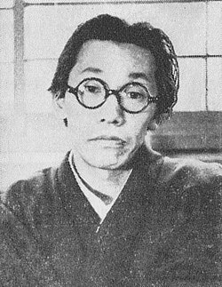

# Fumio Hayasaka

## Biografía

Fumio Hayasaka (早 坂 文 雄 Hayasaka Fumio, 19 de agosto de 1914 - 15 de octubre de 1955) fue un compositor japonés de música clásica y bandas sonoras de películas.

## Estilo musical

Nuestros “ Grandes compositores del audiovisual ” reciben a Fumio Hayasaka (早坂 文雄). Pese a su corta vida estamos ante uno de los compositores más prestigiosos e influyentes del siglo XX, cuyo nombre está inscrito con grandes letras de oro en los libros de la música no solo de Japón, sino del mundo entero.

## Anécdotas y curiosidades

Hayasaka nació en la ciudad de Sendai, en la principal isla japonesa de Honshu. En 1918, Hayasaka y su familia se mudaron a Sapporo, en la isla norteña de Hokkaido. En 1933, Fumio H. y Akira Ikufube organizaron la Liga Nueva Música, que celebró un nuevo festival de música el año siguiente. Hayasaka ganó varios premios por sus obras de concierto, en 1935, su obra Futatsu no sanka e no zensōkyoku ganó el primer premio en un concurso de radio, y otra pieza de concierto, Kodai no bukyoku, ganó el Premio 1938 Weingartner. Otras obras incluyen Nocturne (1936) para piano y la orquesta Ancient Dance (1938). En 1939, Hayasaka mudó a Tokio para comenzar una carrera como compositor de bandas sonoras. A principios de 1940, Hayasaka fue visto como " un compositor importante para el cine japonés ". [ 1 ] ​

## Top 10 bandas sonoras

1. ***羅生門 (Título en España: Rashomon)***
    * **Póster:** [link](030_fumio_hayasaka/posters/poster_poster_1950.jpg)
2. ***七人の侍 (Título en España: Los siete samuráis)***
    * **Póster:** [link](030_fumio_hayasaka/posters/poster_poster_1954.jpg)
3. ***生きる (Título en España: Vivir)***
    * **Póster:** [link](030_fumio_hayasaka/posters/poster_poster_1952.jpg)
4. ***雨月物語 (Título en España: Cuentos de la luna pálida)***
    * **Póster:** [link](030_fumio_hayasaka/posters/poster_poster_1953.jpg)
5. ***山椒大夫 (Título en España: El intendente Sansho)***
    * **Póster:** [link](030_fumio_hayasaka/posters/poster_poster_1954.jpg)
6. ***酔いどれ天使 (Título en España: El ángel borracho (El ángel ebrio))***
    * **Póster:** [link](030_fumio_hayasaka/posters/poster_poster_1948.jpg)
7. ***近松物語 (Título en España: Los amantes crucificados)***
    * **Póster:** [link](030_fumio_hayasaka/posters/poster_poster_1954.jpg)
8. ***白痴 (Título en España: El idiota)***
    * **Póster:** [link](030_fumio_hayasaka/posters/poster_poster_1951.jpg)
9. ***醜聞 (Título en España: Escándalo)***
    * **Póster:** [link](030_fumio_hayasaka/posters/poster_poster_1950.jpg)
10. ***お遊さま (Título en España: La señorita Oyu)***
    * **Póster:** [link](030_fumio_hayasaka/posters/poster_poster_1951.jpg)

## Filmografía completa

- 旅役者 (Título en España: 旅役者) (1940) · [Póster](030_fumio_hayasaka/posters/poster_poster_1940.jpg)
- 海軍爆撃隊 (Título en España: 海軍爆撃隊) (1940) · [Póster](030_fumio_hayasaka/posters/poster_poster_1940.jpg)
- 燃ゆる大空 (Título en España: 燃ゆる大空) (1940) · [Póster](030_fumio_hayasaka/posters/poster_poster_1940.jpg)
- 指導物語 (Título en España: 指導物語) (1941) · [Póster](030_fumio_hayasaka/posters/poster_poster_1941.jpg)
- 白鷺 (Título en España: 白鷺) (1941) · [Póster](030_fumio_hayasaka/posters/poster_poster_1941.jpg)
- 虞美人草 (Título en España: 虞美人草) (1941) · [Póster](030_fumio_hayasaka/posters/poster_poster_1941.jpg)
- 南海の花束 (Título en España: 南海の花束) (1942) · [Póster](030_fumio_hayasaka/posters/poster_poster_1942.jpg)
- 北の三人 (Título en España: 北の三人) (1945) · [Póster](030_fumio_hayasaka/posters/poster_poster_1945.jpg)
- 日本剣豪伝 (Título en España: 日本剣豪伝) (1945) · [Póster](030_fumio_hayasaka/posters/poster_poster_1945.jpg)
- 民衆の敵 (Título en España: 民衆の敵) (1946) · [Póster](030_fumio_hayasaka/posters/poster_poster_1946.jpg)
- 地下街二十四時間 (Título en España: 地下街二十四時間) (1947) · [Póster](030_fumio_hayasaka/posters/poster_poster_1947.jpg)
- 酔いどれ天使 (Título en España: El ángel borracho (El ángel ebrio)) (1948) · [Póster](030_fumio_hayasaka/posters/poster_poster_1948.jpg)
- 雪夫人絵図 (Título en España: El retrato de madame Yuki) (1950) · [Póster](030_fumio_hayasaka/posters/poster_poster_1950.jpg)
- 醜聞 (Título en España: Escándalo) (1950) · [Póster](030_fumio_hayasaka/posters/poster_poster_1950.jpg)
- 羅生門 (Título en España: Rashomon) (1950) · [Póster](030_fumio_hayasaka/posters/poster_poster_1950.jpg)
- 暁の脱走 (Título en España: 暁の脱走) (1950) · [Póster](030_fumio_hayasaka/posters/poster_poster_1950.jpg)
- 細雪 (Título en España: 細雪) (1950) · [Póster](030_fumio_hayasaka/posters/poster_poster_1950.jpg)
- めし (Título en España: El almuerzo) (1951) · [Póster](030_fumio_hayasaka/posters/poster_poster_1951.jpg)
- 白痴 (Título en España: El idiota) (1951) · [Póster](030_fumio_hayasaka/posters/poster_poster_1951.jpg)
- お遊さま (Título en España: La señorita Oyu) (1951) · [Póster](030_fumio_hayasaka/posters/poster_poster_1951.jpg)
- 月よりの母 (Título en España: 月よりの母) (1951) · [Póster](030_fumio_hayasaka/posters/poster_poster_1951.jpg)
- 武蔵野夫人 (Título en España: 武蔵野夫人) (1951) · [Póster](030_fumio_hayasaka/posters/poster_poster_1951.jpg)
- 生きる (Título en España: Vivir) (1952) · [Póster](030_fumio_hayasaka/posters/poster_poster_1952.jpg)
- 人生劇場 第一部 青春愛欲篇 (Título en España: 人生劇場 第一部 青春愛欲篇) (1952) · [Póster](030_fumio_hayasaka/posters/poster_poster_1952.jpg)
- 慟哭 (Título en España: 慟哭) (1952) · [Póster](030_fumio_hayasaka/posters/poster_poster_1952.jpg)
- 長崎の歌は忘れじ (Título en España: 長崎の歌は忘れじ) (1952) · [Póster](030_fumio_hayasaka/posters/poster_poster_1952.jpg)
- 雨月物語 (Título en España: Cuentos de la luna pálida) (1953) · [Póster](030_fumio_hayasaka/posters/poster_poster_1953.jpg)
- 人生劇場 第二部 (Título en España: 人生劇場 第二部) (1953) · [Póster](030_fumio_hayasaka/posters/poster_poster_1953.jpg)
- 広場の孤独 (Título en España: 広場の孤独) (1953) · [Póster](030_fumio_hayasaka/posters/poster_poster_1953.jpg)
- 山椒大夫 (Título en España: El intendente Sansho) (1954) · [Póster](030_fumio_hayasaka/posters/poster_poster_1954.jpg)
- 近松物語 (Título en España: Los amantes crucificados) (1954) · [Póster](030_fumio_hayasaka/posters/poster_poster_1954.jpg)
- 七人の侍 (Título en España: Los siete samuráis) (1954) · [Póster](030_fumio_hayasaka/posters/poster_poster_1954.jpg)
- 千姫 (Título en España: 千姫) (1954) · [Póster](030_fumio_hayasaka/posters/poster_poster_1954.jpg)
- 叛乱 (Título en España: 叛乱) (1954) · [Póster](030_fumio_hayasaka/posters/poster_poster_1954.jpg)
- 君死に給うことなかれ (Título en España: 君死に給うことなかれ) (1954) · [Póster](030_fumio_hayasaka/posters/poster_poster_1954.jpg)
- 密輸船 (Título en España: 密輸船) (1954) · [Póster](030_fumio_hayasaka/posters/poster_poster_1954.jpg)
- 新・平家物語 (Título en España: El héroe sacrílego) (1955) · [Póster](030_fumio_hayasaka/posters/poster_poster_1955.jpg)
- 楊貴妃 (Título en España: La emperatriz Yang Kwei-fei) (1955) · [Póster](030_fumio_hayasaka/posters/poster_poster_1955.jpg)
- あすなろ物語 (Título en España: あすなろ物語) (1955) · [Póster](030_fumio_hayasaka/posters/poster_poster_1955.jpg)
- 大地の侍 (Título en España: 大地の侍) (1956) · [Póster](030_fumio_hayasaka/posters/poster_poster_1956.jpg)

## Fuentes adicionales

* [MundoBSO](https://w.mundobso.com/bso/cartero-siempre-llama-dos-veces-el) — site:mundobso.com
* [MundoBSO (2)](https://www.mundobso.com/bso/capitan-america-civil-war) — site:mundobso.com
* [MundoBSO (3)](https://www.mundobso.com/bso/despiadados-los) — site:mundobso.com
* [Film Score Monthly](https://www.filmscoremonthly.com/board/posts.cfm?threadID=33443&forumID=1&archive=1) — site:filmscoremonthly.com
* [Film Score Monthly (2)](https://www.filmscoremonthly.com/board/posts.cfm?threadID=10498&forumID=1&archive=1) — site:filmscoremonthly.com
* [Film Score Monthly (3)](https://www.filmscoremonthly.com/daily/article.cfm?articleID=8300) — site:filmscoremonthly.com
* [SoundtrackCollector](https://www.soundtrackcollector.com/title/19624/Tengoku+To+Jigoku) — site:soundtrackcollector.com
* [SoundtrackCollector (2)](https://www.soundtrackcollector.com/title/43977/Ikiru) — site:soundtrackcollector.com
* [SoundtrackCollector (3)](https://www.soundtrackcollector.com/title/17654/Kumonosu+Jo) — site:soundtrackcollector.com
* [WhatSong](https://www.whatsong.org/tvshow/how-i-met-your-mother/episode/44483) — site:whatsong.org
* [WhatSong (2)](https://www.whatsong.org/tvshow/supernatural/episode/3659) — site:whatsong.org
* [WhatSong (3)](https://www.whatsong.org/tvshow/smallville/episode/39263) — site:whatsong.org

## Notas externas

* MundoBSO (2): Compositor: Jackman, Henry Sello: Hollywood Duración: 69 minutos Información de la película Título original: Captain America: Civil War Director: Anthony Russo, Joe Russo Nacionalidad: EE UU Año: 2016 Argumento Continuación de Captain America: The Winter Soldier (14). Cuando otro incidente internacional involucra a Los Vengadores y causan varios daños colaterales, aumentan las presiones políticas para exigir más responsabilidades y determinar cuándo deben contratar los servicios del grupo de superhéroes. Esta nueva situación dividirá a Los Vengadores, mientras intentan proteger al mundo de un nuevo y terrible villano. Compositor: Jackman, Henry Sello: Hollywood Duración: 69 minutos
* MundoBSO (3): Compositor: Morricone, Ennio Sello: Screen Trax Duración: 37 minutos Información de la película Título original: I crudeli Director: Sergio Corbucci Nacionalidad: Italia Año: 1967 Argumento Al acabar la guerra de Secesión norteamericana, un coronel sudista organiza un ejército para seguir combatiendo, y cuenta para ello con la ayuda de sus tres hijos. Compositor: Morricone, Ennio Sello: Screen Trax Duración: 37 minutos
* SoundtrackCollector: Heaven And Hell (1963, Internacional: título en inglés: título literal)
* WhatSong: Lily y Robin bailan con los dos nerds del último año de secundaria. Se reproduce de fondo cuando Lilly, Robin y Barney intentan entrar a la fiesta. La canción es una canción que está incluida en iMovie.
* WhatSong (2): Sam y Dean cortan leña para una pira funeraria mientras recuerdan su tiempo con Charlie. La mejor fuente en línea de música de películas y televisión. Copyright © 2018 - 2026 Whatsong.org. Reservados todos los derechos.
* WhatSong (3): Actuó mientras Pete mastica chicle de kriptonita y luego salva a Kara. OneRepublic - Soñando en voz alta (edición ampliada)
* www.tohokingdom.com: Recordado como el compositor elegido por Akira Kurosawa en sus películas anteriores, Fumio Hayasaka fue a menudo anunciado como el mejor compositor cinematográfico de Japón en su época. Durante sus 14 años componiendo, Hayasaka había logrado crear numerosos temas que han resistido el paso del tiempo; sin embargo, más allá de su propio trabajo, Hayasaka también estudió con Toru Takemitsu y enseñó a Masaru Sato, quien terminaría convirtiéndose en el compositor preferido de Kurosawa de 1956 a 1965. Además, Hayasaka terminaría recomendando a Akira Ifukube a los estudios Toho a mediados de los años 1940. Desafortunadamente, Hayasaka murió a la trágica edad de 41 años debido a la tuberculosis; en el momento de su muerte, la partitura de I Live in Fear (1955) de Kurosawa aún no se había publicado...
* classical.music.apple.com: El sonido de Sabina (Música del mundo Vol.2) El sonido de Sabina (Música del mundo Vol.2) Ensemble Sabina, Vinicio Allegrini Los siete samuráis (Banda sonora original de la película) Los siete samuráis (Banda sonora original de la película) Fumio Hayasaka
* music.apple.com: Seven Samurai 1er Movimiento (con la Orquesta Sinfónica Nacional) Seven Samurai / Rashomon Symphonic Suites (con la Orquesta Sinfónica Nacional)â·â2017 Seven Samurai 1er Movimiento (con la Orquesta Sinfónica Nacional)
* www.rottentomatoes.com: -- The Great American Baking Show: Celebrity Big Game: Temporada 2 80% Bridgerton: Temporada 4 Enlace a Bridgerton: Temporada 4
* pantheon.world: Perfiles Personas Lugares Países Ocupaciones Ocupaciones / País Épocas Muertes Fumio Hayasaka (早坂 文雄, Hayasaka Fumo; 19 de agosto de 1914 - 15 de octubre de 1955) fue un compositor y cineasta japonés de música y cine clásicos. LEER más en Wikipedia
* arksquare.net: Categoría de artículo: Todos los artículos Artículos de reserva CD importados Lanzamientos japoneses Películas y TV japonesas (JPN) Películas y TV extranjeras (JPN) Anime (JPN) Juegos (JPN) Blu-ray/DVD/etc. Condición de búsqueda: Palabra clave Título Compositor/Artistas Etiqueta CD No.
