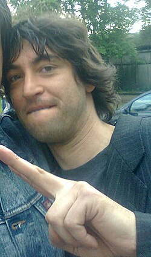

# Carlo Rustichelli

## Biografía

Simone Annicchiarico (Roma, Italia, 8 de agosto de 1970) es un actor y presentador de televisión italiano.​ Simone Annicchiarico es hijo de los conocidos actores Walter Chiari y Alida Chelli, así como nieto del famoso compositor y músico Carlo Rustichelli.

## Estilo musical

Licenciado en piano y composición, tras una breve etapa teatral debutó en la música de cine con Gli ultimi filibustieri (1943). Desde entonces ha colaborado en más de doscientas bandas sonoras, demostrando una vena melódica fácil y evocando atmósferas y estados de ánimo que se adaptan tanto al cine dramático como a las comedias y comedias. Su técnica compositiva se basó en un profundo conocimiento de temas populares, arreglados por expertos, pero también variados en otros géneros musicales. Un ejemplo de ello es la espléndida banda sonora "jazzy" (créditos iniciales) de la película Volem les coroneles, que también incluye una agradable marcha folclórica en los créditos finales. [2]

## Anécdotas y curiosidades

Carlo Rustichelli (24 de diciembre de 1916 - 13 de noviembre de 2004) fue un compositor de cine italiano cuya carrera abarcó desde la década de 1940 hasta aproximadamente 1990. Su prolífica producción incluyó alrededor de 250 composiciones cinematográficas, así como arreglos para otras películas y música para televisión.

## Top 10 bandas sonoras

1. ***I quattro dell'Ave Maria (Título en España: Los cuatro truhanes)***
    * **Póster:** [link](031_carlo_rustichelli/posters/poster_i_quattro_dell_ave_maria_1968.jpg)
2. ***Amici miei (Título en España: Habitación para cuatro)***
    * **Póster:** [link](031_carlo_rustichelli/posters/poster_amici_miei_1975.jpg)
3. ***L'armata Brancaleone (Título en España: La armada Brancaleone)***
    * **Póster:** [link](031_carlo_rustichelli/posters/poster_l_armata_brancaleone_1966.jpg)
4. ***Avanti! (Título en España: ¿Qué ocurrió entre mi padre y tu madre?)***
    * **Póster:** [link](031_carlo_rustichelli/posters/poster_avanti_1972.jpg)
5. ***Divorzio all'italiana (Título en España: Divorcio a la italiana)***
    * **Póster:** [link](031_carlo_rustichelli/posters/poster_divorzio_all_italiana_1961.jpg)
6. ***Mamma Roma (Título en España: Mamma Roma)***
    * **Póster:** [link](031_carlo_rustichelli/posters/poster_mamma_roma_1962.jpg)
7. ***I compagni (Título en España: Los camaradas)***
    * **Póster:** [link](031_carlo_rustichelli/posters/poster_i_compagni_1963.jpg)
8. ***Amici miei - Atto II° (Título en España: Un quinteto a lo loco)***
    * **Póster:** [link](031_carlo_rustichelli/posters/poster_amici_miei_atto_ii_1982.jpg)
9. ***Sei donne per l'assassino (Título en España: Seis mujeres para el asesino)***
    * **Póster:** [link](031_carlo_rustichelli/posters/poster_sei_donne_per_l_assassino_1964.jpg)
10. ***Amici miei - Atto III° (Título en España: Amici miei - Atto III°)***
    * **Póster:** [link](031_carlo_rustichelli/posters/poster_amici_miei_atto_iii_1985.jpg)

## Filmografía completa

- Gli ultimi filibustieri (Título en España: Gli ultimi filibustieri) (1943) · [Póster](031_carlo_rustichelli/posters/poster_gli_ultimi_filibustieri_1943.jpg)
- All'ombra della gloria (Título en España: All'ombra della gloria) (1945) · [Póster](031_carlo_rustichelli/posters/poster_all_ombra_della_gloria_1945.jpg)
- Gioventù perduta (Título en España: Gioventù perduta) (1948) · [Póster](031_carlo_rustichelli/posters/poster_giovent_perduta_1948.jpg)
- In nome della legge (Título en España: En nombre de la ley) (1949) · [Póster](031_carlo_rustichelli/posters/poster_in_nome_della_legge_1949.jpg)
- Totò cerca casa (Título en España: Totò busca piso) (1949) · [Póster](031_carlo_rustichelli/posters/poster_tot_cerca_casa_1949.jpg)
- Atto di accusa (Título en España: Atto di accusa) (1950) · [Póster](031_carlo_rustichelli/posters/poster_atto_di_accusa_1950.jpg)
- Cuori senza frontiere (Título en España: Cuori senza frontiere) (1950) · [Póster](031_carlo_rustichelli/posters/poster_cuori_senza_frontiere_1950.jpg)
- Il cammino della speranza (Título en España: El camino de la esperanza) (1950) · [Póster](031_carlo_rustichelli/posters/poster_il_cammino_della_speranza_1950.jpg)
- I fuorilegge (Título en España: I fuorilegge) (1950) · [Póster](031_carlo_rustichelli/posters/poster_i_fuorilegge_1950.jpg)
- Il leone di Amalfi (Título en España: Il leone di Amalfi) (1950) · [Póster](031_carlo_rustichelli/posters/poster_il_leone_di_amalfi_1950.jpg)
- Il bivio (Título en España: Il bivio) (1951) · [Póster](031_carlo_rustichelli/posters/poster_il_bivio_1951.jpg)
- La città si difende (Título en España: La città si difende) (1951) · [Póster](031_carlo_rustichelli/posters/poster_la_citt_si_difende_1951.jpg)
- Persiane chiuse (Título en España: Persiane chiuse) (1951) · [Póster](031_carlo_rustichelli/posters/poster_persiane_chiuse_1951.jpg)
- Il brigante di Tacca del Lupo (Título en España: Il brigante di Tacca del Lupo) (1952) · [Póster](031_carlo_rustichelli/posters/poster_il_brigante_di_tacca_del_lupo_1952.jpg)
- La presidentessa (Título en España: La presidenta) (1952) · [Póster](031_carlo_rustichelli/posters/poster_la_presidentessa_1952.jpg)
- Totò e le donne (Título en España: Totò e le donne) (1952) · [Póster](031_carlo_rustichelli/posters/poster_tot_e_le_donne_1952.jpg)
- Ci troviamo in galleria (Título en España: Ci troviamo in galleria) (1953) · [Póster](031_carlo_rustichelli/posters/poster_ci_troviamo_in_galleria_1953.jpg)
- Capitan Fantasma (Título en España: El Capitán Fantasma) (1953) · [Póster](031_carlo_rustichelli/posters/poster_capitan_fantasma_1953.jpg)
- Gelosia (Título en España: Gelosia) (1953) · [Póster](031_carlo_rustichelli/posters/poster_gelosia_1953.jpg)
- La cieca di Sorrento (Título en España: La cieca di Sorrento) (1953) · [Póster](031_carlo_rustichelli/posters/poster_la_cieca_di_sorrento_1953.jpg)
- Perdonami! (Título en España: Perdonami!) (1953) · [Póster](031_carlo_rustichelli/posters/poster_perdonami_1953.jpg)
- Puccini (Título en España: Puccini) (1953) · [Póster](031_carlo_rustichelli/posters/poster_puccini_1953.jpg)
- Ti ho sempre amato! (Título en España: Ti ho sempre amato!) (1953) · [Póster](031_carlo_rustichelli/posters/poster_ti_ho_sempre_amato_1953.jpg)
- Amori di mezzo secolo (Título en España: Amori di mezzo secolo) (1954) · [Póster](031_carlo_rustichelli/posters/poster_amori_di_mezzo_secolo_1954.jpg)
- Gran varietà (Título en España: Gran varietà) (1954) · [Póster](031_carlo_rustichelli/posters/poster_gran_variet_1954.jpg)
- Hanno rubato un tram (Título en España: Han robado un tranvía) (1954) · [Póster](031_carlo_rustichelli/posters/poster_hanno_rubato_un_tram_1954.jpg)
- Il cardinale Lambertini (Título en España: Il cardinale Lambertini) (1954) · [Póster](031_carlo_rustichelli/posters/poster_il_cardinale_lambertini_1954.jpg)
- L’ombra (Título en España: L’ombra) (1954) · [Póster](031_carlo_rustichelli/posters/poster_l_ombra_1954.jpg)
- Pietà per chi cade (Título en España: Pietà per chi cade) (1954) · [Póster](031_carlo_rustichelli/posters/poster_piet_per_chi_cade_1954.jpg)
- Disperato addio (Título en España: Disperato addio) (1955) · [Póster](031_carlo_rustichelli/posters/poster_disperato_addio_1955.jpg)
- I due compari (Título en España: I due compari) (1955) · [Póster](031_carlo_rustichelli/posters/poster_i_due_compari_1955.jpg)
- Prigionieri del male (Título en España: Revelación) (1955) · [Póster](031_carlo_rustichelli/posters/poster_prigionieri_del_male_1955.jpg)
- La vena d'oro (Título en España: También yo te quiero) (1955) · [Póster](031_carlo_rustichelli/posters/poster_la_vena_d_oro_1955.jpg)
- Il ferroviere (Título en España: El ferroviario) (1956) · [Póster](031_carlo_rustichelli/posters/poster_il_ferroviere_1956.jpg)
- Guardia, guardia scelta, brigadiere e maresciallo (Título en España: Guardias de Roma) (1956) · [Póster](031_carlo_rustichelli/posters/poster_guardia_guardia_scelta_brigadiere_e_maresciallo_1956.jpg)
- Il prezzo della gloria (Título en España: Il prezzo della gloria) (1956) · [Póster](031_carlo_rustichelli/posters/poster_il_prezzo_della_gloria_1956.jpg)
- Dinanzi a noi il cielo (Título en España: Dinanzi a noi il cielo) (1957) · [Póster](031_carlo_rustichelli/posters/poster_dinanzi_a_noi_il_cielo_1957.jpg)
- Lazzarella (Título en España: Lazzarella) (1957) · [Póster](031_carlo_rustichelli/posters/poster_lazzarella_1957.jpg)
- Marisa la civetta (Título en España: Marisa la civetta) (1957) · [Póster](031_carlo_rustichelli/posters/poster_marisa_la_civetta_1957.jpg)
- Non sono più guaglione (Título en España: Non sono più guaglione) (1957) · [Póster](031_carlo_rustichelli/posters/poster_non_sono_pi_guaglione_1957.jpg)
- Orizzonte infuocato (Título en España: Orizzonte infuocato) (1957) · [Póster](031_carlo_rustichelli/posters/poster_orizzonte_infuocato_1957.jpg)
- L'uomo di paglia (Título en España: El hombre de paja) (1958) · [Póster](031_carlo_rustichelli/posters/poster_l_uomo_di_paglia_1958.jpg)
- L'uomo dai calzoni corti (Título en España: L'uomo dai calzoni corti) (1958) · [Póster](031_carlo_rustichelli/posters/poster_l_uomo_dai_calzoni_corti_1958.jpg)
- La morte viene dallo spazio (Título en España: La morte viene dallo spazio) (1958) · [Póster](031_carlo_rustichelli/posters/poster_la_morte_viene_dallo_spazio_1958.jpg)
- Totò e Marcellino (Título en España: Totó y Pablito) (1958) · [Póster](031_carlo_rustichelli/posters/poster_tot_e_marcellino_1958.jpg)
- Valeria ragazza poco seria (Título en España: Valeria ragazza poco seria) (1958) · [Póster](031_carlo_rustichelli/posters/poster_valeria_ragazza_poco_seria_1958.jpg)
- È arrivata la parigina (Título en España: È arrivata la parigina) (1958) · [Póster](031_carlo_rustichelli/posters/poster_arrivata_la_parigina_1958.jpg)
- Annibale (Título en España: Aníbal) (1959) · [Póster](031_carlo_rustichelli/posters/poster_annibale_1959.jpg)
- Arrangiatevi! (Título en España: Arrangiatevi!) (1959) · [Póster](031_carlo_rustichelli/posters/poster_arrangiatevi_1959.jpg)
- Esterina (Título en España: Esterina) (1959) · [Póster](031_carlo_rustichelli/posters/poster_esterina_1959.jpg)
- Il vendicatore (Título en España: Il vendicatore) (1959) · [Póster](031_carlo_rustichelli/posters/poster_il_vendicatore_1959.jpg)
- La prima notte (Título en España: La prima notte) (1959) · [Póster](031_carlo_rustichelli/posters/poster_la_prima_notte_1959.jpg)
- Le Secret du chevalier d'Éon (Título en España: Le Secret du chevalier d'Éon) (1959) · [Póster](031_carlo_rustichelli/posters/poster_le_secret_du_chevalier_d_on_1959.jpg)
- Noi siamo 2 evasi (Título en España: Somos dos fugitivos) (1959) · [Póster](031_carlo_rustichelli/posters/poster_noi_siamo_2_evasi_1959.jpg)
- Un maledetto imbroglio (Título en España: Un maldito embrollo) (1959) · [Póster](031_carlo_rustichelli/posters/poster_un_maledetto_imbroglio_1959.jpg)
- Teseo contro il minotauro (Título en España: El monstruo de Creta) (1960) · [Póster](031_carlo_rustichelli/posters/poster_teseo_contro_il_minotauro_1960.jpg)
- Kapò (Título en España: Kapo) (1960) · [Póster](031_carlo_rustichelli/posters/poster_kap_1960.jpg)
- La lunga notte del '43 (Título en España: La lunga notte del '43) (1960) · [Póster](031_carlo_rustichelli/posters/poster_la_lunga_notte_del_43_1960.jpg)
- La Venere dei pirati (Título en España: La mujer pirata) (1960) · [Póster](031_carlo_rustichelli/posters/poster_la_venere_dei_pirati_1960.jpg)
- Le Olimpiadi dei mariti (Título en España: Le Olimpiadi dei mariti) (1960) · [Póster](031_carlo_rustichelli/posters/poster_le_olimpiadi_dei_mariti_1960.jpg)
- Letto a tre piazze (Título en España: Letto a tre piazze) (1960) · [Póster](031_carlo_rustichelli/posters/poster_letto_a_tre_piazze_1960.jpg)
- Intrigo a Taormina (Título en España: Mujeres de lujo) (1960) · [Póster](031_carlo_rustichelli/posters/poster_intrigo_a_taormina_1960.jpg)
- Un amore a Roma (Título en España: Un amore a Roma) (1960) · [Póster](031_carlo_rustichelli/posters/poster_un_amore_a_roma_1960.jpg)
- Antinea, l'amante della città sepolta (Título en España: Antinea, l'amante della città sepolta) (1961) · [Póster](031_carlo_rustichelli/posters/poster_antinea_l_amante_della_citt_sepolta_1961.jpg)
- Divorzio all'italiana (Título en España: Divorcio a la italiana) (1961) · [Póster](031_carlo_rustichelli/posters/poster_divorzio_all_italiana_1961.jpg)
- Il ladro di Bagdad (Título en España: El ladrón de Bagdad) (1961) · [Póster](031_carlo_rustichelli/posters/poster_il_ladro_di_bagdad_1961.jpg)
- Gordon, il pirata nero (Título en España: El pirata negro) (1961) · [Póster](031_carlo_rustichelli/posters/poster_gordon_il_pirata_nero_1961.jpg)
- Il ratto delle sabine (Título en España: El rapto de las sabinas) (1961) · [Póster](031_carlo_rustichelli/posters/poster_il_ratto_delle_sabine_1961.jpg)
- Giorno per giorno disperatamente (Título en España: Giorno per giorno disperatamente) (1961) · [Póster](031_carlo_rustichelli/posters/poster_giorno_per_giorno_disperatamente_1961.jpg)
- Il carabiniere a cavallo (Título en España: Il carabiniere a cavallo) (1961) · [Póster](031_carlo_rustichelli/posters/poster_il_carabiniere_a_cavallo_1961.jpg)
- Rosmunda e Alboino (Título en España: La espada del conquistador) (1961) · [Póster](031_carlo_rustichelli/posters/poster_rosmunda_e_alboino_1961.jpg)
- Nefertiti, regina del Nilo (Título en España: Nefertiti, Reina del Nilo) (1961) · [Póster](031_carlo_rustichelli/posters/poster_nefertiti_regina_del_nilo_1961.jpg)
- Pastasciutta nel deserto (Título en España: Pastasciutta nel deserto) (1961) · [Póster](031_carlo_rustichelli/posters/poster_pastasciutta_nel_deserto_1961.jpg)
- Psycosissimo (Título en España: Psycosissimo) (1961) · [Póster](031_carlo_rustichelli/posters/poster_psycosissimo_1961.jpg)
- Tiro al piccione (Título en España: Tiro al pichón) (1961) · [Póster](031_carlo_rustichelli/posters/poster_tiro_al_piccione_1961.jpg)
- Un giorno da leoni (Título en España: Un giorno da leoni) (1961) · [Póster](031_carlo_rustichelli/posters/poster_un_giorno_da_leoni_1961.jpg)
- Agostino (Título en España: Agostino) (1962) · [Póster](031_carlo_rustichelli/posters/poster_agostino_1962.jpg)
- Il Commissario (Título en España: El comisario) (1962) · [Póster](031_carlo_rustichelli/posters/poster_il_commissario_1962.jpg)
- I moschettieri del mare (Título en España: I moschettieri del mare) (1962) · [Póster](031_carlo_rustichelli/posters/poster_i_moschettieri_del_mare_1962.jpg)
- L'isola di Arturo (Título en España: L'isola di Arturo) (1962) · [Póster](031_carlo_rustichelli/posters/poster_l_isola_di_arturo_1962.jpg)
- La bellezza di Ippolita (Título en España: La bellezza di Ippolita) (1962) · [Póster](031_carlo_rustichelli/posters/poster_la_bellezza_di_ippolita_1962.jpg)
- La tigre dei sette mari (Título en España: La tigresa de los 7 mares) (1962) · [Póster](031_carlo_rustichelli/posters/poster_la_tigre_dei_sette_mari_1962.jpg)
- Le quattro giornate di Napoli (Título en España: Los cuatro días de Nápoles) (1962) · [Póster](031_carlo_rustichelli/posters/poster_le_quattro_giornate_di_napoli_1962.jpg)
- Arrivano i titani (Título en España: Los titanes) (1962) · [Póster](031_carlo_rustichelli/posters/poster_arrivano_i_titani_1962.jpg)
- Mamma Roma (Título en España: Mamma Roma) (1962) · [Póster](031_carlo_rustichelli/posters/poster_mamma_roma_1962.jpg)
- Pelle viva (Título en España: Pelle viva) (1962) · [Póster](031_carlo_rustichelli/posters/poster_pelle_viva_1962.jpg)
- Adultero lui, adultera lei (Título en España: Adultero lui, adultera lei) (1963) · [Póster](031_carlo_rustichelli/posters/poster_adultero_lui_adultera_lei_1963.jpg)
- La frusta e il corpo (Título en España: El cuerpo y el látigo) (1963) · [Póster](031_carlo_rustichelli/posters/poster_la_frusta_e_il_corpo_1963.jpg)
- Il leone di San Marco (Título en España: El león de San Marcos) (1963) · [Póster](031_carlo_rustichelli/posters/poster_il_leone_di_san_marco_1963.jpg)
- Il boia di Venezia (Título en España: El verdugo de Venecia) (1963) · [Póster](031_carlo_rustichelli/posters/poster_il_boia_di_venezia_1963.jpg)
- La smania addosso (Título en España: La smania addosso) (1963) · [Póster](031_carlo_rustichelli/posters/poster_la_smania_addosso_1963.jpg)
- I compagni (Título en España: Los camaradas) (1963) · [Póster](031_carlo_rustichelli/posters/poster_i_compagni_1963.jpg)
- Gli imbroglioni (Título en España: Los mangantes) (1963) · [Póster](031_carlo_rustichelli/posters/poster_gli_imbroglioni_1963.jpg)
- Mare matto (Título en España: Mare matto) (1963) · [Póster](031_carlo_rustichelli/posters/poster_mare_matto_1963.jpg)
- Ro.Go.Pa.G. (Título en España: Rogopag) (1963) · [Póster](031_carlo_rustichelli/posters/poster_ro_go_pa_g_1963.jpg)
- Totò e Cleopatra (Título en España: Totò y Cleopatra) (1963) · [Póster](031_carlo_rustichelli/posters/poster_tot_e_cleopatra_1963.jpg)
- Buffalo Bill, l'eroe del far west (Título en España: El héroe del Oeste) (1964) · [Póster](031_carlo_rustichelli/posters/poster_buffalo_bill_l_eroe_del_far_west_1964.jpg)
- I misteri della giungla nera (Título en España: El misterio de la jungla negra) (1964) · [Póster](031_carlo_rustichelli/posters/poster_i_misteri_della_giungla_nera_1964.jpg)
- Genoveffa di Brabante (Título en España: Genoveffa di Brabante) (1964) · [Póster](031_carlo_rustichelli/posters/poster_genoveffa_di_brabante_1964.jpg)
- Il dominatore del deserto (Título en España: Il dominatore del deserto) (1964) · [Póster](031_carlo_rustichelli/posters/poster_il_dominatore_del_deserto_1964.jpg)
- Il figlio di Cleopatra (Título en España: Il figlio di Cleopatra) (1964) · [Póster](031_carlo_rustichelli/posters/poster_il_figlio_di_cleopatra_1964.jpg)
- La ragazza di Bube (Título en España: La chica de Bube) (1964) · [Póster](031_carlo_rustichelli/posters/poster_la_ragazza_di_bube_1964.jpg)
- La donna è una cosa meravigliosa (Título en España: La donna è una cosa meravigliosa) (1964) · [Póster](031_carlo_rustichelli/posters/poster_la_donna_una_cosa_meravigliosa_1964.jpg)
- La valle dell'eco tonante (Título en España: La valle dell'eco tonante) (1964) · [Póster](031_carlo_rustichelli/posters/poster_la_valle_dell_eco_tonante_1964.jpg)
- Sandokan alla riscossa (Título en España: La venganza de Sandokan) (1964) · [Póster](031_carlo_rustichelli/posters/poster_sandokan_alla_riscossa_1964.jpg)
- I giganti di Roma (Título en España: Los gigantes de Roma) (1964) · [Póster](031_carlo_rustichelli/posters/poster_i_giganti_di_roma_1964.jpg)
- I lunghi capelli della morte (Título en España: Los largos cabellos de la muerte) (1964) · [Póster](031_carlo_rustichelli/posters/poster_i_lunghi_capelli_della_morte_1964.jpg)
- I promessi sposi (Título en España: Promesa sagrada) (1964) · [Póster](031_carlo_rustichelli/posters/poster_i_promessi_sposi_1964.jpg)
- Sandokan contro il leopardo di Sarawak (Título en España: Sandokan contra el Leopardo de Sarawak) (1964) · [Póster](031_carlo_rustichelli/posters/poster_sandokan_contro_il_leopardo_di_sarawak_1964.jpg)
- Sedotti e bidonati (Título en España: Sedotti e bidonati) (1964) · [Póster](031_carlo_rustichelli/posters/poster_sedotti_e_bidonati_1964.jpg)
- Sedotta e abbandonata (Título en España: Seducida y abandonada) (1964) · [Póster](031_carlo_rustichelli/posters/poster_sedotta_e_abbandonata_1964.jpg)
- Sei donne per l'assassino (Título en España: Seis mujeres para el asesino) (1964) · [Póster](031_carlo_rustichelli/posters/poster_sei_donne_per_l_assassino_1964.jpg)
- Sette contro la morte (Título en España: Sette contro la morte) (1964) · [Póster](031_carlo_rustichelli/posters/poster_sette_contro_la_morte_1964.jpg)
- Totò contro il pirata nero (Título en España: Totó contra el pirata negro) (1964) · [Póster](031_carlo_rustichelli/posters/poster_tot_contro_il_pirata_nero_1964.jpg)
- 3 notti d'amore (Título en España: Tres noches de amor) (1964) · [Póster](031_carlo_rustichelli/posters/poster_3_notti_d_amore_1964.jpg)
- La calda vita (Título en España: Vidas ardientes) (1964) · [Póster](031_carlo_rustichelli/posters/poster_la_calda_vita_1964.jpg)
- Gli eroi di Fort Worth (Título en España: 7º de Caballería) (1965) · [Póster](031_carlo_rustichelli/posters/poster_gli_eroi_di_fort_worth_1965.jpg)
- L'avventuriero della Tortuga (Título en España: El aventurero de la tortuga) (1965) · [Póster](031_carlo_rustichelli/posters/poster_l_avventuriero_della_tortuga_1965.jpg)
- L'antimiracolo (Título en España: L'antimiracolo) (1965) · [Póster](031_carlo_rustichelli/posters/poster_l_antimiracolo_1965.jpg)
- Letti sbagliati (Título en España: Letti sbagliati) (1965) · [Póster](031_carlo_rustichelli/posters/poster_letti_sbagliati_1965.jpg)
- Libido (Título en España: Libido) (1965) · [Póster](031_carlo_rustichelli/posters/poster_libido_1965.jpg)
- Made in Italy (Título en España: Made in Italy) (1965) · [Póster](031_carlo_rustichelli/posters/poster_made_in_italy_1965.jpg)
- Delitto quasi perfetto (Título en España: Delitto quasi perfetto) (1966) · [Póster](031_carlo_rustichelli/posters/poster_delitto_quasi_perfetto_1966.jpg)
- On a volé la Joconde (Título en España: La Mona Lisa ha sido robada) (1966) · [Póster](031_carlo_rustichelli/posters/poster_on_a_vol_la_joconde_1966.jpg)
- L'armata Brancaleone (Título en España: La armada Brancaleone) (1966) · [Póster](031_carlo_rustichelli/posters/poster_l_armata_brancaleone_1966.jpg)
- Le stagioni del nostro amore (Título en España: Las estaciones de nuestro amor) (1966) · [Póster](031_carlo_rustichelli/posters/poster_le_stagioni_del_nostro_amore_1966.jpg)
- Signore e signori (Título en España: Señoras y señores) (1966) · [Póster](031_carlo_rustichelli/posters/poster_signore_e_signori_1966.jpg)
- La grande notte di Ringo (Título en España: Trampa para un forajido) (1966) · [Póster](031_carlo_rustichelli/posters/poster_la_grande_notte_di_ringo_1966.jpg)
- Uccidi o muori (Título en España: Uccidi o muori) (1966) · [Póster](031_carlo_rustichelli/posters/poster_uccidi_o_muori_1966.jpg)
- Io, io, io... e gli altri (Título en España: Yo, yo, yo... y los demás) (1966) · [Póster](031_carlo_rustichelli/posters/poster_io_io_io_e_gli_altri_1966.jpg)
- I due vigili (Título en España: I due vigili) (1967) · [Póster](031_carlo_rustichelli/posters/poster_i_due_vigili_1967.jpg)
- Il padre di famiglia (Título en España: Il padre di famiglia) (1967) · [Póster](031_carlo_rustichelli/posters/poster_il_padre_di_famiglia_1967.jpg)
- L'immorale (Título en España: Muchas cuerdas para un violín) (1967) · [Póster](031_carlo_rustichelli/posters/poster_l_immorale_1967.jpg)
- Dio perdona... Io no! (Título en España: Tú perdonas... yo no) (1967) · [Póster](031_carlo_rustichelli/posters/poster_dio_perdona_io_no_1967.jpg)
- Cin cin... cianuro (Título en España: Cin cin... cianuro) (1968) · [Póster](031_carlo_rustichelli/posters/poster_cin_cin_cianuro_1968.jpg)
- The Secret War of Harry Frigg (Título en España: Comando secreto) (1968) · [Póster](031_carlo_rustichelli/posters/poster_the_secret_war_of_harry_frigg_1968.jpg)
- Il pistolero segnato da Dio (Título en España: El pistolero que odiaba la muerte) (1968) · [Póster](031_carlo_rustichelli/posters/poster_il_pistolero_segnato_da_dio_1968.jpg)
- I sette fratelli Cervi (Título en España: I sette fratelli Cervi) (1968) · [Póster](031_carlo_rustichelli/posters/poster_i_sette_fratelli_cervi_1968.jpg)
- I Tre Che Sconvolsero Il West (Título en España: Llego, veo, disparo) (1968) · [Póster](031_carlo_rustichelli/posters/poster_i_tre_che_sconvolsero_il_west_1968.jpg)
- I quattro dell'Ave Maria (Título en España: Los cuatro truhanes) (1968) · [Póster](031_carlo_rustichelli/posters/poster_i_quattro_dell_ave_maria_1968.jpg)
- Meglio Vedova (Título en España: Meglio Vedova) (1968) · [Póster](031_carlo_rustichelli/posters/poster_meglio_vedova_1968.jpg)
- Serafino (Título en España: Serafino) (1968) · [Póster](031_carlo_rustichelli/posters/poster_serafino_1968.jpg)
- Stuntman (Título en España: Súper amante... a veces) (1968) · [Póster](031_carlo_rustichelli/posters/poster_stuntman_1968.jpg)
- Un minuto per pregare, un istante per morire (Título en España: Un minuto para rezar y un segundo para morir) (1968) · [Póster](031_carlo_rustichelli/posters/poster_un_minuto_per_pregare_un_istante_per_morire_1968.jpg)
- Un treno per Durango (Título en España: Un tren para Durango) (1968) · [Póster](031_carlo_rustichelli/posters/poster_un_treno_per_durango_1968.jpg)
- Dai nemici mi guardo io! (Título en España: ¡De mis enemigos me ocupo yo!) (1968) · [Póster](031_carlo_rustichelli/posters/poster_dai_nemici_mi_guardo_io_1968.jpg)
- Certo, certissimo, anzi... probabile (Título en España: Cierto, ciertísimo, bastante... Probable) (1969) · [Póster](031_carlo_rustichelli/posters/poster_certo_certissimo_anzi_probabile_1969.jpg)
- Gli infermieri della mutua (Título en España: Gli infermieri della mutua) (1969) · [Póster](031_carlo_rustichelli/posters/poster_gli_infermieri_della_mutua_1969.jpg)
- Il Terribile Ispettore (Título en España: Il Terribile Ispettore) (1969) · [Póster](031_carlo_rustichelli/posters/poster_il_terribile_ispettore_1969.jpg)
- Il ragazzo che sorride (Título en España: Il ragazzo che sorride) (1969) · [Póster](031_carlo_rustichelli/posters/poster_il_ragazzo_che_sorride_1969.jpg)
- La battaglia di El Alamein (Título en España: La batalla del Alamein) (1969) · [Póster](031_carlo_rustichelli/posters/poster_la_battaglia_di_el_alamein_1969.jpg)
- La collina degli stivali (Título en España: La colina de las botas) (1969) · [Póster](031_carlo_rustichelli/posters/poster_la_collina_degli_stivali_1969.jpg)
- Probabilità zero (Título en España: Probabilità zero) (1969) · [Póster](031_carlo_rustichelli/posters/poster_probabilit_zero_1969.jpg)
- Violenza al sole (Título en España: Violenza al sole) (1969) · [Póster](031_carlo_rustichelli/posters/poster_violenza_al_sole_1969.jpg)
- 12 + 1 (Título en España: ¿Cuál de las trece?) (1969) · [Póster](031_carlo_rustichelli/posters/poster_12_1_1969.jpg)
- Brancaleone alle crociate (Título en España: Brancaleone en las cruzadas) (1970) · [Póster](031_carlo_rustichelli/posters/poster_brancaleone_alle_crociate_1970.jpg)
- Ninì Tirabusciò: la donna che inventò la mossa (Título en España: La mujer más explosiva del mundo) (1970) · [Póster](031_carlo_rustichelli/posters/poster_nin_tirabusci_la_donna_che_invent_la_mossa_1970.jpg)
- Le castagne sono buone (Título en España: Le castagne sono buone) (1970) · [Póster](031_carlo_rustichelli/posters/poster_le_castagne_sono_buone_1970.jpg)
- Ma chi t'ha dato la patente? (Título en España: Pero ¿quién te ha dado el carnet?) (1970) · [Póster](031_carlo_rustichelli/posters/poster_ma_chi_t_ha_dato_la_patente_1970.jpg)
- Rosolino Paternò, soldato... (Título en España: Rosolino Paternò, soldato...) (1970) · [Póster](031_carlo_rustichelli/posters/poster_rosolino_patern_soldato_1970.jpg)
- Satiricosissimo (Título en España: Satiricosissimo) (1970) · [Póster](031_carlo_rustichelli/posters/poster_satiricosissimo_1970.jpg)
- Una spada per Brando (Título en España: Una espada para Brando) (1970) · [Póster](031_carlo_rustichelli/posters/poster_una_spada_per_brando_1970.jpg)
- Armiamoci e partite! (Título en España: Armiamoci e partite!) (1971) · [Póster](031_carlo_rustichelli/posters/poster_armiamoci_e_partite_1971.jpg)
- Bastardo, vamos a matar (Título en España: Bastardo, vamos a matar) (1971) · [Póster](031_carlo_rustichelli/posters/poster_bastardo_vamos_a_matar_1971.jpg)
- Bubù (Título en España: Bubu de Montparnasse) (1971) · [Póster](031_carlo_rustichelli/posters/poster_bub_1971.jpg)
- Detenuto in attesa di giudizio (Título en España: Detenido en espera de juicio) (1971) · [Póster](031_carlo_rustichelli/posters/poster_detenuto_in_attesa_di_giudizio_1971.jpg)
- Er più: storia d'amore e di coltello (Título en España: El guapo) (1971) · [Póster](031_carlo_rustichelli/posters/poster_er_pi_storia_d_amore_e_di_coltello_1971.jpg)
- In nome del popolo italiano (Título en España: En nombre del pueblo italiano) (1971) · [Póster](031_carlo_rustichelli/posters/poster_in_nome_del_popolo_italiano_1971.jpg)
- Boccaccio (Título en España: Cuando el cuerno asoma) (1972) · [Póster](031_carlo_rustichelli/posters/poster_boccaccio_1972.jpg)
- Don Camillo e i giovani d'oggi (Título en España: Don Camilo y los jóvenes de hoy) (1972) · [Póster](031_carlo_rustichelli/posters/poster_don_camillo_e_i_giovani_d_oggi_1972.jpg)
- Alfredo, Alfredo (Título en España: El divorcio es cosa de tres) (1972) · [Póster](031_carlo_rustichelli/posters/poster_alfredo_alfredo_1972.jpg)
- Causa di divorzio (Título en España: Hasta que el divorcio nos separe) (1972) · [Póster](031_carlo_rustichelli/posters/poster_causa_di_divorzio_1972.jpg)
- The Call of the Wild (Título en España: La selva blanca) (1972) · [Póster](031_carlo_rustichelli/posters/poster_the_call_of_the_wild_1972.jpg)
- Avanti! (Título en España: ¿Qué ocurrió entre mi padre y tu madre?) (1972) · [Póster](031_carlo_rustichelli/posters/poster_avanti_1972.jpg)
- Bella, ricca, lieve difetto fisico, cerca anima gemella (Título en España: Bella, rica, con leve defecto físico) (1973) · [Póster](031_carlo_rustichelli/posters/poster_bella_ricca_lieve_difetto_fisico_cerca_anima_gemella_1973.jpg)
- Zanna Bianca (Título en España: Colmillo Blanco) (1973) · [Póster](031_carlo_rustichelli/posters/poster_zanna_bianca_1973.jpg)
- La mano nera (Título en España: La mano nera) (1973) · [Póster](031_carlo_rustichelli/posters/poster_la_mano_nera_1973.jpg)
- Milano Rovente (Título en España: Los clubs de la Dolce vita) (1973) · [Póster](031_carlo_rustichelli/posters/poster_milano_rovente_1973.jpg)
- Vogliamo i colonnelli (Título en España: Queremos los Coroneles) (1973) · [Póster](031_carlo_rustichelli/posters/poster_vogliamo_i_colonnelli_1973.jpg)
- L'emigrante (Título en España: Un trabajo tranquilo) (1973) · [Póster](031_carlo_rustichelli/posters/poster_l_emigrante_1973.jpg)
- And Then There Were None (Título en España: Diez negritos) (1974) · [Póster](031_carlo_rustichelli/posters/poster_and_then_there_were_none_1974.jpg)
- Il ritorno di Zanna Bianca (Título en España: La carrera del oro) (1974) · [Póster](031_carlo_rustichelli/posters/poster_il_ritorno_di_zanna_bianca_1974.jpg)
- Salvo D'Acquisto (Título en España: Salvo D'Acquisto) (1974) · [Póster](031_carlo_rustichelli/posters/poster_salvo_d_acquisto_1974.jpg)
- Un uomo, una città (Título en España: Vicio en la ciudad) (1974) · [Póster](031_carlo_rustichelli/posters/poster_un_uomo_una_citt_1974.jpg)
- Il gatto mammone (Título en España: El impotente seductor) (1975) · [Póster](031_carlo_rustichelli/posters/poster_il_gatto_mammone_1975.jpg)
- Amici miei (Título en España: Habitación para cuatro) (1975) · [Póster](031_carlo_rustichelli/posters/poster_amici_miei_1975.jpg)
- Une femme à sa fenêtre (Título en España: Una mujer en la ventana) (1976) · [Póster](031_carlo_rustichelli/posters/poster_une_femme_sa_fen_tre_1976.jpg)
- L'Homme pressé (Título en España: L'Homme pressé) (1977) · [Póster](031_carlo_rustichelli/posters/poster_l_homme_press_1977.jpg)
- Le Gang (Título en España: Los granujas) (1977) · [Póster](031_carlo_rustichelli/posters/poster_le_gang_1977.jpg)
- Zio Adolfo, in arte Führer (Título en España: Mi querido Hitler) (1978) · [Póster](031_carlo_rustichelli/posters/poster_zio_adolfo_in_arte_f_hrer_1978.jpg)
- Assassinio sul Tevere (Título en España: Nico, en el asesino del Tiber) (1979) · [Póster](031_carlo_rustichelli/posters/poster_assassinio_sul_tevere_1979.jpg)
- Ator 2 - L'invincibile Orion (Título en España: Ator 2: El invencible) (1982) · [Póster](031_carlo_rustichelli/posters/poster_ator_2_l_invincibile_orion_1982.jpg)
- Testa o croce (Título en España: Testa o croce) (1982) · [Póster](031_carlo_rustichelli/posters/poster_testa_o_croce_1982.jpg)
- Amici miei - Atto II° (Título en España: Un quinteto a lo loco) (1982) · [Póster](031_carlo_rustichelli/posters/poster_amici_miei_atto_ii_1982.jpg)
- Il Trono di Fuoco (Título en España: El trono de fuego) (1983) · [Póster](031_carlo_rustichelli/posters/poster_il_trono_di_fuoco_1983.jpg)
- Il petomane (Título en España: Il petomane) (1983) · [Póster](031_carlo_rustichelli/posters/poster_il_petomane_1983.jpg)
- Amici miei - Atto III° (Título en España: Amici miei - Atto III°) (1985) · [Póster](031_carlo_rustichelli/posters/poster_amici_miei_atto_iii_1985.jpg)
- La croce dalle 7 pietre (Título en España: La croce dalle 7 pietre) (1987) · [Póster](031_carlo_rustichelli/posters/poster_la_croce_dalle_7_pietre_1987.jpg)
- Per Sempre (Título en España: Per Sempre) (1991) · [Póster](031_carlo_rustichelli/posters/poster_per_sempre_1991.jpg)
- Pietro Germi - Il bravo, il bello, il cattivo (Título en España: Pietro Germi - Il bravo, il bello, il cattivo) (2009) · [Póster](031_carlo_rustichelli/posters/poster_pietro_germi_il_bravo_il_bello_il_cattivo_2009.jpg)

## Premios y nominaciones

* Orden al Mérito de la República Italiana – (Ganador)

## Fuentes adicionales

* [MundoBSO](https://w.mundobso.com/bso/cartero-siempre-llama-dos-veces-el) — site:mundobso.com
* [MundoBSO (2)](https://www.mundobso.com/bso/star-trek-insurrection) — site:mundobso.com
* [MundoBSO (3)](https://www.mundobso.com/bso/milla-verde-la) — site:mundobso.com
* [Film Score Monthly](https://www.filmscoremonthly.com/board/posts.cfm?threadID=138351&forumID=1&archive=0) — site:filmscoremonthly.com
* [Film Score Monthly (2)](https://www.filmscoremonthly.com/board/posts.cfm?pageID=2&forumID=1&threadID=146871&archive=0) — site:filmscoremonthly.com
* [Film Score Monthly (3)](https://www.filmscoremonthly.com/board/posts.cfm?threadID=51305&forumID=2&archive=0) — site:filmscoremonthly.com
* [SoundtrackCollector](https://www.soundtrackcollector.com/catalog/composerdiscography.php?composerid=2000&offset=560) — site:soundtrackcollector.com
* [SoundtrackCollector (2)](https://www.soundtrackcollector.com/title/7534/Best+Of+Carlo+Rustichelli,+The) — site:soundtrackcollector.com
* [SoundtrackCollector (3)](https://www.soundtrackcollector.com/title/14594/Ladri+Di+Biciclette) — site:soundtrackcollector.com
* [WhatSong](https://www.whatsong.org/tvshow/how-i-met-your-mother/episode/44483) — site:whatsong.org
* [WhatSong (2)](https://www.whatsong.org/tvshow/smallville/episode/39263) — site:whatsong.org
* [WhatSong (3)](https://www.whatsong.org/tvshow/grown-ish/episode/82123) — site:whatsong.org

## Notas externas

* MundoBSO (2): Compositor: Goldsmith, Jerry Sello: GNP Duración: 79 minutos Información de la película Título original: Star Trek: Insurrection Director: Jonathan Frakes Nacionalidad: EE UU Año: 1998 Argumento La tripulación de la nave Enterprise encuentra un planeta con propiedades mágicas, en el que sus habitantes viven en eterna paz... hasta que surge la amenaza de invasión. Compositor: Goldsmith, Jerry Sello: GNP Duración: 79 minutos
* MundoBSO (3): Compositor: Newman, Thomas Sello: Warner Duración: 66 minutos Información de la película Título original: The Green Mile Director: Frank Darabont Nacionalidad: EE UU Año: 1999 Argumento A mediados de los años treinta, un guarda de prisiones que custodia a los condenados a muerte descubre poderes sobrenaturales en un inmenso hombre negro, acusado de haber asesinado a dos niñas. Eso le llevará a creer en su inocencia. Premios Saturn: 1 nominación Compositor: Newman, Thomas Sello: Warner Duración: 66 minutos
* WhatSong: Lily y Robin bailan con los dos nerds del último año de secundaria. Se reproduce de fondo cuando Lilly, Robin y Barney intentan entrar a la fiesta. La canción es una canción que está incluida en iMovie.
* WhatSong (2): Actuó mientras Pete mastica chicle de kriptonita y luego salva a Kara. OneRepublic - Soñando en voz alta (edición ampliada)
* WhatSong (3): Luca está pensando en él y en el encuentro sexual de Zoey de la noche anterior. Luca está estresado por su "yo". Texto a Zoey y su falta de respuesta.
* music.apple.com: Musica D'Amore 2 Divorzio All'Italiana (Banda Sonora Original de la Película)â·â2012 Divorzio All'Italiana (Banda Sonora Original de la Película)â·â2012
* www.the-independent.com: Las notificaciones se pueden gestionar en las preferencias del navegador. Deportes Deportes Deportes de EE. UU. Fútbol Fórmula 1 UFC Rugby Union Cricket Tenis Boxeo Ciclismo Golf Videos deportivos
* www.spikerot.com: Minitoto: Sitio de juegos de tragamonedas Gacor 777 Deposit 5000 a través de Shopeepay Minitoto es un sitio de juegos que brinda la mayor cantidad de servicios de juegos de tragamonedas Gacor 777 y colabora con los proveedores más populares de Indonesia, nada menos que proveedores de tragamonedas IDN, Pragmatic play, Habanero, PG Soft, Nolimit city y muchos más. Así que no hay duda de que siempre aparecen nuevos juegos cada 2 o 3 semanas en slot777. El sistema de depósito también es relativamente rápido y sencillo. Puede depositar un mínimo de 5000 a través de Shopeepay y, por supuesto, no hay ninguna deducción. De modo que el capital recibido es total para que puedas maximizar las ganancias. El proceso de depósito también toma menos de 1 minuto, solo configúrelo...
* www.srorecords.com: Carlo Rustichelli (24 de diciembre de 1916 - 13 de noviembre de 2004) fue un destacado compositor cinematográfico italiano nacido en Carpi, Emilia-Romaña, Italia. A lo largo de su extensa carrera, iniciada en la década de 1930, compuso partituras musicales para más de 400 películas, así como composiciones para diversos programas de televisión. Rustichelli colaboró ​​con directores notables, incluidos Mario Bava y Billy Wilder. Sus contribuciones al cine le valieron dos Cintas de Plata del Sindicato Nacional Italiano de Periodistas Cinematográficos. Entre sus trabajos notables se encuentran las bandas sonoras de tres aclamadas películas del reconocido director de terror italiano Mario Bava: [i]Blood and Black Lace[/i], [i]The Whip and the Body[/i], y...
* www.fernsehserien.de: Descripción general Vista previa recién disponible Estrenos semanales de Last Chance Vista previa recientemente disponible Estrenos semanales de Last Chance
* themoviescores.com: Carpi, Emilia-Romagna, Italia, 24 de diciembre de 1916 – Roma, Lazio, Italia, 13 de noviembre de 2004 (87 años) Compositor italiano de música de cine con más de 200 bandas sonoras en su haber, tanto en cine como en televisión. También trabajó en los arreglos de muchas partituras cinematográficas, se prodigó en todos los géneros, pero brilló en la comedia italiana.
* www.treccani.it: – Nació en Carpi el 24 de diciembre de 1916, hijo de Geremia y Carmela Gavioli. Tenía un hermano, Umberto, violinista con diversas participaciones en la Orquesta Sinfónica de Roma de la RAI, y tres hermanas, Milena, Ester e Iolanda. Esta última fue corista de la Ópera de Roma bajo la dirección de Giuseppe Conca, en los años de la dirección musical de Tullio Serafín, y esposa del director de ópera Oscar Saxida Sassi. Criado en una familia de entusiastas de la ópera, de niño Rustichelli cantó en una sociedad coral en la provincia de Módena, adquiriendo también cierta experiencia en solitario e interpretando algunos papeles infantiles en producciones dirigidas por su cuñado. En su adolescencia trabajó...
