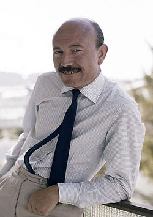

# Armando Trovajoli

## Biografía

Armando Trovaioli, también conocido por Trovajoli (Roma, 2 de septiembre de 1917-Roma, 28 de febrero de 2013),​ fue un músico italiano con unas 200 obras como compositor y director. Fue condecorado con la Orden al Mérito de la República Italiana y ganó el Premio David de Donatello. Se casó en 1962 con la actriz Anna Maria Pierangeli, conocida como Pier Angeli, con quien tuvo un hijo, Howard Andrea; se casó en segundas nupcias en 1970.

## Estilo musical

1 Biografía Cambia la subsección Biografía 1.1 Radio 1.2 Compositor de cine 1.3 Comedia musical 1.4 Actor 1.5 Muerte

Nació en Roma (Italia), el 17 de julio de 1917, y murió en la misma ciudad, el 2 de marzo de 2013. Pianista y compositor fundamental en la comedia italiana, donde incidió de forma versátil en melodías ágiles y divertidas, de contenido romántico, así como en la música popular y en la creación de bellas melodías. Fue especialmente importante en películas de Ettore Scolay trabajó también con directores como Dino Risi o Vittorio De Sica. Nació en Roma (Italia), el 17 de julio de 1917, y murió en la misma ciudad, el 2 de marzo de 2013. Pianista y compositor fundamental en la comedia italiana, donde incidió de forma versátil en melodías ágiles y divertidas, de contenido romántico, así como en la...

## Anécdotas y curiosidades

Armando Trovajoli (también Trovaioli, 2 de septiembre de 1917 – 28 de febrero de 2013) [1] fue un compositor y pianista de cine italiano con más de 300 créditos como compositor y/o director, muchos de ellos partituras de jazz para películas de explotación del género Commedia all'italiana. [ 2 ] Colaboró ​​con Vittorio De Sica en varios proyectos, incluido un segmento de Boccaccio '70. Trovajoli fue también autor de varios musicales italianos: entre ellos, Rugantino y Aggiungi un posto a tavola. [ 3 ]

## Top 10 bandas sonoras

1. ***Il vedovo (Título en España: El Viudo)***
    * **Póster:** [link](032_armando_trovajoli/posters/poster_il_vedovo_1959.jpg)
2. ***I mostri (Título en España: Monstruos de hoy)***
    * **Póster:** [link](032_armando_trovajoli/posters/poster_i_mostri_1963.jpg)
3. ***Boccaccio '70 (Título en España: Boccaccio '70)***
    * **Póster:** [link](032_armando_trovajoli/posters/poster_boccaccio_70_1962.jpg)
4. ***Ieri, oggi, domani (Título en España: Ayer, hoy y mañana)***
    * **Póster:** [link](032_armando_trovajoli/posters/poster_ieri_oggi_domani_1963.jpg)
5. ***Una giornata particolare (Título en España: Una jornada particular)***
    * **Póster:** [link](032_armando_trovajoli/posters/poster_una_giornata_particolare_1977.jpg)
6. ***C'eravamo tanto amati (Título en España: Una mujer y tres hombres)***
    * **Póster:** [link](032_armando_trovajoli/posters/poster_c_eravamo_tanto_amati_1974.jpg)
7. ***Matrimonio all'italiana (Título en España: Matrimonio a la italiana)***
    * **Póster:** [link](032_armando_trovajoli/posters/poster_matrimonio_all_italiana_1964.jpg)
8. ***La ciociara (Título en España: Dos mujeres)***
    * **Póster:** [link](032_armando_trovajoli/posters/poster_la_ciociara_1960.jpg)
9. ***Profumo di donna (Título en España: Perfume de mujer)***
    * **Póster:** [link](032_armando_trovajoli/posters/poster_profumo_di_donna_1974.jpg)
10. ***Che ora è (Título en España: ¿Qué hora es?)***
    * **Póster:** [link](032_armando_trovajoli/posters/poster_che_ora_1989.jpg)

## Filmografía completa

- La tratta delle bianche (Título en España: La trata de blancas) (1952) · [Póster](032_armando_trovajoli/posters/poster_la_tratta_delle_bianche_1952.jpg)
- Era lei che lo voleva! (Título en España: Era lei che lo voleva!) (1953) · [Póster](032_armando_trovajoli/posters/poster_era_lei_che_lo_voleva_1953.jpg)
- Le infedeli (Título en España: Escándalo en Roma - Las infieles) (1953) · [Póster](032_armando_trovajoli/posters/poster_le_infedeli_1953.jpg)
- Il più comico spettacolo del mondo (Título en España: Il più comico spettacolo del mondo) (1953) · [Póster](032_armando_trovajoli/posters/poster_il_pi_comico_spettacolo_del_mondo_1953.jpg)
- Un giorno in pretura (Título en España: Juzgado a la italiana) (1954) · [Póster](032_armando_trovajoli/posters/poster_un_giorno_in_pretura_1954.jpg)
- La donna del fiume (Título en España: La chica del río) (1954) · [Póster](032_armando_trovajoli/posters/poster_la_donna_del_fiume_1954.jpg)
- Due notti con Cleopatra (Título en España: Noches de Cleopatra) (1954) · [Póster](032_armando_trovajoli/posters/poster_due_notti_con_cleopatra_1954.jpg)
- Questa è la vita (Título en España: Questa è la vita) (1954) · [Póster](032_armando_trovajoli/posters/poster_questa_la_vita_1954.jpg)
- Il principe dalla maschera rossa (Título en España: Il principe dalla maschera rossa) (1955) · [Póster](032_armando_trovajoli/posters/poster_il_principe_dalla_maschera_rossa_1955.jpg)
- Il cocco di mamma (Título en España: Il cocco di mamma) (1957) · [Póster](032_armando_trovajoli/posters/poster_il_cocco_di_mamma_1957.jpg)
- Camping (Título en España: Camping) (1958) · [Póster](032_armando_trovajoli/posters/poster_camping_1958.jpg)
- A qualcuna piace calvo (Título en España: A qualcuna piace calvo) (1959) · [Póster](032_armando_trovajoli/posters/poster_a_qualcuna_piace_calvo_1959.jpg)
- Tempi duri per i vampiri (Título en España: Agárrame ese vampiro) (1959) · [Póster](032_armando_trovajoli/posters/poster_tempi_duri_per_i_vampiri_1959.jpg)
- Il vedovo (Título en España: El Viudo) (1959) · [Póster](032_armando_trovajoli/posters/poster_il_vedovo_1959.jpg)
- La cento chilometri (Título en España: La cento chilometri) (1959) · [Póster](032_armando_trovajoli/posters/poster_la_cento_chilometri_1959.jpg)
- Poveri milionari (Título en España: Pobre y millonario) (1959) · [Póster](032_armando_trovajoli/posters/poster_poveri_milionari_1959.jpg)
- Vacanze d'inverno (Título en España: Vacaciones en Cortina D'Ampezzo) (1959) · [Póster](032_armando_trovajoli/posters/poster_vacanze_d_inverno_1959.jpg)
- Anonima cocottes (Título en España: Anonima cocottes) (1960) · [Póster](032_armando_trovajoli/posters/poster_anonima_cocottes_1960.jpg)
- Chiamate 22-22 tenente Sheridan (Título en España: Chiamate 22-22 tenente Sheridan) (1960) · [Póster](032_armando_trovajoli/posters/poster_chiamate_22_22_tenente_sheridan_1960.jpg)
- La ciociara (Título en España: Dos mujeres) (1960) · [Póster](032_armando_trovajoli/posters/poster_la_ciociara_1960.jpg)
- Il carro armato dell'8 settembre (Título en España: Il carro armato dell'8 settembre) (1960) · [Póster](032_armando_trovajoli/posters/poster_il_carro_armato_dell_8_settembre_1960.jpg)
- Il corazziere (Título en España: Il corazziere) (1960) · [Póster](032_armando_trovajoli/posters/poster_il_corazziere_1960.jpg)
- I piaceri dello scapolo (Título en España: Placeres de solteros) (1960) · [Póster](032_armando_trovajoli/posters/poster_i_piaceri_dello_scapolo_1960.jpg)
- Seddok, l'erede di Satana (Título en España: Seddok, l'erede di Satana) (1960) · [Póster](032_armando_trovajoli/posters/poster_seddok_l_erede_di_satana_1960.jpg)
- Un militare e mezzo (Título en España: Un militar y medio) (1960) · [Póster](032_armando_trovajoli/posters/poster_un_militare_e_mezzo_1960.jpg)
- Dieci italiani per un tedesco (Título en España: Dieci italiani per un tedesco) (1961) · [Póster](032_armando_trovajoli/posters/poster_dieci_italiani_per_un_tedesco_1961.jpg)
- Il gigante di Metropolis (Título en España: El gigante de Metrópolis) (1961) · [Póster](032_armando_trovajoli/posters/poster_il_gigante_di_metropolis_1961.jpg)
- Gli attendenti (Título en España: Gli attendenti) (1961) · [Póster](032_armando_trovajoli/posters/poster_gli_attendenti_1961.jpg)
- Ercole al centro della terra (Título en España: Hércules en el centro de la Tierra) (1961) · [Póster](032_armando_trovajoli/posters/poster_ercole_al_centro_della_terra_1961.jpg)
- Il mantenuto (Título en España: Il mantenuto) (1961) · [Póster](032_armando_trovajoli/posters/poster_il_mantenuto_1961.jpg)
- La grande olimpiade (Título en España: La grande olimpiade) (1961) · [Póster](032_armando_trovajoli/posters/poster_la_grande_olimpiade_1961.jpg)
- Maciste, l'uomo più forte del mondo (Título en España: Maciste el invencible) (1961) · [Póster](032_armando_trovajoli/posters/poster_maciste_l_uomo_pi_forte_del_mondo_1961.jpg)
- La ragazza di mille mesi (Título en España: Mauricio y la menor) (1961) · [Póster](032_armando_trovajoli/posters/poster_la_ragazza_di_mille_mesi_1961.jpg)
- Pugni, pupe e marinai (Título en España: Pugni, pupe e marinai) (1961) · [Póster](032_armando_trovajoli/posters/poster_pugni_pupe_e_marinai_1961.jpg)
- Totò, Peppino e la dolce vita (Título en España: Totò, Peppino y la dolce vita) (1961) · [Póster](032_armando_trovajoli/posters/poster_tot_peppino_e_la_dolce_vita_1961.jpg)
- Boccaccio '70 (Título en España: Boccaccio '70) (1962) · [Póster](032_armando_trovajoli/posters/poster_boccaccio_70_1962.jpg)
- I 4 monaci (Título en España: I 4 monaci) (1962) · [Póster](032_armando_trovajoli/posters/poster_i_4_monaci_1962.jpg)
- I pianeti contro di noi (Título en España: I pianeti contro di noi) (1962) · [Póster](032_armando_trovajoli/posters/poster_i_pianeti_contro_di_noi_1962.jpg)
- Il mio amico Benito (Título en España: Il mio amico Benito) (1962) · [Póster](032_armando_trovajoli/posters/poster_il_mio_amico_benito_1962.jpg)
- La guerra continua (Título en España: La guerra continua) (1962) · [Póster](032_armando_trovajoli/posters/poster_la_guerra_continua_1962.jpg)
- Solo contro Roma (Título en España: Solo contra Roma) (1962) · [Póster](032_armando_trovajoli/posters/poster_solo_contro_roma_1962.jpg)
- Totò di notte n. 1 (Título en España: Totò di notte n. 1) (1962) · [Póster](032_armando_trovajoli/posters/poster_tot_di_notte_n_1_1962.jpg)
- Totò e Peppino divisi a Berlino (Título en España: Totò e Peppino divisi a Berlino) (1962) · [Póster](032_armando_trovajoli/posters/poster_tot_e_peppino_divisi_a_berlino_1962.jpg)
- Una domenica d'estate (Título en España: Una domenica d'estate) (1962) · [Póster](032_armando_trovajoli/posters/poster_una_domenica_d_estate_1962.jpg)
- Ieri, oggi, domani (Título en España: Ayer, hoy y mañana) (1963) · [Póster](032_armando_trovajoli/posters/poster_ieri_oggi_domani_1963.jpg)
- Il Monaco di Monza (Título en España: El monje de Monza) (1963) · [Póster](032_armando_trovajoli/posters/poster_il_monaco_di_monza_1963.jpg)
- Gli onorevoli (Título en España: Gli onorevoli) (1963) · [Póster](032_armando_trovajoli/posters/poster_gli_onorevoli_1963.jpg)
- I terribili sette (Título en España: I terribili sette) (1963) · [Póster](032_armando_trovajoli/posters/poster_i_terribili_sette_1963.jpg)
- In Italia si chiama amore (Título en España: In Italia si chiama amore) (1963) · [Póster](032_armando_trovajoli/posters/poster_in_italia_si_chiama_amore_1963.jpg)
- La visita (Título en España: La entrevista (La bella Culandrona)) (1963) · [Póster](032_armando_trovajoli/posters/poster_la_visita_1963.jpg)
- I mostri (Título en España: Monstruos de hoy) (1963) · [Póster](032_armando_trovajoli/posters/poster_i_mostri_1963.jpg)
- Totòsexy (Título en España: Totòsexy) (1963) · [Póster](032_armando_trovajoli/posters/poster_tot_sexy_1963.jpg)
- Alta infedeltà (Título en España: Alta infidelidad) (1964) · [Póster](032_armando_trovajoli/posters/poster_alta_infedelt_1964.jpg)
- Il magnifico cornuto (Título en España: Celos a la italiana) (1964) · [Póster](032_armando_trovajoli/posters/poster_il_magnifico_cornuto_1964.jpg)
- Che fine ha fatto Totò Baby? (Título en España: Che fine ha fatto Totò Baby?) (1964) · [Póster](032_armando_trovajoli/posters/poster_che_fine_ha_fatto_tot_baby_1964.jpg)
- Se permettete parliamo di donne (Título en España: Con su permiso, hablemos de mujeres) (1964) · [Póster](032_armando_trovajoli/posters/poster_se_permettete_parliamo_di_donne_1964.jpg)
- Il giovedì (Título en España: El jueves) (1964) · [Póster](032_armando_trovajoli/posters/poster_il_gioved_1964.jpg)
- Italiani brava gente (Título en España: Italianos buena gente) (1964) · [Póster](032_armando_trovajoli/posters/poster_italiani_brava_gente_1964.jpg)
- La mia signora (Título en España: La mia signora) (1964) · [Póster](032_armando_trovajoli/posters/poster_la_mia_signora_1964.jpg)
- Le Belle Famiglie (Título en España: Le Belle Famiglie) (1964) · [Póster](032_armando_trovajoli/posters/poster_le_belle_famiglie_1964.jpg)
- Matrimonio all'italiana (Título en España: Matrimonio a la italiana) (1964) · [Póster](032_armando_trovajoli/posters/poster_matrimonio_all_italiana_1964.jpg)
- Il gaucho (Título en España: Un italiano en la Argentina) (1964) · [Póster](032_armando_trovajoli/posters/poster_il_gaucho_1964.jpg)
- Casanova '70 (Título en España: Casanova '70) (1965) · [Póster](032_armando_trovajoli/posters/poster_casanova_70_1965.jpg)
- Assassinio made in Italy (Título en España: El secreto de Bill North) (1965) · [Póster](032_armando_trovajoli/posters/poster_assassinio_made_in_italy_1965.jpg)
- Le Bambole (Título en España: Las cuatro muñecas) (1965) · [Póster](032_armando_trovajoli/posters/poster_le_bambole_1965.jpg)
- I complessi (Título en España: Los complejos) (1965) · [Póster](032_armando_trovajoli/posters/poster_i_complessi_1965.jpg)
- Adulterio all'italiana (Título en España: Amistades de mi mujer) (1966) · [Póster](032_armando_trovajoli/posters/poster_adulterio_all_italiana_1966.jpg)
- Operazione San Gennaro (Título en España: Arreglo de cuentas en San Genaro) (1966) · [Póster](032_armando_trovajoli/posters/poster_operazione_san_gennaro_1966.jpg)
- L'arcidiavolo (Título en España: El diablo enamorado) (1966) · [Póster](032_armando_trovajoli/posters/poster_l_arcidiavolo_1966.jpg)
- Il grande colpo dei 7 uomini d'oro (Título en España: Il grande colpo dei 7 uomini d'oro) (1966) · [Póster](032_armando_trovajoli/posters/poster_il_grande_colpo_dei_7_uomini_d_oro_1966.jpg)
- Le fate (Título en España: Las cuatro brujas) (1966) · [Póster](032_armando_trovajoli/posters/poster_le_fate_1966.jpg)
- Le spie amano i fiori (Título en España: Le spie amano i fiori) (1966) · [Póster](032_armando_trovajoli/posters/poster_le_spie_amano_i_fiori_1966.jpg)
- I nostri mariti (Título en España: Ni hablar de los maridos) (1966) · [Póster](032_armando_trovajoli/posters/poster_i_nostri_mariti_1966.jpg)
- Assalto al tesoro di stato (Título en España: Assalto al tesoro di stato) (1967) · [Póster](032_armando_trovajoli/posters/poster_assalto_al_tesoro_di_stato_1967.jpg)
- Col cuore in gola (Título en España: Con el corazón en la garganta) (1967) · [Póster](032_armando_trovajoli/posters/poster_col_cuore_in_gola_1967.jpg)
- Don Giovanni in Sicilia (Título en España: Don Juan en Sicilia) (1967) · [Póster](032_armando_trovajoli/posters/poster_don_giovanni_in_sicilia_1967.jpg)
- I lunghi giorni della vendetta (Título en España: Los largos días de la venganza) (1967) · [Póster](032_armando_trovajoli/posters/poster_i_lunghi_giorni_della_vendetta_1967.jpg)
- Mister Dynamit - Morgen küßt Euch der Tod (Título en España: Mister Dinamita: Mañana os besará la muerte) (1967) · [Póster](032_armando_trovajoli/posters/poster_mister_dynamit_morgen_k_t_euch_der_tod_1967.jpg)
- Le dolci signore (Título en España: Problemas extraconyugales) (1967) · [Póster](032_armando_trovajoli/posters/poster_le_dolci_signore_1967.jpg)
- Straziami ma di baci saziami (Título en España: Abrázame y sáciame de besos) (1968) · [Póster](032_armando_trovajoli/posters/poster_straziami_ma_di_baci_saziami_1968.jpg)
- Acid - Delirio dei sensi (Título en España: Acid - Delirio dei sensi) (1968) · [Póster](032_armando_trovajoli/posters/poster_acid_delirio_dei_sensi_1968.jpg)
- Il marito è mio e l'ammazzo quando mi pare (Título en España: El marido es mío y lo mato cuando me parece) (1968) · [Póster](032_armando_trovajoli/posters/poster_il_marito_mio_e_l_ammazzo_quando_mi_pare_1968.jpg)
- Il Profeta (Título en España: El profeta) (1968) · [Póster](032_armando_trovajoli/posters/poster_il_profeta_1968.jpg)
- Faustina (Título en España: Faustina) (1968) · [Póster](032_armando_trovajoli/posters/poster_faustina_1968.jpg)
- Riusciranno i nostri eroi a ritrovare l'amico misteriosamente scomparso in Africa? (Título en España: Mister Sabatini... Africa... allá vamos) (1968) · [Póster](032_armando_trovajoli/posters/poster_riusciranno_i_nostri_eroi_a_ritrovare_l_amico_misteriosamente_scomparso_in_africa_1968.jpg)
- Rapporto Fuller, base Stoccolma (Título en España: Rapporto Fuller, base Stoccolma) (1968) · [Póster](032_armando_trovajoli/posters/poster_rapporto_fuller_base_stoccolma_1968.jpg)
- Sette volte sette (Título en España: Siete veces siete (7 veces 7)) (1968) · [Póster](032_armando_trovajoli/posters/poster_sette_volte_sette_1968.jpg)
- La matriarca (Título en España: Una viuda desenfrenada) (1968) · [Póster](032_armando_trovajoli/posters/poster_la_matriarca_1968.jpg)
- Come,  quando, perché (Título en España: Come,  quando, perché) (1969) · [Póster](032_armando_trovajoli/posters/poster_come_quando_perch_1969.jpg)
- Dove vai tutta nuda? (Título en España: Dove vai tutta nuda?) (1969) · [Póster](032_armando_trovajoli/posters/poster_dove_vai_tutta_nuda_1969.jpg)
- Il commissario Pepe (Título en España: El comisario y la dolce Vita) (1969) · [Póster](032_armando_trovajoli/posters/poster_il_commissario_pepe_1969.jpg)
- Il giovane normale (Título en España: El joven normal) (1969) · [Póster](032_armando_trovajoli/posters/poster_il_giovane_normale_1969.jpg)
- Nell'anno del Signore (Título en España: El poder no perdona (En el año del Señor)) (1969) · [Póster](032_armando_trovajoli/posters/poster_nell_anno_del_signore_1969.jpg)
- Lovemaker (Título en España: Lovemaker) (1969) · [Póster](032_armando_trovajoli/posters/poster_lovemaker_1969.jpg)
- Vedo nudo (Título en España: Visiones de un italiano moderno) (1969) · [Póster](032_armando_trovajoli/posters/poster_vedo_nudo_1969.jpg)
- Il prete sposato (Título en España: El cura casado) (1970) · [Póster](032_armando_trovajoli/posters/poster_il_prete_sposato_1970.jpg)
- La moglie del prete (Título en España: La mujer del cura) (1970) · [Póster](032_armando_trovajoli/posters/poster_la_moglie_del_prete_1970.jpg)
- Stanza 17-17 palazzo delle tasse, ufficio imposte (Título en España: Buen golpe, muchachos) (1971) · [Póster](032_armando_trovajoli/posters/poster_stanza_17_17_palazzo_delle_tasse_ufficio_imposte_1971.jpg)
- Il vichingo venuto dal sud (Título en España: Cásate con una sueca y verás) (1971) · [Póster](032_armando_trovajoli/posters/poster_il_vichingo_venuto_dal_sud_1971.jpg)
- La controfigura (Título en España: La contrafigura) (1971) · [Póster](032_armando_trovajoli/posters/poster_la_controfigura_1971.jpg)
- Permette? Rocco Papaleo (Título en España: Un italiano en Chicago) (1971) · [Póster](032_armando_trovajoli/posters/poster_permette_rocco_papaleo_1971.jpg)
- The Valachi Papers (Título en España: Los secretos de la Cosa Nostra) (1972) · [Póster](032_armando_trovajoli/posters/poster_the_valachi_papers_1972.jpg)
- La mala ordina (Título en España: Nuestro hombre de Milán) (1972) · [Póster](032_armando_trovajoli/posters/poster_la_mala_ordina_1972.jpg)
- Paolo il caldo (Título en España: Los amores de Paolo) (1973) · [Póster](032_armando_trovajoli/posters/poster_paolo_il_caldo_1973.jpg)
- Rugantino (Título en España: Rugantino) (1973) · [Póster](032_armando_trovajoli/posters/poster_rugantino_1973.jpg)
- Sessomatto (Título en España: Sexo loco) (1973) · [Póster](032_armando_trovajoli/posters/poster_sessomatto_1973.jpg)
- La Tosca (Título en España: Tosca) (1973) · [Póster](032_armando_trovajoli/posters/poster_la_tosca_1973.jpg)
- Di mamma non ce n'è una sola (Título en España: Di mamma non ce n'è una sola) (1974) · [Póster](032_armando_trovajoli/posters/poster_di_mamma_non_ce_n_una_sola_1974.jpg)
- La via dei babbuini (Título en España: La ruta de los babuinos) (1974) · [Póster](032_armando_trovajoli/posters/poster_la_via_dei_babbuini_1974.jpg)
- Profumo di donna (Título en España: Perfume de mujer) (1974) · [Póster](032_armando_trovajoli/posters/poster_profumo_di_donna_1974.jpg)
- C'eravamo tanto amati (Título en España: Una mujer y tres hombres) (1974) · [Póster](032_armando_trovajoli/posters/poster_c_eravamo_tanto_amati_1974.jpg)
- La moglie vergine (Título en España: La esposa virgen) (1975) · [Póster](032_armando_trovajoli/posters/poster_la_moglie_vergine_1975.jpg)
- L'anatra all'arancia (Título en España: Pato a la naranja) (1975) · [Póster](032_armando_trovajoli/posters/poster_l_anatra_all_arancia_1975.jpg)
- Ab morgen sind wir reich und ehrlich (Título en España: Ab morgen sind wir reich und ehrlich) (1976) · [Póster](032_armando_trovajoli/posters/poster_ab_morgen_sind_wir_reich_und_ehrlich_1976.jpg)
- Brutti, sporchi e cattivi (Título en España: Brutos, sucios y malos) (1976) · [Póster](032_armando_trovajoli/posters/poster_brutti_sporchi_e_cattivi_1976.jpg)
- Dimmi che fai tutto per me (Título en España: Dimmi che fai tutto per me) (1976) · [Póster](032_armando_trovajoli/posters/poster_dimmi_che_fai_tutto_per_me_1976.jpg)
- Basta che non si sappia in giro!.. (Título en España: El regodeo) (1976) · [Póster](032_armando_trovajoli/posters/poster_basta_che_non_si_sappia_in_giro_1976.jpg)
- Una Magnum Special per Tony Saitta (Título en España: Escándalo en la residencia) (1976) · [Póster](032_armando_trovajoli/posters/poster_una_magnum_special_per_tony_saitta_1976.jpg)
- Telefoni bianchi (Título en España: La carrera de una doncella) (1976) · [Póster](032_armando_trovajoli/posters/poster_telefoni_bianchi_1976.jpg)
- Luna di miele in tre (Título en España: Luna de miel a tres) (1976) · [Póster](032_armando_trovajoli/posters/poster_luna_di_miele_in_tre_1976.jpg)
- In nome del Papa re (Título en España: En nombre del papa rey) (1977) · [Póster](032_armando_trovajoli/posters/poster_in_nome_del_papa_re_1977.jpg)
- Mogliamante (Título en España: Esposa amante) (1977) · [Póster](032_armando_trovajoli/posters/poster_mogliamante_1977.jpg)
- La stanza del vescovo (Título en España: La alcoba del obispo) (1977) · [Póster](032_armando_trovajoli/posters/poster_la_stanza_del_vescovo_1977.jpg)
- Una giornata particolare (Título en España: Una jornada particular) (1977) · [Póster](032_armando_trovajoli/posters/poster_una_giornata_particolare_1977.jpg)
- I nuovi mostri (Título en España: ¡Que viva Italia!) (1977) · [Póster](032_armando_trovajoli/posters/poster_i_nuovi_mostri_1977.jpg)
- Amori miei (Título en España: Mis maridos y yo) (1978) · [Póster](032_armando_trovajoli/posters/poster_amori_miei_1978.jpg)
- Dottor Jekyll e gentile signora (Título en España: Al doctor Jeckyll le gustan calientes) (1979) · [Póster](032_armando_trovajoli/posters/poster_dottor_jekyll_e_gentile_signora_1979.jpg)
- La vita è bella (Título en España: Consigna: amor y libertad) (1979) · [Póster](032_armando_trovajoli/posters/poster_la_vita_bella_1979.jpg)
- Arrivano i bersaglieri (Título en España: Arrivano i bersaglieri) (1980) · [Póster](032_armando_trovajoli/posters/poster_arrivano_i_bersaglieri_1980.jpg)
- La amante ingenua (Título en España: La amante ingenua) (1980) · [Póster](032_armando_trovajoli/posters/poster_la_amante_ingenua_1980.jpg)
- La terrazza (Título en España: La terraza) (1980) · [Póster](032_armando_trovajoli/posters/poster_la_terrazza_1980.jpg)
- Passione d'amore (Título en España: Entre el amor y la muerte) (1981) · [Póster](032_armando_trovajoli/posters/poster_passione_d_amore_1981.jpg)
- Il conte Tacchia (Título en España: Il conte Tacchia) (1982) · [Póster](032_armando_trovajoli/posters/poster_il_conte_tacchia_1982.jpg)
- Grand Hotel Excelsior (Título en España: Jaleo en el Hotel Excelsior) (1982) · [Póster](032_armando_trovajoli/posters/poster_grand_hotel_excelsior_1982.jpg)
- La Nuit de Varennes (Título en España: La noche de Varennes) (1982) · [Póster](032_armando_trovajoli/posters/poster_la_nuit_de_varennes_1982.jpg)
- Plus beau que moi tu meurs (Título en España: Plus beau que moi tu meurs) (1982) · [Póster](032_armando_trovajoli/posters/poster_plus_beau_que_moi_tu_meurs_1982.jpg)
- Viuuulentemente mia (Título en España: Viuuulentemente mia) (1982) · [Póster](032_armando_trovajoli/posters/poster_viuuulentemente_mia_1982.jpg)
- سراب (Título en España: سراب) (1982) · [Póster](032_armando_trovajoli/posters/poster_poster_1982.jpg)
- Sing Sing (Título en España: Sing Sing) (1983) · [Póster](032_armando_trovajoli/posters/poster_sing_sing_1983.jpg)
- Frankenstein 90 (Título en España: Frankenstein, mi amor) (1984) · [Póster](032_armando_trovajoli/posters/poster_frankenstein_90_1984.jpg)
- Maccheroni (Título en España: Macarrones) (1985) · [Póster](032_armando_trovajoli/posters/poster_maccheroni_1985.jpg)
- La famiglia (Título en España: La familia) (1987) · [Póster](032_armando_trovajoli/posters/poster_la_famiglia_1987.jpg)
- I giorni del commissario Ambrosio (Título en España: I giorni del commissario Ambrosio) (1988) · [Póster](032_armando_trovajoli/posters/poster_i_giorni_del_commissario_ambrosio_1988.jpg)
- Miss Arizona (Título en España: Miss Arizona) (1988) · [Póster](032_armando_trovajoli/posters/poster_miss_arizona_1988.jpg)
- Che ora è (Título en España: ¿Qué hora es?) (1989) · [Póster](032_armando_trovajoli/posters/poster_che_ora_1989.jpg)
- Il viaggio di Capitan Fracassa (Título en España: El viaje del capitán Fracassa) (1990) · [Póster](032_armando_trovajoli/posters/poster_il_viaggio_di_capitan_fracassa_1990.jpg)
- Centro storico (Título en España: Centro storico) (1992) · [Póster](032_armando_trovajoli/posters/poster_centro_storico_1992.jpg)
- Cinecittà Cinecittà (Título en España: Cinecittà Cinecittà) (1992) · [Póster](032_armando_trovajoli/posters/poster_cinecitt_cinecitt_1992.jpg)
- Gangsters (Título en España: Gangsters) (1992) · [Póster](032_armando_trovajoli/posters/poster_gangsters_1992.jpg)
- Berlin '39 (Título en España: Berlin '39) (1993) · [Póster](032_armando_trovajoli/posters/poster_berlin_39_1993.jpg)
- Mario, Maria e Mario (Título en España: Mario, María y Mario) (1993) · [Póster](032_armando_trovajoli/posters/poster_mario_maria_e_mario_1993.jpg)
- Romanzo di un giovane povero (Título en España: Historia de un pobre hombre) (1995) · [Póster](032_armando_trovajoli/posters/poster_romanzo_di_un_giovane_povero_1995.jpg)
- Marcello Mastroianni - Mi ricordo, sì, io mi ricordo (Título en España: Marcello Mastroianni: mi ricordo, sì, io mi ricordo) (1997) · [Póster](032_armando_trovajoli/posters/poster_marcello_mastroianni_mi_ricordo_s_io_mi_ricordo_1997.jpg)
- Rugantino (Título en España: Rugantino) (1998) · [Póster](032_armando_trovajoli/posters/poster_rugantino_1998.jpg)
- Concorrenza sleale (Título en España: Competencia desleal) (2001) · [Póster](032_armando_trovajoli/posters/poster_concorrenza_sleale_2001.jpg)
- Gente di Roma (Título en España: Gente de Roma) (2003) · [Póster](032_armando_trovajoli/posters/poster_gente_di_roma_2003.jpg)
- La notte di Pasquino (Título en España: La notte di Pasquino) (2003) · [Póster](032_armando_trovajoli/posters/poster_la_notte_di_pasquino_2003.jpg)
- Marcello, una vita dolce (Título en España: Marcello, una vita dolce) (2006) · [Póster](032_armando_trovajoli/posters/poster_marcello_una_vita_dolce_2006.jpg)
- L'ultimo gattopardo - Ritratto di Goffredo Lombardo (Título en España: L'ultimo gattopardo - Ritratto di Goffredo Lombardo) (2010) · [Póster](032_armando_trovajoli/posters/poster_l_ultimo_gattopardo_ritratto_di_goffredo_lombardo_2010.jpg)

## Premios y nominaciones

* Caballero Gran Cruz de la Orden del Mérito de la República Italiana – (Ganador)
* Ciak d'oro - mejor banda sonora – (Ganador)
* Cinta de plata a la mejor puntuación – (Ganador)
* David di Donatello a la mejor música – (Ganador)
* Globo d'oro por Livetime Achievement – (Ganador)
* Premio David di Donatello a la trayectoria – (Ganador)
* Premio Nastro d'Argento a la Trayectoria – (Ganador)
* Q3772368 – (Ganador)

## Fuentes adicionales

* [MundoBSO](https://www.mundobso.com/compositor/trovajoli-armando) — site:mundobso.com
* [MundoBSO (2)](https://www.mundobso.com/bso/frozen-el-reino-del-hielo) — site:mundobso.com
* [MundoBSO (3)](https://w.mundobso.com/bso/cartero-siempre-llama-dos-veces-el) — site:mundobso.com
* [Film Score Monthly](https://www.filmscoremonthly.com/board/posts.cfm?pageID=1&forumID=1&threadID=116690&archive=0) — site:filmscoremonthly.com
* [Film Score Monthly (2)](https://www.filmscoremonthly.com/daily/article.cfm/articleID/8337/Film-Score-Friday-5225/) — site:filmscoremonthly.com
* [Film Score Monthly (3)](https://www.filmscoremonthly.com/daily/article.cfm/articleID/8263/Film-Score-Friday-83024/) — site:filmscoremonthly.com
* [SoundtrackCollector](https://www.soundtrackcollector.com/catalog/composerdiscography.php?composerid=2053&offset=400) — site:soundtrackcollector.com
* [SoundtrackCollector (2)](https://www.soundtrackcollector.com/title/11033/Arcidiavolo,+L') — site:soundtrackcollector.com
* [SoundtrackCollector (3)](https://www.soundtrackcollector.com/title/72360/Musica+Di+Armando+Trovaioli+Per+Il+Cinema+Di+Ettore+Scola,+La) — site:soundtrackcollector.com
* [WhatSong](https://www.whatsong.org/movie/kill-bill-vol-1) — site:whatsong.org
* [WhatSong (2)](https://www.whatsong.org/tvshow/supernatural/episode/3659) — site:whatsong.org
* [WhatSong (3)](https://www.whatsong.org/tvshow/prison-break/episode/37396) — site:whatsong.org

## Notas externas

* MundoBSO: Nació en Roma (Italia), el 17 de julio de 1917, y murió en la misma ciudad, el 2 de marzo de 2013. Pianista y compositor fundamental en la comedia italiana, donde incidió de forma versátil en melodías ágiles y divertidas, de contenido romántico, así como en la música popular y en la creación de bellas melodías. Fue especialmente importante en películas de Ettore Scolay trabajó también con directores como Dino Risi o Vittorio De Sica. Nació en Roma (Italia), el 17 de julio de 1917, y murió en la misma ciudad, el 2 de marzo de 2013. Pianista y compositor fundamental en la comedia italiana, donde incidió de forma versátil en melodías ágiles y divertidas, de contenido romántico, así como en la...
* MundoBSO (2): Compositores: Beck, Christophe | Lopez, Robert Sello: Disney Duración: 98 minutos Título original: Frozen Director: Chris Buck, Jennifer Lee Nacionalidad: EE UU Año: 2013
* WhatSong: Vivica Fox abre la puerta y "La novia" está del otro lado Nancy Sinatra - Kill Bill, Vol. 1 (banda sonora original)
* WhatSong (2): Sam y Dean cortan leña para una pira funeraria mientras recuerdan su tiempo con Charlie. La mejor fuente en línea de música de películas y televisión. Copyright © 2018 - 2026 Whatsong.org. Reservados todos los derechos.
* WhatSong (3): Ramin Djawadi - Prison Break: Temporadas 3 y 4 (Banda sonora original de televisión) Ramin Djawadi - Prison Break: Temporadas 3 y 4 (Banda sonora original de televisión)
* armandotrovajoli.bandcamp.com: + agregar álbum pista merchandising fiesta de escucha nuevo artista artista existente × Ver todos los resultados No hay resultados que coincidan Pruebe con un filtro diferente o una nueva palabra clave de búsqueda. Buscar todos los artistas, pistas y álbumes de Bandcamp cancelar
* music.apple.com: 28 de agosto de 2007 20 canciones, 1 hora y 2 minutos â 2013 Bacci Bros Records The Libertine (banda sonora original de la película) The Libertine (banda sonora original de la película) 1968
* www.trovajoli.it: Pianista, compositor y director de orquesta italiano, fue iniciado en la música a temprana edad por su padre violinista. A los seis años comienza a estudiar música y piano. Desde muy joven comienza su actividad en discotecas. Después de una larga pausa debido a la guerra (militar en Albania y Grecia), bajo la dirección de Libero Barni se licenció en piano en el Conservatorio Santa Cecilia de Roma en 1948. Estudia composición con Angelo Francesco Lavagnino, de quien se convertirá en un amigo fraternal: colaborando con él y siguiéndolo en la Accademia Chigiana de Siena, aprende los secretos de la técnica cinematográfica.
* music.apple.com: Soñando despierto con Armando Trovajoli (banda sonora original) L'amore dice Ciao (Slow Take) [feat. Andee Silver] [2022 Remastered] The Libertine (Banda sonora original de la película) [2022 Remastered]â·â1968
* westernsallitaliana.blogspot.com: TROVAJOLI, Armando (alias Roman Vatro) [9/2/1917, Roma, Lazio, Italia - 2/2?/2013, Roma, Lazio, Italia] – compositor, director de orquesta, compositor, músico (violín, piano), actor, padre de Graziella Trovajoli [1939- ] con?, Marina Trovajoli [1954-2000] con Silvana Puntieri, padre de Maurizio Trovajoli [1960- ] con Mirella Pettinari, casado con la actriz y cantante Pier Angeli (Anna Maria Pierangeli) [1932-1971], (1962-1969) padre de Howard Andrew Rugantino [1963- ], casado con Maria Paola Sapienza (1972-2013) padre de Piergiorgio Trovaioli [197?- ]. Cómics occidentales europeos ~ Aventuras de práctica...
* www.patriziolongo.com: Tuvimos el honor y el placer de conocer a un gran compositor, el Maestro Armando Trovajoli. Roma no se hace la tonta esta noche, Rugantino y Che m'è mpara a ffa' canción escrita para Sofia Loren. Sólo algunas de las composiciones famosas. Apasionado del Jazz y uno de los pioneros del género en proponerlo en Italia.
* snapshot.apple.com: Tienda Mac iPad iPhone Watch Vision AirPods TV y entretenimiento en el hogar Accesorios Soporte Armando Trovajoli fue un compositor italiano. Compuso y/o dirigió más de 300 bandas sonoras de películas, incluidas partituras de jazz, y lanzó los álbumes Profumo di donna y The Libertine. Sus canciones más populares incluyen L'amore Dice Ciao (títulos principales) y Che Vuole Questa Musica Stasera. Trovajoli también apareció en la película Ayer, hoy y mañana junto a Sophia Loren. Falleció en Roma a la edad de 95 años en 2013.
