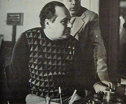

# Nino Oliviero

## Biografía

Bruno Nicolai (Roma, 26 de mayo de 1926 - Roma, 16 de agosto de 1991) fue un compositor y director de orquesta italiano. Fue notable su actividad en el campo de la música cinematográfica, componiendo cerca de ochenta bandas sonoras.​ Amigo y colaborador del también compositor Ennio Morricone, realizó los arreglos y dirigió bastantes de las bandas sonoras compuestas por este.

## Estilo musical

Sam y Dean cortan leña para una pira funeraria mientras recuerdan su tiempo con Charlie. La mejor fuente en línea de música de películas y televisión. Copyright © 2018 - 2026 Whatsong.org. Reservados todos los derechos.

## Anécdotas y curiosidades

Compositor: Julià, Roger Sello: Propaganda pel Fet! Duración: 33 minutos Información de la película Título original: Fènix 11·23 Director: Joel Joan, Sergi Lara Nacionalidad: España Año: 2011 Argumento Un joven crea una web para defender la lengua catalana. Una noche, la brigada antiterrorista irrumpe en su casa y lo acusa de terrorismo informático por haber enviadp un e-mail a una cadena de supermercados pidiendo el etiquetaje en catalán. Compositor: Julià, Roger Sello: Propaganda pel Fet! Duración: 33 minutos

## Top 10 bandas sonoras

1. ***A Matter of Time (Título en España: Nina)***
    * **Póster:** [link](033_nino_oliviero/posters/poster_a_matter_of_time_1976.jpg)
2. ***Uomini e nobiluomini (Título en España: Uomini e nobiluomini)***
    * **Póster:** [link](033_nino_oliviero/posters/poster_uomini_e_nobiluomini_1959.jpg)
3. ***Mondo cane n. 2 (Título en España: Mondo cane n. 2)***
    * **Póster:** [link](033_nino_oliviero/posters/poster_mondo_cane_n_2_1963.jpg)
4. ***Ringo del Nebraska (Título en España: Ringo de Nebraska)***
    * **Póster:** [link](033_nino_oliviero/posters/poster_ringo_del_nebraska_1966.jpg)
5. ***Una moglie americana (Título en España: Una moglie americana)***
    * **Póster:** [link](033_nino_oliviero/posters/poster_una_moglie_americana_1965.jpg)
6. ***La donna nel mondo (Título en España: La donna nel mondo)***
    * **Póster:** [link](033_nino_oliviero/posters/poster_la_donna_nel_mondo_1963.jpg)
7. ***La moglie giapponese (Título en España: La moglie giapponese)***
    * **Póster:** [link](033_nino_oliviero/posters/poster_la_moglie_giapponese_1968.jpg)
8. ***Il pelo nel mondo (Título en España: Il pelo nel mondo)***
    * **Póster:** [link](033_nino_oliviero/posters/poster_il_pelo_nel_mondo_1964.jpg)
9. ***Canzone appassionata (Título en España: Canzone appassionata)***
    * **Póster:** [link](033_nino_oliviero/posters/poster_canzone_appassionata_1953.jpg)
10. ***Odio mortale (Título en España: Odio mortale)***
    * **Póster:** [link](033_nino_oliviero/posters/poster_odio_mortale_1962.jpg)

## Filmografía completa

- Canzone appassionata (Título en España: Canzone appassionata) (1953) · [Póster](033_nino_oliviero/posters/poster_canzone_appassionata_1953.jpg)
- Cento serenate (Título en España: Cento serenate) (1954) · [Póster](033_nino_oliviero/posters/poster_cento_serenate_1954.jpg)
- Uomini e nobiluomini (Título en España: Uomini e nobiluomini) (1959) · [Póster](033_nino_oliviero/posters/poster_uomini_e_nobiluomini_1959.jpg)
- Odio mortale (Título en España: Odio mortale) (1962) · [Póster](033_nino_oliviero/posters/poster_odio_mortale_1962.jpg)
- La donna nel mondo (Título en España: La donna nel mondo) (1963) · [Póster](033_nino_oliviero/posters/poster_la_donna_nel_mondo_1963.jpg)
- Mondo cane n. 2 (Título en España: Mondo cane n. 2) (1963) · [Póster](033_nino_oliviero/posters/poster_mondo_cane_n_2_1963.jpg)
- Il pelo nel mondo (Título en España: Il pelo nel mondo) (1964) · [Póster](033_nino_oliviero/posters/poster_il_pelo_nel_mondo_1964.jpg)
- Una moglie americana (Título en España: Una moglie americana) (1965) · [Póster](033_nino_oliviero/posters/poster_una_moglie_americana_1965.jpg)
- Ringo del Nebraska (Título en España: Ringo de Nebraska) (1966) · [Póster](033_nino_oliviero/posters/poster_ringo_del_nebraska_1966.jpg)
- La moglie giapponese (Título en España: La moglie giapponese) (1968) · [Póster](033_nino_oliviero/posters/poster_la_moglie_giapponese_1968.jpg)
- A Matter of Time (Título en España: Nina) (1976) · [Póster](033_nino_oliviero/posters/poster_a_matter_of_time_1976.jpg)

## Premios y nominaciones

* 1964 – Premio de la Academia a la mejor canción original – por *More (Título en España: More)* – (Nominación)

## Fuentes adicionales

* [MundoBSO](https://w.mundobso.com/bso/cartero-siempre-llama-dos-veces-el) — site:mundobso.com
* [MundoBSO (2)](https://www.mundobso.com/bso/fenix-1123) — site:mundobso.com
* [MundoBSO (3)](https://www.mundobso.com/bso/capitan-america-civil-war) — site:mundobso.com
* [Film Score Monthly](https://www.filmscoremonthly.com/board/posts.cfm?threadID=101849) — site:filmscoremonthly.com
* [Film Score Monthly (2)](https://www.filmscoremonthly.com/messages/index.cfm) — site:filmscoremonthly.com
* [Film Score Monthly (3)](https://www.filmscoremonthly.com/board/threads.cfm) — site:filmscoremonthly.com
* [SoundtrackCollector](https://www.soundtrackcollector.com/composer/1751/Nino+Oliviero) — site:soundtrackcollector.com
* [SoundtrackCollector (2)](https://www.soundtrackcollector.com/title/36438/Mondo+Cane+2) — site:soundtrackcollector.com
* [SoundtrackCollector (3)](https://www.soundtrackcollector.com/title/7782/Mondo+Cane) — site:soundtrackcollector.com
* [WhatSong](https://www.whatsong.org/tvshow/supernatural/episode/3659) — site:whatsong.org
* [WhatSong (2)](https://whatsong.org) — site:whatsong.org
* [WhatSong (3)](https://whatsong.org) — site:whatsong.org

## Notas externas

* MundoBSO (2): Compositor: Julià, Roger Sello: Propaganda pel Fet! Duración: 33 minutos Información de la película Título original: Fènix 11·23 Director: Joel Joan, Sergi Lara Nacionalidad: España Año: 2011 Argumento Un joven crea una web para defender la lengua catalana. Una noche, la brigada antiterrorista irrumpe en su casa y lo acusa de terrorismo informático por haber enviadp un e-mail a una cadena de supermercados pidiendo el etiquetaje en catalán. Compositor: Julià, Roger Sello: Propaganda pel Fet! Duración: 33 minutos
* MundoBSO (3): Compositor: Jackman, Henry Sello: Hollywood Duración: 69 minutos Información de la película Título original: Captain America: Civil War Director: Anthony Russo, Joe Russo Nacionalidad: EE UU Año: 2016 Argumento Continuación de Captain America: The Winter Soldier (14). Cuando otro incidente internacional involucra a Los Vengadores y causan varios daños colaterales, aumentan las presiones políticas para exigir más responsabilidades y determinar cuándo deben contratar los servicios del grupo de superhéroes. Esta nueva situación dividirá a Los Vengadores, mientras intentan proteger al mundo de un nuevo y terrible villano. Compositor: Jackman, Henry Sello: Hollywood Duración: 69 minutos
* SoundtrackCollector (2): Mondo Cane No. 2 (1970, Estados Unidos, título de reedición)
* WhatSong: Sam y Dean cortan leña para una pira funeraria mientras recuerdan su tiempo con Charlie. La mejor fuente en línea de música de películas y televisión. Copyright © 2018 - 2026 Whatsong.org. Reservados todos los derechos.
* camsugarmusic.com: La banda sonora del documental de culto de 1962, dirigido por Paolo Cavara, Gualtiero Jacopetti y Franco Prosperi. Esta película obtuvo un gran éxito internacional, ganó premios en el 15º Festival de Cine de Cannes y a menudo se la considera la película que dio vida real a la corriente cinematográfica de los documentales sensacionalistas, denominada Mondo-Movie. La banda sonora también tiene seguidores de culto, influencias innovadoras y modernas, que van desde el jazz hasta lo exótico. Ganó un Grammy y fue nominado al Oscar en 1963. La partitura ha sido cuidadosamente restaurada y remasterizada a partir de las cintas maestras originales de los archivos de CAM Sugar. Este lanzamiento se presenta con la obra de arte original y auténtica y se fabrica en...
* www.astrocampania.it: Registro de asociaciones Convenciones de asociaciones Hermanamiento Sky 01-enero 02-febrero 03-marzo 04-abril 05-mayo 06-junio 07-julio 08-agosto 09-septiembre 10-octubre 11-noviembre 12-diciembre
* www.timba.com: Entrar · Contraseña olvidada? Reenviar email de activación grupos: Changüí de Guantánamo, El Siboney, Septeto Jóvenes del Guaso
* store.jazzecho.de: Hasta nuevo aviso no aceptamos pedidos para entregas a: Rusia, Bielorrusia, Ucrania, Irán, Corea del Norte, Siria, Cuba. Los costes de envío fuera de la UE, incluidos los posibles derechos de aduana, correrán a cargo del cliente.
* www.horsemagazine.com: Directorios Directorio de semen congelado Criadores de salto Criadores de doma Directorio veterinario Directorio de instructores Hecho en Australia Nuno visitó Australia en los años 80, ¿han cambiado los problemas y las discusiones? Este artículo apareció en The Horse Magazine en 1984.
* www.lacagninaoliviero.com: © 2023 por Músico Clásico. Reservados todos los derechos.
* resendesmusic.net: Piezas de Marcha CANADIANA Serie de Bandas de Marcha Marchas – Estilo Tradicional Marcha Procesional Piezas de Concierto Piezas de Concierto Fantasías Latinas Pasodobles
* www.muziekweb.nl: Explorar Colecciones especiales Lista de reproducción Intros Buscar portada Géneros musicales Popular Clásica Jazz Países del mundo
