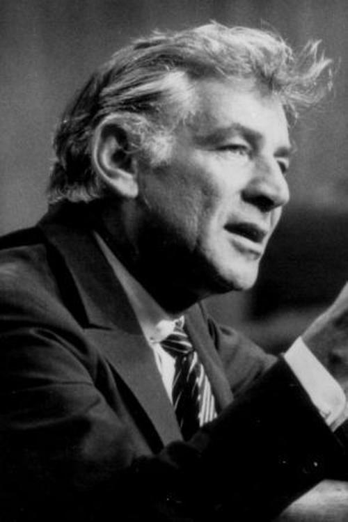

# Leonard Bernstein

## Biografía

Leonard Bernstein (BURN-styne; nacido Louis Bernstein; 25 de agosto de 1918 - 14 de octubre de 1990) fue un director, compositor, pianista, educador musical, autor y humanitario estadounidense. Considerado uno de los directores más importantes de su tiempo, fue el primer director nacido en Estados Unidos en recibir reconocimiento internacional. Bernstein fue "uno de los músicos más prodigiosamente talentosos y exitosos de la historia de Estados Unidos", según el crítico musical Donal Henahan. Los honores y reconocimientos de Bernstein incluyen siete premios Emmy, dos premios Tony y 16 premios Grammy (incluido el Lifetime Achievement Award), así como una nominación al Oscar. Recibió el Kennedy Center Honor en 1981. Como compositor, Bernstein escribió en muchos géneros, incluida música sinfónica y orquestal, ballet, música cinematográfica y teatral, obras corales, ópera, música de cámara y piezas para piano. Las obras de Bernstein incluyen el musical de Broadway West Side Story, que se sigue representando regularmente en todo el mundo y se ha adaptado a dos largometrajes (1961 y 2021), así como a tres sinfonías, Serenade (after Platón's Symposium) (1954) y Chichester Psalms (1965), la partitura original de On the Waterfront (1954) de Elia Kazan y obras de teatro como On the Town (1944), Wonderful. Town (1953), Candide (1956) y su Misa (1971). Bernstein fue el primer director nacido en Estados Unidos en dirigir una importante orquesta sinfónica estadounidense. Fue director musical de la Filarmónica de Nueva York y dirigió las principales orquestas del mundo, generando un legado de grabaciones de audio y video. Bernstein también fue una figura crítica en el resurgimiento moderno de la música de Gustav Mahler, en cuya música estaba más interesado. Bernstein, un hábil pianista, solía dirigir conciertos para piano desde el teclado. Compartió y exploró la música clásica en televisión con una audiencia masiva en transmisiones nacionales e internacionales, incluidos los Conciertos para Jóvenes con la Filarmónica de Nueva York. Bernstein trabajó en apoyo de los derechos civiles; protestó contra la guerra de Vietnam; abogó por el desarme nuclear; recaudó dinero para la investigación y concientización sobre el VIH/SIDA; defendió a Janis Ian a los 15 años y su canción sobre el amor interracial, "Society's Child", en su programa de televisión CBS; y participó en múltiples iniciativas internacionales en favor de los derechos humanos y la paz mundial. Dirigió la Sinfonía de la Resurrección de Mahler para conmemorar la muerte del presidente John F. Kennedy, y en Israel en un concierto, Hatikvah en el Monte Scopus, después de la Guerra de los Seis Días. La secuencia de hechos fue registrada para un documental titulado Viaje a Jerusalén. Bernstein era miembro del comité ejecutivo de Escritores y Artistas por la Paz en Medio Oriente, un grupo proisraelí. El día de Navidad de 1989, Bernstein dirigió una interpretación de la Sinfonía n.º 9 de Beethoven en Berlín para celebrar la caída del Muro de Berlín. Menos de un año después, en octubre de 1990, murió de un ataque cardíaco en Nueva York, a los 72 años.

## Estilo musical

4 Principales obras con fechas de estreno Alternar subsección Principales obras con fechas de estreno 4.1 Obras para el teatro 4.2 Obras orquestales 4.3 Música coral para iglesia o sinagoga 4.4 Música de cámara 4.5 Música vocal 4.6 Otros géneros 4.7 Bibliografía

## Anécdotas y curiosidades

2 Alternar carrera Subsección de carrera 2.1 Década de 1940: ascenso a la prominencia 2.1.1 Debut como directora de la Filarmónica de Nueva York 2.1.2 Orquesta Filarmónica de Israel, debut televisivo y Tanglewood 2.2 Década de 1950: expansión profesional y West Side Story 2.3 Década de 1960: Innovaciones y Lincoln Center 2.4 Década de 1970: Mass, Dybbuk y reconocimiento internacional 2.5 Década de 1980: Un lugar tranquilo y Tanglewood

## Top 10 bandas sonoras

1. ***On the Waterfront (Título en España: La ley del silencio)***
    * **Póster:** [link](034_leonard_bernstein/posters/poster_on_the_waterfront_1954.jpg)
2. ***West Side Story (Título en España: West Side Story (Amor sin barreras))***
    * **Póster:** [link](034_leonard_bernstein/posters/poster_west_side_story_1961.jpg)
3. ***Candide (Título en España: Candide)***
    * **Póster:** [link](034_leonard_bernstein/posters/poster_candide_1991.jpg)
4. ***The Only Girl in the Orchestra (Título en España: La única mujer de la orquesta)***
    * **Póster:** [link](034_leonard_bernstein/posters/poster_the_only_girl_in_the_orchestra_2023.jpg)
5. ***Leonard Bernstein Conducts West Side Story (Título en España: Leonard Bernstein Conducts West Side Story)***
    * **Póster:** [link](034_leonard_bernstein/posters/poster_leonard_bernstein_conducts_west_side_story_1985.jpg)
6. ***Beatles '64 (Título en España: Beatles '64)***
    * **Póster:** [link](034_leonard_bernstein/posters/poster_beatles_64_2024.jpg)
7. ***Night of 100 Stars II (Título en España: Night of 100 Stars II)***
    * **Póster:** [link](034_leonard_bernstein/posters/poster_night_of_100_stars_ii_1985.jpg)
8. ***Beethoven Fidelio (Título en España: Beethoven Fidelio)***
    * **Póster:** [link](034_leonard_bernstein/posters/poster_beethoven_fidelio_1978.jpg)
9. ***Mahler - Symphonies Nos. 4, 5 & 6 (Título en España: Mahler - Symphonies Nos. 4, 5 & 6)***
    * **Póster:** [link](034_leonard_bernstein/posters/poster_mahler_symphonies_nos_4_5_6_1976.jpg)
10. ***King: A Filmed Record... Montgomery to Memphis (Título en España: King: A Filmed Record... Montgomery to Memphis)***
    * **Póster:** [link](034_leonard_bernstein/posters/poster_king_a_filmed_record_montgomery_to_memphis_1970.jpg)

## Filmografía completa

- On the Waterfront (Título en España: La ley del silencio) (1954) · [Póster](034_leonard_bernstein/posters/poster_on_the_waterfront_1954.jpg)
- Satchmo the Great (Título en España: Satchmo the Great) (1957) · [Póster](034_leonard_bernstein/posters/poster_satchmo_the_great_1957.jpg)
- The Lark (Título en España: The Lark) (1957) · [Póster](034_leonard_bernstein/posters/poster_the_lark_1957.jpg)
- The Creative Performer (Título en España: The Creative Performer) (1960) · [Póster](034_leonard_bernstein/posters/poster_the_creative_performer_1960.jpg)
- West Side Story (Título en España: West Side Story (Amor sin barreras)) (1961) · [Póster](034_leonard_bernstein/posters/poster_west_side_story_1961.jpg)
- Man of Three Worlds: Luchino Visconti (Título en España: Man of Three Worlds: Luchino Visconti) (1966) · [Póster](034_leonard_bernstein/posters/poster_man_of_three_worlds_luchino_visconti_1966.jpg)
- Inside Pop: The Rock Revolution (Título en España: Inside Pop: The Rock Revolution) (1967) · [Póster](034_leonard_bernstein/posters/poster_inside_pop_the_rock_revolution_1967.jpg)
- Beethoven's Birthday: A Celebration in Vienna with Leonard Bernstein (Título en España: Beethoven's Birthday: A Celebration in Vienna with Leonard Bernstein) (1970) · [Póster](034_leonard_bernstein/posters/poster_beethoven_s_birthday_a_celebration_in_vienna_with_leonard_bernstein_1970.jpg)
- Bernstein In Vienna: Beethoven, Piano Concerto No. 1 in C Major (Título en España: Bernstein In Vienna: Beethoven, Piano Concerto No. 1 in C Major) (1970) · [Póster](034_leonard_bernstein/posters/poster_bernstein_in_vienna_beethoven_piano_concerto_no_1_in_c_major_1970.jpg)
- Bernstein in Vienna: Beethoven, The Ninth Symphony (Título en España: Bernstein in Vienna: Beethoven, The Ninth Symphony) (1970) · [Póster](034_leonard_bernstein/posters/poster_bernstein_in_vienna_beethoven_the_ninth_symphony_1970.jpg)
- King: A Filmed Record... Montgomery to Memphis (Título en España: King: A Filmed Record... Montgomery to Memphis) (1970) · [Póster](034_leonard_bernstein/posters/poster_king_a_filmed_record_montgomery_to_memphis_1970.jpg)
- Das Lied von der Erde: A Personal Introduction (Título en España: Das Lied von der Erde: A Personal Introduction) (1972) · [Póster](034_leonard_bernstein/posters/poster_das_lied_von_der_erde_a_personal_introduction_1972.jpg)
- Mahler - Symphonies Nos. 1, 2 & 3 (Título en España: Mahler - Symphonies Nos. 1, 2 & 3) (1973) · [Póster](034_leonard_bernstein/posters/poster_mahler_symphonies_nos_1_2_3_1973.jpg)
- Symphony No. 2 in C Minor, “Resurrection” – Leonard Bernstein – Ely Cathedral (Título en España: Symphony No. 2 in C Minor, “Resurrection” – Leonard Bernstein – Ely Cathedral) (1973) · [Póster](034_leonard_bernstein/posters/poster_symphony_no_2_in_c_minor_resurrection_leonard_bernstein_ely_cathedral_1973.jpg)
- Bernstein: Tchaikovsky: Symphonies No. 4 & 5 (Título en España: Bernstein: Tchaikovsky: Symphonies No. 4 & 5) (1975) · [Póster](034_leonard_bernstein/posters/poster_bernstein_tchaikovsky_symphonies_no_4_5_1975.jpg)
- Mahler - Symphonies Nos. 7 & 8 (Título en España: Mahler - Symphonies Nos. 7 & 8) (1975) · [Póster](034_leonard_bernstein/posters/poster_mahler_symphonies_nos_7_8_1975.jpg)
- Bernstein Gerhswin & Ives (Título en España: Bernstein Gerhswin & Ives) (1976) · [Póster](034_leonard_bernstein/posters/poster_bernstein_gerhswin_ives_1976.jpg)
- Bernstein Mahler Rehearsal (Título en España: Bernstein Mahler Rehearsal) (1976) · [Póster](034_leonard_bernstein/posters/poster_bernstein_mahler_rehearsal_1976.jpg)
- Mahler - Symphonies Nos. 4, 5 & 6 (Título en España: Mahler - Symphonies Nos. 4, 5 & 6) (1976) · [Póster](034_leonard_bernstein/posters/poster_mahler_symphonies_nos_4_5_6_1976.jpg)
- The Unanswered Question I : Musical Phonology (Título en España: The Unanswered Question I : Musical Phonology) (1976) · [Póster](034_leonard_bernstein/posters/poster_the_unanswered_question_i_musical_phonology_1976.jpg)
- The Unanswered Question II : Musical Syntax (Título en España: The Unanswered Question II : Musical Syntax) (1976) · [Póster](034_leonard_bernstein/posters/poster_the_unanswered_question_ii_musical_syntax_1976.jpg)
- The Unanswered Question III : Musical Semantics (Título en España: The Unanswered Question III : Musical Semantics) (1976) · [Póster](034_leonard_bernstein/posters/poster_the_unanswered_question_iii_musical_semantics_1976.jpg)
- The Unanswered Question IV : The Delights and Dangers of Ambiguity (Título en España: The Unanswered Question IV : The Delights and Dangers of Ambiguity) (1976) · [Póster](034_leonard_bernstein/posters/poster_the_unanswered_question_iv_the_delights_and_dangers_of_ambiguity_1976.jpg)
- The Unanswered Question V : The Twentieth Century Crisis (Título en España: The Unanswered Question V : The Twentieth Century Crisis) (1976) · [Póster](034_leonard_bernstein/posters/poster_the_unanswered_question_v_the_twentieth_century_crisis_1976.jpg)
- The Unanswered Question VI : The Poetry of Earth (Título en España: The Unanswered Question VI : The Poetry of Earth) (1976) · [Póster](034_leonard_bernstein/posters/poster_the_unanswered_question_vi_the_poetry_of_earth_1976.jpg)
- Leonard Bernstein conducts Stravinsky & Bach (Título en España: Leonard Bernstein conducts Stravinsky & Bach) (1977) · [Póster](034_leonard_bernstein/posters/poster_leonard_bernstein_conducts_stravinsky_bach_1977.jpg)
- Leonard Bernstein: Chichester Psalms Symphony No's 1 & 2 (Título en España: Leonard Bernstein: Chichester Psalms Symphony No's 1 & 2) (1977) · [Póster](034_leonard_bernstein/posters/poster_leonard_bernstein_chichester_psalms_symphony_no_s_1_2_1977.jpg)
- Beethoven Fidelio (Título en España: Beethoven Fidelio) (1978) · [Póster](034_leonard_bernstein/posters/poster_beethoven_fidelio_1978.jpg)
- Bernstein Beethoven Overtures (Título en España: Bernstein Beethoven Overtures) (1978) · [Póster](034_leonard_bernstein/posters/poster_bernstein_beethoven_overtures_1978.jpg)
- Leonard Bernstein: Reflections (Título en España: Leonard Bernstein: Reflections) (1978) · [Póster](034_leonard_bernstein/posters/poster_leonard_bernstein_reflections_1978.jpg)
- Benjamin Britten: A Time There Was… (Título en España: Benjamin Britten: A Time There Was…) (1979) · [Póster](034_leonard_bernstein/posters/poster_benjamin_britten_a_time_there_was_1979.jpg)
- The Metropolitan Opera Centennial Gala (Título en España: The Metropolitan Opera Centennial Gala) (1983) · [Póster](034_leonard_bernstein/posters/poster_the_metropolitan_opera_centennial_gala_1983.jpg)
- Bernstein Brahms Symphonies (Título en España: Bernstein Brahms Symphonies) (1984) · [Póster](034_leonard_bernstein/posters/poster_bernstein_brahms_symphonies_1984.jpg)
- Brahms The Piano Concertos (Título en España: Brahms The Piano Concertos) (1984) · [Póster](034_leonard_bernstein/posters/poster_brahms_the_piano_concertos_1984.jpg)
- Joseph Haydn Mass: In Tempore belli (Título en España: Joseph Haydn Mass: In Tempore belli) (1984) · [Póster](https://example.com/placeholder.jpg)
- Leonard Bernstein Conducts West Side Story (Título en España: Leonard Bernstein Conducts West Side Story) (1985) · [Póster](034_leonard_bernstein/posters/poster_leonard_bernstein_conducts_west_side_story_1985.jpg)
- Night of 100 Stars II (Título en España: Night of 100 Stars II) (1985) · [Póster](034_leonard_bernstein/posters/poster_night_of_100_stars_ii_1985.jpg)
- Tanglewood: A Place for Music (Título en España: Tanglewood: A Place for Music) (1985) · [Póster](034_leonard_bernstein/posters/poster_tanglewood_a_place_for_music_1985.jpg)
- Tanglewood: So you want to be a conductor (Título en España: Tanglewood: So you want to be a conductor) (1985) · [Póster](034_leonard_bernstein/posters/poster_tanglewood_so_you_want_to_be_a_conductor_1985.jpg)
- The Little Drummer Boy: An Essay on Mahler by Leonard Bernstein (Título en España: The Little Drummer Boy: An Essay on Mahler by Leonard Bernstein) (1985) · [Póster](034_leonard_bernstein/posters/poster_the_little_drummer_boy_an_essay_on_mahler_by_leonard_bernstein_1985.jpg)
- Leonard Bernstein: The Rite of Spring in Rehearsal (Título en España: Leonard Bernstein: The Rite of Spring in Rehearsal) (1988) · [Póster](034_leonard_bernstein/posters/poster_leonard_bernstein_the_rite_of_spring_in_rehearsal_1988.jpg)
- Leonard Bernstein - Bernstein - Candide (Título en España: Leonard Bernstein - Bernstein - Candide) (1989) · [Póster](034_leonard_bernstein/posters/poster_leonard_bernstein_bernstein_candide_1989.jpg)
- Ode an die Freiheit (Título en España: Ode an die Freiheit) (1989) · [Póster](034_leonard_bernstein/posters/poster_ode_an_die_freiheit_1989.jpg)
- Candide (Título en España: Candide) (1991) · [Póster](034_leonard_bernstein/posters/poster_candide_1991.jpg)
- Debussy, Images pour orchestre (Título en España: Debussy, Images pour orchestre) (1991) · [Póster](034_leonard_bernstein/posters/poster_debussy_images_pour_orchestre_1991.jpg)
- Bernstein in Australia: Tchaikovsky (Título en España: Bernstein in Australia: Tchaikovsky) (1992) · [Póster](034_leonard_bernstein/posters/poster_bernstein_in_australia_tchaikovsky_1992.jpg)
- Bernstein in Japan (Título en España: Bernstein in Japan) (1992) · [Póster](034_leonard_bernstein/posters/poster_bernstein_in_japan_1992.jpg)
- Glenn Gould: Extasis (Título en España: Glenn Gould: Extasis) (1993) · [Póster](034_leonard_bernstein/posters/poster_glenn_gould_extasis_1993.jpg)
- The Art of Conducting: Great Conductors of the Past (Título en España: The Art of Conducting: Great Conductors of the Past) (1993) · [Póster](034_leonard_bernstein/posters/poster_the_art_of_conducting_great_conductors_of_the_past_1993.jpg)
- Leonard Bernstein: Reaching for the Note (Título en España: Leonard Bernstein: Reaching for the Note) (1998) · [Póster](034_leonard_bernstein/posters/poster_leonard_bernstein_reaching_for_the_note_1998.jpg)
- Mahler - Symphonies Nos. 9 & 10 / Das Lied von der Erde (Título en España: Mahler - Symphonies Nos. 9 & 10 / Das Lied von der Erde) (2005) · [Póster](034_leonard_bernstein/posters/poster_mahler_symphonies_nos_9_10_das_lied_von_der_erde_2005.jpg)
- Bernstein in Paris: Berlioz Requiem (Título en España: Bernstein in Paris: Berlioz Requiem) (2006) · [Póster](034_leonard_bernstein/posters/poster_bernstein_in_paris_berlioz_requiem_2006.jpg)
- Bernstein in Paris: The Ravel Concerts (Título en España: Bernstein in Paris: The Ravel Concerts) (2006) · [Póster](034_leonard_bernstein/posters/poster_bernstein_in_paris_the_ravel_concerts_2006.jpg)
- Mozart Great Mass in C Minor; Ave Verum Corpus; Exsultate Jubilate (Título en España: Mozart Great Mass in C Minor; Ave Verum Corpus; Exsultate Jubilate) (2006) · [Póster](034_leonard_bernstein/posters/poster_mozart_great_mass_in_c_minor_ave_verum_corpus_exsultate_jubilate_2006.jpg)
- Beethoven Piano Concertos Nos. 3, 4 & 5 (Título en España: Beethoven Piano Concertos Nos. 3, 4 & 5) (2007) · [Póster](034_leonard_bernstein/posters/poster_beethoven_piano_concertos_nos_3_4_5_2007.jpg)
- Brahms Academic Festival, Tragic Overtures/ Variations on a Theme by Haydn/Serenade No. 2 (Título en España: Brahms Academic Festival, Tragic Overtures/ Variations on a Theme by Haydn/Serenade No. 2) (2007) · [Póster](034_leonard_bernstein/posters/poster_brahms_academic_festival_tragic_overtures_variations_on_a_theme_by_haydn_serenade_no_2_2007.jpg)
- Cello Concertos Haydn and Schumann (Título en España: Cello Concertos Haydn and Schumann) (2007) · [Póster](034_leonard_bernstein/posters/poster_cello_concertos_haydn_and_schumann_2007.jpg)
- Mozart: Requiem (Título en España: Mozart: Requiem) (2007) · [Póster](034_leonard_bernstein/posters/poster_mozart_requiem_2007.jpg)
- Rostropovich Life & Art (Título en España: Rostropovich Life & Art) (2007) · [Póster](034_leonard_bernstein/posters/poster_rostropovich_life_art_2007.jpg)
- Bernstein conducts Bernstein (Título en España: Bernstein conducts Bernstein) (2008) · [Póster](034_leonard_bernstein/posters/poster_bernstein_conducts_bernstein_2008.jpg)
- Bernstein in Rehearsal & Performance: Shostakovich Symphony No. 1 (Título en España: Bernstein in Rehearsal & Performance: Shostakovich Symphony No. 1) (2008) · [Póster](034_leonard_bernstein/posters/poster_bernstein_in_rehearsal_performance_shostakovich_symphony_no_1_2008.jpg)
- Bernstein | Beethoven Symphonies 1,8,9 (Título en España: Bernstein | Beethoven Symphonies 1,8,9) (2008) · [Póster](034_leonard_bernstein/posters/poster_bernstein_beethoven_symphonies_1_8_9_2008.jpg)
- Bernstein | Beethoven Symphonies 2,6,7 (Título en España: Bernstein | Beethoven Symphonies 2,6,7 (2008)) (2008) · [Póster](034_leonard_bernstein/posters/poster_bernstein_beethoven_symphonies_2_6_7_2008.jpg)
- Bernstein | Beethoven Symphonies 3,4,5 (Título en España: Bernstein | Beethoven Symphonies 3,4,5 (2008)) (2008) · [Póster](034_leonard_bernstein/posters/poster_bernstein_beethoven_symphonies_3_4_5_2008.jpg)
- Karajan—Schönheit wie ich sie sehe (Título en España: Karajan—Schönheit wie ich sie sehe) (2008) · [Póster](034_leonard_bernstein/posters/poster_karajan_sch_nheit_wie_ich_sie_sehe_2008.jpg)
- Leonard Bernstein - Schubert: Symphony No. 9 / Schumann: Manfred Overture (Título en España: Leonard Bernstein - Schubert: Symphony No. 9 / Schumann: Manfred Overture) (2008) · [Póster](034_leonard_bernstein/posters/poster_leonard_bernstein_schubert_symphony_no_9_schumann_manfred_overture_2008.jpg)
- Schumann: The Symphonies - Leonard Bernstein (Título en España: Schumann: The Symphonies - Leonard Bernstein) (2008) · [Póster](034_leonard_bernstein/posters/poster_schumann_the_symphonies_leonard_bernstein_2008.jpg)
- Genius Within: The Inner Life of Glenn Gould (Título en España: Genius Within: The Inner Life of Glenn Gould) (2009) · [Póster](034_leonard_bernstein/posters/poster_genius_within_the_inner_life_of_glenn_gould_2009.jpg)
- Haydn: The Creation (Bernstein) (Título en España: Haydn: The Creation (Bernstein)) (2009) · [Póster](034_leonard_bernstein/posters/poster_haydn_the_creation_bernstein_2009.jpg)
- Sibelius: Symphonies Nos. 1, 2, 5 & 7 - Leonard Bernstein & Wiener Philharmoniker (Título en España: Sibelius: Symphonies Nos. 1, 2, 5 & 7 - Leonard Bernstein & Wiener Philharmoniker) (2010) · [Póster](034_leonard_bernstein/posters/poster_sibelius_symphonies_nos_1_2_5_7_leonard_bernstein_wiener_philharmoniker_2010.jpg)
- Leonard Bernstein Conducts Beethoven String Quartet No. 16 & Haydn Missa in Tempore Belli (Título en España: Leonard Bernstein Conducts Beethoven String Quartet No. 16 & Haydn Missa in Tempore Belli) (2012) · [Póster](034_leonard_bernstein/posters/poster_leonard_bernstein_conducts_beethoven_string_quartet_no_16_haydn_missa_in_tempore_belli_2012.jpg)
- Leonard Bernstein conducts Stravinsky & Sibelius (Título en España: Leonard Bernstein conducts Stravinsky & Sibelius) (2012) · [Póster](034_leonard_bernstein/posters/poster_leonard_bernstein_conducts_stravinsky_sibelius_2012.jpg)
- Best of Bayreuth: Highlights from Three Decades (Título en España: Best of Bayreuth: Highlights from Three Decades) (2013) · [Póster](034_leonard_bernstein/posters/poster_best_of_bayreuth_highlights_from_three_decades_2013.jpg)
- Copland, Bernstein (Título en España: Copland, Bernstein) (2014) · [Póster](034_leonard_bernstein/posters/poster_copland_bernstein_2014.jpg)
- Leonard Bernstein: Larger Than Life (Título en España: Leonard Bernstein: Larger Than Life) (2016) · [Póster](034_leonard_bernstein/posters/poster_leonard_bernstein_larger_than_life_2016.jpg)
- West Side Stories: The Making of a Classic (Título en España: West Side Stories: The Making of a Classic) (2016) · [Póster](034_leonard_bernstein/posters/poster_west_side_stories_the_making_of_a_classic_2016.jpg)
- The Swingles con l'Orchestra Rai (Título en España: The Swingles con l'Orchestra Rai) (2017) · [Póster](034_leonard_bernstein/posters/poster_the_swingles_con_l_orchestra_rai_2017.jpg)
- BBC Proms: Bernstein's On the Town (Título en España: BBC Proms: Bernstein's On the Town) (2018) · [Póster](034_leonard_bernstein/posters/poster_bbc_proms_bernstein_s_on_the_town_2018.jpg)
- Hommage à Jerome Robbins (Título en España: Hommage à Jerome Robbins) (2018) · [Póster](034_leonard_bernstein/posters/poster_hommage_jerome_robbins_2018.jpg)
- Leonard Bernstein: Das zerrissene Genie (Título en España: Leonard Bernstein: Das zerrissene Genie) (2018) · [Póster](034_leonard_bernstein/posters/poster_leonard_bernstein_das_zerrissene_genie_2018.jpg)
- West Side Story, le hit de Leonard Bernstein (Título en España: West Side Story, le hit de Leonard Bernstein) (2018) · [Póster](034_leonard_bernstein/posters/poster_west_side_story_le_hit_de_leonard_bernstein_2018.jpg)
- Bernstein's Wall (Título en España: Bernstein's Wall) (2021) · [Póster](034_leonard_bernstein/posters/poster_bernstein_s_wall_2021.jpg)
- West Side Story (Título en España: West Side Story) (2021) · [Póster](034_leonard_bernstein/posters/poster_west_side_story_2021.jpg)
- Louis Armstrong's Black & Blues (Título en España: Louis Armstrong: Black & Blues) (2022) · [Póster](034_leonard_bernstein/posters/poster_louis_armstrong_s_black_blues_2022.jpg)
- Bernstein, Bizet, Offenbach, Gershwin - Concert de fêtes à Paris (Título en España: Bernstein, Bizet, Offenbach, Gershwin - Concert de fêtes à Paris) (2023) · [Póster](034_leonard_bernstein/posters/poster_bernstein_bizet_offenbach_gershwin_concert_de_f_tes_paris_2023.jpg)
- The Only Girl in the Orchestra (Título en España: La única mujer de la orquesta) (2023) · [Póster](034_leonard_bernstein/posters/poster_the_only_girl_in_the_orchestra_2023.jpg)
- Beatles '64 (Título en España: Beatles '64) (2024) · [Póster](034_leonard_bernstein/posters/poster_beatles_64_2024.jpg)
- Beethoven's Nine: Ode to Humanity (Título en España: La Novena Sinfonía de Beethoven: Oda a la humanidad) (2024) · [Póster](034_leonard_bernstein/posters/poster_beethoven_s_nine_ode_to_humanity_2024.jpg)
- P-FACTOR Piano Musical Duels (Título en España: P-FACTOR Piano Musical Duels) (2024) · [Póster](034_leonard_bernstein/posters/poster_p_factor_piano_musical_duels_2024.jpg)
- The New York Philharmonic Orchestra in Pyongyang Great moments in music (Título en España: The New York Philharmonic Orchestra in Pyongyang Great moments in music) (2025) · [Póster](034_leonard_bernstein/posters/poster_the_new_york_philharmonic_orchestra_in_pyongyang_great_moments_in_music_2025.jpg)
- Bernstein | Mahler Lieder (Título en España: Bernstein | Mahler Lieder (1985)) · [Póster](034_leonard_bernstein/posters/poster_bernstein_mahler_lieder.jpg)
- Leonard Bernstein: The Gift of Music (Título en España: Leonard Bernstein: The Gift of Music) · [Póster](034_leonard_bernstein/posters/poster_leonard_bernstein_the_gift_of_music.jpg)
- Mahler Symphony no. 3: Bernstein (Título en España: Mahler Symphony no. 3: Bernstein) · [Póster](034_leonard_bernstein/posters/poster_mahler_symphony_no_3_bernstein.jpg)

## Premios y nominaciones

* 1953 – Premio Tony al mejor musical – por *Wonderful Town (Título en España: Wonderful Town)* – (Ganador)
* 1955 – Premio de la Academia a la mejor banda sonora original de comedia o drama – por *On the Waterfront (Título en España: La ley del silencio)* – (Nominación)
* 1957 – Premio Tony al mejor musical – por *Candide (Título en España: Candide)* – (Nominación)
* 1958 – Premio Tony al mejor musical – por *West Side Story (Título en España: West Side Story)* – (Nominación)
* 1965 – Premio de Música Léonie Sonning – (Ganador)
* 1976 – Condecoración austriaca para la ciencia y el arte – (Ganador)
* 1980 – Honores del Centro Kennedy – (Ganador)
* 1982 – Anillo de Honor de la Ciudad de Viena – (Ganador)
* 1985 – Premio Grammy a la trayectoria – (Ganador)
* 1986 – Comandante de la Legión de Honor – (Ganador)
* 1987 – Medalla de oro de la Real Sociedad Filarmónica – (Ganador)
* 1987 – Premio de Música Ernst von Siemens – (Ganador)
* 1988 – Premio Brahms – (Ganador)
* 1990 – premio imperial – (Ganador)
* Caballero Gran Cruz de la Orden del Mérito de la República Italiana – (Ganador)
* Cruz de Comendador de la Orden del Mérito de la República Federal de Alemania – (Ganador)
* Gran Medalla de Honor de Oro por los Servicios a la República de Austria – (Ganador)
* Medalla Sibelius – (Ganador)
* Miembro de la Academia Estadounidense de Artes y Ciencias – (Ganador)
* Premio Ditson al director de orquesta – (Ganador)
* Premios Grammy – (Ganador)
* doctor honoris causa de la Universidad Hebrea de Jerusalén – (Ganador)
* doctor honoris causa de la Universidad de Tel Aviv – (Ganador)
* estrella en el Paseo de la Fama de Hollywood – (Ganador)

## Fuentes adicionales

* [MundoBSO](https://www.mundobso.com/compositor/bernstein-leonard) — site:mundobso.com
* [MundoBSO (2)](https://w.mundobso.com/bso/cartero-siempre-llama-dos-veces-el) — site:mundobso.com
* [MundoBSO (3)](https://www.mundobso.com/bso/bucaneros-los) — site:mundobso.com
* [Film Score Monthly](https://www.filmscoremonthly.com/cds/detail.cfm/CDID/366/) — site:filmscoremonthly.com
* [Film Score Monthly (2)](https://www.filmscoremonthly.com/board/posts.cfm?archive=0&forumID=1&threadID=102734) — site:filmscoremonthly.com
* [Film Score Monthly (3)](https://www.filmscoremonthly.com/cds/detail.cfm/CDID/366/Elmer-Bernsteins-Film-Music-Collection/) — site:filmscoremonthly.com
* [SoundtrackCollector](https://soundtrackcollector.com) — site:soundtrackcollector.com
* [SoundtrackCollector (2)](https://www.soundtrackcollector.com/?url) — site:soundtrackcollector.com
* [SoundtrackCollector (3)](https://www.soundtrackcollector.com/title/2789/West+Side+Story) — site:soundtrackcollector.com
* [WhatSong](https://www.whatsong.org/movie/it-takes-two) — site:whatsong.org
* [WhatSong (2)](https://www.whatsong.org/tvshow/how-i-met-your-mother/episode/44483) — site:whatsong.org
* [WhatSong (3)](https://www.whatsong.org/tvshow/prison-break/episode/37396) — site:whatsong.org

## Notas externas

* MundoBSO: Nació en Lawrence, Massachusets (EE UU), el 25 de agosto de 1918, y murió en Nueva York (EE UU), el 14 de octubre de 1990. La labor en cine de este distinguido compositor, pianista y conductor fue puntual, siendo una única colaboración personal y directa en lo que a música para drama se refiere. Nació en Lawrence, Massachusets (EE UU), el 25 de agosto de 1918, y murió en Nueva York (EE UU), el 14 de octubre de 1990. La labor en cine de este distinguido compositor, pianista y conductor fue puntual, siendo una única colaboración personal y directa en lo que a música para drama se refiere.
* MundoBSO (3): Compositor: Bernstein, Elmer Sello: DRG Duración: 41 minutos Información de la película Título original: The Buccaneer Director: Anthony Quinn Nacionalidad: EE UU Año: 1958 Argumento Aventuras de corsarios y piratas ambientada en el marco histórico de dos guerras: la franco-británica y la marítima de 1812 contra Estados Unidos a causa de la ley de no intercambio comercial con éste país. Compositor: Bernstein, Elmer Sello: DRG Duración: 41 minutos
* SoundtrackCollector (2): 14 de enero - Confesión de un comisionado de policía de Riz Ortolani a la fiscalía 3 de diciembre - Wolf Hall de Debbie Wiseman: El espejo y la luz
* WhatSong: The Georgia Satellites - Cocktail (banda sonora original) Alessa y Amanda salen corriendo del campamento y de la casa y se encuentran.
* WhatSong (2): Lily y Robin bailan con los dos nerds del último año de secundaria. Se reproduce de fondo cuando Lilly, Robin y Barney intentan entrar a la fiesta. La canción es una canción que está incluida en iMovie.
* WhatSong (3): Ramin Djawadi - Prison Break: Temporadas 3 y 4 (Banda sonora original de televisión) Ramin Djawadi - Prison Break: Temporadas 3 y 4 (Banda sonora original de televisión)
* leonardbernstein.com: Acerca de Leonard Bernstein Compositor Director Educador Reconocimientos humanitarios Cronología Bernstein at 100 Artful Learning Descripción general Cómo funciona Impacto Escuelas de cine Blog Contacto
* www.melomanodigital.com: Toda la actualidad, artículos de fondo, reseñas de discos y libros y secciones de carácter pedagógico Reseñas Melómano de Oro Discos recomendados Tesoros de nuestra discografía Tecnología musical Libros de música Música de cine
* www.classicalnotes.net: Para el rock, fue el 3 de febrero de 1959. Para la música clásica estadounidense, "El día que murió la música" fue el 14 de octubre de 1990. Fue ese día que perdimos, de repente, a nuestro mejor director, nuestro maestro más influyente, uno de nuestros mejores compositores, uno de nuestros pianistas más consumados y nuestro músico nativo más famoso. Ese día murió Leonard Bernstein. Una vez le dijo al New York Times: "No quiero pasar mi vida, como lo hizo Toscanini, estudiando y reestudiando las mismas cincuenta piezas musicales. Me aburriría muchísimo. Quiero dirigir. Quiero tocar el piano. Quiero escribir para Hollywood. Quiero seguir intentando ser, en el pleno sentido de esa maravillosa palabra, un músico. También quiero...
* www.britannica.com: Nuestros editores revisarán lo que ha enviado y determinarán si deben revisar el artículo. BBC - Primera fila - Leonard Bernstein: una celebración del centenario
* www.lamiradasymphony.com: El legendario compositor y director de orquesta estadounidense Leonard Bernstein se labró un legado duradero en el mundo de la música, dejando una huella indeleble a través de composiciones clásicas, producciones de Broadway y bandas sonoras de películas cautivadoras. Leonard Bernstein, nacido como Louis Bernstein el 25 de agosto de 1918, fue un músico estadounidense polifacético. Destacó como director, compositor, pianista, educador musical, autor y humanitario. Reconocido por su talento excepcional, se convirtió en el primer director de orquesta nacido en Estados Unidos en lograr reconocimiento mundial. Los logros de Bernstein fueron extensos, incluidos siete premios Emmy, dos premios Tony y 16 premios Grammy, incluido el prestigioso Lifetime Achievement Award. Él también...
* www.udiscovermusic.com: Funciones Funciones en profundidad en este día Listas de uDiscover Álbumes redescubiertos Funciones > Funciones en profundidad en este día Listas de uDiscover Álbumes redescubiertos
