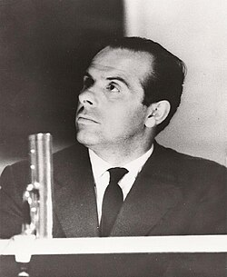

# Piero Piccioni

## Biografía

Piero Piccioni (Turín, 6 de diciembre de 1921-Roma, 23 de julio de 2004) fue un prolífico músico y compositor italiano de música de cine, campo en el que trabajó en más de 300 partituras​ que al comienzo de su carrera firmó como Piero Morgan y fue un gran artista infravalorado para su época. Comenzó trabajando en el mundo del jazz. Con solo 17 años y su "013" Big Band toca en programas de radio en 1938. Su primer contacto con el cine se produce trabajando como abogado para productoras cinematográficas como Titanus y De Laurentiis. Su primer trabajo como compositor se lo proporciona Michelangelo Antonioni que le encarga la música para el documental de uno de sus discípulos Luigi Polidoro. Su primer largometraje de ficción es Il mondo le condanna (1953), que dirige Gianni Franciolini y que el compositor firma como Piero Morgan, nombre que mantendrá hasta 1957. Tras esta película vendrán colaboraciones con Francesco Rosi, Mario Monicelli, Alberto Lattuada, Luigi Comencini, Luchino Visconti, Antonio Pietrangeli, Bernardo Bertolucci, Roberto Rossellini, Vittorio De Sica, Lina Wertmüller, Tinto Brass, Dino Risi y muchos otros. Entre los premios obtenidos a lo largo de su carrera cabe recordar el David di Donatello por Travolti da un insolito destino nell’azzurro mare d’agosto (1975), el Nastro d’argento por Salvatore Giuliano de Francesco Rosi (1963), el Prix International Lumiere (1991), el premio Anna Magnani (1975), o el premio Vittorio De Sica (1979).

## Estilo musical

Todas las noches, del 2 al 9 de febrero, saludamos al apestoso más chiflado y la influencia de un querido tesoro nacional.

## Anécdotas y curiosidades

Piero Piccioni nació en Turín, Piamonte. El apellido de soltera de su madre era Marengo, de ahí su seudónimo Piero Morgan, que adoptó hasta 1957.

## Top 10 bandas sonoras

1. ***Travolti da un insolito destino nell'azzurro mare d'agosto (Título en España: Insólita aventura de verano)***
    * **Póster:** [link](036_piero_piccioni/posters/poster_travolti_da_un_insolito_destino_nell_azzurro_mare_d_agosto_1974.jpg)
2. ***Totò diabolicus (Título en España: Totò diabolicus)***
    * **Póster:** [link](036_piero_piccioni/posters/poster_tot_diabolicus_1962.jpg)
3. ***L'assassino (Título en España: El asesino)***
    * **Póster:** [link](036_piero_piccioni/posters/poster_l_assassino_1961.jpg)
4. ***Mafioso (Título en España: El poder de la mafia)***
    * **Póster:** [link](036_piero_piccioni/posters/poster_mafioso_1962.jpg)
5. ***Le mani sulla città (Título en España: Las manos sobre la ciudad)***
    * **Póster:** [link](036_piero_piccioni/posters/poster_le_mani_sulla_citt_1963.jpg)
6. ***Cadaveri eccellenti (Título en España: Excelentísimos Cadáveres)***
    * **Póster:** [link](036_piero_piccioni/posters/poster_cadaveri_eccellenti_1976.jpg)
7. ***Lucky Luciano (Título en España: Lucky Luciano)***
    * **Póster:** [link](036_piero_piccioni/posters/poster_lucky_luciano_1973.jpg)
8. ***Il bell'Antonio (Título en España: El bello Antonio)***
    * **Póster:** [link](036_piero_piccioni/posters/poster_il_bell_antonio_1960.jpg)
9. ***I tartassati (Título en España: Los defraudadores)***
    * **Póster:** [link](036_piero_piccioni/posters/poster_i_tartassati_1959.jpg)
10. ***Io la conoscevo bene (Título en España: Yo la conocía bien)***
    * **Póster:** [link](036_piero_piccioni/posters/poster_io_la_conoscevo_bene_1965.jpg)

## Filmografía completa

- Il mondo le condanna (Título en España: Il mondo le condanna) (1953) · [Póster](036_piero_piccioni/posters/poster_il_mondo_le_condanna_1953.jpg)
- La spiaggia (Título en España: La spiaggia) (1954) · [Póster](036_piero_piccioni/posters/poster_la_spiaggia_1954.jpg)
- Yalis, la vergine del Roncador (Título en España: Yalis, la vergine del Roncador) (1955) · [Póster](036_piero_piccioni/posters/poster_yalis_la_vergine_del_roncador_1955.jpg)
- Belle ma povere (Título en España: Guapas, pero pobres) (1957) · [Póster](036_piero_piccioni/posters/poster_belle_ma_povere_1957.jpg)
- Guendalina (Título en España: Guendalina) (1957) · [Póster](036_piero_piccioni/posters/poster_guendalina_1957.jpg)
- La donna che venne dal mare (Título en España: La donna che venne dal mare) (1957) · [Póster](036_piero_piccioni/posters/poster_la_donna_che_venne_dal_mare_1957.jpg)
- Ballerina e Buon Dio (Título en España: Ballerina e Buon Dio) (1958) · [Póster](036_piero_piccioni/posters/poster_ballerina_e_buon_dio_1958.jpg)
- Nata di marzo (Título en España: Nacida en marzo) (1958) · [Póster](036_piero_piccioni/posters/poster_nata_di_marzo_1958.jpg)
- Racconti d'estate (Título en España: Sirenas en sociedad) (1958) · [Póster](036_piero_piccioni/posters/poster_racconti_d_estate_1958.jpg)
- La tempesta (Título en España: Tempestad) (1958) · [Póster](036_piero_piccioni/posters/poster_la_tempesta_1958.jpg)
- Avventura a Capri (Título en España: Avventura a Capri) (1959) · [Póster](036_piero_piccioni/posters/poster_avventura_a_capri_1959.jpg)
- I magliari (Título en España: I magliari) (1959) · [Póster](036_piero_piccioni/posters/poster_i_magliari_1959.jpg)
- I ragazzi dei Parioli (Título en España: I ragazzi dei Parioli) (1959) · [Póster](036_piero_piccioni/posters/poster_i_ragazzi_dei_parioli_1959.jpg)
- La notte brava (Título en España: La noche brava) (1959) · [Póster](036_piero_piccioni/posters/poster_la_notte_brava_1959.jpg)
- I tartassati (Título en España: Los defraudadores) (1959) · [Póster](036_piero_piccioni/posters/poster_i_tartassati_1959.jpg)
- Brevi amori a Palma di Majorca (Título en España: Vacaciones en Mallorca) (1959) · [Póster](036_piero_piccioni/posters/poster_brevi_amori_a_palma_di_majorca_1959.jpg)
- Adua e le compagne (Título en España: Adua y sus amigas) (1960) · [Póster](036_piero_piccioni/posters/poster_adua_e_le_compagne_1960.jpg)
- I dolci inganni (Título en España: Dulces engaños) (1960) · [Póster](036_piero_piccioni/posters/poster_i_dolci_inganni_1960.jpg)
- Il bell'Antonio (Título en España: El bello Antonio) (1960) · [Póster](036_piero_piccioni/posters/poster_il_bell_antonio_1960.jpg)
- Il gobbo (Título en España: Il gobbo) (1960) · [Póster](036_piero_piccioni/posters/poster_il_gobbo_1960.jpg)
- Il mondo di notte (Título en España: Il mondo di notte) (1960) · [Póster](036_piero_piccioni/posters/poster_il_mondo_di_notte_1960.jpg)
- La giornata balorda (Título en España: La giornata balorda) (1960) · [Póster](036_piero_piccioni/posters/poster_la_giornata_balorda_1960.jpg)
- Le svedesi (Título en España: Le svedesi) (1960) · [Póster](036_piero_piccioni/posters/poster_le_svedesi_1960.jpg)
- L'impiegato (Título en España: Los empleados) (1960) · [Póster](036_piero_piccioni/posters/poster_l_impiegato_1960.jpg)
- Via Margutta (Título en España: Via Margutta) (1960) · [Póster](036_piero_piccioni/posters/poster_via_margutta_1960.jpg)
- L'assassino (Título en España: El asesino) (1961) · [Póster](036_piero_piccioni/posters/poster_l_assassino_1961.jpg)
- Gioventù di notte (Título en España: Gioventù di notte) (1961) · [Póster](036_piero_piccioni/posters/poster_giovent_di_notte_1961.jpg)
- Il mondo di notte numero 2 (Título en España: Il mondo di notte numero 2) (1961) · [Póster](036_piero_piccioni/posters/poster_il_mondo_di_notte_numero_2_1961.jpg)
- La viaccia (Título en España: La calle del vicio) (1961) · [Póster](036_piero_piccioni/posters/poster_la_viaccia_1961.jpg)
- I due marescialli (Título en España: Los dos oficiales) (1961) · [Póster](036_piero_piccioni/posters/poster_i_due_marescialli_1961.jpg)
- Mani in alto (Título en España: Manos arriba) (1961) · [Póster](036_piero_piccioni/posters/poster_mani_in_alto_1961.jpg)
- Romolo e Remo (Título en España: Rómulo y Remo) (1961) · [Póster](036_piero_piccioni/posters/poster_romolo_e_remo_1961.jpg)
- Anima nera (Título en España: Alma negra) (1962) · [Póster](036_piero_piccioni/posters/poster_anima_nera_1962.jpg)
- Congo vivo (Título en España: Congo vivo) (1962) · [Póster](036_piero_piccioni/posters/poster_congo_vivo_1962.jpg)
- Il figlio di Spartacus (Título en España: El hijo de Espartaco) (1962) · [Póster](036_piero_piccioni/posters/poster_il_figlio_di_spartacus_1962.jpg)
- Mafioso (Título en España: El poder de la mafia) (1962) · [Póster](036_piero_piccioni/posters/poster_mafioso_1962.jpg)
- La commare secca (Título en España: La cosecha estéril) (1962) · [Póster](036_piero_piccioni/posters/poster_la_commare_secca_1962.jpg)
- Lo smemorato di Collegno (Título en España: Lo smemorato di Collegno) (1962) · [Póster](036_piero_piccioni/posters/poster_lo_smemorato_di_collegno_1962.jpg)
- Gli anni ruggenti (Título en España: Los años rugientes) (1962) · [Póster](036_piero_piccioni/posters/poster_gli_anni_ruggenti_1962.jpg)
- Salvatore Giuliano (Título en España: Salvatore Giuliano) (1962) · [Póster](036_piero_piccioni/posters/poster_salvatore_giuliano_1962.jpg)
- Senilità (Título en España: Senilidad) (1962) · [Póster](036_piero_piccioni/posters/poster_senilit_1962.jpg)
- Totò diabolicus (Título en España: Totò diabolicus) (1962) · [Póster](036_piero_piccioni/posters/poster_tot_diabolicus_1962.jpg)
- Una vita violenta (Título en España: Una vida violenta) (1962) · [Póster](036_piero_piccioni/posters/poster_una_vita_violenta_1962.jpg)
- Chi lavora è perduto (Título en España: Chi lavora è perduto) (1963) · [Póster](036_piero_piccioni/posters/poster_chi_lavora_perduto_1963.jpg)
- Il diavolo (Título en España: El diablo) (1963) · [Póster](036_piero_piccioni/posters/poster_il_diavolo_1963.jpg)
- Il giorno più corto (Título en España: El día mas corto) (1963) · [Póster](036_piero_piccioni/posters/poster_il_giorno_pi_corto_1963.jpg)
- Il boom (Título en España: El especulador) (1963) · [Póster](036_piero_piccioni/posters/poster_il_boom_1963.jpg)
- Il terrorista (Título en España: Il terrorista) (1963) · [Póster](036_piero_piccioni/posters/poster_il_terrorista_1963.jpg)
- La parmigiana (Título en España: La chica de Parma) (1963) · [Póster](036_piero_piccioni/posters/poster_la_parmigiana_1963.jpg)
- Le mani sulla città (Título en España: Las manos sobre la ciudad) (1963) · [Póster](036_piero_piccioni/posters/poster_le_mani_sulla_citt_1963.jpg)
- Un tentativo sentimentale (Título en España: Un tentativo sentimentale) (1963) · [Póster](036_piero_piccioni/posters/poster_un_tentativo_sentimentale_1963.jpg)
- Il demonio (Título en España: El Demonio) (1964) · [Póster](036_piero_piccioni/posters/poster_il_demonio_1964.jpg)
- Il disco volante (Título en España: El platillo volante) (1964) · [Póster](036_piero_piccioni/posters/poster_il_disco_volante_1964.jpg)
- La donna è una cosa meravigliosa (Título en España: La donna è una cosa meravigliosa) (1964) · [Póster](036_piero_piccioni/posters/poster_la_donna_una_cosa_meravigliosa_1964.jpg)
- La vita agra (Título en España: La vita agra) (1964) · [Póster](036_piero_piccioni/posters/poster_la_vita_agra_1964.jpg)
- Minnesota Clay (Título en España: Minnesota Clay) (1964) · [Póster](036_piero_piccioni/posters/poster_minnesota_clay_1964.jpg)
- Tre per una rapina (Título en España: Tre per una rapina) (1964) · [Póster](036_piero_piccioni/posters/poster_tre_per_una_rapina_1964.jpg)
- 3 notti d'amore (Título en España: Tres noches de amor) (1964) · [Póster](036_piero_piccioni/posters/poster_3_notti_d_amore_1964.jpg)
- Il momento della verità (Título en España: El momento de la verdad) (1965) · [Póster](036_piero_piccioni/posters/poster_il_momento_della_verit_1965.jpg)
- La Corde au cou (Título en España: La Corde au cou) (1965) · [Póster](036_piero_piccioni/posters/poster_la_corde_au_cou_1965.jpg)
- La fuga (Título en España: La fuga) (1965) · [Póster](036_piero_piccioni/posters/poster_la_fuga_1965.jpg)
- La decima vittima (Título en España: La víctima número 10) (1965) · [Póster](036_piero_piccioni/posters/poster_la_decima_vittima_1965.jpg)
- Once Upon a Tractor (Título en España: Once Upon a Tractor) (1965) · [Póster](036_piero_piccioni/posters/poster_once_upon_a_tractor_1965.jpg)
- Agente 077 dall'oriente con furore (Título en España: París-Estambul sin regreso) (1965) · [Póster](036_piero_piccioni/posters/poster_agente_077_dall_oriente_con_furore_1965.jpg)
- Io la conoscevo bene (Título en España: Yo la conocía bien) (1965) · [Póster](036_piero_piccioni/posters/poster_io_la_conoscevo_bene_1965.jpg)
- Scusi, lei è favorevole o contrario? (Título en España: El gran amante) (1966) · [Póster](036_piero_piccioni/posters/poster_scusi_lei_favorevole_o_contrario_1966.jpg)
- I nostri mariti (Título en España: Ni hablar de los maridos) (1966) · [Póster](036_piero_piccioni/posters/poster_i_nostri_mariti_1966.jpg)
- After the Fox (Título en España: Tras la pista del zorro) (1966) · [Póster](036_piero_piccioni/posters/poster_after_the_fox_1966.jpg)
- Fumo di Londra (Título en España: Un italiano en Londres) (1966) · [Póster](036_piero_piccioni/posters/poster_fumo_di_londra_1966.jpg)
- Lo straniero (Título en España: El Extranjero) (1967) · [Póster](036_piero_piccioni/posters/poster_lo_straniero_1967.jpg)
- Le streghe (Título en España: Las brujas) (1967) · [Póster](036_piero_piccioni/posters/poster_le_streghe_1967.jpg)
- Qualcuno ha tradito (Título en España: Qualcuno ha tradito) (1967) · [Póster](036_piero_piccioni/posters/poster_qualcuno_ha_tradito_1967.jpg)
- C'era una volta (Título en España: Siempre hay una mujer) (1967) · [Póster](036_piero_piccioni/posters/poster_c_era_una_volta_1967.jpg)
- Matchless (Título en España: Sin Rival) (1967) · [Póster](036_piero_piccioni/posters/poster_matchless_1967.jpg)
- Ti ho sposato per allegria (Título en España: Ti ho sposato per allegria) (1967) · [Póster](036_piero_piccioni/posters/poster_ti_ho_sposato_per_allegria_1967.jpg)
- Un italiano in America (Título en España: Un italiano in America) (1967) · [Póster](036_piero_piccioni/posters/poster_un_italiano_in_america_1967.jpg)
- Capriccio all'italiana (Título en España: Capriccio all'italiana) (1968) · [Póster](036_piero_piccioni/posters/poster_capriccio_all_italiana_1968.jpg)
- Il medico della mutua (Título en España: El médico de la mutua) (1968) · [Póster](036_piero_piccioni/posters/poster_il_medico_della_mutua_1968.jpg)
- Fedra West (Título en España: Fedra West) (1968) · [Póster](036_piero_piccioni/posters/poster_fedra_west_1968.jpg)
- I giovani tigri (Título en España: I giovani tigri) (1968) · [Póster](036_piero_piccioni/posters/poster_i_giovani_tigri_1968.jpg)
- Kenner (Título en España: Kenner) (1968) · [Póster](036_piero_piccioni/posters/poster_kenner_1968.jpg)
- Quel caldo maledetto giorno di fuoco (Título en España: La ametralladora) (1968) · [Póster](036_piero_piccioni/posters/poster_quel_caldo_maledetto_giorno_di_fuoco_1968.jpg)
- La moglie giapponese (Título en España: La moglie giapponese) (1968) · [Póster](036_piero_piccioni/posters/poster_la_moglie_giapponese_1968.jpg)
- Se incontri Sartana prega per la tua morte (Título en España: Si te encuentras con Sartana ruega por tu muerte) (1968) · [Póster](036_piero_piccioni/posters/poster_se_incontri_sartana_prega_per_la_tua_morte_1968.jpg)
- Addio Alexandra (Título en España: Addio Alexandra) (1969) · [Póster](036_piero_piccioni/posters/poster_addio_alexandra_1969.jpg)
- Amore mio aiutami (Título en España: Amor mío, ayúdame) (1969) · [Póster](036_piero_piccioni/posters/poster_amore_mio_aiutami_1969.jpg)
- Camille 2000 (Título en España: Camelia 2000) (1969) · [Póster](036_piero_piccioni/posters/poster_camille_2000_1969.jpg)
- Il Prof. Dott. Guido Tersilli primario della Clinica Villa Celeste convenzionata con la Mutua (Título en España: Doctor Tersilli, médico de la clínica Villa Celeste, afiliada a la mutua) (1969) · [Póster](036_piero_piccioni/posters/poster_il_prof_dott_guido_tersilli_primario_della_clinica_villa_celeste_convenzionata_con_la_mutua_1969.jpg)
- Giovinezza giovinezza (Título en España: Giovinezza giovinezza) (1969) · [Póster](036_piero_piccioni/posters/poster_giovinezza_giovinezza_1969.jpg)
- Le 10 meraviglie dell'amore (Título en España: Le 10 meraviglie dell'amore) (1969) · [Póster](036_piero_piccioni/posters/poster_le_10_meraviglie_dell_amore_1969.jpg)
- Temptation (Título en España: Temptation) (1969) · [Póster](036_piero_piccioni/posters/poster_temptation_1969.jpg)
- Toh, è morta la nonna! (Título en España: Toh, è morta la nonna!) (1969) · [Póster](036_piero_piccioni/posters/poster_toh_morta_la_nonna_1969.jpg)
- Colpo rovente (Título en España: Colpo rovente) (1970) · [Póster](036_piero_piccioni/posters/poster_colpo_rovente_1970.jpg)
- Il presidente del Borgorosso Football Club (Título en España: El presidente del Borgoroso F.C.) (1970) · [Póster](036_piero_piccioni/posters/poster_il_presidente_del_borgorosso_football_club_1970.jpg)
- Uomini contro (Título en España: Hombres contra la guerra) (1970) · [Póster](036_piero_piccioni/posters/poster_uomini_contro_1970.jpg)
- L'Italia vista dal cielo: Sicilia (Título en España: L'Italia vista dal cielo: Sicilia) (1970) · [Póster](036_piero_piccioni/posters/poster_l_italia_vista_dal_cielo_sicilia_1970.jpg)
- La spina dorsale del diavolo (Título en España: La quebrada del diablo) (1970) · [Póster](036_piero_piccioni/posters/poster_la_spina_dorsale_del_diavolo_1970.jpg)
- Puppet on a Chain (Título en España: Muñecas ahorcadas) (1970) · [Póster](036_piero_piccioni/posters/poster_puppet_on_a_chain_1970.jpg)
- Contestazione generale (Título en España: Revuelta general) (1970) · [Póster](036_piero_piccioni/posters/poster_contestazione_generale_1970.jpg)
- Le coppie (Título en España: Tres parejas) (1970) · [Póster](036_piero_piccioni/posters/poster_le_coppie_1970.jpg)
- Bello, onesto, emigrato Australia sposerebbe compaesana illibata (Título en España: Bello, honesto, emigrado a Australia quiere casarse con chica intocada) (1971) · [Póster](036_piero_piccioni/posters/poster_bello_onesto_emigrato_australia_sposerebbe_compaesana_illibata_1971.jpg)
- El ojo del huracán (Título en España: El ojo del huracán) (1971) · [Póster](036_piero_piccioni/posters/poster_el_ojo_del_hurac_n_1971.jpg)
- L'Italia vista dal cielo: Toscana (Título en España: L'Italia vista dal cielo: Toscana) (1971) · [Póster](036_piero_piccioni/posters/poster_l_italia_vista_dal_cielo_toscana_1971.jpg)
- The Light at the Edge of the World (Título en España: La luz del fin del mundo) (1971) · [Póster](036_piero_piccioni/posters/poster_the_light_at_the_edge_of_the_world_1971.jpg)
- In nome del padre, del figlio e della Colt (Título en España: La máscara de cuero) (1971) · [Póster](036_piero_piccioni/posters/poster_in_nome_del_padre_del_figlio_e_della_colt_1971.jpg)
- La primera entrega (Título en España: La primera entrega de una mujer casada) (1971) · [Póster](036_piero_piccioni/posters/poster_la_primera_entrega_1971.jpg)
- Senza via d'uscita (Título en España: Las fotos de una mujer decente) (1971) · [Póster](036_piero_piccioni/posters/poster_senza_via_d_uscita_1971.jpg)
- Marta (Título en España: Marta) (1971) · [Póster](036_piero_piccioni/posters/poster_marta_1971.jpg)
- Il caso Mattei (Título en España: El caso Mattei) (1972) · [Póster](036_piero_piccioni/posters/poster_il_caso_mattei_1972.jpg)
- Le Moine (Título en España: El monje) (1972) · [Póster](036_piero_piccioni/posters/poster_le_moine_1972.jpg)
- Mimì metallurgico ferito nell'onore (Título en España: Mimí metalúrgico, herido en su honor) (1972) · [Póster](036_piero_piccioni/posters/poster_mim_metallurgico_ferito_nell_onore_1972.jpg)
- Lo scopone scientifico (Título en España: Sembrando ilusiones) (1972) · [Póster](036_piero_piccioni/posters/poster_lo_scopone_scientifico_1972.jpg)
- Polvere di stelle (Título en España: Esa rubia es mia) (1973) · [Póster](036_piero_piccioni/posters/poster_polvere_di_stelle_1973.jpg)
- Storia di una monaca di clausura (Título en España: Historia de una monja de clausura) (1973) · [Póster](036_piero_piccioni/posters/poster_storia_di_una_monaca_di_clausura_1973.jpg)
- Il giustiziere di Dio (Título en España: Il giustiziere di Dio) (1973) · [Póster](036_piero_piccioni/posters/poster_il_giustiziere_di_dio_1973.jpg)
- L'Italia vista dal cielo: Liguria (Título en España: L'Italia vista dal cielo: Liguria) (1973) · [Póster](036_piero_piccioni/posters/poster_l_italia_vista_dal_cielo_liguria_1973.jpg)
- Lucky Luciano (Título en España: Lucky Luciano) (1973) · [Póster](036_piero_piccioni/posters/poster_lucky_luciano_1973.jpg)
- Sei bounty killers per una strage (Título en España: Sei bounty killers per una strage) (1973) · [Póster](036_piero_piccioni/posters/poster_sei_bounty_killers_per_una_strage_1973.jpg)
- Una colt in mano al diavolo (Título en España: Una pistola en manos del diablo) (1973) · [Póster](036_piero_piccioni/posters/poster_una_colt_in_mano_al_diavolo_1973.jpg)
- Fatevi vivi, la polizia non interverrà (Título en España: Fatevi vivi, la polizia non interverrà) (1974) · [Póster](036_piero_piccioni/posters/poster_fatevi_vivi_la_polizia_non_interverr_1974.jpg)
- Travolti da un insolito destino nell'azzurro mare d'agosto (Título en España: Insólita aventura de verano) (1974) · [Póster](036_piero_piccioni/posters/poster_travolti_da_un_insolito_destino_nell_azzurro_mare_d_agosto_1974.jpg)
- Finché c'è guerra c'è speranza (Título en España: Mientras hay guerra hay esperanza) (1974) · [Póster](036_piero_piccioni/posters/poster_finch_c_guerra_c_speranza_1974.jpg)
- Appassionata (Título en España: Perversa) (1974) · [Póster](036_piero_piccioni/posters/poster_appassionata_1974.jpg)
- Tutto a posto e niente in ordine (Título en España: Todo en su sitio y nada en orden) (1974) · [Póster](036_piero_piccioni/posters/poster_tutto_a_posto_e_niente_in_ordine_1974.jpg)
- Fratello mare (Título en España: Fratello mare) (1975) · [Póster](036_piero_piccioni/posters/poster_fratello_mare_1975.jpg)
- L'Italia vista dal cielo: Lazio (Título en España: L'Italia vista dal cielo: Lazio) (1975) · [Póster](036_piero_piccioni/posters/poster_l_italia_vista_dal_cielo_lazio_1975.jpg)
- Chi dice donna, dice donna (Título en España: Chi dice donna, dice donna) (1976) · [Póster](036_piero_piccioni/posters/poster_chi_dice_donna_dice_donna_1976.jpg)
- Quelle strane occasioni (Título en España: Ciertos pequeñísimos pecados (Cuentos atrevidos para algunas ocasiones)) (1976) · [Póster](036_piero_piccioni/posters/poster_quelle_strane_occasioni_1976.jpg)
- Cuore di cane (Título en España: Corazón de perro) (1976) · [Póster](036_piero_piccioni/posters/poster_cuore_di_cane_1976.jpg)
- Il comune senso del pudore (Título en España: El sentido del pudor) (1976) · [Póster](036_piero_piccioni/posters/poster_il_comune_senso_del_pudore_1976.jpg)
- Cadaveri eccellenti (Título en España: Excelentísimos Cadáveres) (1976) · [Póster](036_piero_piccioni/posters/poster_cadaveri_eccellenti_1976.jpg)
- I vizi morbosi di una governante (Título en España: I vizi morbosi di una governante) (1977) · [Póster](036_piero_piccioni/posters/poster_i_vizi_morbosi_di_una_governante_1977.jpg)
- Per questa notte (Título en España: Per questa notte) (1977) · [Póster](036_piero_piccioni/posters/poster_per_questa_notte_1977.jpg)
- Le Témoin (Título en España: Le Témoin) (1978) · [Póster](036_piero_piccioni/posters/poster_le_t_moin_1978.jpg)
- Professor Kranz tedesco di Germania (Título en España: Professor Kranz tedesco di Germania) (1978) · [Póster](036_piero_piccioni/posters/poster_professor_kranz_tedesco_di_germania_1978.jpg)
- Dove vai in vacanza? (Título en España: Vicios de verano) (1978) · [Póster](036_piero_piccioni/posters/poster_dove_vai_in_vacanza_1978.jpg)
- Cristo si è fermato a Eboli (Título en España: Cristo se paró en Éboli) (1979) · [Póster](036_piero_piccioni/posters/poster_cristo_si_fermato_a_eboli_1979.jpg)
- Il malato immaginario (Título en España: El enfermo imaginario) (1979) · [Póster](036_piero_piccioni/posters/poster_il_malato_immaginario_1979.jpg)
- Riavanti… Marsch! (Título en España: Riavanti... Marsch!) (1979) · [Póster](036_piero_piccioni/posters/poster_riavanti_marsch_1979.jpg)
- Io e Caterina (Título en España: Caterina y Yo) (1980) · [Póster](036_piero_piccioni/posters/poster_io_e_caterina_1980.jpg)
- Rag. Arturo De Fanti, bancario precario (Título en España: Rag. Arturo De Fanti, bancario precario) (1980) · [Póster](036_piero_piccioni/posters/poster_rag_arturo_de_fanti_bancario_precario_1980.jpg)
- Pierino medico della SAUB (Título en España: Jaimito, médico del seguro) (1981) · [Póster](036_piero_piccioni/posters/poster_pierino_medico_della_saub_1981.jpg)
- Tre fratelli (Título en España: Tres hermanos) (1981) · [Póster](036_piero_piccioni/posters/poster_tre_fratelli_1981.jpg)
- In viaggio con papà (Título en España: In viaggio con papà) (1982) · [Póster](036_piero_piccioni/posters/poster_in_viaggio_con_pap_1982.jpg)
- Fighting Back (Título en España: Justicia privada) (1982) · [Póster](036_piero_piccioni/posters/poster_fighting_back_1982.jpg)
- Io so che tu sai che io so (Título en España: Yo sé que tú sabes que yo sé) (1982) · [Póster](036_piero_piccioni/posters/poster_io_so_che_tu_sai_che_io_so_1982.jpg)
- Il tassinaro (Título en España: Il tassinaro) (1983) · [Póster](036_piero_piccioni/posters/poster_il_tassinaro_1983.jpg)
- Tutti Dentro (Título en España: Tutti Dentro) (1984) · [Póster](036_piero_piccioni/posters/poster_tutti_dentro_1984.jpg)
- Sono un fenomeno paranormale (Título en España: Sono un fenomeno paranormale) (1985) · [Póster](036_piero_piccioni/posters/poster_sono_un_fenomeno_paranormale_1985.jpg)
- Cronaca di una morte annunciata (Título en España: Crónica de una muerte anunciada) (1987) · [Póster](036_piero_piccioni/posters/poster_cronaca_di_una_morte_annunciata_1987.jpg)
- Un bambino di nome Gesú (Título en España: Un niño llamado Jesús) (1987) · [Póster](036_piero_piccioni/posters/poster_un_bambino_di_nome_ges_1987.jpg)
- Un tassinaro a New York (Título en España: Un tassinaro a New York) (1987) · [Póster](036_piero_piccioni/posters/poster_un_tassinaro_a_new_york_1987.jpg)
- 12 registi per 12 città (Título en España: 12 registi per 12 città) (1989) · [Póster](036_piero_piccioni/posters/poster_12_registi_per_12_citt_1989.jpg)
- Comprarsi la vita (Título en España: Comprarsi la vita) (1990) · [Póster](036_piero_piccioni/posters/poster_comprarsi_la_vita_1990.jpg)
- L'avaro (Título en España: El avaro) (1990) · [Póster](036_piero_piccioni/posters/poster_l_avaro_1990.jpg)
- Assolto per aver commesso il fatto (Título en España: Assolto per aver commesso il fatto) (1992) · [Póster](036_piero_piccioni/posters/poster_assolto_per_aver_commesso_il_fatto_1992.jpg)
- Diario napoletano (Título en España: Diario napoletano) (1992) · [Póster](036_piero_piccioni/posters/poster_diario_napoletano_1992.jpg)
- Nestore, l'ultima corsa (Título en España: Nestore, l'ultima corsa) (1994) · [Póster](036_piero_piccioni/posters/poster_nestore_l_ultima_corsa_1994.jpg)
- Incontri proibiti (Título en España: Incontri proibiti) (1998) · [Póster](036_piero_piccioni/posters/poster_incontri_proibiti_1998.jpg)

## Premios y nominaciones

* 1975 – David di Donatello a la mejor música – (Ganador)

## Fuentes adicionales

* [MundoBSO](https://www.mundobso.com/compositor/piccioni-piero) — site:mundobso.com
* [MundoBSO (2)](https://w.mundobso.com/bso/cartero-siempre-llama-dos-veces-el) — site:mundobso.com
* [MundoBSO (3)](https://www.mundobso.com/bso/milla-verde-la) — site:mundobso.com
* [Film Score Monthly](http://www.filmscoremonthly.com/Notes/more_than_a_miracle_lp.html) — site:filmscoremonthly.com
* [Film Score Monthly (2)](https://www.filmscoremonthly.com/board/posts.cfm?forumID=1&pageID=4&threadID=145993&archive=0) — site:filmscoremonthly.com
* [Film Score Monthly (3)](https://www.filmscoremonthly.com/cds/detail.cfm/CDID/461/Kenner-More-Than-a-Miracle/) — site:filmscoremonthly.com
* [SoundtrackCollector](https://www.soundtrackcollector.com/catalog/composerdiscography.php?composerid=194&offset=880) — site:soundtrackcollector.com
* [SoundtrackCollector (2)](https://www.soundtrackcollector.com) — site:soundtrackcollector.com
* [SoundtrackCollector (3)](https://www.soundtrackcollector.com/title/21836/Scacco+Alla+Regina) — site:soundtrackcollector.com
* [WhatSong](https://www.whatsong.org/movie/the-big-lebowski) — site:whatsong.org
* [WhatSong (2)](https://www.whatsong.org/tvshow/how-i-met-your-mother/episode/44483) — site:whatsong.org
* [WhatSong (3)](https://www.whatsong.org/tvshow/smallville/episode/39263) — site:whatsong.org

## Notas externas

* MundoBSO: Nació en Turín (Italia), el 6 de diciembre de 1921, y murió en Roma (Italia), el 24 de julio de 2004. Desarrolló una extensa carrera en el cine italiano, especialmente en el género de la comedia, y ha trabajado en múltiples ocasiones con Alberto Sordi y Francesco Rosi. Nació en Turín (Italia), el 6 de diciembre de 1921, y murió en Roma (Italia), el 24 de julio de 2004. Desarrolló una extensa carrera en el cine italiano, especialmente en el género de la comedia, y ha trabajado en múltiples ocasiones con Alberto Sordi y Francesco Rosi.
* MundoBSO (3): Compositor: Newman, Thomas Sello: Warner Duración: 66 minutos Información de la película Título original: The Green Mile Director: Frank Darabont Nacionalidad: EE UU Año: 1999 Argumento A mediados de los años treinta, un guarda de prisiones que custodia a los condenados a muerte descubre poderes sobrenaturales en un inmenso hombre negro, acusado de haber asesinado a dos niñas. Eso le llevará a creer en su inocencia. Premios Saturn: 1 nominación Compositor: Newman, Thomas Sello: Warner Duración: 66 minutos
* SoundtrackCollector (2): 14 de enero - Confesión de un comisionado de policía de Riz Ortolani a la fiscalía 3 de diciembre - Wolf Hall de Debbie Wiseman: El espejo y la luz
* WhatSong: 00:01 Se abre la película, la cámara sigue una planta rodadora. El narrador está hablando de 'The Dude' y Las Ángeles 00:05 Aparece el título. En la bolera. Tomas de diferentes personas jugando a los bolos.
* WhatSong (2): Lily y Robin bailan con los dos nerds del último año de secundaria. Se reproduce de fondo cuando Lilly, Robin y Barney intentan entrar a la fiesta. La canción es una canción que está incluida en iMovie.
* WhatSong (3): Actuó mientras Pete mastica chicle de kriptonita y luego salva a Kara. OneRepublic - Soñando en voz alta (edición ampliada)
* www.pieropiccioni.com: Piero Piccioni nació en Turín el 6 de diciembre de 1921, de madre turinesa, Carolina Marengo, de ahí el seudónimo de Piero Morgan que utilizó el autor hasta 1957. Piero Piccioni había escuchado jazz desde niño y tocaba el piano sin haber asistido al conservatorio. Autodidacta, a los trece años, cuando su padre lo llevó a Florencia (al EI.A.R.) para escuchar orquestas, ya escribía canciones y Carisch publicó algunas de ellas. Entre los pocos discos americanos que salieron en Italia en la década de 1930, quedó profundamente impresionado por la música de Duke Ellington, especialmente la de 1933 y 34. En 1937 hizo una audición para EI.A.R. y recibió el encargo de tocar en solitario para...
* faroutmagazine.co.uk: Una gran partitura puede transportarte a otro reino, llevándote con cuerdas exuberantes y hermosas secciones de metales a un mundo cinematográfico donde todo es irremediablemente romántico, dramático o trágico. Ha habido muchos grandes compositores en la historia del cine cuyo trabajo ha elevado las películas a obras de arte aún mayores, y Piero Piccioni sigue siendo uno de los nombres más impresionantes que han surgido de Italia. Nacido en 1921, el compositor se sintió atraído por la música desde una edad temprana y su padre lo llevaba regularmente a presentaciones en vivo. Como muchos músicos que desarrollan un gran interés por esta forma de arte cuando son jóvenes, Piccioni no pudo dejar de lado su deseo y se encontró en el...
* www.tcm.com: Todas las noches, del 2 al 9 de febrero, saludamos al apestoso más chiflado y la influencia de un querido tesoro nacional. Prepárate el 4 de febrero para disfrutar de un día de historias de tiroteos y botas ambientadas en el viejo Oeste.
* www.last.fm: Piero Piccioni (6 de diciembre de 1921, Turín, Italia - 23 de julio de 2004, Roma, Italia) El apellido de soltera de su madre era Marengo, de ahí su seudónimo Piero Morgan, que adoptó hasta 1957. Cuando era niño, su padre, Attilio Piccioni, (un miembro destacado del Partido Demócrata Cristiano en el gobierno italiano de la posguerra) lo llevaba con frecuencia a escuchar conciertos en el E.I.A.R. Estudios de radio en Florencia. Habiendo escuchado jazz durante toda su infancia (amaba mucho a Art Tatum y Charlie Parker) y sin asistir a estudios en la Academia de Música del Conservatorio, Piero Piccioni se convirtió en un músico autodidacta de gran talento. Piccioni debutó en la radio con su 013 Big Band en...
* musastudio.it: Servicios Sitios web y comercio electrónico Anuncios Web+ Redes sociales Equipo Únase a nosotros Prácticas curriculares Artistas Giulio Fanfoni Edoardo Meloni Andrea Pogliani
* www.pieropiccioni.com: Francesco Rosi, Armando Trovajoli, Ennio Morricone, Adriano Mazzoletti, Claudio Fuiano, Massimo Cardinaletti, Roberto Zamori, Leone Piccioni, Jason y Valentina Piccioni, Alessandro Casella, Ermanno Comuzio, Nicola Vicidomini.
