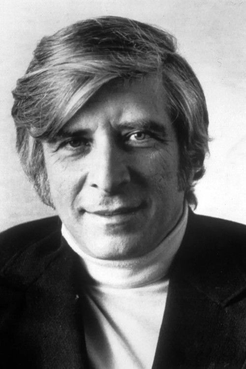

# Elmer Bernstein

## Biografía

Elmer Bernstein (BURN-steen; 4 de abril de 1922 - 18 de agosto de 2004) fue un compositor y director de orquesta estadounidense. En una carrera que abarcó más de cinco décadas, compuso "algunos de los temas más reconocibles y memorables de la historia de Hollywood", incluidas más de 150 bandas sonoras originales de películas, así como bandas sonoras para casi 80 producciones televisivas. Por su trabajo, recibió un Premio de la Academia por Thoroughly Modern Millie (1967) y un Premio Primetime Emmy. También recibió siete premios Globo de Oro, cinco premios Grammy y dos nominaciones a los premios Tony. Compuso y arregló bandas sonoras para más de 100 películas, entre ellas Sudden Fear (1952), The Man with the Golden Arm (1955), The Ten Commandments (1956), Sweet Smell of Success (1957), The Magnificent Seven (1960), To Kill a Mockingbird (1962), The World of Henry Orient (1964), The Great Escape (1963), Hud (1963), Thoroughly Modern Millie. (1967), True Grit (1969), My Left Foot (1989), The Grifters (1990), Cape Fear (1991), Crepúsculo (1998) y Lejos del cielo (2002). Es conocido por su trabajo en las películas de comedia Animal House (1978), Meatballs (1979), Airplane! (1980), The Blues Brothers (1980), Stripes (1981), Trading Places (1983), Ghostbusters (1984), Spies Like Us (1985) y Three Amigos (1986). También trabajó en frecuentes colaboraciones con los directores Martin Scorsese, Robert Mulligan, John Landis, Ivan Reitman, John Sturges, Bill Duke, George Roy Hill, Richard Fleischer, John Frankenheimer y Henry Hathaway.

## Estilo musical

Elmer Bernstein (/ ˈ b ɜːr n s t iː n / BURN -steen; 4 de abril de 1922 - 18 de agosto de 2004) [1] [2] fue un compositor y director de orquesta estadounidense. En una carrera que abarcó más de cinco décadas, compuso "algunos de los temas más reconocibles y memorables de la historia de Hollywood", incluidas más de 150 bandas sonoras originales de películas, así como bandas sonoras para casi 80 producciones televisivas. [ 3 ] Por su trabajo, recibió un Premio de la Academia por Thoroughly Modern Millie (1967) y un Premio Primetime Emmy. También recibió siete premios Globo de Oro, cinco premios Grammy y dos nominaciones a los premios Tony.

## Anécdotas y curiosidades

2 Carrera musical Alternar subsección Carrera musical 2.1 Principios de la década de 1950: lista negra de Hollywood 2.2 Finales de la década de 1950 y 1960: avance 2.3 Broadway 2.4 Década de 1980: obras de comedia 2.5 Década de 1990: trabajo continuo

## Top 10 bandas sonoras

1. ***Trading Places (Título en España: Entre pillos anda el juego)***
    * **Póster:** [link](037_elmer_bernstein/posters/poster_trading_places_1983.jpg)
2. ***The Magnificent Seven (Título en España: Los siete magníficos)***
    * **Póster:** [link](037_elmer_bernstein/posters/poster_the_magnificent_seven_1960.jpg)
3. ***To Kill a Mockingbird (Título en España: Matar a un ruiseñor)***
    * **Póster:** [link](037_elmer_bernstein/posters/poster_to_kill_a_mockingbird_1962.jpg)
4. ***The Age of Innocence (Título en España: La edad de la inocencia)***
    * **Póster:** [link](037_elmer_bernstein/posters/poster_the_age_of_innocence_1993.jpg)
5. ***True Grit (Título en España: Valor de ley)***
    * **Póster:** [link](037_elmer_bernstein/posters/poster_true_grit_1969.jpg)
6. ***Far from Heaven (Título en España: Lejos del cielo)***
    * **Póster:** [link](037_elmer_bernstein/posters/poster_far_from_heaven_2002.jpg)
7. ***The Man with the Golden Arm (Título en España: El hombre del brazo de oro)***
    * **Póster:** [link](037_elmer_bernstein/posters/poster_the_man_with_the_golden_arm_1955.jpg)
8. ***Return of the Seven (Título en España: El regreso de los siete magníficos)***
    * **Póster:** [link](037_elmer_bernstein/posters/poster_return_of_the_seven_1966.jpg)
9. ***Thoroughly Modern Millie (Título en España: Millie, una chica moderna)***
    * **Póster:** [link](037_elmer_bernstein/posters/poster_thoroughly_modern_millie_1967.jpg)
10. ***Hawaii (Título en España: Hawaii)***
    * **Póster:** [link](037_elmer_bernstein/posters/poster_hawaii_1966.jpg)

## Filmografía completa

- Battles of Chief Pontiac (Título en España: Battles of Chief Pontiac) (1952) · [Póster](037_elmer_bernstein/posters/poster_battles_of_chief_pontiac_1952.jpg)
- Sudden Fear (Título en España: Miedo súbito) (1952) · [Póster](037_elmer_bernstein/posters/poster_sudden_fear_1952.jpg)
- Cat-Women of the Moon (Título en España: Las mujeres gato de la luna) (1953) · [Póster](037_elmer_bernstein/posters/poster_cat_women_of_the_moon_1953.jpg)
- Miss Robin Crusoe (Título en España: Miss Robin Crusoe) (1953) · [Póster](037_elmer_bernstein/posters/poster_miss_robin_crusoe_1953.jpg)
- Never Wave at a WAC (Título en España: Nunca saludes a un soldado) (1953) · [Póster](037_elmer_bernstein/posters/poster_never_wave_at_a_wac_1953.jpg)
- Robot Monster (Título en España: Robot Monster) (1953) · [Póster](037_elmer_bernstein/posters/poster_robot_monster_1953.jpg)
- Make Haste to Live (Título en España: Pasado tenebroso) (1954) · [Póster](037_elmer_bernstein/posters/poster_make_haste_to_live_1954.jpg)
- Silent Raiders (Título en España: Silent Raiders) (1954) · [Póster](037_elmer_bernstein/posters/poster_silent_raiders_1954.jpg)
- The Man with the Golden Arm (Título en España: El hombre del brazo de oro) (1955) · [Póster](037_elmer_bernstein/posters/poster_the_man_with_the_golden_arm_1955.jpg)
- It's a Dog's Life (Título en España: It's a Dog's Life) (1955) · [Póster](037_elmer_bernstein/posters/poster_it_s_a_dog_s_life_1955.jpg)
- The Eternal Sea (Título en España: Mar eterno) (1955) · [Póster](037_elmer_bernstein/posters/poster_the_eternal_sea_1955.jpg)
- Storm Fear (Título en España: Miedo en la tormenta) (1955) · [Póster](037_elmer_bernstein/posters/poster_storm_fear_1955.jpg)
- The View from Pompey's Head (Título en España: The View from Pompey's Head) (1955) · [Póster](037_elmer_bernstein/posters/poster_the_view_from_pompey_s_head_1955.jpg)
- The Ten Commandments (Título en España: Los Diez Mandamientos) (1956) · [Póster](037_elmer_bernstein/posters/poster_the_ten_commandments_1956.jpg)
- The Tin Star (Título en España: Cazador de forajidos) (1957) · [Póster](037_elmer_bernstein/posters/poster_the_tin_star_1957.jpg)
- Sweet Smell of Success (Título en España: Chantaje en Broadway) (1957) · [Póster](037_elmer_bernstein/posters/poster_sweet_smell_of_success_1957.jpg)
- Drango (Título en España: Drango) (1957) · [Póster](037_elmer_bernstein/posters/poster_drango_1957.jpg)
- Fear Strikes Out (Título en España: Fear Strikes Out) (1957) · [Póster](037_elmer_bernstein/posters/poster_fear_strikes_out_1957.jpg)
- Men in War (Título en España: La colina de los diablos de acero) (1957) · [Póster](037_elmer_bernstein/posters/poster_men_in_war_1957.jpg)
- Anna Lucasta (Título en España: Anna Lucasta) (1958) · [Póster](037_elmer_bernstein/posters/poster_anna_lucasta_1958.jpg)
- Kings Go Forth (Título en España: Cenizas bajo el sol) (1958) · [Póster](037_elmer_bernstein/posters/poster_kings_go_forth_1958.jpg)
- Some Came Running (Título en España: Como un torrente) (1958) · [Póster](037_elmer_bernstein/posters/poster_some_came_running_1958.jpg)
- Desire Under the Elms (Título en España: Deseo bajo los olmos) (1958) · [Póster](037_elmer_bernstein/posters/poster_desire_under_the_elms_1958.jpg)
- God's Little Acre (Título en España: La pequeña tierra de Dios) (1958) · [Póster](037_elmer_bernstein/posters/poster_god_s_little_acre_1958.jpg)
- The Buccaneer (Título en España: Los bucaneros) (1958) · [Póster](037_elmer_bernstein/posters/poster_the_buccaneer_1958.jpg)
- Saddle the Wind (Título en España: Más rápido que el viento) (1958) · [Póster](037_elmer_bernstein/posters/poster_saddle_the_wind_1958.jpg)
- The Miracle (Título en España: Promesa rota) (1959) · [Póster](037_elmer_bernstein/posters/poster_the_miracle_1959.jpg)
- The Story on Page One (Título en España: Sangre en primera página) (1959) · [Póster](037_elmer_bernstein/posters/poster_the_story_on_page_one_1959.jpg)
- From the Terrace (Título en España: Desde la terraza) (1960) · [Póster](037_elmer_bernstein/posters/poster_from_the_terrace_1960.jpg)
- The Magnificent Seven (Título en España: Los siete magníficos) (1960) · [Póster](037_elmer_bernstein/posters/poster_the_magnificent_seven_1960.jpg)
- The Rat Race (Título en España: Perdidos en la gran ciudad) (1960) · [Póster](037_elmer_bernstein/posters/poster_the_rat_race_1960.jpg)
- The Fabulous Fifties (Título en España: The Fabulous Fifties) (1960) · [Póster](037_elmer_bernstein/posters/poster_the_fabulous_fifties_1960.jpg)
- 2ⁿ: A Story of the Power of Numbers (Título en España: 2ⁿ: A Story of the Power of Numbers) (1961) · [Póster](037_elmer_bernstein/posters/poster_2_a_story_of_the_power_of_numbers_1961.jpg)
- The Comancheros (Título en España: Los comancheros) (1961) · [Póster](037_elmer_bernstein/posters/poster_the_comancheros_1961.jpg)
- The Young Doctors (Título en España: The Young Doctors) (1961) · [Póster](037_elmer_bernstein/posters/poster_the_young_doctors_1961.jpg)
- Summer and Smoke (Título en España: Verano y humo) (1961) · [Póster](037_elmer_bernstein/posters/poster_summer_and_smoke_1961.jpg)
- A Girl Named Tamiko (Título en España: A Girl Named Tamiko) (1962) · [Póster](037_elmer_bernstein/posters/poster_a_girl_named_tamiko_1962.jpg)
- Birdman of Alcatraz (Título en España: El hombre de Alcatraz) (1962) · [Póster](037_elmer_bernstein/posters/poster_birdman_of_alcatraz_1962.jpg)
- Walk on the Wild Side (Título en España: La gata negra) (1962) · [Póster](037_elmer_bernstein/posters/poster_walk_on_the_wild_side_1962.jpg)
- To Kill a Mockingbird (Título en España: Matar a un ruiseñor) (1962) · [Póster](037_elmer_bernstein/posters/poster_to_kill_a_mockingbird_1962.jpg)
- The Caretakers (Título en España: Almas en tinieblas) (1963) · [Póster](037_elmer_bernstein/posters/poster_the_caretakers_1963.jpg)
- Love with the Proper Stranger (Título en España: Amores con un extraño) (1963) · [Póster](037_elmer_bernstein/posters/poster_love_with_the_proper_stranger_1963.jpg)
- Hud (Título en España: Hud, el más salvaje entre mil) (1963) · [Póster](037_elmer_bernstein/posters/poster_hud_1963.jpg)
- The Great Escape (Título en España: La gran evasión) (1963) · [Póster](037_elmer_bernstein/posters/poster_the_great_escape_1963.jpg)
- Kings of the Sun (Título en España: Los reyes del sol) (1963) · [Póster](037_elmer_bernstein/posters/poster_kings_of_the_sun_1963.jpg)
- The World of Henry Orient (Título en España: El irresistible Henry Orient) (1964) · [Póster](037_elmer_bernstein/posters/poster_the_world_of_henry_orient_1964.jpg)
- Four Days In November (Título en España: Four Days In November) (1964) · [Póster](037_elmer_bernstein/posters/poster_four_days_in_november_1964.jpg)
- The Carpetbaggers (Título en España: Los insaciables) (1964) · [Póster](037_elmer_bernstein/posters/poster_the_carpetbaggers_1964.jpg)
- Baby the Rain Must Fall (Título en España: La última tentativa) (1965) · [Póster](037_elmer_bernstein/posters/poster_baby_the_rain_must_fall_1965.jpg)
- The Sons of Katie Elder (Título en España: Los cuatro hijos de Katie Elder) (1965) · [Póster](037_elmer_bernstein/posters/poster_the_sons_of_katie_elder_1965.jpg)
- 7 Women (Título en España: Siete mujeres) (1965) · [Póster](037_elmer_bernstein/posters/poster_7_women_1965.jpg)
- The Reward (Título en España: The Reward) (1965) · [Póster](037_elmer_bernstein/posters/poster_the_reward_1965.jpg)
- Return of the Seven (Título en España: El regreso de los siete magníficos) (1966) · [Póster](037_elmer_bernstein/posters/poster_return_of_the_seven_1966.jpg)
- Hawaii (Título en España: Hawaii) (1966) · [Póster](037_elmer_bernstein/posters/poster_hawaii_1966.jpg)
- Cast a Giant Shadow (Título en España: La sombra de un gigante) (1966) · [Póster](037_elmer_bernstein/posters/poster_cast_a_giant_shadow_1966.jpg)
- The Silencers (Título en España: Los silenciadores) (1966) · [Póster](037_elmer_bernstein/posters/poster_the_silencers_1966.jpg)
- Thoroughly Modern Millie (Título en España: Millie, una chica moderna) (1967) · [Póster](037_elmer_bernstein/posters/poster_thoroughly_modern_millie_1967.jpg)
- The Scalphunters (Título en España: El camino de la venganza) (1968) · [Póster](037_elmer_bernstein/posters/poster_the_scalphunters_1968.jpg)
- I Love You, Alice B. Toklas! (Título en España: Te amo, Alice B. Toklas) (1968) · [Póster](037_elmer_bernstein/posters/poster_i_love_you_alice_b_toklas_1968.jpg)
- Guns of the Magnificent Seven (Título en España: La furia de los siete magníficos) (1969) · [Póster](037_elmer_bernstein/posters/poster_guns_of_the_magnificent_seven_1969.jpg)
- The Gypsy Moths (Título en España: Los temerarios del aire) (1969) · [Póster](037_elmer_bernstein/posters/poster_the_gypsy_moths_1969.jpg)
- Midas Run (Título en España: Midas Run) (1969) · [Póster](037_elmer_bernstein/posters/poster_midas_run_1969.jpg)
- True Grit (Título en España: Valor de ley) (1969) · [Póster](037_elmer_bernstein/posters/poster_true_grit_1969.jpg)
- Cannon for Cordoba (Título en España: Cañones para Córdoba) (1970) · [Póster](037_elmer_bernstein/posters/poster_cannon_for_cordoba_1970.jpg)
- The Liberation of L.B. Jones (Título en España: No se compra el silencio) (1970) · [Póster](037_elmer_bernstein/posters/poster_the_liberation_of_l_b_jones_1970.jpg)
- A Walk in the Spring Rain (Título en España: Secretos de una esposa) (1970) · [Póster](037_elmer_bernstein/posters/poster_a_walk_in_the_spring_rain_1970.jpg)
- Big Jake (Título en España: El gran Jack) (1971) · [Póster](037_elmer_bernstein/posters/poster_big_jake_1971.jpg)
- Doctors' Wives (Título en España: Hospital, hora cero) (1971) · [Póster](037_elmer_bernstein/posters/poster_doctors_wives_1971.jpg)
- See No Evil (Título en España: Terror ciego) (1971) · [Póster](037_elmer_bernstein/posters/poster_see_no_evil_1971.jpg)
- The Magnificent Seven Ride! (Título en España: El desafío de los siete magníficos) (1972) · [Póster](037_elmer_bernstein/posters/poster_the_magnificent_seven_ride_1972.jpg)
- The Amazing Mr. Blunden (Título en España: The Amazing Mr. Blunden) (1972) · [Póster](037_elmer_bernstein/posters/poster_the_amazing_mr_blunden_1972.jpg)
- Incident on a Dark Street (Título en España: Incident on a Dark Street) (1973) · [Póster](037_elmer_bernstein/posters/poster_incident_on_a_dark_street_1973.jpg)
- Cahill: United States Marshal (Título en España: La soga de la horca) (1973) · [Póster](037_elmer_bernstein/posters/poster_cahill_united_states_marshal_1973.jpg)
- McQ (Título en España: McQ) (1974) · [Póster](037_elmer_bernstein/posters/poster_mcq_1974.jpg)
- Nightmare Honeymoon (Título en España: Nightmare Honeymoon) (1974) · [Póster](037_elmer_bernstein/posters/poster_nightmare_honeymoon_1974.jpg)
- Gold (Título en España: Oro) (1974) · [Póster](037_elmer_bernstein/posters/poster_gold_1974.jpg)
- The Trial of Billy Jack (Título en España: The Trial of Billy Jack) (1974) · [Póster](037_elmer_bernstein/posters/poster_the_trial_of_billy_jack_1974.jpg)
- Ellery Queen: Too Many Suspects (Título en España: Ellery Queen: Too Many Suspects) (1975) · [Póster](037_elmer_bernstein/posters/poster_ellery_queen_too_many_suspects_1975.jpg)
- Report to the Commissioner (Título en España: Quiero la verdad) (1975) · [Póster](037_elmer_bernstein/posters/poster_report_to_the_commissioner_1975.jpg)
- The Shootist (Título en España: El último pistolero) (1976) · [Póster](037_elmer_bernstein/posters/poster_the_shootist_1976.jpg)
- From Noon Till Three (Título en España: Sucedió entre las 12 y las 3) (1976) · [Póster](037_elmer_bernstein/posters/poster_from_noon_till_three_1976.jpg)
- Billy Jack Goes to Washington (Título en España: Billy Jack Goes to Washington) (1977) · [Póster](037_elmer_bernstein/posters/poster_billy_jack_goes_to_washington_1977.jpg)
- Animal House (Título en España: Desmadre a la americana) (1978) · [Póster](037_elmer_bernstein/posters/poster_animal_house_1978.jpg)
- Bloodbrothers (Título en España: Stony, sangre caliente) (1978) · [Póster](037_elmer_bernstein/posters/poster_bloodbrothers_1978.jpg)
- Zulu Dawn (Título en España: Amanecer Zulú) (1979) · [Póster](037_elmer_bernstein/posters/poster_zulu_dawn_1979.jpg)
- The Great Santini (Título en España: El gran Santini (El don del coraje)) (1979) · [Póster](037_elmer_bernstein/posters/poster_the_great_santini_1979.jpg)
- Meatballs (Título en España: Los incorregibles albóndigas) (1979) · [Póster](037_elmer_bernstein/posters/poster_meatballs_1979.jpg)
- Airplane! (Título en España: Aterriza como puedas) (1980) · [Póster](037_elmer_bernstein/posters/poster_airplane_1980.jpg)
- The Blues Brothers (Título en España: Granujas a todo ritmo (The Blues Brothers)) (1980) · [Póster](037_elmer_bernstein/posters/poster_the_blues_brothers_1980.jpg)
- Saturn 3 (Título en España: Saturno 3) (1980) · [Póster](037_elmer_bernstein/posters/poster_saturn_3_1980.jpg)
- This Year's Blonde (Título en España: This Year's Blonde) (1980) · [Póster](037_elmer_bernstein/posters/poster_this_year_s_blonde_1980.jpg)
- Stripes (Título en España: El pelotón chiflado) (1981) · [Póster](037_elmer_bernstein/posters/poster_stripes_1981.jpg)
- The Chosen (Título en España: Elegidos del gheto) (1981) · [Póster](037_elmer_bernstein/posters/poster_the_chosen_1981.jpg)
- Going Ape! (Título en España: Going Ape!) (1981) · [Póster](037_elmer_bernstein/posters/poster_going_ape_1981.jpg)
- Heavy Metal (Título en España: Heavy Metal) (1981) · [Póster](037_elmer_bernstein/posters/poster_heavy_metal_1981.jpg)
- Honky Tonk Freeway (Título en España: Honky Tonk Freeway) (1981) · [Póster](037_elmer_bernstein/posters/poster_honky_tonk_freeway_1981.jpg)
- An American Werewolf in London (Título en España: Un hombre lobo americano en Londres) (1981) · [Póster](037_elmer_bernstein/posters/poster_an_american_werewolf_in_london_1981.jpg)
- Airplane II: The Sequel (Título en España: Aterriza como puedas 2) (1982) · [Póster](037_elmer_bernstein/posters/poster_airplane_ii_the_sequel_1982.jpg)
- Five Days One Summer (Título en España: Cinco días un verano) (1982) · [Póster](037_elmer_bernstein/posters/poster_five_days_one_summer_1982.jpg)
- Spacehunter: Adventures in the Forbidden Zone (Título en España: Cazador del espacio: Aventuras en la zona prohibida) (1983) · [Póster](037_elmer_bernstein/posters/poster_spacehunter_adventures_in_the_forbidden_zone_1983.jpg)
- Class (Título en España: Clase) (1983) · [Póster](037_elmer_bernstein/posters/poster_class_1983.jpg)
- Trading Places (Título en España: Entre pillos anda el juego) (1983) · [Póster](037_elmer_bernstein/posters/poster_trading_places_1983.jpg)
- Ghostbusters (Título en España: Los cazafantasmas) (1984) · [Póster](037_elmer_bernstein/posters/poster_ghostbusters_1984.jpg)
- Spies Like Us (Título en España: Espías como nosotros) (1985) · [Póster](037_elmer_bernstein/posters/poster_spies_like_us_1985.jpg)
- The Black Cauldron (Título en España: Taron y el caldero mágico) (1985) · [Póster](037_elmer_bernstein/posters/poster_the_black_cauldron_1985.jpg)
- Legal Eagles (Título en España: Peligrosamente juntos) (1986) · [Póster](037_elmer_bernstein/posters/poster_legal_eagles_1986.jpg)
- ¡Three Amigos! (Título en España: ¡Tres amigos!) (1986) · [Póster](037_elmer_bernstein/posters/poster_three_amigos_1986.jpg)
- Amazing Grace and Chuck (Título en España: La voz del silencio) (1987) · [Póster](037_elmer_bernstein/posters/poster_amazing_grace_and_chuck_1987.jpg)
- Leonard Part 6 (Título en España: Un espía super guay (Leonard Part 6)) (1987) · [Póster](037_elmer_bernstein/posters/poster_leonard_part_6_1987.jpg)
- Funny Farm (Título en España: Aventuras y desventuras de un yuppie en el campo) (1988) · [Póster](037_elmer_bernstein/posters/poster_funny_farm_1988.jpg)
- The Good Mother (Título en España: El precio de la pasión) (1988) · [Póster](037_elmer_bernstein/posters/poster_the_good_mother_1988.jpg)
- My Left Foot: The Story of Christy Brown (Título en España: Mi pie izquierdo) (1989) · [Póster](037_elmer_bernstein/posters/poster_my_left_foot_the_story_of_christy_brown_1989.jpg)
- Slipstream (Título en España: Slipstream (La furia del viento)) (1989) · [Póster](037_elmer_bernstein/posters/poster_slipstream_1989.jpg)
- The Field (Título en España: El prado) (1990) · [Póster](037_elmer_bernstein/posters/poster_the_field_1990.jpg)
- The Grifters (Título en España: Los timadores) (1990) · [Póster](037_elmer_bernstein/posters/poster_the_grifters_1990.jpg)
- Cape Fear (Título en España: El cabo del miedo) (1991) · [Póster](037_elmer_bernstein/posters/poster_cape_fear_1991.jpg)
- Rambling Rose (Título en España: El precio de la ambición) (1991) · [Póster](037_elmer_bernstein/posters/poster_rambling_rose_1991.jpg)
- Oscar (Título en España: Oscar ¡Quita Las Manos!) (1991) · [Póster](037_elmer_bernstein/posters/poster_oscar_1991.jpg)
- A Rage in Harlem (Título en España: Redada en Harlem) (1991) · [Póster](037_elmer_bernstein/posters/poster_a_rage_in_harlem_1991.jpg)
- The Babe (Título en España: El ídolo) (1992) · [Póster](037_elmer_bernstein/posters/poster_the_babe_1992.jpg)
- Music for the Movies: Bernard Herrmann (Título en España: Music for the Movies: Bernard Herrmann) (1992) · [Póster](037_elmer_bernstein/posters/poster_music_for_the_movies_bernard_herrmann_1992.jpg)
- The Good Son (Título en España: El buen hijo) (1993) · [Póster](037_elmer_bernstein/posters/poster_the_good_son_1993.jpg)
- Innocence and Experience: The Making of 'The Age of Innocence' (Título en España: Innocence and Experience: The Making of 'The Age of Innocence') (1993) · [Póster](037_elmer_bernstein/posters/poster_innocence_and_experience_the_making_of_the_age_of_innocence_1993.jpg)
- Mad Dog and Glory (Título en España: La chica del gángster) (1993) · [Póster](037_elmer_bernstein/posters/poster_mad_dog_and_glory_1993.jpg)
- The Age of Innocence (Título en España: La edad de la inocencia) (1993) · [Póster](037_elmer_bernstein/posters/poster_the_age_of_innocence_1993.jpg)
- Lost in Yonkers (Título en España: Prohibido querer) (1993) · [Póster](037_elmer_bernstein/posters/poster_lost_in_yonkers_1993.jpg)
- The Cemetery Club (Título en España: The Cemetery Club) (1993) · [Póster](037_elmer_bernstein/posters/poster_the_cemetery_club_1993.jpg)
- The Bible According to Hollywood (Título en España: The Bible According to Hollywood) (1994) · [Póster](037_elmer_bernstein/posters/poster_the_bible_according_to_hollywood_1994.jpg)
- Search and Destroy (Título en España: Busca y destruye) (1995) · [Póster](037_elmer_bernstein/posters/poster_search_and_destroy_1995.jpg)
- Roommates (Título en España: Compañeros de habitación) (1995) · [Póster](037_elmer_bernstein/posters/poster_roommates_1995.jpg)
- Devil in a Blue Dress (Título en España: El demonio vestido de azul) (1995) · [Póster](037_elmer_bernstein/posters/poster_devil_in_a_blue_dress_1995.jpg)
- Frankie Starlight (Título en España: Frankie y las estrellas (Frankie Starlight)) (1995) · [Póster](037_elmer_bernstein/posters/poster_frankie_starlight_1995.jpg)
- Canadian Bacon (Título en España: Operación Canadá) (1995) · [Póster](037_elmer_bernstein/posters/poster_canadian_bacon_1995.jpg)
- Bulletproof (Título en España: A prueba de balas) (1996) · [Póster](037_elmer_bernstein/posters/poster_bulletproof_1996.jpg)
- Buddy (Título en España: Buddy) (1997) · [Póster](037_elmer_bernstein/posters/poster_buddy_1997.jpg)
- Hoodlum (Título en España: Hampones) (1997) · [Póster](037_elmer_bernstein/posters/poster_hoodlum_1997.jpg)
- The Rainmaker (Título en España: Legítima defensa, de John Grisham) (1997) · [Póster](037_elmer_bernstein/posters/poster_the_rainmaker_1997.jpg)
- Twilight (Título en España: Al caer el sol) (1998) · [Póster](037_elmer_bernstein/posters/poster_twilight_1998.jpg)
- Fearful Symmetry (Título en España: Fearful Symmetry) (1998) · [Póster](037_elmer_bernstein/posters/poster_fearful_symmetry_1998.jpg)
- The Yearbook: An Animal House Reunion (Título en España: The Yearbook: An Animal House Reunion) (1998) · [Póster](037_elmer_bernstein/posters/poster_the_yearbook_an_animal_house_reunion_1998.jpg)
- Bringing Out the Dead (Título en España: Al límite) (1999) · [Póster](037_elmer_bernstein/posters/poster_bringing_out_the_dead_1999.jpg)
- Introducing Dorothy Dandridge (Título en España: Dorothy Dandridge: La estrella que se enfrentó a Hollywood) (1999) · [Póster](037_elmer_bernstein/posters/poster_introducing_dorothy_dandridge_1999.jpg)
- The Deep End of the Ocean (Título en España: En lo profundo del océano) (1999) · [Póster](037_elmer_bernstein/posters/poster_the_deep_end_of_the_ocean_1999.jpg)
- Making 'Taxi Driver' (Título en España: Making 'Taxi Driver') (1999) · [Póster](037_elmer_bernstein/posters/poster_making_taxi_driver_1999.jpg)
- Wild Wild West (Título en España: Wild Wild West) (1999) · [Póster](037_elmer_bernstein/posters/poster_wild_wild_west_1999.jpg)
- Chinese Coffee (Título en España: Chinese Coffee) (2000) · [Póster](037_elmer_bernstein/posters/poster_chinese_coffee_2000.jpg)
- Frank Sinatra Memorial (Título en España: Frank Sinatra Memorial) (2000) · [Póster](037_elmer_bernstein/posters/poster_frank_sinatra_memorial_2000.jpg)
- Guns for Hire: The Making of 'The Magnificent Seven' (Título en España: Guns for Hire: The Making of 'The Magnificent Seven') (2000) · [Póster](037_elmer_bernstein/posters/poster_guns_for_hire_the_making_of_the_magnificent_seven_2000.jpg)
- Keeping the Faith (Título en España: Más que amigos) (2000) · [Póster](037_elmer_bernstein/posters/poster_keeping_the_faith_2000.jpg)
- The Making of 'Cape Fear' (Título en España: The Making of 'Cape Fear') (2001) · [Póster](037_elmer_bernstein/posters/poster_the_making_of_cape_fear_2001.jpg)
- Far from Heaven (Título en España: Lejos del cielo) (2002) · [Póster](037_elmer_bernstein/posters/poster_far_from_heaven_2002.jpg)
- Cecil B. DeMille: American Epic (Título en España: Cecil B. DeMille: American Epic) (2004) · [Póster](037_elmer_bernstein/posters/poster_cecil_b_demille_american_epic_2004.jpg)

## Premios y nominaciones

* 1956 – Premio de la Academia a la mejor banda sonora original de comedia o drama – por *The Man with the Golden Arm (Título en España: El hombre del brazo de oro)* – (Nominación)
* 1961 – Premio de la Academia a la mejor banda sonora original de comedia o drama – por *The Magnificent Seven (Título en España: Los siete magníficos)* – (Nominación)
* 1962 – Premio Globo de Oro a la mejor banda sonora original – por *To Kill a Mockingbird (Título en España: Matar a un ruiseñor)* – (Ganador)
* 1962 – Premio de la Academia a la mejor banda sonora original de comedia o drama – por *Summer and Smoke (Título en España: Verano y humo)* – (Nominación)
* 1963 – Premio de la Academia a la mejor banda sonora original – por *To Kill a Mockingbird (Título en España: Matar a un ruiseñor)* – (Nominación)
* 1963 – Premio de la Academia a la mejor canción original – por *Walk on the Wild Side (Título en España: La gata negra)* – (Nominación)
* 1966 – Premio Globo de Oro a la mejor banda sonora original – por *Hawaii (Título en España: Hawaii)* – (Ganador)
* 1967 – Premio de la Academia a la mejor banda sonora original – por *Hawaii (Título en España: Hawaii)* – (Nominación)
* 1967 – Premio de la Academia a la mejor banda sonora, adaptación o tratamiento – por *Return of the Seven (Título en España: El regreso de los siete magníficos)* – (Nominación)
* 1967 – Premio de la Academia a la mejor canción original – por *My Wishing Doll* – (Nominación)
* 1968 – Premio Tony a la mejor banda sonora original – por *How Now, Dow Jones* – (Nominación)
* 1968 – Premio de la Academia a la mejor banda sonora original – por *Thoroughly Modern Millie (Título en España: Millie, una chica moderna)* – (Ganador)
* 1968 – Premio de la Academia a la mejor banda sonora original – por *Thoroughly Modern Millie (Título en España: Millie, una chica moderna)* – (Nominación)
* 1970 – Premio de la Academia a la mejor canción original – por *True Grit (Título en España: Valor de ley)* – (Nominación)
* 1975 – Premio de la Academia a la mejor canción original – (Nominación)
* 1983 – Premio Tony a la mejor banda sonora original – por *Merlin (Título en España: Merlin)* – (Nominación)
* 1984 – Premio de la Academia a la mejor banda sonora original – por *Trading Places (Título en España: Entre pillos anda el juego)* – (Nominación)
* 1985 – Premio Golden Raspberry a la peor partitura musical – por *Bolero (Título en España: Bolero)* – (Ganador)
* 1985 – Premio Golden Raspberry a la peor partitura musical – por *Bolero (Título en España: Bolero)* – (Nominación)
* 1994 – Premio de la Academia a la mejor banda sonora original – por *The Age of Innocence (Título en España: La edad de la inocencia)* – (Nominación)
* 2003 – Premio de la Academia a la mejor banda sonora original – por *Far from Heaven (Título en España: Lejos del cielo)* – (Nominación)
* estrella en el Paseo de la Fama de Hollywood – (Ganador)

## Fuentes adicionales

* [MundoBSO](https://www.mundobso.com/compositor/bernstein-elmer) — site:mundobso.com
* [MundoBSO (2)](https://www.mundobso.com/bso/cazafantasmas-imperio-helado) — site:mundobso.com
* [MundoBSO (3)](https://www.mundobso.com/noticia/libro-elmer-bernstein) — site:mundobso.com
* [Film Score Monthly](https://www.filmscoremonthly.com/cds/detail.cfm/CDID/366/) — site:filmscoremonthly.com
* [Film Score Monthly (2)](https://www.filmscoremonthly.com/cds/detail.cfm/CDID/366/Elmer-Bernsteins-Film-Music-Collection/) — site:filmscoremonthly.com
* [Film Score Monthly (3)](https://www.filmscoremonthly.com/daily/article.cfm?articleID=6039) — site:filmscoremonthly.com
* [SoundtrackCollector](https://www.soundtrackcollector.com/title/browse/E/720) — site:soundtrackcollector.com
* [SoundtrackCollector (2)](https://soundtrackcollector.com) — site:soundtrackcollector.com
* [SoundtrackCollector (3)](https://www.soundtrackcollector.com/catalog/composerdiscography.php?composerid=31) — site:soundtrackcollector.com
* [WhatSong](https://www.whatsong.org/movie/boogie-nights) — site:whatsong.org
* [WhatSong (2)](https://www.whatsong.org/movie/charlie-s-angels-full-throttle) — site:whatsong.org
* [WhatSong (3)](https://www.whatsong.org/tvshow/how-i-met-your-mother/episode/44483) — site:whatsong.org

## Notas externas

* MundoBSO: Todos los textos, salvo los firmados por otros, están registrados y son propiedad de Conrado Xalabarder. Prohibida la reproducción total o parcial sin el consentimiento expreso y por escrito del autor. Las fotos tienen únicamente propósitos identificativos, sin ninguna intención de vulneración de copyright. Si eres el autor/a o propietario de la foto escríbenos un email a cxa@mundobso para acreditarte o, si lo prefieres, para que la borremos
* MundoBSO (2): Compositor: Marianelli, Dario Sello: Columbia Duración: 61 minutos Información de la película Título original: Ghostbusters: Frozen Empire Director: Gil Kenan Nacionalidad: EE UU Año: 2024 Argumento Continuación de Ghostbusters: Afterlife (21). Cuando el descubrimiento de un antiguo artefacto desata una fuerza maligna, los Cazafantasmas nuevos y veteranos deben unir sus fuerzas para proteger su hogar y salvar al mundo de una segunda edad de hielo. Premios Saturn: 1 nominación Compositor: Marianelli, Dario Sello: Columbia Duración: 61 minutos
* WhatSong: The Emotions - Boogie Nights (Música de la película original) Primera canción en el club. Maurice baila con Buck, Reed y Becky. Jack mira a Eddie.
* WhatSong (2): Natalie se encuentra con Madison en la playa. Hablan de la vigilancia. Natalie Cole - Los ángeles de Charlie: A toda velocidad (Música de la película)
* WhatSong (3): Lily y Robin bailan con los dos nerds del último año de secundaria. Se reproduce de fondo cuando Lilly, Robin y Barney intentan entrar a la fiesta. La canción es una canción que está incluida en iMovie.
* elmerbernstein.com: Créditos Discografía Filmografía Televisión Otros trabajos Galería Retratos En el estudio Colegas, amigos y familiares Honores y premios En juego
* elmerbernstein.com: Créditos Discografía Filmografía Televisión Otros trabajos Galería Retratos En el estudio Colegas, amigos y familiares Honores y premios En juego
* elmerbernstein.com: Créditos Discografía Filmografía Televisión Otros trabajos Galería Retratos En el estudio Colegas, amigos y familiares Honores y premios En juego
* www.ebsco.com: Elmer Bernstein fue un influyente compositor y director estadounidense conocido por sus innovadoras bandas sonoras cinematográficas. Nacido el 4 de abril de 1922, de padres inmigrantes judíos, la temprana exposición de Bernstein a las artes y la música moldeó sus aspiraciones profesionales. Inicialmente siguió un camino como concertista de piano, pero pasó a la composición gracias al estímulo de músicos notables, incluido Aaron Copland. Su carrera se vio interrumpida por el servicio militar durante la Segunda Guerra Mundial, donde arregló música para el Cuerpo Aéreo del Ejército. El avance de Bernstein se produjo a mediados de la década de 1950, cuando compuso la partitura de "Los Diez Mandamientos", lo que le llevó a una prolífica carrera en la música cinematográfica. Obtuvo reconocimiento por su diversidad e innovación...
* www.musicnotes.com: Elmer Bernstein ha dejado el mundo del cine con importantes partituras que serán apreciadas para siempre. Su rápido ingenio y sentido del humor se manifiestan en muchas de sus obras, contribuyendo al alegre "estilo Bernstein". Nacido y criado en la ciudad de Nueva York, actuó como actor y bailarín infantil. Un pianista consumado, su amor por la música pronto tuvo prioridad sobre la interpretación y comenzó a estudiar composición con Israel Citkowitz. Al ser reclutado en la Fuerza Aérea del Ejército durante la Segunda Guerra Mundial, compuso canciones para la Radio de las Fuerzas Armadas. Cuando terminó la guerra, se dirigió a Hollywood y comenzó a trabajar como pianista de ensayo para números de baile en escenarios de sonido de películas. Mientras trabajaba para Paramount, él...
* elmerbernstein.com: Créditos Discografía Filmografía Televisión Otros trabajos Galería Retratos En el estudio Colegas, amigos y familiares Honores y premios En juego
* ninos.kiddle.co: Steinhardt School of Culture, Education, and Human Development Elmer Bernstein (nacido en Nueva York, Estados Unidos, el 4 de abril de 1922 y fallecido en Ojai, California, Estados Unidos, el 18 de agosto de 2004) fue un famoso compositor estadounidense de música para cine. Creó las bandas sonoras de películas muy conocidas como Los siete magníficos, Los diez mandamientos, La gran evasión, Matar a un ruiseñor, Los cazafantasmas y ¡Aterriza como puedas!.
