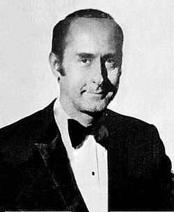

# Henry Mancini

## Biografía

Henry Mancini, nacido Enrico Nicola Mancini; (Maple Heights, Ohio, 16 de abril de 1924-Beverly Hills, California, 14 de junio de 1994), fue un célebre compositor, director de orquesta, arreglista, pianista y flautista estadounidense de música de cine, de jazz y de influencias latinas.​​ Se le considera uno de los más grandes compositores en la historia del cine,​ ganador de cuatro premios Óscar, un Globo de Oro y veinte Grammys, así como un Grammy póstumo por su carrera en 1995. Entre sus trabajos más reconocidos están el tema y banda sonora para las series de televisión Peter Gunn, la banda sonora de La pantera rosa (por la que ganó un Grammy) y su colaboración en las comedias de Blake Edwards, en la que destaca la canción «Moon River» (de Desayuno con diamantes, 1961). Fue el creador de los temas de varias series de televisión (algunas de dibujos animados): Remington Steele (con Pierce Brosnan), El pájaro espino o Peter Gunn, entre otras (sus composiciones para la saga de La Pantera Rosa, el tema de La pantera rosa y el tema de A Shot In the Dark fueron posteriormente usados en las series animadas de la Pantera Rosa y en los cortometrajes del Inspector Closeau, respectivamente). Además compuso las bandas sonoras de Desayuno con diamantes, Charada, Días de vino y rosas, Dear Heart, La carrera del siglo, Dos en la carretera y Victor Victoria. Fue muy llamativo que Mancini obtuviese su único n.º 1 en las listas Billboard durante la era del rock. Sus arreglos y grabación del tema «Love theme from Romeo and Juliet» (Tema de amor de amor de Romeo y Julieta) subió al n.° 1 el 29 de junio de 1969, manteniéndose en ese puesto dos semanas.

## Estilo musical

Henry Mancini, nacido Enrico Nicola Mancini; ( Maple Heights, Ohio, 16 de abril de 1924- Beverly Hills, California, 14 de junio de 1994), fue un célebre compositor, director de orquesta, arreglista, pianista y flautista estadounidense de música de cine, de jazz y de influencias latinas. [ 1 ] ​ [ 2 ] ​ Se le considera uno de los más grandes compositores en la historia del cine, [ 3 ] ​ ganador de cuatro premios Óscar, un Globo de Oro y veinte Grammys, así como un Grammy póstumo por su carrera en 1995.

## Anécdotas y curiosidades

Henry Mancini (/ m æ n ˈ s iː n i / man- SEE -nee; nacido Enrico Nicola Mancini; 16 de abril de 1924 - 14 de junio de 1994) [1] fue un compositor, director, arreglista, pianista y flautista estadounidense. A menudo citado como uno de los más grandes compositores en la historia del cine, [ 2 ] [ 3 ] ganó cuatro premios de la Academia, un Globo de Oro y veinte premios Grammy, además de un premio Grammy póstumo a la trayectoria en 1995.

## Top 10 bandas sonoras

1. ***Breakfast at Tiffany's (Título en España: Desayuno con diamantes)***
    * **Póster:** [link](039_henry_mancini/posters/poster_breakfast_at_tiffany_s_1961.jpg)
2. ***Charade (Título en España: Charada)***
    * **Póster:** [link](039_henry_mancini/posters/poster_charade_1963.jpg)
3. ***Victor/Victoria (Título en España: ¿Víctor o Victoria?)***
    * **Póster:** [link](039_henry_mancini/posters/poster_victor_victoria_1982.jpg)
4. ***The Pink Panther (Título en España: La pantera rosa)***
    * **Póster:** [link](039_henry_mancini/posters/poster_the_pink_panther_1963.jpg)
5. ***10 (Título en España: 10, la mujer perfecta)***
    * **Póster:** [link](039_henry_mancini/posters/poster_10_1979.jpg)
6. ***Days of Wine and Roses (Título en España: Días de vino y rosas)***
    * **Póster:** [link](039_henry_mancini/posters/poster_days_of_wine_and_roses_1963.jpg)
7. ***The Glenn Miller Story (Título en España: Música y lágrimas)***
    * **Póster:** [link](039_henry_mancini/posters/poster_the_glenn_miller_story_1954.jpg)
8. ***Touch of Evil (Título en España: Sed de mal)***
    * **Póster:** [link](039_henry_mancini/posters/poster_touch_of_evil_1958.jpg)
9. ***The Great Mouse Detective (Título en España: Basil, el ratón superdetective)***
    * **Póster:** [link](039_henry_mancini/posters/poster_the_great_mouse_detective_1986.jpg)
10. ***Creature from the Black Lagoon (Título en España: La mujer y el monstruo)***
    * **Póster:** [link](039_henry_mancini/posters/poster_creature_from_the_black_lagoon_1954.jpg)

## Filmografía completa

- Back at the Front (Título en España: Back at the Front) (1952) · [Póster](039_henry_mancini/posters/poster_back_at_the_front_1952.jpg)
- Horizons West (Título en España: Horizontes del Oeste) (1952) · [Póster](039_henry_mancini/posters/poster_horizons_west_1952.jpg)
- Lost in Alaska (Título en España: Perdidos en Alaska) (1952) · [Póster](039_henry_mancini/posters/poster_lost_in_alaska_1952.jpg)
- The Raiders (Título en España: The Raiders) (1952) · [Póster](039_henry_mancini/posters/poster_the_raiders_1952.jpg)
- Abbott and Costello Go to Mars (Título en España: Abbott y Costello van a Marte) (1953) · [Póster](039_henry_mancini/posters/poster_abbott_and_costello_go_to_mars_1953.jpg)
- Girls in the Night (Título en España: Girls in the Night) (1953) · [Póster](039_henry_mancini/posters/poster_girls_in_the_night_1953.jpg)
- City Beneath the Sea (Título en España: La ciudad bajo el agua) (1953) · [Póster](039_henry_mancini/posters/poster_city_beneath_the_sea_1953.jpg)
- The Lone Hand (Título en España: La mano solitaria) (1953) · [Póster](039_henry_mancini/posters/poster_the_lone_hand_1953.jpg)
- Seminole (Título en España: Traición en Fort King) (1953) · [Póster](039_henry_mancini/posters/poster_seminole_1953.jpg)
- It Came from Outer Space (Título en España: Vinieron del espacio) (1953) · [Póster](039_henry_mancini/posters/poster_it_came_from_outer_space_1953.jpg)
- Creature from the Black Lagoon (Título en España: La mujer y el monstruo) (1954) · [Póster](039_henry_mancini/posters/poster_creature_from_the_black_lagoon_1954.jpg)
- The Glenn Miller Story (Título en España: Música y lágrimas) (1954) · [Póster](039_henry_mancini/posters/poster_the_glenn_miller_story_1954.jpg)
- Saskatchewan (Título en España: Rebelión en el fuerte) (1954) · [Póster](039_henry_mancini/posters/poster_saskatchewan_1954.jpg)
- The Far Country (Título en España: Tierras lejanas) (1954) · [Póster](039_henry_mancini/posters/poster_the_far_country_1954.jpg)
- Abbott and Costello Meet the Mummy (Título en España: Abbott y Costello Contra la Momia) (1955) · [Póster](039_henry_mancini/posters/poster_abbott_and_costello_meet_the_mummy_1955.jpg)
- Abbott and Costello Meet the Keystone Kops (Título en España: Abbott y Costello contra la poli) (1955) · [Póster](039_henry_mancini/posters/poster_abbott_and_costello_meet_the_keystone_kops_1955.jpg)
- Ma and Pa Kettle at Waikiki (Título en España: Ma and Pa Kettle at Waikiki) (1955) · [Póster](039_henry_mancini/posters/poster_ma_and_pa_kettle_at_waikiki_1955.jpg)
- The Creature Walks Among Us (Título en España: El monstruo camina entre nosotros) (1956) · [Póster](039_henry_mancini/posters/poster_the_creature_walks_among_us_1956.jpg)
- Rock, Pretty Baby (Título en España: Rock, Pretty Baby) (1956) · [Póster](039_henry_mancini/posters/poster_rock_pretty_baby_1956.jpg)
- The Kettles in the Ozarks (Título en España: The Kettles in the Ozarks) (1956) · [Póster](039_henry_mancini/posters/poster_the_kettles_in_the_ozarks_1956.jpg)
- Man Afraid (Título en España: Man Afraid) (1957) · [Póster](039_henry_mancini/posters/poster_man_afraid_1957.jpg)
- The Monolith Monsters (Título en España: Monstruos de piedra (The Monolith Monsters)) (1957) · [Póster](039_henry_mancini/posters/poster_the_monolith_monsters_1957.jpg)
- Joe Dakota (Título en España: Sediento de justicia) (1957) · [Póster](039_henry_mancini/posters/poster_joe_dakota_1957.jpg)
- The Night Runner (Título en España: The Night Runner) (1957) · [Póster](039_henry_mancini/posters/poster_the_night_runner_1957.jpg)
- The Land Unknown (Título en España: Tierra desconocida) (1957) · [Póster](039_henry_mancini/posters/poster_the_land_unknown_1957.jpg)
- Touch of Evil (Título en España: Sed de mal) (1958) · [Póster](039_henry_mancini/posters/poster_touch_of_evil_1958.jpg)
- Summer Love (Título en España: Summer Love) (1958) · [Póster](039_henry_mancini/posters/poster_summer_love_1958.jpg)
- Voice in the Mirror (Título en España: Voice in the Mirror) (1958) · [Póster](039_henry_mancini/posters/poster_voice_in_the_mirror_1958.jpg)
- Imitation of Life (Título en España: Imitación a la vida) (1959) · [Póster](039_henry_mancini/posters/poster_imitation_of_life_1959.jpg)
- High Time (Título en España: Buenos tiempos) (1960) · [Póster](039_henry_mancini/posters/poster_high_time_1960.jpg)
- The Great Impostor (Título en España: El gran impostor) (1960) · [Póster](039_henry_mancini/posters/poster_the_great_impostor_1960.jpg)
- Breakfast at Tiffany's (Título en España: Desayuno con diamantes) (1961) · [Póster](039_henry_mancini/posters/poster_breakfast_at_tiffany_s_1961.jpg)
- Bachelor in Paradise (Título en España: Soltero en el paraíso) (1961) · [Póster](039_henry_mancini/posters/poster_bachelor_in_paradise_1961.jpg)
- Experiment in Terror (Título en España: Chantaje contra una mujer) (1962) · [Póster](039_henry_mancini/posters/poster_experiment_in_terror_1962.jpg)
- Hatari! (Título en España: Hatari!) (1962) · [Póster](039_henry_mancini/posters/poster_hatari_1962.jpg)
- Mr. Hobbs Takes a Vacation (Título en España: Un optimista de vacaciones) (1962) · [Póster](039_henry_mancini/posters/poster_mr_hobbs_takes_a_vacation_1962.jpg)
- Charade (Título en España: Charada) (1963) · [Póster](039_henry_mancini/posters/poster_charade_1963.jpg)
- Soldier in the Rain (Título en España: Compañeros de armas y puñetazos) (1963) · [Póster](039_henry_mancini/posters/poster_soldier_in_the_rain_1963.jpg)
- Days of Wine and Roses (Título en España: Días de vino y rosas) (1963) · [Póster](039_henry_mancini/posters/poster_days_of_wine_and_roses_1963.jpg)
- The Pink Panther (Título en España: La pantera rosa) (1963) · [Póster](039_henry_mancini/posters/poster_the_pink_panther_1963.jpg)
- Carol for Another Christmas (Título en España: Canción para otra Navidad) (1964) · [Póster](039_henry_mancini/posters/poster_carol_for_another_christmas_1964.jpg)
- A Shot in the Dark (Título en España: El nuevo caso del inspector Clouseau) (1964) · [Póster](039_henry_mancini/posters/poster_a_shot_in_the_dark_1964.jpg)
- Man's Favorite Sport? (Título en España: Su juego favorito) (1964) · [Póster](039_henry_mancini/posters/poster_man_s_favorite_sport_1964.jpg)
- The Great Race (Título en España: La carrera del siglo) (1965) · [Póster](039_henry_mancini/posters/poster_the_great_race_1965.jpg)
- Dear Heart (Título en España: Querido corazón) (1965) · [Póster](039_henry_mancini/posters/poster_dear_heart_1965.jpg)
- The Music of Lennon & McCartney (Título en España: The Music of Lennon & McCartney) (1965) · [Póster](039_henry_mancini/posters/poster_the_music_of_lennon_mccartney_1965.jpg)
- Arabesque (Título en España: Arabesco) (1966) · [Póster](039_henry_mancini/posters/poster_arabesque_1966.jpg)
- Moment to Moment (Título en España: Momento a momento) (1966) · [Póster](039_henry_mancini/posters/poster_moment_to_moment_1966.jpg)
- Pink, Plunk, Plink (Título en España: Pink, Plunk, Plink) (1966) · [Póster](039_henry_mancini/posters/poster_pink_plunk_plink_1966.jpg)
- What Did You Do in the War, Daddy? (Título en España: ¿Qué hiciste en la guerra, papi?) (1966) · [Póster](039_henry_mancini/posters/poster_what_did_you_do_in_the_war_daddy_1966.jpg)
- Two for the Road (Título en España: Dos en la carretera) (1967) · [Póster](039_henry_mancini/posters/poster_two_for_the_road_1967.jpg)
- Gunn (Título en España: Gunn) (1967) · [Póster](039_henry_mancini/posters/poster_gunn_1967.jpg)
- Wait Until Dark (Título en España: Sola en la oscuridad) (1967) · [Póster](039_henry_mancini/posters/poster_wait_until_dark_1967.jpg)
- The Party (Título en España: El guateque) (1968) · [Póster](039_henry_mancini/posters/poster_the_party_1968.jpg)
- Gaily, Gaily (Título en España: Los locos años de Chicago) (1969) · [Póster](039_henry_mancini/posters/poster_gaily_gaily_1969.jpg)
- Me, Natalie (Título en España: Me, Natalie) (1969) · [Póster](039_henry_mancini/posters/poster_me_natalie_1969.jpg)
- Darling Lili (Título en España: Darling Lili) (1970) · [Póster](039_henry_mancini/posters/poster_darling_lili_1970.jpg)
- I girasoli (Título en España: Los girasoles) (1970) · [Póster](039_henry_mancini/posters/poster_i_girasoli_1970.jpg)
- The Hawaiians (Título en España: Los indomables) (1970) · [Póster](039_henry_mancini/posters/poster_the_hawaiians_1970.jpg)
- The Molly Maguires (Título en España: Odio en las entrañas) (1970) · [Póster](039_henry_mancini/posters/poster_the_molly_maguires_1970.jpg)
- Sometimes a Great Notion (Título en España: Casta invencible) (1971) · [Póster](039_henry_mancini/posters/poster_sometimes_a_great_notion_1971.jpg)
- The Night Visitor (Título en España: El visitante nocturno) (1971) · [Póster](039_henry_mancini/posters/poster_the_night_visitor_1971.jpg)
- Sam Cade (Título en España: Sam Cade) (1972) · [Póster](039_henry_mancini/posters/poster_sam_cade_1972.jpg)
- The Marshal of Madrid (Título en España: The Marshal of Madrid) (1972) · [Póster](039_henry_mancini/posters/poster_the_marshal_of_madrid_1972.jpg)
- Ann-Margret: When You're Smiling (Título en España: Ann-Margret: When You're Smiling) (1973) · [Póster](039_henry_mancini/posters/poster_ann_margret_when_you_re_smiling_1973.jpg)
- The Thief Who Came to Dinner (Título en España: El ladrón que vino a cenar) (1973) · [Póster](039_henry_mancini/posters/poster_the_thief_who_came_to_dinner_1973.jpg)
- Oklahoma Crude (Título en España: Oklahoma, año 10) (1973) · [Póster](039_henry_mancini/posters/poster_oklahoma_crude_1973.jpg)
- Visions of Eight (Título en España: Visions of Eight) (1973) · [Póster](039_henry_mancini/posters/poster_visions_of_eight_1973.jpg)
- 99 and 44/100% Dead (Título en España: 99,44% muerto) (1974) · [Póster](039_henry_mancini/posters/poster_99_and_44_100_dead_1974.jpg)
- The Girl from Petrovka (Título en España: La chica de Petrovka) (1974) · [Póster](039_henry_mancini/posters/poster_the_girl_from_petrovka_1974.jpg)
- The White Dawn (Título en España: The White Dawn) (1974) · [Póster](039_henry_mancini/posters/poster_the_white_dawn_1974.jpg)
- That's Entertainment! (Título en España: Érase una vez en Hollywood) (1974) · [Póster](039_henry_mancini/posters/poster_that_s_entertainment_1974.jpg)
- The Great Waldo Pepper (Título en España: El carnaval de las águilas) (1975) · [Póster](039_henry_mancini/posters/poster_the_great_waldo_pepper_1975.jpg)
- The Return of the Pink Panther (Título en España: El regreso de la pantera rosa) (1975) · [Póster](039_henry_mancini/posters/poster_the_return_of_the_pink_panther_1975.jpg)
- Once Is Not Enough (Título en España: Una vez no basta) (1975) · [Póster](039_henry_mancini/posters/poster_once_is_not_enough_1975.jpg)
- Alex & the Gypsy (Título en España: Alex & the Gypsy) (1976) · [Póster](039_henry_mancini/posters/poster_alex_the_gypsy_1976.jpg)
- Silver Streak (Título en España: El expreso de Chicago) (1976) · [Póster](039_henry_mancini/posters/poster_silver_streak_1976.jpg)
- The Pink Panther Strikes Again (Título en España: La pantera rosa ataca de nuevo) (1976) · [Póster](039_henry_mancini/posters/poster_the_pink_panther_strikes_again_1976.jpg)
- W.C. Fields and Me (Título en España: W.C. Fields and Me) (1976) · [Póster](039_henry_mancini/posters/poster_w_c_fields_and_me_1976.jpg)
- Angela (Título en España: Ángela) (1977) · [Póster](039_henry_mancini/posters/poster_angela_1977.jpg)
- A Family Upside Down (Título en España: A Family Upside Down) (1978) · [Póster](039_henry_mancini/posters/poster_a_family_upside_down_1978.jpg)
- House Calls (Título en España: Alegrías de un viudo) (1978) · [Póster](039_henry_mancini/posters/poster_house_calls_1978.jpg)
- Funny Business (Título en España: Funny Business) (1978) · [Póster](https://example.com/placeholder.jpg)
- A Pink Christmas (Título en España: La pantera rosa: navidades rosas) (1978) · [Póster](039_henry_mancini/posters/poster_a_pink_christmas_1978.jpg)
- Revenge of the Pink Panther (Título en España: La venganza de la pantera rosa) (1978) · [Póster](039_henry_mancini/posters/poster_revenge_of_the_pink_panther_1978.jpg)
- Who Is Killing the Great Chefs of Europe? (Título en España: Pero... ¿quién mata a los grandes chefs?) (1978) · [Póster](039_henry_mancini/posters/poster_who_is_killing_the_great_chefs_of_europe_1978.jpg)
- 10 (Título en España: 10, la mujer perfecta) (1979) · [Póster](039_henry_mancini/posters/poster_10_1979.jpg)
- Nightwing (Título en España: Alas en la noche) (1979) · [Póster](039_henry_mancini/posters/poster_nightwing_1979.jpg)
- The Prisoner of Zenda (Título en España: El estrafalario prisionero de Zenda) (1979) · [Póster](039_henry_mancini/posters/poster_the_prisoner_of_zenda_1979.jpg)
- The Best Place to Be (Título en España: The Best Place to Be) (1979) · [Póster](039_henry_mancini/posters/poster_the_best_place_to_be_1979.jpg)
- Little Miss Marker (Título en España: El truhán y su prenda) (1980) · [Póster](039_henry_mancini/posters/poster_little_miss_marker_1980.jpg)
- Pink Panther in Olym-pinks (Título en España: Pink Panther in Olym-pinks) (1980) · [Póster](039_henry_mancini/posters/poster_pink_panther_in_olym_pinks_1980.jpg)
- A Change of Seasons (Título en España: Sólo para adultos) (1980) · [Póster](039_henry_mancini/posters/poster_a_change_of_seasons_1980.jpg)
- The Shadow Box (Título en España: The Shadow Box) (1980) · [Póster](039_henry_mancini/posters/poster_the_shadow_box_1980.jpg)
- Condorman (Título en España: Cóndorman) (1981) · [Póster](039_henry_mancini/posters/poster_condorman_1981.jpg)
- Back Roads (Título en España: Dos hacia California) (1981) · [Póster](039_henry_mancini/posters/poster_back_roads_1981.jpg)
- Mommie Dearest (Título en España: Queridísima mamá) (1981) · [Póster](039_henry_mancini/posters/poster_mommie_dearest_1981.jpg)
- S.O.B. (Título en España: S.O.B. Sois honrados bandidos) (1981) · [Póster](039_henry_mancini/posters/poster_s_o_b_1981.jpg)
- The Pink Panther in 'Pink at First Sight' (Título en España: The Pink Panther in 'Pink at First Sight') (1981) · [Póster](039_henry_mancini/posters/poster_the_pink_panther_in_pink_at_first_sight_1981.jpg)
- Trail of the Pink Panther (Título en España: Tras la pista de la pantera rosa) (1982) · [Póster](039_henry_mancini/posters/poster_trail_of_the_pink_panther_1982.jpg)
- Victor/Victoria (Título en España: ¿Víctor o Victoria?) (1982) · [Póster](039_henry_mancini/posters/poster_victor_victoria_1982.jpg)
- Better Late Than Never (Título en España: Better Late Than Never) (1983) · [Póster](039_henry_mancini/posters/poster_better_late_than_never_1983.jpg)
- Curse of the Pink Panther (Título en España: La maldición de la pantera rosa) (1983) · [Póster](039_henry_mancini/posters/poster_curse_of_the_pink_panther_1983.jpg)
- The Man Who Loved Women (Título en España: Mis problemas con las mujeres) (1983) · [Póster](039_henry_mancini/posters/poster_the_man_who_loved_women_1983.jpg)
- Second Thoughts (Título en España: Second Thoughts) (1983) · [Póster](039_henry_mancini/posters/poster_second_thoughts_1983.jpg)
- Harry & Son (Título en España: Harry e hijo) (1984) · [Póster](039_henry_mancini/posters/poster_harry_son_1984.jpg)
- I Love Quincy (Título en España: I Love Quincy) (1984) · [Póster](039_henry_mancini/posters/poster_i_love_quincy_1984.jpg)
- Royal Variety Performance 1984 (Título en España: Royal Variety Performance 1984) (1984) · [Póster](039_henry_mancini/posters/poster_royal_variety_performance_1984_1984.jpg)
- Lifeforce (Título en España: Lifeforce, fuerza vital) (1985) · [Póster](039_henry_mancini/posters/poster_lifeforce_1985.jpg)
- Santa Claus: The Movie (Título en España: Santa Claus, la película) (1985) · [Póster](039_henry_mancini/posters/poster_santa_claus_the_movie_1985.jpg)
- Santa Claus: The Making of the Movie (Título en España: Santa Claus: The Making of the Movie) (1985) · [Póster](039_henry_mancini/posters/poster_santa_claus_the_making_of_the_movie_1985.jpg)
- That's Dancing! (Título en España: ¡Esto sí es bailar!) (1985) · [Póster](039_henry_mancini/posters/poster_that_s_dancing_1985.jpg)
- The Great Mouse Detective (Título en España: Basil, el ratón superdetective) (1986) · [Póster](039_henry_mancini/posters/poster_the_great_mouse_detective_1986.jpg)
- A Fine Mess (Título en España: El gran enredo) (1986) · [Póster](039_henry_mancini/posters/poster_a_fine_mess_1986.jpg)
- That's Life! (Título en España: ¡Así es la vida!) (1986) · [Póster](039_henry_mancini/posters/poster_that_s_life_1986.jpg)
- Blind Date (Título en España: Cita a ciegas) (1987) · [Póster](039_henry_mancini/posters/poster_blind_date_1987.jpg)
- Murder by the Book (Título en España: El misterioso caso de mí otro yo) (1987) · [Póster](039_henry_mancini/posters/poster_murder_by_the_book_1987.jpg)
- The Glass Menagerie (Título en España: El zoo de cristal) (1987) · [Póster](039_henry_mancini/posters/poster_the_glass_menagerie_1987.jpg)
- Sunset (Título en España: Asesinato en Beverly Hills) (1988) · [Póster](039_henry_mancini/posters/poster_sunset_1988.jpg)
- Justin Case (Título en España: Ese fantasma es mi jefe) (1988) · [Póster](039_henry_mancini/posters/poster_justin_case_1988.jpg)
- Without a Clue (Título en España: Sin Pistas) (1988) · [Póster](039_henry_mancini/posters/poster_without_a_clue_1988.jpg)
- Physical Evidence (Título en España: Contra toda ley) (1989) · [Póster](039_henry_mancini/posters/poster_physical_evidence_1989.jpg)
- Peter Gunn (Título en España: Peter Gunn) (1989) · [Póster](039_henry_mancini/posters/poster_peter_gunn_1989.jpg)
- Skin Deep (Título en España: Una cana al aire) (1989) · [Póster](039_henry_mancini/posters/poster_skin_deep_1989.jpg)
- Welcome Home (Título en España: Welcome Home) (1989) · [Póster](039_henry_mancini/posters/poster_welcome_home_1989.jpg)
- Fear (Título en España: Agente oculto) (1990) · [Póster](039_henry_mancini/posters/poster_fear_1990.jpg)
- Ghost Dad (Título en España: Papá fantasma) (1990) · [Póster](039_henry_mancini/posters/poster_ghost_dad_1990.jpg)
- Seriously... Phil Collins (Título en España: Seriously... Phil Collins) (1990) · [Póster](039_henry_mancini/posters/poster_seriously_phil_collins_1990.jpg)
- Married to It (Título en España: Casado con eso) (1991) · [Póster](039_henry_mancini/posters/poster_married_to_it_1991.jpg)
- Never Forget (Título en España: Never Forget) (1991) · [Póster](039_henry_mancini/posters/poster_never_forget_1991.jpg)
- Switch (Título en España: Una rubia muy dudosa) (1991) · [Póster](039_henry_mancini/posters/poster_switch_1991.jpg)
- Tom and Jerry: The Movie (Título en España: Tom y Jerry: la película) (1992) · [Póster](039_henry_mancini/posters/poster_tom_and_jerry_the_movie_1992.jpg)
- You Must Remember This: A Tribute to 'Casablanca' (Título en España: You Must Remember This: A Tribute to 'Casablanca') (1992) · [Póster](039_henry_mancini/posters/poster_you_must_remember_this_a_tribute_to_casablanca_1992.jpg)
- Audrey Hepburn: Remembered (Título en España: Audrey Hepburn: Remembered) (1993) · [Póster](039_henry_mancini/posters/poster_audrey_hepburn_remembered_1993.jpg)
- Son of the Pink Panther (Título en España: El hijo de la Pantera Rosa) (1993) · [Póster](039_henry_mancini/posters/poster_son_of_the_pink_panther_1993.jpg)
- Henry Mancini: More Than Music (Título en España: Henry Mancini: More Than Music) (2009) · [Póster](039_henry_mancini/posters/poster_henry_mancini_more_than_music_2009.jpg)
- Piano Cinéma (Título en España: Piano Cinéma) (2022) · [Póster](039_henry_mancini/posters/poster_piano_cin_ma_2022.jpg)

## Premios y nominaciones

* 1955 – Premio de la Academia a la mejor partitura musical original – por *The Glenn Miller Story (Título en España: Música y lágrimas)* – (Nominación)
* 1959 – Premio Grammy al Álbum del Año – por *The Music from Peter Gunn* – (Ganador)
* 1962 – Premio Grammy a la Canción del Año – por *Moon River (Título en España: Moon River)* – (Ganador)
* 1962 – Premio de la Academia a la mejor banda sonora original de comedia o drama – por *Breakfast at Tiffany's (Título en España: Desayuno con diamantes)* – (Ganador)
* 1962 – Premio de la Academia a la mejor banda sonora original de comedia o drama – por *Breakfast at Tiffany's (Título en España: Desayuno con diamantes)* – (Nominación)
* 1962 – Premio de la Academia a la mejor canción original – (Nominación)
* 1962 – Premio de la Academia a la mejor canción original – por *Moon River (Título en España: Moon River)* – (Ganador)
* 1963 – Premio de la Academia a la mejor canción original – por *Days of Wine and Roses (Título en España: Días de vino y rosas)* – (Ganador)
* 1964 – Premio Grammy a la Canción del Año – por *Days of Wine and Roses (Título en España: Días de vino y rosas)* – (Ganador)
* 1964 – Premio de la Academia a la mejor canción original – por *Charade (Título en España: Charada)* – (Nominación)
* 1965 – Premio de la Academia a la mejor banda sonora original – por *The Pink Panther (Título en España: La pantera rosa)* – (Nominación)
* 1965 – Premio de la Academia a la mejor canción original – por *Dear Heart (Título en España: Querido corazón)* – (Nominación)
* 1966 – Premio de la Academia a la mejor canción original – por *The Sweetheart Tree* – (Nominación)
* 1971 – Premio de la Academia a la mejor banda sonora original – por *Darling Lili (Título en España: Darling Lili)* – (Nominación)
* 1971 – Premio de la Academia a la mejor banda sonora original – por *Sunflower (Título en España: Sunflower)* – (Nominación)
* 1971 – Premio de la Academia a la mejor canción original – (Nominación)
* 1972 – Premio de la Academia a la mejor canción original – por *All His Children* – (Nominación)
* 1977 – Premio de la Academia a la mejor canción original – (Nominación)
* 1980 – Premio de la Academia a la mejor banda sonora original – por *10 (Título en España: 10, la mujer perfecta)* – (Nominación)
* 1980 – Premio de la Academia a la mejor canción original – por *¿Quién dice que es fácil? (Título en España: ¿Quién dice que es fácil?)* – (Nominación)
* 1981 – Premio Golden Raspberry a la peor canción original – por *Where Do You Catch The Bus For Tomorrow?* – (Nominación)
* 1983 – Premio de la Academia a la mejor banda sonora original – por *Victor/Victoria (Título en España: ¿Víctor o Victoria?)* – (Ganador)
* 1983 – Premio de la Academia a la mejor banda sonora original – por *Victor/Victoria (Título en España: ¿Víctor o Victoria?)* – (Nominación)
* 1987 – Premio Golden Raspberry a la peor canción original – por *Life in a Looking Glass* – (Nominación)
* 1987 – Premio de la Academia a la mejor canción original – por *Life in a Looking Glass* – (Nominación)
* 1995 – Premio Grammy a la trayectoria – (Ganador)
* estrella en el Paseo de la Fama de Hollywood – (Ganador)

## Fuentes adicionales

* [MundoBSO](https://www.mundobso.com/compositor/mancini-henry) — site:mundobso.com
* [MundoBSO (2)](https://www.mundobso.com/agoras/los-aradanos-de-moon-river) — site:mundobso.com
* [MundoBSO (3)](https://www.mundobso.com/bso/milla-verde-la) — site:mundobso.com
* [Film Score Monthly](https://www.filmscoremonthly.com/cds/detail.cfm/CDID/428/Thief-Who-Came-to-Dinner-The/) — site:filmscoremonthly.com
* [Film Score Monthly (2)](https://www.filmscoremonthly.com/cds/detail.cfm/CDID/383/Wait-Until-Dark/) — site:filmscoremonthly.com
* [Film Score Monthly (3)](https://www.filmscoremonthly.com/cds/detail.cfm/CDID/318/Penelope-Bachelor-in-Paradise/) — site:filmscoremonthly.com
* [SoundtrackCollector](https://www.soundtrackcollector.com/catalog/composerdiscography.php?composerid=140&offset=1280) — site:soundtrackcollector.com
* [SoundtrackCollector (2)](https://www.soundtrackcollector.com/title/5604/Great+Mouse+Detective,+The) — site:soundtrackcollector.com
* [SoundtrackCollector (3)](https://www.soundtrackcollector.com/title/5738/Touch+Of+Evil) — site:soundtrackcollector.com
* [WhatSong](https://www.whatsong.org/tvshow/friends/episode/1164) — site:whatsong.org
* [WhatSong (2)](https://www.whatsong.org/tvshow/malcolm-in-the-middle/episode/38050) — site:whatsong.org
* [WhatSong (3)](https://www.whatsong.org/tvshow/better-call-saul/episode/27168) — site:whatsong.org

## Notas externas

* MundoBSO: Nació en Cleveland (EE UU), el 16 de abril de 1924, y murió en Los Ángeles (EE UU), el 14 de junio de 1994. Empezó en la Universal como arreglista, orquestador y compositor, abordando un amplio abanico de géneros, lo que le daría una importante formación en el manejo de pequeñas orquestas y en la experimentación instrumental. Esta etapa duró seis años en casi un centenar de producciones, hasta que se le asignó en solitario su primer proyecto importante, Touch of Evil (57), de Orson Welles, que supuso un importante giro en la tradición musical imperante en Hollywood. Pero, aunque se elogió su banda sonora, fue despedido por una reducción de plantilla, lo que le enfrentó a un período de...
* MundoBSO (3): Compositor: Newman, Thomas Sello: Warner Duración: 66 minutos Información de la película Título original: The Green Mile Director: Frank Darabont Nacionalidad: EE UU Año: 1999 Argumento A mediados de los años treinta, un guarda de prisiones que custodia a los condenados a muerte descubre poderes sobrenaturales en un inmenso hombre negro, acusado de haber asesinado a dos niñas. Eso le llevará a creer en su inocencia. Premios Saturn: 1 nominación Compositor: Newman, Thomas Sello: Warner Duración: 66 minutos
* SoundtrackCollector (2): Las aventuras del gran detective ratón, The (1992, título de reedición)
* WhatSong: Episodio 7 - El de la cama de coche de carreras (2 canciones) Henry Mancini - Grandes éxitos: Lo mejor de Henry Mancini (remasterizado)
* WhatSong (2): Henry Mancini - Greatest Hits: The Best of Henry Mancini (Remastered) Cuando Francis le enseña a bailar el vals a Otto (probablemente no sea la misma versión, pero seguro que es la canción original)
* WhatSong (3): Al Kooper, Mike Bloomfield y Stephen Stills - Super Session (versión Bonus Track) Henry Mancini and His Orchestra - Colección Platinum & Gold: Henry Mancini
* www.henrymancini.com: Falta traducción: en.general.social.links.apple Falta traducción: en.general.social.links.spotify
* sdemergencia.com: Sala de emergencias Transgresiones Sonoras La vida de los otros Galería emergente Artes Visuales Fotografía Monitos y Monotes
* themoviescores.com: Cleveland, Ohio, Estados Unidos, 16 de abril de 1924 – Beverly Hills, Los Angeles, California, Estados Unidos, 14 de junio de 1994 (70 años) Enrico Nicola Mancini fue un pianista, flautista, arreglista, director de orquesta y compositor de jazz, canciones y música de cine y televisión, sin duda uno de los más famosos y reconocidos de la historia de la banda sonora, y célebre por su popular tema de La pantera rosa y la canción “Moon River” del film Desayuno con diamantes, frutos de su extensa y exitosa colaboración con el director Blake Edwards.
* www.classical-music.com: Quizás sea mejor conocido por 'Moon River' y 'La Pantera Rosa'. En verdad, Henry Mancini ayudó a definir toda una era gloriosa de la música cinematográfica. Ganador de 20 premios Grammy y cuatro premios Oscar, Henry Mancini fue una de las figuras más populares de la música durante décadas. Como compositor, arreglista y director de orquesta era realmente versátil, tanto en el podio del concierto como en el estudio de grabación.
* hmi.frost.miami.edu: Escuelas Escuela de Arquitectura Facultad de Artes y Ciencias Miami Escuela de Negocios Herbert Escuela de Comunicación Escuela de Educación y Desarrollo Humano Facultad de Ingeniería Facultad de Derecho Escuela Rosenstiel de Ciencias Marinas, Atmosféricas y de la Tierra Escuela Miller de Medicina Escuela Frost de Música Escuela de Enfermería y Estudios de Salud La Escuela de Graduados División de Educación Continua e Internacional Escuela Rosenstiel de Ciencias Marinas, Atmosféricas y de la Tierra
* mosma.es: CONTACTO Suscripción online Consultas Quejas y sugerencias Contacto por departamentos
