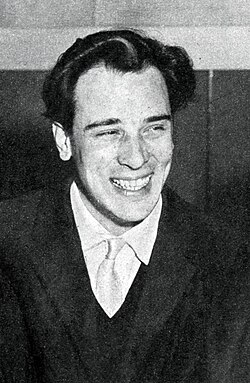

# Riz Ortolani

## Biografía

Riziero "Riz" Ortolani (Pésaro, 25 de marzo de 1926-Roma, 23 de enero de 2014)​ fue un compositor italiano de música de cine.

## Estilo musical

A nivel internacional, es mejor conocido por sus bandas sonoras de género, en particular su música para películas mondo, giallo, terror y Spaghetti Western. Su composición más famosa es "More", que escribió para la infame película Mondo Cane. Ganó el premio Grammy de 1964 al mejor tema instrumental y fue nominada al premio de la Academia a la mejor canción original en la 36ª edición de los premios de la Academia. [ 3 ] La canción fue posteriormente versionada por Frank Sinatra, Kai Winding, Andy Williams, Roy Orbison y otros.

## Anécdotas y curiosidades

Riziero "Riz" Ortolani (pronunciación italiana: [ritˈtsjɛːro ˈritts ortoˈlaːni]; 25 de marzo de 1926 - 23 de enero de 2014) fue un compositor, director y orquestador italiano, predominantemente de bandas sonoras cinematográficas. [ 1 ] Compuso más de 200 películas y programas de televisión entre 1955 y 2014, con una carrera que abarca más de cincuenta años. [ 2 ]

## Top 10 bandas sonoras

1. ***The Yellow Rolls-Royce (Título en España: El Rolls Royce amarillo)***
    * **Póster:** [link](045_riz_ortolani/posters/poster_the_yellow_rolls_royce_1964.jpg)
2. ***Cannibal Holocaust (Título en España: Holocausto caníbal)***
    * **Póster:** [link](045_riz_ortolani/posters/poster_cannibal_holocaust_1980.jpg)
3. ***Il sorpasso (Título en España: La escapada)***
    * **Póster:** [link](045_riz_ortolani/posters/poster_il_sorpasso_1962.jpg)
4. ***Paprika (Título en España: Los burdeles de Paprika)***
    * **Póster:** [link](045_riz_ortolani/posters/poster_paprika_1991.jpg)
5. ***Danza macabra (Título en España: Danza macabra)***
    * **Póster:** [link](045_riz_ortolani/posters/poster_danza_macabra_1964.jpg)
6. ***Non si sevizia un paperino (Título en España: Angustia de silencio)***
    * **Póster:** [link](045_riz_ortolani/posters/poster_non_si_sevizia_un_paperino_1972.jpg)
7. ***Capriccio (Título en España: Amor y pasión)***
    * **Póster:** [link](045_riz_ortolani/posters/poster_capriccio_1987.jpg)
8. ***Africa Addio (Título en España: Adiós África)***
    * **Póster:** [link](045_riz_ortolani/posters/poster_africa_addio_1966.jpg)
9. ***Regalo di Natale (Título en España: Regalo di Natale)***
    * **Póster:** [link](045_riz_ortolani/posters/poster_regalo_di_natale_1986.jpg)
10. ***Zeder (Título en España: Zeder)***
    * **Póster:** [link](045_riz_ortolani/posters/poster_zeder_1983.jpg)

## Filmografía completa

- Processo all'amore (Título en España: Processo all'amore) (1956) · [Póster](045_riz_ortolani/posters/poster_processo_all_amore_1956.jpg)
- Música de Siempre (Título en España: Música de Siempre) (1958) · [Póster](045_riz_ortolani/posters/poster_m_sica_de_siempre_1958.jpg)
- Very Important Person (Título en España: Hoy es día de fuga) (1961) · [Póster](045_riz_ortolani/posters/poster_very_important_person_1961.jpg)
- Ursus nella valle dei leoni (Título en España: Ursus en el valle de los leones) (1961) · [Póster](045_riz_ortolani/posters/poster_ursus_nella_valle_dei_leoni_1961.jpg)
- Flying Clipper - Traumreise unter weißen Segeln (Título en España: Ese mundo maravilloso) (1962) · [Póster](045_riz_ortolani/posters/poster_flying_clipper_traumreise_unter_wei_en_segeln_1962.jpg)
- Il sorpasso (Título en España: La escapada) (1962) · [Póster](045_riz_ortolani/posters/poster_il_sorpasso_1962.jpg)
- La vergine di Norimberga (Título en España: El justiciero rojo) (1963) · [Póster](045_riz_ortolani/posters/poster_la_vergine_di_norimberga_1963.jpg)
- Il mondo di notte numero 3 (Título en España: Il mondo di notte numero 3) (1963) · [Póster](045_riz_ortolani/posters/poster_il_mondo_di_notte_numero_3_1963.jpg)
- Il crollo di Roma (Título en España: La caída de Roma) (1963) · [Póster](045_riz_ortolani/posters/poster_il_crollo_di_roma_1963.jpg)
- La donna nel mondo (Título en España: La donna nel mondo) (1963) · [Póster](045_riz_ortolani/posters/poster_la_donna_nel_mondo_1963.jpg)
- Brandy, el sheriff de Losatumba (Título en España: Brandy) (1964) · [Póster](045_riz_ortolani/posters/poster_brandy_el_sheriff_de_losatumba_1964.jpg)
- Danza macabra (Título en España: Danza macabra) (1964) · [Póster](045_riz_ortolani/posters/poster_danza_macabra_1964.jpg)
- The Yellow Rolls-Royce (Título en España: El Rolls Royce amarillo) (1964) · [Póster](045_riz_ortolani/posters/poster_the_yellow_rolls_royce_1964.jpg)
- El sabor de la venganza (Título en España: El sabor de la venganza) (1964) · [Póster](045_riz_ortolani/posters/poster_el_sabor_de_la_venganza_1964.jpg)
- El diablo también llora (Título en España: El diablo también llora) (1965) · [Póster](045_riz_ortolani/posters/poster_el_diablo_tambi_n_llora_1965.jpg)
- The Glory Guys (Título en España: Gloriosos camaradas) (1965) · [Póster](045_riz_ortolani/posters/poster_the_glory_guys_1965.jpg)
- Das Geheimnis der drei Dschunken (Título en España: Misión en Hong Kong) (1965) · [Póster](045_riz_ortolani/posters/poster_das_geheimnis_der_drei_dschunken_1965.jpg)
- Africa Addio (Título en España: Adiós África) (1966) · [Póster](045_riz_ortolani/posters/poster_africa_addio_1966.jpg)
- Operazione Goldman (Título en España: Operación Goldman) (1966) · [Póster](045_riz_ortolani/posters/poster_operazione_goldman_1966.jpg)
- Tiffany Memorandum (Título en España: Charada internacional) (1967) · [Póster](045_riz_ortolani/posters/poster_tiffany_memorandum_1967.jpg)
- La cintura di castità (Título en España: El cinturón de castidad) (1967) · [Póster](045_riz_ortolani/posters/poster_la_cintura_di_castit_1967.jpg)
- I giorni dell'ira (Título en España: El día de la ira) (1967) · [Póster](045_riz_ortolani/posters/poster_i_giorni_dell_ira_1967.jpg)
- La ragazza del bersagliere (Título en España: La ragazza del bersagliere) (1967) · [Póster](045_riz_ortolani/posters/poster_la_ragazza_del_bersagliere_1967.jpg)
- Requiescant (Título en España: Requiescant (descanse en paz)) (1967) · [Póster](045_riz_ortolani/posters/poster_requiescant_1967.jpg)
- Woman Times Seven (Título en España: Siete veces mujer) (1967) · [Póster](045_riz_ortolani/posters/poster_woman_times_seven_1967.jpg)
- Banditi a Milano (Título en España: Bandidos en Milán) (1968) · [Póster](045_riz_ortolani/posters/poster_banditi_a_milano_1968.jpg)
- Lo sbarco di Anzio (Título en España: La batalla de Anzio) (1968) · [Póster](045_riz_ortolani/posters/poster_lo_sbarco_di_anzio_1968.jpg)
- Kampf um Rom – 1. Teil (Título en España: La invasión de los bárbaros) (1968) · [Póster](045_riz_ortolani/posters/poster_kampf_um_rom_1_teil_1968.jpg)
- Le calde notti di Lady Hamilton (Título en España: Los amores de Lady Hamilton) (1968) · [Póster](045_riz_ortolani/posters/poster_le_calde_notti_di_lady_hamilton_1968.jpg)
- Al di là della legge (Título en España: Más allá de la ley) (1968) · [Póster](045_riz_ortolani/posters/poster_al_di_l_della_legge_1968.jpg)
- The Biggest Bundle of Them All (Título en España: Raquel y sus bribones) (1968) · [Póster](045_riz_ortolani/posters/poster_the_biggest_bundle_of_them_all_1968.jpg)
- Sequestro di persona (Título en España: Sequestro di persona) (1968) · [Póster](045_riz_ortolani/posters/poster_sequestro_di_persona_1968.jpg)
- Tenderly (Título en España: Tenderly) (1968) · [Póster](045_riz_ortolani/posters/poster_tenderly_1968.jpg)
- The Bliss of Mrs. Blossom (Título en España: The Bliss of Mrs. Blossom) (1968) · [Póster](045_riz_ortolani/posters/poster_the_bliss_of_mrs_blossom_1968.jpg)
- Il dito nella piaga (Título en España: El dedo en la llaga) (1969) · [Póster](045_riz_ortolani/posters/poster_il_dito_nella_piaga_1969.jpg)
- Kampf um Rom II - Der Verrat (Título en España: Kampf um Rom II - Der Verrat) (1969) · [Póster](045_riz_ortolani/posters/poster_kampf_um_rom_ii_der_verrat_1969.jpg)
- La cattura (Título en España: La cattura) (1969) · [Póster](045_riz_ortolani/posters/poster_la_cattura_1969.jpg)
- La coppia (Título en España: La coppia) (1969) · [Póster](045_riz_ortolani/posters/poster_la_coppia_1969.jpg)
- La notte dei serpenti (Título en España: La noche de las serpientes) (1969) · [Póster](045_riz_ortolani/posters/poster_la_notte_dei_serpenti_1969.jpg)
- O Cangaceiro (Título en España: O Cangaceiro) (1969) · [Póster](045_riz_ortolani/posters/poster_o_cangaceiro_1969.jpg)
- Una sull'altra (Título en España: Una historia perversa) (1969) · [Póster](045_riz_ortolani/posters/poster_una_sull_altra_1969.jpg)
- Andrea Doria -74 (Título en España: Andrea Doria -74) (1970) · [Póster](045_riz_ortolani/posters/poster_andrea_doria_74_1970.jpg)
- Con quale amore con quanto amore (Título en España: Con quale amore con quanto amore) (1970) · [Póster](045_riz_ortolani/posters/poster_con_quale_amore_con_quanto_amore_1970.jpg)
- La prima notte del dottor Danieli, industriale, col complesso del... giocattolo (Título en España: El impotentisimo) (1970) · [Póster](045_riz_ortolani/posters/poster_la_prima_notte_del_dottor_danieli_industriale_col_complesso_del_giocattolo_1970.jpg)
- Un caso di coscienza (Título en España: El último en saberlo) (1970) · [Póster](045_riz_ortolani/posters/poster_un_caso_di_coscienza_1970.jpg)
- The Adventures of Gerard (Título en España: Las aventuras de Gerard) (1970) · [Póster](045_riz_ortolani/posters/poster_the_adventures_of_gerard_1970.jpg)
- La colomba non deve volare (Título en España: Las ratas de la violencia) (1970) · [Póster](045_riz_ortolani/posters/poster_la_colomba_non_deve_volare_1970.jpg)
- Madron (Título en España: Madron) (1970) · [Póster](045_riz_ortolani/posters/poster_madron_1970.jpg)
- Ciakmull - L'uomo della vendetta (Título en España: Puerta abierta al infierno) (1970) · [Póster](045_riz_ortolani/posters/poster_ciakmull_l_uomo_della_vendetta_1970.jpg)
- Addio zio Tom (Título en España: Adiós tío Tom) (1971) · [Póster](045_riz_ortolani/posters/poster_addio_zio_tom_1971.jpg)
- Confessione di un commissario di polizia al procuratore della Repubblica (Título en España: Confesiones de un comisario) (1971) · [Póster](045_riz_ortolani/posters/poster_confessione_di_un_commissario_di_polizia_al_procuratore_della_repubblica_1971.jpg)
- Il merlo maschio (Título en España: El mirlo macho) (1971) · [Póster](045_riz_ortolani/posters/poster_il_merlo_maschio_1971.jpg)
- The Statue (Título en España: El placer de las damas) (1971) · [Póster](045_riz_ortolani/posters/poster_the_statue_1971.jpg)
- Nella stretta morsa del ragno (Título en España: La horrible noche del baile de los muertos) (1971) · [Póster](045_riz_ortolani/posters/poster_nella_stretta_morsa_del_ragno_1971.jpg)
- Non commettere atti impuri (Título en España: No cometais actos impuros) (1971) · [Póster](045_riz_ortolani/posters/poster_non_commettere_atti_impuri_1971.jpg)
- Non si sevizia un paperino (Título en España: Angustia de silencio) (1972) · [Póster](045_riz_ortolani/posters/poster_non_si_sevizia_un_paperino_1972.jpg)
- Jus primae noctis (Título en España: Derecho de pernada) (1972) · [Póster](045_riz_ortolani/posters/poster_jus_primae_noctis_1972.jpg)
- L'etrusco uccide ancora (Título en España: El Dios de la muerte asesina otra vez) (1972) · [Póster](045_riz_ortolani/posters/poster_l_etrusco_uccide_ancora_1972.jpg)
- Girolimoni, il mostro di Roma (Título en España: Girolimoni, el monstruo de Roma) (1972) · [Póster](045_riz_ortolani/posters/poster_girolimoni_il_mostro_di_roma_1972.jpg)
- The Valachi Papers (Título en España: Los secretos de la Cosa Nostra) (1972) · [Póster](045_riz_ortolani/posters/poster_the_valachi_papers_1972.jpg)
- Sette orchidee macchiate di rosso (Título en España: Siete orquídeas manchadas de rojo) (1972) · [Póster](045_riz_ortolani/posters/poster_sette_orchidee_macchiate_di_rosso_1972.jpg)
- Tutti fratelli nel west... per parte di padre (Título en España: Todos, hermanos en el Oeste) (1972) · [Póster](045_riz_ortolani/posters/poster_tutti_fratelli_nel_west_per_parte_di_padre_1972.jpg)
- Bisturi - La mafia bianca (Título en España: Asesinato en el quirofano) (1973) · [Póster](045_riz_ortolani/posters/poster_bisturi_la_mafia_bianca_1973.jpg)
- Contratto carnale (Título en España: Contrato carnal) (1973) · [Póster](045_riz_ortolani/posters/poster_contratto_carnale_1973.jpg)
- Il consigliori (Título en España: El consejero) (1973) · [Póster](045_riz_ortolani/posters/poster_il_consigliori_1973.jpg)
- Cari genitori (Título en España: El último adiós en Londres) (1973) · [Póster](045_riz_ortolani/posters/poster_cari_genitori_1973.jpg)
- Gli Eroi (Título en España: Gli Eroi) (1973) · [Póster](045_riz_ortolani/posters/poster_gli_eroi_1973.jpg)
- No, il caso è felicemente risolto (Título en España: Justicia para todos) (1973) · [Póster](045_riz_ortolani/posters/poster_no_il_caso_felicemente_risolto_1973.jpg)
- Le guerriere dal seno nudo (Título en España: Las amazonas) (1973) · [Póster](045_riz_ortolani/posters/poster_le_guerriere_dal_seno_nudo_1973.jpg)
- Si può essere più bastardi dell'ispettore Cliff? (Título en España: Mamma la Turca) (1973) · [Póster](045_riz_ortolani/posters/poster_si_pu_essere_pi_bastardi_dell_ispettore_cliff_1973.jpg)
- Dio, sei proprio un padreterno! (Título en España: Mátalos, jefe... te ayudo) (1973) · [Póster](045_riz_ortolani/posters/poster_dio_sei_proprio_un_padreterno_1973.jpg)
- One Way (Título en España: One Way) (1973) · [Póster](045_riz_ortolani/posters/poster_one_way_1973.jpg)
- La morte negli occhi del gatto (Título en España: Siete muertos en el ojo del gato) (1973) · [Póster](045_riz_ortolani/posters/poster_la_morte_negli_occhi_del_gatto_1973.jpg)
- Teresa la ladra (Título en España: Teresa la ladrona) (1973) · [Póster](045_riz_ortolani/posters/poster_teresa_la_ladra_1973.jpg)
- Per amare Ofelia (Título en España: Para amar a Ofelia) (1974) · [Póster](045_riz_ortolani/posters/poster_per_amare_ofelia_1974.jpg)
- Qui comincia l'avventura (Título en España: Cita al final del camino) (1975) · [Póster](045_riz_ortolani/posters/poster_qui_comincia_l_avventura_1975.jpg)
- Mondo candido (Título en España: Mondo candido) (1975) · [Póster](045_riz_ortolani/posters/poster_mondo_candido_1975.jpg)
- Perché si uccide un magistrato (Título en España: ¿Por qué se asesina a un magistrado?) (1975) · [Póster](045_riz_ortolani/posters/poster_perch_si_uccide_un_magistrato_1975.jpg)
- Scandalo (Título en España: Miedo al escándalo de una mujer casada) (1976) · [Póster](045_riz_ortolani/posters/poster_scandalo_1976.jpg)
- Natale in casa d'appuntamento (Título en España: Navidad en una casa de citas) (1976) · [Póster](045_riz_ortolani/posters/poster_natale_in_casa_d_appuntamento_1976.jpg)
- Casanova & Co. (Título en España: Casanova y compañía) (1977) · [Póster](045_riz_ortolani/posters/poster_casanova_co_1977.jpg)
- Doppio delitto (Título en España: Doble asesinato) (1977) · [Póster](045_riz_ortolani/posters/poster_doppio_delitto_1977.jpg)
- Sahara Cross (Título en España: Golpe perfecto en el Sahara) (1977) · [Póster](045_riz_ortolani/posters/poster_sahara_cross_1977.jpg)
- La ragazza dal pigiama giallo (Título en España: La chica del pijama amarillo) (1977) · [Póster](045_riz_ortolani/posters/poster_la_ragazza_dal_pigiama_giallo_1977.jpg)
- Passi di morte perduti nel buio (Título en España: Pasos de muerte en la oscuridad) (1977) · [Póster](045_riz_ortolani/posters/poster_passi_di_morte_perduti_nel_buio_1977.jpg)
- Io ho paura (Título en España: Tengo miedo) (1977) · [Póster](045_riz_ortolani/posters/poster_io_ho_paura_1977.jpg)
- Brutes and Savages (Título en España: Brutes and Savages) (1978) · [Póster](045_riz_ortolani/posters/poster_brutes_and_savages_1978.jpg)
- Primo amore (Título en España: La chica del atardecer) (1978) · [Póster](045_riz_ortolani/posters/poster_primo_amore_1978.jpg)
- Enigma rosso (Título en España: Tráfico de menores) (1978) · [Póster](045_riz_ortolani/posters/poster_enigma_rosso_1978.jpg)
- Letti selvaggi (Título en España: Camas calientes) (1979) · [Póster](045_riz_ortolani/posters/poster_letti_selvaggi_1979.jpg)
- Contro 4 bandiere (Título en España: De Dunquerque a la victoria) (1979) · [Póster](045_riz_ortolani/posters/poster_contro_4_bandiere_1979.jpg)
- Giallo napoletano (Título en España: Días de amor y venganza) (1979) · [Póster](045_riz_ortolani/posters/poster_giallo_napoletano_1979.jpg)
- Il corpo della ragassa (Título en España: El cuerpo mas bello del mundo) (1979) · [Póster](045_riz_ortolani/posters/poster_il_corpo_della_ragassa_1979.jpg)
- The Fifth Musketeer (Título en España: El quinto mosquetero) (1979) · [Póster](045_riz_ortolani/posters/poster_the_fifth_musketeer_1979.jpg)
- Gegè Bellavita (Título en España: Genarino, hombre objeto femenino) (1979) · [Póster](045_riz_ortolani/posters/poster_geg_bellavita_1979.jpg)
- Gli anni struggenti (Título en España: Gli anni struggenti) (1979) · [Póster](045_riz_ortolani/posters/poster_gli_anni_struggenti_1979.jpg)
- Un dramma borghese (Título en España: Un drama burgués) (1979) · [Póster](045_riz_ortolani/posters/poster_un_dramma_borghese_1979.jpg)
- Fangio: Una vita a 300 all'ora (Título en España: Fangio: Una vita a 300 all'ora) (1980) · [Póster](045_riz_ortolani/posters/poster_fangio_una_vita_a_300_all_ora_1980.jpg)
- Cannibal Holocaust (Título en España: Holocausto caníbal) (1980) · [Póster](045_riz_ortolani/posters/poster_cannibal_holocaust_1980.jpg)
- Il ritorno di Casanova (Título en España: Il ritorno di Casanova) (1980) · [Póster](045_riz_ortolani/posters/poster_il_ritorno_di_casanova_1980.jpg)
- L'avvertimento (Título en España: L'avvertimento) (1980) · [Póster](045_riz_ortolani/posters/poster_l_avvertimento_1980.jpg)
- Maria - Nur die Nacht war Zeuge (Título en España: Maria - Nur die Nacht war Zeuge) (1980) · [Póster](045_riz_ortolani/posters/poster_maria_nur_die_nacht_war_zeuge_1980.jpg)
- La casa sperduta nel parco (Título en España: Trampa para un violador) (1980) · [Póster](045_riz_ortolani/posters/poster_la_casa_sperduta_nel_parco_1980.jpg)
- Aiutami a sognare (Título en España: Ayúdame a soñar) (1981) · [Póster](045_riz_ortolani/posters/poster_aiutami_a_sognare_1981.jpg)
- Miele di donna (Título en España: Dulce piel de mujer) (1981) · [Póster](045_riz_ortolani/posters/poster_miele_di_donna_1981.jpg)
- Fantasma d'amore (Título en España: Fantasma de amor) (1981) · [Póster](045_riz_ortolani/posters/poster_fantasma_d_amore_1981.jpg)
- Il cappotto di legno (Título en España: Il cappotto di legno) (1981) · [Póster](045_riz_ortolani/posters/poster_il_cappotto_di_legno_1981.jpg)
- Madhouse (Título en España: Madhouse (There Was a Little Girl)) (1981) · [Póster](045_riz_ortolani/posters/poster_madhouse_1981.jpg)
- Nessuno è perfetto (Título en España: Ninguno es perfecto) (1981) · [Póster](045_riz_ortolani/posters/poster_nessuno_perfetto_1981.jpg)
- I camionisti (Título en España: La camionera está como un tren) (1982) · [Póster](045_riz_ortolani/posters/poster_i_camionisti_1982.jpg)
- Più bello di così si muore (Título en España: Più bello di così si muore) (1982) · [Póster](045_riz_ortolani/posters/poster_pi_bello_di_cos_si_muore_1982.jpg)
- Porca vacca (Título en España: Porca vacca) (1982) · [Póster](045_riz_ortolani/posters/poster_porca_vacca_1982.jpg)
- Valentina (Título en España: Valentina) (1982) · [Póster](045_riz_ortolani/posters/poster_valentina_1982.jpg)
- Una gita scolastica (Título en España: Una gita scolastica) (1983) · [Póster](045_riz_ortolani/posters/poster_una_gita_scolastica_1983.jpg)
- Zeder (Título en España: Zeder) (1983) · [Póster](045_riz_ortolani/posters/poster_zeder_1983.jpg)
- Noi tre (Título en España: Noi tre) (1984) · [Póster](045_riz_ortolani/posters/poster_noi_tre_1984.jpg)
- Tuareg - Il guerriero del deserto (Título en España: Tuareg) (1984) · [Póster](045_riz_ortolani/posters/poster_tuareg_il_guerriero_del_deserto_1984.jpg)
- Festa di laurea (Título en España: Festa di laurea) (1985) · [Póster](045_riz_ortolani/posters/poster_festa_di_laurea_1985.jpg)
- Impiegati (Título en España: Impiegati) (1985) · [Póster](045_riz_ortolani/posters/poster_impiegati_1985.jpg)
- Regalo di Natale (Título en España: Regalo di Natale) (1986) · [Póster](045_riz_ortolani/posters/poster_regalo_di_natale_1986.jpg)
- Una domenica sì (Título en España: Una domenica sì) (1986) · [Póster](045_riz_ortolani/posters/poster_una_domenica_s_1986.jpg)
- L'Inchiesta (Título en España: Una historia que comenzó hace 2000 años) (1986) · [Póster](045_riz_ortolani/posters/poster_l_inchiesta_1986.jpg)
- Capriccio (Título en España: Amor y pasión) (1987) · [Póster](045_riz_ortolani/posters/poster_capriccio_1987.jpg)
- Ultimo minuto (Título en España: Ultimo minuto) (1987) · [Póster](045_riz_ortolani/posters/poster_ultimo_minuto_1987.jpg)
- Sposi (Título en España: Sposi) (1988) · [Póster](045_riz_ortolani/posters/poster_sposi_1988.jpg)
- Killer Crocodile (Título en España: Cocodrilo asesino) (1989) · [Póster](045_riz_ortolani/posters/poster_killer_crocodile_1989.jpg)
- Gioco al massacro (Título en España: Gioco al massacro) (1989) · [Póster](045_riz_ortolani/posters/poster_gioco_al_massacro_1989.jpg)
- Storia di ragazzi e di ragazze (Título en España: Storia di ragazzi e di ragazze) (1989) · [Póster](045_riz_ortolani/posters/poster_storia_di_ragazzi_e_di_ragazze_1989.jpg)
- Una casa a Roma (Título en España: Una casa a Roma) (1989) · [Póster](045_riz_ortolani/posters/poster_una_casa_a_roma_1989.jpg)
- A Season of Giants (Título en España: A Season of Giants) (1990) · [Póster](045_riz_ortolani/posters/poster_a_season_of_giants_1990.jpg)
- Killer Crocodile 2 (Título en España: Cocodrilo asesino II) (1990) · [Póster](045_riz_ortolani/posters/poster_killer_crocodile_2_1990.jpg)
- Il sole buio (Título en España: Il sole buio) (1990) · [Póster](045_riz_ortolani/posters/poster_il_sole_buio_1990.jpg)
- Nel giardino delle rose (Título en España: Nel giardino delle rose) (1990) · [Póster](045_riz_ortolani/posters/poster_nel_giardino_delle_rose_1990.jpg)
- Una fredda mattina di maggio (Título en España: Una fredda mattina di maggio) (1990) · [Póster](045_riz_ortolani/posters/poster_una_fredda_mattina_di_maggio_1990.jpg)
- Paprika (Título en España: Los burdeles de Paprika) (1991) · [Póster](045_riz_ortolani/posters/poster_paprika_1991.jpg)
- Fratelli e sorelle (Título en España: Fratelli e sorelle) (1992) · [Póster](045_riz_ortolani/posters/poster_fratelli_e_sorelle_1992.jpg)
- L'angelo con la pistola (Título en España: Un ángel armado) (1992) · [Póster](045_riz_ortolani/posters/poster_l_angelo_con_la_pistola_1992.jpg)
- Magnificat (Título en España: Magnificat) (1993) · [Póster](045_riz_ortolani/posters/poster_magnificat_1993.jpg)
- La via degli angeli (Título en España: La via degli angeli) (1999) · [Póster](045_riz_ortolani/posters/poster_la_via_degli_angeli_1999.jpg)
- I Cavalieri Che Fecero L'Impresa (Título en España: I Cavalieri Che Fecero L'Impresa) (2001) · [Póster](045_riz_ortolani/posters/poster_i_cavalieri_che_fecero_l_impresa_2001.jpg)
- Il cuore altrove (Título en España: El corazón ausente) (2003) · [Póster](045_riz_ortolani/posters/poster_il_cuore_altrove_2003.jpg)
- Nella giungla: The Making of Cannibal Holocaust (Título en España: Nella giungla: The Making of Cannibal Holocaust) (2003) · [Póster](045_riz_ortolani/posters/poster_nella_giungla_the_making_of_cannibal_holocaust_2003.jpg)
- The Godfathers of Mondo (Título en España: The Godfathers of Mondo) (2003) · [Póster](045_riz_ortolani/posters/poster_the_godfathers_of_mondo_2003.jpg)
- La seconda notte di nozze (Título en España: La segunda noche de bodas) (2005) · [Póster](045_riz_ortolani/posters/poster_la_seconda_notte_di_nozze_2005.jpg)
- Il nascondiglio (Título en España: Il nascondiglio) (2007) · [Póster](045_riz_ortolani/posters/poster_il_nascondiglio_2007.jpg)
- La cena per farli conoscere (Título en España: La cena per farli conoscere) (2007) · [Póster](045_riz_ortolani/posters/poster_la_cena_per_farli_conoscere_2007.jpg)
- Linee d'ombra (Título en España: Linee d'ombra) (2007) · [Póster](045_riz_ortolani/posters/poster_linee_d_ombra_2007.jpg)
- Paura: Lucio Fulci Remembered - Volume 1 (Título en España: Paura: Lucio Fulci Remembered - Volume 1) (2008) · [Póster](045_riz_ortolani/posters/poster_paura_lucio_fulci_remembered_volume_1_2008.jpg)
- Una sconfinata giovinezza (Título en España: Una juventud sin límites) (2010) · [Póster](045_riz_ortolani/posters/poster_una_sconfinata_giovinezza_2010.jpg)
- L'importanza di essere scomodo: Gualtiero Jacopetti (Título en España: L'importanza di essere scomodo: Gualtiero Jacopetti) (2012) · [Póster](045_riz_ortolani/posters/poster_l_importanza_di_essere_scomodo_gualtiero_jacopetti_2012.jpg)
- Acqua e zucchero – Carlo Di Palma: i colori della vita (Título en España: Acqua e zucchero – Carlo Di Palma: i colori della vita) (2017) · [Póster](045_riz_ortolani/posters/poster_acqua_e_zucchero_carlo_di_palma_i_colori_della_vita_2017.jpg)
- Erinnerungen an Lucio Fulci (Título en España: Erinnerungen an Lucio Fulci) (2019) · [Póster](045_riz_ortolani/posters/poster_erinnerungen_an_lucio_fulci_2019.jpg)

## Premios y nominaciones

* 1963 – Premio Grammy a la mejor composición instrumental – por *More (Título en España: More)* – (Ganador)
* 1963 – Premio Grammy a la mejor composición instrumental – por *More (Título en España: More)* – (Nominación)
* 1964 – Premio de la Academia a la mejor canción original – por *More (Título en España: More)* – (Nominación)
* 1965 – Premio Globo de Oro a la Mejor Canción Original – por *Don't Forget Me Tomorrow (Título en España: Don't Forget Me Tomorrow)* – (Ganador)
* 1965 – Premio Globo de Oro a la Mejor Canción Original – por *Don't Forget Me Tomorrow (Título en España: Don't Forget Me Tomorrow)* – (Nominación)
* 1965 – Premio Globo de Oro a la mejor banda sonora original – por *The Yellow Rolls-Royce (Título en España: El Rolls Royce amarillo)* – (Nominación)
* 1968 – Premio Globo de Oro a la Mejor Canción Original – (Nominación)
* 1970 – Premio Globo de Oro a la Mejor Canción Original – (Nominación)
* 1971 – Premio de la Academia a la mejor canción original – por *http://www.wikidata.org/.well-known/genid/67c452f3ad597a6602418f869a66ff44* – (Nominación)
* 1987 – David di Donatello a la mejor canción original – por *Christmas Present (Título en España: Christmas Present)* – (Ganador)
* 1987 – David di Donatello a la mejor canción original – por *Christmas Present (Título en España: Christmas Present)* – (Nominación)
* 1988 – David di Donatello a la mejor canción original – por *The Last Minute (Título en España: El último minuto)* – (Ganador)
* 2005 – David di Donatello a la mejor canción original – (Nominación)
* Cinta de plata a la mejor puntuación – (Ganador)

## Fuentes adicionales

* [MundoBSO](https://www.mundobso.com/compositor/ortolani-riz) — site:mundobso.com
* [MundoBSO (2)](https://w.mundobso.com/bso/cartero-siempre-llama-dos-veces-el) — site:mundobso.com
* [MundoBSO (3)](https://www.mundobso.com/bso/capitan-america-civil-war) — site:mundobso.com
* [Film Score Monthly](https://www.filmscoremonthly.com/board/posts.cfm?forumID=1&pageID=2&threadID=148192&archive=0) — site:filmscoremonthly.com
* [Film Score Monthly (2)](https://www.filmscoremonthly.com/cds/detail.cfm/CDID/402/MGM-Soundtrack-Treasury/) — site:filmscoremonthly.com
* [Film Score Monthly (3)](https://filmscoremonthly.com/board/posts.cfm?threadID=158982&forumID=1&archive=0) — site:filmscoremonthly.com
* [SoundtrackCollector](https://www.soundtrackcollector.com/viewarticle.php?articleid=2616) — site:soundtrackcollector.com
* [SoundtrackCollector (2)](https://www.soundtrackcollector.com/forum/displayquestion.php?topicid=8531) — site:soundtrackcollector.com
* [SoundtrackCollector (3)](https://www.soundtrackcollector.com/?url) — site:soundtrackcollector.com
* [WhatSong](https://www.whatsong.org/movie/drive) — site:whatsong.org
* [WhatSong (2)](https://www.whatsong.org/tvshow/how-i-met-your-mother/episode/44483) — site:whatsong.org
* [WhatSong (3)](https://www.whatsong.org/tvshow/smallville/episode/39263) — site:whatsong.org

## Notas externas

* MundoBSO: Nació en Pesaro (Italia), el 25 de marzo de 1931 y murió en Roma (Italia), el 23 de enero de 2014. Tras trabajar como orquestador en innumerables filmes, alcanzó fama mundial gracias a la canción «More», para el documental Mondo Cane (63) y fue llamado a Hollywood para componer en la MGM, lo que consolidó su carrera. Nació en Pesaro (Italia), el 25 de marzo de 1931 y murió en Roma (Italia), el 23 de enero de 2014. Tras trabajar como orquestador en innumerables filmes, alcanzó fama mundial gracias a la canción «More», para el documental Mondo Cane (63) y fue llamado a Hollywood para componer en la MGM, lo que consolidó su carrera.
* MundoBSO (3): Compositor: Jackman, Henry Sello: Hollywood Duración: 69 minutos Información de la película Título original: Captain America: Civil War Director: Anthony Russo, Joe Russo Nacionalidad: EE UU Año: 2016 Argumento Continuación de Captain America: The Winter Soldier (14). Cuando otro incidente internacional involucra a Los Vengadores y causan varios daños colaterales, aumentan las presiones políticas para exigir más responsabilidades y determinar cuándo deben contratar los servicios del grupo de superhéroes. Esta nueva situación dividirá a Los Vengadores, mientras intentan proteger al mundo de un nuevo y terrible villano. Compositor: Jackman, Henry Sello: Hollywood Duración: 69 minutos
* SoundtrackCollector (3): 14 de enero - Confesión de un comisionado de policía de Riz Ortolani a la fiscalía 3 de diciembre - Wolf Hall de Debbie Wiseman: El espejo y la luz
* WhatSong: Kavinsky & Lovefoxxx - Drive (banda sonora original de la película) Desire - Drive (banda sonora original de la película)
* WhatSong (2): Lily y Robin bailan con los dos nerds del último año de secundaria. Se reproduce de fondo cuando Lilly, Robin y Barney intentan entrar a la fiesta. La canción es una canción que está incluida en iMovie.
* WhatSong (3): Actuó mientras Pete mastica chicle de kriptonita y luego salva a Kara. OneRepublic - Soñando en voz alta (edición ampliada)
* www.rizortolani.com: Con una personalidad artística fuerte, multifacética e innovadora, el compositor y director de orquesta Riz Ortolani se ha forjado una trayectoria artística que abarca desde el cine hasta el teatro, desde la música clásica hasta las obras para televisión. Tras diplomarse en el Conservatorio Gioacchino Rossini de Pesaro, su ciudad natal, y sin haber cumplido aún los veinte años, se muda a Roma, donde se une a un grupo de jóvenes instrumentistas de la orquesta de la RAI. En este entorno, destaca rápidamente ante los directores, que le encargan la dirección de una orquesta sinfónica de jazz que le hará gozar de una popularidad inmediata.
* www.rizortolani.com: Confesión de un comisario de policía al Ministerio Público La primera noche del Doctor Danieli, un industrial con un… complejo de juguetes
* www.fotogramas.es: Adiós al compositor Riz Ortolani, favorito de Tarantino Músico que llegó de su Pesaro natal a Roma al principio de las década de los 50, se dio a conocer en el mundo del cine con la banda sonora de 'Este perro mundo' (1962), el documental tan polémico como abiertamente provocador de Paolo Cavara y Gualtiero Jacopetti. 'More', el tema titular, obtuvo un Grammy y llegó a ser nominada a los Oscar. Su segunda y última nominación llegó por 'Till Love Touches Your Life', la canción de 'Madron' (1970), un western israelí firmado por el americano Jerry Hopper. También obtuvo un Globo de Oro por el tema central de 'El Rolls Royce amarillo', de Anthony Asquith (1964). Muy conocidas son también las...
* www.independent.co.uk: Las notificaciones se pueden gestionar en las preferencias del navegador. Deporte Deporte Fútbol Fórmula 1 Rugby Unión Cricket Tenis Boxeo UFC Carreras de caballos Ciclismo Golf Vídeos deportivos
* wisemusiccreative.com: Su carrera cinematográfica comenzó en 1962 con la banda sonora del documental Mondo Cane. La canción principal de la película, More, cantada por Katyna Ranieri (su esposa), le valió una nominación al Oscar en 1964 como “Mejor tema musical” y ganó el premio Grammy como “Mejor tema instrumental”. Más fue grabada por más de mil artistas diferentes y es una de las canciones más versionadas en la historia de la música. Ortolani pasó a componer la música para muchas películas para los estudios cinematográficos de Hollywood, trabajando con directores como Vittorio De Sica, Dino Risi, Franco Zeffirelli, Terence Young y Edward Dmytryk, además de tener largas y fructíferas asociaciones artísticas en Italia con Damiano Damiani y Pupi Avati. Sus partituras incluyen desde...
* www.cinemagate.com: Fecha de nacimiento: 4/9/1931 Lugar de nacimiento: Pesaro, Marcas, Italia Fecha de fallecimiento: 23/1/2014 Mini biografía: Riziero Ortolani completó sus estudios clásicos y obtuvo su diploma en el Conservatorio Gioachino Rossini. Tras trasladarse a Roma inició su actividad musical como arreglista, y pronto logró destacarse como uno de los mejores en este campo. En 1962 comenzó su carrera cinematográfica con la película "Mondo Cane", que fue un gran éxito en todas partes y le llevó al reconocimiento internacional. El tema principal de la película, "Más", le valió su primera nominación al Premio de la Academia en 1964 y ganó el Premio Grammy de Artes y Ciencias en Nueva York al "Mejor Tema Instrumental", y...
