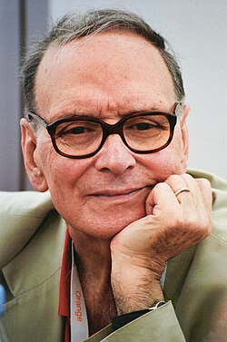

# Ennio Morricone

## Biografía

Ennio Morricone (Roma, 10 de noviembre de 1928-Roma, 6 de julio de 2020)​ fue un compositor y director de orquesta italiano, conocido por haber compuesto la banda sonora de más de quinientas películas y series de televisión. Recibió un Óscar honorífico en 2006 y ganó el Óscar a la mejor banda sonora en 2016 por la cinta The Hateful Eight. Sus composiciones se incluyen en más de veinte películas galardonadas, además de realizar también piezas sinfónicas y corales. Destacan, entre otros, sus trabajos en películas del spaghetti western, de la mano de su amigo Sergio Leone, como Por un puñado de dólares de 1964, Per qualche dollaro in più de 1965, El bueno, el feo y el malo de 1966 o C'era una volta il West de 1968. No obstante, su obra se extendió a multitud de géneros de composición, convirtiéndolo así en uno de los compositores más versátiles de la historia del cine y también de los más influyentes del siglo XX. Sus composiciones para Days of Heaven de 1978, La misión de 1986 o Cinema Paradiso de 1988 son catalogadas como auténticas obras maestras.​

## Estilo musical

Ennio Morricone ( Roma, 10 de noviembre de 1928-Roma, 6 de julio de 2020) [ 1 ] ​ fue un compositor y director de orquesta italiano, conocido por haber compuesto la banda sonora de más de quinientas películas y series de televisión. Recibió un Óscar honorífico en 2006 y ganó el Óscar a la mejor banda sonora en 2016 por la cinta The Hateful Eight.

## Anécdotas y curiosidades

Nacido en Roma, Morricone comenzó a tocar la trompeta cuando era niño y a los seis años ya había compuesto su primera obra. Estudió en la Academia Nacional de Santa Cecilia a la edad de nueve años, donde su padre, Mario Morricone, que era músico, lo inscribió. Cuando tenía doce años entró en el conservatorio, inscribiéndose en un programa de armonía de cuatro años, que acabó en seis meses. Su diploma de trompeta lo recibió en 1946 y a partir de ese año comenzó a trabajar profesionalmente componiendo la música de Il Mattino (La mañana). Después de graduarse en 1954, empezó como escritor fantasma, componiendo música para películas, que se atribuían a famosos músicos de la época. Pronto ganó popularidad debido a la composición de música de fondo para programas de radio y poco después daría el salto a la gran pantalla.

## Top 10 bandas sonoras

1. ***The Thing (Título en España: La cosa (El enigma de otro mundo))***
    * **Póster:** [link](046_ennio_morricone/posters/poster_the_thing_1982.jpg)
2. ***The Hateful Eight (Título en España: Los odiosos ocho)***
    * **Póster:** [link](046_ennio_morricone/posters/poster_the_hateful_eight_2015.jpg)
3. ***The Untouchables (Título en España: Los intocables de Eliot Ness)***
    * **Póster:** [link](046_ennio_morricone/posters/poster_the_untouchables_1987.jpg)
4. ***The Mission (Título en España: La misión)***
    * **Póster:** [link](046_ennio_morricone/posters/poster_the_mission_1986.jpg)
5. ***Malèna (Título en España: Malèna)***
    * **Póster:** [link](046_ennio_morricone/posters/poster_mal_na_2000.jpg)
6. ***Days of Heaven (Título en España: Días del cielo)***
    * **Póster:** [link](046_ennio_morricone/posters/poster_days_of_heaven_1978.jpg)
7. ***Bugsy (Título en España: Bugsy)***
    * **Póster:** [link](046_ennio_morricone/posters/poster_bugsy_1991.jpg)

## Filmografía completa

- Il federale (Título en España: El federal) (1961) · [Póster](046_ennio_morricone/posters/poster_il_federale_1961.jpg)
- La voglia matta (Título en España: El deseo loco) (1962) · [Póster](046_ennio_morricone/posters/poster_la_voglia_matta_1962.jpg)
- La cuccagna (Título en España: La cuccagna) (1962) · [Póster](046_ennio_morricone/posters/poster_la_cuccagna_1962.jpg)
- I motorizzati (Título en España: Los motorizados) (1962) · [Póster](046_ennio_morricone/posters/poster_i_motorizzati_1962.jpg)
- Le monachine (Título en España: Dos monjitas) (1963) · [Póster](046_ennio_morricone/posters/poster_le_monachine_1963.jpg)
- Il successo (Título en España: El éxito) (1963) · [Póster](046_ennio_morricone/posters/poster_il_successo_1963.jpg)
- Duello nel Texas (Título en España: Gringo) (1963) · [Póster](046_ennio_morricone/posters/poster_duello_nel_texas_1963.jpg)
- Prima della rivoluzione (Título en España: Antes de la revolución) (1964) · [Póster](046_ennio_morricone/posters/poster_prima_della_rivoluzione_1964.jpg)
- I due evasi di Sing Sing (Título en España: I due evasi di Sing Sing) (1964) · [Póster](046_ennio_morricone/posters/poster_i_due_evasi_di_sing_sing_1964.jpg)
- In ginocchio da te (Título en España: In ginocchio da te) (1964) · [Póster](046_ennio_morricone/posters/poster_in_ginocchio_da_te_1964.jpg)
- Le pistole non discutono (Título en España: Las pistolas no discuten) (1964) · [Póster](046_ennio_morricone/posters/poster_le_pistole_non_discutono_1964.jpg)
- I marziani hanno 12 mani (Título en España: Llegaron los marcianos) (1964) · [Póster](046_ennio_morricone/posters/poster_i_marziani_hanno_12_mani_1964.jpg)
- Per un pugno di dollari (Título en España: Por un puñado de dólares) (1964) · [Póster](046_ennio_morricone/posters/poster_per_un_pugno_di_dollari_1964.jpg)
- Altissima pressione (Título en España: Altissima pressione) (1965) · [Póster](046_ennio_morricone/posters/poster_altissima_pressione_1965.jpg)
- Amanti d'oltretomba (Título en España: Amantes de ultratumba) (1965) · [Póster](046_ennio_morricone/posters/poster_amanti_d_oltretomba_1965.jpg)
- Il ritorno di Ringo (Título en España: El retorno de Ringo) (1965) · [Póster](046_ennio_morricone/posters/poster_il_ritorno_di_ringo_1965.jpg)
- Per qualche dollaro in più (Título en España: La muerte tenía un precio) (1965) · [Póster](046_ennio_morricone/posters/poster_per_qualche_dollaro_in_pi_1965.jpg)
- I pugni in tasca (Título en España: Las manos en los bolsillos) (1965) · [Póster](046_ennio_morricone/posters/poster_i_pugni_in_tasca_1965.jpg)
- Ménage all'italiana (Título en España: Menage a la italiana) (1965) · [Póster](046_ennio_morricone/posters/poster_m_nage_all_italiana_1965.jpg)
- Non son degno di te (Título en España: Non son degno di te) (1965) · [Póster](046_ennio_morricone/posters/poster_non_son_degno_di_te_1965.jpg)
- Se non avessi più te (Título en España: Se non avessi più te) (1965) · [Póster](046_ennio_morricone/posters/poster_se_non_avessi_pi_te_1965.jpg)
- Slalom (Título en España: Slalom) (1965) · [Póster](046_ennio_morricone/posters/poster_slalom_1965.jpg)
- Thrilling (Título en España: Thrilling (Espeluznante)) (1965) · [Póster](046_ennio_morricone/posters/poster_thrilling_1965.jpg)
- Una pistola per Ringo (Título en España: Una pistola para Ringo) (1965) · [Póster](046_ennio_morricone/posters/poster_una_pistola_per_ringo_1965.jpg)
- Come imparai ad amare le donne (Título en España: Cómo aprendí a amar a las mujeres) (1966) · [Póster](046_ennio_morricone/posters/poster_come_imparai_ad_amare_le_donne_1966.jpg)
- Il buono, il brutto, il cattivo (Título en España: El bueno, el feo y el malo) (1966) · [Póster](046_ennio_morricone/posters/poster_il_buono_il_brutto_il_cattivo_1966.jpg)
- Navajo Joe (Título en España: Joe, el implacable) (1966) · [Póster](046_ennio_morricone/posters/poster_navajo_joe_1966.jpg)
- La battaglia di Algeri (Título en España: La batalla de Argel) (1966) · [Póster](046_ennio_morricone/posters/poster_la_battaglia_di_algeri_1966.jpg)
- Mi vedrai tornare (Título en España: Mi vedrai tornare) (1966) · [Póster](046_ennio_morricone/posters/poster_mi_vedrai_tornare_1966.jpg)
- Uccellacci e uccellini (Título en España: Pajaritos y pajarracos) (1966) · [Póster](046_ennio_morricone/posters/poster_uccellacci_e_uccellini_1966.jpg)
- Sette pistole per i MacGregor (Título en España: Siete pistolas para los Mac Gregor) (1966) · [Póster](046_ennio_morricone/posters/poster_sette_pistole_per_i_macgregor_1966.jpg)
- Un fiume di dollari (Título en España: Un río de dólares) (1966) · [Póster](046_ennio_morricone/posters/poster_un_fiume_di_dollari_1966.jpg)
- Faccia a faccia (Título en España: Cara a cara) (1967) · [Póster](046_ennio_morricone/posters/poster_faccia_a_faccia_1967.jpg)
- Ad ogni costo (Título en España: Diamantes a gogó) (1967) · [Póster](046_ennio_morricone/posters/poster_ad_ogni_costo_1967.jpg)
- La resa dei conti (Título en España: El halcón y la presa) (1967) · [Póster](046_ennio_morricone/posters/poster_la_resa_dei_conti_1967.jpg)
- Le streghe (Título en España: Las brujas) (1967) · [Póster](046_ennio_morricone/posters/poster_le_streghe_1967.jpg)
- I crudeli (Título en España: Los despiadados) (1967) · [Póster](046_ennio_morricone/posters/poster_i_crudeli_1967.jpg)
- 7 donne per i Mac Gregor (Título en España: Siete mujeres para los MacGregor) (1967) · [Póster](046_ennio_morricone/posters/poster_7_donne_per_i_mac_gregor_1967.jpg)
- Appunti per un film sull'India (Título en España: Apuntes para una película en la India) (1968) · [Póster](046_ennio_morricone/posters/poster_appunti_per_un_film_sull_india_1968.jpg)
- Comandamenti per un gangster (Título en España: Comandamenti per un gangster) (1968) · [Póster](046_ennio_morricone/posters/poster_comandamenti_per_un_gangster_1968.jpg)
- Diabolik (Título en España: Danger: Diabolik) (1968) · [Póster](046_ennio_morricone/posters/poster_diabolik_1968.jpg)
- Il grande silenzio (Título en España: El gran silencio) (1968) · [Póster](046_ennio_morricone/posters/poster_il_grande_silenzio_1968.jpg)
- Escalation (Título en España: Escalation) (1968) · [Póster](046_ennio_morricone/posters/poster_escalation_1968.jpg)
- Galileo (Título en España: Galileo) (1968) · [Póster](046_ennio_morricone/posters/poster_galileo_1968.jpg)
- Grazie, zia (Título en España: Gracias tía) (1968) · [Póster](046_ennio_morricone/posters/poster_grazie_zia_1968.jpg)
- ...e per tetto un cielo di stelle (Título en España: Por techo, las estrellas) (1968) · [Póster](046_ennio_morricone/posters/poster_e_per_tetto_un_cielo_di_stelle_1968.jpg)
- Il mercenario (Título en España: Salario para matar) (1968) · [Póster](046_ennio_morricone/posters/poster_il_mercenario_1968.jpg)
- Scusi, facciamo l'amore? (Título en España: Scusi, facciamo l'amore?) (1968) · [Póster](046_ennio_morricone/posters/poster_scusi_facciamo_l_amore_1968.jpg)
- Teorema (Título en España: Teorema) (1968) · [Póster](046_ennio_morricone/posters/poster_teorema_1968.jpg)
- Le Clan des Siciliens (Título en España: El clan de los sicilianos) (1969) · [Póster](046_ennio_morricone/posters/poster_le_clan_des_siciliens_1969.jpg)
- El magnífico Tony Carrera (Título en España: El magnífico Tony Carrera) (1969) · [Póster](046_ennio_morricone/posters/poster_el_magn_fico_tony_carrera_1969.jpg)
- I cannibali (Título en España: I cannibali) (1969) · [Póster](046_ennio_morricone/posters/poster_i_cannibali_1969.jpg)
- Красная палатка (Título en España: La tienda roja) (1969) · [Póster](046_ennio_morricone/posters/poster_poster_1969.jpg)
- Gli intoccabili (Título en España: Las Vegas, 1970) (1969) · [Póster](046_ennio_morricone/posters/poster_gli_intoccabili_1969.jpg)
- Queimada (Título en España: Queimada) (1969) · [Póster](046_ennio_morricone/posters/poster_queimada_1969.jpg)
- Sai cosa faceva Stalin alle donne? (Título en España: Sai cosa faceva Stalin alle donne?) (1969) · [Póster](046_ennio_morricone/posters/poster_sai_cosa_faceva_stalin_alle_donne_1969.jpg)
- Metti, una sera a cena (Título en España: Supongamos que una noche, cenando...) (1969) · [Póster](046_ennio_morricone/posters/poster_metti_una_sera_a_cena_1969.jpg)
- Un bellissimo novembre (Título en España: Un bellisimo noviembre) (1969) · [Póster](046_ennio_morricone/posters/poster_un_bellissimo_novembre_1969.jpg)
- Un esercito di cinque uomini (Título en España: Un ejército de cinco hombres) (1969) · [Póster](046_ennio_morricone/posters/poster_un_esercito_di_cinque_uomini_1969.jpg)
- Città violenta (Título en España: Ciudad violenta) (1970) · [Póster](046_ennio_morricone/posters/poster_citt_violenta_1970.jpg)
- Two Mules for Sister Sara (Título en España: Dos mulas y una mujer) (1970) · [Póster](046_ennio_morricone/posters/poster_two_mules_for_sister_sara_1970.jpg)
- L'uccello dalle piume di cristallo (Título en España: El pájaro de las plumas de cristal) (1970) · [Póster](046_ennio_morricone/posters/poster_l_uccello_dalle_piume_di_cristallo_1970.jpg)
- Giuochi particolari (Título en España: Giuochi particolari) (1970) · [Póster](046_ennio_morricone/posters/poster_giuochi_particolari_1970.jpg)
- La Califfa (Título en España: La Califfa) (1970) · [Póster](046_ennio_morricone/posters/poster_la_califfa_1970.jpg)
- Vamos a matar, compañeros (Título en España: Los compañeros) (1970) · [Póster](046_ennio_morricone/posters/poster_vamos_a_matar_compa_eros_1970.jpg)
- Uccidete il vitello grasso e arrostitelo (Título en España: Matad al ternero cebado y asadlo) (1970) · [Póster](046_ennio_morricone/posters/poster_uccidete_il_vitello_grasso_e_arrostitelo_1970.jpg)
- Metello (Título en España: Metello) (1970) · [Póster](046_ennio_morricone/posters/poster_metello_1970.jpg)
- Dio è con noi (Título en España: Y Dios está con nosotros) (1970) · [Póster](046_ennio_morricone/posters/poster_dio_con_noi_1970.jpg)
- Addio fratello crudele (Título en España: Adiós, hermano cruel) (1971) · [Póster](046_ennio_morricone/posters/poster_addio_fratello_crudele_1971.jpg)
- Incontro (Título en España: Amor anónimo) (1971) · [Póster](046_ennio_morricone/posters/poster_incontro_1971.jpg)
- Il Decameron (Título en España: El decamerón) (1971) · [Póster](046_ennio_morricone/posters/poster_il_decameron_1971.jpg)
- Giornata nera per l'ariete (Título en España: El día negro) (1971) · [Póster](046_ennio_morricone/posters/poster_giornata_nera_per_l_ariete_1971.jpg)
- Le Casse (Título en España: El furor de la codicia) (1971) · [Póster](046_ennio_morricone/posters/poster_le_casse_1971.jpg)
- Il gatto a nove code (Título en España: El gato de las nueve colas) (1971) · [Póster](046_ennio_morricone/posters/poster_il_gatto_a_nove_code_1971.jpg)
- La classe operaia va in paradiso (Título en España: La clase obrera va al paraíso) (1971) · [Póster](046_ennio_morricone/posters/poster_la_classe_operaia_va_in_paradiso_1971.jpg)
- La tarantola dal ventre nero (Título en España: La tarántula del vientre negro) (1971) · [Póster](046_ennio_morricone/posters/poster_la_tarantola_dal_ventre_nero_1971.jpg)
- Tre donne - La sciantosa (Título en España: Tre donne - La sciantosa) (1971) · [Póster](046_ennio_morricone/posters/poster_tre_donne_la_sciantosa_1971.jpg)
- Giù la testa (Título en España: ¡Agáchate, maldito!) (1971) · [Póster](046_ennio_morricone/posters/poster_gi_la_testa_1971.jpg)
- ...Correva l'anno di grazia 1870 (Título en España: ...Correva l'anno di grazia 1870) (1972) · [Póster](046_ennio_morricone/posters/poster_correva_l_anno_di_grazia_1870_1972.jpg)
- Anche se volessi lavorare, che faccio? (Título en España: Anche se volessi lavorare, che faccio?) (1972) · [Póster](046_ennio_morricone/posters/poster_anche_se_volessi_lavorare_che_faccio_1972.jpg)
- Il ritorno di Clint il solitario (Título en España: El retorno de Clint el solitario) (1972) · [Póster](046_ennio_morricone/posters/poster_il_ritorno_di_clint_il_solitario_1972.jpg)
- Questa specie d'amore (Título en España: Esa clase de amor) (1972) · [Póster](046_ennio_morricone/posters/poster_questa_specie_d_amore_1972.jpg)
- Fiorina la vacca (Título en España: Fiorina la vaca) (1972) · [Póster](046_ennio_morricone/posters/poster_fiorina_la_vacca_1972.jpg)
- Forza 'G' (Título en España: Forza 'G') (1972) · [Póster](046_ennio_morricone/posters/poster_forza_g_1972.jpg)
- Imputazione di omicidio per uno studente (Título en España: Imputazione di omicidio per uno studente) (1972) · [Póster](046_ennio_morricone/posters/poster_imputazione_di_omicidio_per_uno_studente_1972.jpg)
- La cosa buffa (Título en España: La cosa buffa) (1972) · [Póster](046_ennio_morricone/posters/poster_la_cosa_buffa_1972.jpg)
- I racconti di Canterbury (Título en España: Los cuentos de Canterbury) (1972) · [Póster](046_ennio_morricone/posters/poster_i_racconti_di_canterbury_1972.jpg)
- Mio caro assassino (Título en España: Sumario sangriento de la pequeña Estefania) (1972) · [Póster](046_ennio_morricone/posters/poster_mio_caro_assassino_1972.jpg)
- Un uomo da rispettare (Título en España: Un hombre para respetar) (1972) · [Póster](046_ennio_morricone/posters/poster_un_uomo_da_rispettare_1972.jpg)
- La vita, a volte, è molto dura, vero Provvidenza? (Título en España: Ya le llaman Providencia) (1972) · [Póster](046_ennio_morricone/posters/poster_la_vita_a_volte_molto_dura_vero_provvidenza_1972.jpg)
- La proprietà non è più un furto (Título en España: El amargo deseo de la propiedad) (1973) · [Póster](046_ennio_morricone/posters/poster_la_propriet_non_pi_un_furto_1973.jpg)
- Giordano Bruno (Título en España: Giordano Bruno) (1973) · [Póster](046_ennio_morricone/posters/poster_giordano_bruno_1973.jpg)
- Il mio nome è Nessuno (Título en España: Mi nombre es Ninguno) (1973) · [Póster](046_ennio_morricone/posters/poster_il_mio_nome_nessuno_1973.jpg)
- Revolver (Título en España: Revólver) (1973) · [Póster](046_ennio_morricone/posters/poster_revolver_1973.jpg)
- Le Trio Infernal (Título en España: El trío infernal) (1974) · [Póster](046_ennio_morricone/posters/poster_le_trio_infernal_1974.jpg)
- Il sorriso del grande tentatore (Título en España: La sonrisa del gran tentador) (1974) · [Póster](046_ennio_morricone/posters/poster_il_sorriso_del_grande_tentatore_1974.jpg)
- Milano odia: la polizia non può sparare (Título en España: Milano odia: la polizia non può sparare) (1974) · [Póster](046_ennio_morricone/posters/poster_milano_odia_la_polizia_non_pu_sparare_1974.jpg)
- Divina creatura (Título en España: Divina criatura) (1975) · [Póster](046_ennio_morricone/posters/poster_divina_creatura_1975.jpg)
- Un genio, due compari, un pollo (Título en España: El Genio) (1975) · [Póster](046_ennio_morricone/posters/poster_un_genio_due_compari_un_pollo_1975.jpg)
- La donna della domenica (Título en España: La mujer del domingo) (1975) · [Póster](046_ennio_morricone/posters/poster_la_donna_della_domenica_1975.jpg)
- Leonor (Título en España: Leonor) (1975) · [Póster](046_ennio_morricone/posters/poster_leonor_1975.jpg)
- Libera, amore mio... (Título en España: Libertad, amor mío) (1975) · [Póster](046_ennio_morricone/posters/poster_libera_amore_mio_1975.jpg)
- Per le antiche scale (Título en España: Por las antiguas escaleras) (1975) · [Póster](046_ennio_morricone/posters/poster_per_le_antiche_scale_1975.jpg)
- Peur sur la ville (Título en España: Pánico en la ciudad) (1975) · [Póster](046_ennio_morricone/posters/poster_peur_sur_la_ville_1975.jpg)
- L'ultimo treno della notte (Título en España: Violación en el último tren de la noche) (1975) · [Póster](046_ennio_morricone/posters/poster_l_ultimo_treno_della_notte_1975.jpg)
- The 'Human' Factor (Título en España: Víctimas del terrorismo) (1975) · [Póster](046_ennio_morricone/posters/poster_the_human_factor_1975.jpg)
- Il deserto dei Tartari (Título en España: El Desierto de los Tártaros) (1976) · [Póster](046_ennio_morricone/posters/poster_il_deserto_dei_tartari_1976.jpg)
- Novecento (Título en España: Novecento) (1976) · [Póster](046_ennio_morricone/posters/poster_novecento_1976.jpg)
- Autostop rosso sangue (Título en España: Autostop sangriento) (1977) · [Póster](046_ennio_morricone/posters/poster_autostop_rosso_sangue_1977.jpg)
- Exorcist II: The Heretic (Título en España: El exorcista II: El hereje) (1977) · [Póster](046_ennio_morricone/posters/poster_exorcist_ii_the_heretic_1977.jpg)
- Il mostro (Título en España: El monstruo) (1977) · [Póster](046_ennio_morricone/posters/poster_il_mostro_1977.jpg)
- Il gatto (Título en España: La casa de los desmadres) (1977) · [Póster](046_ennio_morricone/posters/poster_il_gatto_1977.jpg)
- Orca (Título en España: Orca, la ballena asesina) (1977) · [Póster](046_ennio_morricone/posters/poster_orca_1977.jpg)
- Corleone (Título en España: Corleone) (1978) · [Póster](046_ennio_morricone/posters/poster_corleone_1978.jpg)
- Days of Heaven (Título en España: Días del cielo) (1978) · [Póster](046_ennio_morricone/posters/poster_days_of_heaven_1978.jpg)
- Dove vai in vacanza? (Título en España: Vicios de verano) (1978) · [Póster](046_ennio_morricone/posters/poster_dove_vai_in_vacanza_1978.jpg)
- La Cage aux folles (Título en España: Vicios pequeños (La jaula de las locas)) (1978) · [Póster](046_ennio_morricone/posters/poster_la_cage_aux_folles_1978.jpg)
- Buone notizie (Título en España: Buone notizie) (1979) · [Póster](046_ennio_morricone/posters/poster_buone_notizie_1979.jpg)
- Il giocattolo (Título en España: El juguete) (1979) · [Póster](046_ennio_morricone/posters/poster_il_giocattolo_1979.jpg)
- La Luna (Título en España: La luna) (1979) · [Póster](046_ennio_morricone/posters/poster_la_luna_1979.jpg)
- Bloodline (Título en España: Lazos de Sangre) (1979) · [Póster](046_ennio_morricone/posters/poster_bloodline_1979.jpg)
- Operación Ogro (Título en España: Operación Ogro) (1979) · [Póster](046_ennio_morricone/posters/poster_operaci_n_ogro_1979.jpg)
- Il ladrone (Título en España: El buen ladrón) (1980) · [Póster](046_ennio_morricone/posters/poster_il_ladrone_1980.jpg)
- Il bandito dagli occhi azzurri (Título en España: Il bandito dagli occhi azzurri) (1980) · [Póster](046_ennio_morricone/posters/poster_il_bandito_dagli_occhi_azzurri_1980.jpg)
- La Banquière (Título en España: La Banquière) (1980) · [Póster](046_ennio_morricone/posters/poster_la_banqui_re_1980.jpg)
- The Island (Título en España: La Isla) (1980) · [Póster](046_ennio_morricone/posters/poster_the_island_1980.jpg)
- La Cage aux folles II (Título en España: La jaula de las locas 2) (1980) · [Póster](046_ennio_morricone/posters/poster_la_cage_aux_folles_ii_1980.jpg)
- Uomini e no (Título en España: Uomini e no) (1980) · [Póster](046_ennio_morricone/posters/poster_uomini_e_no_1980.jpg)
- Bianco, rosso e Verdone (Título en España: Bianco, rosso e Verdone) (1981) · [Póster](046_ennio_morricone/posters/poster_bianco_rosso_e_verdone_1981.jpg)
- Le Professionnel (Título en España: El profesional) (1981) · [Póster](046_ennio_morricone/posters/poster_le_professionnel_1981.jpg)
- La tragedia di un uomo ridicolo (Título en España: La historia de un hombre ridículo) (1981) · [Póster](046_ennio_morricone/posters/poster_la_tragedia_di_un_uomo_ridicolo_1981.jpg)
- La storia vera della signora dalle camelie (Título en España: La verdadera historia de la dama de las camelias) (1981) · [Póster](046_ennio_morricone/posters/poster_la_storia_vera_della_signora_dalle_camelie_1981.jpg)
- The Thing (Título en España: La cosa (El enigma de otro mundo)) (1982) · [Póster](046_ennio_morricone/posters/poster_the_thing_1982.jpg)
- Butterfly (Título en España: La marca de la mariposa) (1982) · [Póster](046_ennio_morricone/posters/poster_butterfly_1982.jpg)
- White Dog (Título en España: Perro Blanco) (1982) · [Póster](046_ennio_morricone/posters/poster_white_dog_1982.jpg)
- Copkiller (Título en España: Asesino de policías (Killer)) (1983) · [Póster](046_ennio_morricone/posters/poster_copkiller_1983.jpg)
- Le Marginal (Título en España: El marginal) (1983) · [Póster](046_ennio_morricone/posters/poster_le_marginal_1983.jpg)
- Le Ruffian (Título en España: El rufián) (1983) · [Póster](046_ennio_morricone/posters/poster_le_ruffian_1983.jpg)
- El tesoro de las cuatro coronas (Título en España: El tesoro de las cuatro coronas) (1983) · [Póster](046_ennio_morricone/posters/poster_el_tesoro_de_las_cuatro_coronas_1983.jpg)
- La chiave (Título en España: La llave secreta) (1983) · [Póster](046_ennio_morricone/posters/poster_la_chiave_1983.jpg)
- Nana (Título en España: Nana) (1983) · [Póster](046_ennio_morricone/posters/poster_nana_1983.jpg)
- Die Försterbuben (Título en España: Die Försterbuben) (1984) · [Póster](046_ennio_morricone/posters/poster_die_f_rsterbuben_1984.jpg)
- Les Voleurs de la nuit (Título en España: Ladrones en la noche) (1984) · [Póster](046_ennio_morricone/posters/poster_les_voleurs_de_la_nuit_1984.jpg)
- Once Upon a Time in America (Título en España: Érase una vez en América) (1984) · [Póster](046_ennio_morricone/posters/poster_once_upon_a_time_in_america_1984.jpg)
- Red Sonja (Título en España: El guerrero rojo) (1985) · [Póster](046_ennio_morricone/posters/poster_red_sonja_1985.jpg)
- Il Pentito (Título en España: Il Pentito) (1985) · [Póster](046_ennio_morricone/posters/poster_il_pentito_1985.jpg)
- La Gabbia (Título en España: La jaula) (1985) · [Póster](046_ennio_morricone/posters/poster_la_gabbia_1985.jpg)
- C.A.T. Squad (Título en España: Grupo antiterrorista) (1986) · [Póster](046_ennio_morricone/posters/poster_c_a_t_squad_1986.jpg)
- The Mission (Título en España: La misión) (1986) · [Póster](046_ennio_morricone/posters/poster_the_mission_1986.jpg)
- La Venexiana (Título en España: La veneciana) (1986) · [Póster](046_ennio_morricone/posters/poster_la_venexiana_1986.jpg)
- The Untouchables (Título en España: Los intocables de Eliot Ness) (1987) · [Póster](046_ennio_morricone/posters/poster_the_untouchables_1987.jpg)
- Mosca addio (Título en España: Mosca addio) (1987) · [Póster](046_ennio_morricone/posters/poster_mosca_addio_1987.jpg)
- Nuovo Cinema Paradiso (Título en España: Cinema Paradiso) (1988) · [Póster](046_ennio_morricone/posters/poster_nuovo_cinema_paradiso_1988.jpg)
- Frantic (Título en España: Frenético) (1988) · [Póster](046_ennio_morricone/posters/poster_frantic_1988.jpg)
- 12 registi per 12 città (Título en España: 12 registi per 12 città) (1989) · [Póster](046_ennio_morricone/posters/poster_12_registi_per_12_citt_1989.jpg)
- Casualties of War (Título en España: Corazones de hierro) (1989) · [Póster](046_ennio_morricone/posters/poster_casualties_of_war_1989.jpg)
- Dimenticare Palermo (Título en España: Dimenticare Palermo) (1990) · [Póster](046_ennio_morricone/posters/poster_dimenticare_palermo_1990.jpg)
- State of Grace (Título en España: El clan de los irlandeses) (1990) · [Póster](046_ennio_morricone/posters/poster_state_of_grace_1990.jpg)
- Hamlet (Título en España: Hamlet, el honor de la venganza) (1990) · [Póster](046_ennio_morricone/posters/poster_hamlet_1990.jpg)
- Mio caro dottor Gräsler (Título en España: Mio caro dottor Gräsler) (1990) · [Póster](046_ennio_morricone/posters/poster_mio_caro_dottor_gr_sler_1990.jpg)
- ¡Átame! (Título en España: ¡Átame!) (1990) · [Póster](046_ennio_morricone/posters/poster_tame_1990.jpg)
- Bugsy (Título en España: Bugsy) (1991) · [Póster](046_ennio_morricone/posters/poster_bugsy_1991.jpg)
- La villa del venerdì (Título en España: La villa de los viernes) (1991) · [Póster](046_ennio_morricone/posters/poster_la_villa_del_venerd_1991.jpg)
- Money (Título en España: Money) (1991) · [Póster](046_ennio_morricone/posters/poster_money_1991.jpg)
- Abraham (Título en España: Abraham) (1993) · [Póster](046_ennio_morricone/posters/poster_abraham_1993.jpg)
- In the Line of Fire (Título en España: En la línea de fuego) (1993) · [Póster](046_ennio_morricone/posters/poster_in_the_line_of_fire_1993.jpg)
- La scorta (Título en España: La scorta) (1993) · [Póster](046_ennio_morricone/posters/poster_la_scorta_1993.jpg)
- Genesi: La creazione e il diluvio (Título en España: Génesis) (1994) · [Póster](046_ennio_morricone/posters/poster_genesi_la_creazione_e_il_diluvio_1994.jpg)
- Jacob (Título en España: Jacob) (1994) · [Póster](046_ennio_morricone/posters/poster_jacob_1994.jpg)
- Wolf (Título en España: Lobo) (1994) · [Póster](046_ennio_morricone/posters/poster_wolf_1994.jpg)
- Love Affair (Título en España: Un asunto de amor) (1994) · [Póster](046_ennio_morricone/posters/poster_love_affair_1994.jpg)
- Pasolini, un delitto italiano (Título en España: Pasolini, un delitto italiano) (1995) · [Póster](046_ennio_morricone/posters/poster_pasolini_un_delitto_italiano_1995.jpg)
- La sindrome di Stendhal (Título en España: El arte de matar) (1996) · [Póster](046_ennio_morricone/posters/poster_la_sindrome_di_stendhal_1996.jpg)
- I magi randagi (Título en España: I magi randagi) (1996) · [Póster](046_ennio_morricone/posters/poster_i_magi_randagi_1996.jpg)
- Ninfa plebea (Título en España: Ninfa plebea) (1996) · [Póster](046_ennio_morricone/posters/poster_ninfa_plebea_1996.jpg)
- U Turn (Título en España: Giro al infierno) (1997) · [Póster](046_ennio_morricone/posters/poster_u_turn_1997.jpg)
- David (Título en España: La Biblia: David) (1997) · [Póster](046_ennio_morricone/posters/poster_david_1997.jpg)
- Lolita (Título en España: Lolita) (1997) · [Póster](046_ennio_morricone/posters/poster_lolita_1997.jpg)
- Bulworth (Título en España: Bulworth) (1998) · [Póster](046_ennio_morricone/posters/poster_bulworth_1998.jpg)
- Il fantasma dell'Opera (Título en España: El fantasma de la ópera) (1998) · [Póster](046_ennio_morricone/posters/poster_il_fantasma_dell_opera_1998.jpg)
- Esther (Título en España: Esther) (1999) · [Póster](046_ennio_morricone/posters/poster_esther_1999.jpg)
- Before Night Falls (Título en España: Antes que anochezca) (2000) · [Póster](046_ennio_morricone/posters/poster_before_night_falls_2000.jpg)
- Malèna (Título en España: Malèna) (2000) · [Póster](046_ennio_morricone/posters/poster_mal_na_2000.jpg)
- Mission to Mars (Título en España: Misión a Marte) (2000) · [Póster](046_ennio_morricone/posters/poster_mission_to_mars_2000.jpg)
- Vatel (Título en España: Vatel) (2000) · [Póster](046_ennio_morricone/posters/poster_vatel_2000.jpg)
- Ripley's Game (Título en España: El juego de Ripley) (2002) · [Póster](046_ennio_morricone/posters/poster_ripley_s_game_2002.jpg)
- Il Papa buono (Título en España: El Santo Padre Juan XXIII) (2003) · [Póster](046_ennio_morricone/posters/poster_il_papa_buono_2003.jpg)
- Maria Goretti (Título en España: Maria Goretti) (2003) · [Póster](046_ennio_morricone/posters/poster_maria_goretti_2003.jpg)
- Cefalonia (Título en España: Cefalonia) (2005) · [Póster](046_ennio_morricone/posters/poster_cefalonia_2005.jpg)
- Sorstalanság (Título en España: Sin destino) (2005) · [Póster](046_ennio_morricone/posters/poster_sorstalans_g_2005.jpg)
- A Crime (Título en España: A Crime) (2006) · [Póster](046_ennio_morricone/posters/poster_a_crime_2006.jpg)
- Giovanni Falcone - L'uomo che sfidò Cosa Nostra (Título en España: Giovanni Falcone - L'uomo che sfidò Cosa Nostra) (2006) · [Póster](046_ennio_morricone/posters/poster_giovanni_falcone_l_uomo_che_sfid_cosa_nostra_2006.jpg)
- La sconosciuta (Título en España: La desconocida) (2006) · [Póster](046_ennio_morricone/posters/poster_la_sconosciuta_2006.jpg)
- L'ultimo Dei Corleonesi (Título en España: L'ultimo Dei Corleonesi) (2007) · [Póster](046_ennio_morricone/posters/poster_l_ultimo_dei_corleonesi_2007.jpg)
- Baarìa (Título en España: Baarìa) (2009) · [Póster](046_ennio_morricone/posters/poster_baar_a_2009.jpg)
- Pane e libertà (Título en España: Pane e libertà) (2009) · [Póster](046_ennio_morricone/posters/poster_pane_e_libert_2009.jpg)
- Mi ricordo Anna Frank (Título en España: Memorias de Ana Frank) (2010) · [Póster](046_ennio_morricone/posters/poster_mi_ricordo_anna_frank_2010.jpg)
- The Hateful Eight (Título en España: Los odiosos ocho) (2015) · [Póster](046_ennio_morricone/posters/poster_the_hateful_eight_2015.jpg)
- La corrispondenza (Título en España: La correspondencia) (2016) · [Póster](046_ennio_morricone/posters/poster_la_corrispondenza_2016.jpg)
- Piano Cinéma (Título en España: Piano Cinéma) (2022) · [Póster](046_ennio_morricone/posters/poster_piano_cin_ma_2022.jpg)

## Premios y nominaciones

* 1965 – Cinta de plata a la mejor puntuación – (Ganador)
* 1970 – Cinta de plata a la mejor puntuación – (Ganador)
* 1972 – Cinta de plata a la mejor puntuación – (Ganador)
* 1979 – Premio de la Academia a la mejor banda sonora original – por *Days of Heaven (Título en España: Días del cielo)* – (Nominación)
* 1983 – Premio Golden Raspberry a la peor canción original – por *It's Wrong for Me to Love You* – (Nominación)
* 1983 – Premio Golden Raspberry a la peor partitura musical – por *Butterfly (Título en España: La marca de la mariposa)* – (Nominación)
* 1983 – Premio Golden Raspberry a la peor partitura musical – por *The Thing (Título en España: La cosa (El enigma de otro mundo))* – (Nominación)
* 1985 – Cinta de plata a la mejor puntuación – (Ganador)
* 1987 – Premio de la Academia a la mejor banda sonora original – por *The Mission (Título en España: La misión)* – (Nominación)
* 1988 – Cinta de plata a la mejor puntuación – (Ganador)
* 1988 – Premio de la Academia a la mejor banda sonora original – por *The Untouchables (Título en España: Los intocables de Eliot Ness)* – (Nominación)
* 1989 – Leopardo de honor – (Ganador)
* 1992 – Premio de la Academia a la mejor banda sonora original – por *Bugsy (Título en España: Bugsy)* – (Nominación)
* 1995 – Comandante de la Orden del Mérito de la República Italiana – (Ganador)
* 1999 – Premio a la trayectoria de la Academia de Cine Europeo – (Ganador)
* 2000 – Cinta de plata a la mejor puntuación – (Ganador)
* 2000 – Medalla de Oro de la Orden Italiana al Mérito de la Cultura y el Arte – (Ganador)
* 2001 – Cinta de plata a la mejor puntuación – (Ganador)
* 2001 – Premio de la Academia a la mejor banda sonora original – por *Malèna (Título en España: Malèna)* – (Nominación)
* 2005 – Gran Oficial de la Orden del Mérito de la República Italiana – (Ganador)
* 2005 – Premio de Cine Europeo al Mejor Compositor – por *Sorstalanság (Título en España: Sin destino)* – (Nominación)
* 2007 – Cinta de plata a la mejor puntuación – (Ganador)
* 2007 – Premio Honorífico de la Academia – (Ganador)
* 2009 – Caballero de la Legión de Honor – (Ganador)
* 2013 – Cinta de plata a la mejor puntuación – (Ganador)
* 2013 – Premio de Cine Europeo al Mejor Compositor – por *La migliore offerta (Título en España: La mejor oferta)* – (Ganador)
* 2014 – Premio Grammy de los Fideicomisarios – (Ganador)
* 2015 – Medalla Amigos del Arte Bohemio – (Ganador)
* 2016 – Premio de la Academia a la mejor banda sonora original – por *The Hateful Eight (Título en España: Los odiosos ocho)* – (Ganador)
* 2016 – Premio de la Academia a la mejor banda sonora original – por *The Hateful Eight (Título en España: Los odiosos ocho)* – (Nominación)
* 2017 – Caballero Gran Cruz de la Orden del Mérito de la República Italiana – (Ganador)
* 2020 – Premio Princesa de Asturias de las Artes – (Ganador)
* David di Donatello a la mejor música – (Ganador)
* Orden del Sol Naciente, 4ta clase – (Ganador)
* Premio Cinearti La chioma di Berenice – (Ganador)
* Premio David di Donatello a la trayectoria – (Ganador)
* Premios Camille – (Ganador)
* Premios Grammy – (Ganador)
* estrella en el Paseo de la Fama de Hollywood – (Ganador)

## Fuentes adicionales

* [MundoBSO](https://www.mundobso.com/compositor/morricone-ennio) — site:mundobso.com
* [MundoBSO (2)](https://www.mundobso.com/agoras/casi-todo-sobre-morricone) — site:mundobso.com
* [MundoBSO (3)](https://www.mundobso.com/bso/ennio-morriconedario-argento-anthology-an) — site:mundobso.com
* [Film Score Monthly](https://www.filmscoremonthly.com/board/posts.cfm?threadID=103061) — site:filmscoremonthly.com
* [Film Score Monthly (2)](https://www.filmscoremonthly.com/daily/article.cfm/articleID/6165/Time-Traveling-to-the-World-of-Ennio-Morricone%E2%80%99s-%3Ci%3EThe-Mission%3Ci%3E/) — site:filmscoremonthly.com
* [Film Score Monthly (3)](https://www.filmscoremonthly.com/board/posts.cfm?forumID=1&pageID=11&threadID=140814&archive=0) — site:filmscoremonthly.com
* [SoundtrackCollector](https://www.soundtrackcollector.com) — site:soundtrackcollector.com
* [SoundtrackCollector (2)](https://www.soundtrackcollector.com/catalog/composerdiscography.php?composerid=51&offset=4640) — site:soundtrackcollector.com
* [SoundtrackCollector (3)](https://www.soundtrackcollector.com/?url=v) — site:soundtrackcollector.com
* [WhatSong](https://www.whatsong.org/movie/cinema-paradiso) — site:whatsong.org
* [WhatSong (2)](https://www.whatsong.org/movie/kill-bill-vol-2) — site:whatsong.org
* [WhatSong (3)](https://www.whatsong.org/tvshow/eastbound-down/episode/52879) — site:whatsong.org

## Notas externas

* MundoBSO: Nació en Roma (Italia), el 10 de noviembre de 1928 y murió en la misma ciudad, el 6 de julio de 2020. Hijo de Libera Ridolfi y Mario Morricone, que era músico, concretamente trompetista en varias orquestas pequeñas. El joven Ennio vivió con sus padres y sus cuatro hermanos en el Trastévere romano, y su padre ejerció de profesor para él, tanto para aprender a leer y componer música como para interpretar varios instrumentos. Pasados los años, entró de niño en la Academia Nacional de Santa Cecilia para aprender a ser trompetista como su padre, y a los 12 años dio el salto al Conservatorio para iniciar un curso de cuatro años de armónica... que completó en solo seis meses. Allí también...
* MundoBSO (3): Compositor: Morricone, Ennio Sello: DRG Duración: 74 minutos Información de la película Título original: An Ennio Morricone/Dario Argento Anthology Director: Dario Argento Nacionalidad: Italia Año: 1995 Compositor: Morricone, Ennio Sello: DRG Duración: 74 minutos
* SoundtrackCollector: 14 de enero - Confesión de un comisionado de policía de Riz Ortolani a la fiscalía 3 de diciembre - Wolf Hall de Debbie Wiseman: El espejo y la luz
* SoundtrackCollector (3): 14 de enero - Confesión de un comisionado de policía de Riz Ortolani a la fiscalía 3 de diciembre - Wolf Hall de Debbie Wiseman: El espejo y la luz
* WhatSong: Ennio Morricone - Cinema Paradiso (Grabación cinematográfica original) Ennio Morricone - Cinema Paradiso (Grabación cinematográfica original)
* WhatSong (2): Sonny Bono - Día de la Independencia: Resurgimiento (banda sonora original de la película) Orquesta Filarmónica de la Ciudad de Praga - Bernard Herrmann - The Essential Film Music Collection
* WhatSong (3): Ennio Morricone - Ennio Morricone: Spaghetti Western Music vol. 1 (partituras originales de películas) La mejor fuente en línea de música de películas y televisión. Copyright © 2018 - 2026 Whatsong.org. Reservados todos los derechos.
* www.bfi.org.uk: Morricone ganó sus espuelas con los spaghetti westerns de Sergio Leone de la década de 1960 y luego proporcionó partituras distintivas para el apogeo del cine artístico italiano. Habló con Guido Bonsaver para nuestra edición de julio de 2006. Sólo un puñado de compositores de música cinematográfica han alcanzado el reconocimiento popular, y entre ellos Ennio Morricone es posiblemente el más famoso (con Bernard Herrmann su único rival serio). ¿Su secreto? La capacidad de escribir melodías pegadizas y atmosféricas, sin duda, pero Morricone también es un músico consumado cuya versatilidad le ha permitido abordar una amplia gama de formas.
* terradamusicablog.com.br: Postgrado en Música Popular con énfasis en Prácticas Creativas (Entrevista realizada originalmente por Elizabeth Davis para el sitio Classic FM. La traducción y adaptación aquí fue realizada por el editor de Terra da Música, Elvio Filho.)
* flypaper.soundfly.com: Temas Producir producción: grabación, música electrónica y tecnología Escribir música Escribir: componer canciones, composición y teoría Juego Interpretar: practicar, tocar e improvisar Trabajo rápido: negocios musicales, marketing y ganar dinero Descubrir música Descubrimiento: historia, inspiración y cosas nerds Producir producción: grabación, música electrónica y tecnología
* ressources.ircam.fr: Compositor italiano nacido el 10 de noviembre de 1928 en Roma; falleció el 6 de julio de 2020 en la misma ciudad. para violín, contralto, flauta y clarinete, Suvini Zerboni
* ressources.ircam.fr: Compositor italiano nacido el 10 de noviembre de 1928 en Roma; falleció el 6 de julio de 2020 en la misma ciudad. Ennio Morricone nació en Roma el 10 de noviembre de 1928, en el seno de una familia de clase trabajadora que le inculcó una prodigiosa ética de trabajo. Desde muy temprana edad se inició en la trompeta, estudiando en el Conservatorio Santa Cecilia. Continuó estudiando composición en la misma institución con Goffredo Petrassi, con quien permanecería cercano a pesar de las diferencias estilísticas entre ambos. En 1954, Morricone emprendió una serie de colaboraciones en diversos entornos, que le proporcionaron una experiencia invaluable; el año vio la composición de obras para voz y piano, música de cámara y un Concierto para piano dedicado a...
