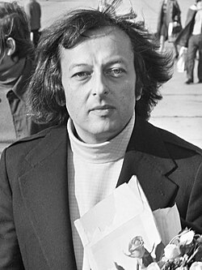

# André Previn

## Biografía

Andreas Ludwig Priwin, KBE (honoraria) (Berlín, 6 de abril de 1929​-Manhattan, Nueva York, 28 de febrero de 2019)​ conocido como André Previn, fue un pianista, director de orquesta y compositor alemanestadounidense.

## Estilo musical

Es director de orquesta, compositor y pianista. La vida musical de André Previn está marcada por una variedad impresionante. Tras huir de Alemania en 1938, su familia se instaló en Estados Unidos. André Previn, que ya había recibido lecciones de piano en su más tierna infancia, perfeccionó su forma de tocar el piano y rápidamente se convirtió en un famoso pianista de jazz. Ha actuado regularmente con grandes del jazz como Benny Goodman, Dizzy Gillespie, Benny Carter y Billie Holiday.

## Anécdotas y curiosidades

El crítico musical de Los Angeles Times, Mark Swed, una vez llamó a André Previn el músico estadounidense más versátil de todos los tiempos, y tengo que estar de acuerdo con él. Sí, incluso más versátil que Leonard Bernstein. Durante la escuela secundaria, Previn ganó dinero extra improvisando partituras para películas mudas en el Rhapsody Theatre de Los Ángeles. Cuando tenía 16 años, MGM lo contrató para ayudar a componer la música de una película. Cuatro premios Oscar después, tras conquistar el mundo del cine y el jazz, lo abandonó todo para dedicarse a una carrera como director de orquesta clásica. Después de algunas lecciones en San Francisco del gran director francés Pierre Monteux, Previn, aparentemente de la nada, fue nombrado director musical de la Sinfónica de Houston. Luego vinieron los puestos más altos con la Sinfónica de Pittsburgh, LA Phil, la Orquesta Sinfónica de Londres y una estrecha asociación con la Filarmónica de Viena, entre muchas otras. Durante sus años como director musical de LA Phil, Previn tuvo una estrecha asociación con Classical KUSC. Como brillante personalidad de radio y televisión, le encantaba ser parte de nuestras transmisiones nacionales de la orquesta, e incluso condujo su propia serie, Alto Rendimiento. Jim Svejda y yo tenemos buenos recuerdos de habernos desmayado de risa ante el humor perverso de Previn y sus relatos bastante altos sobre una notable vida musical. ¡Y esa voz, el timbre de un corno inglés! El mandato en Los Ángeles duró poco. Previn peleó con el entonces director general de la Filarmónica, Ernest Fleischmann, y nunca regresó como director invitado. Luego, el crítico musical del LA Times, Martin Bernheimer, también tendía a hacer pasar momentos difíciles a Previn, refiriéndose a él en una ocasión como un director de orquesta de primera categoría de música de segunda categoría. Pero Previn fue invitado a escribir una pieza para la temporada del centenario de la orquesta; una rama de olivo extendida después de 30 años. La pura versatilidad del hombre: director, compositor de ópera y orquesta, arreglista, gran pianista de Mozart, autor de la escandalosa autobiografía “No Minor Chords” (editada por Jacqueline Onassis), pianista de jazz épico, ganador de diez premios Grammy, y así sucesivamente. Esta es una de mis grabaciones más queridas de Previn: la Segunda Sinfonía de Rachmaninoff, con Previn dirigiendo la Orquesta Sinfónica de Londres.

## Top 10 bandas sonoras

1. ***Irma la Douce (Título en España: Irma la dulce)***
    * **Póster:** [link](048_andr_previn/posters/poster_irma_la_douce_1963.jpg)
2. ***Elmer Gantry (Título en España: El fuego y la palabra)***
    * **Póster:** [link](048_andr_previn/posters/poster_elmer_gantry_1960.jpg)
3. ***It's Always Fair Weather (Título en España: Siempre hace buen tiempo)***
    * **Póster:** [link](048_andr_previn/posters/poster_it_s_always_fair_weather_1955.jpg)
4. ***Rollerball (Título en España: Rollerball)***
    * **Póster:** [link](048_andr_previn/posters/poster_rollerball_1975.jpg)
5. ***Kiss Me, Stupid (Título en España: Bésame, tonto)***
    * **Póster:** [link](048_andr_previn/posters/poster_kiss_me_stupid_1964.jpg)
6. ***Bad Day at Black Rock (Título en España: Conspiración de silencio)***
    * **Póster:** [link](048_andr_previn/posters/poster_bad_day_at_black_rock_1955.jpg)
7. ***The Fortune Cookie (Título en España: En bandeja de plata)***
    * **Póster:** [link](048_andr_previn/posters/poster_the_fortune_cookie_1966.jpg)
8. ***Tension (Título en España: Tension)***
    * **Póster:** [link](048_andr_previn/posters/poster_tension_1949.jpg)
9. ***Dead Ringer (Título en España: Su propia víctima)***
    * **Póster:** [link](048_andr_previn/posters/poster_dead_ringer_1964.jpg)
10. ***The Fastest Gun Alive (Título en España: Llega un pistolero)***
    * **Póster:** [link](048_andr_previn/posters/poster_the_fastest_gun_alive_1956.jpg)

## Filmografía completa

- I've Always Loved You (Título en España: La gran pasión) (1946) · [Póster](048_andr_previn/posters/poster_i_ve_always_loved_you_1946.jpg)
- Tenth Avenue Angel (Título en España: Tenth Avenue Angel) (1948) · [Póster](048_andr_previn/posters/poster_tenth_avenue_angel_1948.jpg)
- Challenge to Lassie (Título en España: El desafío de Lassie) (1949) · [Póster](048_andr_previn/posters/poster_challenge_to_lassie_1949.jpg)
- Border Incident (Título en España: Incidente en la frontera) (1949) · [Póster](048_andr_previn/posters/poster_border_incident_1949.jpg)
- Scene of the Crime (Título en España: La escena del crimen) (1949) · [Póster](048_andr_previn/posters/poster_scene_of_the_crime_1949.jpg)
- The Sun Comes Up (Título en España: Nueva alborada) (1949) · [Póster](048_andr_previn/posters/poster_the_sun_comes_up_1949.jpg)
- Tension (Título en España: Tension) (1949) · [Póster](048_andr_previn/posters/poster_tension_1949.jpg)
- Dial 1119 (Título en España: Dial 1119) (1950) · [Póster](048_andr_previn/posters/poster_dial_1119_1950.jpg)
- Kim (Título en España: Kim de la India) (1950) · [Póster](048_andr_previn/posters/poster_kim_1950.jpg)
- The Outriders (Título en España: Los escoltas) (1950) · [Póster](048_andr_previn/posters/poster_the_outriders_1950.jpg)
- Shadow on the Wall (Título en España: Shadow on the Wall) (1950) · [Póster](048_andr_previn/posters/poster_shadow_on_the_wall_1950.jpg)
- Cause for Alarm! (Título en España: Motivo de alarma) (1951) · [Póster](048_andr_previn/posters/poster_cause_for_alarm_1951.jpg)
- Give a Girl a Break (Título en España: Tres chicas con suerte) (1953) · [Póster](048_andr_previn/posters/poster_give_a_girl_a_break_1953.jpg)
- Small Town Girl (Título en España: Una chica de pueblo) (1953) · [Póster](048_andr_previn/posters/poster_small_town_girl_1953.jpg)
- Bad Day at Black Rock (Título en España: Conspiración de silencio) (1955) · [Póster](048_andr_previn/posters/poster_bad_day_at_black_rock_1955.jpg)
- It's Always Fair Weather (Título en España: Siempre hace buen tiempo) (1955) · [Póster](048_andr_previn/posters/poster_it_s_always_fair_weather_1955.jpg)
- The Catered Affair (Título en España: Banquete de bodas) (1956) · [Póster](048_andr_previn/posters/poster_the_catered_affair_1956.jpg)
- Invitation to the Dance (Título en España: Invitación a la danza) (1956) · [Póster](048_andr_previn/posters/poster_invitation_to_the_dance_1956.jpg)
- The Fastest Gun Alive (Título en España: Llega un pistolero) (1956) · [Póster](048_andr_previn/posters/poster_the_fastest_gun_alive_1956.jpg)
- Hot Summer Night (Título en España: Hot Summer Night) (1957) · [Póster](048_andr_previn/posters/poster_hot_summer_night_1957.jpg)
- House of Numbers (Título en España: House of Numbers) (1957) · [Póster](048_andr_previn/posters/poster_house_of_numbers_1957.jpg)
- Elmer Gantry (Título en España: El fuego y la palabra) (1960) · [Póster](048_andr_previn/posters/poster_elmer_gantry_1960.jpg)
- Pepe (Título en España: Pepe) (1960) · [Póster](048_andr_previn/posters/poster_pepe_1960.jpg)
- The Subterraneans (Título en España: The Subterraneans) (1960) · [Póster](048_andr_previn/posters/poster_the_subterraneans_1960.jpg)
- Who Was That Lady? (Título en España: ¿Quién era esa chica?) (1960) · [Póster](048_andr_previn/posters/poster_who_was_that_lady_1960.jpg)
- All in a Night's Work (Título en España: Todo en una noche) (1961) · [Póster](048_andr_previn/posters/poster_all_in_a_night_s_work_1961.jpg)
- Two for the Seesaw (Título en España: Cualquier día en cualquier esquina) (1962) · [Póster](048_andr_previn/posters/poster_two_for_the_seesaw_1962.jpg)
- The Four Horsemen of the Apocalypse (Título en España: Los cuatro jinetes del apocalipsis) (1962) · [Póster](048_andr_previn/posters/poster_the_four_horsemen_of_the_apocalypse_1962.jpg)
- The Bing Crosby Show (Título en España: The Bing Crosby Show) (1962) · [Póster](048_andr_previn/posters/poster_the_bing_crosby_show_1962.jpg)
- Irma la Douce (Título en España: Irma la dulce) (1963) · [Póster](048_andr_previn/posters/poster_irma_la_douce_1963.jpg)
- Goodbye Charlie (Título en España: Adiós, Charlie) (1964) · [Póster](048_andr_previn/posters/poster_goodbye_charlie_1964.jpg)
- Kiss Me, Stupid (Título en España: Bésame, tonto) (1964) · [Póster](048_andr_previn/posters/poster_kiss_me_stupid_1964.jpg)
- Dead Ringer (Título en España: Su propia víctima) (1964) · [Póster](048_andr_previn/posters/poster_dead_ringer_1964.jpg)
- The Fortune Cookie (Título en España: En bandeja de plata) (1966) · [Póster](048_andr_previn/posters/poster_the_fortune_cookie_1966.jpg)
- Inside Daisy Clover (Título en España: La rebelde) (1966) · [Póster](048_andr_previn/posters/poster_inside_daisy_clover_1966.jpg)
- Andre Previn: Who Needs a Conductor? (Título en España: Andre Previn: Who Needs a Conductor?) (1973) · [Póster](048_andr_previn/posters/poster_andre_previn_who_needs_a_conductor_1973.jpg)
- Rollerball (Título en España: Rollerball) (1975) · [Póster](048_andr_previn/posters/poster_rollerball_1975.jpg)
- Every Good Boy Deserves Favour (Título en España: Every Good Boy Deserves Favour) (1979) · [Póster](048_andr_previn/posters/poster_every_good_boy_deserves_favour_1979.jpg)
- Sounds Magnificent: The Story of the Symphony - Haydn & Mozart (Título en España: Sounds Magnificent: The Story of the Symphony - Haydn & Mozart) (1984) · [Póster](048_andr_previn/posters/poster_sounds_magnificent_the_story_of_the_symphony_haydn_mozart_1984.jpg)
- Tanglewood: A Place for Music (Título en España: Tanglewood: A Place for Music) (1985) · [Póster](048_andr_previn/posters/poster_tanglewood_a_place_for_music_1985.jpg)
- Tanglewood: So you want to be a conductor (Título en España: Tanglewood: So you want to be a conductor) (1985) · [Póster](048_andr_previn/posters/poster_tanglewood_so_you_want_to_be_a_conductor_1985.jpg)
- A Carnegie Hall Christmas Concert (Título en España: A Carnegie Hall Christmas Concert) (1991) · [Póster](048_andr_previn/posters/poster_a_carnegie_hall_christmas_concert_1991.jpg)
- Royal Philharmonic Orchestra: The First 50 Years (Título en España: Royal Philharmonic Orchestra: The First 50 Years) (1997) · [Póster](048_andr_previn/posters/poster_royal_philharmonic_orchestra_the_first_50_years_1997.jpg)
- The Kindness of Strangers (Título en España: The Kindness of Strangers) (1998) · [Póster](048_andr_previn/posters/poster_the_kindness_of_strangers_1998.jpg)
- Chuck Jones: Extremes and In-Betweens - A Life in Animation (Título en España: Chuck Jones: A Life in Animation) (2000) · [Póster](048_andr_previn/posters/poster_chuck_jones_extremes_and_in_betweens_a_life_in_animation_2000.jpg)
- Gene Kelly: Anatomy of a Dancer (Título en España: Gene Kelly: Anatomía de un bailarín) (2002) · [Póster](048_andr_previn/posters/poster_gene_kelly_anatomy_of_a_dancer_2002.jpg)
- Cole Porter in Hollywood: Satin and Silk (Título en España: Cole Porter in Hollywood: Satin and Silk) (2003) · [Póster](048_andr_previn/posters/poster_cole_porter_in_hollywood_satin_and_silk_2003.jpg)
- Piano Blues (Título en España: Piano Blues) (2003) · [Póster](048_andr_previn/posters/poster_piano_blues_2003.jpg)
- Mozart: Great Piano Concertos Vol. IV (Título en España: Mozart: Great Piano Concertos Vol. IV) (2005) · [Póster](048_andr_previn/posters/poster_mozart_great_piano_concertos_vol_iv_2005.jpg)
- Mozart: Great Piano Concertos: Vol. II (Título en España: Mozart: Great Piano Concertos: Vol. II) (2005) · [Póster](048_andr_previn/posters/poster_mozart_great_piano_concertos_vol_ii_2005.jpg)
- Artur Rubinstein - Piano Concertos (Título en España: Artur Rubinstein - Piano Concertos) (2006) · [Póster](048_andr_previn/posters/poster_artur_rubinstein_piano_concertos_2006.jpg)
- Film Noir: Bringing Darkness to Light (Título en España: Film Noir: Bringing Darkness to Light) (2006) · [Póster](048_andr_previn/posters/poster_film_noir_bringing_darkness_to_light_2006.jpg)
- It's Always Fair Weather: Going Out on a High Note (Título en España: It's Always Fair Weather: Going Out on a High Note) (2006) · [Póster](048_andr_previn/posters/poster_it_s_always_fair_weather_going_out_on_a_high_note_2006.jpg)
- Anne-Sophie Mutter: Mozart Piano Trios K. 502, 542, 548 (Título en España: Anne-Sophie Mutter: Mozart Piano Trios K. 502, 542, 548) (2007) · [Póster](048_andr_previn/posters/poster_anne_sophie_mutter_mozart_piano_trios_k_502_542_548_2007.jpg)
- Kiri Te Kanawa: A Celebration Live at the Royal Albert Hall (Título en España: Kiri Te Kanawa: A Celebration Live at the Royal Albert Hall) (2007) · [Póster](048_andr_previn/posters/poster_kiri_te_kanawa_a_celebration_live_at_the_royal_albert_hall_2007.jpg)
- André Previn - Eine Brücke zwischen den Welten (Título en España: André Previn - Eine Brücke zwischen den Welten) (2009) · [Póster](048_andr_previn/posters/poster_andr_previn_eine_br_cke_zwischen_den_welten_2009.jpg)
- Johnny Mercer: The Dream's on Me (Título en España: Johnny Mercer: The Dream's on Me) (2009) · [Póster](048_andr_previn/posters/poster_johnny_mercer_the_dream_s_on_me_2009.jpg)
- Eric & Ernie: Behind the Scenes (Título en España: Eric & Ernie: Behind the Scenes) (2011) · [Póster](048_andr_previn/posters/poster_eric_ernie_behind_the_scenes_2011.jpg)
- Andre Previn at the BBC (Título en España: Andre Previn at the BBC) (2015) · [Póster](048_andr_previn/posters/poster_andre_previn_at_the_bbc_2015.jpg)
- Alan Pakula: Going for Truth (Título en España: Alan Pakula: Going for Truth) (2019) · [Póster](048_andr_previn/posters/poster_alan_pakula_going_for_truth_2019.jpg)
- Anne-Sophie Mutter - Vivace (Título en España: Anne-Sophie Mutter - Vivace) (2023) · [Póster](048_andr_previn/posters/poster_anne_sophie_mutter_vivace_2023.jpg)
- Mia Farrow, en clair-obscur (Título en España: Mia Farrow, en clair-obscur) (2025) · [Póster](048_andr_previn/posters/poster_mia_farrow_en_clair_obscur_2025.jpg)
- Tchaikovsky: Symphony No. 6: Andre Previn: Sounds Magnificent (Título en España: Tchaikovsky: Symphony No. 6: Andre Previn: Sounds Magnificent) · [Póster](048_andr_previn/posters/poster_tchaikovsky_symphony_no_6_andre_previn_sounds_magnificent.jpg)

## Premios y nominaciones

* 1951 – Premio de la Academia a la mejor partitura musical original – por *Three Little Words (Título en España: Tres palabritas)* – (Nominación)
* 1954 – Premio de la Academia a la mejor partitura musical original – por *Kiss Me, Kate (Título en España: Kiss Me, Kate)* – (Nominación)
* 1956 – Premio de la Academia a la mejor partitura musical original – por *It's Always Fair Weather (Título en España: Siempre hace buen tiempo)* – (Nominación)
* 1959 – Premio Grammy al mejor álbum de banda sonora o grabación del elenco original de una película o televisión – por *Gigi (Título en España: Gigi)* – (Ganador)
* 1959 – Premio de la Academia a la mejor partitura musical original – por *Gigi (Título en España: Gigi)* – (Ganador)
* 1959 – Premio de la Academia a la mejor partitura musical original – por *Gigi (Título en España: Gigi)* – (Nominación)
* 1960 – Premio Grammy al mejor álbum de banda sonora o grabación del elenco original de una película o televisión – por *Porgy and Bess (Título en España: Porgy y Bess)* – (Ganador)
* 1960 – Premio de la Academia a la mejor partitura musical original – por *Porgy and Bess (Título en España: Porgy y Bess)* – (Ganador)
* 1960 – Premio de la Academia a la mejor partitura musical original – por *Porgy and Bess (Título en España: Porgy y Bess)* – (Nominación)
* 1961 – Premio Grammy al Mejor Álbum Instrumental de Jazz – por *West Side Story (Título en España: West Side Story (Amor sin barreras))* – (Ganador)
* 1961 – Premio de la Academia a la mejor banda sonora original de comedia o drama – por *Elmer Gantry (Título en España: El fuego y la palabra)* – (Nominación)
* 1961 – Premio de la Academia a la mejor canción original – por *The Faraway Part of Town* – (Nominación)
* 1961 – Premio de la Academia a la mejor partitura musical original – por *Bells Are Ringing (Título en España: Suena el teléfono)* – (Nominación)
* 1962 – Premio Grammy al Mejor Álbum Instrumental de Jazz – por *André Previn Plays Songs by Harold Arlen* – (Ganador)
* 1963 – Premio de la Academia a la mejor canción original – por *Song from Two for the Seesaw* – (Nominación)
* 1964 – Premio de la Academia a la mejor banda sonora, adaptación o tratamiento – por *Irma la Douce (Título en España: Irma la dulce)* – (Ganador)
* 1964 – Premio de la Academia a la mejor banda sonora, adaptación o tratamiento – por *Irma la Douce (Título en España: Irma la dulce)* – (Nominación)
* 1965 – Premio de la Academia a la mejor banda sonora, adaptación o tratamiento – por *My Fair Lady (Título en España: My Fair Lady (Mi bella dama))* – (Ganador)
* 1965 – Premio de la Academia a la mejor banda sonora, adaptación o tratamiento – por *My Fair Lady (Título en España: My Fair Lady (Mi bella dama))* – (Nominación)
* 1968 – Premio de la Academia a la mejor banda sonora, adaptación o tratamiento – por *Thoroughly Modern Millie (Título en España: Millie, una chica moderna)* – (Nominación)
* 1996 – Caballero Comendador de la Orden del Imperio Británico – (Ganador)
* 1998 – Honores del Centro Kennedy – (Ganador)
* 2005 – Premio Glenn Gould – (Ganador)
* 2008 – Premio Gramophone a la trayectoria – (Ganador)
* 2010 – Premio Grammy a la trayectoria – (Ganador)
* 2012 – Miembro de la Academia Estadounidense de Artes y Ciencias – (Ganador)
* Cruz de Caballero Comendador de la Orden del Mérito de la República Federal de Alemania – (Ganador)

## Fuentes adicionales

* [MundoBSO](https://www.mundobso.com/agoras/los-25-mejores-valses) — site:mundobso.com
* [MundoBSO (2)](https://www.mundobso.com/compositor/arlen-harold) — site:mundobso.com
* [MundoBSO (3)](https://www.mundobso.com/bso/frozen-el-reino-del-hielo) — site:mundobso.com
* [Film Score Monthly](https://www.filmscoremonthly.com/board/posts.cfm?archive=0&forumID=1&threadID=69989) — site:filmscoremonthly.com
* [Film Score Monthly (2)](https://www.filmscoremonthly.com/backissues/viewissue.cfm?issueID=63) — site:filmscoremonthly.com
* [Film Score Monthly (3)](https://www.filmscoremonthly.com/cds/cds.cfm?complete) — site:filmscoremonthly.com
* [SoundtrackCollector](https://www.soundtrackcollector.com) — site:soundtrackcollector.com
* [SoundtrackCollector (2)](https://www.soundtrackcollector.com/catalog/soundtracktopic.php?movieid=76595&topicid=7685) — site:soundtrackcollector.com
* [SoundtrackCollector (3)](https://www.soundtrackcollector.com/forum/displayquestion.php?topicid=1232) — site:soundtrackcollector.com
* [WhatSong](https://www.whatsong.org/tvshow/how-i-met-your-mother/episode/44483) — site:whatsong.org
* [WhatSong (2)](https://www.whatsong.org/tvshow/supernatural/episode/3659) — site:whatsong.org
* [WhatSong (3)](https://www.whatsong.org/tvshow/prison-break/episode/37396) — site:whatsong.org

## Notas externas

* MundoBSO (2): De nombre real Hyman Arluck, nació en Buffalo (EE UU), el 15 de febrero de 1905 y murió en Nueva York (EE UU), el 23 de abril de 1986. Compositor y autor de innumerables canciones que fueron grandes éxitos en los treinta y cuarenta. De nombre real Hyman Arluck, nació en Buffalo (EE UU), el 15 de febrero de 1905 y murió en Nueva York (EE UU), el 23 de abril de 1986. Compositor y autor de innumerables canciones que fueron grandes éxitos en los treinta y cuarenta.
* MundoBSO (3): Compositores: Beck, Christophe | Lopez, Robert Sello: Disney Duración: 98 minutos Título original: Frozen Director: Chris Buck, Jennifer Lee Nacionalidad: EE UU Año: 2013
* Film Score Monthly (3): FSM HOME FilmScoreDaily FilmScoreFriday The Aisle Seat LukasKendall.com TABLERO DE MENSAJES Discusión general Puesto comercial Discusión sobre partituras no cinematográficas
* SoundtrackCollector: 14 de enero - Confesión de un comisionado de policía de Riz Ortolani a la fiscalía 3 de diciembre - Wolf Hall de Debbie Wiseman: El espejo y la luz
* WhatSong: Lily y Robin bailan con los dos nerds del último año de secundaria. Se reproduce de fondo cuando Lilly, Robin y Barney intentan entrar a la fiesta. La canción es una canción que está incluida en iMovie.
* WhatSong (2): Sam y Dean cortan leña para una pira funeraria mientras recuerdan su tiempo con Charlie. La mejor fuente en línea de música de películas y televisión. Copyright © 2018 - 2026 Whatsong.org. Reservados todos los derechos.
* WhatSong (3): Ramin Djawadi - Prison Break: Temporadas 3 y 4 (Banda sonora original de televisión) Ramin Djawadi - Prison Break: Temporadas 3 y 4 (Banda sonora original de televisión)
* www.boesendorfer.com: Objeto de coleccionista La gran ola de Kanagawa Árbol de la vida Camelia Secesión 250 años Beethoven Oscar Peterson Cocteau Ultimate Design Audi Porsche Edge Barroco Luis XVI Viena Liszt Strauss
* www.bandassonorasdecine.com: Su carrera transcurre entre el cine y la música clásica siendo uno de los referentes más destacados en el mundo de la orquestación y dirección. Polifacético en sus trabajos formó equipo perfecto como ‘Adaptador musical’ en algunas obras de cine junto a Frederick Loewe, Andrew Lloyd Webber etc. Además de compositor ha sido arreglista, prestigioso director de orquesta, pianista y profesor de música. Aunque no llegó a alcanzar el mismo rango que el famoso compositor Wolfgang Amadeus Mozart, Andre Previn, ha dejado un sello indeleble en el mundo de la música como director de orquesta, compositor, arreglista, orquestador y pianista virtuoso.
* www.wisemusicclassical.com: La primera ópera de Previn, Un tranvía llamado deseo, con libreto basado en la obra de Tennessee Williams, se estrenó en la Ópera de San Francisco en 1998 con Renée Fleming en el papel de Blanche DuBois. Sigue disfrutando de numerosas actuaciones en todo el mundo. La grabación de Previn de la obra en 1998 con la Orquesta de la Ópera de San Francisco ganó el Grand Prix du Disque. La Gran Ópera de Houston estrenó la segunda ópera de Previn, Brief Encounter, en mayo de 2009. Every Good Boy Deserves Favour, escrita para la Orquesta Sinfónica de Londres en colaboración con el dramaturgo Tom Stoppard, sigue siendo popular en todas partes. Music for Boston se estrenó en 2012 en Tanglewood y recibió el encargo de honrar...
* www.pittsburghsymphony.org: Acerca de los músicos Director musical Directores de PSO Presidente y director ejecutivo Anunciar más Aprender Fiddlesticks Tiempo escolar Voluntario lado a lado
* www.britannica.com: Nuestros editores revisarán lo que ha enviado y determinarán si deben revisar el artículo. The Guardian - Andr� Previn, el maestro clásico que conoció el valor de la cultura pop
