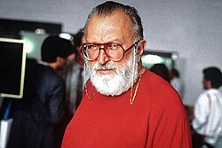

# Sergio Leone

## Biografía

Sergio Leone (Roma, 3 de enero de 1929-Roma, 30 de abril de 1989) fue un director, guionista y productor italiano conocido por sus spaghetti western.​

## Estilo musical

La mejor fuente en línea de música de películas y televisión. Copyright © 2018 - 2026 Whatsong.org. Reservados todos los derechos.

## Anécdotas y curiosidades

Un 3 de enero de 1929 nacía en Roma el cineasta Sergio Leone, que murió en 1989 de un ataque al corazón, probablemente causado, o eso se dice, por los problemas de corazón y las constantes preocupaciones que sufría con los juicios con la Warner Bros por los recortes de duración y exigua exhibición de Érase una vez en América (1984). De una forma u otra, nos dejó, además, sin que viera realizado su último sueño: Los 900 días, un largometraje centrado en el sitio de la ciudad de Leningrado en plena Segunda Guerra Mundial. Leone tenía planificado aquel horroroso y tenso desarrollo, donde la población murió de frío y hambre ante la ausencia de alimentos y productos básicos, como una de sus mayores películas, y una verdadera superproducción (la mayor hasta ese momento).

## Top 10 bandas sonoras

1. ***Once Upon a Time in America (Título en España: Érase una vez en América)***
    * **Póster:** [link](049_sergio_leone/posters/poster_once_upon_a_time_in_america_1984.jpg)
2. ***Il buono, il brutto, il cattivo (Título en España: El bueno, el feo y el malo)***
    * **Póster:** [link](049_sergio_leone/posters/poster_il_buono_il_brutto_il_cattivo_1966.jpg)
3. ***Unforgiven (Título en España: Sin perdón)***
    * **Póster:** [link](049_sergio_leone/posters/poster_unforgiven_1992.jpg)
4. ***C'era una volta il West (Título en España: Hasta que llegó su hora)***
    * **Póster:** [link](049_sergio_leone/posters/poster_c_era_una_volta_il_west_1968.jpg)
5. ***Per un pugno di dollari (Título en España: Por un puñado de dólares)***
    * **Póster:** [link](049_sergio_leone/posters/poster_per_un_pugno_di_dollari_1964.jpg)
6. ***Ben-Hur (Título en España: Ben-Hur)***
    * **Póster:** [link](049_sergio_leone/posters/poster_ben_hur_1959.jpg)
7. ***Per qualche dollaro in più (Título en España: La muerte tenía un precio)***
    * **Póster:** [link](049_sergio_leone/posters/poster_per_qualche_dollaro_in_pi_1965.jpg)
8. ***Giù la testa (Título en España: ¡Agáchate, maldito!)***
    * **Póster:** [link](049_sergio_leone/posters/poster_gi_la_testa_1971.jpg)
9. ***Ladri di biciclette (Título en España: Ladrón de bicicletas)***
    * **Póster:** [link](049_sergio_leone/posters/poster_ladri_di_biciclette_1948.jpg)
10. ***Il mio nome è Nessuno (Título en España: Mi nombre es Ninguno)***
    * **Póster:** [link](049_sergio_leone/posters/poster_il_mio_nome_nessuno_1973.jpg)

## Filmografía completa

- La bocca sulla strada (Título en España: La bocca sulla strada) (1941) · [Póster](049_sergio_leone/posters/poster_la_bocca_sulla_strada_1941.jpg)
- Ladri di biciclette (Título en España: Ladrón de bicicletas) (1948) · [Póster](049_sergio_leone/posters/poster_ladri_di_biciclette_1948.jpg)
- Il folle di Marechiaro (Título en España: Il folle di Marechiaro) (1950) · [Póster](049_sergio_leone/posters/poster_il_folle_di_marechiaro_1950.jpg)
- La forza del destino (Título en España: La forza del destino) (1950) · [Póster](049_sergio_leone/posters/poster_la_forza_del_destino_1950.jpg)
- Taxi di notte (Título en España: Taxi di notte) (1950) · [Póster](049_sergio_leone/posters/poster_taxi_di_notte_1950.jpg)
- Milano miliardaria (Título en España: Milano miliardaria) (1951) · [Póster](049_sergio_leone/posters/poster_milano_miliardaria_1951.jpg)
- Quo Vadis (Título en España: Quo Vadis) (1951) · [Póster](049_sergio_leone/posters/poster_quo_vadis_1951.jpg)
- I tre corsari (Título en España: I tre corsari) (1952) · [Póster](049_sergio_leone/posters/poster_i_tre_corsari_1952.jpg)
- La tratta delle bianche (Título en España: La trata de blancas) (1952) · [Póster](049_sergio_leone/posters/poster_la_tratta_delle_bianche_1952.jpg)
- Amanti del passato (Título en España: Amanti del passato) (1953) · [Póster](049_sergio_leone/posters/poster_amanti_del_passato_1953.jpg)
- Frine cortigiana d'Oriente (Título en España: Frine cortigiana d'Oriente) (1953) · [Póster](049_sergio_leone/posters/poster_frine_cortigiana_d_oriente_1953.jpg)
- Jolanda la figlia del corsaro nero (Título en España: Jolanda la figlia del corsaro nero) (1953) · [Póster](049_sergio_leone/posters/poster_jolanda_la_figlia_del_corsaro_nero_1953.jpg)
- L'uomo, la bestia e la virtù (Título en España: L'uomo, la bestia e la virtù) (1953) · [Póster](049_sergio_leone/posters/poster_l_uomo_la_bestia_e_la_virt_1953.jpg)
- Hanno rubato un tram (Título en España: Han robado un tranvía) (1954) · [Póster](049_sergio_leone/posters/poster_hanno_rubato_un_tram_1954.jpg)
- Questa è la vita (Título en España: Questa è la vita) (1954) · [Póster](049_sergio_leone/posters/poster_questa_la_vita_1954.jpg)
- Tradita (Título en España: Traicionada) (1954) · [Póster](049_sergio_leone/posters/poster_tradita_1954.jpg)
- La ladra (Título en España: La ladra) (1955) · [Póster](049_sergio_leone/posters/poster_la_ladra_1955.jpg)
- Mi permette babbo! (Título en España: Con su permiso papá) (1956) · [Póster](049_sergio_leone/posters/poster_mi_permette_babbo_1956.jpg)
- Helen of Troy (Título en España: Helena de Troya) (1956) · [Póster](049_sergio_leone/posters/poster_helen_of_troy_1956.jpg)
- El maestro (Título en España: El maestro) (1957) · [Póster](049_sergio_leone/posters/poster_el_maestro_1957.jpg)
- Afrodite, dea dell'amore (Título en España: Afrodita, diosa del amor) (1958) · [Póster](049_sergio_leone/posters/poster_afrodite_dea_dell_amore_1958.jpg)
- Nel segno di Roma (Título en España: Bajo el signo de Roma) (1959) · [Póster](049_sergio_leone/posters/poster_nel_segno_di_roma_1959.jpg)
- Ben-Hur (Título en España: Ben-Hur) (1959) · [Póster](049_sergio_leone/posters/poster_ben_hur_1959.jpg)
- The Nun's Story (Título en España: Historia de una monja) (1959) · [Póster](049_sergio_leone/posters/poster_the_nun_s_story_1959.jpg)
- Il figlio del corsaro rosso (Título en España: Il figlio del corsaro rosso) (1959) · [Póster](049_sergio_leone/posters/poster_il_figlio_del_corsaro_rosso_1959.jpg)
- Gli ultimi giorni di Pompei (Título en España: Los últimos días de Pompeya) (1959) · [Póster](049_sergio_leone/posters/poster_gli_ultimi_giorni_di_pompei_1959.jpg)
- Quai des illusions (Título en España: Quai des illusions) (1959) · [Póster](049_sergio_leone/posters/poster_quai_des_illusions_1959.jpg)
- Il colosso di Rodi (Título en España: El Coloso De Rodas) (1961) · [Póster](049_sergio_leone/posters/poster_il_colosso_di_rodi_1961.jpg)
- Le sette sfide (Título en España: Le sette sfide) (1961) · [Póster](049_sergio_leone/posters/poster_le_sette_sfide_1961.jpg)
- Romolo e Remo (Título en España: Rómulo y Remo) (1961) · [Póster](049_sergio_leone/posters/poster_romolo_e_remo_1961.jpg)
- Il cambio della guardia (Título en España: Il cambio della guardia) (1962) · [Póster](049_sergio_leone/posters/poster_il_cambio_della_guardia_1962.jpg)
- Sodom and Gomorrah (Título en España: Sodoma y Gomorra) (1962) · [Póster](049_sergio_leone/posters/poster_sodom_and_gomorrah_1962.jpg)
- Le verdi bandiere di Allah (Título en España: Le verdi bandiere di Allah) (1963) · [Póster](049_sergio_leone/posters/poster_le_verdi_bandiere_di_allah_1963.jpg)
- Per un pugno di dollari (Título en España: Por un puñado de dólares) (1964) · [Póster](049_sergio_leone/posters/poster_per_un_pugno_di_dollari_1964.jpg)
- Per qualche dollaro in più (Título en España: La muerte tenía un precio) (1965) · [Póster](049_sergio_leone/posters/poster_per_qualche_dollaro_in_pi_1965.jpg)
- Il buono, il brutto, il cattivo (Título en España: El bueno, el feo y el malo) (1966) · [Póster](049_sergio_leone/posters/poster_il_buono_il_brutto_il_cattivo_1966.jpg)
- C'era una volta il West (Título en España: Hasta que llegó su hora) (1968) · [Póster](049_sergio_leone/posters/poster_c_era_una_volta_il_west_1968.jpg)
- Une corde, un Colt... (Título en España: Una cuerda, un Colt) (1969) · [Póster](049_sergio_leone/posters/poster_une_corde_un_colt_1969.jpg)
- Giù la testa (Título en España: ¡Agáchate, maldito!) (1971) · [Póster](049_sergio_leone/posters/poster_gi_la_testa_1971.jpg)
- Il mio nome è Nessuno (Título en España: Mi nombre es Ninguno) (1973) · [Póster](049_sergio_leone/posters/poster_il_mio_nome_nessuno_1973.jpg)
- Un genio, due compari, un pollo (Título en España: El Genio) (1975) · [Póster](049_sergio_leone/posters/poster_un_genio_due_compari_un_pollo_1975.jpg)
- Il gatto (Título en España: La casa de los desmadres) (1977) · [Póster](049_sergio_leone/posters/poster_il_gatto_1977.jpg)
- The Man with No Name (Título en España: The Man with No Name) (1977) · [Póster](049_sergio_leone/posters/poster_the_man_with_no_name_1977.jpg)
- An Almost Perfect Affair (Título en España: An Almost Perfect Affair) (1979) · [Póster](049_sergio_leone/posters/poster_an_almost_perfect_affair_1979.jpg)
- Un sacco bello (Título en España: Spaghetti) (1980) · [Póster](049_sergio_leone/posters/poster_un_sacco_bello_1980.jpg)
- Bianco, rosso e Verdone (Título en España: Bianco, rosso e Verdone) (1981) · [Póster](049_sergio_leone/posters/poster_bianco_rosso_e_verdone_1981.jpg)
- Once Upon a Time in America (Título en España: Érase una vez en América) (1984) · [Póster](049_sergio_leone/posters/poster_once_upon_a_time_in_america_1984.jpg)
- Bellissimo: Immagini del cinema italiano (Título en España: Bellissimo: Immagini del cinema italiano) (1985) · [Póster](049_sergio_leone/posters/poster_bellissimo_immagini_del_cinema_italiano_1985.jpg)
- Troppo forte (Título en España: Troppo forte) (1986) · [Póster](049_sergio_leone/posters/poster_troppo_forte_1986.jpg)
- The King of Ads (Título en España: The King of Ads) (1991) · [Póster](049_sergio_leone/posters/poster_the_king_of_ads_1991.jpg)
- Unforgiven (Título en España: Sin perdón) (1992) · [Póster](049_sergio_leone/posters/poster_unforgiven_1992.jpg)
- Kino kolossal - Herkules, Maciste & Co (Título en España: Kino kolossal - Herkules, Maciste & Co) (2000) · [Póster](049_sergio_leone/posters/poster_kino_kolossal_herkules_maciste_co_2000.jpg)
- Once Upon a Time: Sergio Leone (Título en España: Once Upon a Time: Sergio Leone) (2000) · [Póster](049_sergio_leone/posters/poster_once_upon_a_time_sergio_leone_2000.jpg)
- Sergio Leone - C'era una volta il sogno americano (Título en España: Sergio Leone - C'era una volta il sogno americano) (2002) · [Póster](049_sergio_leone/posters/poster_sergio_leone_c_era_una_volta_il_sogno_americano_2002.jpg)
- An Opera of Violence (Título en España: An Opera of Violence) (2003) · [Póster](049_sergio_leone/posters/poster_an_opera_of_violence_2003.jpg)
- Italian Kings Of B (Título en España: Italian Kings Of B) (2003) · [Póster](049_sergio_leone/posters/poster_italian_kings_of_b_2003.jpg)
- Something to Do with Death (Título en España: Something to Do with Death) (2003) · [Póster](049_sergio_leone/posters/poster_something_to_do_with_death_2003.jpg)
- The Wages of Sin (Título en España: The Wages of Sin) (2003) · [Póster](049_sergio_leone/posters/poster_the_wages_of_sin_2003.jpg)
- The Spaghetti West (Título en España: The Spaghetti West) (2005) · [Póster](049_sergio_leone/posters/poster_the_spaghetti_west_2005.jpg)
- Vivaldi, the Red Priest (Título en España: Vivaldi, the Red Priest) (2009) · [Póster](049_sergio_leone/posters/poster_vivaldi_the_red_priest_2009.jpg)
- Eastwood Directs: The Untold Story (Título en España: Eastwood Directs: The Untold Story) (2013) · [Póster](049_sergio_leone/posters/poster_eastwood_directs_the_untold_story_2013.jpg)
- I Tarantiniani (Título en España: I Tarantiniani) (2013) · [Póster](049_sergio_leone/posters/poster_i_tarantiniani_2013.jpg)
- Il était une fois Sergio Leone (Título en España: Il était une fois Sergio Leone) (2014) · [Póster](049_sergio_leone/posters/poster_il_tait_une_fois_sergio_leone_2014.jpg)
- Poltrone Rosse - Parma e il cinema (Título en España: Poltrone Rosse - Parma e il cinema) (2014) · [Póster](049_sergio_leone/posters/poster_poltrone_rosse_parma_e_il_cinema_2014.jpg)
- Spanish Western (Título en España: Spanish Western) (2015) · [Póster](049_sergio_leone/posters/poster_spanish_western_2015.jpg)
- Sad Hill Unearthed (Título en España: Desenterrando Sad Hill) (2018) · [Póster](049_sergio_leone/posters/poster_sad_hill_unearthed_2018.jpg)
- Sergio Leone, une Amérique de légende (Título en España: Sergio Leone, une Amérique de légende) (2018) · [Póster](049_sergio_leone/posters/poster_sergio_leone_une_am_rique_de_l_gende_2018.jpg)
- Django & Django: Sergio Corbucci Unchained (Título en España: Django & Django) (2021) · [Póster](049_sergio_leone/posters/poster_django_django_sergio_corbucci_unchained_2021.jpg)
- Clint Eastwood, la dernière légende (Título en España: Clint Eastwood: la última leyenda) (2022) · [Póster](049_sergio_leone/posters/poster_clint_eastwood_la_derni_re_l_gende_2022.jpg)
- Sergio Leone - L'italiano che inventò l'America (Título en España: Sergio Leone: El italiano que inventó América) (2022) · [Póster](049_sergio_leone/posters/poster_sergio_leone_l_italiano_che_invent_l_america_2022.jpg)
- Colt (Título en España: Colt) · [Póster](049_sergio_leone/posters/poster_colt.jpg)

## Premios y nominaciones

* David di Donatello al mejor director – (Ganador)
* Nastro d'Argento al director de la mejor película – (Ganador)

## Fuentes adicionales

* [MundoBSO](https://w.mundobso.com/bso/cartero-siempre-llama-dos-veces-el) — site:mundobso.com
* [MundoBSO (2)](https://www.mundobso.com/bso/capitan-america-civil-war) — site:mundobso.com
* [MundoBSO (3)](https://www.mundobso.com/bso/milla-verde-la) — site:mundobso.com
* [Film Score Monthly](https://www.filmscoremonthly.com/board/posts.cfm?threadID=159118) — site:filmscoremonthly.com
* [Film Score Monthly (2)](https://www.filmscoremonthly.com/board/posts.cfm?threadID=132437&forumID=1&archive=0) — site:filmscoremonthly.com
* [Film Score Monthly (3)](https://www.filmscoremonthly.com/board/posts.cfm?threadID=77221) — site:filmscoremonthly.com
* [SoundtrackCollector](https://www.soundtrackcollector.com/title/72441/Ennio+Morricone:+Le+Colonne+Sonore+Dei+Film+Di+Sergio+Leone) — site:soundtrackcollector.com
* [SoundtrackCollector (2)](https://www.soundtrackcollector.com/?url) — site:soundtrackcollector.com
* [SoundtrackCollector (3)](https://www.soundtrackcollector.com/?url=v) — site:soundtrackcollector.com
* [WhatSong](https://www.whatsong.org) — site:whatsong.org
* [WhatSong (2)](https://www.whatsong.org/tvshow/how-i-met-your-mother/episode/44483) — site:whatsong.org
* [WhatSong (3)](https://www.whatsong.org/tvshow/smallville/episode/39263) — site:whatsong.org

## Notas externas

* MundoBSO (2): Compositor: Jackman, Henry Sello: Hollywood Duración: 69 minutos Información de la película Título original: Captain America: Civil War Director: Anthony Russo, Joe Russo Nacionalidad: EE UU Año: 2016 Argumento Continuación de Captain America: The Winter Soldier (14). Cuando otro incidente internacional involucra a Los Vengadores y causan varios daños colaterales, aumentan las presiones políticas para exigir más responsabilidades y determinar cuándo deben contratar los servicios del grupo de superhéroes. Esta nueva situación dividirá a Los Vengadores, mientras intentan proteger al mundo de un nuevo y terrible villano. Compositor: Jackman, Henry Sello: Hollywood Duración: 69 minutos
* MundoBSO (3): Compositor: Newman, Thomas Sello: Warner Duración: 66 minutos Información de la película Título original: The Green Mile Director: Frank Darabont Nacionalidad: EE UU Año: 1999 Argumento A mediados de los años treinta, un guarda de prisiones que custodia a los condenados a muerte descubre poderes sobrenaturales en un inmenso hombre negro, acusado de haber asesinado a dos niñas. Eso le llevará a creer en su inocencia. Premios Saturn: 1 nominación Compositor: Newman, Thomas Sello: Warner Duración: 66 minutos
* SoundtrackCollector (2): 14 de enero - Confesión de un comisionado de policía de Riz Ortolani a la fiscalía 3 de diciembre - Wolf Hall de Debbie Wiseman: El espejo y la luz
* SoundtrackCollector (3): 14 de enero - Confesión de un comisionado de policía de Riz Ortolani a la fiscalía 3 de diciembre - Wolf Hall de Debbie Wiseman: El espejo y la luz
* WhatSong: La mejor fuente en línea de música de películas y televisión. Copyright © 2018 - 2026 Whatsong.org. Reservados todos los derechos.
* WhatSong (2): Lily y Robin bailan con los dos nerds del último año de secundaria. Se reproduce de fondo cuando Lilly, Robin y Barney intentan entrar a la fiesta. La canción es una canción que está incluida en iMovie.
* WhatSong (3): Actuó mientras Pete mastica chicle de kriptonita y luego salva a Kara. OneRepublic - Soñando en voz alta (edición ampliada)
* scrapsfromtheloft.com: Le preguntaron a Claude Lelouch qué director americano le gusta más y dice. "Sergio Leona!" —Sergio Leone Es un día cálido y soleado de marzo en Cinecittà, y la película que Sergio Leone ha estado intentando hacer durante diez años se encuentra ahora en los últimos días de rodaje. Leone se cierne sobre una mesa de edición, absorto en la acción de la pantalla, con su productor, asistentes e intérprete a su lado. La batalla con su distribuidor norteamericano, The Ladd Company, no es en este momento ni una nube en el horizonte de Roma. Por ahora, Leone puede trabajar duro para hacer realidad su sueño de 45 millones de dólares. Érase una vez en América se basa libremente en un libro llamado The Hoods, escrito por Harry Goldberg bajo el seudónimo...
* www.openculture.com: Casi todos los que han escuchado música también han recibido sensaciones intensas de la música. "Sabemos que la música activa partes del cerebro que regulan las emociones, que puede ayudarnos a concentrarnos, desencadenar recuerdos y hacernos querer bailar", dice Evan Puschak, más conocido como Nerdwriter, en su último ensayo en vídeo. "La música encaja tan bien con los patrones de pensamiento, que es casi como si esa cualidad lírica estuviera latente en la vida, o en la realidad, o en ambas. En el cine, nadie entendió esto mejor que Sergio Leone, el director italiano de spaghetti westerns operísticos". Y aunque es posible que usted no haya visto ningún spaghetti western, ni siquiera la trilogía de Leone protagonizada por Clint Eastwood...
* elcinedesergioleone.movie.blog: El elemento que quizá sea el más característico y relevante del Western de Leone es la música, música llevada a cabo por el magistral Ennio Morricone, que cambiaría la concepción de las bandas sonoras a partir de ese momento. Morricone, que era un gran amigo de Leone, contaba con un bajo presupuesto, por lo que las composiciones orquestales del Western clásico fueron sustituidas por composiciones más simples. En el primero, la música ayudaba a ensalzar la figura del vaquero y la heroificación de Estados Unidos, sin embargo, la nueva forma de concebir las películas del oeste suponía mostrar unos nuevos valores, por lo que en el Spaghetti Western, la música se vio arrastrada también al cambio.
* taiarts.com: Áreas Artes Escénicas Grado Grado en Artes Escénicas e Interpretación Audiovisual Máster Máster Universitario en Interpretación Audiovisual Máster en Teatro Musical Diplomas Diploma en Teatro Musical Diploma en Artes Escénicas e Interpretación Audiovisual Cine y Audiovisual Grado Grado en Cinematografía Máster Máster en Montaje y Corrección de Color para Cine y Series Máster en Dirección de Cine y Series Máster en Guion de Cine, Series y Formatos de No Ficción Máster en Dirección Artística para Cine y Series Máster en Postproducción y VFX Máster en Dirección de Fotografía y Cámara Máster en Dirección de Producción para Cine y Series Diplomas Diploma en Cinematografía y Series Arte Digital...
* www.aso.org: Entradas para grupos y membresías IN UNISON BRAVO Jóvenes profesionales Veteranos Descuentos para grupos AMPLIFY COUNTERPOINT RushPass College Pass Estudiantes y familias Música para los más jóvenes UpTempo Teen Night College Pass Conciertos familiares Vivo Summer String Institute
