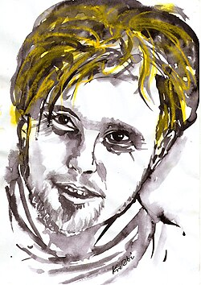

# Krzysztof Komeda

## Biografía

Krzysztof Trzcinski (Poznań, 27 de abril de 1931 - Varsovia, 23 de abril de 1969) fue un compositor, arreglista y pianista de jazz polaco. En 1939 se convirtió en el alumno más joven en ingresar al conservatorio de Poznań con tan solo 8 años. Médico de formación abandonó la medicina para dedicarse de lleno a la música, es considerado uno de los mejores músicos de la historia del Jazz polaco​ junto a Jerzy Matuszkiewicz, Andrzej Trzaskowski y Andrzej Kurylewicz. Trabajó junto a Roman Polanski y Andrzej Wajda componiendo la música para sus primeros cortos; más tarde realizó la música de la película El cuchillo en el agua (1962) de Polanski, que le proporcionó prestigio. Fue víctima de un trágico accidente: se cayó en un barranco volviendo a casa con su amigo Marek Hłasko en la ciudad de Los Ángeles, California sufriendo varias heridas en la cabeza, lo que le provocó la muerte pocos meses después.

## Estilo musical

En 1939 se convirtió en el alumno más joven en ingresar al conservatorio de Poznań con tan solo 8 años. Médico de formación abandonó la medicina para dedicarse de lleno a la música, es considerado uno de los mejores músicos de la historia del Jazz polaco [ 1 ] ​ junto a Jerzy Matuszkiewicz, Andrzej Trzaskowski y Andrzej Kurylewicz. Trabajó junto a Roman Polanski y Andrzej Wajda componiendo la música para sus primeros cortos; más tarde realizó la música de la película El cuchillo en el agua (1962) de Polanski, que le proporcionó prestigio. Fue víctima de un trágico accidente: se cayó en un barranco volviendo a casa con su amigo Marek Hłasko en la ciudad de Los Ángeles, California sufriendo varias heridas en la cabeza, lo que le provocó la muerte pocos meses después.

## Anécdotas y curiosidades

1 Vida y carrera Toggle Subsección Vida y carrera 1.1 Vida temprana y educación 1.2 Inicios de carrera 1.3 Década de 1960 1.4 Accidente y muerte

## Top 10 bandas sonoras

1. ***Rosemary's Baby (Título en España: La semilla del diablo)***
    * **Póster:** [link](051_krzysztof_komeda/posters/poster_rosemary_s_baby_1968.jpg)
2. ***The Fearless Vampire Killers (Título en España: El baile de los vampiros)***
    * **Póster:** [link](051_krzysztof_komeda/posters/poster_the_fearless_vampire_killers_1967.jpg)
3. ***Nóż w wodzie (Título en España: El cuchillo en el agua)***
    * **Póster:** [link](051_krzysztof_komeda/posters/poster_n_w_wodzie_1962.jpg)
4. ***Cul-de-sac (Título en España: Callejón sin salida)***
    * **Póster:** [link](051_krzysztof_komeda/posters/poster_cul_de_sac_1966.jpg)
5. ***Sult (Título en España: Hambre)***
    * **Póster:** [link](051_krzysztof_komeda/posters/poster_sult_1966.jpg)
6. ***Dwaj ludzie z szafą (Título en España: Dos hombres y un armario)***
    * **Póster:** [link](051_krzysztof_komeda/posters/poster_dwaj_ludzie_z_szaf_1958.jpg)
7. ***Zezowate szczęście (Título en España: Mala suerte)***
    * **Póster:** [link](051_krzysztof_komeda/posters/poster_zezowate_szcz_cie_1960.jpg)
8. ***Niewinni czarodzieje (Título en España: Niewinni czarodzieje)***
    * **Póster:** [link](051_krzysztof_komeda/posters/poster_niewinni_czarodzieje_1960.jpg)
9. ***Le départ (Título en España: La partida)***
    * **Póster:** [link](051_krzysztof_komeda/posters/poster_le_d_part_1967.jpg)
10. ***Gdy spadają anioły (Título en España: Ángeles caídos (C))***
    * **Póster:** [link](051_krzysztof_komeda/posters/poster_gdy_spadaj_anio_y_1959.jpg)

## Filmografía completa

- Rozmowy jazzowe (Título en España: Rozmowy jazzowe) (1957) · [Póster](051_krzysztof_komeda/posters/poster_rozmowy_jazzowe_1957.jpg)
- Dwaj ludzie z szafą (Título en España: Dos hombres y un armario) (1958) · [Póster](051_krzysztof_komeda/posters/poster_dwaj_ludzie_z_szaf_1958.jpg)
- Gdy spadają anioły (Título en España: Ángeles caídos (C)) (1959) · [Póster](051_krzysztof_komeda/posters/poster_gdy_spadaj_anio_y_1959.jpg)
- Do widzenia, do jutra... (Título en España: Do widzenia, do jutra...) (1960) · [Póster](051_krzysztof_komeda/posters/poster_do_widzenia_do_jutra_1960.jpg)
- Zezowate szczęście (Título en España: Mala suerte) (1960) · [Póster](051_krzysztof_komeda/posters/poster_zezowate_szcz_cie_1960.jpg)
- Niewinni czarodzieje (Título en España: Niewinni czarodzieje) (1960) · [Póster](051_krzysztof_komeda/posters/poster_niewinni_czarodzieje_1960.jpg)
- Le gros et le maigre (Título en España: Le gros et le maigre) (1961) · [Póster](051_krzysztof_komeda/posters/poster_le_gros_et_le_maigre_1961.jpg)
- Nóż w wodzie (Título en España: El cuchillo en el agua) (1962) · [Póster](051_krzysztof_komeda/posters/poster_n_w_wodzie_1962.jpg)
- Jutro premiera (Título en España: Jutro premiera) (1962) · [Póster](051_krzysztof_komeda/posters/poster_jutro_premiera_1962.jpg)
- Ssaki (Título en España: Mamíferos) (1962) · [Póster](051_krzysztof_komeda/posters/poster_ssaki_1962.jpg)
- Mój stary (Título en España: Mój stary) (1962) · [Póster](051_krzysztof_komeda/posters/poster_m_j_stary_1962.jpg)
- Nad wielką wodą (Título en España: Nad wielką wodą) (1962) · [Póster](051_krzysztof_komeda/posters/poster_nad_wielk_wod_1962.jpg)
- Wyrok (Título en España: Wyrok) (1962) · [Póster](051_krzysztof_komeda/posters/poster_wyrok_1962.jpg)
- Smarkula (Título en España: Smarkula) (1963) · [Póster](051_krzysztof_komeda/posters/poster_smarkula_1963.jpg)
- Les Plus Belles Escroqueries du monde (Título en España: Las más famosas estafas del mundo) (1964) · [Póster](051_krzysztof_komeda/posters/poster_les_plus_belles_escroqueries_du_monde_1964.jpg)
- Okolice Peronów (Título en España: Okolice Peronów) (1964) · [Póster](https://example.com/placeholder.jpg)
- Prawo i pięść (Título en España: Prawo i pięść) (1964) · [Póster](051_krzysztof_komeda/posters/poster_prawo_i_pi_1964.jpg)
- Przerwany lot (Título en España: Przerwany lot) (1964) · [Póster](051_krzysztof_komeda/posters/poster_przerwany_lot_1964.jpg)
- Popioły (Título en España: Cenizas) (1965) · [Póster](051_krzysztof_komeda/posters/poster_popio_y_1965.jpg)
- Kattorna (Título en España: Kattorna) (1965) · [Póster](051_krzysztof_komeda/posters/poster_kattorna_1965.jpg)
- Cul-de-sac (Título en España: Callejón sin salida) (1966) · [Póster](051_krzysztof_komeda/posters/poster_cul_de_sac_1966.jpg)
- Sult (Título en España: Hambre) (1966) · [Póster](051_krzysztof_komeda/posters/poster_sult_1966.jpg)
- The Fearless Vampire Killers (Título en España: El baile de los vampiros) (1967) · [Póster](051_krzysztof_komeda/posters/poster_the_fearless_vampire_killers_1967.jpg)
- Le départ (Título en España: La partida) (1967) · [Póster](051_krzysztof_komeda/posters/poster_le_d_part_1967.jpg)
- Mennesker mødes og sød musik opstår i hjertet (Título en España: Mennesker mødes og sød musik opstår i hjertet) (1967) · [Póster](051_krzysztof_komeda/posters/poster_mennesker_m_des_og_s_d_musik_opst_r_i_hjertet_1967.jpg)
- Rosemary's Baby (Título en España: La semilla del diablo) (1968) · [Póster](051_krzysztof_komeda/posters/poster_rosemary_s_baby_1968.jpg)
- Komeda: A Soundtrack for a Life (Título en España: Komeda: A Soundtrack for a Life) (2010) · [Póster](051_krzysztof_komeda/posters/poster_komeda_a_soundtrack_for_a_life_2010.jpg)
- Komeda, Komeda... (Título en España: Komeda, Komeda...) (2012) · [Póster](051_krzysztof_komeda/posters/poster_komeda_komeda_2012.jpg)

## Premios y nominaciones

* Premio de la Academia – por *Best Film Score* – (Nominación)

## Fuentes adicionales

* [MundoBSO](https://w.mundobso.com/bso/cartero-siempre-llama-dos-veces-el) — site:mundobso.com
* [MundoBSO (2)](https://www.mundobso.com/bso/007-al-servicio-secreto-de-su-majestad) — site:mundobso.com
* [MundoBSO (3)](https://www.mundobso.com/bso/frozen-el-reino-del-hielo) — site:mundobso.com
* [Film Score Monthly](https://www.filmscoremonthly.com/backissues/viewissue.cfm?issueID=63) — site:filmscoremonthly.com
* [Film Score Monthly (2)](https://filmscoremonthly.com/board/posts.cfm?threadID=9938&forumID=1&archive=1) — site:filmscoremonthly.com
* [Film Score Monthly (3)](https://www.filmscoremonthly.com/daily/article.cfm/articleID/6355/Childrens-Choirs-and-Devils-Lullabies-or-The-Kids-Arent-Alright/) — site:filmscoremonthly.com
* [SoundtrackCollector](https://www.soundtrackcollector.com/title/19266/N%C3%B3z+W+Wodzie) — site:soundtrackcollector.com
* [SoundtrackCollector (2)](https://www.soundtrackcollector.com) — site:soundtrackcollector.com
* [SoundtrackCollector (3)](https://www.soundtrackcollector.com/title/10469/Pan+Tadeusz) — site:soundtrackcollector.com
* [WhatSong](https://www.whatsong.org/tvshow/grown-ish/episode/82123) — site:whatsong.org
* [WhatSong (2)](https://www.whatsong.org/tvshow/how-i-met-your-mother/episode/44483) — site:whatsong.org
* [WhatSong (3)](https://www.whatsong.org/movie/rocky-iv) — site:whatsong.org

## Notas externas

* MundoBSO (2): Compositor: Barry, John Sello: La-La Land Duración: 150 minutos Información de la película Título original: On Her Majesty’s Secret Service Director: Peter R. Hunt Nacionalidad: Reino Unido Año: 1969 Argumento El agente británico James Bond evita que una joven se suicide. El padre de la muchacha, un capo mafioso, le pide que se case con ella a cambio de darle información sobre su archienemigo Ernst Blofeld. Compositor: Barry, John Sello: La-La Land Duración: 150 minutos
* MundoBSO (3): Compositores: Beck, Christophe | Lopez, Robert Sello: Disney Duración: 98 minutos Título original: Frozen Director: Chris Buck, Jennifer Lee Nacionalidad: EE UU Año: 2013
* SoundtrackCollector (2): 14 de enero - Confesión de un comisionado de policía de Riz Ortolani a la fiscalía 3 de diciembre - Wolf Hall de Debbie Wiseman: El espejo y la luz
* SoundtrackCollector (3): Pan Tadeusz - Cuando Napoleón cruzó el Niemen (2000, Francia) Pan Tadeusz: La última incursión en Lituania (1999, Internacional: título en inglés)
* WhatSong: Luca está pensando en él y en el encuentro sexual de Zoey de la noche anterior. Luca está estresado por su "yo". Texto a Zoey y su falta de respuesta.
* WhatSong (2): Lily y Robin bailan con los dos nerds del último año de secundaria. Se reproduce de fondo cuando Lilly, Robin y Barney intentan entrar a la fiesta. La canción es una canción que está incluida en iMovie.
* WhatSong (3): Gladys Knight, Kenny Loggins - Rocky IV (Banda sonora original de la película) Gladys Knight - Rocky IV (Banda sonora original de la película)
* jazzforum.com.pl: Este artículo de Stuart Nicholson, que apareció por primera vez en la revista mensual británica "Jazzwise" (noviembre de 2008), se publica ahora, con el permiso del autor, en la revista polaca JAZZ FORUM 4-5/2009. Este número salió de impresión el 23 de abril, exactamente el 40º aniversario de la prematura muerte del legendario pianista y compositor Krzysztof Komeda, el padre del jazz moderno en Polonia, un visionario pionero del jazz europeo. “Un innovador con una tradición compleja, un romántico que se expresa en el lenguaje contemporáneo, un poeta del piano: así fue Krzysztof Komeda, uno de los músicos que amplió la esencia del jazz”. Adán Slavinski. En 1997, el trompetista polaco...
* www.medici.tv: Retrato del jazzista y compositor de música de cine Un homenaje a Krzysztof Komeda, compositor de música de cine y jazzista, rendido por sus colegas y amigos.
* worldofjazz.org: Krzysztof Komeda (1931-1969) es probablemente más conocido hoy en día como compositor de cine, especialmente por sus partituras para algunas de las películas más famosas de Roman Polanski de la década de 1960: Knife In The Water, Rosemary's Baby y Cul-De Sac. Sin embargo, su lugar en la historia del jazz europeo está asegurado por su destacado álbum 'Astigmatic' de 1966 que, junto con Under Milk Wood (1965) de Stan Tracey y Swinging Macedonia (1966) de Duško Gojković, fueron quizás los primeros signos de que el jazz europeo no tenía que seguir servilmente los modelos estadounidenses y podía sonar distintivo. En 1956, Komeda estudió y obtuvo el título de médico en la academia de medicina de Poznań.
* jazz.pj39.com: 㻣££££££££££££££mp ãμμμμμμ³²μ²μμμμμμated«ug£££uggÀ‼ugged 1931å´4x´46x »27xμμμμμμμμμμug 1969å´4x´41¹μovovμμovatedμμμovated 60å¹´è´è²®§atedated®µµµµºug. èã´èpping ugÀ¯«²»¹²¹²²²²¶ug´ãµ d£thº º³³â ³²²²²¸uggè´´ãughèughº´th´ £⁏ugg貺²²²²²²²²²²3ated
* polishhistory.pl: Es mejor conocido por su colaboración con el director polaco Roman Polański, para quien compuso la música para varias películas, como Knife in the Water y Rosemary's Baby, ambas reconocidas por la American Film Academy. El conmovedor tema de la canción de cuna de este último, tarareada por Mia Farrow, se ha convertido en una de las piezas musicales de cine más reconocibles de todos los tiempos. A pesar de su carrera relativamente corta, Komeda también influyó fuertemente en la música jazz polaca, en la que se le considera un pionero de la modernidad. Nació el 27 de abril de 1931 en Poznań como hijo de Zenobia y Mieczyslaw Trzcinski. Su padre trabajaba como empleado en el Banco de Polonia, mientras su madre se ocupaba de la casa, siendo al mismo tiempo la...
