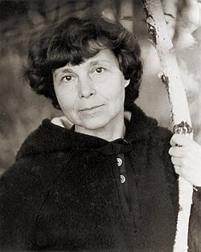

# Sofia Gubaidulina

## Biografía

Sofiya Asgátovna Gubaidúlina (en ruso: София Асгатовна Губайдулина) (Chístopol, Tartaristán, 24 de octubre de 1931 - Appen, 13 de marzo de 2025)​​​ fue una compositora rusa de origen tártaro, conocida por la profundidad religiosa de su música. Es una de las figuras más destacadas de la música clásica contemporánea.

## Estilo musical

Los intereses compositivos de Gubaidulina han sido estimulados por la exploración táctil y la improvisación con raros instrumentos folclóricos y rituales rusos, caucásicos y asiáticos recopilados por el conjunto "Astreia", del que fue cofundadora, por la rápida absorción y personalización de técnicas musicales occidentales contemporáneas (una característica también de otros compositores soviéticos de la generación post-Stalin, incluidos Edison Denisov y Alfred Schnittke), y por una creencia profundamente arraigada en las propiedades místicas de la música.

## Anécdotas y curiosidades

Sofia Gubaidulina nació en 1931 en la región tártara de la Unión Soviética (ahora Rusia). Su familia poseía un viejo piano que Sofía tocaba metiendo la mano en su interior y punteando las cuerdas, lo que despertó su interés por componer. Estudió música cerca de casa y luego se mudó a una ciudad más grande para continuar su educación.

## Top 10 bandas sonoras

1. ***Маугли (Título en España: Маугли)***
    * **Póster:** [link](052_sofia_gubaidulina/posters/poster_poster_1973.jpg)
2. ***Чучело (Título en España: Чучело)***
    * **Póster:** [link](052_sofia_gubaidulina/posters/poster_poster_1983.jpg)
3. ***The Fire and the Rose (Título en España: The Fire and the Rose)***
    * **Póster:** [link](052_sofia_gubaidulina/posters/poster_the_fire_and_the_rose_1990.jpg)
4. ***Вертикаль (Título en España: Vertical)***
    * **Póster:** [link](052_sofia_gubaidulina/posters/poster_poster_1966.jpg)
5. ***Кошка, которая гуляла сама по себе (Título en España: Кошка, которая гуляла сама по себе)***
    * **Póster:** [link](052_sofia_gubaidulina/posters/poster_poster_1988.jpg)
6. ***Каждый день доктора Калинниковой (Título en España: Каждый день доктора Калинниковой)***
    * **Póster:** [link](052_sofia_gubaidulina/posters/poster_poster_1974.jpg)
7. ***Белый взрыв (Título en España: Белый взрыв)***
    * **Póster:** [link](052_sofia_gubaidulina/posters/poster_poster_1969.jpg)
8. ***Убить Скорпиона (Título en España: Убить Скорпиона)***
    * **Póster:** [link](052_sofia_gubaidulina/posters/poster_poster_1991.jpg)
9. ***Великий самоед (Título en España: Великий самоед)***
    * **Póster:** [link](052_sofia_gubaidulina/posters/poster_poster_1982.jpg)
10. ***Хотите - верьте, хотите - нет (Título en España: Хотите - верьте, хотите - нет)***
    * **Póster:** [link](052_sofia_gubaidulina/posters/poster_poster_1964.jpg)

## Filmografía completa

- Хотите - верьте, хотите - нет (Título en España: Хотите - верьте, хотите - нет) (1964) · [Póster](052_sofia_gubaidulina/posters/poster_poster_1964.jpg)
- Вертикаль (Título en España: Vertical) (1966) · [Póster](052_sofia_gubaidulina/posters/poster_poster_1966.jpg)
- Белый взрыв (Título en España: Белый взрыв) (1969) · [Póster](052_sofia_gubaidulina/posters/poster_poster_1969.jpg)
- Маугли (Título en España: Маугли) (1973) · [Póster](052_sofia_gubaidulina/posters/poster_poster_1973.jpg)
- Каждый день доктора Калинниковой (Título en España: Каждый день доктора Калинниковой) (1974) · [Póster](052_sofia_gubaidulina/posters/poster_poster_1974.jpg)
- Великий самоед (Título en España: Великий самоед) (1982) · [Póster](052_sofia_gubaidulina/posters/poster_poster_1982.jpg)
- Чучело (Título en España: Чучело) (1983) · [Póster](052_sofia_gubaidulina/posters/poster_poster_1983.jpg)
- Кошка, которая гуляла сама по себе (Título en España: Кошка, которая гуляла сама по себе) (1988) · [Póster](052_sofia_gubaidulina/posters/poster_poster_1988.jpg)
- The Fire and the Rose (Título en España: The Fire and the Rose) (1990) · [Póster](052_sofia_gubaidulina/posters/poster_the_fire_and_the_rose_1990.jpg)
- Убить Скорпиона (Título en España: Убить Скорпиона) (1991) · [Póster](052_sofia_gubaidulina/posters/poster_poster_1991.jpg)
- Sophia: Ein Violinkonzert für Anne-Sophie Mutter (Título en España: Sophia: Ein Violinkonzert für Anne-Sophie Mutter) (2008) · [Póster](https://example.com/placeholder.jpg)
- Сад радости в мире печали (Título en España: Сад радости в мире печали) (2011) · [Póster](052_sofia_gubaidulina/posters/poster_poster_2011.jpg)
- The Lost Paradise (Título en España: El Paraíso perdido un retrato de Arvo Pärt) (2015) · [Póster](052_sofia_gubaidulina/posters/poster_the_lost_paradise_2015.jpg)

## Premios y nominaciones

* 1990 – Honrado trabajador del arte de la República Socialista Federativa Soviética de Rusia – (Ganador)
* 1992 – Premio Estatal de la Federación Rusa – (Ganador)
* 1998 – premio imperial – (Ganador)
* 1999 – Premio de Música Léonie Sonning – (Ganador)
* 2001 – Medalla Goethe – (Ganador)
* 2001 – Q24932254 – (Ganador)
* 2007 – Premio Bach de la Ciudad Libre y Hanseática de Hamburgo – (Ganador)
* 2016 – Orden "Anochecer" – (Ganador)
* 2016 – Premio Fundación BBVA Fronteras del Conocimiento – (Ganador)
* Cruz de Caballero Comendador de la Orden del Mérito de la República Federal de Alemania – (Ganador)
* Honrado trabajador del arte de la República Socialista Federativa Soviética de Rusia – (Ganador)
* Orden Pour le Mérite para las Ciencias y las Artes – (Ganador)
* Orden al Mérito en la Cultura y el Arte – (Ganador)
* Orden de la Amistad – (Ganador)
* Orden del Mérito de la República Federal de Alemania – (Ganador)
* Premio Alexander Men – (Ganador)
* ciudadano honorario de Kazán – (Ganador)
* por mérito – (Ganador)

## Fuentes adicionales

* [MundoBSO](https://w.mundobso.com/bso/cartero-siempre-llama-dos-veces-el) — site:mundobso.com
* [MundoBSO (2)](https://www.mundobso.com/bso/frozen-el-reino-del-hielo) — site:mundobso.com
* [MundoBSO (3)](https://www.mundobso.com/bso/million-dollar-baby) — site:mundobso.com
* [Film Score Monthly](https://www.filmscoremonthly.com/fsmonline/video_archive.cfm) — site:filmscoremonthly.com
* [Film Score Monthly (2)](https://www.filmscoremonthly.com/notes/wild_bunch_alt.html) — site:filmscoremonthly.com
* [Film Score Monthly (3)](https://www.filmscoremonthly.com/backissues/viewissue.cfm?issueID=74) — site:filmscoremonthly.com
* [SoundtrackCollector](https://www.soundtrackcollector.com) — site:soundtrackcollector.com
* [SoundtrackCollector (2)](https://soundtrackcollector.com) — site:soundtrackcollector.com
* [SoundtrackCollector (3)](https://www.soundtrackcollector.com/catalog/soundtracktopic.php?movieid=76595&topicid=7685) — site:soundtrackcollector.com
* [WhatSong](https://www.whatsong.org/tvshow/vikings/episode/41727) — site:whatsong.org
* [WhatSong (2)](https://www.whatsong.org/tvshow/smallville/episode/39263) — site:whatsong.org
* [WhatSong (3)](https://www.whatsong.org/tvshow/supernatural/episode/3659) — site:whatsong.org

## Notas externas

* MundoBSO (2): Compositores: Beck, Christophe | Lopez, Robert Sello: Disney Duración: 98 minutos Título original: Frozen Director: Chris Buck, Jennifer Lee Nacionalidad: EE UU Año: 2013
* MundoBSO (3): Compositor: Eastwood, Clint Sello: Varèse Sarabande Duración: 35 minutos Información de la película Título original: Million Dollar Baby Director: Clint Eastwood Nacionalidad: EE UU Año: 2004 Argumento Un veterano entrenador de boxeo acepta hacerse cargo de una mujer empeñada en triunfar en el ring, y la lleva hasta las competiciones más importantes. Premios Globos de oro: 1 nominación Grammy: 1 nominación Compositor: Eastwood, Clint Sello: Varèse Sarabande Duración: 35 minutos
* SoundtrackCollector: 14 de enero - Confesión de un comisionado de policía de Riz Ortolani a la fiscalía 3 de diciembre - Wolf Hall de Debbie Wiseman: El espejo y la luz
* WhatSong: Trevor Morris, Einar Selvik, Steve Tavaglione y Brian Kilgore - Los vikingos II (banda sonora original de la película) Trevor Morris - Los vikingos II (banda sonora original de la película)
* WhatSong (2): Actuó mientras Pete mastica chicle de kriptonita y luego salva a Kara. OneRepublic - Soñando en voz alta (edición ampliada)
* WhatSong (3): Sam y Dean cortan leña para una pira funeraria mientras recuerdan su tiempo con Charlie. La mejor fuente en línea de música de películas y televisión. Copyright © 2018 - 2026 Whatsong.org. Reservados todos los derechos.
* www.classicalarchives.com: El viernes 16 de marzo de 2012, el director artístico de Classical Archives, Nolan Gasser, recibió respuestas por escrito a una serie de preguntas enviadas unas semanas antes a la reconocida compositora rusa Sofia Gubaidulina, quien recientemente celebró su 80 cumpleaños y cuyas obras se han grabado e interpretado cada vez más en todo el mundo. La música de la Sra. Gubaidulina está marcada por técnicas y sonoridades aventureras, pero subrayadas por un intenso sentimiento religioso, así como por principios filosóficos y psicológicos profundos y, a menudo, complejos, como los que se disciernen en sus respuestas aquí. Ha recibido numerosos premios y honores, y es ampliamente considerada una de las personas más creativas e importantes...
* www.wisemusicclassical.com: Sofia Gubaidulina nació en Chistopol, en la República Tártara de la Unión Soviética, en 1931. Después de recibir instrucción en piano y composición en el Conservatorio de Kazán, estudió composición con Nikolai Peiko en el Conservatorio de Moscú, donde realizó estudios de posgrado con Vissarion Shebalin. Hasta 1992 vivió en Moscú. Desde entonces, su residencia principal se encuentra en Alemania, fuera de Hamburgo. Los intereses compositivos de Gubaidulina han sido estimulados por la exploración táctil y la improvisación con raros instrumentos folclóricos y rituales rusos, caucásicos y asiáticos recopilados por el conjunto "Astreia", del que fue cofundadora, por la rápida absorción y personalización de la música contemporánea...
* cso.org: Programas educativos y comunitarios de la Orquesta Sinfónica de Chicago Su donación ayudará a llevar la música que ama al público de Chicago y de todo el mundo.
* www.bso.org: La casa de verano de la Orquesta Sinfónica de Boston, enclavada en los bosques de Lenox, Massachusetts. Todo, desde jazz hasta pop, rock hasta big band, música de cine hasta el gran cancionero estadounidense y Broadway hasta música clásica.
* www.britannica.com: Nuestros editores revisarán lo que ha enviado y determinarán si deben revisar el artículo. ¿Qué tipo de música compone Sofia Gubaidulina?
* www.digitalconcerthall.com: En las obras de Sofiya Gubaidúlina pueden encontrarse prácticamente todos los procedimientos estilísticos disponibles en los siglos XX y XXI: centelleantes cascadas de sonidos, superficies movedizas, redes juguetonas de notas, pero también sencillos movimientos de escalas y citas musicales. «Considero que es un ideal», afirma la compositora, «una relación de este tipo con la tradición y con los nuevos medios compositivos, en la que el artista domina todos los medios –tanto nuevos como tradicionales–, pero como si no prestara atención ni a unos ni a otros». Sofiya Gubaidúlina fue una Gran Dama de la música contemporánea, que ha sido honrada con numerosas distinciones internacionales, entre...
