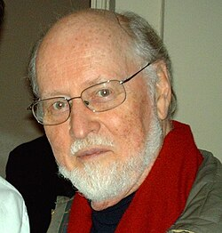

# John Williams

## Biografía

John Towner Williams (Floral Park, Nueva York, 8 de febrero de 1932) es un compositor, director de orquesta, pianista y trombonista estadounidense. Considerado uno de los compositores más prolíficos de bandas sonoras de la historia del cine, ha compuesto algunas de las más famosas y reconocibles de todos los tiempos como: Harry Potter, Star Wars, Tiburón, Atrápame si puedes, E.T., el extraterrestre, Superman: The Movie, Indiana Jones, Parque Jurásico, La lista de Schindler, El coloso en llamas, La aventura del Poseidón, Memorias de una Geisha y Home Alone. Ha trabajado con el célebre director Steven Spielberg desde 1974 y ha compuesto la música de toda su obra, a excepción de tres películas. También ha realizado composiciones musicales para diversos Juegos Olímpicos, numerosas series de televisión, noticieros y varias piezas de concierto.​ Williams ha ganado el Óscar en cinco ocasiones y tiene en su haber 53 nominaciones, siendo la persona viva con más nominaciones al máximo galardón del séptimo arte, compartiendo el número con el ya fallecido Walt Disney.​ También posee cuatro Globos de Oro, siete BAFTA y veintitrés Grammy. En 2005, su obra en la banda sonora de Star Wars fue seleccionada por el American Film Institute como la obra musical más grande del cine estadounidense. En 2020, le fue otorgado el Premio Princesa de Asturias de las Artes, compartido con el también compositor Ennio Morricone. Es uno de los compositores más reconocidos de música de cine; ha realizado la banda sonora de más de cien películas, sin contar la música para series de televisión.​ En el año 2022 fue nombrado por la reina Isabel II del Reino Unido caballero comendador honorario de la Orden del Imperio Británico.

## Estilo musical

John Towner Williams ( Floral Park, Nueva York, 8 de febrero de 1932) es un compositor, director de orquesta, pianista y trombonista estadounidense. Considerado uno de los compositores más prolíficos de bandas sonoras de la historia del cine, ha compuesto algunas de las más famosas y reconocibles de todos los tiempos como: Harry Potter, Star Wars, Tiburón, Atrápame si puedes, E.T., el extraterrestre, Superman: The Movie, Indiana Jones, Parque Jurásico, La lista de Schindler, El coloso en llamas, La aventura del Poseidón, Memorias de una Geisha y Home Alone.

## Anécdotas y curiosidades

2 Vida personal Alternar subsección Vida personal 2.1 Matrimonios e hijos

Nació en Nueva York (EE UU), el 8 de febrero de 1932. Comenzó en filmes de bajo presupuesto y como adaptador de musicales. Poco después se le asignarían algunos de los filmes del género catastrófico más comerciales de los setenta. Su unión profesional a Steven Spielberg le dio importantes triunfos, pero la película que le reportó fama mundial fue Star Wars (77). Nació en Nueva York (EE UU), el 8 de febrero de 1932. Comenzó en filmes de bajo presupuesto y como adaptador de musicales. Poco después se le asignarían algunos de los filmes del género catastrófico más comerciales de los setenta. Su unión profesional a Steven Spielberg le dio importantes triunfos, pero la película que le reportó...

## Top 10 bandas sonoras

1. ***Halloween (Título en España: La noche de Halloween)***
    * **Póster:** [link](053_john_williams/posters/poster_halloween_2018.jpg)
2. ***Halloween Kills (Título en España: Halloween Kills)***
    * **Póster:** [link](053_john_williams/posters/poster_halloween_kills_2021.jpg)
3. ***Joe (Título en España: Joe)***
    * **Póster:** [link](053_john_williams/posters/poster_joe_2014.jpg)
4. ***Our Brand Is Crisis (Título en España: Expertos en crisis)***
    * **Póster:** [link](053_john_williams/posters/poster_our_brand_is_crisis_2015.jpg)
5. ***Manglehorn (Título en España: Señor Manglehorn)***
    * **Póster:** [link](053_john_williams/posters/poster_manglehorn_2015.jpg)
6. ***Age Out (Título en España: Age Out)***
    * **Póster:** [link](053_john_williams/posters/poster_age_out_2018.jpg)
7. ***Summertime (Título en España: Summertime)***
    * **Póster:** [link](053_john_williams/posters/poster_summertime_2021.jpg)
8. ***Dandelion (Título en España: Dandelion)***
    * **Póster:** [link](053_john_williams/posters/poster_dandelion_2024.jpg)

## Filmografía completa

- Joe (Título en España: Joe) (2014) · [Póster](053_john_williams/posters/poster_joe_2014.jpg)
- Our Brand Is Crisis (Título en España: Expertos en crisis) (2015) · [Póster](053_john_williams/posters/poster_our_brand_is_crisis_2015.jpg)
- Manglehorn (Título en España: Señor Manglehorn) (2015) · [Póster](053_john_williams/posters/poster_manglehorn_2015.jpg)
- Age Out (Título en España: Age Out) (2018) · [Póster](053_john_williams/posters/poster_age_out_2018.jpg)
- Halloween (Título en España: La noche de Halloween) (2018) · [Póster](053_john_williams/posters/poster_halloween_2018.jpg)
- Halloween Kills (Título en España: Halloween Kills) (2021) · [Póster](053_john_williams/posters/poster_halloween_kills_2021.jpg)
- Summertime (Título en España: Summertime) (2021) · [Póster](053_john_williams/posters/poster_summertime_2021.jpg)
- Dandelion (Título en España: Dandelion) (2024) · [Póster](053_john_williams/posters/poster_dandelion_2024.jpg)

## Premios y nominaciones

* 1968 – Premio de la Academia a la mejor banda sonora, adaptación o tratamiento – por *Valley of the Dolls (Título en España: El valle de las muñecas)* – (Nominación)
* 1970 – Premio de la Academia a la mejor banda sonora original, sin musical – por *The Reivers (Título en España: Los rateros)* – (Nominación)
* 1970 – Premio de la Academia a la mejor partitura musical original – por *Goodbye, Mr. Chips (Título en España: Adiós, Mr. Chips)* – (Nominación)
* 1972 – Premio de la Academia a la mejor banda sonora original – por *Fiddler on the Roof (Título en España: El violinista en el tejado)* – (Ganador)
* 1972 – Premio de la Academia a la mejor banda sonora original – por *Fiddler on the Roof (Título en España: El violinista en el tejado)* – (Nominación)
* 1973 – Premio de la Academia a la mejor banda sonora dramática original – por *Images (Título en España: Imágenes)* – (Nominación)
* 1973 – Premio de la Academia a la mejor banda sonora dramática original – por *The Poseidon Adventure (Título en España: La aventura del Poseidón)* – (Nominación)
* 1974 – Premio de la Academia a la mejor banda sonora dramática original – por *Cinderella Liberty (Título en España: Cinderella Liberty)* – (Nominación)
* 1974 – Premio de la Academia a la mejor banda sonora original – por *Tom Sawyer (Título en España: Las aventuras de Tom Sawyer)* – (Nominación)
* 1974 – Premio de la Academia a la mejor canción original – por *Nice to Be Around* – (Nominación)
* 1975 – Premio de la Academia a la mejor banda sonora dramática original – por *The Towering Inferno (Título en España: El coloso en llamas)* – (Nominación)
* 1976 – Premio de la Academia a la mejor banda sonora dramática original – por *Jaws (Título en España: Tiburón)* – (Ganador)
* 1976 – Premio de la Academia a la mejor banda sonora dramática original – por *Jaws (Título en España: Tiburón)* – (Nominación)
* 1978 – Premio de la Academia a la mejor banda sonora original – por *Close Encounters of the Third Kind (Título en España: Encuentros en la tercera fase)* – (Nominación)
* 1978 – Premio de la Academia a la mejor banda sonora original – por *Star Wars (Título en España: La guerra de las galaxias)* – (Ganador)
* 1978 – Premio de la Academia a la mejor banda sonora original – por *Star Wars (Título en España: La guerra de las galaxias)* – (Nominación)
* 1979 – Premio de la Academia a la mejor banda sonora original – por *Superman (Título en España: Superman)* – (Nominación)
* 1981 – Premio de la Academia a la mejor banda sonora original – por *The Empire Strikes Back (Título en España: El imperio contraataca)* – (Nominación)
* 1982 – Premio de la Academia a la mejor banda sonora original – por *Raiders of the Lost Ark (Título en España: En busca del arca perdida)* – (Nominación)
* 1983 – Premio Golden Raspberry a la peor partitura musical – por *Monsignor (Título en España: Monseñor)* – (Nominación)
* 1983 – Premio de la Academia a la mejor banda sonora original – por *E.T. the Extra-Terrestrial (Título en España: E.T. el extraterrestre)* – (Ganador)
* 1983 – Premio de la Academia a la mejor banda sonora original – por *E.T. the Extra-Terrestrial (Título en España: E.T. el extraterrestre)* – (Nominación)
* 1983 – Premio de la Academia a la mejor canción original – (Nominación)
* 1984 – Premio de la Academia a la mejor banda sonora original – por *Return of the Jedi (Título en España: El retorno del Jedi)* – (Nominación)
* 1985 – Premio de la Academia a la mejor banda sonora original – por *Indiana Jones and the Temple of Doom (Título en España: Indiana Jones y el templo maldito)* – (Nominación)
* 1985 – Premio de la Academia a la mejor banda sonora original – por *The River (Título en España: El río)* – (Nominación)
* 1988 – Premio de la Academia a la mejor banda sonora original – por *Empire of the Sun (Título en España: El imperio del sol)* – (Nominación)
* 1988 – Premio de la Academia a la mejor banda sonora original – por *The Witches of Eastwick (Título en España: Las brujas de Eastwick)* – (Nominación)
* 1989 – Premio de la Academia a la mejor banda sonora original – por *The Accidental Tourist (Título en España: El turista accidental)* – (Nominación)
* 1990 – Premio de la Academia a la mejor banda sonora original – por *Born on the Fourth of July (Título en España: Nacido el cuatro de julio)* – (Nominación)
* 1990 – Premio de la Academia a la mejor banda sonora original – por *Indiana Jones and the Last Crusade (Título en España: Indiana Jones y la última cruzada)* – (Nominación)
* 1991 – Premio de la Academia a la mejor banda sonora original – por *Home Alone 2: Lost in New York (Título en España: Solo en casa 2: Perdido en Nueva York)* – (Nominación)
* 1991 – Premio de la Academia a la mejor canción original – por *Somewhere in My Memory* – (Nominación)
* 1992 – Premio de la Academia a la mejor banda sonora original – por *JFK (Título en España: JFK: Caso abierto)* – (Nominación)
* 1992 – Premio de la Academia a la mejor canción original – por *When They Say You're Alone (Título en España: When They Say You're Alone)* – (Nominación)
* 1994 – Premio de la Academia a la mejor banda sonora original – por *Schindler's List (Título en España: La lista de Schindler)* – (Ganador)
* 1994 – Premio de la Academia a la mejor banda sonora original – por *Schindler's List (Título en España: La lista de Schindler)* – (Nominación)
* 1996 – Premio de la Academia a la mejor banda sonora dramática original – por *Nixon (Título en España: Nixon)* – (Nominación)
* 1996 – Premio de la Academia a la mejor banda sonora original de comedia o musical – por *Sabrina (Título en España: Sabrina)* – (Nominación)
* 1996 – Premio de la Academia a la mejor canción original – (Nominación)
* 1997 – Premio de la Academia a la mejor banda sonora dramática original – por *Sleepers (Título en España: Sleepers)* – (Nominación)
* 1998 – Premio de la Academia a la mejor banda sonora dramática original – por *Amistad (Título en España: Amistad)* – (Nominación)
* 1999 – Premio de la Academia a la mejor banda sonora dramática original – por *Saving Private Ryan (Título en España: Salvar al soldado Ryan)* – (Nominación)
* 2000 – Premio de la Academia a la mejor banda sonora original – por *Angela's Ashes (Título en España: Las cenizas de Ángela)* – (Nominación)
* 2001 – Premio de la Academia a la mejor banda sonora original – por *The Patriot (Título en España: El patriota)* – (Nominación)
* 2002 – Orden Olímpica de Plata – (Ganador)
* 2002 – Premio de la Academia a la mejor banda sonora original – por *A.I. Artificial Intelligence (Título en España: A.I. Inteligencia Artificial)* – (Nominación)
* 2002 – Premio de la Academia a la mejor banda sonora original – por *Harry Potter and the Philosopher's Stone (Título en España: Harry Potter y la piedra filosofal)* – (Nominación)
* 2003 – Premio de la Academia a la mejor banda sonora original – por *Catch Me If You Can (Título en España: Atrápame si puedes)* – (Nominación)
* 2005 – Premio de la Academia a la mejor banda sonora original – por *Harry Potter and the Prisoner of Azkaban (Título en España: Harry Potter y el prisionero de Azkaban)* – (Nominación)
* 2006 – Premio de la Academia a la mejor banda sonora original – por *Memoirs of a Geisha (Título en España: Memorias de una geisha)* – (Nominación)
* 2006 – Premio de la Academia a la mejor banda sonora original – por *Munich (Título en España: Munich)* – (Nominación)
* 2007 – Premio Grammy a la mejor banda sonora para medios visuales – por *Memoirs of a Geisha (Título en España: Memorias de una geisha)* – (Ganador)
* 2009 – Medalla Nacional de las Artes – (Ganador)
* 2012 – Premio de la Academia a la mejor banda sonora original – por *The Adventures of Tintin (Título en España: Las aventuras de Tintín: El secreto del unicornio)* – (Nominación)
* 2012 – Premio de la Academia a la mejor banda sonora original – por *War Horse (Título en España: War Horse (Caballo de batalla))* – (Nominación)
* 2013 – Premio de la Academia a la mejor banda sonora original – por *Lincoln (Título en España: Lincoln)* – (Nominación)
* 2014 – Premio de la Academia a la mejor banda sonora original – por *The Book Thief (Título en España: La ladrona de libros)* – (Nominación)
* 2015 – Premio Grammy a la mejor composición instrumental – por *The Book Thief (Título en España: La ladrona de libros)* – (Ganador)
* 2016 – Oficial de Artes y Letras – (Ganador)
* 2016 – Premio AFI a la trayectoria – (Ganador)
* 2016 – Premio de la Academia a la mejor banda sonora original – por *Star Wars: The Force Awakens (Título en España: Star Wars: El despertar de la fuerza)* – (Nominación)
* 2018 – Premio de la Academia a la mejor banda sonora original – por *Star Wars: The Last Jedi (Título en España: Star Wars: Los últimos Jedi)* – (Nominación)
* 2020 – Premio Princesa de Asturias de las Artes – (Ganador)
* 2020 – Premio de la Academia a la mejor banda sonora original – por *Star Wars: The Rise of Skywalker (Título en España: Star Wars: El ascenso de Skywalker)* – (Nominación)
* 2022 – Caballero Comandante Honorario de la Orden del Imperio Británico – (Ganador)
* 2023 – Premio Globo de Oro a la mejor banda sonora original – por *The Fabelmans (Título en España: Los Fabelman)* – (Nominación)
* 2023 – Premio de la Academia a la mejor banda sonora original – por *The Fabelmans (Título en España: Los Fabelman)* – (Nominación)
* 2024 – Premio de la Academia a la mejor banda sonora original – por *Indiana Jones and the Dial of Destiny (Título en España: Indiana Jones y el dial del destino)* – (Nominación)
* Honores del Centro Kennedy – (Ganador)
* Premio Saturno a la mejor música – (Ganador)
* Premios Brit clásicos – (Ganador)
* Premios Globo de Oro – (Ganador)

## Fuentes adicionales

* [MundoBSO](https://www.mundobso.com/compositor/williams-john) — site:mundobso.com
* [MundoBSO (2)](https://www.mundobso.com/bso/guerra-de-los-mundos-la-john-williams) — site:mundobso.com
* [MundoBSO (3)](https://www.mundobso.com/agoras/beethoven-brahms-williams) — site:mundobso.com
* [Film Score Monthly](https://www.filmscoremonthly.com/board/posts.cfm?threadID=152632) — site:filmscoremonthly.com
* [Film Score Monthly (2)](https://www.filmscoremonthly.com/backissues/viewissue.cfm?issueID=109) — site:filmscoremonthly.com
* [Film Score Monthly (3)](https://filmscoremonthly.com/board/posts.cfm?forumID=1&pageID=2&threadID=96000&archive=0) — site:filmscoremonthly.com
* [SoundtrackCollector](https://www.soundtrackcollector.com/title/23656/Sugarland+Express,+The) — site:soundtrackcollector.com
* [SoundtrackCollector (2)](https://www.soundtrackcollector.com/title/19091/Bachelor+Flat) — site:soundtrackcollector.com
* [SoundtrackCollector (3)](https://www.soundtrackcollector.com/catalog/composerdiscography.php?composerid=9) — site:soundtrackcollector.com
* [WhatSong](https://www.whatsong.org/tvshow/how-i-met-your-mother/episode/44483) — site:whatsong.org
* [WhatSong (2)](https://www.whatsong.org/movie/harry-potter-and-the-prisoner-of-azkaban) — site:whatsong.org
* [WhatSong (3)](https://www.whatsong.org/movie/saving-private-ryan) — site:whatsong.org

## Notas externas

* MundoBSO: Nació en Nueva York (EE UU), el 8 de febrero de 1932. Comenzó en filmes de bajo presupuesto y como adaptador de musicales. Poco después se le asignarían algunos de los filmes del género catastrófico más comerciales de los setenta. Su unión profesional a Steven Spielberg le dio importantes triunfos, pero la película que le reportó fama mundial fue Star Wars (77). Nació en Nueva York (EE UU), el 8 de febrero de 1932. Comenzó en filmes de bajo presupuesto y como adaptador de musicales. Poco después se le asignarían algunos de los filmes del género catastrófico más comerciales de los setenta. Su unión profesional a Steven Spielberg le dio importantes triunfos, pero la película que le reportó...
* MundoBSO (2): Compositor: Williams, John Sello: Intrada Duración: 156 minutos Información de la película Título original: War of the Worlds Director: Steven Spielberg Nacionalidad: EE UU Año: 2005 Argumento Una masiva invasión de extraterrestres atacan y destruyen cuanto se encuentran en su camino. Un hombre intentará proteger la vida de sus dos hijos. Premios Saturn: 1 nominación World Soundtrack: 1 premio Compositor: Williams, John Sello: Intrada Duración: 156 minutos
* WhatSong: Lily y Robin bailan con los dos nerds del último año de secundaria. Se reproduce de fondo cuando Lilly, Robin y Barney intentan entrar a la fiesta. La canción es una canción que está incluida en iMovie.
* WhatSong (2): John Williams - Harry Potter y el Prisionero de Azkaban (Banda sonora de la película) La canción de apertura de la película. Logotipo de Warner Brothers y título de la película.
* WhatSong (3): John Williams - Salvando al soldado Ryan (Música de la banda sonora original de la película) John Williams - Salvando al soldado Ryan (Música de la banda sonora original de la película)
* www.maestroclassics.com: ACERCA de Historia de la empresa Preguntas frecuentes/Edad y guía de escucha Entrevistas académicas Biografías Programa de afiliados ¿Quién puede ser recordado como el mejor compositor del siglo XX? El director de uno de los conservatorios de música más importantes de Estados Unidos dijo…. Juan Williams ¿Quién??? Piense: Tiburón, Star Wars, E.T., Indiana Jones, Superman, La lista de Schindler, Solo en casa, Parque Jurásico, Harry Potter. Todas estas famosas bandas sonoras de películas fueron compuestas por John Williams. Probablemente más personas en el mundo han escuchado la música de John Williams que la de cualquier otro compositor del siglo XX. (Lo siento, Stravinsky y Prokofiev) Entonces…. ¿¿¿Quién es él???
* www.johnwilliams.org: Referencia Biografía Bibliografía Premios de Partituras Acerca de la Universidad de Carolina del Sur en Columbia (16 de mayo de 1981)
* www.johnwilliams.org: Referencia Biografía Bibliografía Sheet Music Awards Acerca de En una carrera que abarca cinco décadas, John Williams se ha convertido en uno de los compositores de cine y conciertos más destacados y exitosos de Estados Unidos. Se ha desempeñado como director musical y director laureado de una de las instituciones musicales más preciadas del país, la Boston Pops Orchestra, y mantiene prósperas relaciones artísticas con muchas de las grandes orquestas del mundo, incluidas la Orquesta Sinfónica de Boston, la Filarmónica de Nueva York, la Sinfónica de Chicago y la Filarmónica de Los Ángeles. El Sr. Williams ha recibido una variedad de premios prestigiosos, incluida la Medalla Nacional de las Artes, el Kennedy Center Honor, el...
* www.aarp.org: Javascript debe estar habilitado para utilizar este sitio. Habilite Javascript en su navegador y vuelva a intentarlo. Obtén la aplicación AARP Now. ¡Nueva y mejorada, es la aplicación que hace que tu membresía sea verdaderamente móvil!
* www.latimes.com: Negocios Inteligencia artificial Autos Empleo, trabajo y lugar de trabajo Bienes raíces Tecnología e Internet California Política de California Terremotos Educación Vivienda y personas sin hogar L.A. Influyente L.A. Política Salud mental
* online.berklee.edu: Conceptos básicos del contenido de la lección Producción musical Interpretación Guitarra Composición de canciones Teoría musical, armonía y entrenamiento auditivo Asesoramiento profesional musical Negocios musicales Música para cine, televisión y juegos Composición, orquestación y arreglos de música electrónica Historia de la música y artes liberales Piano y teclado Improvisación de voz Batería Bajo Artículos Funciones Listas de reproducción de profesores Producción musical Interpretación Guitarra Composición, orquestación y arreglos musicales Teoría musical, armonía y entrenamiento auditivo Asesoramiento profesional musical Negocios musicales Música para cine, televisión y juegos Tecnología de música electrónica Composición, orquestación y arreglos Historia de la música y artes liberales Piano y teclado Improvisación Voz Danza, música y teatro Batería Bajo
* www.johnwilliams.org: Referencia Biografía Bibliografía Partituras Premios Sobre Indiana Jones y el Reino de la Calavera de Cristal (2008)
