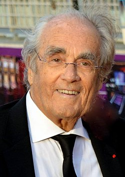

# Michel Legrand

## Biografía

Michel Jean Legrand (París, 24 de febrero de 1932-Neuilly-sur-Seine, 26 de enero de 2019)​​ fue un compositor y cantante francés. Compuso la música de más de doscientas películas y ganó tres veces el Oscar de la Academia de Hollywood. Hijo del compositor Raymond Legrand y de Marcelle Der Mikaëlian (hermana de Jacques Hélian) y hermano de la cantante Christiane Legrand, célebre solista de Les Swingle Singers (The Swingle Singers).

## Estilo musical

Michel Jean Legrand ( París, 24 de febrero de 1932- Neuilly-sur-Seine, 26 de enero de 2019) [ 1 ] ​ [ 2 ] ​ fue un compositor y cantante francés. Compuso la música de más de doscientas películas y ganó tres veces el Oscar de la Academia de Hollywood.

## Anécdotas y curiosidades

Legrand nació en París, Francia, [4] de su padre, Raymond Legrand, quien era director y compositor, [5] y su madre, Marcelle Der-Mikaëlian, que era hermana del director Jacques Hélian. [ 6 ] Raymond y Marcelle se casaron en 1929. [ 6 ] Su abuelo materno era armenio. [ 7 ]

## Top 10 bandas sonoras

1. ***Never Say Never Again (Título en España: Nunca digas nunca jamás)***
    * **Póster:** [link](055_michel_legrand/posters/poster_never_say_never_again_1983.jpg)
2. ***Bande à part (Título en España: Banda aparte)***
    * **Póster:** [link](055_michel_legrand/posters/poster_bande_part_1964.jpg)
3. ***Cléo de 5 à 7 (Título en España: Cleo de 5 a 7)***
    * **Póster:** [link](055_michel_legrand/posters/poster_cl_o_de_5_7_1962.jpg)
4. ***Atlantic City (Título en España: Atlantic City)***
    * **Póster:** [link](055_michel_legrand/posters/poster_atlantic_city_1980.jpg)
5. ***The Three Musketeers (Título en España: Los tres mosqueteros: Los diamantes de la reina)***
    * **Póster:** [link](055_michel_legrand/posters/poster_the_three_musketeers_1973.jpg)
6. ***Peau d'âne (Título en España: Piel de asno)***
    * **Póster:** [link](055_michel_legrand/posters/poster_peau_d_ne_1970.jpg)
7. ***Les Parapluies de Cherbourg (Título en España: Los paraguas de Cherburgo)***
    * **Póster:** [link](055_michel_legrand/posters/poster_les_parapluies_de_cherbourg_1964.jpg)
8. ***Les Demoiselles de Rochefort (Título en España: Las señoritas de Rochefort)***
    * **Póster:** [link](055_michel_legrand/posters/poster_les_demoiselles_de_rochefort_1967.jpg)
9. ***Vivre sa vie: film en douze tableaux (Título en España: Vivir su vida)***
    * **Póster:** [link](055_michel_legrand/posters/poster_vivre_sa_vie_film_en_douze_tableaux_1962.jpg)
10. ***La Piscine (Título en España: La Piscina)***
    * **Póster:** [link](055_michel_legrand/posters/poster_la_piscine_1969.jpg)

## Filmografía completa

- Charmants Garçons (Título en España: Charmants Garçons) (1957) · [Póster](055_michel_legrand/posters/poster_charmants_gar_ons_1957.jpg)
- Lola (Título en España: Lola) (1961) · [Póster](055_michel_legrand/posters/poster_lola_1961.jpg)
- Une femme est une femme (Título en España: Una mujer es una mujer) (1961) · [Póster](055_michel_legrand/posters/poster_une_femme_est_une_femme_1961.jpg)
- Cléo de 5 à 7 (Título en España: Cleo de 5 a 7) (1962) · [Póster](055_michel_legrand/posters/poster_cl_o_de_5_7_1962.jpg)
- Le Gentleman d'Epsom (Título en España: Los grandes señores) (1962) · [Póster](055_michel_legrand/posters/poster_le_gentleman_d_epsom_1962.jpg)
- Vivre sa vie: film en douze tableaux (Título en España: Vivir su vida) (1962) · [Póster](055_michel_legrand/posters/poster_vivre_sa_vie_film_en_douze_tableaux_1962.jpg)
- La Baie des Anges (Título en España: La bahía de los ángeles) (1963) · [Póster](055_michel_legrand/posters/poster_la_baie_des_anges_1963.jpg)
- Bande à part (Título en España: Banda aparte) (1964) · [Póster](055_michel_legrand/posters/poster_bande_part_1964.jpg)
- Les Parapluies de Cherbourg (Título en España: Los paraguas de Cherburgo) (1964) · [Póster](055_michel_legrand/posters/poster_les_parapluies_de_cherbourg_1964.jpg)
- La Vie de château (Título en España: Esposa ingenua) (1965) · [Póster](055_michel_legrand/posters/poster_la_vie_de_ch_teau_1965.jpg)
- Tendre voyou (Título en España: Simpático sinvergüenza) (1966) · [Póster](055_michel_legrand/posters/poster_tendre_voyou_1966.jpg)
- Le Plus Vieux Métier du monde (Título en España: El oficio más viejo del mundo) (1967) · [Póster](055_michel_legrand/posters/poster_le_plus_vieux_m_tier_du_monde_1967.jpg)
- Les Demoiselles de Rochefort (Título en España: Las señoritas de Rochefort) (1967) · [Póster](055_michel_legrand/posters/poster_les_demoiselles_de_rochefort_1967.jpg)
- Ice Station Zebra (Título en España: Estación polar Cebra) (1968) · [Póster](055_michel_legrand/posters/poster_ice_station_zebra_1968.jpg)
- The Thomas Crown Affair (Título en España: El caso de Thomas Crown) (1968) · [Póster](055_michel_legrand/posters/poster_the_thomas_crown_affair_1968.jpg)
- The Windmills of Your Mind (Título en España: The Windmills of Your Mind) (1968) · [Póster](055_michel_legrand/posters/poster_the_windmills_of_your_mind_1968.jpg)
- Appelez-moi Mathilde (Título en España: Appelez-moi Mathilde) (1969) · [Póster](055_michel_legrand/posters/poster_appelez_moi_mathilde_1969.jpg)
- Castle Keep (Título en España: La fortaleza) (1969) · [Póster](055_michel_legrand/posters/poster_castle_keep_1969.jpg)
- La Piscine (Título en España: La Piscina) (1969) · [Póster](055_michel_legrand/posters/poster_la_piscine_1969.jpg)
- Play Dirty (Título en España: Mercenarios sin gloria) (1969) · [Póster](055_michel_legrand/posters/poster_play_dirty_1969.jpg)
- The Happy Ending (Título en España: Con los ojos cerrados) (1969) · [Póster](055_michel_legrand/posters/poster_the_happy_ending_1969.jpg)
- La Dame dans l'auto avec des lunettes et un fusil (Título en España: La dama del coche con gafas y un fusil) (1970) · [Póster](055_michel_legrand/posters/poster_la_dame_dans_l_auto_avec_des_lunettes_et_un_fusil_1970.jpg)
- Peau d'âne (Título en España: Piel de asno) (1970) · [Póster](055_michel_legrand/posters/poster_peau_d_ne_1970.jpg)
- Brian's Song (Título en España: Brian's Song) (1971) · [Póster](055_michel_legrand/posters/poster_brian_s_song_1971.jpg)
- Le Mans (Título en España: Las 24 horas de Le Mans) (1971) · [Póster](055_michel_legrand/posters/poster_le_mans_1971.jpg)
- Les Mariés de l'an deux (Título en España: Gracias y desgracias de un casado del año II) (1971) · [Póster](055_michel_legrand/posters/poster_les_mari_s_de_l_an_deux_1971.jpg)
- Summer of '42 (Título en España: Verano del 42) (1971) · [Póster](055_michel_legrand/posters/poster_summer_of_42_1971.jpg)
- The Go-Between (Título en España: El mensajero) (1971) · [Póster](055_michel_legrand/posters/poster_the_go_between_1971.jpg)
- Les Feux de la Chandeleur (Título en España: Les Feux de la Chandeleur) (1972) · [Póster](055_michel_legrand/posters/poster_les_feux_de_la_chandeleur_1972.jpg)
- Un homme est mort (Título en España: Funeral en Los Ángeles) (1972) · [Póster](055_michel_legrand/posters/poster_un_homme_est_mort_1972.jpg)
- Bequest to the Nation (Título en España: Bequest to the Nation) (1973) · [Póster](055_michel_legrand/posters/poster_bequest_to_the_nation_1973.jpg)
- Breezy (Título en España: Primavera en otoño) (1973) · [Póster](055_michel_legrand/posters/poster_breezy_1973.jpg)
- Cops and Robbers (Título en España: Unos policías muy ladrones) (1973) · [Póster](055_michel_legrand/posters/poster_cops_and_robbers_1973.jpg)
- Vérités et Mensonges (Título en España: Fraude) (1973) · [Póster](055_michel_legrand/posters/poster_v_rit_s_et_mensonges_1973.jpg)
- L'Événement le plus important depuis que l'homme a marché sur la lune (Título en España: L'Événement le plus important depuis que l'homme a marché sur la lune) (1973) · [Póster](055_michel_legrand/posters/poster_l_v_nement_le_plus_important_depuis_que_l_homme_a_march_sur_la_lune_1973.jpg)
- The Three Musketeers (Título en España: Los tres mosqueteros: Los diamantes de la reina) (1973) · [Póster](055_michel_legrand/posters/poster_the_three_musketeers_1973.jpg)
- Vérités et Mensonges (Título en España: Fraude) (1973) · [Póster](055_michel_legrand/posters/poster_v_rit_s_et_mensonges_1973.jpg)
- Le Sauvage (Título en España: Mi hombre es un salvaje) (1975) · [Póster](055_michel_legrand/posters/poster_le_sauvage_1975.jpg)
- La Flûte à six schtroumpfs (Título en España: La flauta de los pitufos) (1976) · [Póster](055_michel_legrand/posters/poster_la_fl_te_six_schtroumpfs_1976.jpg)
- The Other Side of Midnight (Título en España: El otro lado de la medianoche) (1977) · [Póster](055_michel_legrand/posters/poster_the_other_side_of_midnight_1977.jpg)
- Les Routes du sud (Título en España: Las rutas del sur) (1978) · [Póster](055_michel_legrand/posters/poster_les_routes_du_sud_1978.jpg)
- You Don't Bring Me Flowers (Título en España: You Don't Bring Me Flowers) (1978) · [Póster](055_michel_legrand/posters/poster_you_don_t_bring_me_flowers_1978.jpg)
- Lady Oscar (Título en España: Lady Oscar) (1979) · [Póster](055_michel_legrand/posters/poster_lady_oscar_1979.jpg)
- Les Fabuleuses Aventures du légendaire baron de Münchausen (Título en España: Las fabulosas aventuras del barón Munchausen) (1979) · [Póster](055_michel_legrand/posters/poster_les_fabuleuses_aventures_du_l_gendaire_baron_de_m_nchausen_1979.jpg)
- Atlantic City (Título en España: Atlantic City) (1980) · [Póster](055_michel_legrand/posters/poster_atlantic_city_1980.jpg)
- The Hunter (Título en España: Cazador a sueldo) (1980) · [Póster](055_michel_legrand/posters/poster_the_hunter_1980.jpg)
- Your Ticket Is No Longer Valid (Título en España: Your Ticket Is No Longer Valid) (1981) · [Póster](055_michel_legrand/posters/poster_your_ticket_is_no_longer_valid_1981.jpg)
- A Woman Called Golda (Título en España: A Woman Called Golda) (1982) · [Póster](055_michel_legrand/posters/poster_a_woman_called_golda_1982.jpg)
- Best Friends (Título en España: Amigos muy íntimos) (1982) · [Póster](055_michel_legrand/posters/poster_best_friends_1982.jpg)
- Le Cadeau (Título en España: El regalo) (1982) · [Póster](055_michel_legrand/posters/poster_le_cadeau_1982.jpg)
- Eine Liebe in Deutschland (Título en España: Un amor en Alemania) (1983) · [Póster](055_michel_legrand/posters/poster_eine_liebe_in_deutschland_1983.jpg)
- Never Say Never Again (Título en España: Nunca digas nunca jamás) (1983) · [Póster](055_michel_legrand/posters/poster_never_say_never_again_1983.jpg)
- Yentl (Título en España: Yentl) (1983) · [Póster](055_michel_legrand/posters/poster_yentl_1983.jpg)
- Paroles et musique (Título en España: Palabras y música) (1984) · [Póster](055_michel_legrand/posters/poster_paroles_et_musique_1984.jpg)
- Partir, revenir (Título en España: Partir, revenir) (1985) · [Póster](055_michel_legrand/posters/poster_partir_revenir_1985.jpg)
- As Summers Die (Título en España: Testigo sorpresa) (1986) · [Póster](055_michel_legrand/posters/poster_as_summers_die_1986.jpg)
- Switching Channels (Título en España: Interferencias) (1987) · [Póster](055_michel_legrand/posters/poster_switching_channels_1987.jpg)
- Prêt-à-Porter (Título en España: Pret-a-porter) (1994) · [Póster](055_michel_legrand/posters/poster_pr_t_porter_1994.jpg)
- Die Schelme von Schelm (Título en España: David y el gigante de piedra) (1995) · [Póster](055_michel_legrand/posters/poster_die_schelme_von_schelm_1995.jpg)
- Torin's Passage (Título en España: Torin's Passage) (1995) · [Póster](055_michel_legrand/posters/poster_torin_s_passage_1995.jpg)
- Madeline (Título en España: Madeline) (1998) · [Póster](055_michel_legrand/posters/poster_madeline_1998.jpg)
- And Now... Ladies and Gentlemen... (Título en España: Y ahora, damas y caballeros) (2002) · [Póster](055_michel_legrand/posters/poster_and_now_ladies_and_gentlemen_2002.jpg)
- Cavalcade (Título en España: Cavalcade) (2005) · [Póster](055_michel_legrand/posters/poster_cavalcade_2005.jpg)
- Disco (Título en España: Disco) (2008) · [Póster](055_michel_legrand/posters/poster_disco_2008.jpg)
- The Other Side of the Wind (Título en España: Al otro lado del viento) (2018) · [Póster](055_michel_legrand/posters/poster_the_other_side_of_the_wind_2018.jpg)
- Os Pássaros de Massachusetts (Título en España: Os Pássaros de Massachusetts) (2019) · [Póster](055_michel_legrand/posters/poster_os_p_ssaros_de_massachusetts_2019.jpg)

## Premios y nominaciones

* 1965 – Premio de la Academia – (Nominación)
* 1968 – Premio de la Academia – (Nominación)
* 1969 – Premio de la Academia – por *The Song (Título en España: La canción)* – (Ganador)
* 1982 – Emmy – por *a Limited Series or Special (Dramatic Underscore) – 1982* – (Nominación)
* 2019 – Emmy – (Nominación)
* 2019 – abuela – (Nominación)
* 2019 – Óscar – (Ganador)
* BAFTA – (Ganador)
* BAFTA – por *Great Broadway Musical Moments from the Ed Sullivan Show (Título en España: Great Broadway Musical Moments from the Ed Sullivan Show)* – (Nominación)
* Emmy – (Nominación)
* Globo de Oro – (Nominación)
* Globo de Oro – (Ganador)
* Globo de Oro – por *Best Original Song* – (Nominación)
* Premio de la Academia – (Nominación)
* Premio de la Academia – (Ganador)
* Premio de la Academia – por *Best Original Score* – (Nominación)
* Premio de la Academia – por *Best Original Song* – (Nominación)
* abuela – (Nominación)
* abuela – (Ganador)
* Óscar – (Nominación)
* Óscar – (Ganador)
* Óscar – por *The Song (Título en España: La canción)* – (Nominación)

## Fuentes adicionales

* [MundoBSO](https://www.mundobso.com/compositor/legrand-michel) — site:mundobso.com
* [MundoBSO (2)](https://w.mundobso.com/bso/cartero-siempre-llama-dos-veces-el) — site:mundobso.com
* [MundoBSO (3)](https://www.mundobso.com/bso/star-trek-insurrection) — site:mundobso.com
* [Film Score Monthly](https://www.filmscoremonthly.com/cds/detail.cfm/CDID/254/Ice-Station-Zebra/) — site:filmscoremonthly.com
* [Film Score Monthly (2)](https://www.filmscoremonthly.com/cds/detail.cfm/CDID/402/MGM-Soundtrack-Treasury/) — site:filmscoremonthly.com
* [Film Score Monthly (3)](https://www.filmscoremonthly.com/notes/happy_ending.html) — site:filmscoremonthly.com
* [SoundtrackCollector](https://www.soundtrackcollector.com/catalog/composerdiscography.php?composerid=52&offset=480) — site:soundtrackcollector.com
* [SoundtrackCollector (2)](https://www.soundtrackcollector.com/title/5727/Never+Say+Never+Again) — site:soundtrackcollector.com
* [SoundtrackCollector (3)](https://www.soundtrackcollector.com/title/27214/Best+Friends) — site:soundtrackcollector.com
* [WhatSong](https://www.whatsong.org/movie/clueless) — site:whatsong.org
* [WhatSong (2)](https://www.whatsong.org) — site:whatsong.org
* [WhatSong (3)](https://www.whatsong.org/tvshow/how-i-met-your-mother/episode/44483) — site:whatsong.org

## Notas externas

* MundoBSO: Nació en París (Francia), el 24 de febrero de 1932, y murió en Bécon les Bruyères (Francia), el 26 de enero de 2019. Compositor que conoció las mieles del éxito durante varias décadas y que es considerado uno de los mejores de su generación. Triunfó tanto en Francia como en Hollywood, donde pertenece, junto con Jarre, Delerue y Desplat, al exclusivo club de compositores franceses que han estado en películas importantes con premios y nominaci ones incluidas. Su padre, Raymond Legrand, era director de orquesta y compositor, e influyó decisivamente en su formación musical, que comenzó en el Conservatorio de París. Allí tuvo como maestra a Nadia Boulanger, que también formarí... Continuar...
* MundoBSO (3): Compositor: Goldsmith, Jerry Sello: GNP Duración: 79 minutos Información de la película Título original: Star Trek: Insurrection Director: Jonathan Frakes Nacionalidad: EE UU Año: 1998 Argumento La tripulación de la nave Enterprise encuentra un planeta con propiedades mágicas, en el que sus habitantes viven en eterna paz... hasta que surge la amenaza de invasión. Compositor: Goldsmith, Jerry Sello: GNP Duración: 79 minutos
* WhatSong: The Muffs - Clueless (Banda sonora original de la película) The Lightning Seeds - Clueless (Banda sonora original de la película)
* WhatSong (2): La mejor fuente en línea de música de películas y televisión. Copyright © 2018 - 2026 Whatsong.org. Reservados todos los derechos.
* WhatSong (3): Lily y Robin bailan con los dos nerds del último año de secundaria. Se reproduce de fondo cuando Lilly, Robin y Barney intentan entrar a la fiesta. La canción es una canción que está incluida en iMovie.
* www.everythingjazz.jp: Se dice que Michel Legrand, un maestro de la música de cine, cambió la historia de la música de cine, habiendo trabajado en obras como "Los paraguas de Cherburgo" y "Los amantes de Rochefort", y habiendo tenido una tremenda influencia en "La La Land". La banda sonora de esta película, AL ``Michel Legrand: El compositor cinematográfico que cambió el mundo - Banda sonora original'', se estrenará el 3 de septiembre.
* www.songhall.org: Michel Legrand, nativo y residente de París, fue uno de los compositores extranjeros de mayor éxito que jamás haya aparecido en las listas de bestsellers estadounidenses. Desde su primer éxito en los Estados Unidos con el memorable álbum I Love Paris en 1954, su productividad continuó sin cesar durante toda su vida. Obtuvo tres premios Oscar, tres premios GRAMMY y una nominación al Emmy para demostrarlo. Una de sus obras más inolvidables es la partitura de la película clásica de 1964 Los paraguas de Cherburgo, que supuso su primer reconocimiento de la Academia de Cine. Ganó su primer Premio de la Academia a la Mejor Canción por "The Windmills of Your Mind", que apareció en la película de 1968 The Thomas Crown...
* www.ecured.cu: Michel Legrand ( París, 24 de febrero de 1932 - París, 26 de enero de 2019 ) fue un director de orquesta, pianista, compositor y cantante francés. [2] Compuso música para más de 200 películas y fue tres veces ganador de los premios Oscar de la Academia de Hollywood. Grabó numerosos discos de jazz, música ligera y música clásica. 1 Síntesis biográfica 1.1 Estudios 1.2 Carrera de músico 1.3 Fallecimiento
* fandomania.com: Más Nuevos medios Libros Cultura de fans Coleccionables Teatro Normas de la comunidad Álbum: The Music Of Michel Legrand Compositor: Michel Legrand Interpretada por: Moscow Virtuosi Dirigida por: Michel Legrand Sello: Silva Screen Records Fecha de lanzamiento: 13 de septiembre de 2011
* www.filmaffinity.com: América del sur Argentina Chile Colombia Uruguay Paraguay Perú Ecuador Venezuela Costa Rica Honduras Guatemala Bolivia Rep. Dominicana Los paraguas de Cherburgo 4 premios 10 nominaciones
* apoloybaco.com: Jazz en Sevilla La Historia ¿Quién es quien? Músicos de Jazz en Sevilla Discos del mes 2026 2021-2025 2016-2020 2011-2015 2006-2010 2001-2005
* themoviescores.com: Becon-les-Bruyeres, Paris, Francia, 24 de febrero de 1932 – Neuilly-sur-Seine, Hauts-de-Seine, Francia, 26 de enero de 2019 (86 años) Michel Jean Legrand fue un músico, director de orquesta, cantante y pianista francés, uno de los grandes compositores galos de música cinematográfica de todos los tiempos, que integra esa lista junto a Maurice Jarre, Georges Delerue, Georges Auric, y Alexandre Desplat, con más de 200 partituras para el cine y la televisión en su haber, y tres veces ganador del Oscar.
