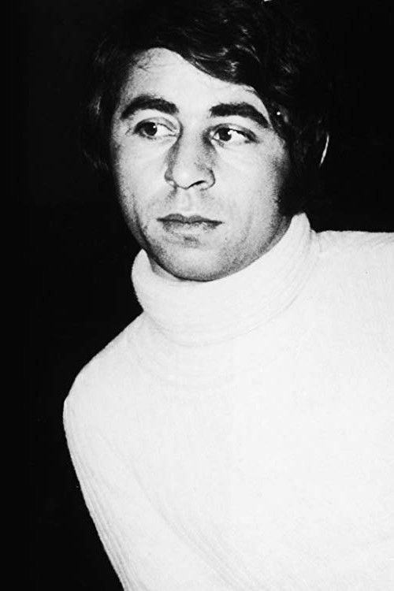

# Francis Lai

## Biografía

Francis es un nombre propio originario de los idiomas francés, inglés y escocés, descendiente del nombre Latín Franciscus. Puede hacer referencia a:

Francis, futbolista español, que juega en el Xerez CD; Francis Bacon, filósofo británico; Francis Buchanan-Hamilton, zoólogo y botánico británico; Francis Crick, biólogo británico; Francis Edgeworth, economista británico; Francis Galton, explorador y científico británico; Francis Healey, compositor escocés; Francis Lai, compositor y músico francés; Francis Lee, futbolista británico campeón Copa del Mundo 1966; Francis Poulenc, compositor francés; Francis William Aston, físico y químico inglés, premio Nobel de Química en 1922; Francis, de la serie animada "los padrinos mágicos"; Francis (artista), Francisco García Escalante, actriz, comediante y cantante transgénero mexicana; Francis Wilkerson, personaje en la serie Malcolm in the middle; Lea-Francis, constructor de motores británico; Turbina Francis, tipo de Turbina hidráulica;

## Estilo musical

Francis Lai ( Niza, 26 de abril de 1932- París, 7 de noviembre de 2018) [ 1 ] ​ fue un compositor francés especialista en crear música de bandas sonoras cinematográficas. Autor de la música de Un hombre y una mujer y de la de Historia de amor, con la que ganó el Oscar a la mejor banda sonora para película en 1970.

## Anécdotas y curiosidades

Francis Lai nos dejó ayer, a la edad de 86 años. Compositor y acordeonista, que había comenzado su carrera escribiendo canciones para Charles Aznavour y Edith Piaf. Su trayectoria como autor de bandas sonoras comenzó con la película "Un hombre y una mujer" de Claude Lelouch, que tuvo un éxito inesperado y le dio la oportunidad de emprender una brillante carrera internacional. En 1970 escribió la música de “Love Story” (llegando allí casi por casualidad por sugerencia de su amigo Alain Delon, que conocía a los productores de la película), trabajo que le llevó a ganar el Oscar.

## Top 10 bandas sonoras

1. ***Love Story (Título en España: Love Story)***
    * **Póster:** [link](056_francis_lai/posters/poster_love_story_1970.jpg)
2. ***Les Ripoux (Título en España: Los locos defensores de la ley)***
    * **Póster:** [link](056_francis_lai/posters/poster_les_ripoux_1984.jpg)
3. ***Emmanuelle: L'antivierge (Título en España: Emmanuelle 2: La antivirgen)***
    * **Póster:** [link](056_francis_lai/posters/poster_emmanuelle_l_antivierge_1975.jpg)
4. ***Un homme et une femme (Título en España: Un hombre y una mujer)***
    * **Póster:** [link](056_francis_lai/posters/poster_un_homme_et_une_femme_1966.jpg)
5. ***Itinéraire d'un enfant gâté (Título en España: El Imperio del león)***
    * **Póster:** [link](056_francis_lai/posters/poster_itin_raire_d_un_enfant_g_t_1988.jpg)
6. ***La Bonne Année (Título en España: Una dama y un bribón)***
    * **Póster:** [link](056_francis_lai/posters/poster_la_bonne_ann_e_1973.jpg)
7. ***Bilitis (Título en España: Bilitis)***
    * **Póster:** [link](056_francis_lai/posters/poster_bilitis_1977.jpg)
8. ***Les Misérables (Título en España: Testigo de excepción)***
    * **Póster:** [link](056_francis_lai/posters/poster_les_mis_rables_1995.jpg)
9. ***Очи черные (Título en España: Ojos negros)***
    * **Póster:** [link](056_francis_lai/posters/poster_poster_1987.jpg)
10. ***Ripoux contre Ripoux (Título en España: Ripoux contre Ripoux)***
    * **Póster:** [link](056_francis_lai/posters/poster_ripoux_contre_ripoux_1990.jpg)

## Filmografía completa

- Fragilité, ton nom est femme (Título en España: Fragilité, ton nom est femme) (1965) · [Póster](056_francis_lai/posters/poster_fragilit_ton_nom_est_femme_1965.jpg)
- Un homme et une femme (Título en España: Un hombre y una mujer) (1966) · [Póster](056_francis_lai/posters/poster_un_homme_et_une_femme_1966.jpg)
- Le Soleil des voyous (Título en España: El imperio de los canallas) (1967) · [Póster](056_francis_lai/posters/poster_le_soleil_des_voyous_1967.jpg)
- The Bobo (Título en España: El magnífico Bobo) (1967) · [Póster](056_francis_lai/posters/poster_the_bobo_1967.jpg)
- I'll Never Forget What's'isname (Título en España: I'll Never Forget What's'isname) (1967) · [Póster](056_francis_lai/posters/poster_i_ll_never_forget_what_s_isname_1967.jpg)
- Mon amour, mon amour (Título en España: Mon amour, mon amour) (1967) · [Póster](056_francis_lai/posters/poster_mon_amour_mon_amour_1967.jpg)
- Vivre pour vivre (Título en España: Vivir para vivir) (1967) · [Póster](056_francis_lai/posters/poster_vivre_pour_vivre_1967.jpg)
- 13 jours en France (Título en España: 13 jours en France) (1968) · [Póster](056_francis_lai/posters/poster_13_jours_en_france_1968.jpg)
- House of Cards (Título en España: Castillo de naipes) (1968) · [Póster](056_francis_lai/posters/poster_house_of_cards_1968.jpg)
- La Leçon particulière (Título en España: La Leçon particulière) (1968) · [Póster](056_francis_lai/posters/poster_la_le_on_particuli_re_1968.jpg)
- Mayerling (Título en España: Mayerling) (1968) · [Póster](056_francis_lai/posters/poster_mayerling_1968.jpg)
- 3 Into 2 Won't Go (Título en España: 3 Into 2 Won't Go) (1969) · [Póster](056_francis_lai/posters/poster_3_into_2_won_t_go_1969.jpg)
- Hannibal Brooks (Título en España: El último obstáculo) (1969) · [Póster](056_francis_lai/posters/poster_hannibal_brooks_1969.jpg)
- Un Homme Qui Me Plaît (Título en España: Un Homme Qui Me Plaît) (1969) · [Póster](056_francis_lai/posters/poster_un_homme_qui_me_pla_t_1969.jpg)
- La Modification (Título en España: Dos mujeres en su vida) (1970) · [Póster](056_francis_lai/posters/poster_la_modification_1970.jpg)
- Du soleil plein les yeux (Título en España: Du soleil plein les yeux) (1970) · [Póster](056_francis_lai/posters/poster_du_soleil_plein_les_yeux_1970.jpg)
- Le Voyou (Título en España: El canalla) (1970) · [Póster](056_francis_lai/posters/poster_le_voyou_1970.jpg)
- Le Passager de la pluie (Título en España: El pasajero de la lluvia) (1970) · [Póster](056_francis_lai/posters/poster_le_passager_de_la_pluie_1970.jpg)
- Hello-Goodbye (Título en España: Hello-Goodbye) (1970) · [Póster](056_francis_lai/posters/poster_hello_goodbye_1970.jpg)
- Love Story (Título en España: Love Story) (1970) · [Póster](056_francis_lai/posters/poster_love_story_1970.jpg)
- The Games (Título en España: The Games) (1970) · [Póster](056_francis_lai/posters/poster_the_games_1970.jpg)
- Iran (Título en España: Iran) (1971) · [Póster](056_francis_lai/posters/poster_iran_1971.jpg)
- Les pétroleuses (Título en España: Las petroleras) (1971) · [Póster](056_francis_lai/posters/poster_les_p_troleuses_1971.jpg)
- Smic, Smac, Smoc (Título en España: Smic, Smac, Smoc) (1971) · [Póster](056_francis_lai/posters/poster_smic_smac_smoc_1971.jpg)
- La Course du lièvre à travers les champs (Título en España: Como liebre acosada) (1972) · [Póster](056_francis_lai/posters/poster_la_course_du_li_vre_travers_les_champs_1972.jpg)
- Les Hommes (Título en España: Les Hommes) (1973) · [Póster](056_francis_lai/posters/poster_les_hommes_1973.jpg)
- Reigen (Título en España: Reigen) (1973) · [Póster](056_francis_lai/posters/poster_reigen_1973.jpg)
- La Bonne Année (Título en España: Una dama y un bribón) (1973) · [Póster](056_francis_lai/posters/poster_la_bonne_ann_e_1973.jpg)
- Child Under a Leaf (Título en España: Child Under a Leaf) (1974) · [Póster](056_francis_lai/posters/poster_child_under_a_leaf_1974.jpg)
- Mariage (Título en España: Mariage) (1974) · [Póster](056_francis_lai/posters/poster_mariage_1974.jpg)
- Par le sang des autres (Título en España: Par le sang des autres) (1974) · [Póster](056_francis_lai/posters/poster_par_le_sang_des_autres_1974.jpg)
- Un amour de pluie (Título en España: Un amour de pluie) (1974) · [Póster](056_francis_lai/posters/poster_un_amour_de_pluie_1974.jpg)
- Le Chat et la Souris (Título en España: El gato, el ratón, el amor y el miedo) (1975) · [Póster](056_francis_lai/posters/poster_le_chat_et_la_souris_1975.jpg)
- Emmanuelle: L'antivierge (Título en España: Emmanuelle 2: La antivirgen) (1975) · [Póster](056_francis_lai/posters/poster_emmanuelle_l_antivierge_1975.jpg)
- La Baby-Sitter (Título en España: La Baby-Sitter) (1975) · [Póster](056_francis_lai/posters/poster_la_baby_sitter_1975.jpg)
- Le Bon et les Méchants (Título en España: Le Bon et les Méchants) (1976) · [Póster](056_francis_lai/posters/poster_le_bon_et_les_m_chants_1976.jpg)
- Striptease (Título en España: Striptease) (1976) · [Póster](056_francis_lai/posters/poster_striptease_1976.jpg)
- Anima Persa (Título en España: Alma perdida) (1977) · [Póster](056_francis_lai/posters/poster_anima_persa_1977.jpg)
- Bilitis (Título en España: Bilitis) (1977) · [Póster](056_francis_lai/posters/poster_bilitis_1977.jpg)
- Un autre homme, une autre chance (Título en España: Otro hombre, otra mujer) (1977) · [Póster](056_francis_lai/posters/poster_un_autre_homme_une_autre_chance_1977.jpg)
- International Velvet (Título en España: Doble triunfo) (1978) · [Póster](056_francis_lai/posters/poster_international_velvet_1978.jpg)
- Leidenschaftliche Blümchen (Título en España: Ninguna virgen en el colegio) (1978) · [Póster](056_francis_lai/posters/poster_leidenschaftliche_bl_mchen_1978.jpg)
- Beyond the Reef (Título en España: Beyond the Reef) (1979) · [Póster](056_francis_lai/posters/poster_beyond_the_reef_1979.jpg)
- À nous deux (Título en España: Nosotros dos) (1979) · [Póster](056_francis_lai/posters/poster_nous_deux_1979.jpg)
- Les uns et les autres (Título en España: Los unos y los otros) (1981) · [Póster](056_francis_lai/posters/poster_les_uns_et_les_autres_1981.jpg)
- J'ai rencontré le Père Noël (Título en España: J'ai rencontré le Père Noël) (1984) · [Póster](056_francis_lai/posters/poster_j_ai_rencontr_le_p_re_no_l_1984.jpg)
- Les Ripoux (Título en España: Los locos defensores de la ley) (1984) · [Póster](056_francis_lai/posters/poster_les_ripoux_1984.jpg)
- Gefahr für die Liebe - AIDS (Título en España: Gefahr für die Liebe - AIDS) (1985) · [Póster](056_francis_lai/posters/poster_gefahr_f_r_die_liebe_aids_1985.jpg)
- Marie: A True Story (Título en España: Marie: A True Story) (1985) · [Póster](056_francis_lai/posters/poster_marie_a_true_story_1985.jpg)
- 聖女伝説 (Título en España: 聖女伝説) (1985) · [Póster](056_francis_lai/posters/poster_poster_1985.jpg)
- Un homme et une femme, 20 ans déjà (Título en España: Un hombre y una mujer: 20 años después) (1986) · [Póster](056_francis_lai/posters/poster_un_homme_et_une_femme_20_ans_d_j_1986.jpg)
- Attention bandits ! (Título en España: Attention bandits !) (1987) · [Póster](056_francis_lai/posters/poster_attention_bandits_1987.jpg)
- Очи черные (Título en España: Ojos negros) (1987) · [Póster](056_francis_lai/posters/poster_poster_1987.jpg)
- Bernadette (Título en España: Bernadette) (1988) · [Póster](056_francis_lai/posters/poster_bernadette_1988.jpg)
- Itinéraire d'un enfant gâté (Título en España: El Imperio del león) (1988) · [Póster](056_francis_lai/posters/poster_itin_raire_d_un_enfant_g_t_1988.jpg)
- Trop belle pour toi (Título en España: Demasiado bella para ti) (1989) · [Póster](056_francis_lai/posters/poster_trop_belle_pour_toi_1989.jpg)
- Il y a des jours... et des lunes (Título en España: Hay días...y lunas) (1990) · [Póster](056_francis_lai/posters/poster_il_y_a_des_jours_et_des_lunes_1990.jpg)
- La Passion de Bernadette (Título en España: La pasión de Bernadette) (1990) · [Póster](056_francis_lai/posters/poster_la_passion_de_bernadette_1990.jpg)
- Le Provincial (Título en España: Le Provincial) (1990) · [Póster](056_francis_lai/posters/poster_le_provincial_1990.jpg)
- Ripoux contre Ripoux (Título en España: Ripoux contre Ripoux) (1990) · [Póster](056_francis_lai/posters/poster_ripoux_contre_ripoux_1990.jpg)
- Les Clés du Paradis (Título en España: Les Clés du Paradis) (1991) · [Póster](056_francis_lai/posters/poster_les_cl_s_du_paradis_1991.jpg)
- Tolgo il disturbo (Título en España: No molestes más) (1991) · [Póster](056_francis_lai/posters/poster_tolgo_il_disturbo_1991.jpg)
- La Belle Histoire (Título en España: La Belle Histoire) (1992) · [Póster](056_francis_lai/posters/poster_la_belle_histoire_1992.jpg)
- Le Voleur et la menteuse (Título en España: Le Voleur et la menteuse) (1993) · [Póster](056_francis_lai/posters/poster_le_voleur_et_la_menteuse_1993.jpg)
- Tout ça… pour ça ! (Título en España: Todo esto... ¡¿para esto?!) (1993) · [Póster](056_francis_lai/posters/poster_tout_a_pour_a_1993.jpg)
- Les Misérables (Título en España: Testigo de excepción) (1995) · [Póster](056_francis_lai/posters/poster_les_mis_rables_1995.jpg)
- Hommes, femmes : Mode d'emploi (Título en España: Hommes, femmes : Mode d'emploi) (1996) · [Póster](056_francis_lai/posters/poster_hommes_femmes_mode_d_emploi_1996.jpg)
- Hasards ou coïncidences (Título en España: Hasards ou coïncidences) (1998) · [Póster](056_francis_lai/posters/poster_hasards_ou_co_ncidences_1998.jpg)
- Une pour toutes (Título en España: Une pour toutes) (1999) · [Póster](056_francis_lai/posters/poster_une_pour_toutes_1999.jpg)
- Le Courage d'aimer (Título en España: Le Courage d'aimer) (2005) · [Póster](056_francis_lai/posters/poster_le_courage_d_aimer_2005.jpg)
- Amore e libertà - Masaniello (Título en España: Amore e libertà - Masaniello) (2006) · [Póster](056_francis_lai/posters/poster_amore_e_libert_masaniello_2006.jpg)
- Ces amours-là (Título en España: Ces amours-là) (2010) · [Póster](056_francis_lai/posters/poster_ces_amours_l_2010.jpg)
- D'un film à l'autre (Título en España: D'un film à l'autre) (2011) · [Póster](056_francis_lai/posters/poster_d_un_film_l_autre_2011.jpg)
- Salaud, on t'aime (Título en España: Salaud, on t'aime) (2014) · [Póster](056_francis_lai/posters/poster_salaud_on_t_aime_2014.jpg)
- Un + une (Título en España: Uno más una) (2015) · [Póster](056_francis_lai/posters/poster_un_une_2015.jpg)
- Chacun sa vie (Título en España: Chacun sa vie) (2017) · [Póster](056_francis_lai/posters/poster_chacun_sa_vie_2017.jpg)
- Les plus belles années d'une vie (Título en España: Los años mas bellos de una vida) (2019) · [Póster](056_francis_lai/posters/poster_les_plus_belles_ann_es_d_une_vie_2019.jpg)
- Tourner pour vivre (Título en España: Tourner pour vivre) (2022) · [Póster](056_francis_lai/posters/poster_tourner_pour_vivre_2022.jpg)
- Le cinéma de Francis Lai (Título en España: Le cinéma de Francis Lai) (2026) · [Póster](056_francis_lai/posters/poster_le_cin_ma_de_francis_lai_2026.jpg)

## Premios y nominaciones

* 1971 – Premio de la Academia a la mejor banda sonora original – por *Love Story (Título en España: Love Story)* – (Ganador)
* 1971 – Premio de la Academia a la mejor banda sonora original – por *Love Story (Título en España: Love Story)* – (Nominación)
* Premios de la Academia – (Ganador)

## Fuentes adicionales

* [MundoBSO](https://www.mundobso.com/editorial/francis-lai-era-francia-pura) — site:mundobso.com
* [MundoBSO (2)](https://www.mundobso.com/compositor/lai-francis) — site:mundobso.com
* [MundoBSO (3)](https://w.mundobso.com/bso/cartero-siempre-llama-dos-veces-el) — site:mundobso.com
* [Film Score Monthly](https://www.filmscoremonthly.com/board/posts.cfm?archive=0&forumID=1&threadID=75176) — site:filmscoremonthly.com
* [Film Score Monthly (2)](https://www.filmscoremonthly.com/board/posts.cfm?forumID=1&pageID=1&threadID=75733&archive=0) — site:filmscoremonthly.com
* [Film Score Monthly (3)](https://www.filmscoremonthly.com/board/posts.cfm?threadid=89138) — site:filmscoremonthly.com
* [SoundtrackCollector](https://www.soundtrackcollector.com/catalog/composerdiscography.php?composerid=23&offset=560) — site:soundtrackcollector.com
* [SoundtrackCollector (2)](https://www.soundtrackcollector.com/catalog/composerdiscography.php?composerid=23&offset=640) — site:soundtrackcollector.com
* [SoundtrackCollector (3)](https://www.soundtrackcollector.com/title/7770/Vivre+Pour+Vivre) — site:soundtrackcollector.com
* [WhatSong](https://www.whatsong.org/movie/stranger-than-fiction) — site:whatsong.org
* [WhatSong (2)](https://www.whatsong.org/tvshow/how-i-met-your-mother/episode/44483) — site:whatsong.org
* [WhatSong (3)](https://www.whatsong.org/tvshow/prison-break/episode/37396) — site:whatsong.org

## Notas externas

* MundoBSO: Hoy recibimos la triste noticia del fallecimiento, a la venerable edad de 86 años, del compositor francés Francis Lai, esencia en toda su pureza de la música francesa para el cine especialmente en los sesenta y setenta, pero cuya carrera solo ha truncado su muerte. Su última película es Les plus belles années, pendiente de estreno para 2019, de la que desconozco si habrá podido componer su música. Este filme, quizás póstumo, es dirigido por Claude Lelouch, el director con el que el compositor debutó en el cine, la maravillosa Un homme et una femme (66) Con Leouch comenzó y con Lelouch ha terminado... y entre el debut y la despedida más de un centenar de títulos que le han valido todo tipo...
* MundoBSO (2): Nació en Niza (Francia), el 26 de abril de 1932, y murió en Isola (Francia), el 7 de noviembre de 2018. Comenzó tocando en bandas y orquestas locales, hasta que conoció al cantante Bernard Dimey, para el que compondría numerosas canciones. Trabajó también al lado de Edith Piaf y se inició en el cine con Un homme et une femme (66), cuyo gran éxito le abriría las puertas del séptimo arte, colaborando en numerosas ocasiones con el director Claude Lelouch. Nació en Niza (Francia), el 26 de abril de 1932, y murió en Isola (Francia), el 7 de noviembre de 2018. Comenzó tocando en bandas y orquestas locales, hasta que conoció al cantante Bernard Dimey, para el que compondría numerosas canciones....
* WhatSong: Spoon - Música de O.C., Mezcla 1 (Música de la Serie de TV) Harold se prepara para trabajar mientras suena la narración Y la primera canción del TRÁILER
* WhatSong (2): Lily y Robin bailan con los dos nerds del último año de secundaria. Se reproduce de fondo cuando Lilly, Robin y Barney intentan entrar a la fiesta. La canción es una canción que está incluida en iMovie.
* WhatSong (3): Ramin Djawadi - Prison Break: Temporadas 3 y 4 (Banda sonora original de televisión) Ramin Djawadi - Prison Break: Temporadas 3 y 4 (Banda sonora original de televisión)
* westernsallitaliana.blogspot.com: ▼ 2019 (1102) ► diciembre (102) ► noviembre (99) ► octubre (93) ► septiembre (90) ► agosto (74) ► julio (96) ► junio (89) ► mayo (89) ► abril (97) ▼ marzo (103) ¿Quiénes son esos compositores? ~ Hervé Lavandier Cumpleaños especiales RIP Paloma Cela Estudiantes franceses filman un corto de ficción occidental en O... Localizaciones de Spaghetti Western ~ “The Big Gundown” Spaghetti Western Trivia ~ Escenas de duelo final RIP Shane Rimmer Este o Este Yakari (2005) Cumpleaños especiales “La marcha del diablo” Yakari (1983-1984) Cumpleaños especiales RIP Michael Brennicke ¿Quiénes son esas chicas? ~ Katia Christine Special Birthdays Nuevo lanzamiento en Bluray/DVD Spaghetti Western Locations ~ La Hortichuelas Special Birthdays QEPD...
* goldenglobes.com: The Show Awards Database 2026 Nominaciones Ganadores/Nominados Premio Carol Burnett Premio Cecil B. DeMille Cobertura EN VIVO Cobertura EN VIVO 2024 Cobertura EN VIVO 2025 Cobertura EN VIVO 2026 Cobertura EN VIVO Cobertura EN VIVO 2024 Cobertura EN VIVO 2025 Cobertura EN VIVO 2026
* themoviescores.com: Niza, Alpes Marítimos, Francia, 26 de abril de 1932 – París, Francia, 7 de noviembre de 2018 (86 años) Francis Albert Lai fue un compositor francés de música de cine, recordado sobre todo por su partitura ganadora del Oscar y del Golden Globe, Love Story, y las nominadas al Golden Globe, Un hombre y una mujer y Vivir por vivir, y por su gran capacidad para crear melodías pegadizas con un estilo inconfundible que consolidaría con su famoso “dabadabada”.
* www.ragtalent.com: © 2009 Gremio de Artistas de Grabación. Reservados todos los derechos.
* www.allocine.fr: Ej.: Olivia Wilde, Robert De Niro, Dakota Johnson, Brad Pitt Encuentra todos los horarios e información de tu cine en el número de AlloCiné: 0 892 892 892 (0,90 €/minuto)
* www.filmaffinity.com: América del sur Argentina Chile Colombia Uruguay Paraguay Perú Ecuador Venezuela Costa Rica Honduras Guatemala Bolivia Rep. Dominicana 24ª Globos de Oro (1967) - Películas del 1966 Mejor banda sonora original
* www.ferhiga.com: Página principal - Rincón de los fans - Películas en vídeos - Banda sonora en CD - Fan de la banda sonora 09 de febrero de 2016 - Nueva recopilación de 7 CD con algunos títulos raros: Francis Lai - Antología. Gracias FGL Música!
