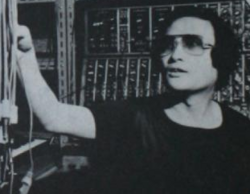

# Isao Tomita

## Biografía

Isao Tomita (en japonés: 冨田 勲, Tomita Isao), (Tokio, 22 de abril de 1932 - 5 de mayo de 2016),​ también conocido como Tomita, fue un renombrado músico y compositor japonés que se caracterizaba por fusionar piezas de música clásica con sintetizadores y otros instrumentos electrónicos. Es también considerado uno de los pioneros de la música electrónica. Recibió cuatro premios Grammy por su disco de 1974 Snowflakes Are Dancing.

## Estilo musical

Isao Tomita (en japonés: 冨田 勲, Tomita Isao), ( Tokio, 22 de abril de 1932 - 5 de mayo de 2016), [ 1 ] ​ también conocido como Tomita, fue un renombrado músico y compositor japonés que se caracterizaba por fusionar piezas de música clásica con sintetizadores y otros instrumentos electrónicos. Es también considerado uno de los pioneros de la música electrónica. Recibió cuatro premios Grammy por su disco de 1974 Snowflakes Are Dancing.

## Anécdotas y curiosidades

1 Biografía Alternar subsección de biografía 1.1 1932–1968: primeros años y carrera como compositor 1.2 1969-1979: música electrónica 1.3 1980-2000: conciertos de SoundCloud 1.4 2001–2016: años posteriores 1.5 Muerte

## Top 10 bandas sonoras

1. ***Ninja Terminator (Título en España: Ninja terminator)***
    * **Póster:** [link](058_isao_tomita/posters/poster_ninja_terminator_1986.jpg)
2. ***The Tale of Genji (Título en España: The Tale of Genji)***
    * **Póster:** [link](058_isao_tomita/posters/poster_the_tale_of_genji_1999.jpg)
3. ***Big Momma's House (Título en España: Esta abuela es un peligro)***
    * **Póster:** [link](058_isao_tomita/posters/poster_big_momma_s_house.jpg)
4. ***千夜一夜物語 (Título en España: Las mil y una noches)***
    * **Póster:** [link](058_isao_tomita/posters/poster_poster_1969.jpg)
5. ***Tokugawa Ieyasu (Título en España: Tokugawa Ieyasu)***
    * **Póster:** [link](058_isao_tomita/posters/poster_tokugawa_ieyasu_1983.jpg)
6. ***新座頭市　破れ！唐人剣 (Título en España: Zatoichi conoce al espadachín manco)***
    * **Póster:** [link](058_isao_tomita/posters/poster_poster_1971.jpg)
7. ***黒蜥蜴 (Título en España: 黒蜥蜴)***
    * **Póster:** [link](058_isao_tomita/posters/poster_poster_1968.jpg)
8. ***学校 (Título en España: 学校)***
    * **Póster:** [link](058_isao_tomita/posters/poster_poster_1993.jpg)
9. ***ガリバーの宇宙旅行 (Título en España: El viaje espacial de Gulliver)***
    * **Póster:** [link](058_isao_tomita/posters/poster_poster_1965.jpg)
10. ***学校 II (Título en España: 学校 II)***
    * **Póster:** [link](058_isao_tomita/posters/poster_ii_1996.jpg)

## Filmografía completa

- ガリバーの宇宙旅行 (Título en España: El viaje espacial de Gulliver) (1965) · [Póster](058_isao_tomita/posters/poster_poster_1965.jpg)
- 黒蜥蜴 (Título en España: 黒蜥蜴) (1968) · [Póster](058_isao_tomita/posters/poster_poster_1968.jpg)
- 千夜一夜物語 (Título en España: Las mil y una noches) (1969) · [Póster](058_isao_tomita/posters/poster_poster_1969.jpg)
- 新座頭市　破れ！唐人剣 (Título en España: Zatoichi conoce al espadachín manco) (1971) · [Póster](058_isao_tomita/posters/poster_poster_1971.jpg)
- Het Grote Gebeuren (Título en España: Het Grote Gebeuren) (1975) · [Póster](058_isao_tomita/posters/poster_het_grote_gebeuren_1975.jpg)
- Tokugawa Ieyasu (Título en España: Tokugawa Ieyasu) (1983) · [Póster](058_isao_tomita/posters/poster_tokugawa_ieyasu_1983.jpg)
- Ninja Terminator (Título en España: Ninja terminator) (1986) · [Póster](058_isao_tomita/posters/poster_ninja_terminator_1986.jpg)
- 도깨비 방망이 (Título en España: 도깨비 방망이) (1990) · [Póster](058_isao_tomita/posters/poster_poster_1990.jpg)
- 学校 (Título en España: 学校) (1993) · [Póster](058_isao_tomita/posters/poster_poster_1993.jpg)
- 学校 II (Título en España: 学校 II) (1996) · [Póster](058_isao_tomita/posters/poster_ii_1996.jpg)
- The Tale of Genji (Título en España: The Tale of Genji) (1999) · [Póster](058_isao_tomita/posters/poster_the_tale_of_genji_1999.jpg)
- おとうと (Título en España: おとうと) (2010) · [Póster](058_isao_tomita/posters/poster_poster_2010.jpg)
- El crit sord dels arbres (Título en España: El crit sord dels arbres) (2023) · [Póster](058_isao_tomita/posters/poster_el_crit_sord_dels_arbres_2023.jpg)
- Mighty Jack (Título en España: Mighty Jack) · [Póster](058_isao_tomita/posters/poster_mighty_jack.jpg)
- The Princess Knight (Título en España: The Princess Knight) · [Póster](058_isao_tomita/posters/poster_the_princess_knight.jpg)
- Big Momma's House (Título en España: Esta abuela es un peligro) · [Póster](058_isao_tomita/posters/poster_big_momma_s_house.jpg)

## Premios y nominaciones

* Orden del Sol Naciente, 4ta clase – (Ganador)

## Fuentes adicionales

* [MundoBSO](https://w.mundobso.com/bso/cartero-siempre-llama-dos-veces-el) — site:mundobso.com
* [MundoBSO (2)](https://www.mundobso.com/bso/star-trek-insurrection) — site:mundobso.com
* [MundoBSO (3)](https://www.mundobso.com/bso/despiadados-los) — site:mundobso.com
* [Film Score Monthly](https://www.filmscoremonthly.com/board/posts.cfm?threadID=61539&forumID=1&archive=0) — site:filmscoremonthly.com
* [Film Score Monthly (2)](https://www.filmscoremonthly.com/board/posts.cfm?threadID=49724&archive=0) — site:filmscoremonthly.com
* [Film Score Monthly (3)](https://www.filmscoremonthly.com/daily/index.cfm) — site:filmscoremonthly.com
* [SoundtrackCollector](https://www.soundtrackcollector.com/catalog/composerdiscography.php?composerid=319) — site:soundtrackcollector.com
* [SoundtrackCollector (2)](https://www.soundtrackcollector.com) — site:soundtrackcollector.com
* [SoundtrackCollector (3)](https://www.soundtrackcollector.com/title/88844/Shin+Zat%C3%B4ichi+Monogatari:+Kasama+No+Chimatsuri) — site:soundtrackcollector.com
* [WhatSong](https://www.whatsong.org) — site:whatsong.org
* [WhatSong (2)](https://www.whatsong.org/tvshow/how-i-met-your-mother/episode/44483) — site:whatsong.org
* [WhatSong (3)](https://www.whatsong.org/tvshow/prison-break/episode/37396) — site:whatsong.org

## Notas externas

* MundoBSO (2): Compositor: Goldsmith, Jerry Sello: GNP Duración: 79 minutos Información de la película Título original: Star Trek: Insurrection Director: Jonathan Frakes Nacionalidad: EE UU Año: 1998 Argumento La tripulación de la nave Enterprise encuentra un planeta con propiedades mágicas, en el que sus habitantes viven en eterna paz... hasta que surge la amenaza de invasión. Compositor: Goldsmith, Jerry Sello: GNP Duración: 79 minutos
* MundoBSO (3): Compositor: Morricone, Ennio Sello: Screen Trax Duración: 37 minutos Información de la película Título original: I crudeli Director: Sergio Corbucci Nacionalidad: Italia Año: 1967 Argumento Al acabar la guerra de Secesión norteamericana, un coronel sudista organiza un ejército para seguir combatiendo, y cuenta para ello con la ayuda de sus tres hijos. Compositor: Morricone, Ennio Sello: Screen Trax Duración: 37 minutos
* SoundtrackCollector (2): 14 de enero - Confesión de un comisionado de policía de Riz Ortolani a la fiscalía 3 de diciembre - Wolf Hall de Debbie Wiseman: El espejo y la luz
* SoundtrackCollector (3): New Tale Of Zatoichi: Blood Festival Of Kasama, A ((título informal en inglés) Zatoichi At The Blood Fest (Gran Bretaña, título del vídeo)
* WhatSong: La mejor fuente en línea de música de películas y televisión. Copyright © 2018 - 2026 Whatsong.org. Reservados todos los derechos.
* WhatSong (2): Lily y Robin bailan con los dos nerds del último año de secundaria. Se reproduce de fondo cuando Lilly, Robin y Barney intentan entrar a la fiesta. La canción es una canción que está incluida en iMovie.
* WhatSong (3): Ramin Djawadi - Prison Break: Temporadas 3 y 4 (Banda sonora original de televisión) Ramin Djawadi - Prison Break: Temporadas 3 y 4 (Banda sonora original de televisión)
* faroutmagazine.co.uk: La música contemporánea tiene un pequeño grupo de innovadores a los que agradecer su estatus actual. Un hombre constantemente pasado por alto por los relatos occidentales dominantes es Isao Tomita, pionero de la música electrónica, los sintetizadores analógicos y el diseño de sonido. Junto a otros que mostraron a la música el camino a seguir, como Wendy Carlos, Rachel Elkind y Yellow Magic Orchestra, a quienes Tomita inspiró directamente, puso la banda sonora a un mundo donde la vida y la tecnología se estaban volviendo rápidamente inextricables. Nacido en Tokio en abril de 1932, Tomita pasó su primera infancia con su padre en China. Después de regresar a su tierra natal cuando era un poco mayor, recibió una educación privada en orquestación y composición mientras estudiaba historia del arte en...
* music.apple.com: Sinfonía Ihatov: V. Noche en el ferrocarril galáctico Planeta naciente: Las mejores obras de música espacial de Tomitaâ·â2021 Sinfonía Ihatov: V. Noche en el ferrocarril galáctico
* www.namm.org: Isao Tomita fue el compositor de música electrónica de renombre mundial que utilizó los sintetizadores Moog para crear música galardonada que influyó en una generación de creadores de música. ¡Entre sus contribuciones más increíbles a la música estuvo el uso de grabaciones multipista para crear sonidos de sintetizadores polifónicos antes de que se creara un sintetizador polifónico! Sus diseños de sonido y nuevos sonidos incluían simulaciones de cuerdas realistas antes de que la mayoría de los compositores aprovecharan la tecnología. Las grabaciones de Tomita de "Snow Flakes Dancing" (nominada a un Grammy en 1974) y "Kosmos" a menudo son referenciadas por ingenieros de producto y programas como obras influyentes e inspiradoras que cambiaron para siempre la forma en que la electrónica...
* classical.music.apple.com: I. Tomita el cuento de geni âthes âthes â 35fantasía sinfónicaâtheâtheâtheâtheâtheâtheâtheâtheâtheâthea: Isao Tomita: Dr. Copplelius iso tomita: Dr. Copplelius Kazumasa Watanabe, Orquesta Filarmónica de Tokio, Hatsune Miku
* www.univision.com: Imagina una melodía onírica aderezada del silbido de Kill Bill o el sonido de un ovni: así es la música de Isao Tomita, compositor de música electrónica japonés que revolucionó la industria del género durante los años 70 y 80 gracias a su capacidad para hilar la cultura pop con la clásica pasándola por el filtro oriental. Un artista al que homenajeamos con algunas de sus mejores canciones, curiosidades y logros. Podría interesarte: 7 álbumes electrónicos de los 90 que debes escuchar
