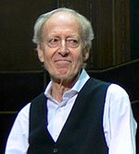

# John Barry

## Biografía

John Barry (York, Yorkshire; 3 de noviembre de 1933-Oyster Bay, Nueva York; 30 de enero de 2011)​ fue un compositor británico de música de cine y televisión. Ganador de cinco Premios Óscar. Se le concedió la Orden del Imperio Británico.

## Estilo musical

1 Biografía Alternar subsección de biografía 1.1 Educación y vida temprana 1.2 Carrera 1.3 James Bond 1.4 El tema de James Bond

## Anécdotas y curiosidades

Nació en York, Yorkshire, Gran Bretaña el 3 de noviembre de 1933. Su nombre completo era John Barry Prendergast, y era hijo de padre irlandés y madre inglesa. Su madre era pianista clásica y su padre, natural de Cork y que había sido proyeccionista de cine mudo, fue después propietario de varios cines por el norte de Inglaterra. [ 2 ] ​ Debido a ello, el joven John creció influido por las películas que veía, como declararía después. Asistió al St Peter's School en York y también recibió clases de composición de Francis Jackson, organista de la Catedral de York.

## Top 10 bandas sonoras

1. ***Star Wars (Título en España: La guerra de las galaxias)***
    * **Póster:** [link](059_john_barry/posters/poster_star_wars_1977.jpg)
2. ***A Clockwork Orange (Título en España: La naranja mecánica)***
    * **Póster:** [link](059_john_barry/posters/poster_a_clockwork_orange_1971.jpg)
3. ***Superman (Título en España: Superman)***
    * **Póster:** [link](059_john_barry/posters/poster_superman_1978.jpg)
4. ***The Empire Strikes Back (Título en España: El imperio contraataca)***
    * **Póster:** [link](059_john_barry/posters/poster_the_empire_strikes_back_1980.jpg)
5. ***Superman II (Título en España: Superman II)***
    * **Póster:** [link](059_john_barry/posters/poster_superman_ii_1980.jpg)
6. ***Kelly's Heroes (Título en España: Los violentos de Kelly)***
    * **Póster:** [link](059_john_barry/posters/poster_kelly_s_heroes_1970.jpg)
7. ***Superman II: The Richard Donner Cut (Título en España: Superman II: El montaje de Richard Donner)***
    * **Póster:** [link](059_john_barry/posters/poster_superman_ii_the_richard_donner_cut_2006.jpg)
8. ***Saturn 3 (Título en España: Saturno 3)***
    * **Póster:** [link](059_john_barry/posters/poster_saturn_3_1980.jpg)
9. ***Murder at the Gallop (Título en España: Después del funeral)***
    * **Póster:** [link](059_john_barry/posters/poster_murder_at_the_gallop_1963.jpg)
10. ***Phase IV (Título en España: Sucesos en la IV fase)***
    * **Póster:** [link](059_john_barry/posters/poster_phase_iv_1974.jpg)

## Filmografía completa

- Murder at the Gallop (Título en España: Después del funeral) (1963) · [Póster](059_john_barry/posters/poster_murder_at_the_gallop_1963.jpg)
- It's All Over Town (Título en España: It's All Over Town) (1963) · [Póster](059_john_barry/posters/poster_it_s_all_over_town_1963.jpg)
- The Marked One (Título en España: The Marked One) (1963) · [Póster](059_john_barry/posters/poster_the_marked_one_1963.jpg)
- Three Bites of the Apple (Título en España: Tres mordiscos a la manzana) (1967) · [Póster](059_john_barry/posters/poster_three_bites_of_the_apple_1967.jpg)
- Decline and Fall ...of a Birdwatcher (Título en España: Decline and Fall ...of a Birdwatcher) (1968) · [Póster](059_john_barry/posters/poster_decline_and_fall_of_a_birdwatcher_1968.jpg)
- Kelly's Heroes (Título en España: Los violentos de Kelly) (1970) · [Póster](059_john_barry/posters/poster_kelly_s_heroes_1970.jpg)
- Murphy's War (Título en España: La guerra de Murphy) (1971) · [Póster](059_john_barry/posters/poster_murphy_s_war_1971.jpg)
- A Clockwork Orange (Título en España: La naranja mecánica) (1971) · [Póster](059_john_barry/posters/poster_a_clockwork_orange_1971.jpg)
- Sitting Target (Título en España: La celada) (1972) · [Póster](059_john_barry/posters/poster_sitting_target_1972.jpg)
- The Little Prince (Título en España: El principito) (1974) · [Póster](059_john_barry/posters/poster_the_little_prince_1974.jpg)
- Phase IV (Título en España: Sucesos en la IV fase) (1974) · [Póster](059_john_barry/posters/poster_phase_iv_1974.jpg)
- Lucky Lady (Título en España: Los aventureros del Lucky Lady) (1975) · [Póster](059_john_barry/posters/poster_lucky_lady_1975.jpg)
- Star Wars (Título en España: La guerra de las galaxias) (1977) · [Póster](059_john_barry/posters/poster_star_wars_1977.jpg)
- Superman (Título en España: Superman) (1978) · [Póster](059_john_barry/posters/poster_superman_1978.jpg)
- Fast Break (Título en España: Fast Break) (1979) · [Póster](059_john_barry/posters/poster_fast_break_1979.jpg)
- A Force of One (Título en España: Fuerza 7) (1979) · [Póster](059_john_barry/posters/poster_a_force_of_one_1979.jpg)
- The Empire Strikes Back (Título en España: El imperio contraataca) (1980) · [Póster](059_john_barry/posters/poster_the_empire_strikes_back_1980.jpg)
- Saturn 3 (Título en España: Saturno 3) (1980) · [Póster](059_john_barry/posters/poster_saturn_3_1980.jpg)
- Superman II (Título en España: Superman II) (1980) · [Póster](059_john_barry/posters/poster_superman_ii_1980.jpg)
- The Making of 'Superman: The Movie' (Título en España: The Making of 'Superman: The Movie') (1982) · [Póster](059_john_barry/posters/poster_the_making_of_superman_the_movie_1982.jpg)
- Taking Flight: The Development of 'Superman' (Título en España: Taking Flight: The Development of 'Superman') (2001) · [Póster](059_john_barry/posters/poster_taking_flight_the_development_of_superman_2001.jpg)
- Superman II: The Richard Donner Cut (Título en España: Superman II: El montaje de Richard Donner) (2006) · [Póster](059_john_barry/posters/poster_superman_ii_the_richard_donner_cut_2006.jpg)

## Premios y nominaciones

* 1967 – Premio de la Academia a la mejor banda sonora original – por *Born Free (Título en España: Nacida libre)* – (Ganador)
* 1967 – Premio de la Academia a la mejor banda sonora original – por *Born Free (Título en España: Nacida libre)* – (Nominación)
* 1967 – Premio de la Academia a la mejor canción original – por *Born Free (Título en España: Nacida libre)* – (Ganador)
* 1969 – Premio BAFTA a la mejor música original – por *The Lion in Winter (Título en España: El León en invierno)* – (Ganador)
* 1969 – Premio Grammy a la mejor composición instrumental – (Ganador)
* 1969 – Premio de la Academia a la mejor banda sonora original, sin musical – por *The Lion in Winter (Título en España: El León en invierno)* – (Ganador)
* 1969 – Premio de la Academia a la mejor banda sonora original, sin musical – por *The Lion in Winter (Título en España: El León en invierno)* – (Nominación)
* 1972 – Premio de la Academia a la mejor banda sonora dramática original – por *Mary, Queen of Scots (Título en España: María, reina de Escocia)* – (Nominación)
* 1981 – Premios Saturno – (Ganador)
* 1982 – Premio Golden Raspberry a la peor canción original – por *The Man in the Mask (Título en España: The Man in the Mask)* – (Nominación)
* 1982 – Premio Golden Raspberry a la peor partitura musical – por *The Legend Of The Lone Ranger (Título en España: The Legend Of The Lone Ranger)* – (Ganador)
* 1982 – Premio Golden Raspberry a la peor partitura musical – por *The Legend Of The Lone Ranger (Título en España: The Legend Of The Lone Ranger)* – (Nominación)
* 1985 – Premio Globo de Oro a la mejor banda sonora original – por *Out of Africa (Título en España: Memorias de África)* – (Ganador)
* 1985 – Premio Grammy al mejor álbum de gran conjunto de jazz – (Ganador)
* 1986 – Premio Grammy a la mejor composición instrumental – por *Out of Africa (Título en España: Memorias de África)* – (Ganador)
* 1986 – Premio de la Academia a la mejor banda sonora original – por *Out of Africa (Título en España: Memorias de África)* – (Ganador)
* 1986 – Premio de la Academia a la mejor banda sonora original – por *Out of Africa (Título en España: Memorias de África)* – (Nominación)
* 1991 – Premio Grammy a la mejor banda sonora para medios visuales – por *Dances with Wolves (Título en España: Bailando con lobos)* – (Ganador)
* 1991 – Premio de la Academia a la mejor banda sonora original – por *Dances with Wolves (Título en España: Bailando con lobos)* – (Ganador)
* 1991 – Premio de la Academia a la mejor banda sonora original – por *Dances with Wolves (Título en España: Bailando con lobos)* – (Nominación)
* 1993 – Premio de la Academia a la mejor banda sonora original – por *Chaplin (Título en España: Chaplin)* – (Nominación)
* 2005 – Premio de beca de la Academia – (Ganador)
* Oficial de la Orden del Imperio Británico – (Ganador)
* Premios Brit clásicos – (Ganador)

## Fuentes adicionales

* [MundoBSO](https://www.mundobso.com/compositor/barry-john) — site:mundobso.com
* [MundoBSO (2)](https://www.mundobso.com/agoras/esta-john-barry-sobrevalorado) — site:mundobso.com
* [MundoBSO (3)](https://www.mundobso.com/agoras/john-barry-al-descubierto) — site:mundobso.com
* [Film Score Monthly](https://filmscoremonthly.com/daily/article.cfm/articleID/6617/) — site:filmscoremonthly.com
* [Film Score Monthly (2)](https://www.filmscoremonthly.com/board/posts.cfm?archive=0&forumID=1&threadID=149413) — site:filmscoremonthly.com
* [Film Score Monthly (3)](https://www.filmscoremonthly.com/daily/article.cfm/articleID/2420/John-Barry-The-Beyondness-of-Things/) — site:filmscoremonthly.com
* [SoundtrackCollector](https://www.soundtrackcollector.com/composer/80/John+Barry) — site:soundtrackcollector.com
* [SoundtrackCollector (2)](https://www.soundtrackcollector.com/title/10960/John+Barry+The+Collection:+40+Years+Of+Film+Music) — site:soundtrackcollector.com
* [SoundtrackCollector (3)](https://www.soundtrackcollector.com/catalog/composerdetail.php?composerid=80) — site:soundtrackcollector.com
* [WhatSong](https://www.whatsong.org/tvshow/prison-break/episode/37396) — site:whatsong.org
* [WhatSong (2)](https://www.whatsong.org/tvshow/grown-ish/episode/82123) — site:whatsong.org
* [WhatSong (3)](https://www.whatsong.org/tvshow/good-witch/episode/88626) — site:whatsong.org

## Notas externas

* MundoBSO: Nació en York (Reino Unido), el 3 de noviembre de 1933, y murió en Nueva York (EE UU), el 30 de enero de 2011. Comenzó su carrera tocando en una banda, hasta que en 1957 fundó su propio grupo de jazz -The John Barry Seven-, con el que realizó giras y apareció en televisión. Con la formación, colaboraron con el cantante Adam Faith en la canción "What Do You Want?", que obtuvo un enorme éxito que siguió con otros temas, y al poco comenzó a trabajar en el cine. Desarrolló una importante labor dentro del Free-Cinema británico, con partituras jazzísticas y destacó pronto como gran melodista, con bandas sonoras dotadas de hermosas y evocadoras músicas con las que consiguió gran éxito. Hay un...
* WhatSong: Ramin Djawadi - Prison Break: Temporadas 3 y 4 (Banda sonora original de televisión) Ramin Djawadi - Prison Break: Temporadas 3 y 4 (Banda sonora original de televisión)
* WhatSong (2): Luca está pensando en él y en el encuentro sexual de Zoey de la noche anterior. Luca está estresado por su "yo". Texto a Zoey y su falta de respuesta.
* WhatSong (3): La mejor fuente en línea de música de películas y televisión. Copyright © 2018 - 2026 Whatsong.org. Reservados todos los derechos.
* cinescores.dudaone.com: Una entrevista con John Barry por Daniel Mangodt Publicado originalmente en Soundtrack Magazine Vol.15 / No.58 / 1996 Texto reproducido con la amable autorización del editor, Luc Van de Ven Has musicalizado 11 de las 18 películas de James Bond. Mirando hacia atrás en ese período de su carrera, ¿cómo se siente al respecto?
* bsomusicadetrasdecamaras.blogspot.com: danza con lobos es una de mis favoritas me produce una paz infinita escucharla gracias sr barry descanse en paz
* www.bfi.org.uk: Pocos compositores de cine han construido un legado tan memorable de música cinematográfica como el británico John Barry. Ganador de cinco premios de la Academia, escribió algunas de las bandas sonoras más queridas del cine, incluidas 11 películas de James Bond y tres ganadoras del Oscar a la mejor película (Dances with Wolves, Out of Africa y Midnight Cowboy). Nacido el 3 de noviembre de 1933, Barry encontró un temprano éxito pop con John Barry Seven, lo que llevó al hijo del propietario del cine de Yorkshire a componer su primera película, Beat Girl, en 1960. Después de sus sensacionales arreglos de la música de Monty Norman para Dr. No (1962), Barry pronto se convirtió en el compositor soñado de los productores de Bond y durante los siguientes 25 años trabajó en la mayoría de las películas de 007 de esa época, siendo su "sonido Bond" una parte indeleble...
* kids.kiddle.co: John Barry Prendergast (3 de noviembre de 1933 - 30 de enero de 2011) fue un famoso compositor y director de orquesta británico. Creó música para muchas películas. Es más famoso por escribir la música de once de las películas de James Bond entre 1963 y 1987. También arregló e interpretó el "Tema de James Bond" para la primera película, Dr. No, en 1962.
* www.mtishows.com: Tenga en cuenta que estamos experimentando retrasos en el escaneo de los materiales devueltos y que tenemos un retraso de cinco días hábiles en el envío de los envíos. Es posible que las fechas de envío que figuran en su cuenta MyMTI no indiquen la fecha real en que se enviarán sus materiales. Lamentamos las molestias y apreciamos mucho su paciencia. Espectáculos Explorar espectáculos Musicales de 10 minutos Explorar colecciones Broadway Junior Broadway Senior Selecciones de conciertos Lanzamientos futuros
* www.britannica.com: Nuestros editores revisarán lo que ha enviado y determinarán si deben revisar el artículo. John Barry (nacido el 3 de noviembre de 1933 en York, Inglaterra; fallecido el 30 de enero de 2011 en Oyster Bay, Long Island, Nueva York, EE. UU.) Compositor británico que proporcionó las partituras musicales para más de 100 películas y programas de televisión, en particular 11 películas protagonizadas por el icónico espía de Ian Fleming, James Bond: Desde Rusia con amor (1963), Goldfinger (1964), Thunderball (1965), Sólo vives Dos veces (1967), Al servicio secreto de Su Majestad (1969), Los diamantes son para siempre (1971), El hombre de la pistola dorada (1974), Moonraker (1979), Octopussy (1983), Panorama para matar (1985) y The Living Daylights (1987), y otro, Dr. No...
* classicrock.fandom.com: Explorar la página principal Todas las páginas Comunidad Mapas interactivos Publicaciones de blog recientes Páginas modificadas recientemente Guns N' Roses Van Halen Aerosmith John Lennon Ritchie Valens The Jean Genie The Pogues
* www.johnbarry.org.uk: Obras Volver Películas Volver Filmografía Años 60 Filmografía Años 70 Filmografía Años 80 Filmografía 1990-2001 Etapa Volver Lolita, My Love - 2019 Brighton Rock Musicales más antiguos Lanzamientos de Blu-Ray Lanzamientos de DVD CD Bond ampliado Partituras inéditas FilmNotgraphy Volver Películas Volver Filmografía Años 60 Filmografía Años 70 Filmografía Años 80 Filmografía 1990-2001 Stage Back Lolita, My Love - 2019 Brighton Rock Musicales más antiguos Lanzamientos de Blu-Ray Lanzamientos de DVD CD de Bond ampliado Partituras inéditas FilmNotgraphy
