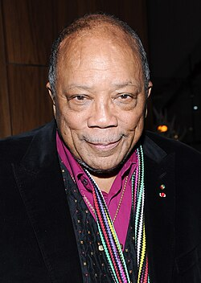

# Quincy Jones

## Biografía

Quincy Delight Jones Jr. (Chicago, 14 de marzo de 1933-Los Ángeles, 3 de noviembre de 2024),​ conocido como Quincy Jones o Q, fue un trompetista, compositor, director de orquesta, arreglista y productor estadounidense. Fue el productor principal de Michael Jackson, de quien produjo los álbumes Off The Wall (1979), Thriller (1982) y Bad (1987), siendo el segundo de dichos álbumes, el álbum más vendido de todos los tiempos y también el más vendido de la carrera de Jackson. Su interés musical abarcó géneros como el R&B y el jazz (swing y bop), con frecuente tendencia a su fusión. Asimismo, fue intérprete ocasional de trompeta y piano, y también cantante. Su carrera incluyó grabaciones con Frank Sinatra, la composición de bandas sonoras para películas y su labor como productor discográfico. Fue también productor de la canción «We Are the World» (1985). Recibió el Grammy Legend Award, el Premio Kennedy, la Medalla Nacional de las Artes y la Legión de Honor, entre otras distinciones.

## Estilo musical

Quincy Delight Jones Jr. ( Chicago, 14 de marzo de 1933- Los Ángeles, 3 de noviembre de 2024), [ 1 ] ​ conocido como Quincy Jones o Q, fue un trompetista, compositor, director de orquesta, arreglista y productor estadounidense.

## Anécdotas y curiosidades

2 Alternancia de carrera Subsección de carrera 2.1 1953–1959: inicios de carrera con la música jazz 2.2 1961–1977: avance y aclamación 2.3 1978–1989: exploración de la música pop 2.4 1990–2024: carrera establecida

## Top 10 bandas sonoras

1. ***The Color Purple (Título en España: El color púrpura)***
    * **Póster:** [link](060_quincy_jones/posters/poster_the_color_purple_1985.jpg)
2. ***In the Heat of the Night (Título en España: En el calor de la noche)***
    * **Póster:** [link](060_quincy_jones/posters/poster_in_the_heat_of_the_night_1967.jpg)
3. ***In Cold Blood (Título en España: A sangre fría)***
    * **Póster:** [link](060_quincy_jones/posters/poster_in_cold_blood_1967.jpg)
4. ***The Wiz (Título en España: El mago)***
    * **Póster:** [link](060_quincy_jones/posters/poster_the_wiz_1978.jpg)
5. ***Get Rich or Die Tryin' (Título en España: Rico o muerto)***
    * **Póster:** [link](060_quincy_jones/posters/poster_get_rich_or_die_tryin_2005.jpg)
6. ***The Getaway (Título en España: La huida)***
    * **Póster:** [link](060_quincy_jones/posters/poster_the_getaway_1972.jpg)
7. ***Austin Powers in Goldmember (Título en España: Austin Powers en Miembro de Oro)***
    * **Póster:** [link](060_quincy_jones/posters/poster_austin_powers_in_goldmember_2002.jpg)
8. ***The Italian Job (Título en España: Un trabajo en Italia)***
    * **Póster:** [link](060_quincy_jones/posters/poster_the_italian_job_1969.jpg)
9. ***Cactus Flower (Título en España: Flor de cactus)***
    * **Póster:** [link](060_quincy_jones/posters/poster_cactus_flower_1969.jpg)
10. ***Ennio (Título en España: Ennio, el Maestro)***
    * **Póster:** [link](060_quincy_jones/posters/poster_ennio_2022.jpg)

## Filmografía completa

- Pojken i trädet (Título en España: Pojken i trädet) (1961) · [Póster](060_quincy_jones/posters/poster_pojken_i_tr_det_1961.jpg)
- The Pawnbroker (Título en España: El prestamista) (1965) · [Póster](060_quincy_jones/posters/poster_the_pawnbroker_1965.jpg)
- Mirage (Título en España: Espejismo) (1965) · [Póster](060_quincy_jones/posters/poster_mirage_1965.jpg)
- Frank Sinatra Spectacular (Título en España: Frank Sinatra Spectacular) (1965) · [Póster](060_quincy_jones/posters/poster_frank_sinatra_spectacular_1965.jpg)
- The Slender Thread (Título en España: La vida vale más) (1965) · [Póster](060_quincy_jones/posters/poster_the_slender_thread_1965.jpg)
- Walk Don't Run (Título en España: Apartamento para tres) (1966) · [Póster](060_quincy_jones/posters/poster_walk_don_t_run_1966.jpg)
- In Cold Blood (Título en España: A sangre fría) (1967) · [Póster](060_quincy_jones/posters/poster_in_cold_blood_1967.jpg)
- Banning (Título en España: Banning) (1967) · [Póster](060_quincy_jones/posters/poster_banning_1967.jpg)
- In the Heat of the Night (Título en España: En el calor de la noche) (1967) · [Póster](060_quincy_jones/posters/poster_in_the_heat_of_the_night_1967.jpg)
- Enter Laughing (Título en España: Enter Laughing) (1967) · [Póster](060_quincy_jones/posters/poster_enter_laughing_1967.jpg)
- Ironside (Título en España: Ironside) (1967) · [Póster](060_quincy_jones/posters/poster_ironside_1967.jpg)
- The Deadly Affair (Título en España: Llamada para un muerto) (1967) · [Póster](060_quincy_jones/posters/poster_the_deadly_affair_1967.jpg)
- The Split (Título en España: El reparto) (1968) · [Póster](060_quincy_jones/posters/poster_the_split_1968.jpg)
- The Hell with Heroes (Título en España: Los héroes están muertos) (1968) · [Póster](060_quincy_jones/posters/poster_the_hell_with_heroes_1968.jpg)
- A Dandy in Aspic (Título en España: Sentencia para un Dandy) (1968) · [Póster](060_quincy_jones/posters/poster_a_dandy_in_aspic_1968.jpg)
- Split Second to an Epitaph (Título en España: Split Second to an Epitaph) (1968) · [Póster](060_quincy_jones/posters/poster_split_second_to_an_epitaph_1968.jpg)
- For Love of Ivy (Título en España: Un hombre para Ivy) (1968) · [Póster](060_quincy_jones/posters/poster_for_love_of_ivy_1968.jpg)
- Bob & Carol & Ted & Alice (Título en España: Bob, Carol, Ted y Alice) (1969) · [Póster](060_quincy_jones/posters/poster_bob_carol_ted_alice_1969.jpg)
- Cactus Flower (Título en España: Flor de cactus) (1969) · [Póster](060_quincy_jones/posters/poster_cactus_flower_1969.jpg)
- John and Mary (Título en España: John y Mary) (1969) · [Póster](060_quincy_jones/posters/poster_john_and_mary_1969.jpg)
- Of Men and Demons (Título en España: Of Men and Demons) (1969) · [Póster](060_quincy_jones/posters/poster_of_men_and_demons_1969.jpg)
- The Lost Man (Título en España: The Lost Man) (1969) · [Póster](060_quincy_jones/posters/poster_the_lost_man_1969.jpg)
- The Italian Job (Título en España: Un trabajo en Italia) (1969) · [Póster](060_quincy_jones/posters/poster_the_italian_job_1969.jpg)
- They Call Me Mister Tibbs! (Título en España: Ahora me llaman Señor Tibbs) (1970) · [Póster](060_quincy_jones/posters/poster_they_call_me_mister_tibbs_1970.jpg)
- Last of the Mobile Hot Shots (Título en España: Last of the Mobile Hot Shots) (1970) · [Póster](060_quincy_jones/posters/poster_last_of_the_mobile_hot_shots_1970.jpg)
- The Out-of-Towners (Título en España: Los encantos de la gran ciudad) (1970) · [Póster](060_quincy_jones/posters/poster_the_out_of_towners_1970.jpg)
- Brother John (Título en España: Como el viento) (1971) · [Póster](060_quincy_jones/posters/poster_brother_john_1971.jpg)
- $ (Título en España: Dólares) (1971) · [Póster](060_quincy_jones/posters/poster_poster_1971.jpg)
- Eggs (Título en España: Eggs) (1971) · [Póster](060_quincy_jones/posters/poster_eggs_1971.jpg)
- Honky (Título en España: Honky) (1971) · [Póster](060_quincy_jones/posters/poster_honky_1971.jpg)
- The Anderson Tapes (Título en España: Supergolpe en Manhattan) (1971) · [Póster](060_quincy_jones/posters/poster_the_anderson_tapes_1971.jpg)
- We Are Universal (Título en España: We Are Universal) (1971) · [Póster](060_quincy_jones/posters/poster_we_are_universal_1971.jpg)
- The Getaway (Título en España: La huida) (1972) · [Póster](060_quincy_jones/posters/poster_the_getaway_1972.jpg)
- The Hot Rock (Título en España: Un Diamante Al Rojo Vivo) (1972) · [Póster](060_quincy_jones/posters/poster_the_hot_rock_1972.jpg)
- The Wiz (Título en España: El mago) (1978) · [Póster](060_quincy_jones/posters/poster_the_wiz_1978.jpg)
- Wiz on Down the Road (Título en España: Wiz on Down the Road) (1978) · [Póster](060_quincy_jones/posters/poster_wiz_on_down_the_road_1978.jpg)
- Diana (Título en España: Diana) (1981) · [Póster](060_quincy_jones/posters/poster_diana_1981.jpg)
- I Love Quincy (Título en España: I Love Quincy) (1984) · [Póster](060_quincy_jones/posters/poster_i_love_quincy_1984.jpg)
- The Color Purple (Título en España: El color púrpura) (1985) · [Póster](060_quincy_jones/posters/poster_the_color_purple_1985.jpg)
- We Are the World: The Story Behind the Song (Título en España: We Are the World: The Story Behind the Song) (1985) · [Póster](060_quincy_jones/posters/poster_we_are_the_world_the_story_behind_the_song_1985.jpg)
- Bugs Bunny/Looney Tunes All-Star 50th Anniversary (Título en España: Bugs Bunny/Looney Tunes All-Star 50th Anniversary) (1986) · [Póster](060_quincy_jones/posters/poster_bugs_bunny_looney_tunes_all_star_50th_anniversary_1986.jpg)
- Michael Jackson: The Legend Continues (Título en España: Michael Jackson... La leyenda continúa) (1988) · [Póster](060_quincy_jones/posters/poster_michael_jackson_the_legend_continues_1988.jpg)
- Prince: Musical Portrait (Título en España: Prince: Musical Portrait) (1989) · [Póster](060_quincy_jones/posters/poster_prince_musical_portrait_1989.jpg)
- The Unforgettable Nat King Cole (Título en España: The Unforgettable Nat King Cole) (1989) · [Póster](060_quincy_jones/posters/poster_the_unforgettable_nat_king_cole_1989.jpg)
- Listen Up: The Lives of Quincy Jones (Título en España: Listen Up: The Lives of Quincy Jones) (1990) · [Póster](060_quincy_jones/posters/poster_listen_up_the_lives_of_quincy_jones_1990.jpg)
- The Earth Day Special (Título en España: The Earth Day Special) (1990) · [Póster](060_quincy_jones/posters/poster_the_earth_day_special_1990.jpg)
- The Real Malcolm X (Título en España: The Real Malcolm X) (1992) · [Póster](060_quincy_jones/posters/poster_the_real_malcolm_x_1992.jpg)
- New Order Story (Título en España: New Order Story) (1993) · [Póster](060_quincy_jones/posters/poster_new_order_story_1993.jpg)
- A Great Day in Harlem (Título en España: A Great Day in Harlem) (1994) · [Póster](060_quincy_jones/posters/poster_a_great_day_in_harlem_1994.jpg)
- The Jackson Family Honors (Título en España: The Jackson Family Honors) (1994) · [Póster](060_quincy_jones/posters/poster_the_jackson_family_honors_1994.jpg)
- Oscar Peterson: Music in the Key of Oscar (Título en España: Oscar Peterson: Music in the Key of Oscar) (1995) · [Póster](060_quincy_jones/posters/poster_oscar_peterson_music_in_the_key_of_oscar_1995.jpg)
- Quincy Jones: 50 Years in Music - Live at Montreux (Título en España: Quincy Jones: 50 Years in Music - Live at Montreux) (1996) · [Póster](060_quincy_jones/posters/poster_quincy_jones_50_years_in_music_live_at_montreux_1996.jpg)
- The Phil Collins Big Band - Live at Montreux 1996 (Título en España: The Phil Collins Big Band - Live at Montreux 1996) (1996) · [Póster](060_quincy_jones/posters/poster_the_phil_collins_big_band_live_at_montreux_1996_1996.jpg)
- Wayne Shorter: Live at Montreux 1996 (Título en España: Wayne Shorter: Live at Montreux 1996) (1996) · [Póster](060_quincy_jones/posters/poster_wayne_shorter_live_at_montreux_1996_1996.jpg)
- Creating Ragtime (Título en España: Creating Ragtime) (1998) · [Póster](060_quincy_jones/posters/poster_creating_ragtime_1998.jpg)
- Quincy Jones...The First 50 Years (Título en España: Quincy Jones...The First 50 Years) (1998) · [Póster](060_quincy_jones/posters/poster_quincy_jones_the_first_50_years_1998.jpg)
- Intimate Portrait: Natalie Cole (Título en España: Intimate Portrait: Natalie Cole) (1999) · [Póster](060_quincy_jones/posters/poster_intimate_portrait_natalie_cole_1999.jpg)
- Fantasia 2000 (Título en España: Fantasía 2000) (2000) · [Póster](060_quincy_jones/posters/poster_fantasia_2000_2000.jpg)
- Frank Sinatra Memorial (Título en España: Frank Sinatra Memorial) (2000) · [Póster](060_quincy_jones/posters/poster_frank_sinatra_memorial_2000.jpg)
- Sidney Poitier: One Bright Light (Título en España: Sidney Poitier: One Bright Light) (2000) · [Póster](060_quincy_jones/posters/poster_sidney_poitier_one_bright_light_2000.jpg)
- Lesley Gore: It's Her Party (Título en España: Lesley Gore: It's Her Party) (2001) · [Póster](060_quincy_jones/posters/poster_lesley_gore_it_s_her_party_2001.jpg)
- Michael Jackson: 30th Anniversary Celebration (Título en España: Michael Jackson: 30th Anniversary Celebration) (2001) · [Póster](060_quincy_jones/posters/poster_michael_jackson_30th_anniversary_celebration_2001.jpg)
- Quincy Jones: In the Pocket (Título en España: Quincy Jones: In the Pocket) (2001) · [Póster](060_quincy_jones/posters/poster_quincy_jones_in_the_pocket_2001.jpg)
- Austin Powers in Goldmember (Título en España: Austin Powers en Miembro de Oro) (2002) · [Póster](060_quincy_jones/posters/poster_austin_powers_in_goldmember_2002.jpg)
- It's Black Entertainment (Título en España: It's Black Entertainment) (2002) · [Póster](060_quincy_jones/posters/poster_it_s_black_entertainment_2002.jpg)
- The Cosby Show: A Look Back (Título en España: The Cosby Show: A Look Back) (2002) · [Póster](060_quincy_jones/posters/poster_the_cosby_show_a_look_back_2002.jpg)
- Live and Swingin': The Ultimate Rat Pack Collection (Título en España: Live and Swingin': The Ultimate Rat Pack Collection) (2003) · [Póster](060_quincy_jones/posters/poster_live_and_swingin_the_ultimate_rat_pack_collection_2003.jpg)
- Michael Jackson: Number Ones (Título en España: Michael Jackson: Number Ones) (2003) · [Póster](060_quincy_jones/posters/poster_michael_jackson_number_ones_2003.jpg)
- Genius. A Night for Ray Charles (Título en España: Genius. A Night for Ray Charles) (2004) · [Póster](060_quincy_jones/posters/poster_genius_a_night_for_ray_charles_2004.jpg)
- Michael Jackson: The One (Título en España: Michael Jackson: The One) (2004) · [Póster](060_quincy_jones/posters/poster_michael_jackson_the_one_2004.jpg)
- The World of Nat King Cole (Título en España: The World of Nat King Cole) (2004) · [Póster](060_quincy_jones/posters/poster_the_world_of_nat_king_cole_2004.jpg)
- Letter to the President (Título en España: Letter to the President) (2005) · [Póster](060_quincy_jones/posters/poster_letter_to_the_president_2005.jpg)
- Get Rich or Die Tryin' (Título en España: Rico o muerto) (2005) · [Póster](060_quincy_jones/posters/poster_get_rich_or_die_tryin_2005.jpg)
- Jazz Icons - Quincy Jones Live in '60 (Título en España: Jazz Icons - Quincy Jones Live in '60) (2006) · [Póster](060_quincy_jones/posters/poster_jazz_icons_quincy_jones_live_in_60_2006.jpg)
- The N Word (Título en España: The N Word) (2006) · [Póster](060_quincy_jones/posters/poster_the_n_word_2006.jpg)
- Brando (Título en España: Brando) (2007) · [Póster](060_quincy_jones/posters/poster_brando_2007.jpg)
- King: Man of Peace in a Time of War (Título en España: King: Man of Peace in a Time of War) (2007) · [Póster](060_quincy_jones/posters/poster_king_man_of_peace_in_a_time_of_war_2007.jpg)
- An Evening with Quincy Jones (Título en España: An Evening with Quincy Jones) (2008) · [Póster](060_quincy_jones/posters/poster_an_evening_with_quincy_jones_2008.jpg)
- Celia: The Queen (Título en España: Celia: The Queen) (2008) · [Póster](060_quincy_jones/posters/poster_celia_the_queen_2008.jpg)
- Lady Be Good: Instrumental Women In Jazz (Título en España: Lady Be Good: Instrumental Women In Jazz) (2008) · [Póster](060_quincy_jones/posters/poster_lady_be_good_instrumental_women_in_jazz_2008.jpg)
- Quincy Jones : 75th Birthday Celebration Live at Montreux (Título en España: Quincy Jones : 75th Birthday Celebration Live at Montreux) (2008) · [Póster](060_quincy_jones/posters/poster_quincy_jones_75th_birthday_celebration_live_at_montreux_2008.jpg)
- Quincy Jones: Breaking New Sound (Título en España: Quincy Jones: Breaking New Sound) (2008) · [Póster](060_quincy_jones/posters/poster_quincy_jones_breaking_new_sound_2008.jpg)
- Q: The Man (Título en España: Q: The Man) (2009) · [Póster](060_quincy_jones/posters/poster_q_the_man_2009.jpg)
- The Jazz Baroness (Título en España: The Jazz Baroness) (2009) · [Póster](060_quincy_jones/posters/poster_the_jazz_baroness_2009.jpg)
- Wheedle's Groove (Título en España: Wheedle's Groove) (2009) · [Póster](060_quincy_jones/posters/poster_wheedle_s_groove_2009.jpg)
- Anouk Aimée, la beauté du geste (Título en España: Anouk Aimée, la beauté du geste) (2012) · [Póster](060_quincy_jones/posters/poster_anouk_aim_e_la_beaut_du_geste_2012.jpg)
- Iceberg Slim: Portrait of a Pimp (Título en España: Iceberg Slim: Retrato de un chulo) (2012) · [Póster](060_quincy_jones/posters/poster_iceberg_slim_portrait_of_a_pimp_2012.jpg)
- Paul Simon: Under African Skies (Título en España: Paul Simon. Under African Skies) (2012) · [Póster](060_quincy_jones/posters/poster_paul_simon_under_african_skies_2012.jpg)
- Rising Above the Blues: The Story of Jimmy Scott (Título en España: Rising Above the Blues: The Story of Jimmy Scott) (2012) · [Póster](060_quincy_jones/posters/poster_rising_above_the_blues_the_story_of_jimmy_scott_2012.jpg)
- Experience Montreux (Título en España: Experience Montreux) (2013) · [Póster](060_quincy_jones/posters/poster_experience_montreux_2013.jpg)
- Marvin Hamlisch: What He Did For Love (Título en España: Marvin Hamlisch: What He Did For Love) (2013) · [Póster](060_quincy_jones/posters/poster_marvin_hamlisch_what_he_did_for_love_2013.jpg)
- Miles Davis with Quincy Jones and the Gil Evans Orchestra Live at Montreux 1991 (Título en España: Miles Davis with Quincy Jones and the Gil Evans Orchestra Live at Montreux 1991) (2013) · [Póster](060_quincy_jones/posters/poster_miles_davis_with_quincy_jones_and_the_gil_evans_orchestra_live_at_montreux_1991_2013.jpg)
- Richard Pryor: Omit the Logic (Título en España: Richard Pryor: Omit the Logic) (2013) · [Póster](060_quincy_jones/posters/poster_richard_pryor_omit_the_logic_2013.jpg)
- The Distortion of Sound (Título en España: The Distortion of Sound) (2014) · [Póster](060_quincy_jones/posters/poster_the_distortion_of_sound_2014.jpg)
- Kareem: Minority of One (Título en España: Kareem: Minority of One) (2015) · [Póster](060_quincy_jones/posters/poster_kareem_minority_of_one_2015.jpg)
- Sinatra 100: An All-Star Grammy Concert (Título en España: Sinatra 100: An All-Star Grammy Concert) (2015) · [Póster](060_quincy_jones/posters/poster_sinatra_100_an_all_star_grammy_concert_2015.jpg)
- I Go Back Home - Jimmy Scott (Título en España: I Go Back Home - Jimmy Scott) (2016) · [Póster](060_quincy_jones/posters/poster_i_go_back_home_jimmy_scott_2016.jpg)
- Michael Jackson's Journey from Motown to Off the Wall (Título en España: Michael Jackson. De la Motown a Off the Wall) (2016) · [Póster](060_quincy_jones/posters/poster_michael_jackson_s_journey_from_motown_to_off_the_wall_2016.jpg)
- More Than Jazz (Título en España: More Than Jazz) (2016) · [Póster](060_quincy_jones/posters/poster_more_than_jazz_2016.jpg)
- Feel Rich: Health Is the New Wealth (Título en España: Feel Rich: Health Is the New Wealth) (2017) · [Póster](060_quincy_jones/posters/poster_feel_rich_health_is_the_new_wealth_2017.jpg)
- Jazzopen Stuttgart 2017 - Festival der Weltstars und Wunderkinder (Título en España: Jazzopen Stuttgart 2017 - Festival der Weltstars und Wunderkinder) (2017) · [Póster](060_quincy_jones/posters/poster_jazzopen_stuttgart_2017_festival_der_weltstars_und_wunderkinder_2017.jpg)
- Quincy Jones & Friends - Abschlusskonzert der Jazzopen Stuttgart 2017 (Título en España: Quincy Jones & Friends - Abschlusskonzert der Jazzopen Stuttgart 2017) (2017) · [Póster](060_quincy_jones/posters/poster_quincy_jones_friends_abschlusskonzert_der_jazzopen_stuttgart_2017_2017.jpg)
- Sammy Davis, Jr.: I've Gotta Be Me (Título en España: Sammy Davis, Jr.: I've Gotta Be Me) (2017) · [Póster](060_quincy_jones/posters/poster_sammy_davis_jr_i_ve_gotta_be_me_2017.jpg)
- Sandy Wexler (Título en España: Sandy Wexler) (2017) · [Póster](060_quincy_jones/posters/poster_sandy_wexler_2017.jpg)
- Score: A Film Music Documentary (Título en España: Score: Compositores de Oscar) (2017) · [Póster](060_quincy_jones/posters/poster_score_a_film_music_documentary_2017.jpg)
- Davi's Way (Título en España: Davi's Way) (2018) · [Póster](060_quincy_jones/posters/poster_davi_s_way_2018.jpg)
- It Must Schwing - Die Blue Note Story (Título en España: It Must Schwing - Die Blue Note Story) (2018) · [Póster](060_quincy_jones/posters/poster_it_must_schwing_die_blue_note_story_2018.jpg)
- Survivor's Guide to Prison (Título en España: La guía de los supervivientes de la prisión) (2018) · [Póster](060_quincy_jones/posters/poster_survivor_s_guide_to_prison_2018.jpg)
- Q85: A Musical Celebration for Quincy Jones (Título en España: Q85: A Musical Celebration for Quincy Jones) (2018) · [Póster](060_quincy_jones/posters/poster_q85_a_musical_celebration_for_quincy_jones_2018.jpg)
- Quincy (Título en España: Quincy) (2018) · [Póster](060_quincy_jones/posters/poster_quincy_2018.jpg)
- The Jazz Ambassadors (Título en España: The Jazz Ambassadors) (2018) · [Póster](060_quincy_jones/posters/poster_the_jazz_ambassadors_2018.jpg)
- Unbanned: The Legend of AJ1 (Título en España: Unbanned: The Legend of AJ1) (2018) · [Póster](060_quincy_jones/posters/poster_unbanned_the_legend_of_aj1_2018.jpg)
- David Foster: Off the Record (Título en España: David Foster: Off the Record) (2019) · [Póster](060_quincy_jones/posters/poster_david_foster_off_the_record_2019.jpg)
- Devil's Pie: D'Angelo (Título en España: Devil's Pie: D'Angelo) (2019) · [Póster](060_quincy_jones/posters/poster_devil_s_pie_d_angelo_2019.jpg)
- Miles Davis: Birth of the Cool (Título en España: Miles Davis: Birth of the Cool) (2019) · [Póster](060_quincy_jones/posters/poster_miles_davis_birth_of_the_cool_2019.jpg)
- Montreux Jazz Festival 2013 - Remember Claude Nobs (Título en España: Montreux Jazz Festival 2013 - Remember Claude Nobs) (2019) · [Póster](060_quincy_jones/posters/poster_montreux_jazz_festival_2013_remember_claude_nobs_2019.jpg)
- Quincy Jones: A Musical Celebration in Paris (Título en España: Quincy Jones: A Musical Celebration in Paris) (2019) · [Póster](060_quincy_jones/posters/poster_quincy_jones_a_musical_celebration_in_paris_2019.jpg)
- ReMastered: The Two Killings of Sam Cooke (Título en España: ReMastered: Los dos asesinatos de Sam Cooke) (2019) · [Póster](060_quincy_jones/posters/poster_remastered_the_two_killings_of_sam_cooke_2019.jpg)
- The Black Godfather (Título en España: The Black Godfather) (2019) · [Póster](060_quincy_jones/posters/poster_the_black_godfather_2019.jpg)
- Count Basie: Through His Own Eyes (Título en España: Count Basie: Through His Own Eyes) (2020) · [Póster](060_quincy_jones/posters/poster_count_basie_through_his_own_eyes_2020.jpg)
- Herb Alpert Is... (Título en España: Herb Alpert Is...) (2020) · [Póster](060_quincy_jones/posters/poster_herb_alpert_is_2020.jpg)
- Jay Sebring… Cutting to the Truth (Título en España: Jay Sebring… Cutting to the Truth) (2020) · [Póster](060_quincy_jones/posters/poster_jay_sebring_cutting_to_the_truth_2020.jpg)
- Ronnie's (Título en España: Ronnie's) (2020) · [Póster](060_quincy_jones/posters/poster_ronnie_s_2020.jpg)
- Dionne Warwick: Don't Make Me Over (Título en España: Dionne Warwick: Don't Make Me Over) (2021) · [Póster](060_quincy_jones/posters/poster_dionne_warwick_don_t_make_me_over_2021.jpg)
- Like a Rolling Stone: The Life & Times of Ben Fong-Torres (Título en España: Like a Rolling Stone: The Life & Times of Ben Fong-Torres) (2021) · [Póster](060_quincy_jones/posters/poster_like_a_rolling_stone_the_life_times_of_ben_fong_torres_2021.jpg)
- Sergio Mendes in the Key of Joy (Título en España: Sergio Mendes in the Key of Joy) (2021) · [Póster](060_quincy_jones/posters/poster_sergio_mendes_in_the_key_of_joy_2021.jpg)
- You Don't Own Me (Título en España: You Don't Own Me) (2021) · [Póster](060_quincy_jones/posters/poster_you_don_t_own_me_2021.jpg)
- 2022 Rock & Roll Hall of Fame Induction Ceremony (Título en España: 2022 Rock & Roll Hall of Fame Induction Ceremony) (2022) · [Póster](060_quincy_jones/posters/poster_2022_rock_roll_hall_of_fame_induction_ceremony_2022.jpg)
- Ennio (Título en España: Ennio, el Maestro) (2022) · [Póster](060_quincy_jones/posters/poster_ennio_2022.jpg)
- Jacob Collier: In the Room Where It Happens (Título en España: Jacob Collier: In the Room Where It Happens) (2022) · [Póster](060_quincy_jones/posters/poster_jacob_collier_in_the_room_where_it_happens_2022.jpg)
- Kylie Minogue V The Bee Gees (Título en España: Kylie Minogue V The Bee Gees) (2022) · [Póster](060_quincy_jones/posters/poster_kylie_minogue_v_the_bee_gees_2022.jpg)
- Sidney (Título en España: Sidney Poitier) (2022) · [Póster](060_quincy_jones/posters/poster_sidney_2022.jpg)
- The Weeknd: 103.5 Dawn FM (Título en España: The Weeknd: 103.5 Dawn FM) (2022) · [Póster](060_quincy_jones/posters/poster_the_weeknd_103_5_dawn_fm_2022.jpg)
- Tony Bennett: Forget Me Not (Título en España: Tony Bennett: Forget Me Not) (2022) · [Póster](060_quincy_jones/posters/poster_tony_bennett_forget_me_not_2022.jpg)
- Max Roach: The Drum Also Waltzes (Título en España: Max Roach: The Drum Also Waltzes) (2023) · [Póster](060_quincy_jones/posters/poster_max_roach_the_drum_also_waltzes_2023.jpg)
- Oprah & The Color Purple Journey (Título en España: Oprah: Viaje hacia el Color Púrpura) (2023) · [Póster](060_quincy_jones/posters/poster_oprah_the_color_purple_journey_2023.jpg)
- They All Came Out to Montreux (Título en España: They All Came Out to Montreux) (2023) · [Póster](060_quincy_jones/posters/poster_they_all_came_out_to_montreux_2023.jpg)
- Thriller 40 (Título en España: Thriller 40) (2023) · [Póster](060_quincy_jones/posters/poster_thriller_40_2023.jpg)
- Don Lewis and The Live Electronic Orchestra (Título en España: Don Lewis and The Live Electronic Orchestra) (2024) · [Póster](060_quincy_jones/posters/poster_don_lewis_and_the_live_electronic_orchestra_2024.jpg)
- King of Kings: Chasing Edward Jones (Título en España: King of Kings: Chasing Edward Jones) (2024) · [Póster](060_quincy_jones/posters/poster_king_of_kings_chasing_edward_jones_2024.jpg)
- The Greatest Night in Pop (Título en España: La gran noche del pop) (2024) · [Póster](060_quincy_jones/posters/poster_the_greatest_night_in_pop_2024.jpg)
- Lola (Título en España: Lola) (2024) · [Póster](060_quincy_jones/posters/poster_lola_2024.jpg)
- Il était une fois Michel Legrand (Título en España: Érase una vez Michel Legrand) (2024) · [Póster](060_quincy_jones/posters/poster_il_tait_une_fois_michel_legrand_2024.jpg)
- Diane Warren: Relentless (Título en España: Diane Warren: Relentless) (2025) · [Póster](060_quincy_jones/posters/poster_diane_warren_relentless_2025.jpg)
- Quincy Jones | Music Man (Título en España: Quincy Jones | Music Man) (2025) · [Póster](060_quincy_jones/posters/poster_quincy_jones_music_man_2025.jpg)

## Premios y nominaciones

* 1968 – Premio Grammy a la mejor banda sonora para medios visuales – por *In the Heat of the Night (Título en España: En el calor de la noche)* – (Nominación)
* 1968 – Premio de la Academia a la mejor banda sonora original – por *In Cold Blood (Título en España: A sangre fría)* – (Nominación)
* 1968 – Premio de la Academia a la mejor canción original – por *Umar Khalid : From the Eyes of His Loved Ones (Título en España: Umar Khalid : From the Eyes of His Loved Ones)* – (Nominación)
* 1969 – Premio de la Academia a la mejor canción original – por *For Love of Ivy (Título en España: Un hombre para Ivy)* – (Nominación)
* 1977 – Premio Primetime Emmy a la mejor composición musical para una serie (partitura dramática original) – por *Roots (Título en España: Roots)* – (Ganador)
* 1979 – Premio Grammy al mejor arreglo, instrumental o a capella – por *The Wiz (Título en España: El mago)* – (Ganador)
* 1979 – Premio de la Academia a la mejor banda sonora original – por *The Wiz (Título en España: El mago)* – (Nominación)
* 1984 – Premio Grammy a la grabación del año – por *Beat It (Título en España: Beat It)* – (Ganador)
* 1985 – Premio Grammy a la mejor canción de R&B – por *Yah Mo B There* – (Nominación)
* 1986 – Premio Grammy a la grabación del año – por *We Are the World: The Story Behind the Song (Título en España: We Are the World: The Story Behind the Song)* – (Ganador)
* 1986 – Premio Grammy a la mejor interpretación pop solista – por *We Are the World: The Story Behind the Song (Título en España: We Are the World: The Story Behind the Song)* – (Ganador)
* 1986 – Premio Humanitario Jane Fonda – (Ganador)
* 1986 – Premio de la Academia a la mejor banda sonora original – por *The Color Purple (Título en España: El color púrpura)* – (Nominación)
* 1986 – Premio de la Academia a la mejor canción original – por *Miss Celie's Blues* – (Nominación)
* 1986 – Premio de la Academia a la mejor película – por *The Color Purple (Título en España: El color púrpura)* – (Nominación)
* 1989 – Premio Grammy de los Fideicomisarios – (Ganador)
* 1991 – Premio Grammy Leyenda – (Ganador)
* 1995 – Premio Humanitario Jean Hersholt – (Ganador)
* 1996 – Persona del año de MusicCares – (Ganador)
* 1999 – doctor honoris causa de la Universidad de Miami – (Ganador)
* 2000 – Medalla Nacional de Humanidades – (Ganador)
* 2001 – Premio Marian Anderson – (Ganador)
* 2002 – Premios del libro Anisfield-Wolf – (Ganador)
* 2008 – Maestros del jazz de la NEA – (Ganador)
* 2008 – Salón de la Fama de California – (Ganador)
* 2010 – Medalla Nacional de las Artes – (Ganador)
* 2012 – Premios Ciudadanos Globales – (Ganador)
* 2013 – Salón de la fama del rock and roll – (Ganador)
* 2014 – Medalla Spingarn – (Ganador)
* 2016 – Premio Tony a la mejor reposición de un musical – por *The Color Purple (Título en España: El color púrpura)* – (Ganador)
* 2021 – Paseo de la fama de la música y el entretenimiento negros – (Ganador)
* 2025 – Premio Honorífico de la Academia – (Ganador)
* Comandante de la Legión de Honor – (Ganador)
* Comendador de Artes y Letras – (Ganador)
* Honores del Centro Kennedy – (Ganador)
* Leyenda viviente de la Biblioteca del Congreso – (Ganador)
* Miembro de la Academia Estadounidense de Artes y Ciencias – (Ganador)
* Orden de los Compañeros de O. R. Tambo – (Ganador)
* Premio Horatio Alger – (Ganador)
* Premio Paul Acket – (Ganador)
* Premio Steiger – (Ganador)
* Premios de Jazz de la BBC – (Ganador)
* doctorado honorario de la Universidad de Princeton – (Ganador)
* estrella en el Paseo de la Fama de Hollywood – (Ganador)

## Fuentes adicionales

* [MundoBSO](https://w.mundobso.com/bso/cartero-siempre-llama-dos-veces-el) — site:mundobso.com
* [MundoBSO (2)](https://www.mundobso.com/bso/capitan-america-civil-war) — site:mundobso.com
* [MundoBSO (3)](https://www.mundobso.com/bso/frozen-el-reino-del-hielo) — site:mundobso.com
* [Film Score Monthly](https://www.filmscoremonthly.com/backissues/viewissue.cfm?issueID=49) — site:filmscoremonthly.com
* [Film Score Monthly (2)](https://www.filmscoremonthly.com/cds/detail.cfm/CDID/470/Nightwatch-Killer-by-Night/) — site:filmscoremonthly.com
* [Film Score Monthly (3)](https://www.filmscoremonthly.com/board/posts.cfm?archive=0&forumID=1&threadID=117299) — site:filmscoremonthly.com
* [SoundtrackCollector](https://www.soundtrackcollector.com/catalog/composerdiscography.php?composerid=183&offset=80) — site:soundtrackcollector.com
* [SoundtrackCollector (2)](https://www.soundtrackcollector.com/title/8414/MacKenna's+Gold) — site:soundtrackcollector.com
* [SoundtrackCollector (3)](https://soundtrackcollector.com) — site:soundtrackcollector.com
* [WhatSong](https://www.whatsong.org/tvshow/prison-break/episode/37396) — site:whatsong.org
* [WhatSong (2)](https://www.whatsong.org/tvshow/how-i-met-your-mother/episode/44483) — site:whatsong.org
* [WhatSong (3)](https://www.whatsong.org/movie/kill-bill-vol-1) — site:whatsong.org

## Notas externas

* MundoBSO (2): Compositor: Jackman, Henry Sello: Hollywood Duración: 69 minutos Información de la película Título original: Captain America: Civil War Director: Anthony Russo, Joe Russo Nacionalidad: EE UU Año: 2016 Argumento Continuación de Captain America: The Winter Soldier (14). Cuando otro incidente internacional involucra a Los Vengadores y causan varios daños colaterales, aumentan las presiones políticas para exigir más responsabilidades y determinar cuándo deben contratar los servicios del grupo de superhéroes. Esta nueva situación dividirá a Los Vengadores, mientras intentan proteger al mundo de un nuevo y terrible villano. Compositor: Jackman, Henry Sello: Hollywood Duración: 69 minutos
* MundoBSO (3): Compositores: Beck, Christophe | Lopez, Robert Sello: Disney Duración: 98 minutos Título original: Frozen Director: Chris Buck, Jennifer Lee Nacionalidad: EE UU Año: 2013
* WhatSong: Ramin Djawadi - Prison Break: Temporadas 3 y 4 (Banda sonora original de televisión) Ramin Djawadi - Prison Break: Temporadas 3 y 4 (Banda sonora original de televisión)
* WhatSong (2): Lily y Robin bailan con los dos nerds del último año de secundaria. Se reproduce de fondo cuando Lilly, Robin y Barney intentan entrar a la fiesta. La canción es una canción que está incluida en iMovie.
* WhatSong (3): Vivica Fox abre la puerta y "La novia" está del otro lado Nancy Sinatra - Kill Bill, Vol. 1 (banda sonora original)
* interviews.televisionacademy.com: "El papel de la música en la televisión o en las películas cumple dos funciones: se ocupa de la tensión y la liberación. Tiene una capacidad mágica para pintar la psique emocionalmente. A veces la llamamos 'loción de emociones' porque te golpea. Nada te golpea más fuerte que la música". En su entrevista de dos horas y media, Quincy Jones (1933-2024) detalla sus tumultuosos primeros años y señala el momento en que su vida cambió cuando se interesó por la música. Habla sobre cómo comenzó su carrera musical como arreglista y analiza su rápido ascenso en la industria musical. Hace una crónica de su trabajo televisivo, que incluye componer música para clásicos como Ironside, Roots, Sanford & Son y The Cosby Show y producir tales...
* nafme.org: Actualización: Aplicaciones de la investigación en educación musical Comunidad y grupos Conozca a nuestros miembros Asociaciones estatales de educación musical NAfME Connect Comunidad en línea Iniciativas NAfME Sociedades y consejos Comités
* www.britannica.com: ¿Por qué Quincy Jones es una figura importante de la cultura pop? Nuestros editores revisarán lo que ha enviado y determinarán si deben revisar el artículo.
* www.biography.com: Quincy Jones fue un compositor y productor discográfico galardonado de músicos legendarios como Frank Sinatra, Michael Jackson, Celine Dion y Aretha Franklin. Es posible que ganemos comisiones por los enlaces de esta página, pero solo recomendamos los productos que respaldamos.
* culture.fandom.com: Explorar la página principal Discutir todas las páginas Comunidad Mapas interactivos Publicaciones de blog recientes Páginas modificadas recientemente Lady Miss Kier Canal 4 Reino Unido KLF Bandera de Kenia Juegos Olímpicos de verano de 1972 Plátanos en pijama
* www.arts.gov: Fuerzas creativas: NEA Military Healing Arts Network Historias Historias Revista American Artscape NEA Art Works Podcast Blog del National Endowment for the Arts
* dougpayne.com: Quincy Delight Jones, Jr. (1933-2024) fue un erudito musical único y un ícono multicultural del siempre cambiante espíritu de la época del siglo XX. Few people like Quincy Jones have ever existed. Pero pocas vidas han producido a alguien tan talentoso, consumado, convincente e interesante como Quincy Jones. No espero resumir aquí la totalidad de las enormes contribuciones de Jones. Ninguna publicación de blog, artículo u obituario podría aspirar a lograr todo eso. Pero aquí sólo quiero hablar sobre el trabajo cinematográfico de Quincy Jones. And even that is amazing.
