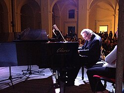

# Luis Bacalov

## Biografía

Luis Enríquez Bacalov (Buenos Aires, Argentina; 30 de agosto de 1933-Roma, Italia; 15 de noviembre de 2017)​ fue un pianista,​ compositor y director de orquesta argentino nacionalizado italiano, famoso por ser el ganador del Premios Óscar por la mejor música original por la banda sonora de la película italiana El cartero en 1996 y por sus bandas sonoras del género spaghetti western como Django, La muerte de un presidente, El oro de los Bravados, His name is King y Gran duelo al amanecer. Aparece acreditado en los álbumes Sabor a Samba de María Creuza, Sábado Pormerigio de Claudio Baglioni y Concertó Grosso de New Trolls

## Estilo musical

Luis Bacalov nació el 30 de agosto de 1933 en San Martín, Provincia de Buenos Aires, Argentina, de una familia de origen de Europa del Este, cuyas tradiciones judías influyeron en su educación, aunque más tarde afirmó que era agnóstico. Comenzó a estudiar piano a los cinco años con el profesor Enrique Barenboim (padre de Daniel Barenboim), y continuó sus estudios con pasión y determinación durante toda su juventud.

## Anécdotas y curiosidades

Luis Enríquez Bacalov (30 de agosto de 1933 - 15 de noviembre de 2017) fue un compositor de cine y director musical argentino (naturalizado italiano). Aprendió música de Enrique Barenboim, padre de Daniel Barenboim, director de las orquestas de Berlín y Chicago, y de Berta Sujovolsky. [ 1 ] Se aventuró en la música para el cine y compuso partituras ahora clásicas para muchas películas de Spaghetti Western. A principios de los años 1970 también colaboró ​​con bandas italianas de rock progresivo. Bacalov fue nominado dos veces al Premio de la Academia a la Mejor Banda Sonora Original, y lo ganó en 1996 por Il Postino. [ 2 ]

## Top 10 bandas sonoras

1. ***Django (Título en España: Django)***
    * **Póster:** [link](061_luis_bacalov/posters/poster_django_1966.jpg)
2. ***Il postino (Título en España: El cartero (y Pablo Neruda))***
    * **Póster:** [link](061_luis_bacalov/posters/poster_il_postino_1994.jpg)
3. ***Si può fare… amigo (Título en España: En el Oeste se puede hacer... amigo)***
    * **Póster:** [link](061_luis_bacalov/posters/poster_si_pu_fare_amigo_1972.jpg)
4. ***Quién sabe? (Título en España: Yo soy la revolución)***
    * **Póster:** [link](061_luis_bacalov/posters/poster_qui_n_sabe_1967.jpg)
5. ***Il vangelo secondo Matteo (Título en España: El evangelio según San Mateo)***
    * **Póster:** [link](061_luis_bacalov/posters/poster_il_vangelo_secondo_matteo_1965.jpg)
6. ***La città delle donne (Título en España: La ciudad de las mujeres)***
    * **Póster:** [link](061_luis_bacalov/posters/poster_la_citt_delle_donne_1980.jpg)
7. ***Milano Calibro 9 (Título en España: Milán, calibre 9)***
    * **Póster:** [link](061_luis_bacalov/posters/poster_milano_calibro_9_1972.jpg)
8. ***Coup de foudre (Título en España: Entre nosotras)***
    * **Póster:** [link](061_luis_bacalov/posters/poster_coup_de_foudre_1983.jpg)
9. ***La tregua (Título en España: La tregua)***
    * **Póster:** [link](061_luis_bacalov/posters/poster_la_tregua_1997.jpg)
10. ***Il boss (Título en España: Secuestro de una mujer)***
    * **Póster:** [link](061_luis_bacalov/posters/poster_il_boss_1973.jpg)

## Filmografía completa

- I due della legione (Título en España: I due della legione) (1962) · [Póster](061_luis_bacalov/posters/poster_i_due_della_legione_1962.jpg)
- Vino, whisky e acqua salata (Título en España: Vino, whisky e acqua salata) (1962) · [Póster](061_luis_bacalov/posters/poster_vino_whisky_e_acqua_salata_1962.jpg)
- La noia (Título en España: El tedio) (1963) · [Póster](061_luis_bacalov/posters/poster_la_noia_1963.jpg)
- Donde tú estés (Título en España: Donde tú estés) (1964) · [Póster](061_luis_bacalov/posters/poster_donde_t_est_s_1964.jpg)
- La congiuntura (Título en España: El millón de dólares) (1964) · [Póster](061_luis_bacalov/posters/poster_la_congiuntura_1964.jpg)
- Extraconiugale (Título en España: Extraconyugal) (1964) · [Póster](061_luis_bacalov/posters/poster_extraconiugale_1964.jpg)
- Il vangelo secondo Matteo (Título en España: El evangelio según San Mateo) (1965) · [Póster](061_luis_bacalov/posters/poster_il_vangelo_secondo_matteo_1965.jpg)
- Oggi, domani, dopodomani (Título en España: Hoy, mañana, pasado mañana) (1965) · [Póster](061_luis_bacalov/posters/poster_oggi_domani_dopodomani_1965.jpg)
- OSS 77 - Operazione fior di loto (Título en España: OSS 77 - Operazione fior di loto) (1965) · [Póster](061_luis_bacalov/posters/poster_oss_77_operazione_fior_di_loto_1965.jpg)
- Questa volta parliamo di uomini (Título en España: Questa volta parliamo di uomini) (1965) · [Póster](061_luis_bacalov/posters/poster_questa_volta_parliamo_di_uomini_1965.jpg)
- Una vergine per il principe (Título en España: Una vergine per il principe) (1965) · [Póster](061_luis_bacalov/posters/poster_una_vergine_per_il_principe_1965.jpg)
- Django (Título en España: Django) (1966) · [Póster](061_luis_bacalov/posters/poster_django_1966.jpg)
- La strega in amore (Título en España: Las diabólicas del amor) (1966) · [Póster](061_luis_bacalov/posters/poster_la_strega_in_amore_1966.jpg)
- Una questione d'onore (Título en España: Una cuestión de honor) (1966) · [Póster](061_luis_bacalov/posters/poster_una_questione_d_onore_1966.jpg)
- A ciascuno il suo (Título en España: A cada uno lo suyo) (1967) · [Póster](061_luis_bacalov/posters/poster_a_ciascuno_il_suo_1967.jpg)
- Lo scatenato (Título en España: El bello Giorgio) (1967) · [Póster](061_luis_bacalov/posters/poster_lo_scatenato_1967.jpg)
- La più grande rapina del west (Título en España: El mayor atraco frustrado del oeste) (1967) · [Póster](061_luis_bacalov/posters/poster_la_pi_grande_rapina_del_west_1967.jpg)
- Questi fantasmi (Título en España: La guapa y su fantasma) (1967) · [Póster](061_luis_bacalov/posters/poster_questi_fantasmi_1967.jpg)
- Sugar Colt (Título en España: Sugar Colt) (1967) · [Póster](061_luis_bacalov/posters/poster_sugar_colt_1967.jpg)
- Quién sabe? (Título en España: Yo soy la revolución) (1967) · [Póster](061_luis_bacalov/posters/poster_qui_n_sabe_1967.jpg)
- A qualsiasi prezzo (Título en España: A cualquier precio) (1968) · [Póster](061_luis_bacalov/posters/poster_a_qualsiasi_prezzo_1968.jpg)
- Rebus (Título en España: El crimen también juega) (1968) · [Póster](061_luis_bacalov/posters/poster_rebus_1968.jpg)
- La pecora nera (Título en España: Yo soy la oveja negra) (1968) · [Póster](061_luis_bacalov/posters/poster_la_pecora_nera_1968.jpg)
- I quattro del pater noster (Título en España: I quattro del pater noster) (1969) · [Póster](061_luis_bacalov/posters/poster_i_quattro_del_pater_noster_1969.jpg)
- L'amica (Título en España: La amiga) (1969) · [Póster](061_luis_bacalov/posters/poster_l_amica_1969.jpg)
- Il prezzo del potere (Título en España: La muerte de un presidente) (1969) · [Póster](061_luis_bacalov/posters/poster_il_prezzo_del_potere_1969.jpg)
- L'oro dei bravados (Título en España: L'oro dei bravados) (1970) · [Póster](061_luis_bacalov/posters/poster_l_oro_dei_bravados_1970.jpg)
- La supertestimone (Título en España: El proxeneta y la testigo) (1971) · [Póster](061_luis_bacalov/posters/poster_la_supertestimone_1971.jpg)
- Roma bene (Título en España: La gran bacanal) (1971) · [Póster](061_luis_bacalov/posters/poster_roma_bene_1971.jpg)
- La vittima designata (Título en España: La víctima designada) (1971) · [Póster](061_luis_bacalov/posters/poster_la_vittima_designata_1971.jpg)
- Lo chiamavano King (Título en España: Lo llamaban King) (1971) · [Póster](061_luis_bacalov/posters/poster_lo_chiamavano_king_1971.jpg)
- Beati i ricchi (Título en España: Beati i ricchi) (1972) · [Póster](061_luis_bacalov/posters/poster_beati_i_ricchi_1972.jpg)
- Si può fare… amigo (Título en España: En el Oeste se puede hacer... amigo) (1972) · [Póster](061_luis_bacalov/posters/poster_si_pu_fare_amigo_1972.jpg)
- Milano Calibro 9 (Título en España: Milán, calibre 9) (1972) · [Póster](061_luis_bacalov/posters/poster_milano_calibro_9_1972.jpg)
- Monta in sella, figlio di...! (Título en España: Repóker de bribones) (1972) · [Póster](061_luis_bacalov/posters/poster_monta_in_sella_figlio_di_1972.jpg)
- Un verano para matar (Título en España: Un verano para matar) (1972) · [Póster](061_luis_bacalov/posters/poster_un_verano_para_matar_1972.jpg)
- Donnez-nous notre amour quotidien (Título en España: El amor nuestro de cada día) (1973) · [Póster](061_luis_bacalov/posters/poster_donnez_nous_notre_amour_quotidien_1973.jpg)
- L'Italia vista dal cielo: Liguria (Título en España: L'Italia vista dal cielo: Liguria) (1973) · [Póster](061_luis_bacalov/posters/poster_l_italia_vista_dal_cielo_liguria_1973.jpg)
- La polizia è al servizio del cittadino? (Título en España: La polizia è al servizio del cittadino?) (1973) · [Póster](061_luis_bacalov/posters/poster_la_polizia_al_servizio_del_cittadino_1973.jpg)
- L'ultima chance (Título en España: La última oportunidad) (1973) · [Póster](061_luis_bacalov/posters/poster_l_ultima_chance_1973.jpg)
- Il boss (Título en España: Secuestro de una mujer) (1973) · [Póster](061_luis_bacalov/posters/poster_il_boss_1973.jpg)
- Un hombre llamado Noon (Título en España: Un hombre llamado Noon) (1973) · [Póster](061_luis_bacalov/posters/poster_un_hombre_llamado_noon_1973.jpg)
- Il poliziotto è marcio (Título en España: Corrupción policial) (1974) · [Póster](061_luis_bacalov/posters/poster_il_poliziotto_marcio_1974.jpg)
- La città sconvolta: caccia spietata ai rapitori (Título en España: Caza Implacable) (1975) · [Póster](061_luis_bacalov/posters/poster_la_citt_sconvolta_caccia_spietata_ai_rapitori_1975.jpg)
- L'uomo che sfidò l'organizzazione (Título en España: El hombre que desafió a la organización) (1975) · [Póster](061_luis_bacalov/posters/poster_l_uomo_che_sfid_l_organizzazione_1975.jpg)
- Colpo in canna (Título en España: La espía se desnuda) (1975) · [Póster](061_luis_bacalov/posters/poster_colpo_in_canna_1975.jpg)
- Colpita da improvviso benessere (Título en España: Colpita da improvviso benessere) (1976) · [Póster](061_luis_bacalov/posters/poster_colpita_da_improvviso_benessere_1976.jpg)
- Il conto è chiuso (Título en España: Cuenta saldada) (1976) · [Póster](061_luis_bacalov/posters/poster_il_conto_chiuso_1976.jpg)
- Gli amici di Nick Hezard (Título en España: Gli amici di Nick Hezard) (1976) · [Póster](061_luis_bacalov/posters/poster_gli_amici_di_nick_hezard_1976.jpg)
- I prosseneti (Título en España: Los proxenetas) (1976) · [Póster](061_luis_bacalov/posters/poster_i_prosseneti_1976.jpg)
- I padroni della città (Título en España: Mister Scarface) (1976) · [Póster](061_luis_bacalov/posters/poster_i_padroni_della_citt_1976.jpg)
- Diamanti sporchi di sangue (Título en España: Diamantes signo de sangre) (1978) · [Póster](061_luis_bacalov/posters/poster_diamanti_sporchi_di_sangue_1978.jpg)
- Improvviso (Título en España: Improvviso) (1979) · [Póster](061_luis_bacalov/posters/poster_improvviso_1979.jpg)
- La città delle donne (Título en España: La ciudad de las mujeres) (1980) · [Póster](061_luis_bacalov/posters/poster_la_citt_delle_donne_1980.jpg)
- Vacanze per un massacro (Título en España: Vacaciones para matar) (1980) · [Póster](061_luis_bacalov/posters/poster_vacanze_per_un_massacro_1980.jpg)
- Roma dalla finestra (Título en España: Roma dalla finestra) (1982) · [Póster](061_luis_bacalov/posters/poster_roma_dalla_finestra_1982.jpg)
- Coup de foudre (Título en España: Entre nosotras) (1983) · [Póster](061_luis_bacalov/posters/poster_coup_de_foudre_1983.jpg)
- Un caso d'incoscienza (Título en España: Un caso d'incoscienza) (1985) · [Póster](061_luis_bacalov/posters/poster_un_caso_d_incoscienza_1985.jpg)
- The Legendary Life of Ernest Hemingway (Título en España: Hemingway, fiesta y muerte) (1988) · [Póster](061_luis_bacalov/posters/poster_the_legendary_life_of_ernest_hemingway_1988.jpg)
- La maschera (Título en España: La maschera) (1988) · [Póster](061_luis_bacalov/posters/poster_la_maschera_1988.jpg)
- La bahía esmeralda (Título en España: La bahía esmeralda) (1989) · [Póster](061_luis_bacalov/posters/poster_la_bah_a_esmeralda_1989.jpg)
- Una storia semplice (Título en España: Una storia semplice) (1991) · [Póster](061_luis_bacalov/posters/poster_una_storia_semplice_1991.jpg)
- Il postino (Título en España: El cartero (y Pablo Neruda)) (1994) · [Póster](061_luis_bacalov/posters/poster_il_postino_1994.jpg)
- Ilona llega con la lluvia (Título en España: Ilona llega con la lluvia) (1996) · [Póster](061_luis_bacalov/posters/poster_ilona_llega_con_la_lluvia_1996.jpg)
- Mi fai un favore (Título en España: Mi fai un favore) (1996) · [Póster](061_luis_bacalov/posters/poster_mi_fai_un_favore_1996.jpg)
- La tregua (Título en España: La tregua) (1997) · [Póster](061_luis_bacalov/posters/poster_la_tregua_1997.jpg)
- B. Monkey (Título en España: B. Monkey) (1999) · [Póster](061_luis_bacalov/posters/poster_b_monkey_1999.jpg)
- The Love Letter (Título en España: Carta de amor) (1999) · [Póster](061_luis_bacalov/posters/poster_the_love_letter_1999.jpg)
- Les Enfants du Siècle (Título en España: Confesiones íntimas de una mujer) (1999) · [Póster](061_luis_bacalov/posters/poster_les_enfants_du_si_cle_1999.jpg)
- Secret of the Andes (Título en España: Secret of the Andes) (1999) · [Póster](061_luis_bacalov/posters/poster_secret_of_the_andes_1999.jpg)
- Panni sporchi (Título en España: Trapos sucios) (1999) · [Póster](061_luis_bacalov/posters/poster_panni_sporchi_1999.jpg)
- It Had to Be You (Título en España: Tenías que ser tú) (2000) · [Póster](061_luis_bacalov/posters/poster_it_had_to_be_you_2000.jpg)
- Woman on Top (Título en España: Woman on Top) (2000) · [Póster](061_luis_bacalov/posters/poster_woman_on_top_2000.jpg)
- Il consiglio d'Egitto (Título en España: Il consiglio d'Egitto) (2002) · [Póster](061_luis_bacalov/posters/poster_il_consiglio_d_egitto_2002.jpg)
- Assassination Tango (Título en España: Assassination Tango) (2003) · [Póster](061_luis_bacalov/posters/poster_assassination_tango_2003.jpg)
- Calibro 9 (Título en España: Calibro 9) (2004) · [Póster](061_luis_bacalov/posters/poster_calibro_9_2004.jpg)
- The Dust Factory (Título en España: The Dust Factory) (2004) · [Póster](061_luis_bacalov/posters/poster_the_dust_factory_2004.jpg)
- Sea of Dreams (Título en España: Sea of Dreams) (2006) · [Póster](061_luis_bacalov/posters/poster_sea_of_dreams_2006.jpg)
- Тихий Дон (Título en España: Тихий Дон) (2006) · [Póster](061_luis_bacalov/posters/poster_poster_2006.jpg)
- Elsa & Fred (Título en España: Elsa & Fred) (2014) · [Póster](061_luis_bacalov/posters/poster_elsa_fred_2014.jpg)
- Born in the U.S.E. - Nato negli Stati Uniti d'Europa (Título en España: Born in the U.S.E. - Nato negli Stati Uniti d'Europa) (2015) · [Póster](061_luis_bacalov/posters/poster_born_in_the_u_s_e_nato_negli_stati_uniti_d_europa_2015.jpg)

## Premios y nominaciones

* 1967 – Premio de la Academia a la mejor banda sonora, adaptación o tratamiento – por *Il vangelo secondo Matteo (Título en España: El evangelio según San Mateo)* – (Nominación)
* 1996 – Premio de la Academia a la mejor banda sonora dramática original – por *Il postino (Título en España: El cartero (y Pablo Neruda))* – (Ganador)
* 1996 – Premio de la Academia a la mejor banda sonora dramática original – por *Il postino (Título en España: El cartero (y Pablo Neruda))* – (Nominación)

## Fuentes adicionales

* [MundoBSO](https://www.mundobso.com/autor) — site:mundobso.com
* [MundoBSO (2)](https://w.mundobso.com/bso/cartero-siempre-llama-dos-veces-el) — site:mundobso.com
* [MundoBSO (3)](https://www.mundobso.com/bso/milla-verde-la) — site:mundobso.com
* [Film Score Monthly](https://www.filmscoremonthly.com/backissues/viewissue.cfm?issueID=60) — site:filmscoremonthly.com
* [Film Score Monthly (2)](https://www.filmscoremonthly.com/daily/article.cfm/articleID/8236/Film-Score-Friday-53124/) — site:filmscoremonthly.com
* [Film Score Monthly (3)](https://filmscoremonthly.com/board/posts.cfm?threadID=50259&forumID=1&archive=0) — site:filmscoremonthly.com
* [SoundtrackCollector](https://www.soundtrackcollector.com/title/6927/Django) — site:soundtrackcollector.com
* [SoundtrackCollector (2)](https://www.soundtrackcollector.com) — site:soundtrackcollector.com
* [SoundtrackCollector (3)](https://www.soundtrackcollector.com/title/22692/Milano+Calibro+9) — site:soundtrackcollector.com
* [WhatSong](https://www.whatsong.org/movie/kill-bill-vol-1) — site:whatsong.org
* [WhatSong (2)](https://www.whatsong.org/movie/django-unchained) — site:whatsong.org
* [WhatSong (3)](https://www.whatsong.org/tvshow/how-i-met-your-mother/episode/44483) — site:whatsong.org

## Notas externas

* MundoBSO: Conrado Xalabarder (Barcelona, 1964) es especialista en música de cine y autor de varios libros, entre ellos Enciclopedia de las Bandas Sonoras, Música de cine: Una ilusión óptica y El Guion Musical en el Cine, así como ha participado en varios libros colectivos. Colabora desde 1996 en Fotogramas, la revista de cine de mayor difusión en España, escribiendo comentarios sobre bandas sonoras, y también en su sitio web. Ha escrito sobre el tema en El Periódico de Catalunya y en la revista de la Academia de las Artes y las Ciencias Cinematográficas de España y numerosos artículos para distintos periódicos y revistas.
* MundoBSO (3): Compositor: Newman, Thomas Sello: Warner Duración: 66 minutos Información de la película Título original: The Green Mile Director: Frank Darabont Nacionalidad: EE UU Año: 1999 Argumento A mediados de los años treinta, un guarda de prisiones que custodia a los condenados a muerte descubre poderes sobrenaturales en un inmenso hombre negro, acusado de haber asesinado a dos niñas. Eso le llevará a creer en su inocencia. Premios Saturn: 1 nominación Compositor: Newman, Thomas Sello: Warner Duración: 66 minutos
* SoundtrackCollector (2): 14 de enero - Confesión de un comisionado de policía de Riz Ortolani a la fiscalía 3 de diciembre - Wolf Hall de Debbie Wiseman: El espejo y la luz
* WhatSong: Vivica Fox abre la puerta y "La novia" está del otro lado Nancy Sinatra - Kill Bill, Vol. 1 (banda sonora original)
* WhatSong (2): Luis Bacalov - Django Unchained de Quentin Tarantino Banda sonora original de la película (versión editada) Luis Bacalov y Rocky Roberts - Django Unchained (Banda sonora original de la película)
* WhatSong (3): Lily y Robin bailan con los dos nerds del último año de secundaria. Se reproduce de fondo cuando Lilly, Robin y Barney intentan entrar a la fiesta. La canción es una canción que está incluida en iMovie.
* luisbacalov.com: Sitio Oficial de Luis Bacalov administrado por los Herederos Bacalov. Producción artística y Fotos. Búsqueda de palabras clave en el archivo luisbacalov.com. DISCLAIMER Nace en San Martín, provincia de Buenos Aires, Argentina, el 30 de agosto de 1933 de una familia de origen de Europa del Este cuya tradición hebrea lo influyó en su formación, aunque declarará, en la edad adulta, su agnosticismo. Comienza sus estudios de piano a la edad de cinco años con el profesor Enrique Barenboim (padre de Daniel) y desde ese momento continúa sus estudios con pasión y determinación durante toda su juventud.
* luisbacalov.com: Sitio Oficial Luis Bacalov administrado por los Herederos Bacalov. Producción Artística y Galería de fotos. Búsqueda de palabras clave en el archivo luisbacalov.com. DESCARGO DE RESPONSABILIDAD
* luisbacalov.com: Sitio Oficial Luis Bacalov administrado por los Herederos Bacalov. Producción Artística y Galería de fotos. Búsqueda de palabras clave en el archivo luisbacalov.com. DESCARGO DE RESPONSABILIDAD Luis Bacalov nació el 30 de agosto de 1933 en San Martín, Provincia de Buenos Aires, Argentina, de una familia de origen de Europa del Este, cuyas tradiciones judías influyeron en su educación, aunque más tarde afirmó que era agnóstico. Comenzó a estudiar piano a los cinco años con el profesor Enrique Barenboim (padre de Daniel Barenboim), y continuó sus estudios con pasión y determinación durante toda su juventud.
* www.opvorchestra.it: Luis Bacalov, nacido en Buenos Aires, inició su educación musical a los cinco años, estudiando piano con Enrique Baremboim, continuando luego con Berta Sujovolsky (alumna de Artur Schnabel). Pronto inició su actividad concertística en Argentina como solista y en dúo con el violinista Alberto Lisy así como en grupos de música de cámara. Investiga el folklore musical de diversas naciones sudamericanas, trabajando en esta disciplina para la Radio y Televisión de Colombia, donde también da a conocer, como intérprete, la producción pianística de las Américas de los siglos XIX y XX. En Italia y Francia, a partir de los años 1960, estuvo muy activo como compositor de...
* www.choralarts-newengland.org: Acerca de nosotros Acerca de nosotros Historia de las artes corales Nueva Inglaterra Alfred Nash Patterson Lifetime Achievement Award Jane Ring Frank (2025) Dr. Andre de Quadros (2024) Peter Bagley (2022) John Finney (2020–21) Marguerite Brooks (2019) Gwyneth Walker (2018) Johanna Hill Simpson (2017) Joshua Jacobson (2016) Ann Howard Jones (2015) Gerald R. Mack (2014) E. Wayne Abercrombie (2013) Sonja Dahlgren Pryor (2012) John Oliver (2011) Jameson Marvin (2010) Richard Coffey (2009) David Hoose (2008) Craig Smith (2007) Robert De Cormier (2006) Donald Teeters (2005) Alice Parker (2004) John Bavicchi (2003) Roberta Humez (2002) Mary Whitney Rowe (2001) Artes Corales N.E. Comisiones y Estrenos Junta Directiva Contacto...
* www.rottentomatoes.com: -- The Great American Baking Show: Celebrity Big Game: Temporada 2 80% Bridgerton: Temporada 4 Enlace a Bridgerton: Temporada 4
