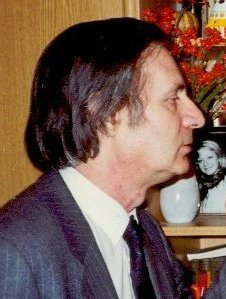

# Alfred Schnittke

## Biografía

Alfred Gárievich Schnittke (ruso: Альфре́д Га́рриевич Шни́тке; Enguels, 24 de noviembre de 1934-Hamburgo, 3 de agosto de 1998) fue un prolífico compositor soviético y alemán, que vivió sus últimos años en Alemania. Es considerado uno de los más importantes músicos tardosoviéticos.

## Estilo musical

La música antigua de Schnittke muestra la fuerte influencia de Dmitri Shostakovich. [ 8 ] Desarrolló una técnica poliestilística en obras como la épica Sinfonía n.° 1 (1969-1972) y su primer concierto grosso (1977). En la década de 1980, la música de Schnittke comenzó a ser más conocida en el extranjero con la publicación de su segundo (1980) y tercer (1983) cuartetos de cuerda y el String Trio (1985); el ballet Peer Gynt (1985-1987); la tercera (1981), cuarta (1984) y quinta (1988) sinfonías; y el concierto para viola (1985) y el primer concierto para violonchelo (1985-1986). A medida que su salud se deterioraba, la música de Schnittke comenzó a abandonar gran parte de la extroversión de su poliestilismo y se retiró a un estilo más retraído y sombrío. [ 9 ]

## Anécdotas y curiosidades

1 Biografía Alternar subsección de biografía 1.1 Vida temprana 1.2 Carrera 1.3 Mala salud y muerte

Compositor: Newman, Thomas Sello: Warner Duración: 66 minutos Información de la película Título original: The Green Mile Director: Frank Darabont Nacionalidad: EE UU Año: 1999 Argumento A mediados de los años treinta, un guarda de prisiones que custodia a los condenados a muerte descubre poderes sobrenaturales en un inmenso hombre negro, acusado de haber asesinado a dos niñas. Eso le llevará a creer en su inocencia. Premios Saturn: 1 nominación Compositor: Newman, Thomas Sello: Warner Duración: 66 minutos

## Top 10 bandas sonoras

1. ***Восхождение (Título en España: La ascensión)***
    * **Póster:** [link](062_alfred_schnittke/posters/poster_poster_1977.jpg)
2. ***Посетитель музея (Título en España: Visitante del museo)***
    * **Póster:** [link](062_alfred_schnittke/posters/poster_poster_1989.jpg)
3. ***Экипаж (Título en España: Aeropuerto en llamas)***
    * **Póster:** [link](062_alfred_schnittke/posters/poster_poster_1980.jpg)
4. ***Quattro Strade (Título en España: Quattro Strade)***
    * **Póster:** [link](062_alfred_schnittke/posters/poster_quattro_strade_2021.jpg)
5. ***Агония (Título en España: Agonía: La vida y muerte de Rasputín)***
    * **Póster:** [link](062_alfred_schnittke/posters/poster_poster_1981.jpg)
6. ***Шестое июля (Título en España: Шестое июля)***
    * **Póster:** [link](062_alfred_schnittke/posters/poster_poster_1968.jpg)
7. ***Комиссар (Título en España: La comisaria)***
    * **Póster:** [link](062_alfred_schnittke/posters/poster_poster_1967.jpg)
8. ***Белорусский вокзал (Título en España: Белорусский вокзал)***
    * **Póster:** [link](062_alfred_schnittke/posters/poster_poster_1971.jpg)
9. ***Дядя Ваня (Título en España: Tío Vania)***
    * **Póster:** [link](062_alfred_schnittke/posters/poster_poster_1970.jpg)
10. ***Горячий снег (Título en España: Nieve ardiente)***
    * **Póster:** [link](062_alfred_schnittke/posters/poster_poster_1972.jpg)

## Filmografía completa

- Вступление (Título en España: Вступление) (1962) · [Póster](062_alfred_schnittke/posters/poster_poster_1962.jpg)
- Дневные звезды (Título en España: Дневные звезды) (1966) · [Póster](062_alfred_schnittke/posters/poster_poster_1966.jpg)
- Похождения зубного врача (Título en España: Aventuras de un dentista) (1967) · [Póster](062_alfred_schnittke/posters/poster_poster_1967.jpg)
- Комиссар (Título en España: La comisaria) (1967) · [Póster](062_alfred_schnittke/posters/poster_poster_1967.jpg)
- Начало неведомого века (Título en España: Начало неведомого века) (1967) · [Póster](062_alfred_schnittke/posters/poster_poster_1967.jpg)
- Дом и хозяин (Título en España: Дом и хозяин) (1968) · [Póster](062_alfred_schnittke/posters/poster_poster_1968.jpg)
- Шестое июля (Título en España: Шестое июля) (1968) · [Póster](062_alfred_schnittke/posters/poster_poster_1968.jpg)
- Вальс (Título en España: Вальс) (1969) · [Póster](062_alfred_schnittke/posters/poster_poster_1969.jpg)
- Вызываем огонь на себя (Título en España: Вызываем огонь на себя) (1969) · [Póster](062_alfred_schnittke/posters/poster_poster_1969.jpg)
- Sport, Sport, Sport (Título en España: Sport, Sport, Sport) (1970) · [Póster](062_alfred_schnittke/posters/poster_sport_sport_sport_1970.jpg)
- Дядя Ваня (Título en España: Tío Vania) (1970) · [Póster](062_alfred_schnittke/posters/poster_poster_1970.jpg)
- Чайка (Título en España: Чайка) (1970) · [Póster](062_alfred_schnittke/posters/poster_poster_1970.jpg)
- Белорусский вокзал (Título en España: Белорусский вокзал) (1971) · [Póster](062_alfred_schnittke/posters/poster_poster_1971.jpg)
- Ты и я (Título en España: Ты и я) (1971) · [Póster](062_alfred_schnittke/posters/poster_poster_1971.jpg)
- Горячий снег (Título en España: Nieve ardiente) (1972) · [Póster](062_alfred_schnittke/posters/poster_poster_1972.jpg)
- Право на прыжок (Título en España: Право на прыжок) (1973) · [Póster](062_alfred_schnittke/posters/poster_poster_1973.jpg)
- Осень (Título en España: Осень) (1974) · [Póster](062_alfred_schnittke/posters/poster_poster_1974.jpg)
- Таня (Título en España: Таня) (1974) · [Póster](062_alfred_schnittke/posters/poster_poster_1974.jpg)
- Выбор цели (Título en España: Выбор цели) (1975) · [Póster](062_alfred_schnittke/posters/poster_poster_1975.jpg)
- Белый пароход (Título en España: Белый пароход) (1976) · [Póster](062_alfred_schnittke/posters/poster_poster_1976.jpg)
- Приключения Травки (Título en España: Приключения Травки) (1976) · [Póster](062_alfred_schnittke/posters/poster_poster_1976.jpg)
- Рикки-Тикки-Тави (Título en España: Рикки-Тикки-Тави) (1976) · [Póster](062_alfred_schnittke/posters/poster_poster_1976.jpg)
- Сказ про то, как царь Пётр арапа женил (Título en España: Сказ про то, как царь Пётр арапа женил) (1976) · [Póster](062_alfred_schnittke/posters/poster_poster_1976.jpg)
- Восхождение (Título en España: La ascensión) (1977) · [Póster](062_alfred_schnittke/posters/poster_poster_1977.jpg)
- Капитанская дочка (Título en España: Капитанская дочка) (1978) · [Póster](062_alfred_schnittke/posters/poster_poster_1978.jpg)
- Отец Сергий (Título en España: Отец Сергий) (1978) · [Póster](062_alfred_schnittke/posters/poster_poster_1978.jpg)
- Экипаж (Título en España: Aeropuerto en llamas) (1980) · [Póster](062_alfred_schnittke/posters/poster_poster_1980.jpg)
- Маленькие трагедии (Título en España: Маленькие трагедии) (1980) · [Póster](062_alfred_schnittke/posters/poster_poster_1980.jpg)
- Агония (Título en España: Agonía: La vida y muerte de Rasputín) (1981) · [Póster](062_alfred_schnittke/posters/poster_poster_1981.jpg)
- Фантазии Фарятьева (Título en España: Фантазии Фарятьева) (1982) · [Póster](062_alfred_schnittke/posters/poster_poster_1982.jpg)
- Прощание (Título en España: Adiós a Matiora) (1983) · [Póster](062_alfred_schnittke/posters/poster_poster_1983.jpg)
- Сказка странствий (Título en España: Сказка странствий) (1983) · [Póster](062_alfred_schnittke/posters/poster_poster_1983.jpg)
- ...А это случилось в Виши (Título en España: ...А это случилось в Виши) (1989) · [Póster](062_alfred_schnittke/posters/poster_poster_1989.jpg)
- Посетитель музея (Título en España: Visitante del museo) (1989) · [Póster](062_alfred_schnittke/posters/poster_poster_1989.jpg)
- Я, немецкий композитор из России... Монолог Альфреда Шнитке (Título en España: Я, немецкий композитор из России... Монолог Альфреда Шнитке) (1990) · [Póster](062_alfred_schnittke/posters/poster_poster_1990.jpg)
- Адам и Ева. Освобождение от первородного греха (Título en España: Адам и Ева. Освобождение от первородного греха) (1997) · [Póster](062_alfred_schnittke/posters/poster_poster_1997.jpg)
- Небо. Последний сон (Título en España: Небо. Последний сон) (1997) · [Póster](062_alfred_schnittke/posters/poster_poster_1997.jpg)
- Der neunte Tag (Título en España: El noveno día) (2004) · [Póster](062_alfred_schnittke/posters/poster_der_neunte_tag_2004.jpg)
- Мастер и Маргарита (Título en España: Мастер и Маргарита) (2006) · [Póster](062_alfred_schnittke/posters/poster_poster_2006.jpg)
- Дом Марии (Título en España: Дом Марии) (2014) · [Póster](062_alfred_schnittke/posters/poster_poster_2014.jpg)
- Б-1 (Título en España: Б-1) (2018) · [Póster](062_alfred_schnittke/posters/poster_1_2018.jpg)
- Quattro Strade (Título en España: Quattro Strade) (2021) · [Póster](062_alfred_schnittke/posters/poster_quattro_strade_2021.jpg)
- Sanatorium Under the Sign of the Hourglass (Título en España: Sanatorium Under the Sign of the Hourglass) (2025) · [Póster](062_alfred_schnittke/posters/poster_sanatorium_under_the_sign_of_the_hourglass_2025.jpg)

## Premios y nominaciones

* 1986 – N.K. Premio estatal de Krupskaya – (Ganador)
* 1992 – Premio Bach de la Ciudad Libre y Hanseática de Hamburgo – (Ganador)
* 1992 – premio imperial – (Ganador)
* 1995 – Condecoración austriaca para la ciencia y el arte – (Ganador)
* 1995 – Premio Estatal de la Federación Rusa – (Ganador)
* Cruz de Caballero Comendador de la Orden del Mérito de la República Federal de Alemania – (Ganador)
* Honrado trabajador del arte de la República Socialista Federativa Soviética de Rusia – (Ganador)

## Fuentes adicionales

* [MundoBSO](https://www.mundobso.com/bso/milla-verde-la) — site:mundobso.com
* [MundoBSO (2)](https://w.mundobso.com/bso/cartero-siempre-llama-dos-veces-el) — site:mundobso.com
* [MundoBSO (3)](https://www.mundobso.com/bso/frozen-el-reino-del-hielo) — site:mundobso.com
* [Film Score Monthly](https://www.filmscoremonthly.com/board/posts.cfm?threadID=126678&forumID=1&archive=0) — site:filmscoremonthly.com
* [Film Score Monthly (2)](https://filmscoremonthly.com/cds/list.cfm?sortby=r&sortdir=1) — site:filmscoremonthly.com
* [Film Score Monthly (3)](https://www.filmscoremonthly.com/resources/calendar.cfm?calmonth=8) — site:filmscoremonthly.com
* [SoundtrackCollector](https://www.soundtrackcollector.com/title/107858/Alfred+Schnittke:+Film+Music+Edition) — site:soundtrackcollector.com
* [SoundtrackCollector (2)](https://www.soundtrackcollector.com/title/87838/Alfred+Schnittke+-+Film+Music+Vol.+IV) — site:soundtrackcollector.com
* [SoundtrackCollector (3)](https://soundtrackcollector.com) — site:soundtrackcollector.com
* [WhatSong](https://www.whatsong.org/tvshow/how-i-met-your-mother/episode/44483) — site:whatsong.org
* [WhatSong (2)](https://www.whatsong.org/tvshow/the-mick/season-2) — site:whatsong.org
* [WhatSong (3)](https://www.whatsong.org/movie/rocky-iv) — site:whatsong.org

## Notas externas

* MundoBSO: Compositor: Newman, Thomas Sello: Warner Duración: 66 minutos Información de la película Título original: The Green Mile Director: Frank Darabont Nacionalidad: EE UU Año: 1999 Argumento A mediados de los años treinta, un guarda de prisiones que custodia a los condenados a muerte descubre poderes sobrenaturales en un inmenso hombre negro, acusado de haber asesinado a dos niñas. Eso le llevará a creer en su inocencia. Premios Saturn: 1 nominación Compositor: Newman, Thomas Sello: Warner Duración: 66 minutos
* MundoBSO (3): Compositores: Beck, Christophe | Lopez, Robert Sello: Disney Duración: 98 minutos Título original: Frozen Director: Chris Buck, Jennifer Lee Nacionalidad: EE UU Año: 2013
* Film Score Monthly (2): FSM HOME FilmScoreDaily FilmScoreFriday The Aisle Seat LukasKendall.com TABLERO DE MENSAJES Discusión general Puesto comercial Discusión sobre partituras no cinematográficas
* WhatSong: Lily y Robin bailan con los dos nerds del último año de secundaria. Se reproduce de fondo cuando Lilly, Robin y Barney intentan entrar a la fiesta. La canción es una canción que está incluida en iMovie.
* WhatSong (2): La mejor fuente en línea de música de películas y televisión. Copyright © 2018 - 2026 Whatsong.org. Reservados todos los derechos.
* WhatSong (3): Gladys Knight, Kenny Loggins - Rocky IV (Banda sonora original de la película) Gladys Knight - Rocky IV (Banda sonora original de la película)
* therestisnoise.com: Si supieras poco de Alfred Schnittke o su música, podrías decir que está de moda, a la moda, a la moda. Es una suposición comprensible, dada la actual avalancha de actuaciones de Schnittke: el estreno mundial de su Sinfonía n.º 7 esta noche por la Filarmónica de Nueva York, los estrenos estadounidenses la semana pasada de su Sonata para piano n.º 2 de Boris Berman y su Sinfonía n.º 6 de la Orquesta Sinfónica Nacional, y una próxima interpretación de su "Fausto Cantata" por la Orquesta Sinfónica Americana. Otros trabajos recientes se están apresurando a grabar. Desde Britten, ningún compositor vivo ha recibido este tipo de atención. Pero el hombre que se sentó pacientemente durante una entrevista en el Hotel Watergate en...
* trptk.com: Formatos Descargas de alta resolución Descargas de audio espacial Descargas de vídeo CD y SACD Mercancía de vinilo Géneros Música antigua (< 1600) Barroca (1600-1750) Clásica (1750-1830) Romántica (1830-1920) Contemporánea (> 1920)
* www.britannica.com: Nuestros editores revisarán lo que ha enviado y determinarán si deben revisar el artículo. Alfred Schnittke (nacido el 24 de noviembre de 1934 en Engels, República Socialista Soviética Autónoma Alemana del Volga [ahora en el óblast de Saratov, Rusia]; fallecido el 3 de agosto de 1998 en Hamburgo, Alemania) fue un compositor ruso posmodernista que creó obras musicales serias y de tonos oscuros caracterizadas por yuxtaposiciones abruptas de estilos radicalmente diferentes, a menudo contradictorios, un enfoque que llegó a conocerse como “poliestilismo”.
* www.ars-classical.com: Nacido casi treinta años después de su homólogo ruso, Dimitri Shostakovich, Schnittke es considerado por el mundo musical como su sucesor natural. Heredero de Prokofiev y de la escuela serial, Schnittke evolucionará hacia un lenguaje poliestilístico. Muy comprometido espiritualmente, destaca en el campo de la música de cámara, con un gusto muy pronunciado por el violín. Alfred Schnittke nació en Engels, en el distrito de Saratov, el 24 de noviembre de 1934. Su padre, un periodista-intérprete de familia judía originaria de Rusia, y su madre, una alemana del Volga nacida en Rusia, le hicieron iniciar su educación musical en 1946 en Viena con el estudio del piano. En 1948 todo...
* schnittke.org: El padre de Schnittke, Harry Viktorovich Schnittke (1914-1975), era judío y nació en Frankfurt. Se mudó a la Unión Soviética en 1927 y trabajó como periodista y traductor del idioma ruso al alemán. Su madre, Maria Iosifovna Schnittke (de soltera Vogel, 1910-1972), era una alemana del Volga nacida en Rusia. La abuela paterna de Schnittke, Tea Abramovna Katz (1889-1970), fue filóloga, traductora y editora de literatura en lengua alemana. Alfred Schnittke nació en Engels, en la República Volga-Alemana de la RSFS de Rusia. Comenzó su educación musical en 1946 en Viena, donde había estado destinado su padre. Fue en Viena, escribe el biógrafo de Schnittke, Alexander Ivashkin, donde "él...
* interlude.hk: Interludio Conozca a nuestros colaboradores Acerca de Joanna Latala Acerca de The Sokolover Acerca de Bruce Robinson Acerca de Siri Livingston Acerca de Emily E. Hogstad Acerca de Hermione Lai Acerca de Fanny Po Sim Head Acerca de Philip Eisenbeiss Acerca de Frances Wilson Acerca de Frank Xu Acerca de Serenade Acerca de Rudolph Tang Acerca de Guy Francis Acerca de Anson Yeung Acerca de Rob J Kennedy Acerca de Chris Lloyd Acerca de Doug Thomas Acerca de Maureen Buja Acerca de William Cole Acerca de Desiree Ho Acerca de Janet Horvath Acerca de Jenny Lee Acerca de Marco Moraes Acerca de Oliver Pashley Acerca de Georg Predota Acerca de Ellen Wong Tso Acerca de Nicolette Wong Acerca de Ursula Rehn Wolfman Conozca a nuestros colaboradores Acerca de Joanna Latala Acerca de The Sokolover Acerca de Bruce Robinson Acerca de Siri Livingston Acerca de...
