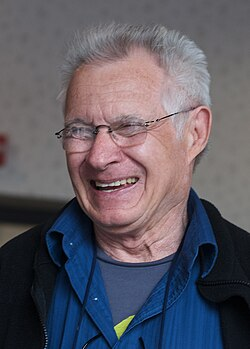

# Dave Grusin

## Biografía

Robert David Grusin, más conocido como Dave Grusin (Littleton, Colorado, 26 de junio de 1934), es un pianista, arreglista y compositor estadounidense de jazz y jazz fusión.

## Estilo musical

Robert David Grusin (nacido el 26 de junio de 1934) es un compositor, arreglista, productor, pianista de jazz y líder de banda estadounidense. Ha compuesto numerosas partituras para largometrajes y televisión y ha ganado numerosos premios por su banda sonora y trabajo discográfico, incluido un Premio de la Academia y 10 premios Grammy. Grusin también fue un colaborador frecuente del director Sydney Pollack, componiendo la música de muchas de sus películas como Three Days of the Condor (1975), Absence of Malice (1981), Tootsie (1982), The Firm (1993) y Random Hearts (1999). En 1978, Grusin fundó GRP Records con Larry Rosen y fue uno de los pioneros de la grabación digital. [ 1 ] [ 3 ] [ 4 ]

## Anécdotas y curiosidades

Robert David Grusin (nacido el 26 de junio de 1934) es un compositor, arreglista, productor, pianista de jazz y líder de banda estadounidense. Ha compuesto numerosas partituras para largometrajes y televisión y ha ganado numerosos premios por su banda sonora y trabajo discográfico, incluido un Premio de la Academia y 10 premios Grammy. Grusin también fue un colaborador frecuente del director Sydney Pollack, componiendo la música de muchas de sus películas como Three Days of the Condor (1975), Absence of Malice (1981), Tootsie (1982), The Firm (1993) y Random Hearts (1999). En 1978, Grusin fundó GRP Records con Larry Rosen y fue uno de los pioneros de la grabación digital. [ 1 ] [ 3 ] [ 4 ]

## Top 10 bandas sonoras

1. ***The Firm (Título en España: La tapadera)***
    * **Póster:** [link](063_dave_grusin/posters/poster_the_firm_1993.jpg)
2. ***Heaven Can Wait (Título en España: El cielo puede esperar)***
    * **Póster:** [link](063_dave_grusin/posters/poster_heaven_can_wait_1978.jpg)
3. ***On Golden Pond (Título en España: En el estanque dorado)***
    * **Póster:** [link](063_dave_grusin/posters/poster_on_golden_pond_1981.jpg)
4. ***The Fabulous Baker Boys (Título en España: Los fabulosos Baker Boys)***
    * **Póster:** [link](063_dave_grusin/posters/poster_the_fabulous_baker_boys_1989.jpg)
5. ***The Champ (Título en España: Campeón)***
    * **Póster:** [link](063_dave_grusin/posters/poster_the_champ_1979.jpg)
6. ***Havana (Título en España: Habana)***
    * **Póster:** [link](063_dave_grusin/posters/poster_havana_1990.jpg)
7. ***The Milagro Beanfield War (Título en España: Un lugar llamado Milagro)***
    * **Póster:** [link](063_dave_grusin/posters/poster_the_milagro_beanfield_war_1988.jpg)
8. ***The Goonies (Título en España: Los Goonies)***
    * **Póster:** [link](063_dave_grusin/posters/poster_the_goonies_1985.jpg)
9. ***Tootsie (Título en España: Tootsie)***
    * **Póster:** [link](063_dave_grusin/posters/poster_tootsie_1982.jpg)

## Filmografía completa

- Divorce American Style (Título en España: El novio de mi mujer) (1967) · [Póster](063_dave_grusin/posters/poster_divorce_american_style_1967.jpg)
- Waterhole #3 (Título en España: El oeste loco) (1967) · [Póster](063_dave_grusin/posters/poster_waterhole_3_1967.jpg)
- The Scorpio Letters (Título en España: The Scorpio Letters) (1967) · [Póster](063_dave_grusin/posters/poster_the_scorpio_letters_1967.jpg)
- Where Were You When the Lights Went Out? (Título en España: Anoche cuando se apagó la luz) (1968) · [Póster](063_dave_grusin/posters/poster_where_were_you_when_the_lights_went_out_1968.jpg)
- Candy (Título en España: Candy) (1968) · [Póster](063_dave_grusin/posters/poster_candy_1968.jpg)
- The Heart Is a Lonely Hunter (Título en España: El corazón es un cazador solitario) (1968) · [Póster](063_dave_grusin/posters/poster_the_heart_is_a_lonely_hunter_1968.jpg)
- Prescription: Murder (Título en España: Receta: Asesinato) (1968) · [Póster](063_dave_grusin/posters/poster_prescription_murder_1968.jpg)
- Generation (Título en España: Generación Rebelde) (1969) · [Póster](063_dave_grusin/posters/poster_generation_1969.jpg)
- Adam at Six A.M. (Título en España: Adam a las 6 de la madrugada) (1970) · [Póster](063_dave_grusin/posters/poster_adam_at_six_a_m_1970.jpg)
- Halls of Anger (Título en España: Odio en las aulas) (1970) · [Póster](063_dave_grusin/posters/poster_halls_of_anger_1970.jpg)
- A Howling in the Woods (Título en España: A Howling in the Woods) (1971) · [Póster](063_dave_grusin/posters/poster_a_howling_in_the_woods_1971.jpg)
- The Gang That Couldn't Shoot Straight (Título en España: Casi, casi una mafia) (1971) · [Póster](063_dave_grusin/posters/poster_the_gang_that_couldn_t_shoot_straight_1971.jpg)
- The Forgotten Man (Título en España: El hombre olvidado) (1971) · [Póster](063_dave_grusin/posters/poster_the_forgotten_man_1971.jpg)
- Sarge: The Badge or the Cross (Título en España: Sarge: The Badge or the Cross) (1971) · [Póster](063_dave_grusin/posters/poster_sarge_the_badge_or_the_cross_1971.jpg)
- The Pursuit of Happiness (Título en España: The Pursuit of Happiness) (1971) · [Póster](063_dave_grusin/posters/poster_the_pursuit_of_happiness_1971.jpg)
- Fuzz (Título en España: El turbulento Distrito 87) (1972) · [Póster](063_dave_grusin/posters/poster_fuzz_1972.jpg)
- The Great Northfield Minnesota Raid (Título en España: Sin ley ni esperanza) (1972) · [Póster](063_dave_grusin/posters/poster_the_great_northfield_minnesota_raid_1972.jpg)
- The Family Rico (Título en España: The Family Rico) (1972) · [Póster](063_dave_grusin/posters/poster_the_family_rico_1972.jpg)
- Amanda Fallon (Título en España: Amanda Fallon) (1973) · [Póster](063_dave_grusin/posters/poster_amanda_fallon_1973.jpg)
- The Friends of Eddie Coyle (Título en España: El confidente) (1973) · [Póster](063_dave_grusin/posters/poster_the_friends_of_eddie_coyle_1973.jpg)
- The Midnight Man (Título en España: El hombre de la medianoche) (1974) · [Póster](063_dave_grusin/posters/poster_the_midnight_man_1974.jpg)
- The Yakuza (Título en España: Yakuza) (1974) · [Póster](063_dave_grusin/posters/poster_the_yakuza_1974.jpg)
- Three Days of the Condor (Título en España: Los tres días del Cóndor) (1975) · [Póster](063_dave_grusin/posters/poster_three_days_of_the_condor_1975.jpg)
- The Nickel Ride (Título en España: The Nickel Ride) (1975) · [Póster](063_dave_grusin/posters/poster_the_nickel_ride_1975.jpg)
- W.W. and the Dixie Dancekings (Título en España: W.W. and the Dixie Dancekings) (1975) · [Póster](063_dave_grusin/posters/poster_w_w_and_the_dixie_dancekings_1975.jpg)
- The Front (Título en España: La tapadera) (1976) · [Póster](063_dave_grusin/posters/poster_the_front_1976.jpg)
- Murder by Death (Título en España: Un cadáver a los postres) (1976) · [Póster](063_dave_grusin/posters/poster_murder_by_death_1976.jpg)
- Mr. Billion (Título en España: El heredero del billón de dólares) (1977) · [Póster](063_dave_grusin/posters/poster_mr_billion_1977.jpg)
- Fire Sale (Título en España: Fire Sale) (1977) · [Póster](063_dave_grusin/posters/poster_fire_sale_1977.jpg)
- The Goodbye Girl (Título en España: La chica del adiós) (1977) · [Póster](063_dave_grusin/posters/poster_the_goodbye_girl_1977.jpg)
- Bobby Deerfield (Título en España: Un instante, una vida) (1977) · [Póster](063_dave_grusin/posters/poster_bobby_deerfield_1977.jpg)
- Colorado C.I. (Título en España: Colorado C.I.) (1978) · [Póster](063_dave_grusin/posters/poster_colorado_c_i_1978.jpg)
- Heaven Can Wait (Título en España: El cielo puede esperar) (1978) · [Póster](063_dave_grusin/posters/poster_heaven_can_wait_1978.jpg)
- The Champ (Título en España: Campeón) (1979) · [Póster](063_dave_grusin/posters/poster_the_champ_1979.jpg)
- The Electric Horseman (Título en España: El jinete eléctrico) (1979) · [Póster](063_dave_grusin/posters/poster_the_electric_horseman_1979.jpg)
- ...And Justice for All (Título en España: Justicia para todos) (1979) · [Póster](063_dave_grusin/posters/poster_and_justice_for_all_1979.jpg)
- My Bodyguard (Título en España: Mi guardaespaldas) (1980) · [Póster](063_dave_grusin/posters/poster_my_bodyguard_1980.jpg)
- Absence of Malice (Título en España: Ausencia de malicia) (1981) · [Póster](063_dave_grusin/posters/poster_absence_of_malice_1981.jpg)
- On Golden Pond (Título en España: En el estanque dorado) (1981) · [Póster](063_dave_grusin/posters/poster_on_golden_pond_1981.jpg)
- Reds (Título en España: Rojos) (1981) · [Póster](063_dave_grusin/posters/poster_reds_1981.jpg)
- Tootsie (Título en España: Tootsie) (1982) · [Póster](063_dave_grusin/posters/poster_tootsie_1982.jpg)
- Author! Author! (Título en España: ¡Autor, autor!) (1982) · [Póster](063_dave_grusin/posters/poster_author_author_1982.jpg)
- Racing with the Moon (Título en España: Adiós a la inocencia) (1984) · [Póster](063_dave_grusin/posters/poster_racing_with_the_moon_1984.jpg)
- Falling in Love (Título en España: Enamorarse) (1984) · [Póster](063_dave_grusin/posters/poster_falling_in_love_1984.jpg)
- The Little Drummer Girl (Título en España: La chica del tambor) (1984) · [Póster](063_dave_grusin/posters/poster_the_little_drummer_girl_1984.jpg)
- Scandalous (Título en España: Scandalous) (1984) · [Póster](063_dave_grusin/posters/poster_scandalous_1984.jpg)
- The Pope of Greenwich Village (Título en España: Sed de poder) (1984) · [Póster](063_dave_grusin/posters/poster_the_pope_of_greenwich_village_1984.jpg)
- GRP All-Stars: Live from the Record Plant (Título en España: GRP All-Stars: Live from the Record Plant) (1985) · [Póster](063_dave_grusin/posters/poster_grp_all_stars_live_from_the_record_plant_1985.jpg)
- The Goonies (Título en España: Los Goonies) (1985) · [Póster](063_dave_grusin/posters/poster_the_goonies_1985.jpg)
- Lucas (Título en España: Lucas) (1986) · [Póster](063_dave_grusin/posters/poster_lucas_1986.jpg)
- Ishtar (Título en España: Ishtar) (1987) · [Póster](063_dave_grusin/posters/poster_ishtar_1987.jpg)
- Tequila Sunrise (Título en España: Conexión Tequila) (1988) · [Póster](063_dave_grusin/posters/poster_tequila_sunrise_1988.jpg)
- Clara's Heart (Título en España: El desafío de una mujer) (1988) · [Póster](063_dave_grusin/posters/poster_clara_s_heart_1988.jpg)
- The Milagro Beanfield War (Título en España: Un lugar llamado Milagro) (1988) · [Póster](063_dave_grusin/posters/poster_the_milagro_beanfield_war_1988.jpg)
- The Fabulous Baker Boys (Título en España: Los fabulosos Baker Boys) (1989) · [Póster](063_dave_grusin/posters/poster_the_fabulous_baker_boys_1989.jpg)
- A Dry White Season (Título en España: Una árida estación blanca) (1989) · [Póster](063_dave_grusin/posters/poster_a_dry_white_season_1989.jpg)
- Havana (Título en España: Habana) (1990) · [Póster](063_dave_grusin/posters/poster_havana_1990.jpg)
- The Bonfire of the Vanities (Título en España: La hoguera de las vanidades) (1990) · [Póster](063_dave_grusin/posters/poster_the_bonfire_of_the_vanities_1990.jpg)
- For the Boys (Título en España: Ayer, hoy y siempre) (1991) · [Póster](063_dave_grusin/posters/poster_for_the_boys_1991.jpg)
- The Firm (Título en España: La tapadera) (1993) · [Póster](063_dave_grusin/posters/poster_the_firm_1993.jpg)
- The Cure (Título en España: Que nada nos separe) (1995) · [Póster](063_dave_grusin/posters/poster_the_cure_1995.jpg)
- Mulholland Falls (Título en España: Mulholland Falls (La Brigada del Sombrero)) (1996) · [Póster](063_dave_grusin/posters/poster_mulholland_falls_1996.jpg)
- Selena (Título en España: Selena) (1997) · [Póster](063_dave_grusin/posters/poster_selena_1997.jpg)
- Hope Floats (Título en España: Siempre queda el amor) (1998) · [Póster](063_dave_grusin/posters/poster_hope_floats_1998.jpg)
- Random Hearts (Título en España: Caprichos del destino) (1999) · [Póster](063_dave_grusin/posters/poster_random_hearts_1999.jpg)
- Dinner with Friends (Título en España: Cena entre amigos) (2001) · [Póster](063_dave_grusin/posters/poster_dinner_with_friends_2001.jpg)
- Lee Ritenour & Dave Grusin - Live From The Record Plant (Título en España: Lee Ritenour & Dave Grusin - Live From The Record Plant) (2003) · [Póster](063_dave_grusin/posters/poster_lee_ritenour_dave_grusin_live_from_the_record_plant_2003.jpg)
- Lee Ritenour : Overtime (Título en España: Lee Ritenour : Overtime) (2005) · [Póster](063_dave_grusin/posters/poster_lee_ritenour_overtime_2005.jpg)
- Even Money (Título en España: La apuesta perfecta) (2007) · [Póster](063_dave_grusin/posters/poster_even_money_2007.jpg)
- Recount (Título en España: Recuento) (2008) · [Póster](063_dave_grusin/posters/poster_recount_2008.jpg)
- The Hang All Stars - Leverkusener Jazztage (Título en España: The Hang All Stars - Leverkusener Jazztage) (2009) · [Póster](063_dave_grusin/posters/poster_the_hang_all_stars_leverkusener_jazztage_2009.jpg)
- An Evening With Dave Grusin (Título en España: An Evening With Dave Grusin) (2011) · [Póster](063_dave_grusin/posters/poster_an_evening_with_dave_grusin_2011.jpg)
- Lee Ritenour & Dave Grusin: Jazzfestival Montreux (Título en España: Lee Ritenour & Dave Grusin: Jazzfestival Montreux) (2011) · [Póster](063_dave_grusin/posters/poster_lee_ritenour_dave_grusin_jazzfestival_montreux_2011.jpg)
- Dave Grusin & Lee Ritenour: Live at the Jakarta International Jazz Festival 2013 (Título en España: Dave Grusin & Lee Ritenour: Live at the Jakarta International Jazz Festival 2013) · [Póster](063_dave_grusin/posters/poster_dave_grusin_lee_ritenour_live_at_the_jakarta_international_jazz_festival_2013.jpg)

## Premios y nominaciones

* 1979 – Premio de la Academia a la mejor banda sonora original – por *Heaven Can Wait (Título en España: El cielo puede esperar)* – (Nominación)
* 1980 – Premio de la Academia a la mejor banda sonora original – por *The Champ (Título en España: Campeón)* – (Nominación)
* 1982 – Premio de la Academia a la mejor banda sonora original – por *On Golden Pond (Título en España: En el estanque dorado)* – (Nominación)
* 1983 – Premio Golden Raspberry a la peor canción original – por *Love by Accident (Título en España: Love by Accident)* – (Nominación)
* 1983 – Premio de la Academia a la mejor canción original – por *It Might Be You (Título en España: It Might Be You)* – (Nominación)
* 1989 – Premio Grammy a la mejor banda sonora para medios visuales – por *The Fabulous Baker Boys (Título en España: Los fabulosos Baker Boys)* – (Ganador)
* 1989 – Premio de la Academia a la mejor banda sonora original – por *The Milagro Beanfield War (Título en España: Un lugar llamado Milagro)* – (Ganador)
* 1989 – Premio de la Academia a la mejor banda sonora original – por *The Milagro Beanfield War (Título en España: Un lugar llamado Milagro)* – (Nominación)
* 1990 – Premio de la Academia a la mejor banda sonora original – por *The Fabulous Baker Boys (Título en España: Los fabulosos Baker Boys)* – (Nominación)
* 1991 – Premio al Hombre de Música Charles E. Lutton – (Ganador)
* 1991 – Premio de la Academia a la mejor banda sonora original – por *Havana (Título en España: Habana)* – (Nominación)
* 1994 – Premio de la Academia a la mejor banda sonora original – por *The Firm (Título en España: La tapadera)* – (Nominación)
* doctor honoris causa del Berklee College of Music – (Ganador)

## Fuentes adicionales

* [MundoBSO](https://www.mundobso.com/compositor/grusin-dave) — site:mundobso.com
* [MundoBSO (2)](https://www.mundobso.com/agoras/el-tiempo-de-dave-grusin) — site:mundobso.com
* [MundoBSO (3)](https://www.mundobso.com/bso/cantinflas) — site:mundobso.com
* [Film Score Monthly](https://www.filmscoremonthly.com/cds/detail.cfm/CDID/450/Tootsie/) — site:filmscoremonthly.com
* [Film Score Monthly (2)](https://www.filmscoremonthly.com/cds/detail.cfm/CDID/426/Heart-Is-a-Lonely-Hunter-The/) — site:filmscoremonthly.com
* [Film Score Monthly (3)](https://www.filmscoremonthly.com/cds/detail.cfm/CDID/485/Friends-of-Eddie-Coyle-Three-Days-of-the-Condor-The/) — site:filmscoremonthly.com
* [SoundtrackCollector](https://www.soundtrackcollector.com/composer/230/Dave+Grusin) — site:soundtrackcollector.com
* [SoundtrackCollector (2)](https://www.soundtrackcollector.com/catalog/composerdiscography.php?composerid=230) — site:soundtrackcollector.com
* [SoundtrackCollector (3)](https://www.soundtrackcollector.com/catalog/composerdiscography.php?composerid=230&offset=240) — site:soundtrackcollector.com
* [WhatSong](https://www.whatsong.org/movie/ocean-s-twelve) — site:whatsong.org
* [WhatSong (2)](https://www.whatsong.org/tvshow/how-i-met-your-mother/episode/44483) — site:whatsong.org
* [WhatSong (3)](https://www.whatsong.org/tvshow/prison-break/episode/37396) — site:whatsong.org

## Notas externas

* MundoBSO: Nació en Littleton, Colorado (EE UU), el 26 de junio de 1934. Escribió las partituras de diversos telefilmes hasta que tuvo su primera oportunidad en cine, con una carrera consolidada a partir de su encuentro con el realizador Sydney Pollack, para el que trabajaría en diversos títulos. Nació en Littleton, Colorado (EE UU), el 26 de junio de 1934. Escribió las partituras de diversos telefilmes hasta que tuvo su primera oportunidad en cine, con una carrera consolidada a partir de su encuentro con el realizador Sydney Pollack, para el que trabajaría en diversos títulos.
* MundoBSO (3): Compositor: Baños, Roque Sello: Movic Duración: 29 minutos Información de la película Título original: Cantinflas Director: Sebastian del Amo Nacionalidad: México Año: 2014 Argumento Filme biográfico en torno al popular comediante mexicano, que triunfó en el mundo entero. Premios IFMCA: 1 nominación Compositor: Baños, Roque Sello: Movic Duración: 29 minutos
* WhatSong: Neil Diamond - Grandes éxitos de todos los tiempos (versión de lujo) Ornella Vanoni - Ocean's Twelve (Música de la película)
* WhatSong (2): Lily y Robin bailan con los dos nerds del último año de secundaria. Se reproduce de fondo cuando Lilly, Robin y Barney intentan entrar a la fiesta. La canción es una canción que está incluida en iMovie.
* WhatSong (3): Ramin Djawadi - Prison Break: Temporadas 3 y 4 (Banda sonora original de televisión) Ramin Djawadi - Prison Break: Temporadas 3 y 4 (Banda sonora original de televisión)
* shadowgraf.com: Entrevistas con filósofos / científicos / teóricos / historiadores Dave Grusin es compositor, arreglista y pianista. Ha ganado numerosos premios por sus bandas sonoras para largometrajes y televisión, incluido un Premio de la Academia y doce premios Grammy. Fue el compositor de la película ganadora del Oscar de Mike Nichols, The Graduate, y recibió un Oscar a la mejor banda sonora original por The Milagro Beanfield War. Ha sido nominado a siete premios Oscar por películas como The Firm, The Fabulous Baker Boys, Havana, Heaven Can Wait y On Golden Pond. Hay alrededor de treinta y cinco títulos de CD disponibles que presentan el trabajo de Dave Grusin como productor, arreglista y músico.
* music.apple.com: Touch (con Dave Grusin y Larry Carlton) Touchâ·â1975 Canción para Elizabeth The Ultimate Butlerâ·â1997
* www.cinemagate.com: Fecha de nacimiento: 26/6/1934 Lugar de nacimiento: Littleton, Colorado, EE. UU. Mini biografía: Dave Grusin era hijo de Rosabelle De Poyster, pianista, y Henri Grusin, violinista que emigró de Riga, Letonia. Grusin, alumno de la Facultad de Música de la Universidad de Colorado en Boulder y que obtuvo su licenciatura en 1956, tiene una filmografía de alrededor de 100 títulos. Sus numerosos premios incluyen un Oscar a la mejor música original por "La guerra de Milagro Beanfield", así como nominaciones al Oscar por "The Champ", "The Fabulous Baker Boys", "The Firm", "Havana", "Heaven Can Wait" y "On Golden Pond". También recibió una nominación a mejor canción original por "It Might Be You" de la película "Tootsie". Seis de...
* www.sensacine.com: Por ejemplo: Tom Hardy películas, Johnny Depp películas El agente secreto Director Kleber Mendonça Filho Con Wagner Moura, Gabriel Leone Película - Crimen Tráiler
* www.allaboutjazz.com: David Grusin (nacido el 26 de junio de 1934 en Littleton, Colorado) es un compositor, arreglista y pianista estadounidense. Grusin ha compuesto numerosas partituras para largometrajes y televisión, y ha ganado numerosos premios por su trabajo en bandas sonoras. Aunque ha trabajado en muchos estilos musicales, a menudo se piensa en Grusin como un artista de jazz. Grusin tiene una filmografía de unos 100 créditos. Sus numerosos premios incluyen un Oscar a la mejor música original por The Milagro Beanfield War, así como nominaciones al Oscar por The Champ, The Fabulous Baker Boys, The Firm, Havana, Heaven Can Wait y On Golden Pond. También recibió una nominación a mejor canción original por "It Might Be You" de la película Tootsie. Seis de los catorce cortes en...
* thecliffedge.com: El gran teclista de jazz Dave Grusin, que hoy cumple 90 años, ha escrito muchas bandas sonoras maravillosas para películas, incluidas varias para el fallecido director Sydney Pollack, quien me dijo: "Es un camaleón, puede hacer cualquier cosa". Su variedad es enorme”. Grusin tiene más de cien créditos como compositor de películas y ocho nominaciones al Premio de la Academia por bandas sonoras de películas como “The Firm” (1993) de Pollack, protagonizada por Tom Cruise (foto inferior) y “The Fabulous Baker Boys” (1989), de Steve Kloves, protagonizada por Jeff Bridges, Beau Bridges y Michelle Pfeiffer (abajo), que Pollack produjo. Ganó el Oscar por la película de Robert Redford de 1988 "La guerra de Milagro Beanfield" (arriba).
* www.knkx.org: Eventos Calendario de la comunidad Eventos KNKX Sorteos de boletos para KNKX Travel Club Calendario de la comunidad Eventos KNKX Sorteos de boletos para KNKX Travel Club Escuchar lista de reproducción Programación a pedido Opciones de escucha Lista de reproducción Programación a pedido Opciones de escucha
