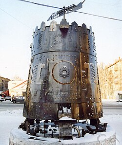

# Gia Kancheli

## Biografía

Kin-Dza-Dza! (Кин-Дза-Дза! en ruso) es una película de ciencia ficción/comedia distópica producida en la Unión Soviética en 1986 por Mosfilm y dirigida por Georgi Danelia, con guion de Georgi Danelia y Revaz Gabriadze. La película fue rodada en color y consta de dos partes de 135 minutos en total. Está considerada una película de culto, especialmente entre los rusos, y sus diálogos se citan con frecuencia en ese país.

## Estilo musical

Realizó sus estudios en el Conservatorio Nacional de Georgia, en Tiflis, entre 1959 y 1963. Compuso la primera de sus siete sinfonías en 1967. En Georgia se hizo famoso por su música destinada al teatro. De hecho, en 1971 se convirtió en director musical del Teatro Rustaveli de la capital. En 1976 recibió un premio nacional por su Cuarta Sinfonía, que se estrenó en enero de 1978 en los Estados Unidos, por Yuri Temirkánov y la Orquesta de Filadelfia. A partir de ese momento, sus obras fueron interpretadas por músicos de la talla de Gidon Kremer, Mstislav Rostropovitch, Dennis Russell Davies, Jansug Kakhidze, Yuri Bachmet, Kim Kashkashian o el Kronos Quartet.

## Anécdotas y curiosidades

Gia Kancheli (georgiano: Гиа Канчели; 10 de agosto de 1935 - 2 de octubre de 2019) [2] fue un compositor georgiano. [3] Nació en Tbilisi, Georgia, y residió en Bélgica más tarde.

## Top 10 bandas sonoras

1. ***Кин-дза-дза! (Título en España: ¡Kin-Dza-Dza!)***
    * **Póster:** [link](064_gia_kancheli/posters/poster_poster_1986.jpg)
2. ***Мимино (Título en España: Мимино)***
    * **Póster:** [link](064_gia_kancheli/posters/poster_poster_1977.jpg)
3. ***Не горюй! (Título en España: Не горюй!)***
    * **Póster:** [link](064_gia_kancheli/posters/poster_poster_1968.jpg)
4. ***Слёзы капали (Título en España: Слёзы капали)***
    * **Póster:** [link](064_gia_kancheli/posters/poster_poster_1983.jpg)
5. ***The Quickie (Título en España: The Quickie)***
    * **Póster:** [link](064_gia_kancheli/posters/poster_the_quickie_2001.jpg)
6. ***არაჩვეულებრივი გამოფენა (Título en España: არაჩვეულებრივი გამოფენა)***
    * **Póster:** [link](064_gia_kancheli/posters/poster_poster_1968.jpg)
7. ***День гнева (Título en España: День гнева)***
    * **Póster:** [link](064_gia_kancheli/posters/poster_poster_1985.jpg)
8. ***მე, გამომძიებელი (Título en España: მე, გამომძიებელი)***
    * **Póster:** [link](064_gia_kancheli/posters/poster_poster_1972.jpg)
9. ***რამდენიმე ინტერვიუ პირად საკითხებზე (Título en España: რამდენიმე ინტერვიუ პირად საკითხებზე)***
    * **Póster:** [link](064_gia_kancheli/posters/poster_poster_1978.jpg)
10. ***დღეს ღამე უთენებია (Título en España: დღეს ღამე უთენებია)***
    * **Póster:** [link](064_gia_kancheli/posters/poster_poster_1983.jpg)

## Filmografía completa

- Не горюй! (Título en España: Не горюй!) (1968) · [Póster](064_gia_kancheli/posters/poster_poster_1968.jpg)
- არაჩვეულებრივი გამოფენა (Título en España: არაჩვეულებრივი გამოფენა) (1968) · [Póster](064_gia_kancheli/posters/poster_poster_1968.jpg)
- გლადიატორი (Título en España: გლადიატორი) (1971) · [Póster](064_gia_kancheli/posters/poster_poster_1971.jpg)
- მე, გამომძიებელი (Título en España: მე, გამომძიებელი) (1972) · [Póster](064_gia_kancheli/posters/poster_poster_1972.jpg)
- ზღვის მგელი (Título en España: ზღვის მგელი) (1974) · [Póster](064_gia_kancheli/posters/poster_poster_1974.jpg)
- თეთრი ქვები (Título en España: თეთრი ქვები) (1974) · [Póster](064_gia_kancheli/posters/poster_poster_1974.jpg)
- ციმბირელი პაპა (Título en España: ციმბირელი პაპა) (1974) · [Póster](064_gia_kancheli/posters/poster_poster_1974.jpg)
- ჯადოსნური კვერცხი (Título en España: ჯადოსნური კვერცხი) (1974) · [Póster](064_gia_kancheli/posters/poster_poster_1974.jpg)
- კაპიტნები (Título en España: კაპიტნები) (1975) · [Póster](064_gia_kancheli/posters/poster_poster_1975.jpg)
- Кафе «Изотоп» (Título en España: Кафе «Изотоп») (1977) · [Póster](064_gia_kancheli/posters/poster_poster_1977.jpg)
- Мимино (Título en España: Мимино) (1977) · [Póster](064_gia_kancheli/posters/poster_poster_1977.jpg)
- სამანიშვილის დედინაცვალი (Título en España: სამანიშვილის დედინაცვალი) (1977) · [Póster](064_gia_kancheli/posters/poster_poster_1977.jpg)
- რამდენიმე ინტერვიუ პირად საკითხებზე (Título en España: რამდენიმე ინტერვიუ პირად საკითხებზე) (1978) · [Póster](064_gia_kancheli/posters/poster_poster_1978.jpg)
- მშობლიურო ჩემო მიწავ! (Título en España: მშობლიურო ჩემო მიწავ!) (1981) · [Póster](064_gia_kancheli/posters/poster_poster_1981.jpg)
- Слёзы капали (Título en España: Слёзы капали) (1983) · [Póster](064_gia_kancheli/posters/poster_poster_1983.jpg)
- დღეს ღამე უთენებია (Título en España: დღეს ღამე უთენებია) (1983) · [Póster](064_gia_kancheli/posters/poster_poster_1983.jpg)
- Písně by neměly umírat (Título en España: Písně by neměly umírat) (1984) · [Póster](064_gia_kancheli/posters/poster_p_sn_by_nem_ly_um_rat_1984.jpg)
- День гнева (Título en España: День гнева) (1985) · [Póster](064_gia_kancheli/posters/poster_poster_1985.jpg)
- Кин-дза-дза! (Título en España: ¡Kin-Dza-Dza!) (1986) · [Póster](064_gia_kancheli/posters/poster_poster_1986.jpg)
- ოჰ, ეს საშინელი ტელევიზორი (Título en España: ოჰ, ეს საშინელი ტელევიზორი) (1990) · [Póster](064_gia_kancheli/posters/poster_poster_1990.jpg)
- Пустеля (Título en España: Пустеля) (1991) · [Póster](064_gia_kancheli/posters/poster_poster_1991.jpg)
- The Quickie (Título en España: The Quickie) (2001) · [Póster](064_gia_kancheli/posters/poster_the_quickie_2001.jpg)
- Медвежий поцелуй (Título en España: Медвежий поцелуй) (2002) · [Póster](064_gia_kancheli/posters/poster_poster_2002.jpg)
- Он сказал «Мама» (Título en España: Он сказал «Мама») (2017) · [Póster](064_gia_kancheli/posters/poster_poster_2017.jpg)
- Бача (Título en España: Бача) (2019) · [Póster](064_gia_kancheli/posters/poster_poster_2019.jpg)

## Premios y nominaciones

* 2008 – Premio Lobo de Artes – (Ganador)
* Artista del Pueblo de la URSS – (Ganador)
* Artista popular de la República Socialista Soviética de Georgia. – (Ganador)
* Orden de Honor – (Ganador)
* Premio Estatal Shota Rustaveli – (Ganador)
* Premio Estatal de la URSS – (Ganador)

## Fuentes adicionales

* [MundoBSO](https://w.mundobso.com/bso/cartero-siempre-llama-dos-veces-el) — site:mundobso.com
* [MundoBSO (2)](https://www.mundobso.com/bso/capitan-america-civil-war) — site:mundobso.com
* [MundoBSO (3)](https://www.mundobso.com/bso/despiadados-los) — site:mundobso.com
* [Film Score Monthly](https://www.filmscoremonthly.com/notes/wild_bunch_alt.html) — site:filmscoremonthly.com
* [Film Score Monthly (2)](https://datenanalyse.trainingwww.filmscoremonthly.com/fsmonline/issue_detail_print.cfm?issID=135&page=3) — site:filmscoremonthly.com
* [Film Score Monthly (3)](https://www.filmscoremonthly.com/board/posts.cfm?forumID=7&pageID=30&threadID=38365&archive=0) — site:filmscoremonthly.com
* [SoundtrackCollector](https://www.soundtrackcollector.com) — site:soundtrackcollector.com
* [SoundtrackCollector (2)](https://soundtrackcollector.com) — site:soundtrackcollector.com
* [SoundtrackCollector (3)](https://www.soundtrackcollector.com/catalog/soundtracktopic.php?movieid=76595&topicid=7685) — site:soundtrackcollector.com
* [WhatSong](https://www.whatsong.org/tvshow/how-i-met-your-mother/episode/44483) — site:whatsong.org
* [WhatSong (2)](https://www.whatsong.org/tvshow/prison-break/episode/37396) — site:whatsong.org
* [WhatSong (3)](https://www.whatsong.org/tvshow/supernatural/episode/3659) — site:whatsong.org

## Notas externas

* MundoBSO (2): Compositor: Jackman, Henry Sello: Hollywood Duración: 69 minutos Información de la película Título original: Captain America: Civil War Director: Anthony Russo, Joe Russo Nacionalidad: EE UU Año: 2016 Argumento Continuación de Captain America: The Winter Soldier (14). Cuando otro incidente internacional involucra a Los Vengadores y causan varios daños colaterales, aumentan las presiones políticas para exigir más responsabilidades y determinar cuándo deben contratar los servicios del grupo de superhéroes. Esta nueva situación dividirá a Los Vengadores, mientras intentan proteger al mundo de un nuevo y terrible villano. Compositor: Jackman, Henry Sello: Hollywood Duración: 69 minutos
* MundoBSO (3): Compositor: Morricone, Ennio Sello: Screen Trax Duración: 37 minutos Información de la película Título original: I crudeli Director: Sergio Corbucci Nacionalidad: Italia Año: 1967 Argumento Al acabar la guerra de Secesión norteamericana, un coronel sudista organiza un ejército para seguir combatiendo, y cuenta para ello con la ayuda de sus tres hijos. Compositor: Morricone, Ennio Sello: Screen Trax Duración: 37 minutos
* SoundtrackCollector: 14 de enero - Confesión de un comisionado de policía de Riz Ortolani a la fiscalía 3 de diciembre - Wolf Hall de Debbie Wiseman: El espejo y la luz
* WhatSong: Lily y Robin bailan con los dos nerds del último año de secundaria. Se reproduce de fondo cuando Lilly, Robin y Barney intentan entrar a la fiesta. La canción es una canción que está incluida en iMovie.
* WhatSong (2): Ramin Djawadi - Prison Break: Temporadas 3 y 4 (Banda sonora original de televisión) Ramin Djawadi - Prison Break: Temporadas 3 y 4 (Banda sonora original de televisión)
* WhatSong (3): Sam y Dean cortan leña para una pira funeraria mientras recuerdan su tiempo con Charlie. La mejor fuente en línea de música de películas y televisión. Copyright © 2018 - 2026 Whatsong.org. Reservados todos los derechos.
* musicianguide.com: Nacido el 10 de agosto de 1935 en Tbilisi, Georgia. Educación: Graduado en el Conservatorio de Tbilisi, 1962. Direcciones: Compañía discográfica: ECM Records, Postfach 600 331, 81203 Munich, Alemania. El compositor Giya Kancheli es el compositor georgiano más importante de los últimos 50 años y uno de los compositores internacionales más importantes del siglo pasado. Se destaca por la fuerte estructura dramática de sus ambiciosas obras orquestales, muchas de las cuales contienen temas profundamente espirituales. Su música, de rica textura, está imbuida de influencias de la música folclórica georgiana, el jazz estadounidense y los compositores rusos del siglo XX, con fraseos musicales que alternan entre escaso y culminante. Junto con otros...
* www.boosey.com: Publicaciones Descripción general Publicaciones nuevas Noticias Destacados Ver y Escuchar Presentados Nuevo Las 10 principales Todos
* www.composers21.com: (n. 10 de agosto de 1935, Tbilisi – m. 2 de octubre de 2019, Tbilisi). Compositor georgiano, posteriormente residente en Bélgica, de obras que han sido interpretadas en todo el mundo.
* www.boosey.com: Publicaciones Descripción general Publicaciones nuevas Noticias Destacados Ver y Escuchar Presentados Nuevo Las 10 principales Todos
* www.wisemusicclassical.com: La música, como la vida misma, es inconcebible sin romanticismo. El romanticismo es un gran sueño del pasado, presente y futuro: una fuerza de belleza invencible que se eleva por encima y conquista las fuerzas de la ignorancia, la intolerancia, la violencia y el mal. --Giya Kancheli Nacida en Tbilisi el 10 de agosto de 1935, Giya Kancheli fue una de las compositoras más distinguidas de Georgia y una figura destacada en el mundo de la música contemporánea. Las partituras de Kancheli, de naturaleza profundamente espiritual, están llenas de inquietantes imágenes auditivas, variados colores y texturas, agudos contrastes y clímax demoledores. Su música se inspira en el folclore georgiano y canta con una emoción sentida pero refinada; está concebido...
* classiccat.net: Giya Kancheli (georgiano: გია ყანჩელი), nacido el 10 de agosto de 1935 en Tbilisi, es un compositor georgiano residente en Bélgica. Desde 1991, Kancheli ha vivido en Europa occidental: primero en Berlín y desde 1995 en Amberes, donde es compositor residente de la Real Filarmónica de Flandes.
