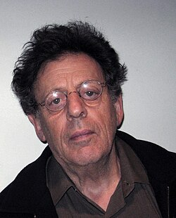

# Philip Glass

## Biografía

Philip Glass (Baltimore, Maryland, 31 de enero de 1937) es un compositor de música clásica minimalista estadounidense. Estudió en la Juilliard School de Nueva York. Su reconocimiento internacional aumentó desde la aparición de su ópera Einstein on the Beach (1975). Prolífico compositor, ha trabajado en diversos ámbitos como la ópera, la música orquestal, la música de cámara o el cine. Trabaja habitualmente con el Philip Glass Ensemble. Ha colaborado con Paul Simon, Linda Ronstadt, Yo-Yo Ma, Doris Lessing y Robert Wilson.

## Estilo musical

1 Biografía Alternar subsección Biografía 1.1 Infancia 1.2 Encuentro con el budismo 1.3 En busca de un estilo propio 1.4 Reconocimiento 1.5 Consagración 1.6 Controversia

## Anécdotas y curiosidades

2 Alternancia de carrera Subsección de carrera 2.1 1964–1966: París 2.2 1967–1974: Minimalismo: de Strung Out a la música en 12 partes 2.3 1975–1979: Otra mirada a la armonía: La trilogía de retratos 2.4 1980–1986: Completando la trilogía de retratos: Akhnaten y más allá 2.5 1987–1991: Óperas y el giro hacia la música sinfónica 2.6 1991–1996: Trilogía y sinfonías de Cocteau 2.7 1997–2004: Sinfonías, ópera y conciertos 2.8 2005–2007: Canciones y poemas 2.9 2008–presente: Música de cámara, conciertos y sinfonías

## Top 10 bandas sonoras

1. ***Kundun (Título en España: Kundun)***
    * **Póster:** [link](066_philip_glass/posters/poster_kundun_1997.jpg)
2. ***The Hours (Título en España: Las horas)***
    * **Póster:** [link](066_philip_glass/posters/poster_the_hours_2002.jpg)
3. ***Notes on a Scandal (Título en España: Diario de un escándalo)***
    * **Póster:** [link](066_philip_glass/posters/poster_notes_on_a_scandal_2006.jpg)
4. ***The Truman Show (Título en España: El show de Truman)***
    * **Póster:** [link](066_philip_glass/posters/poster_the_truman_show_1998.jpg)
5. ***The Illusionist (Título en España: El ilusionista)***
    * **Póster:** [link](066_philip_glass/posters/poster_the_illusionist_2006.jpg)
6. ***Fantastic Four (Título en España: Cuatro Fantásticos)***
    * **Póster:** [link](066_philip_glass/posters/poster_fantastic_four_2015.jpg)

## Filmografía completa

- Hands Scraping (Título en España: Hands Scraping) (1968) · [Póster](066_philip_glass/posters/poster_hands_scraping_1968.jpg)
- Inquiring Nuns (Título en España: Inquiring Nuns) (1968) · [Póster](066_philip_glass/posters/poster_inquiring_nuns_1968.jpg)
- New Music: Sounds and Voices from the Avant-Garde New York 1971 (Título en España: New Music: Sounds and Voices from the Avant-Garde New York 1971) (1971) · [Póster](066_philip_glass/posters/poster_new_music_sounds_and_voices_from_the_avant_garde_new_york_1971_1971.jpg)
- Music with Roots in the Aether: Opera for Television by Robert Ashley (Título en España: Music with Roots in the Aether: Opera for Television by Robert Ashley) (1974) · [Póster](066_philip_glass/posters/poster_music_with_roots_in_the_aether_opera_for_television_by_robert_ashley_1974.jpg)
- What Maisie Knew (Título en España: What Maisie Knew) (1975) · [Póster](066_philip_glass/posters/poster_what_maisie_knew_1975.jpg)
- Four American Composers: Philip Glass (Título en España: Four American Composers: Philip Glass) (1983) · [Póster](066_philip_glass/posters/poster_four_american_composers_philip_glass_1983.jpg)
- Koyaanisqatsi (Título en España: Koyaanisqatsi) (1983) · [Póster](066_philip_glass/posters/poster_koyaanisqatsi_1983.jpg)
- Einstein on the Beach: The Changing Image of Opera (Título en España: Einstein on the Beach: The Changing Image of Opera) (1985) · [Póster](066_philip_glass/posters/poster_einstein_on_the_beach_the_changing_image_of_opera_1985.jpg)
- Empire City (Título en España: Empire City) (1985) · [Póster](066_philip_glass/posters/poster_empire_city_1985.jpg)
- Mishima: A Life in Four Chapters (Título en España: Mishima: Una vida en cuatro capítulos) (1985) · [Póster](066_philip_glass/posters/poster_mishima_a_life_in_four_chapters_1985.jpg)
- A Composer’s Notes: Philip Glass and the Making of an Opera (Título en España: A Composer’s Notes: Philip Glass and the Making of an Opera) (1986) · [Póster](066_philip_glass/posters/poster_a_composer_s_notes_philip_glass_and_the_making_of_an_opera_1986.jpg)
- Bye Bye Kipling (Título en España: Bye Bye Kipling) (1986) · [Póster](066_philip_glass/posters/poster_bye_bye_kipling_1986.jpg)
- The Kitchen Presents: Two Moon July (Título en España: The Kitchen Presents: Two Moon July) (1986) · [Póster](066_philip_glass/posters/poster_the_kitchen_presents_two_moon_july_1986.jpg)
- Hamburger Hill (Título en España: La colina de la hamburguesa) (1987) · [Póster](066_philip_glass/posters/poster_hamburger_hill_1987.jpg)
- Robert Wilson and the Civil Wars (Título en España: Robert Wilson and the Civil Wars) (1987) · [Póster](066_philip_glass/posters/poster_robert_wilson_and_the_civil_wars_1987.jpg)
- John Cage: Man and Myth (Título en España: John Cage: Man and Myth) (1990) · [Póster](066_philip_glass/posters/poster_john_cage_man_and_myth_1990.jpg)
- Anima Mundi (Título en España: Anima Mundi) (1991) · [Póster](066_philip_glass/posters/poster_anima_mundi_1991.jpg)
- Mindwalk (Título en España: Senderos de la mente) (1991) · [Póster](066_philip_glass/posters/poster_mindwalk_1991.jpg)
- A Brief History of Time (Título en España: Una breve historia del tiempo) (1991) · [Póster](066_philip_glass/posters/poster_a_brief_history_of_time_1991.jpg)
- Candyman (Título en España: Candyman: El dominio de la mente) (1992) · [Póster](066_philip_glass/posters/poster_candyman_1992.jpg)
- Planetens spejle (Título en España: Planetens spejle) (1992) · [Póster](066_philip_glass/posters/poster_planetens_spejle_1992.jpg)
- Candyman: Farewell to the Flesh (Título en España: Candyman 2) (1995) · [Póster](066_philip_glass/posters/poster_candyman_farewell_to_the_flesh_1995.jpg)
- Evidence (Título en España: Evidence) (1995) · [Póster](066_philip_glass/posters/poster_evidence_1995.jpg)
- Jenipapo (Título en España: Jenipapo) (1995) · [Póster](066_philip_glass/posters/poster_jenipapo_1995.jpg)
- The Secret Agent (Título en España: El agente secreto) (1996) · [Póster](066_philip_glass/posters/poster_the_secret_agent_1996.jpg)
- Bent (Título en España: Bent) (1997) · [Póster](066_philip_glass/posters/poster_bent_1997.jpg)
- Kundun (Título en España: Kundun) (1997) · [Póster](066_philip_glass/posters/poster_kundun_1997.jpg)
- Mama General (Título en España: Mama General) (1997) · [Póster](066_philip_glass/posters/poster_mama_general_1997.jpg)
- Classic Albums: Paul Simon - Graceland (Título en España: Paul Simon:  Graceland) (1997) · [Póster](066_philip_glass/posters/poster_classic_albums_paul_simon_graceland_1997.jpg)
- Perfect Moment (Título en España: Perfect Moment) (1997) · [Póster](066_philip_glass/posters/poster_perfect_moment_1997.jpg)
- The Truman Show (Título en España: El show de Truman) (1998) · [Póster](066_philip_glass/posters/poster_the_truman_show_1998.jpg)
- A Brief History of Errol Morris (Título en España: A Brief History of Errol Morris) (1999) · [Póster](066_philip_glass/posters/poster_a_brief_history_of_errol_morris_1999.jpg)
- The Source (Título en España: The Source) (1999) · [Póster](066_philip_glass/posters/poster_the_source_1999.jpg)
- In the Ocean (Título en España: In the Ocean) (2001) · [Póster](066_philip_glass/posters/poster_in_the_ocean_2001.jpg)
- Essence of Life (Título en España: Essence of Life) (2002) · [Póster](066_philip_glass/posters/poster_essence_of_life_2002.jpg)
- Impact of Progress (Título en España: Impact of Progress) (2002) · [Póster](066_philip_glass/posters/poster_impact_of_progress_2002.jpg)
- The Hours (Título en España: Las horas) (2002) · [Póster](066_philip_glass/posters/poster_the_hours_2002.jpg)
- The Baroness and the Pig (Título en España: The Baroness and the Pig) (2002) · [Póster](066_philip_glass/posters/poster_the_baroness_and_the_pig_2002.jpg)
- The Outsider: The Story of Harry Partch (Título en España: The Outsider: The Story of Harry Partch) (2002) · [Póster](066_philip_glass/posters/poster_the_outsider_the_story_of_harry_partch_2002.jpg)
- Powaqqatsi: Impact of Progress (Título en España: Powaqqatsi: Impact of Progress) (2003) · [Póster](066_philip_glass/posters/poster_powaqqatsi_impact_of_progress_2003.jpg)
- The Fog of War (Título en España: Rumores de Guerra) (2003) · [Póster](066_philip_glass/posters/poster_the_fog_of_war_2003.jpg)
- Secret Window (Título en España: La ventana secreta) (2004) · [Póster](066_philip_glass/posters/poster_secret_window_2004.jpg)
- Undertow (Título en España: Undertow) (2004) · [Póster](066_philip_glass/posters/poster_undertow_2004.jpg)
- Taking Lives (Título en España: Vidas ajenas) (2004) · [Póster](066_philip_glass/posters/poster_taking_lives_2004.jpg)
- Neverwas (Título en España: El libro mágico) (2005) · [Póster](066_philip_glass/posters/poster_neverwas_2005.jpg)
- Kiki and Herb Reloaded (Título en España: Kiki and Herb Reloaded) (2005) · [Póster](066_philip_glass/posters/poster_kiki_and_herb_reloaded_2005.jpg)
- La Moustache (Título en España: La Moustache) (2005) · [Póster](066_philip_glass/posters/poster_la_moustache_2005.jpg)
- Philip Glass: Looking Glass (Título en España: Philip Glass: Looking Glass) (2005) · [Póster](066_philip_glass/posters/poster_philip_glass_looking_glass_2005.jpg)
- The Best of Secter & the Rest of Secter (Título en España: The Best of Secter & the Rest of Secter) (2005) · [Póster](066_philip_glass/posters/poster_the_best_of_secter_the_rest_of_secter_2005.jpg)
- The Giant Buddhas (Título en España: The Giant Buddhas) (2005) · [Póster](066_philip_glass/posters/poster_the_giant_buddhas_2005.jpg)
- Notes on a Scandal (Título en España: Diario de un escándalo) (2006) · [Póster](066_philip_glass/posters/poster_notes_on_a_scandal_2006.jpg)
- The Illusionist (Título en España: El ilusionista) (2006) · [Póster](066_philip_glass/posters/poster_the_illusionist_2006.jpg)
- Roving Mars (Título en España: Explorando Marte) (2006) · [Póster](066_philip_glass/posters/poster_roving_mars_2006.jpg)
- The Harry Smith Project Live (Título en España: The Harry Smith Project Live) (2006) · [Póster](066_philip_glass/posters/poster_the_harry_smith_project_live_2006.jpg)
- Un leader in ascolto (Título en España: Un leader in ascolto) (2006) · [Póster](https://example.com/placeholder.jpg)
- 365 Day Project (Título en España: 365 Day Project) (2007) · [Póster](066_philip_glass/posters/poster_365_day_project_2007.jpg)
- Cassandra's Dream (Título en España: El sueño de Cassandra) (2007) · [Póster](066_philip_glass/posters/poster_cassandra_s_dream_2007.jpg)
- Glass: A Portrait of Philip in Twelve Parts (Título en España: Glass: A Portrait of Philip in Twelve Parts) (2007) · [Póster](066_philip_glass/posters/poster_glass_a_portrait_of_philip_in_twelve_parts_2007.jpg)
- No Reservations (Título en España: Sin reservas) (2007) · [Póster](066_philip_glass/posters/poster_no_reservations_2007.jpg)
- Making Mishima (Título en España: Making Mishima) (2008) · [Póster](066_philip_glass/posters/poster_making_mishima_2008.jpg)
- Patti Smith: Dream of Life (Título en España: Patti Smith: Dream of Life) (2008) · [Póster](066_philip_glass/posters/poster_patti_smith_dream_of_life_2008.jpg)
- Richard Serra: Man of Steel (Título en España: Richard Serra: Man of Steel) (2008) · [Póster](066_philip_glass/posters/poster_richard_serra_man_of_steel_2008.jpg)
- Wild Combination: A Portrait of Arthur Russell (Título en España: Wild Combination: A Portrait of Arthur Russell) (2008) · [Póster](066_philip_glass/posters/poster_wild_combination_a_portrait_of_arthur_russell_2008.jpg)
- Mr. Nice (Título en España: Mr. Nice) (2010) · [Póster](066_philip_glass/posters/poster_mr_nice_2010.jpg)
- Music (Título en España: Music) (2010) · [Póster](066_philip_glass/posters/poster_music_2010.jpg)
- Nosso Lar (Título en España: Nuestro hogar) (2010) · [Póster](066_philip_glass/posters/poster_nosso_lar_2010.jpg)
- Елена (Título en España: Elena) (2011) · [Póster](066_philip_glass/posters/poster_poster_2011.jpg)
- Glass: Kepler (Título en España: Glass: Kepler) (2011) · [Póster](066_philip_glass/posters/poster_glass_kepler_2011.jpg)
- Lucinda Childs' Dance (Título en España: Lucinda Childs' Dance) (2011) · [Póster](066_philip_glass/posters/poster_lucinda_childs_dance_2011.jpg)
- Rebirth (Título en España: Rebirth) (2011) · [Póster](066_philip_glass/posters/poster_rebirth_2011.jpg)
- They Were There (Título en España: They Were There) (2011) · [Póster](066_philip_glass/posters/poster_they_were_there_2011.jpg)
- Besa: The Promise (Título en España: Besa: The Promise) (2012) · [Póster](066_philip_glass/posters/poster_besa_the_promise_2012.jpg)
- O Apóstolo (Título en España: El Apóstol) (2012) · [Póster](066_philip_glass/posters/poster_o_ap_stolo_2012.jpg)
- Paul Simon: Under African Skies (Título en España: Paul Simon. Under African Skies) (2012) · [Póster](066_philip_glass/posters/poster_paul_simon_under_african_skies_2012.jpg)
- Glass: The Perfect American (Título en España: Glass: The Perfect American) (2013) · [Póster](066_philip_glass/posters/poster_glass_the_perfect_american_2013.jpg)
- Re: Awakenings (Título en España: Re: Awakenings) (2013) · [Póster](066_philip_glass/posters/poster_re_awakenings_2013.jpg)
- Einstein on the Beach (Título en España: Einstein on the Beach) (2014) · [Póster](066_philip_glass/posters/poster_einstein_on_the_beach_2014.jpg)
- What Difference Does It Make? (Título en España: What Difference Does It Make?) (2014) · [Póster](066_philip_glass/posters/poster_what_difference_does_it_make_2014.jpg)
- Fantastic Four (Título en España: Cuatro Fantásticos) (2015) · [Póster](066_philip_glass/posters/poster_fantastic_four_2015.jpg)
- The Viking of Sixth Avenue (Título en España: The Viking of Sixth Avenue) (2015) · [Póster](066_philip_glass/posters/poster_the_viking_of_sixth_avenue_2015.jpg)
- Trophy (Título en España: Criados para morir) (2017) · [Póster](066_philip_glass/posters/poster_trophy_2017.jpg)
- Crônica da Demolição (Título en España: Crônica da Demolição) (2017) · [Póster](066_philip_glass/posters/poster_cr_nica_da_demoli_o_2017.jpg)
- Jane (Título en España: Jane) (2017) · [Póster](066_philip_glass/posters/poster_jane_2017.jpg)
- The Last Dalai Lama? (Título en España: The Last Dalai Lama?) (2017) · [Póster](066_philip_glass/posters/poster_the_last_dalai_lama_2017.jpg)
- Hommage à Jerome Robbins (Título en España: Hommage à Jerome Robbins) (2018) · [Póster](066_philip_glass/posters/poster_hommage_jerome_robbins_2018.jpg)
- サムライマラソン (Título en España: サムライマラソン) (2019) · [Póster](066_philip_glass/posters/poster_poster_2019.jpg)
- Philip Glass: Akhnaten (Título en España: Philip Glass: Akhnaten) (2020) · [Póster](066_philip_glass/posters/poster_philip_glass_akhnaten_2020.jpg)
- War and the Weather (Título en España: War and the Weather) (2021) · [Póster](066_philip_glass/posters/poster_war_and_the_weather_2021.jpg)
- Alice (Título en España: Alice: En busca de la verdad) (2022) · [Póster](066_philip_glass/posters/poster_alice_2022.jpg)
- Robert Wilson – Die Schönheit des Geheimnisvollen (Título en España: Robert Wilson – Die Schönheit des Geheimnisvollen) (2022) · [Póster](066_philip_glass/posters/poster_robert_wilson_die_sch_nheit_des_geheimnisvollen_2022.jpg)
- Un lugar llamado música (Título en España: Un lugar llamado música) (2022) · [Póster](066_philip_glass/posters/poster_un_lugar_llamado_m_sica_2022.jpg)
- Dobrawa Czocher Europavox Sessions 2023 (Título en España: Dobrawa Czocher Europavox Sessions 2023) (2023) · [Póster](066_philip_glass/posters/poster_dobrawa_czocher_europavox_sessions_2023_2023.jpg)
- Klaus Mäkelä dirige Ravel Avec Yuja Wang & l'Orchestre de Paris (Título en España: Klaus Mäkelä dirige Ravel Avec Yuja Wang & l'Orchestre de Paris) (2023) · [Póster](066_philip_glass/posters/poster_klaus_m_kel_dirige_ravel_avec_yuja_wang_l_orchestre_de_paris_2023.jpg)
- Once Within a Time (Título en España: Once Within a Time) (2023) · [Póster](066_philip_glass/posters/poster_once_within_a_time_2023.jpg)
- The Pigeon Tunnel (Título en España: Volar en círculos, de John le Carré) (2023) · [Póster](066_philip_glass/posters/poster_the_pigeon_tunnel_2023.jpg)
- Carolyn Carlson - Midnight Souls (Palais des Papes, Avignon) 2025 (Título en España: Carolyn Carlson - Midnight Souls (Palais des Papes, Avignon) 2025) (2025) · [Póster](066_philip_glass/posters/poster_carolyn_carlson_midnight_souls_palais_des_papes_avignon_2025_2025.jpg)
- Concert for Notre-Dame La Tempête | Sabine Devieilhe | Olivier Latry (Título en España: Concert for Notre-Dame La Tempête | Sabine Devieilhe | Olivier Latry) (2025) · [Póster](066_philip_glass/posters/poster_concert_for_notre_dame_la_temp_te_sabine_devieilhe_olivier_latry_2025.jpg)
- Ladies & Gentlemen... 50 Years of SNL Music (Título en España: La música de Saturday Night Live) (2025) · [Póster](066_philip_glass/posters/poster_ladies_gentlemen_50_years_of_snl_music_2025.jpg)
- Yuja Wang X David Hockney (Título en España: Yuja Wang X David Hockney) (2025) · [Póster](066_philip_glass/posters/poster_yuja_wang_x_david_hockney_2025.jpg)
- The Making of "Once Within a Time" (Título en España: The Making of "Once Within a Time") · [Póster](066_philip_glass/posters/poster_the_making_of_once_within_a_time.jpg)

## Premios y nominaciones

* 1998 – Premio de la Academia a la mejor banda sonora dramática original – por *Kundun (Título en España: Kundun)* – (Nominación)
* 2003 – Premio BAFTA a la mejor música original – por *The Hours (Título en España: Las horas)* – (Ganador)
* 2003 – Premio de la Academia a la mejor banda sonora original – por *The Hours (Título en España: Las horas)* – (Nominación)
* 2007 – Premio de la Academia a la mejor banda sonora original – por *Notes on a Scandal (Título en España: Diario de un escándalo)* – (Nominación)
* 2012 – premio imperial – (Ganador)
* 2015 – Premio Glenn Gould – (Ganador)
* Beca Fulbright – (Ganador)
* Caballero de las Artes y las Letras – (Ganador)
* Miembro de la Academia Estadounidense de Artes y Ciencias – (Ganador)
* Premio interreligioso James Parks Morton – (Ganador)
* Premios Brit clásicos – (Ganador)

## Fuentes adicionales

* [MundoBSO](https://www.mundobso.com/compositor/glass-philip) — site:mundobso.com
* [MundoBSO (2)](https://www.mundobso.com/bso/milla-verde-la) — site:mundobso.com
* [MundoBSO (3)](https://w.mundobso.com/bso/cartero-siempre-llama-dos-veces-el) — site:mundobso.com
* [Film Score Monthly](https://www.filmscoremonthly.com/backissues/viewissue.cfm?issueID=68) — site:filmscoremonthly.com
* [Film Score Monthly (2)](https://www.filmscoremonthly.com/board/posts.cfm?threadID=1209&forumID=1&archive=1) — site:filmscoremonthly.com
* [Film Score Monthly (3)](https://www.filmscoremonthly.com/fsmonline/video_archive.cfm) — site:filmscoremonthly.com
* [SoundtrackCollector](https://soundtrackcollector.com/catalog/composerdiscography.php?composerid=2102&offset=80) — site:soundtrackcollector.com
* [SoundtrackCollector (2)](https://www.soundtrackcollector.com/title/77255/Illusionist,+The) — site:soundtrackcollector.com
* [SoundtrackCollector (3)](https://www.soundtrackcollector.com/title/51718/Hours,+The) — site:soundtrackcollector.com
* [WhatSong](https://www.whatsong.org/tvshow/how-i-met-your-mother/episode/21236) — site:whatsong.org
* [WhatSong (2)](https://www.whatsong.org/tvshow/gilmore-girls/episode/3805) — site:whatsong.org
* [WhatSong (3)](https://www.whatsong.org) — site:whatsong.org

## Notas externas

* MundoBSO: Nació en Baltimore (EE UU), el 31 de enero de 1937. Comenzó a estudiar violín a los seis años y la flauta a los ocho. Se formó en la Julliard School of Music de Nueva York y emigró luego a París, donde estudió la música hindú, norteafricana y tibetana. A partir de ese momento, empezó a aplicar en su música esas técnicas. Formó su propio grupo, el «Philip Glass Ensemble», donde desarrollaría sus propias experimentaciones minimalistas, que luego volcaría en su labor en el cine. Destaca también por sus trabajos en documentales ha sido objeto de dos documentales sobre su obra: A Composer's Notes: Philip Glass and the Making of an Opera (86) y Glass: A Portrait of Philip in Twelve Parts (08)....
* MundoBSO (2): Compositor: Newman, Thomas Sello: Warner Duración: 66 minutos Información de la película Título original: The Green Mile Director: Frank Darabont Nacionalidad: EE UU Año: 1999 Argumento A mediados de los años treinta, un guarda de prisiones que custodia a los condenados a muerte descubre poderes sobrenaturales en un inmenso hombre negro, acusado de haber asesinado a dos niñas. Eso le llevará a creer en su inocencia. Premios Saturn: 1 nominación Compositor: Newman, Thomas Sello: Warner Duración: 66 minutos
* WhatSong: Escenas finales: después de hablar con la madre, Barney se da cuenta de que quiere estar con Robin. Cuando Barney sigue a 'la madre' fuera de la farmacia (16:45).
* WhatSong (2): Los alumnos de Miss Patty cantan esta canción al principio y al final del espectáculo. Filarmónica de Berlín y Herbert von Karajan - Tchaikovsky: Suites de ballet
* WhatSong (3): La mejor fuente en línea de música de películas y televisión. Copyright © 2018 - 2026 Whatsong.org. Reservados todos los derechos.
* philipglass.com: Comencé a trabajar para Orange Mountain Music, el sello discográfico de Philip Glass, hace 11 años, en enero de 2006. Me contrataron sólo unas semanas después del estreno mundial de la Sinfonía n.º 8 en la Academia de Música de Brooklyn. La Sinfonía n.° 8 y su final tranquilo fue quizás el atractivo de la venta de entradas, pero se colocó correctamente en la primera mitad del programa con la Sinfonía n.° 6 “Oda plutoniana”, una pieza más teatral y con un final tradicionalmente más satisfactorio. La orquesta era la Bruckner Orchester Linz bajo la dirección de su director musical Dennis Russell Davies, un defensor desde hace mucho tiempo de la nueva música en general, de la música estadounidense en particular, y una figura que ha tenido una relación musical única con Philip...
* www.yidff.jp: Haciendo los cortes: sobre la censura cinematográfica en la India Shradha Sukumaran Variaciones sobre la imagen musical: una entrevista con Philip Glass James Tobias
* www.smithsonianmag.com: Era una tarde soleada de la primavera de 1974, y mi banda y yo, todos músicos de jazz, nos habíamos aventurado al KennedyCenter en Washington, D.C. para escuchar lo que críticos y escritores promocionaban como el futuro de la música clásica. El estilo se llamaba minimalismo y su gurú era un tipo llamado Philip Glass. Cuando nos sentamos en el suelo del vestíbulo superior del vasto complejo de artes escénicas, junto con otros 200 buscadores de una nueva fe musical, el futuro no parecía particularmente auspicioso. Para empezar, estaba el suelo en sí: no había asientos, ni siquiera alfombras para sentarse. Luego estaba el escenario... o, mejor dicho, no lo había. Al parecer, el Philip Glass Ensemble iba a actuar en el...
* performingarts.nd.edu: Eventos Ver todos los eventos Calendario de eventos Serie de presentación Abonos Serie de cine + Festivales Eventos por categoría Artes en ND Música Danza Teatro Eventos gratuitos Eventos familiares Eventos especiales
* philipglass.com: A través de sus óperas, sus sinfonías, sus composiciones para su propio conjunto y sus amplias colaboraciones, Philip Glass ha tenido un impacto extraordinario y sin precedentes en la vida musical e intelectual de su época. Las óperas –“Einstein on the Beach”, “Satyagraha”, “Akhnaten” y “The Voyage”, entre muchas otras- se presentan en los principales teatros del mundo y rara vez ocupan un asiento vacío. Glass ha escrito música para teatro experimental y para películas ganadoras del Premio de la Academia como “The Hours” y “Kundun” de Martin Scorsese, mientras que “Koyaanisqatsi”, su paisaje cinematográfico inicial con Godfrey Reggio y el Philip Glass Ensemble, puede ser el emparejamiento más radical e influyente...
* www.milkenarchive.org: Philip Glass es percibido comúnmente y con el mismo nombre como el avatar de lo que se ha llegado a conocer, acertadamente o no, como “minimalismo” en la música. Si ese cliché es en parte el resultado de una categorización demasiado simplista, o de una asociación histórica poco precisa, tanto Glass como el compositor Steve Reich (aunque sus logros no necesariamente estén relacionados) son a menudo reconocidos en la suposición popular como los dos exponentes más visibles de esa escuela minimalista cognominal. El término, sin embargo, que Glass rechaza como regla general, fue acuñado por Michael Nyman como una forma de escribir sobre música (es decir, a posteriori), no de componer. Rara vez lo utilizan los compositores a quienes se aplica con frecuencia...
* philipglass.com: SUITE DE DRÁCULA 9 Drácula 1:08 10 Viaje a la posada 0:40 11 La posada, parte 1 0:43 12 La posada, parte 2 1:59 13 Carro sin conductor 2:05 14 Dr. Van Helsing y Drácula 2:12 15 En el teatro 5:37 16 Mina en la terraza 4:22 17 El dormitorio de Mina y The Abby 3:45 18 The End of Dracula 3:48 19 Dracula, Epilogue 1:28 Suite de “The Hours”, encargada conjuntamente por la Orquesta Sinfónica de Milwaukee y la Orquesta Filarmónica de Brooklyn, es una suite de concierto en tres movimientos arreglada por Michael Riesman para piano, cuerdas, arpa y celeste de la banda sonora de la película de Philip Glass a la película de Stephen Daldry The Hours adaptada del libro del Pulitzer de Michael Cunningham. Novela premiada,...
