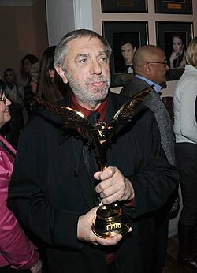

# Eduard Artemyev

## Biografía

Eduard Nikoláyevich Artémiev (en ruso: Эдуард Николаевич Артемьев - Novosibirsk, 30 de noviembre de 1937-29 de diciembre de 2022),​ fue un compositor ruso de música electrónica​ y música cinematográfica.​Internacionalmente es conocido por la composición de las bandas sonoras de las películas Solaris (1972), El espejo (1975) y Stalker (1979), dirigidas por Andréi Tarkovski,​ así como por su trabajo en Quemado por el sol (1994) dirigida por Nikita Mijalkov.​ A lo largo de su trayectoria obtuvo 14 galardones cinematográficos y en 1999 fue reconocido con el premio Artista del Pueblo de la Federación Rusa.​

## Estilo musical

Artemyev nació en Novosibirsk y estudió en el Conservatorio de Moscú con Yuri Shaporin. Su interés por la música electrónica y los sintetizadores comenzó después de graduarse en 1960, cuando la música electrónica aún estaba en su infancia. Escribió su primera composición en 1967, en uno de los primeros sintetizadores, el sintetizador ANS, desarrollado por el ingeniero soviético Yevgeny Murzin. Fue, por tanto, uno de los primeros compositores de música electrónica y un pionero de la misma. Su colaboración con el director de cine Andrei Tarkovsky en los años 1970 le dio fama. Escribió las bandas sonoras de las películas de Tarkovsky Solaris, Mirror y Stalker. Posteriormente, también escribió bandas sonoras para películas de Andrei Konchalovsky y Nikita Mikhalkov. Sus bandas sonoras cinematográficas y su música recibieron numerosos elogios, así como tres premios Nika. Obtuvo la licencia de varios extractos de la banda sonora de Solaris para utilizarlos en la producción española El Cosmonauta. Eduard Artemyev escribió un par de canciones, la más famosa de ellas Deltaplan de Valery Leontiev. [ 3 ]

## Anécdotas y curiosidades

Artemyev nació en Novosibirsk y estudió en el Conservatorio de Moscú con Yuri Shaporin. Su interés por la música electrónica y los sintetizadores comenzó después de graduarse en 1960, cuando la música electrónica aún estaba en su infancia. Escribió su primera composición en 1967, en uno de los primeros sintetizadores, el sintetizador ANS, desarrollado por el ingeniero soviético Yevgeny Murzin. Fue, por tanto, uno de los primeros compositores de música electrónica y un pionero de la misma. Su colaboración con el director de cine Andrei Tarkovsky en los años 1970 le dio fama. Escribió las bandas sonoras de las películas de Tarkovsky Solaris, Mirror y Stalker. Posteriormente, también escribió bandas sonoras para películas de Andrei Konchalovsky y Nikita Mikhalkov. Sus bandas sonoras cinematográficas y su música recibieron numerosos elogios, así como tres premios Nika. Obtuvo la licencia de varios extractos de la banda sonora de Solaris para utilizarlos en la producción española El Cosmonauta. Eduard Artemyev escribió un par de canciones, la más famosa de ellas Deltaplan de Valery Leontiev. [ 3 ]

## Top 10 bandas sonoras

1. ***Сталкер (Título en España: Stalker)***
    * **Póster:** [link](067_eduard_artemyev/posters/poster_poster_1979.jpg)
2. ***12 (Título en España: 12)***
    * **Póster:** [link](067_eduard_artemyev/posters/poster_12_2007.jpg)
3. ***Солярис (Título en España: Solaris)***
    * **Póster:** [link](067_eduard_artemyev/posters/poster_poster_1972.jpg)
4. ***Утомлённые солнцем (Título en España: Quemado por el sol)***
    * **Póster:** [link](067_eduard_artemyev/posters/poster_poster_1994.jpg)
5. ***Зеркало (Título en España: El espejo)***
    * **Póster:** [link](067_eduard_artemyev/posters/poster_poster_1975.jpg)
6. ***Сибирский цирюльник (Título en España: El barbero de Siberia)***
    * **Póster:** [link](067_eduard_artemyev/posters/poster_poster_1998.jpg)
7. ***Курьер (Título en España: El mensajero)***
    * **Póster:** [link](067_eduard_artemyev/posters/poster_poster_1986.jpg)
8. ***So weit die Füße tragen (Título en España: Hasta donde los pies me lleven)***
    * **Póster:** [link](067_eduard_artemyev/posters/poster_so_weit_die_f_e_tragen_2001.jpg)
9. ***Урга — территория любви (Título en España: Urga - El territorio del amor)***
    * **Póster:** [link](067_eduard_artemyev/posters/poster_poster_1991.jpg)
10. ***Легенда №17 (Título en España: Легенда №17)***
    * **Póster:** [link](067_eduard_artemyev/posters/poster_17_2013.jpg)

## Filmografía completa

- Мечте навстречу (Título en España: Encuentro en el espacio) (1963) · [Póster](067_eduard_artemyev/posters/poster_poster_1963.jpg)
- Арена (Título en España: Арена) (1967) · [Póster](067_eduard_artemyev/posters/poster_poster_1967.jpg)
- Клубок (Título en España: Клубок) (1968) · [Póster](067_eduard_artemyev/posters/poster_poster_1968.jpg)
- Не в шляпе счастье (Título en España: Не в шляпе счастье) (1968) · [Póster](067_eduard_artemyev/posters/poster_poster_1968.jpg)
- Урок литературы (Título en España: Урок литературы) (1968) · [Póster](067_eduard_artemyev/posters/poster_poster_1968.jpg)
- Великие холода (Título en España: Великие холода) (1969) · [Póster](067_eduard_artemyev/posters/poster_poster_1969.jpg)
- Каждый вечер в одиннадцать (Título en España: Каждый вечер в одиннадцать) (1969) · [Póster](067_eduard_artemyev/posters/poster_poster_1969.jpg)
- Спокойный день в конце войны (Título en España: Спокойный день в конце войны) (1970) · [Póster](067_eduard_artemyev/posters/poster_poster_1970.jpg)
- Солярис (Título en España: Solaris) (1972) · [Póster](067_eduard_artemyev/posters/poster_poster_1972.jpg)
- Ветерок (Título en España: Ветерок) (1972) · [Póster](067_eduard_artemyev/posters/poster_poster_1972.jpg)
- Свой среди чужих, чужой среди своих (Título en España: Amigo entre mis enemigos) (1974) · [Póster](067_eduard_artemyev/posters/poster_poster_1974.jpg)
- Молчание доктора Ивенса (Título en España: Молчание доктора Ивенса) (1974) · [Póster](067_eduard_artemyev/posters/poster_poster_1974.jpg)
- Зеркало (Título en España: El espejo) (1975) · [Póster](067_eduard_artemyev/posters/poster_poster_1975.jpg)
- Принимаю на себя (Título en España: Принимаю на себя) (1976) · [Póster](067_eduard_artemyev/posters/poster_poster_1976.jpg)
- Раба любви (Título en España: Раба любви) (1976) · [Póster](067_eduard_artemyev/posters/poster_poster_1976.jpg)
- Середина жизни (Título en España: Середина жизни) (1976) · [Póster](067_eduard_artemyev/posters/poster_poster_1976.jpg)
- Страх высоты (Título en España: Страх высоты) (1976) · [Póster](067_eduard_artemyev/posters/poster_poster_1976.jpg)
- Неоконченная пьеса для механического пианино (Título en España: Una pieza inacabada para piano mecánico) (1977) · [Póster](067_eduard_artemyev/posters/poster_poster_1977.jpg)
- Бешеное золото (Título en España: Бешеное золото) (1977) · [Póster](067_eduard_artemyev/posters/poster_poster_1977.jpg)
- Легенды перуанских индейцев (Título en España: Легенды перуанских индейцев) (1978) · [Póster](067_eduard_artemyev/posters/poster_poster_1978.jpg)
- Самолётик (Título en España: Самолётик) (1978) · [Póster](067_eduard_artemyev/posters/poster_poster_1978.jpg)
- Сталкер (Título en España: Stalker) (1979) · [Póster](067_eduard_artemyev/posters/poster_poster_1979.jpg)
- Сыщик (Título en España: Сыщик) (1979) · [Póster](067_eduard_artemyev/posters/poster_poster_1979.jpg)
- Телохранитель (Título en España: Телохранитель) (1979) · [Póster](067_eduard_artemyev/posters/poster_poster_1979.jpg)
- Территория (Título en España: Территория) (1979) · [Póster](067_eduard_artemyev/posters/poster_poster_1979.jpg)
- Ночь рождения (Título en España: Noche de cumpleaños) (1980) · [Póster](067_eduard_artemyev/posters/poster_poster_1980.jpg)
- Несколько дней из жизни И.И. Обломова (Título en España: Unos días en la vida de Oblomov) (1980) · [Póster](067_eduard_artemyev/posters/poster_poster_1980.jpg)
- Братья Рико (Título en España: Братья Рико) (1980) · [Póster](067_eduard_artemyev/posters/poster_poster_1980.jpg)
- Родня (Título en España: Los parientes) (1981) · [Póster](067_eduard_artemyev/posters/poster_poster_1981.jpg)
- Александр маленький (Título en España: Александр маленький) (1981) · [Póster](067_eduard_artemyev/posters/poster_poster_1981.jpg)
- Говорящие руки Траванкора (Título en España: Говорящие руки Траванкора) (1981) · [Póster](067_eduard_artemyev/posters/poster_poster_1981.jpg)
- Недобрая Ладо (Título en España: Недобрая Ладо) (1981) · [Póster](067_eduard_artemyev/posters/poster_poster_1981.jpg)
- Опасный возраст (Título en España: Опасный возраст) (1981) · [Póster](067_eduard_artemyev/posters/poster_poster_1981.jpg)
- В талом снеге звон ручья (Título en España: В талом снеге звон ручья) (1982) · [Póster](067_eduard_artemyev/posters/poster_poster_1982.jpg)
- Закон племени (Título en España: Закон племени) (1982) · [Póster](067_eduard_artemyev/posters/poster_poster_1982.jpg)
- Захват (Título en España: Захват) (1982) · [Póster](067_eduard_artemyev/posters/poster_poster_1982.jpg)
- Когда уходят киты (Título en España: Когда уходят киты) (1982) · [Póster](067_eduard_artemyev/posters/poster_poster_1982.jpg)
- Свидание с молодостью (Título en España: Свидание с молодостью) (1982) · [Póster](067_eduard_artemyev/posters/poster_poster_1982.jpg)
- Без свидетелей (Título en España: Sin testigos) (1983) · [Póster](067_eduard_artemyev/posters/poster_poster_1983.jpg)
- Лунная радуга (Título en España: Лунная радуга) (1983) · [Póster](067_eduard_artemyev/posters/poster_poster_1983.jpg)
- Первая конная (Título en España: Первая конная) (1984) · [Póster](067_eduard_artemyev/posters/poster_poster_1984.jpg)
- Семь стихий (Título en España: Семь стихий) (1984) · [Póster](067_eduard_artemyev/posters/poster_poster_1984.jpg)
- Загадка сфинкса (Título en España: Загадка сфинкса) (1985) · [Póster](067_eduard_artemyev/posters/poster_poster_1985.jpg)
- Секунда на подвиг (Título en España: Секунда на подвиг) (1985) · [Póster](067_eduard_artemyev/posters/poster_poster_1985.jpg)
- Человек-невидимка (Título en España: Человек-невидимка) (1985) · [Póster](067_eduard_artemyev/posters/poster_poster_1985.jpg)
- Курьер (Título en España: El mensajero) (1986) · [Póster](067_eduard_artemyev/posters/poster_poster_1986.jpg)
- Двое на острове слез (Título en España: Двое на острове слез) (1986) · [Póster](067_eduard_artemyev/posters/poster_poster_1986.jpg)
- Мы веселы, счастливы, талантливы! (Título en España: Мы веселы, счастливы, талантливы!) (1986) · [Póster](067_eduard_artemyev/posters/poster_poster_1986.jpg)
- Соучастие в убийстве (Título en España: Соучастие в убийстве) (1986) · [Póster](067_eduard_artemyev/posters/poster_poster_1986.jpg)
- Конец вечности (Título en España: El fin de la eternidad) (1987) · [Póster](067_eduard_artemyev/posters/poster_poster_1987.jpg)
- Мышь и верблюд (Título en España: Мышь и верблюд) (1987) · [Póster](067_eduard_artemyev/posters/poster_poster_1987.jpg)
- Город Зеро (Título en España: Ciudad cero) (1988) · [Póster](067_eduard_artemyev/posters/poster_poster_1988.jpg)
- Homer and Eddie (Título en España: Homer y Eddie) (1989) · [Póster](067_eduard_artemyev/posters/poster_homer_and_eddie_1989.jpg)
- Палач (Título en España: Палач) (1990) · [Póster](067_eduard_artemyev/posters/poster_poster_1990.jpg)
- Урга — территория любви (Título en España: Urga - El territorio del amor) (1991) · [Póster](067_eduard_artemyev/posters/poster_poster_1991.jpg)
- Гений (Título en España: Гений) (1991) · [Póster](067_eduard_artemyev/posters/poster_poster_1991.jpg)
- Double Jeopardy (Título en España: Doble juego (Doble Jeopardy)) (1992) · [Póster](067_eduard_artemyev/posters/poster_double_jeopardy_1992.jpg)
- The Inner Circle (Título en España: El círculo del poder) (1992) · [Póster](067_eduard_artemyev/posters/poster_the_inner_circle_1992.jpg)
- Волшебная лавка (Título en España: Волшебная лавка) (1992) · [Póster](067_eduard_artemyev/posters/poster_poster_1992.jpg)
- Анна: От 6 до 18 (Título en España: Анна: От 6 до 18) (1993) · [Póster](067_eduard_artemyev/posters/poster_6_18_1993.jpg)
- Утомлённые солнцем (Título en España: Quemado por el sol) (1994) · [Póster](067_eduard_artemyev/posters/poster_poster_1994.jpg)
- Burial of the Rats (Título en España: Cementerio de alimañas) (1995) · [Póster](067_eduard_artemyev/posters/poster_burial_of_the_rats_1995.jpg)
- Лимита (Título en España: Лимита) (1995) · [Póster](067_eduard_artemyev/posters/poster_poster_1995.jpg)
- Я - Русский солдат (Título en España: Я - Русский солдат) (1995) · [Póster](067_eduard_artemyev/posters/poster_poster_1995.jpg)
- Alexander Scriabin – Towards the Light / Calculation and Ecstasy (Título en España: Alexander Scriabin – Towards the Light / Calculation and Ecstasy) (1996) · [Póster](067_eduard_artemyev/posters/poster_alexander_scriabin_towards_the_light_calculation_and_ecstasy_1996.jpg)
- The Odyssey (Título en España: The Odyssey) (1997) · [Póster](067_eduard_artemyev/posters/poster_the_odyssey_1997.jpg)
- Сибирский цирюльник (Título en España: El barbero de Siberia) (1998) · [Póster](067_eduard_artemyev/posters/poster_poster_1998.jpg)
- Мама (Título en España: Мама) (1999) · [Póster](067_eduard_artemyev/posters/poster_poster_1999.jpg)
- So weit die Füße tragen (Título en España: Hasta donde los pies me lleven) (2001) · [Póster](067_eduard_artemyev/posters/poster_so_weit_die_f_e_tragen_2001.jpg)
- Дом дураков (Título en España: Дом дураков) (2002) · [Póster](067_eduard_artemyev/posters/poster_poster_2002.jpg)
- 12 (Título en España: 12) (2007) · [Póster](067_eduard_artemyev/posters/poster_12_2007.jpg)
- Никто, кроме нас... (Título en España: Никто, кроме нас...) (2008) · [Póster](067_eduard_artemyev/posters/poster_poster_2008.jpg)
- The Nutcracker (Título en España: El cascanueces) (2010) · [Póster](067_eduard_artemyev/posters/poster_the_nutcracker_2010.jpg)
- Утомлённые солнцем 2: Предстояние (Título en España: Quemado por el Sol 2: Éxodo) (2010) · [Póster](067_eduard_artemyev/posters/poster_2_2010.jpg)
- Утомленные солнцем 2: Цитадель (Título en España: Quemado por el Sol 3: Ciudadela) (2011) · [Póster](067_eduard_artemyev/posters/poster_2_2011.jpg)
- Tikhaya Zastava (Título en España: Tikhaya Zastava) (2011) · [Póster](067_eduard_artemyev/posters/poster_tikhaya_zastava_2011.jpg)
- Дом (Título en España: Дом) (2011) · [Póster](067_eduard_artemyev/posters/poster_poster_2011.jpg)
- Branded (Título en España: Código oculto (Branded)) (2012) · [Póster](067_eduard_artemyev/posters/poster_branded_2012.jpg)
- Искупление (Título en España: Искупление) (2012) · [Póster](067_eduard_artemyev/posters/poster_poster_2012.jpg)
- Легенда №17 (Título en España: Легенда №17) (2013) · [Póster](067_eduard_artemyev/posters/poster_17_2013.jpg)
- Белые ночи почтальона Алексея Тряпицына (Título en España: El cartero de las noches blancas) (2014) · [Póster](067_eduard_artemyev/posters/poster_poster_2014.jpg)
- Солнечный удар (Título en España: Солнечный удар) (2014) · [Póster](067_eduard_artemyev/posters/poster_poster_2014.jpg)
- Герой (Título en España: The Heritage of Love) (2016) · [Póster](067_eduard_artemyev/posters/poster_poster_2016.jpg)
- Парад планет (Título en España: Парад планет) (2018) · [Póster](067_eduard_artemyev/posters/poster_poster_2018.jpg)
- Il peccato (Título en España: Miguel Ángel (El pecado)) (2019) · [Póster](067_eduard_artemyev/posters/poster_il_peccato_2019.jpg)
- The Dream in the Mirror (Título en España: The Dream in the Mirror) (2021) · [Póster](067_eduard_artemyev/posters/poster_the_dream_in_the_mirror_2021.jpg)
- Нюрнберг (Título en España: Нюрнберг) (2023) · [Póster](067_eduard_artemyev/posters/poster_poster_2023.jpg)
- Шоколадный револьвер (Título en España: Шоколадный револьвер) · [Póster](067_eduard_artemyev/posters/poster_poster.jpg)

## Premios y nominaciones

* 1985 – Honrado trabajador del arte de la República Socialista Federativa Soviética de Rusia – (Ganador)
* 1999 – Artista del Pueblo de la Federación Rusa – (Ganador)
* 2013 – Orden "Por el Mérito a la Patria", 4ta clase – (Ganador)
* 2018 – Orden de Alejandro Nevski – (Ganador)
* Héroe del Trabajo de la Federación Rusa – (Ganador)
* Máscara Dorada – (Ganador)
* Premio Estatal Hermanos Vasiliev de la RSFSR – (Ganador)
* Premio Estatal de la Federación Rusa – (Ganador)
* Premio Nika – (Ganador)
* Premio del Servicio Federal de Seguridad de Rusia – (Ganador)
* Premios Águila Dorada – (Ganador)

## Fuentes adicionales

* [MundoBSO](https://www.mundobso.com/bso/star-trek-insurrection) — site:mundobso.com
* [MundoBSO (2)](https://w.mundobso.com/bso/cartero-siempre-llama-dos-veces-el) — site:mundobso.com
* [MundoBSO (3)](https://www.mundobso.com/bso/lobo-y-el-leon-el) — site:mundobso.com
* [Film Score Monthly](https://filmscoremonthly.com/board/posts.cfm?forumID=1&pageID=2&threadID=150089&archive=0) — site:filmscoremonthly.com
* [Film Score Monthly (2)](https://www.filmscoremonthly.com/board/posts.cfm?forumID=1&pageID=1&threadID=139369&archive=0) — site:filmscoremonthly.com
* [Film Score Monthly (3)](https://www.filmscoremonthly.com/daily/index.cfm) — site:filmscoremonthly.com
* [SoundtrackCollector](https://www.soundtrackcollector.com/catalog/composerdiscography.php?composerid=2359) — site:soundtrackcollector.com
* [SoundtrackCollector (2)](https://www.soundtrackcollector.com/title/34763/Odyssey,+The) — site:soundtrackcollector.com
* [SoundtrackCollector (3)](https://soundtrackcollector.com) — site:soundtrackcollector.com
* [WhatSong](https://www.whatsong.org/tvshow/grown-ish/episode/82123) — site:whatsong.org
* [WhatSong (2)](https://www.whatsong.org/tvshow/smallville/episode/39263) — site:whatsong.org
* [WhatSong (3)](https://www.whatsong.org/tvshow/vikings/episode/41727) — site:whatsong.org

## Notas externas

* MundoBSO: Compositor: Goldsmith, Jerry Sello: GNP Duración: 79 minutos Información de la película Título original: Star Trek: Insurrection Director: Jonathan Frakes Nacionalidad: EE UU Año: 1998 Argumento La tripulación de la nave Enterprise encuentra un planeta con propiedades mágicas, en el que sus habitantes viven en eterna paz... hasta que surge la amenaza de invasión. Compositor: Goldsmith, Jerry Sello: GNP Duración: 79 minutos
* MundoBSO (3): Compositor: Amar, Armand Sello: Long Distance Duración: 54 minutos Información de la película Título original: Le loup et le lion Director: Gilles de Maistre Nacionalidad: Francia Año: 2021 Argumento Una joven regresa a la casa de su infancia en una isla de Canadá. Allí su vida da un vuelco cuando rescata a un cachorro de lobo y a un cachorro de león. A medida que los animales crecen, los tres forman un vínculo inseparable, hasta que son separados. Compositor: Amar, Armand Sello: Long Distance Duración: 54 minutos
* WhatSong: Luca está pensando en él y en el encuentro sexual de Zoey de la noche anterior. Luca está estresado por su "yo". Texto a Zoey y su falta de respuesta.
* WhatSong (2): Actuó mientras Pete mastica chicle de kriptonita y luego salva a Kara. OneRepublic - Soñando en voz alta (edición ampliada)
* WhatSong (3): Trevor Morris, Einar Selvik, Steve Tavaglione y Brian Kilgore - Los vikingos II (banda sonora original de la película) Trevor Morris - Los vikingos II (banda sonora original de la película)
* kinoart.ru: Este número está dedicado al cine joven y a los autores que están dando sus primeros pasos, en busca de lenguaje y forma. Está dirigido a estrenos en festivales rusos y películas extranjeras que llegan a públicos transfronterizos. También se exploran el teatro, la música y el arte contemporáneo: todo aquello en lo que nace una nueva declaración. Del 17 al 20 de febrero, Illusion acogerá una retrospectiva en memoria del maravilloso Eduard Artemyev. Recordamos la entrevista al compositor, publicada en el número 4 de la revista Cinema Art del año 2007.
* eefb.org: Eduard Artemyev nació en 1937 en Novosibirsk. Estudió composición en el Conservatorio de Moscú y está considerado uno de los pioneros de la música electrónica en la composición cinematográfica. Fue uno de los primeros exponentes del sintetizador fotoelectrónico ANS, desarrollado por Evgeny Murzin, instrumento que utilizó en su primera colaboración con el director Andrey Tarkovsky en Solaris. El ANS, que lleva el nombre de Alexander Nikolayevich Scriabin, que había experimentado sinestesia, fue diseñado para interpretar el sonido y el color de forma similar a como los percibía el compositor ruso. Murzin desarrolló un proceso que permitía imprimir ondas sonoras, generadas por el sintetizador, en una superficie de vidrio negro,...
* www.eurock.com: La siguiente entrevista con Edward y Artemiy Artemiev se realizó a finales de 2001. Presenta una mirada fascinante y bastante completa a las carreras de ambos músicos y, además, a los inicios y la historia de la música electrónica en la URSS (ahora Rusia). Tenía ciertas ideas preconcebidas cuando envié las preguntas, y muchas de ellas resultaron ser correctas, pero muchas también resultaron estar bastante equivocadas. Artemiy fue tan amable de traducir gran parte de esta entrevista, además de brindarme mucha ayuda e información adicional. Cuando se desarrolló la forma final de la entrevista, me sorprendió bastante cómo retrataba una forma bastante diferente en la que su propia forma de...
* www.lemonde.fr: Mundo Todos los artículos Europa América Estados Unidos África Medio Oriente Asia y Pacífico Geopolítica Diplomacia Cartas de Estados Unidos Donald Trump Cuba, una isla a la deriva Guerra en Ucrania Guerra en Gaza Irán Groenlandia OTAN Venezuela Acuerdo comercial UE-Mercosur Europa Todos los artículos Unión Europea Francia Reino Unido Rusia Alemania Italia Groenlandia Acuerdo comercial UE-Mercosur
* pantheon.world: Perfiles Personas Lugares Países Ocupaciones Ocupación / País Épocas Muertes Su biografía está disponible en 26 idiomas diferentes en Wikipedia (frente a 24 en 2024). Eduard Artemyev es el 832.º compositor más popular (en comparación con el 779.º en 2024), la biografía número 1.106.º más popular de Rusia (en comparación con el 1.089.º en 2019) y el 40.º compositor ruso más popular.
* soundup.world: Eduard Artemiev, nacido en 1937, es miembro de la magnífica generación de compositores rusos que se hicieron un nombre en el “deshielo” de los años 60. Es el contemporáneo más joven y colega de los gigantes de la vanguardia rusa cuyas audaces búsquedas acústicas eran poco compatibles con una carrera exitosa y una vida cómoda en la Unión Soviética. Sin embargo, habiendo surgido del mismo entorno profesional y habiendo procesado las ideas palpitantes de esa época, Eduard Artemiev emprendió un viaje creativo completamente único que lo hizo incomparable con cualquier otra persona. Su música es una galaxia separada como ninguna otra. Puede que sea difícil de creer, pero el Artista del Pueblo de Rusia y ganador de...
* znanierussia.ru: Eduard Nikolaevich Artemyev (30 de noviembre de 1937, Novosibirsk - 29 de diciembre de 2022, Moscú) - Músico y compositor soviético y ruso, Héroe del Trabajo de la Federación de Rusia (2022), Artista del Pueblo de la Federación de Rusia (1999), ganador de cuatro Premios Estatales de la Federación de Rusia (1993, 1995, 1999, 2017), Premio Estatal de la RSFSR lleva el nombre de los hermanos Vasiliev (1988) y el Premio Máscara de Oro (2017). En 1960 se graduó en composición en el Conservatorio de Moscú. El mentor de Artemyev fue Yuri Shaporin. En 1964-1986, Artemyev trabajó como profesor en el Instituto de Cultura de Moscú. A partir de la década de 1960 comenzó a experimentar en el género de la música electrónica. Durante este tiempo comenzó a trabajar con...
