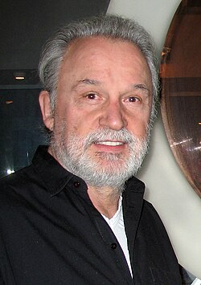

# Giorgio Moroder

## Biografía

Giovanni Giorgio Moroder (Val Gardena,​ Bolzano, Italia; 26 de abril de 1940) es un DJ, cantante, compositor y productor musical italiano que innovó en la llamada música disco, especialmente por la incorporación de sintetizadores y cajas de ritmos, convirtiéndose en una gran influencia para la música de baile posteriormente conocida como música techno y también de la aparición de nuevas variantes musicales del disco, tales como el eurodisco y el hi-NRG.​ Tres veces ganador del Premio Óscar como compositor, es particularmente conocido como productor musical de Donna Summer. Canciones como Love to Love You Baby y I Feel Love (con su poderoso uso de sintetizadores, clavinet y caja de ritmos) son célebres y muy reproducidas por grupos incluso en estos días.[cita requerida]

## Estilo musical

2 Discografía Alternar subsección Discografía 2.1 Álbumes 2.1.1 Álbumes de estudio 2.1.2 Bandas sonoras

Nació en Ortisei (Italia), el 26 de abril de 1940. Músico cuyo estilo vanguardista y tecno-pop en base al empleo de sintetizadores causó en su momento enorme impacto pero, pasada la moda, no volvió a destacar. Nació en Ortisei (Italia), el 26 de abril de 1940. Músico cuyo estilo vanguardista y tecno-pop en base al empleo de sintetizadores causó en su momento enorme impacto pero, pasada la moda, no volvió a destacar.

## Anécdotas y curiosidades

2 Subsección de alternancia de carrera profesional 2.1 1963–1983: Contribución a la música electrónica 2.2 1984–1993: Reconocimiento y pausa 2.3 2012–presente: Regreso y colaboraciones

## Top 10 bandas sonoras

1. ***Midnight Express (Título en España: El expreso de medianoche)***
    * **Póster:** [link](072_giorgio_moroder/posters/poster_midnight_express_1978.jpg)
2. ***Scarface (Título en España: El precio del poder)***
    * **Póster:** [link](072_giorgio_moroder/posters/poster_scarface_1983.jpg)
3. ***Die unendliche Geschichte (Título en España: La historia interminable)***
    * **Póster:** [link](072_giorgio_moroder/posters/poster_die_unendliche_geschichte_1984.jpg)
4. ***Over the Top (Título en España: Yo, el halcón)***
    * **Póster:** [link](072_giorgio_moroder/posters/poster_over_the_top_1987.jpg)
5. ***Flashdance (Título en España: Flashdance)***
    * **Póster:** [link](072_giorgio_moroder/posters/poster_flashdance_1983.jpg)
6. ***American Gigolo (Título en España: American Gigolo)***
    * **Póster:** [link](072_giorgio_moroder/posters/poster_american_gigolo_1980.jpg)
7. ***Cat People (Título en España: El beso de la pantera)***
    * **Póster:** [link](072_giorgio_moroder/posters/poster_cat_people_1982.jpg)
8. ***The Assignment (Título en España: Dulce venganza)***
    * **Póster:** [link](072_giorgio_moroder/posters/poster_the_assignment_2016.jpg)
9. ***Electric Dreams (Título en España: Sueños eléctricos)***
    * **Póster:** [link](072_giorgio_moroder/posters/poster_electric_dreams_1984.jpg)
10. ***Daft Punk Unchained (Título en España: Daft Punk Unchained)***
    * **Póster:** [link](072_giorgio_moroder/posters/poster_daft_punk_unchained_2015.jpg)

## Filmografía completa

- Die Klosterschülerinnen (Título en España: Die Klosterschülerinnen) (1972) · [Póster](072_giorgio_moroder/posters/poster_die_klostersch_lerinnen_1972.jpg)
- Oswalt Kolle: Liebe als Gesellschaftsspiel (Título en España: Oswalt Kolle: Liebe als Gesellschaftsspiel) (1972) · [Póster](072_giorgio_moroder/posters/poster_oswalt_kolle_liebe_als_gesellschaftsspiel_1972.jpg)
- Midnight Express (Título en España: El expreso de medianoche) (1978) · [Póster](072_giorgio_moroder/posters/poster_midnight_express_1978.jpg)
- American Gigolo (Título en España: American Gigolo) (1980) · [Póster](072_giorgio_moroder/posters/poster_american_gigolo_1980.jpg)
- Foxes (Título en España: Zorras) (1980) · [Póster](072_giorgio_moroder/posters/poster_foxes_1980.jpg)
- Cat People (Título en España: El beso de la pantera) (1982) · [Póster](072_giorgio_moroder/posters/poster_cat_people_1982.jpg)
- Scarface (Título en España: El precio del poder) (1983) · [Póster](072_giorgio_moroder/posters/poster_scarface_1983.jpg)
- Flashdance (Título en España: Flashdance) (1983) · [Póster](072_giorgio_moroder/posters/poster_flashdance_1983.jpg)
- D.C. Cab (Título en España: Los locos del taxi) (1983) · [Póster](072_giorgio_moroder/posters/poster_d_c_cab_1983.jpg)
- Die unendliche Geschichte (Título en España: La historia interminable) (1984) · [Póster](072_giorgio_moroder/posters/poster_die_unendliche_geschichte_1984.jpg)
- Electric Dreams (Título en España: Sueños eléctricos) (1984) · [Póster](072_giorgio_moroder/posters/poster_electric_dreams_1984.jpg)
- The Fading Image (Título en España: The Fading Image) (1984) · [Póster](072_giorgio_moroder/posters/poster_the_fading_image_1984.jpg)
- Over the Top (Título en España: Yo, el halcón) (1987) · [Póster](072_giorgio_moroder/posters/poster_over_the_top_1987.jpg)
- Mamba (Título en España: Mamba) (1988) · [Póster](072_giorgio_moroder/posters/poster_mamba_1988.jpg)
- アナザーウェイ　Ｄ機関情報 (Título en España: アナザーウェイ　Ｄ機関情報) (1988) · [Póster](072_giorgio_moroder/posters/poster_poster_1988.jpg)
- Let It Ride (Título en España: A rienda suelta) (1989) · [Póster](072_giorgio_moroder/posters/poster_let_it_ride_1989.jpg)
- Jackpot (Título en España: Jackpot) (1992) · [Póster](072_giorgio_moroder/posters/poster_jackpot_1992.jpg)
- Rhythm Divine: The Story of Disco (Título en España: Rhythm Divine: The Story of Disco) (1992) · [Póster](072_giorgio_moroder/posters/poster_rhythm_divine_the_story_of_disco_1992.jpg)
- Modulations (Título en España: Modulations) (1998) · [Póster](072_giorgio_moroder/posters/poster_modulations_1998.jpg)
- Mythos Hollywood - Das Geheimnis des Erfolgs (Título en España: Mythos Hollywood - Das Geheimnis des Erfolgs) (1998) · [Póster](072_giorgio_moroder/posters/poster_mythos_hollywood_das_geheimnis_des_erfolgs_1998.jpg)
- Danger Zone: The Making of Top Gun (Título en España: Danger Zone: The Making of Top Gun) (2004) · [Póster](072_giorgio_moroder/posters/poster_danger_zone_the_making_of_top_gun_2004.jpg)
- Disco: Spinning The Story (Título en España: Disco: Spinning The Story) (2005) · [Póster](072_giorgio_moroder/posters/poster_disco_spinning_the_story_2005.jpg)
- Station to Station (Título en España: Station to Station) (2014) · [Póster](072_giorgio_moroder/posters/poster_station_to_station_2014.jpg)
- What Difference Does It Make? (Título en España: What Difference Does It Make?) (2014) · [Póster](072_giorgio_moroder/posters/poster_what_difference_does_it_make_2014.jpg)
- Daft Punk Unchained (Título en España: Daft Punk Unchained) (2015) · [Póster](072_giorgio_moroder/posters/poster_daft_punk_unchained_2015.jpg)
- The Assignment (Título en España: Dulce venganza) (2016) · [Póster](072_giorgio_moroder/posters/poster_the_assignment_2016.jpg)
- Disco Europe Express (Título en España: Disco Europe Express) (2019) · [Póster](072_giorgio_moroder/posters/poster_disco_europe_express_2019.jpg)
- The Sparks Brothers (Título en España: The Sparks Brothers) (2021) · [Póster](072_giorgio_moroder/posters/poster_the_sparks_brothers_2021.jpg)
- The Music of Giorgio Moroder: An Orchestral Celebration (Título en España: The Music of Giorgio Moroder: An Orchestral Celebration) · [Póster](072_giorgio_moroder/posters/poster_the_music_of_giorgio_moroder_an_orchestral_celebration.jpg)

## Premios y nominaciones

* 1979 – Premio Globo de Oro a la mejor banda sonora original – (Ganador)
* 1979 – Premio de la Academia a la mejor banda sonora original – por *Midnight Express (Título en España: El expreso de medianoche)* – (Ganador)
* 1984 – Premio BAFTA a la mejor canción original – por *Flashdance... What a Feeling* – (Nominación)
* 1984 – Premio Bambi – (Ganador)
* 1984 – Premio Globo de Oro a la Mejor Canción Original – por *Flashdance... What a Feeling* – (Ganador)
* 1984 – Premio Globo de Oro a la mejor banda sonora original – (Ganador)
* 1984 – Premio Golden Raspberry a la peor partitura musical – por *Superman III (Título en España: Superman III)* – (Nominación)
* 1984 – Premio Grammy a la mejor banda sonora para medios visuales – (Ganador)
* 1984 – Premio Grammy a la mejor composición instrumental – (Ganador)
* 1984 – Premio de la Academia a la mejor canción original – por *Flashdance... What a Feeling* – (Ganador)
* 1985 – Premio Golden Raspberry a la peor canción original – por *Love Kills (Título en España: Love Kills)* – (Nominación)
* 1985 – Premio Golden Raspberry a la peor partitura musical – por *Metropolis (Título en España: Metrópolis)* – (Nominación)
* 1985 – Premio Golden Raspberry a la peor partitura musical – por *Thief of Hearts (Título en España: Ladrón de pasiones)* – (Nominación)
* 1987 – Premio Bambi – (Ganador)
* 1987 – Premio Globo de Oro a la Mejor Canción Original – (Ganador)
* 1987 – Premio de la Academia a la mejor canción original – por *Take My Breath Away (Título en España: Take My Breath Away)* – (Ganador)
* 1998 – Premio Grammy a la mejor grabación dance/electrónica – por *Carry-On (Título en España: Equipaje de mano)* – (Ganador)
* 2005 – Comandante de la Orden del Mérito de la República Italiana – (Ganador)
* 2014 – Premio Grammy al Álbum del Año – (Ganador)
* Premio David di Donatello a la trayectoria – (Ganador)

## Fuentes adicionales

* [MundoBSO](https://www.mundobso.com) — site:mundobso.com
* [MundoBSO (2)](https://www.mundobso.com/compositor/moroder-giorgio) — site:mundobso.com
* [MundoBSO (3)](https://w.mundobso.com/bso/cartero-siempre-llama-dos-veces-el) — site:mundobso.com
* [Film Score Monthly](https://www.filmscoremonthly.com/daily/article.cfm/articleID/3327/Lost-Issue-Wednesday-Electronic-Scores-of-the-1980s/) — site:filmscoremonthly.com
* [Film Score Monthly (2)](https://filmscoremonthly.com/board/posts.cfm?threadID=62247) — site:filmscoremonthly.com
* [Film Score Monthly (3)](https://filmscoremonthly.com/board/posts.cfm?threadID=76107&forumID=1&archive=0) — site:filmscoremonthly.com
* [SoundtrackCollector](https://www.soundtrackcollector.com/title/26440/Foxes) — site:soundtrackcollector.com
* [SoundtrackCollector (2)](https://www.soundtrackcollector.com/title/6451/American+Gigolo) — site:soundtrackcollector.com
* [SoundtrackCollector (3)](https://www.soundtrackcollector.com/title/1664/Flashdance) — site:soundtrackcollector.com
* [WhatSong](https://www.whatsong.org/movie/scarface) — site:whatsong.org
* [WhatSong (2)](https://www.whatsong.org/movie/call-me-by-your-name) — site:whatsong.org
* [WhatSong (3)](https://www.whatsong.org/movie/over-the-top) — site:whatsong.org

## Notas externas

* MundoBSO: Ludwig Göransson ha ganado el Premio Grammy por la banda sonora de Sinners, en el que es su tercer premio. La película también ha ganado en el apartado de mejor banda sonora de canciones, el Grammy a la mejor canción ha sido para Golden, de K-Pop Demon Hunters, y la mejor banda sonora de videojuego la ha ganado Austin Wintory por Sword of the Sea. Todos los textos, salvo los firmados por otros, están registrados y son propiedad de Conrado Xalabarder. Prohibida la reproducción total o parcial sin el consentimiento expreso y por escrito del autor.
* MundoBSO (2): Nació en Ortisei (Italia), el 26 de abril de 1940. Músico cuyo estilo vanguardista y tecno-pop en base al empleo de sintetizadores causó en su momento enorme impacto pero, pasada la moda, no volvió a destacar. Nació en Ortisei (Italia), el 26 de abril de 1940. Músico cuyo estilo vanguardista y tecno-pop en base al empleo de sintetizadores causó en su momento enorme impacto pero, pasada la moda, no volvió a destacar.
* SoundtrackCollector: Twentieth Century Foxes (1980, Estados Unidos, título provisional)
* WhatSong: Paul Engemann - Caracortada (banda sonora original de la película) Montaje de Tony llevando dinero al banco y casándose con Elvira.
* WhatSong (2): John Adams - Llámame por tu nombre (banda sonora original de la película) Créditos iniciales. / La canción suena más adelante en la película mientras Elio observa a Oliver desde el balcón.
* WhatSong (3): Kenny Loggins - Ayer, hoy, mañana: Los grandes éxitos de Kenny Loggins Demon Slayer: Kimetsu no Yaiba Infinity Castle 2025
* time.com: La influencia de Moroder está en todas partes. Sus innovaciones ayudaron a impulsar el synthpop de los 80 y su resurgimiento de los 2000, así como el reciente resurgimiento de la música disco liderado por grupos como Daft Punk, en cuyo álbum de regreso de 2013, Random Access Memories, contribuyó con la melodía autobiográfica "Giorgio by Moroder". Kanye West y Lil Wayne lo probaron. Después de una reciente serie de exitosos conciertos como DJ y esa colaboración bien recibida con Daft Punk, Moroder ahora está listo para lanzar su primer álbum en 30 años. Una vez más, algunas de las estrellas más brillantes del mundo se han alineado para trabajar con él: Sia, Britney Spears, Mikky Ekko y Charli XCX, por destacar sólo algunas. Aún sin título y sin fecha de lanzamiento, las canciones...
* www.harpersbazaar.com: Giorgio Moroder: Súper Disco Macho (y sus mujeres) Tras tres décadas sin decir esta pista de baile es mía, Giorgio Moroder regresa con honores y un flamante álbum a los 75 años, acompañado por algunas de las mayores estrellas femeninas del pop. HARPER'S BAZAAR habló con él... sobre ellas.
* www.teclacenter.com.br: JavaScript parece estar deshabilitado en su navegador. Para tener una mejor experiencia en nuestro sitio web, asegúrese de habilitar JavaScript en su navegador. Piano Piano Ver todos los pianos digitales Piano acústico Marcas de gabinetes de piano SILENT Piano híbrido PianoDisc - Tocar solo
* littlevillagemag.com: Cuando Giorgio Moroder aparezca en el Festival de Música Pitchfork de este año el viernes 18 de julio, será el artista de mayor edad allí, con diferencia. Sin embargo, este productor de música electrónica de baile de 74 años ciertamente se ha ganado su lugar entre los chicos geniales del festival St. Vincent, Grimes y tUnE-yArDs, así como entre artistas de herencia hipster como Beck, Neutral Milk Hotel y Slowdive. Giorgio Moroder se hizo un nombre por primera vez en 1975 como productor del clásico de Donna Summer "Love To Love You Baby". Esta original creación disco es recordada por sus gemidos orgásmicos de pared a pared y su duración épica (17 minutos, que se decía que estaban agotados para la mejor experiencia de hacer el amor, aunque eso no parece muy...
* www.giorgiomoroder.com: Como fundador de la música disco y pionero de la música electrónica, Giorgio Moroder dejó su huella como un influyente productor, compositor, intérprete y DJ italiano. A sus 74 años, Moroder todavía tiene sus manos en el centro de la cultura EDM, volviendo a ser el centro de atención en 2013 como colaborador invitado en el álbum Random Access Memories de Daft Punk, ganador del premio GRAMMY (“Álbum del año”), nuevos remixes para Donna Summer, Haim y su banda sonora de la película Scarface, una nueva estación como aclamado DJ en vivo en los principales festivales y clubes globales, y un nuevo álbum de colaboraciones de próxima aparición. A lo largo de su carrera, el Sr. Moroder ha trabajado con algunos de los nombres más famosos de la música...
* efemeridesdelamusica.blogspot.com: Aniversarios de nacimiento y hechos importantes de la Historia de la Música publicados por fechas. Los textos destacados en rojo son más de 25.000 enlaces a Youtube y Spotify. ▼ 26 abr (4) Discos publicados un 26 de Abril Giorgio Moroder Lole Montoya Fallecidos un 26 de Abril
