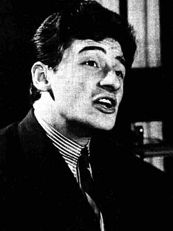

# Pino Donaggio

## Biografía

Giuseppe "Pino" Donaggio (Burano, Venecia, 24 de noviembre de 1941) es un músico, cantante y compositor cinematográfico italiano. Violinista de formación clásica, es conocido por sus colaboraciones con el director Brian De Palma y por su trabajo en el cine B europeo y estadounidense como Amanecer salvaje (1985).

## Estilo musical

Criado en una familia de músicos, D. comenzó a estudiar violín a los diez años (a los catorce hizo su debut público con un concierto de Vivaldi), participando en conjuntos como I Solisti Veneti y I Solisti di Milano. Una formación 'clásica', por tanto, abandonada, casi por casualidad, en 1959, cuando la conciencia de tener la voz de un cantante pop le empujó a debutar a dúo con Paul Anka. Sin embargo, su sólida formación musical pronto le llevó a componer sus propias canciones y a consolidarse como uno de los cantautores italianos más populares, con una rápida serie de éxitos coronados en 1963 por el éxito de Io che non vivo (sesenta millones de discos vendidos en todo el mundo).

## Anécdotas y curiosidades

Giuseppe "Pino" Donaggio (nacido el 24 de noviembre de 1941) es un músico, cantante y compositor italiano de bandas sonoras para cine y televisión. Donaggio, violinista de formación clásica, es conocido por sus colaboraciones con el director Brian De Palma y por su trabajo en el cine de género europeo y americano. Ha ganado dos Globos de Oro italianos y ha sido nominado a dos David di Donatello, cuatro Ciak de Oro, dos Nastro d'Argento y un Premio Saturn.

## Top 10 bandas sonoras

1. ***Carrie (Título en España: Carrie)***
    * **Póster:** [link](073_pino_donaggio/posters/poster_carrie_1976.jpg)
2. ***Blow Out (Título en España: Impacto)***
    * **Póster:** [link](073_pino_donaggio/posters/poster_blow_out_1981.jpg)
3. ***Seed of Chucky (Título en España: La semilla de Chucky)***
    * **Póster:** [link](073_pino_donaggio/posters/poster_seed_of_chucky_2004.jpg)
4. ***Dressed to Kill (Título en España: Vestida para matar)***
    * **Póster:** [link](073_pino_donaggio/posters/poster_dressed_to_kill_1980.jpg)
5. ***Body Double (Título en España: Doble cuerpo)***
    * **Póster:** [link](073_pino_donaggio/posters/poster_body_double_1984.jpg)
6. ***Non ci resta che piangere (Título en España: Non ci resta che piangere (Sólo queda llorar))***
    * **Póster:** [link](073_pino_donaggio/posters/poster_non_ci_resta_che_piangere_1984.jpg)
7. ***Don't Look Now (Título en España: Amenaza en la sombra)***
    * **Póster:** [link](073_pino_donaggio/posters/poster_don_t_look_now_1973.jpg)
8. ***The Howling (Título en España: Aullidos)***
    * **Póster:** [link](073_pino_donaggio/posters/poster_the_howling_1981.jpg)
9. ***Così fan tutte (Título en España: Così fan tutte)***
    * **Póster:** [link](073_pino_donaggio/posters/poster_cos_fan_tutte_1992.jpg)
10. ***Due occhi diabolici (Título en España: Los ojos del diablo)***
    * **Póster:** [link](073_pino_donaggio/posters/poster_due_occhi_diabolici_1990.jpg)

## Filmografía completa

- Canzoni a tempo di Twist (Título en España: Canzoni a tempo di Twist) (1962) · [Póster](073_pino_donaggio/posters/poster_canzoni_a_tempo_di_twist_1962.jpg)
- Viale della canzone (Título en España: Viale della canzone) (1965) · [Póster](073_pino_donaggio/posters/poster_viale_della_canzone_1965.jpg)
- Don't Look Now (Título en España: Amenaza en la sombra) (1973) · [Póster](073_pino_donaggio/posters/poster_don_t_look_now_1973.jpg)
- Corruzione al palazzo di giustizia (Título en España: Corruzione al palazzo di giustizia) (1975) · [Póster](073_pino_donaggio/posters/poster_corruzione_al_palazzo_di_giustizia_1975.jpg)
- Carrie (Título en España: Carrie) (1976) · [Póster](073_pino_donaggio/posters/poster_carrie_1976.jpg)
- Haunts (Título en España: Haunts) (1976) · [Póster](073_pino_donaggio/posters/poster_haunts_1976.jpg)
- Un sussurro nel buio (Título en España: Un susurro en la oscuridad) (1976) · [Póster](073_pino_donaggio/posters/poster_un_sussurro_nel_buio_1976.jpg)
- Amore, piombo e furore (Título en España: Clayton Drumm) (1978) · [Póster](073_pino_donaggio/posters/poster_amore_piombo_e_furore_1978.jpg)
- Piranha (Título en España: Piraña) (1978) · [Póster](073_pino_donaggio/posters/poster_piranha_1978.jpg)
- Nero veneziano (Título en España: Psicosis en Venecia) (1978) · [Póster](073_pino_donaggio/posters/poster_nero_veneziano_1978.jpg)
- Tourist Trap (Título en España: Trampa para turistas) (1979) · [Póster](073_pino_donaggio/posters/poster_tourist_trap_1979.jpg)
- Beyond Evil (Título en España: Beyond Evil) (1980) · [Póster](073_pino_donaggio/posters/poster_beyond_evil_1980.jpg)
- Desideria - La vita interiore (Título en España: Desideria: La vida interior) (1980) · [Póster](073_pino_donaggio/posters/poster_desideria_la_vita_interiore_1980.jpg)
- Home Movies (Título en España: Una familia de locos) (1980) · [Póster](073_pino_donaggio/posters/poster_home_movies_1980.jpg)
- Dressed to Kill (Título en España: Vestida para matar) (1980) · [Póster](073_pino_donaggio/posters/poster_dressed_to_kill_1980.jpg)
- The Howling (Título en España: Aullidos) (1981) · [Póster](073_pino_donaggio/posters/poster_the_howling_1981.jpg)
- The Fan (Título en España: El Admirador) (1981) · [Póster](073_pino_donaggio/posters/poster_the_fan_1981.jpg)
- Black Cat: Gatto nero (Título en España: El gato negro) (1981) · [Póster](073_pino_donaggio/posters/poster_black_cat_gatto_nero_1981.jpg)
- Blow Out (Título en España: Impacto) (1981) · [Póster](073_pino_donaggio/posters/poster_blow_out_1981.jpg)
- Morte in Vaticano (Título en España: Muerte en el Vaticano) (1982) · [Póster](073_pino_donaggio/posters/poster_morte_in_vaticano_1982.jpg)
- Tex (Título en España: Tex) (1982) · [Póster](073_pino_donaggio/posters/poster_tex_1982.jpg)
- Venezia, carnevale, un amore (Título en España: Venezia, carnevale, un amore) (1982) · [Póster](073_pino_donaggio/posters/poster_venezia_carnevale_un_amore_1982.jpg)
- Hercules (Título en España: El desafío de Hércules) (1983) · [Póster](073_pino_donaggio/posters/poster_hercules_1983.jpg)
- Via degli specchi (Título en España: Via degli specchi) (1983) · [Póster](073_pino_donaggio/posters/poster_via_degli_specchi_1983.jpg)
- Over the Brooklyn Bridge (Título en España: Al otro lado de Brooklyn) (1984) · [Póster](073_pino_donaggio/posters/poster_over_the_brooklyn_bridge_1984.jpg)
- Ordeal by Innocence (Título en España: Culpable de inocencia) (1984) · [Póster](073_pino_donaggio/posters/poster_ordeal_by_innocence_1984.jpg)
- Body Double (Título en España: Doble cuerpo) (1984) · [Póster](073_pino_donaggio/posters/poster_body_double_1984.jpg)
- Don Camillo (Título en España: Don Camilo) (1984) · [Póster](073_pino_donaggio/posters/poster_don_camillo_1984.jpg)
- Non ci resta che piangere (Título en España: Non ci resta che piangere (Sólo queda llorar)) (1984) · [Póster](073_pino_donaggio/posters/poster_non_ci_resta_che_piangere_1984.jpg)
- L'attenzione (Título en España: Atracción letal) (1985) · [Póster](073_pino_donaggio/posters/poster_l_attenzione_1985.jpg)
- Sotto il vestito niente (Título en España: Bajo el vestido, nada) (1985) · [Póster](073_pino_donaggio/posters/poster_sotto_il_vestito_niente_1985.jpg)
- Interno berlinese (Título en España: Berlín interior) (1985) · [Póster](073_pino_donaggio/posters/poster_interno_berlinese_1985.jpg)
- Déjà Vu (Título en España: Ella, escalofriante realidad) (1985) · [Póster](073_pino_donaggio/posters/poster_d_j_vu_1985.jpg)
- The Adventures of Hercules (Título en España: La furia del coloso) (1985) · [Póster](073_pino_donaggio/posters/poster_the_adventures_of_hercules_1985.jpg)
- 7 chili in 7 giorni (Título en España: 7 chili in 7 giorni) (1986) · [Póster](073_pino_donaggio/posters/poster_7_chili_in_7_giorni_1986.jpg)
- Crawlspace (Título en España: El ático) (1986) · [Póster](073_pino_donaggio/posters/poster_crawlspace_1986.jpg)
- Il caso Moro (Título en España: Il caso Moro) (1986) · [Póster](073_pino_donaggio/posters/poster_il_caso_moro_1986.jpg)
- The Fifth Missile (Título en España: The Fifth Missile) (1986) · [Póster](073_pino_donaggio/posters/poster_the_fifth_missile_1986.jpg)
- Cronaca nera (Título en España: Cronaca nera) (1987) · [Póster](https://example.com/placeholder.jpg)
- Dancers (Título en España: Dancers) (1987) · [Póster](073_pino_donaggio/posters/poster_dancers_1987.jpg)
- Going Bananas (Título en España: Going Bananas) (1987) · [Póster](073_pino_donaggio/posters/poster_going_bananas_1987.jpg)
- Gor (Título en España: Gor) (1987) · [Póster](073_pino_donaggio/posters/poster_gor_1987.jpg)
- La monaca di Monza - Eccessi, misfatti e delitti (Título en España: La monaca di Monza - Eccessi, misfatti e delitti) (1987) · [Póster](073_pino_donaggio/posters/poster_la_monaca_di_monza_eccessi_misfatti_e_delitti_1987.jpg)
- The Barbarians (Título en España: Los bárbaros) (1987) · [Póster](073_pino_donaggio/posters/poster_the_barbarians_1987.jpg)
- Un delitto poco comune (Título en España: Bestia asesina) (1988) · [Póster](073_pino_donaggio/posters/poster_un_delitto_poco_comune_1988.jpg)
- Catacombs (Título en España: Catacombs) (1988) · [Póster](073_pino_donaggio/posters/poster_catacombs_1988.jpg)
- Appointment with Death (Título en España: Cita con la muerte) (1988) · [Póster](073_pino_donaggio/posters/poster_appointment_with_death_1988.jpg)
- Outlaw of Gor (Título en España: Gor II: fuera de la ley de Gor) (1988) · [Póster](073_pino_donaggio/posters/poster_outlaw_of_gor_1988.jpg)
- La partita (Título en España: Juegos prohibidos de una dama) (1988) · [Póster](073_pino_donaggio/posters/poster_la_partita_1988.jpg)
- Kansas (Título en España: Kansas: dos hombres, dos caminos) (1988) · [Póster](073_pino_donaggio/posters/poster_kansas_1988.jpg)
- Qualcuno in ascolto (Título en España: Qualcuno in ascolto) (1988) · [Póster](073_pino_donaggio/posters/poster_qualcuno_in_ascolto_1988.jpg)
- Zelly & Me (Título en España: Zelly & Me) (1988) · [Póster](073_pino_donaggio/posters/poster_zelly_me_1988.jpg)
- Indio (Título en España: Indio) (1989) · [Póster](073_pino_donaggio/posters/poster_indio_1989.jpg)
- Jiboa, il sentiero dei diamanti (Título en España: Jiboa, il sentiero dei diamanti) (1989) · [Póster](073_pino_donaggio/posters/poster_jiboa_il_sentiero_dei_diamanti_1989.jpg)
- Night Game (Título en España: Juego de noche) (1989) · [Póster](073_pino_donaggio/posters/poster_night_game_1989.jpg)
- Due occhi diabolici (Título en España: Los ojos del diablo) (1990) · [Póster](073_pino_donaggio/posters/poster_due_occhi_diabolici_1990.jpg)
- Meridian (Título en España: Meridian: El beso de la bestia) (1990) · [Póster](073_pino_donaggio/posters/poster_meridian_1990.jpg)
- Rito d'amore (Título en España: Rito d'amore) (1990) · [Póster](073_pino_donaggio/posters/poster_rito_d_amore_1990.jpg)
- Cin cin (Título en España: Cin cin) (1991) · [Póster](073_pino_donaggio/posters/poster_cin_cin_1991.jpg)
- Dario Argento: Maestro dell'Orrore (Título en España: Dario Argento: Maestro dell'Orrore) (1991) · [Póster](073_pino_donaggio/posters/poster_dario_argento_maestro_dell_orrore_1991.jpg)
- Der Mann nebenan (Título en España: Der Mann nebenan) (1991) · [Póster](073_pino_donaggio/posters/poster_der_mann_nebenan_1991.jpg)
- Indio 2 - La rivolta (Título en España: Indio 2. La Revuelta) (1991) · [Póster](073_pino_donaggio/posters/poster_indio_2_la_rivolta_1991.jpg)
- La setta (Título en España: La secta) (1991) · [Póster](073_pino_donaggio/posters/poster_la_setta_1991.jpg)
- Così fan tutte (Título en España: Così fan tutte) (1992) · [Póster](073_pino_donaggio/posters/poster_cos_fan_tutte_1992.jpg)
- Raising Cain (Título en España: En nombre de Caín) (1992) · [Póster](073_pino_donaggio/posters/poster_raising_cain_1992.jpg)
- Dove siete? Io sono qui (Título en España: Dove siete? Io sono qui) (1993) · [Póster](073_pino_donaggio/posters/poster_dove_siete_io_sono_qui_1993.jpg)
- Giovanni Falcone (Título en España: Giovanni Falcone) (1993) · [Póster](073_pino_donaggio/posters/poster_giovanni_falcone_1993.jpg)
- Trauma (Título en España: Trauma) (1993) · [Póster](073_pino_donaggio/posters/poster_trauma_1993.jpg)
- Il giorno del giudizio (Título en España: Il giorno del giudizio) (1994) · [Póster](073_pino_donaggio/posters/poster_il_giorno_del_giudizio_1994.jpg)
- La chance (Título en España: La chance) (1994) · [Póster](073_pino_donaggio/posters/poster_la_chance_1994.jpg)
- Oblivion (Título en España: Oblivion) (1994) · [Póster](073_pino_donaggio/posters/poster_oblivion_1994.jpg)
- Botte di Natale (Título en España: Y en nochebuena... ¡se armó el belén!) (1994) · [Póster](073_pino_donaggio/posters/poster_botte_di_natale_1994.jpg)
- Mollo tutto (Título en España: Mollo tutto) (1995) · [Póster](073_pino_donaggio/posters/poster_mollo_tutto_1995.jpg)
- Never Talk to Strangers (Título en España: Nunca hables con extraños) (1995) · [Póster](073_pino_donaggio/posters/poster_never_talk_to_strangers_1995.jpg)
- Segreto di Stato (Título en España: Segreto di Stato) (1995) · [Póster](073_pino_donaggio/posters/poster_segreto_di_stato_1995.jpg)
- Palermo Milano - Solo andata (Título en España: Camino sin retorno) (1996) · [Póster](073_pino_donaggio/posters/poster_palermo_milano_solo_andata_1996.jpg)
- Marciando nel buio (Título en España: Marciando nel buio) (1996) · [Póster](073_pino_donaggio/posters/poster_marciando_nel_buio_1996.jpg)
- Oblivion 2: Backlash (Título en España: Oblivion 2: Backlash) (1996) · [Póster](073_pino_donaggio/posters/poster_oblivion_2_backlash_1996.jpg)
- Squillo (Título en España: Squillo) (1996) · [Póster](073_pino_donaggio/posters/poster_squillo_1996.jpg)
- Un angelo a New York (Título en España: Un angelo a New York) (1996) · [Póster](073_pino_donaggio/posters/poster_un_angelo_a_new_york_1996.jpg)
- La terza luna (Título en España: La terza luna) (1997) · [Póster](073_pino_donaggio/posters/poster_la_terza_luna_1997.jpg)
- Coppia omicida (Título en España: Coppia omicida) (1998) · [Póster](073_pino_donaggio/posters/poster_coppia_omicida_1998.jpg)
- Il tesoro di Damasco (Título en España: El tesoro de Damasco) (1998) · [Póster](073_pino_donaggio/posters/poster_il_tesoro_di_damasco_1998.jpg)
- Il mio West (Título en España: Il mio West) (1998) · [Póster](073_pino_donaggio/posters/poster_il_mio_west_1998.jpg)
- Monella (Título en España: Monella) (1998) · [Póster](073_pino_donaggio/posters/poster_monella_1998.jpg)
- Rescuers: Stories of Courage - Two Couples (Título en España: Rescuers: Stories of Courage - Two Couples) (1998) · [Póster](073_pino_donaggio/posters/poster_rescuers_stories_of_courage_two_couples_1998.jpg)
- Dario Argento: Il mio cinema (Título en España: Dario Argento: Il mio cinema) (1999) · [Póster](073_pino_donaggio/posters/poster_dario_argento_il_mio_cinema_1999.jpg)
- Prima del tramonto (Título en España: Prima del tramonto) (1999) · [Póster](073_pino_donaggio/posters/poster_prima_del_tramonto_1999.jpg)
- Terra bruciata (Título en España: Terra bruciata) (1999) · [Póster](073_pino_donaggio/posters/poster_terra_bruciata_1999.jpg)
- Up at the Villa (Título en España: El misterio de la villa) (2000) · [Póster](073_pino_donaggio/posters/poster_up_at_the_villa_2000.jpg)
- Piovuto dal cielo (Título en España: Piovuto dal cielo) (2000) · [Póster](073_pino_donaggio/posters/poster_piovuto_dal_cielo_2000.jpg)
- Sulla spiaggia e di là dal molo (Título en España: Sulla spiaggia e di là dal molo) (2000) · [Póster](073_pino_donaggio/posters/poster_sulla_spiaggia_e_di_l_dal_molo_2000.jpg)
- The Order (Título en España: La orden de la muerte) (2001) · [Póster](073_pino_donaggio/posters/poster_the_order_2001.jpg)
- L'anima gemella (Título en España: L'anima gemella) (2003) · [Póster](073_pino_donaggio/posters/poster_l_anima_gemella_2003.jpg)
- Seed of Chucky (Título en España: La semilla de Chucky) (2004) · [Póster](073_pino_donaggio/posters/poster_seed_of_chucky_2004.jpg)
- Pontormo - Un amore eretico (Título en España: Pontormo - Un amore eretico) (2004) · [Póster](073_pino_donaggio/posters/poster_pontormo_un_amore_eretico_2004.jpg)
- Concorso di colpa (Título en España: Concorso di colpa) (2005) · [Póster](073_pino_donaggio/posters/poster_concorso_di_colpa_2005.jpg)
- Antonio, guerriero di Dio (Título en España: Antonio: El iluminado de Dios) (2006) · [Póster](073_pino_donaggio/posters/poster_antonio_guerriero_di_dio_2006.jpg)
- Don't Look Now: Death in Venice (Título en España: Don't Look Now: Death in Venice) (2006) · [Póster](073_pino_donaggio/posters/poster_don_t_look_now_death_in_venice_2006.jpg)
- La terra (Título en España: Nuestra tierra) (2006) · [Póster](073_pino_donaggio/posters/poster_la_terra_2006.jpg)
- Guido che sfidò le Brigate Rosse (Título en España: Guido che sfidò le Brigate Rosse) (2007) · [Póster](073_pino_donaggio/posters/poster_guido_che_sfid_le_brigate_rosse_2007.jpg)
- Milano Palermo - Il ritorno (Título en España: Milano Palermo - Il ritorno) (2007) · [Póster](073_pino_donaggio/posters/poster_milano_palermo_il_ritorno_2007.jpg)
- Oorlogswinter (Título en España: Winter in Wartime) (2008) · [Póster](073_pino_donaggio/posters/poster_oorlogswinter_2008.jpg)
- Sotto il vestito niente - L'ultima sfilata (Título en España: Bajo el vestido nada 3 - el último desfile) (2011) · [Póster](073_pino_donaggio/posters/poster_sotto_il_vestito_niente_l_ultima_sfilata_2011.jpg)
- Passion (Título en España: Passion) (2013) · [Póster](073_pino_donaggio/posters/poster_passion_2013.jpg)
- Patrick (Título en España: Patrick) (2013) · [Póster](073_pino_donaggio/posters/poster_patrick_2013.jpg)
- La buca (Título en España: La buca) (2014) · [Póster](073_pino_donaggio/posters/poster_la_buca_2014.jpg)
- Der Klang des Tötens (Título en España: Der Klang des Tötens) (2016) · [Póster](073_pino_donaggio/posters/poster_der_klang_des_t_tens_2016.jpg)
- La grande rabbia (Título en España: La grande rabbia) (2016) · [Póster](073_pino_donaggio/posters/poster_la_grande_rabbia_2016.jpg)
- Dove non ho mai abitato (Título en España: Dove non ho mai abitato) (2017) · [Póster](073_pino_donaggio/posters/poster_dove_non_ho_mai_abitato_2017.jpg)
- Raising Pino (Título en España: Raising Pino) (2017) · [Póster](073_pino_donaggio/posters/poster_raising_pino_2017.jpg)
- Die Welt der Barbaren (Título en España: Die Welt der Barbaren) (2018) · [Póster](073_pino_donaggio/posters/poster_die_welt_der_barbaren_2018.jpg)
- Mare di grano (Título en España: Mare di grano) (2018) · [Póster](073_pino_donaggio/posters/poster_mare_di_grano_2018.jpg)
- Il mio nome è Thomas (Título en España: Mi nombre es Thomas) (2018) · [Póster](073_pino_donaggio/posters/poster_il_mio_nome_thomas_2018.jpg)
- Domino (Título en España: Domino) (2019) · [Póster](073_pino_donaggio/posters/poster_domino_2019.jpg)
- Spin Me Round (Título en España: Hazme girar) (2022) · [Póster](073_pino_donaggio/posters/poster_spin_me_round_2022.jpg)
- Improvvisamente Natale (Título en España: Improvvisamente Natale) (2022) · [Póster](073_pino_donaggio/posters/poster_improvvisamente_natale_2022.jpg)
- Improvvisamente a Natale mi sposo (Título en España: Improvvisamente a Natale mi sposo) (2023) · [Póster](073_pino_donaggio/posters/poster_improvvisamente_a_natale_mi_sposo_2023.jpg)
- Ferine (Título en España: Ferine) · [Póster](073_pino_donaggio/posters/poster_ferine.jpg)

## Premios y nominaciones

* 2013 – Premio Máquina del Tiempo – (Ganador)

## Fuentes adicionales

* [MundoBSO](https://www.mundobso.com/bso/superman) — site:mundobso.com
* [MundoBSO (2)](https://www.mundobso.com/compositor/donaggio-pino) — site:mundobso.com
* [MundoBSO (3)](https://www.mundobso.com/bso/milla-verde-la) — site:mundobso.com
* [Film Score Monthly](https://www.filmscoremonthly.com/board/posts.cfm?threadID=76961) — site:filmscoremonthly.com
* [Film Score Monthly (2)](https://filmscoremonthly.com/board/posts.cfm?archive=1&forumID=1&threadID=1138) — site:filmscoremonthly.com
* [Film Score Monthly (3)](https://www.filmscoremonthly.com/board/posts.cfm?threadID=155942&forumID=1&archive=0) — site:filmscoremonthly.com
* [SoundtrackCollector](https://www.soundtrackcollector.com/catalog/composerdiscography.php?composerid=201) — site:soundtrackcollector.com
* [SoundtrackCollector (2)](https://www.soundtrackcollector.com/?url) — site:soundtrackcollector.com
* [SoundtrackCollector (3)](https://www.soundtrackcollector.com/title/23257/Don't+Look+Now) — site:soundtrackcollector.com
* [WhatSong](https://www.whatsong.org/tvshow/euphoria/episode/76232) — site:whatsong.org
* [WhatSong (2)](https://www.whatsong.org/tvshow/homecoming/episode/64103) — site:whatsong.org
* [WhatSong (3)](https://www.whatsong.org/tvshow/homecoming/episode/64111) — site:whatsong.org

## Notas externas

* MundoBSO: Compositor: Williams, John Sello: La-La Land Duración: 229 minutos Información de la película Título original: Superman Director: Richard Donner Nacionalidad: EE UU Año: 1978 Argumento Las aventuras del volador héroe del cómic llevadas a la gran pantalla, en su empeño de mantener la paz contra los planes de un villano. Premios Oscar: 1 nominación Globos de oro: 1 nominación Grammy: 1 premio Saturn: 1 premio Compositor: Williams, John Sello: La-La Land Duración: 229 minutos
* MundoBSO (2): Nació en Venecia (Italia), el 24 de noviembre de 1941. Conocido autor de canciones y baladas italianas, que se dio a conoce por su vinculación con el director Brian De Palma. Nació en Venecia (Italia), el 24 de noviembre de 1941. Conocido autor de canciones y baladas italianas, que se dio a conoce por su vinculación con el director Brian De Palma.
* MundoBSO (3): Compositor: Newman, Thomas Sello: Warner Duración: 66 minutos Información de la película Título original: The Green Mile Director: Frank Darabont Nacionalidad: EE UU Año: 1999 Argumento A mediados de los años treinta, un guarda de prisiones que custodia a los condenados a muerte descubre poderes sobrenaturales en un inmenso hombre negro, acusado de haber asesinado a dos niñas. Eso le llevará a creer en su inocencia. Premios Saturn: 1 nominación Compositor: Newman, Thomas Sello: Warner Duración: 66 minutos
* SoundtrackCollector (2): 14 de enero - Confesión de un comisionado de policía de Riz Ortolani a la fiscalía 3 de diciembre - Wolf Hall de Debbie Wiseman: El espejo y la luz
* SoundtrackCollector (3): En Venecia... Un impactante diciembre rojo (1973, Italia)
* WhatSong: Labrinth - Euphoria (Música original de la serie HBO) Escenas iniciales, el pasado de Jules en el hospital/centro de salud.
* WhatSong (2): George FitzGerald, Lil Silva - Roll Back (Single Mix) - Single (0:02) Después de la primera escena, van directamente a la escena del restaurante.
* WhatSong (3): Alberto Cruzprieto - Déco: De Valses y Otros Danzas Alberto Cruzprieto - Déco (Waltzes & Other Dances)
* www.dagospia.com: FABRIZIO PAPITTO para el Corriere della Sera - Roma Recorriendo la vida de Pino Donaggio, que cumplió 80 años el pasado mes de noviembre, parece perderse entre las calles de su Venecia. «Tírate al gran mar», le repitió su madre: «Tírate al gran mar». Y lo hizo. Violinista de conservatorio, estrella de la música pop y finalmente artesano de la música para imágenes al servicio del cine. Más de 200 bandas sonoras entre pantalla grande y pequeña.
* the-dead-meat.fandom.com: Explorar la página principal Discutir todas las páginas Comunidad Mapas interactivos Publicaciones de blog recientes Fuera de tema Dead Meat Horror Awards 2022 2023 2024 2025 Dead Meat Horror Royal Rumble 2023 2024 2025 The Dead Meat Podcast Survivor: Horror Edition Producción de series clasificadas Cuentos del infierno ¡HABLAN! Cont. AFTERSHOW DE LA SERIE CHUCKY ¿Cuál es tu película de terror favorita? The Cut Comparación Música variada
* www.last.fm: Lugar de nacimiento Venezia, Venezia, Veneto, Italia Pino Donaggio es un cantante y compositor de música italiano. Nacido en Burano, un 24 de Noviembre en una familia de músicos, se prodigó en la década de los 60 como cantante-compositor. En el Festival de San Remo triunfó con "Come Sinfonia", y tuvo una serie de éxitos como "Il Cane di Stoffa." Sin embargo, su canción más popular en todo el Mundo fue en 1963 el tema: "Io Che Non Vivo" (Yo que no vivo sin ti), que vendió 60 millones de copias. En inglés como "You Don't Have to Say You Love Me" por Elvis Presley y Dusty Springfield. Más adelante y ya retirado como cantante se especializó en como compositor de música para cine, componiendo en...
* www.treccani.it: Compositor y cantante, nacido en Burano (Venecia) el 24 de noviembre de 1941. Tras una exitosa carrera como cantante y compositor, se dedicó al cine, especializándose en thrillers parapsicológicos y metapsíquicos, lo que estimuló su gusto por una densidad orquestal de tipo sinfónico, sobre la que se injerta un ritmo intenso y apremiante, mayoritariamente de origen electrónico. Criado en una familia de músicos, D. comenzó a estudiar violín a los diez años (a los catorce hizo su debut público con un concierto de Vivaldi), participando en conjuntos como I Solisti Veneti y I Solisti di Milano. Una formación 'clásica', por tanto, abandonada, casi por casualidad, en 1959, cuando...
