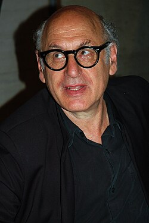

# Michael Nyman

## Biografía

Michael Laurence Nyman (nacido en Stratford, Londres, el 23 de marzo de 1944) es un pianista, musicólogo, crítico musical y compositor británico perteneciente al género musical neoclásico. Conocido sobre todo por las obras escritas durante su larga colaboración con el cineasta británico Peter Greenaway y también por su álbum multiplatino The Piano, perteneciente a la película homónima producida por Jane Campion en 1993. Las óperas que ha compuesto incluyen: The man who mistook his wife for a hat, Letters, Riddles and Writs, Noises, Sounds & Sweet Airs, Facing Goya, Man and Boy: Dada, Love Counts y Sparkie: Cage and Beyond. Además ha escrito seis conciertos, cuatro cuartetos de cuerda, y música de cámara creada para su banda Michael Nyman Band, con quienes realiza sus giras como pianista. En varias ocasiones ha declarado que prefiere componer óperas en comparación a otro tipo de música.​ En el 2008 publicó la banda sonora de la película Man on Wire, inspirada en su álbum de 2006, The Composer's Cut Series Vol. II: Nyman/Greenaway Revisited.

## Estilo musical

Ha tenido numerosos éxitos en bandas sonoras cinematográficas y su estilo es a la vez inventivo y distintivo. Entonces, ¿por qué, pregunta Nick Shave, Michael Nyman se encuentra a menudo abandonado por la marea de la opinión musical?

## Anécdotas y curiosidades

2 Subsección de cambio de carrera profesional 2.1 Trabajo como crítico musical, 1968–1976 2.2 Fundación de Campiello Band y colaboración con Peter Greenaway, 1976–1990 2.3 Década de 1990 2.4 Siglo XXI

## Top 10 bandas sonoras

1. ***Gattaca (Título en España: Gattaca)***
    * **Póster:** [link](079_michael_nyman/posters/poster_gattaca_1997.jpg)
2. ***The Piano (Título en España: El piano)***
    * **Póster:** [link](079_michael_nyman/posters/poster_the_piano_1993.jpg)
3. ***The Cook, the Thief, His Wife & Her Lover (Título en España: El cocinero, el ladrón, su mujer y su amante)***
    * **Póster:** [link](079_michael_nyman/posters/poster_the_cook_the_thief_his_wife_her_lover_1989.jpg)
4. ***Monsieur Hire (Título en España: Monsieur Hire)***
    * **Póster:** [link](079_michael_nyman/posters/poster_monsieur_hire_1989.jpg)
5. ***9 Songs (Título en España: Nueve canciones)***
    * **Póster:** [link](079_michael_nyman/posters/poster_9_songs_2004.jpg)
6. ***Ravenous (Título en España: Ravenous)***
    * **Póster:** [link](079_michael_nyman/posters/poster_ravenous_1999.jpg)
7. ***The Libertine (Título en España: The libertine)***
    * **Póster:** [link](079_michael_nyman/posters/poster_the_libertine_2004.jpg)
8. ***Carrington (Título en España: Carrington)***
    * **Póster:** [link](079_michael_nyman/posters/poster_carrington_1995.jpg)
9. ***The End of the Affair (Título en España: El fin del romance)***
    * **Póster:** [link](079_michael_nyman/posters/poster_the_end_of_the_affair_1999.jpg)
10. ***The Draughtsman's Contract (Título en España: El contrato del dibujante)***
    * **Póster:** [link](079_michael_nyman/posters/poster_the_draughtsman_s_contract_1982.jpg)

## Filmografía completa

- A Walk Through H (Título en España: A Walk Through H) (1978) · [Póster](079_michael_nyman/posters/poster_a_walk_through_h_1978.jpg)
- Vertical Features Remake (Título en España: Vertical Features Remake) (1978) · [Póster](079_michael_nyman/posters/poster_vertical_features_remake_1978.jpg)
- Brimstone & Treacle (Título en España: Brimstone & Treacle) (1982) · [Póster](079_michael_nyman/posters/poster_brimstone_treacle_1982.jpg)
- The Draughtsman's Contract (Título en España: El contrato del dibujante) (1982) · [Póster](079_michael_nyman/posters/poster_the_draughtsman_s_contract_1982.jpg)
- The Falls (Título en España: The Falls) (1982) · [Póster](079_michael_nyman/posters/poster_the_falls_1982.jpg)
- Nelly's Version (Título en España: Nelly's Version) (1983) · [Póster](079_michael_nyman/posters/poster_nelly_s_version_1983.jpg)
- The Cold Room (Título en España: El cuarto frío) (1984) · [Póster](079_michael_nyman/posters/poster_the_cold_room_1984.jpg)
- A Zed & Two Noughts (Título en España: Zoo) (1985) · [Póster](079_michael_nyman/posters/poster_a_zed_two_noughts_1985.jpg)
- The Disputation (Título en España: The Disputation) (1986) · [Póster](079_michael_nyman/posters/poster_the_disputation_1986.jpg)
- Drowning by Numbers (Título en España: Conspiración de mujeres) (1988) · [Póster](079_michael_nyman/posters/poster_drowning_by_numbers_1988.jpg)
- The Cook, the Thief, His Wife & Her Lover (Título en España: El cocinero, el ladrón, su mujer y su amante) (1989) · [Póster](079_michael_nyman/posters/poster_the_cook_the_thief_his_wife_her_lover_1989.jpg)
- Monsieur Hire (Título en España: Monsieur Hire) (1989) · [Póster](079_michael_nyman/posters/poster_monsieur_hire_1989.jpg)
- Le Mari de la coiffeuse (Título en España: El marido de la peluquera) (1990) · [Póster](079_michael_nyman/posters/poster_le_mari_de_la_coiffeuse_1990.jpg)
- Prospero's Books (Título en España: Los libros de Próspero) (1991) · [Póster](079_michael_nyman/posters/poster_prospero_s_books_1991.jpg)
- Not Mozart: Letters, Riddles and Writs (Título en España: Not Mozart: Letters, Riddles and Writs) (1991) · [Póster](079_michael_nyman/posters/poster_not_mozart_letters_riddles_and_writs_1991.jpg)
- The Michael Nyman Songbook (Título en España: The Michael Nyman Songbook) (1992) · [Póster](079_michael_nyman/posters/poster_the_michael_nyman_songbook_1992.jpg)
- Desert Passion (Título en España: Desert Passion) (1993) · [Póster](079_michael_nyman/posters/poster_desert_passion_1993.jpg)
- The Piano (Título en España: El piano) (1993) · [Póster](079_michael_nyman/posters/poster_the_piano_1993.jpg)
- Mesmer (Título en España: Mesmer) (1994) · [Póster](079_michael_nyman/posters/poster_mesmer_1994.jpg)
- À la folie (Título en España: Seis días, seis noches) (1994) · [Póster](079_michael_nyman/posters/poster_la_folie_1994.jpg)
- Carrington (Título en España: Carrington) (1995) · [Póster](079_michael_nyman/posters/poster_carrington_1995.jpg)
- アンネの日記 (Título en España: El diario de Ana Frank) (1995) · [Póster](079_michael_nyman/posters/poster_poster_1995.jpg)
- Der Unhold (Título en España: El ogro) (1996) · [Póster](079_michael_nyman/posters/poster_der_unhold_1996.jpg)
- Gattaca (Título en España: Gattaca) (1997) · [Póster](079_michael_nyman/posters/poster_gattaca_1997.jpg)
- The End of the Affair (Título en España: El fin del romance) (1999) · [Póster](079_michael_nyman/posters/poster_the_end_of_the_affair_1999.jpg)
- Ravenous (Título en España: Ravenous) (1999) · [Póster](079_michael_nyman/posters/poster_ravenous_1999.jpg)
- Wonderland (Título en España: Wonderland) (1999) · [Póster](079_michael_nyman/posters/poster_wonderland_1999.jpg)
- The Claim (Título en España: El perdón) (2000) · [Póster](079_michael_nyman/posters/poster_the_claim_2000.jpg)
- I Sold My Cadillac to Diana Dors: The Edmundo Ros Story (Título en España: I Sold My Cadillac to Diana Dors: The Edmundo Ros Story) (2000) · [Póster](079_michael_nyman/posters/poster_i_sold_my_cadillac_to_diana_dors_the_edmundo_ros_story_2000.jpg)
- 24 heures de la vie d'une femme (Título en España: 24 heures de la vie d'une femme) (2002) · [Póster](079_michael_nyman/posters/poster_24_heures_de_la_vie_d_une_femme_2002.jpg)
- Surrealissimo: The Trial of Salvador Dali (Título en España: Surrealissimo: The Trial of Salvador Dali) (2002) · [Póster](079_michael_nyman/posters/poster_surrealissimo_the_trial_of_salvador_dali_2002.jpg)
- Nathalie... (Título en España: Nathalie X) (2003) · [Póster](079_michael_nyman/posters/poster_nathalie_2003.jpg)
- The Actors (Título en España: The Actors) (2003) · [Póster](079_michael_nyman/posters/poster_the_actors_2003.jpg)
- 9 Songs (Título en España: Nueve canciones) (2004) · [Póster](079_michael_nyman/posters/poster_9_songs_2004.jpg)
- The Libertine (Título en España: The libertine) (2004) · [Póster](079_michael_nyman/posters/poster_the_libertine_2004.jpg)
- 두번째 사랑 (Título en España: Nunca por siempre) (2007) · [Póster](079_michael_nyman/posters/poster_poster_2007.jpg)
- An Organization of Dreams (Título en España: An Organization of Dreams) (2009) · [Póster](079_michael_nyman/posters/poster_an_organization_of_dreams_2009.jpg)
- 2 Graves (Título en España: 2 Graves) (2010) · [Póster](079_michael_nyman/posters/poster_2_graves_2010.jpg)
- Michael Nyman in Progress (Título en España: Michael Nyman in Progress) (2010) · [Póster](079_michael_nyman/posters/poster_michael_nyman_in_progress_2010.jpg)
- NYman with a Movie Camera (Título en España: NYman with a Movie Camera) (2010) · [Póster](079_michael_nyman/posters/poster_nyman_with_a_movie_camera_2010.jpg)
- Slow Walkers (Título en España: Slow Walkers) (2011) · [Póster](079_michael_nyman/posters/poster_slow_walkers_2011.jpg)
- The Trip (Título en España: The Trip) (2011) · [Póster](079_michael_nyman/posters/poster_the_trip_2011.jpg)
- Elefante blanco (Título en España: Elefante blanco) (2012) · [Póster](079_michael_nyman/posters/poster_elefante_blanco_2012.jpg)
- Everyday (Título en España: Everyday) (2012) · [Póster](079_michael_nyman/posters/poster_everyday_2012.jpg)
- El Hombre que vio Demasiado (Título en España: El Hombre que vio Demasiado) (2015) · [Póster](079_michael_nyman/posters/poster_el_hombre_que_vio_demasiado_2015.jpg)
- Jag är Ingrid (Título en España: Jag är Ingrid) (2015) · [Póster](079_michael_nyman/posters/poster_jag_r_ingrid_2015.jpg)

## Premios y nominaciones

* BAFTA – (Nominación)
* Globo de Oro – (Nominación)
* Premio de la Academia – (Nominación)
* Óscar – (Nominación)

## Fuentes adicionales

* [MundoBSO](https://www.mundobso.com/compositor/nyman-michael) — site:mundobso.com
* [MundoBSO (2)](https://w.mundobso.com/bso/cartero-siempre-llama-dos-veces-el) — site:mundobso.com
* [MundoBSO (3)](https://www.mundobso.com/bso/milla-verde-la) — site:mundobso.com
* [Film Score Monthly](https://www.filmscoremonthly.com/board/posts.cfm?threadID=45969&forumID=1&archive=0) — site:filmscoremonthly.com
* [Film Score Monthly (2)](https://www.filmscoremonthly.com/board/posts.cfm?threadID=139028&forumID=1&archive=0) — site:filmscoremonthly.com
* [Film Score Monthly (3)](https://www.filmscoremonthly.com/board/posts.cfm?threadID=146150&forumID=1&archive=0) — site:filmscoremonthly.com
* [SoundtrackCollector](https://www.soundtrackcollector.com/catalog/composerdiscography.php?composerid=187&offset=160) — site:soundtrackcollector.com
* [SoundtrackCollector (2)](https://www.soundtrackcollector.com/title/7085/Mari+De+La+Coiffeuse,+Le) — site:soundtrackcollector.com
* [SoundtrackCollector (3)](https://www.soundtrackcollector.com/title/7478/Piano,+The) — site:soundtrackcollector.com
* [WhatSong](https://www.whatsong.org/tvshow/how-i-met-your-mother/episode/44483) — site:whatsong.org
* [WhatSong (2)](https://www.whatsong.org/tvshow/9-1-1/episode/71629) — site:whatsong.org
* [WhatSong (3)](https://www.whatsong.org/tvshow/grown-ish/episode/82123) — site:whatsong.org

## Notas externas

* MundoBSO: Nació en Londres (Reino Unido), el 23 de marzo de 1944. Compositor sustancialmente minimalista, que se dio a conocer gracias a su participación en filmes de Peter Greenaway. Nació en Londres (Reino Unido), el 23 de marzo de 1944. Compositor sustancialmente minimalista, que se dio a conocer gracias a su participación en filmes de Peter Greenaway.
* MundoBSO (3): Compositor: Newman, Thomas Sello: Warner Duración: 66 minutos Información de la película Título original: The Green Mile Director: Frank Darabont Nacionalidad: EE UU Año: 1999 Argumento A mediados de los años treinta, un guarda de prisiones que custodia a los condenados a muerte descubre poderes sobrenaturales en un inmenso hombre negro, acusado de haber asesinado a dos niñas. Eso le llevará a creer en su inocencia. Premios Saturn: 1 nominación Compositor: Newman, Thomas Sello: Warner Duración: 66 minutos
* SoundtrackCollector (3): Piano Lesson, The (1993, Australia, título del guión original)
* WhatSong: Lily y Robin bailan con los dos nerds del último año de secundaria. Se reproduce de fondo cuando Lilly, Robin y Barney intentan entrar a la fiesta. La canción es una canción que está incluida en iMovie.
* WhatSong (2): Talking Heads - Favoritos populares 1976-1992: Sand In the Vaseline The Naked and Famous - Passive Me, Aggressive You (Remixes y caras B)
* WhatSong (3): Luca está pensando en él y en el encuentro sexual de Zoey de la noche anterior. Luca está estresado por su "yo". Texto a Zoey y su falta de respuesta.
* daily.redbullmusicacademy.com: Nacido en Stratford, Londres, en 1944, Michael Nyman se ha labrado una larga carrera como uno de los compositores más innovadores y célebres de Gran Bretaña. Después de seguir una educación clásica formal en la Royal Academy of Music, pasó un tiempo como crítico y musicólogo acuñando el término "minimalismo". En 1969 formó su propio conjunto, anteriormente conocido como Campiello Band, que solidificó gran parte de su trabajo compositivo experimental durante las siguientes tres décadas, incluidas varias partituras con el legendario director Peter Greenaway. Su inolvidable música para The Piano de Jane Campion en 1993 vendió más de tres millones de copias, y en estos extractos de su entrevista para RBMA Radio, Nyman...
* www.michaelnyman.com: La Michael Nyman Band celebra su 40 cumpleaños a lo largo de 2017; actuando en muchos eventos y festivales. Los programas incluirán música de The Draughtsman's Contract, Drowning By Numbers, Prospero's Books y Memorial (el impresionante clímax de The Cook, The Thief, His Wife and Her Lover), así como Bird List Song de la primera película experimental de Peter Greenaway, The Falls, y extractos de Six Celan Songs, War Work, NYman with a Movie Camera y música de partituras que incluyen Wonderland y The Departure de Michael Winterbottom, consulte a continuación sus próximos estrenos. eventos.
* www.ram.ac.uk: Atrás Novedades Próximos eventos Tu visita Detalles del programa de esta semana Únete a nuestra lista de correo Contacta con la Taquilla Atrás Multimedia Todo Multimedia Podcast 'Historias Cortas' de 200 Piezas
* ressources.ircam.fr: música incidental para guitarra y electrónica, Chester Music, 25 min para clarinete, trombón, piano y violonchelo, Chester Music, 4 min
* www.classical-music.com: Ha tenido numerosos éxitos en bandas sonoras cinematográficas y su estilo es a la vez inventivo y distintivo. Entonces, ¿por qué, pregunta Nick Shave, Michael Nyman se encuentra a menudo abandonado por la marea de la opinión musical? ¿Qué hará la historia con el antiguo chico de Essex, crítico franco, compositor minimalista, pianista de rock experimental, director de banda, artista visual y fanático con gafas de los Queen's Park Rangers, Michael Nyman?
* www.wisemusicclassical.com: Descrito por el compositor Christopher Fox como una “figura clave en la vida musical británica de los últimos treinta años”, el estilo distintivo de Michael Nyman es inmediatamente reconocible y familiar para la mayoría de los oyentes. Combinando la música clásica occidental con la energía de alto octanaje y la propulsión del rock y el minimalismo basado en el pulso, su música es apreciada tanto por su profundidad intelectual como por su capacidad para comunicarse directamente con los oyentes desde el principio. Tras haber impresionado por primera vez con sus dinámicas y asertivas partituras para el director artístico Peter Greenaway en los años 80, le siguió el enorme impacto y éxito de la banda sonora de The Piano (1993). Por lo tanto, Michael Nyman es visto por muchos como...
