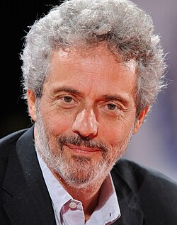

# Nicola Piovani

## Biografía

Nicola Piovani (Roma, 26 de mayo de 1946)​ es un compositor, director de orquesta y pianista italiano, que en 1998 ganó el Óscar a la «mejor banda sonora original dramática» por la partitura de La vida es bella, película de Roberto Benigni.​ Después de la secundaria, Piovani se matriculó en la Universidad Sapienza de Roma. En 1967 recibió su licenciatura en piano en el Conservatorio Verdi (en Milán). Después estudió orquestación con el compositor griego Manos Chatzidakis (1925-1994).​ En los años setenta, Piovani trabajó con Fabrizio De André para crear canciones populares.​ Entre sus obras más populares está la banda sonora de la película Intervista (de Federico Fellini), la segunda de sus tres colaboraciones con el famoso director (las otras son Ginger y Fred, y La voce della luna. Años más tarde, compuso un ballet titulado Balletto Fellini. En 2000, su galardonado partitura de La vida es bella fue nominada para un premio Grammy en la categoría «mejor composición instrumental escrita para una película, televisión u otros medios visuales», pero perdió ante Randy Newman. El 21 de mayo de 2008, en el Festival de Cine de Cannes, a la luz de su reciente trabajo con directores franceses ―en particular Danièle Thompson, Philippe Lioret y Éric-Emmanuel Schmitt―, el ministro francés de Cultura le dio el título de Caballero de la Orden de las Artes y las Letras. Hasta la fecha, Piovani tiene en su haber más de 130 bandas sonoras. Ha musicalizado Querido diario y La habitación del hijo de Nanni Moretti y recibió el premio César por la música de la película L’equipier.​ En 1998 incursionó en la ópera, con La Pietá y La isla de la luz.​ Sin embargo, ha dicho que «demasiadas músicas de película puede convertir a un compositor en una especie de mercenario, en cambio en el teatro la música es sobre todo artesanía». En consecuencia, trabaja principalmente en teatro musical, y también compone conciertos y música de cámara. Hace varios años corrió un rumor de que Nicola Piovani era un seudónimo del conocido compositor Ennio Morricone (1928−2020), un hecho que Piovani utiliza humorísticamente al hablar en público.

## Estilo musical

David de Donatello a la mejor música cinematográfica

Noticias Noticias Nuevos CD Nuevos lanzamientos Catálogos Fotos YouTube Partituras Nuevos lanzamientos Estilo + A/Z Compositores Arreglistas Gira mundial Catálogos nuevo Código de precio

## Anécdotas y curiosidades

El compositor de cine italiano Nicola Piovani saltó a la fama internacional gracias a su banda sonora ganadora del Premio de la Academia para la película de 1998 La Vita è Bella, más conocida por el público norteamericano como Roberto Benigni... Para configurar su servicio de streaming preferido, inicie sesión en su cuenta AllMusic

## Top 10 bandas sonoras

1. ***Pinocchio (Título en España: Pinocho)***
    * **Póster:** [link](083_nicola_piovani/posters/poster_pinocchio_2002.jpg)
2. ***La vita è bella (Título en España: La vida es bella)***
    * **Póster:** [link](083_nicola_piovani/posters/poster_la_vita_bella_1997.jpg)
3. ***Sbatti il mostro in prima pagina (Título en España: Noticia de una violación en primera página)***
    * **Póster:** [link](083_nicola_piovani/posters/poster_sbatti_il_mostro_in_prima_pagina_1972.jpg)
4. ***Il traditore (Título en España: El traidor)***
    * **Póster:** [link](083_nicola_piovani/posters/poster_il_traditore_2019.jpg)
5. ***Il marchese del Grillo (Título en España: El marqués del Grillo)***
    * **Póster:** [link](083_nicola_piovani/posters/poster_il_marchese_del_grillo_1981.jpg)
6. ***Caro Diario (Título en España: Caro Diario (Querido diario))***
    * **Póster:** [link](083_nicola_piovani/posters/poster_caro_diario_1993.jpg)
7. ***Ennio (Título en España: Ennio, el Maestro)***
    * **Póster:** [link](083_nicola_piovani/posters/poster_ennio_2022.jpg)
8. ***Il camorrista (Título en España: El profesor)***
    * **Póster:** [link](083_nicola_piovani/posters/poster_il_camorrista_1986.jpg)
9. ***Jamón, jamón (Título en España: Jamón, jamón)***
    * **Póster:** [link](083_nicola_piovani/posters/poster_jam_n_jam_n_1992.jpg)
10. ***La messa è finita (Título en España: La misa ha terminado)***
    * **Póster:** [link](083_nicola_piovani/posters/poster_la_messa_finita_1985.jpg)

## Filmografía completa

- La Ragazza di Latta (Título en España: La mujer robot) (1970) · [Póster](083_nicola_piovani/posters/poster_la_ragazza_di_latta_1970.jpg)
- Nel nome del padre (Título en España: En el nombre del padre) (1971) · [Póster](083_nicola_piovani/posters/poster_nel_nome_del_padre_1971.jpg)
- N.P. - Il segreto (Título en España: N.P. - Il segreto) (1972) · [Póster](083_nicola_piovani/posters/poster_n_p_il_segreto_1972.jpg)
- Sbatti il mostro in prima pagina (Título en España: Noticia de una violación en primera página) (1972) · [Póster](083_nicola_piovani/posters/poster_sbatti_il_mostro_in_prima_pagina_1972.jpg)
- Daniele e Maria (Título en España: Daniele e Maria) (1973) · [Póster](083_nicola_piovani/posters/poster_daniele_e_maria_1973.jpg)
- Il profumo della signora in nero (Título en España: Il profumo della signora in nero) (1974) · [Póster](083_nicola_piovani/posters/poster_il_profumo_della_signora_in_nero_1974.jpg)
- L'invenzione di Morel (Título en España: L'invenzione di Morel) (1974) · [Póster](083_nicola_piovani/posters/poster_l_invenzione_di_morel_1974.jpg)
- Flavia, la monaca musulmana (Título en España: La novicia musulmana) (1974) · [Póster](083_nicola_piovani/posters/poster_flavia_la_monaca_musulmana_1974.jpg)
- Vermisat (Título en España: Vermisat) (1974) · [Póster](083_nicola_piovani/posters/poster_vermisat_1974.jpg)
- Le orme (Título en España: Huellas de pisadas en la luna) (1975) · [Póster](083_nicola_piovani/posters/poster_le_orme_1975.jpg)
- Marcia trionfale (Título en España: Marcha Triunfal) (1976) · [Póster](083_nicola_piovani/posters/poster_marcia_trionfale_1976.jpg)
- Nel più alto dei cieli (Título en España: Nel più alto dei cieli) (1977) · [Póster](083_nicola_piovani/posters/poster_nel_pi_alto_dei_cieli_1977.jpg)
- Soleil des hyènes (Título en España: Soleil des hyènes) (1977) · [Póster](083_nicola_piovani/posters/poster_soleil_des_hy_nes_1977.jpg)
- Salto nel vuoto (Título en España: Salto nel vuoto) (1980) · [Póster](083_nicola_piovani/posters/poster_salto_nel_vuoto_1980.jpg)
- Vacanze in Val Trebbia (Título en España: Vacanze in Val Trebbia) (1980) · [Póster](083_nicola_piovani/posters/poster_vacanze_in_val_trebbia_1980.jpg)
- Il marchese del Grillo (Título en España: El marqués del Grillo) (1981) · [Póster](083_nicola_piovani/posters/poster_il_marchese_del_grillo_1981.jpg)
- Il minestrone (Título en España: Il minestrone) (1981) · [Póster](083_nicola_piovani/posters/poster_il_minestrone_1981.jpg)
- Colpire al cuore (Título en España: Colpire al cuore) (1982) · [Póster](083_nicola_piovani/posters/poster_colpire_al_cuore_1982.jpg)
- La notte di San Lorenzo (Título en España: La noche de San Lorenzo) (1982) · [Póster](083_nicola_piovani/posters/poster_la_notte_di_san_lorenzo_1982.jpg)
- Gli occhi, la bocca (Título en España: Los ojos, la boca) (1982) · [Póster](083_nicola_piovani/posters/poster_gli_occhi_la_bocca_1982.jpg)
- Bertoldo, Bertoldino e Cacasenno (Título en España: Bertoldo, Bertoldino e Cacasenno) (1984) · [Póster](083_nicola_piovani/posters/poster_bertoldo_bertoldino_e_cacasenno_1984.jpg)
- Kaos (Título en España: Caos) (1984) · [Póster](083_nicola_piovani/posters/poster_kaos_1984.jpg)
- Che bel paesaggio: Bitter Campari (Título en España: Che bel paesaggio: Bitter Campari) (1984) · [Póster](083_nicola_piovani/posters/poster_che_bel_paesaggio_bitter_campari_1984.jpg)
- Le due vite di Mattia Pascal (Título en España: La doble vida de Matías Pascal) (1985) · [Póster](083_nicola_piovani/posters/poster_le_due_vite_di_mattia_pascal_1985.jpg)
- La messa è finita (Título en España: La misa ha terminado) (1985) · [Póster](083_nicola_piovani/posters/poster_la_messa_finita_1985.jpg)
- Segreti segreti (Título en España: Secretos secretos) (1985) · [Póster](083_nicola_piovani/posters/poster_segreti_segreti_1985.jpg)
- Il camorrista (Título en España: El profesor) (1986) · [Póster](083_nicola_piovani/posters/poster_il_camorrista_1986.jpg)
- Speriamo che sia femmina (Título en España: Esperemos que sea mujer) (1986) · [Póster](083_nicola_piovani/posters/poster_speriamo_che_sia_femmina_1986.jpg)
- Ginger e Fred (Título en España: Ginger y Fred) (1986) · [Póster](083_nicola_piovani/posters/poster_ginger_e_fred_1986.jpg)
- Les Exploits d'un jeune Don Juan (Título en España: La iniciación (Las hazañas de un joven Don Juan)) (1986) · [Póster](083_nicola_piovani/posters/poster_les_exploits_d_un_jeune_don_juan_1986.jpg)
- Intervista (Título en España: Entrevista) (1987) · [Póster](083_nicola_piovani/posters/poster_intervista_1987.jpg)
- La sposa era bellissima (Título en España: La esposa era bellísima) (1987) · [Póster](083_nicola_piovani/posters/poster_la_sposa_era_bellissima_1987.jpg)
- I cammelli (Título en España: I cammelli) (1988) · [Póster](083_nicola_piovani/posters/poster_i_cammelli_1988.jpg)
- Manifesto (Título en España: Manifesto) (1988) · [Póster](083_nicola_piovani/posters/poster_manifesto_1988.jpg)
- Domani accadrà (Título en España: Mañana sucedera) (1988) · [Póster](083_nicola_piovani/posters/poster_domani_accadr_1988.jpg)
- 'o Re (Título en España: 'o Re) (1989) · [Póster](083_nicola_piovani/posters/poster_o_re_1989.jpg)
- 12 registi per 12 città (Título en España: 12 registi per 12 città) (1989) · [Póster](083_nicola_piovani/posters/poster_12_registi_per_12_citt_1989.jpg)
- La moglie ingenua e il marito malato (Título en España: La esposa ingenua) (1989) · [Póster](083_nicola_piovani/posters/poster_la_moglie_ingenua_e_il_marito_malato_1989.jpg)
- La soule (Título en España: La soule) (1989) · [Póster](083_nicola_piovani/posters/poster_la_soule_1989.jpg)
- Der Berg (Título en España: Der Berg) (1990) · [Póster](083_nicola_piovani/posters/poster_der_berg_1990.jpg)
- Il sole anche di notte (Título en España: El sol también sale de noche) (1990) · [Póster](083_nicola_piovani/posters/poster_il_sole_anche_di_notte_1990.jpg)
- Il male oscuro (Título en España: Il male oscuro) (1990) · [Póster](083_nicola_piovani/posters/poster_il_male_oscuro_1990.jpg)
- In nome del popolo sovrano (Título en España: In nome del popolo sovrano) (1990) · [Póster](083_nicola_piovani/posters/poster_in_nome_del_popolo_sovrano_1990.jpg)
- La voce della luna (Título en España: La voz de la Luna) (1990) · [Póster](083_nicola_piovani/posters/poster_la_voce_della_luna_1990.jpg)
- Tracce di vita amorosa (Título en España: Tracce di vita amorosa) (1990) · [Póster](083_nicola_piovani/posters/poster_tracce_di_vita_amorosa_1990.jpg)
- Hors la vie (Título en España: Hors la vie) (1991) · [Póster](083_nicola_piovani/posters/poster_hors_la_vie_1991.jpg)
- Jamón, jamón (Título en España: Jamón, jamón) (1992) · [Póster](083_nicola_piovani/posters/poster_jam_n_jam_n_1992.jpg)
- Utz (Título en España: Utz) (1992) · [Póster](083_nicola_piovani/posters/poster_utz_1992.jpg)
- Amok (Título en España: Amok) (1993) · [Póster](083_nicola_piovani/posters/poster_amok_1993.jpg)
- Caro Diario (Título en España: Caro Diario (Querido diario)) (1993) · [Póster](083_nicola_piovani/posters/poster_caro_diario_1993.jpg)
- Una questione privata (Título en España: Una questione privata) (1993) · [Póster](083_nicola_piovani/posters/poster_una_questione_privata_1993.jpg)
- Vivre nu : À la recherche du paradis perdu (Título en España: Vivre nu : À la recherche du paradis perdu) (1993) · [Póster](083_nicola_piovani/posters/poster_vivre_nu_la_recherche_du_paradis_perdu_1993.jpg)
- C'è Kim Novak al telefono (Título en España: C'è Kim Novak al telefono) (1994) · [Póster](083_nicola_piovani/posters/poster_c_kim_novak_al_telefono_1994.jpg)
- La teta y la luna (Título en España: La teta y la luna) (1994) · [Póster](083_nicola_piovani/posters/poster_la_teta_y_la_luna_1994.jpg)
- De vliegende Hollander (Título en España: El holandés errante) (1995) · [Póster](083_nicola_piovani/posters/poster_de_vliegende_hollander_1995.jpg)
- Sale gosse (Título en España: Sale gosse) (1995) · [Póster](083_nicola_piovani/posters/poster_sale_gosse_1995.jpg)
- La mia generazione (Título en España: La mia generazione) (1996) · [Póster](083_nicola_piovani/posters/poster_la_mia_generazione_1996.jpg)
- Camere da letto (Título en España: Camere da letto) (1997) · [Póster](083_nicola_piovani/posters/poster_camere_da_letto_1997.jpg)
- El impostor (Título en España: El impostor) (1997) · [Póster](083_nicola_piovani/posters/poster_el_impostor_1997.jpg)
- La vita è bella (Título en España: La vida es bella) (1997) · [Póster](083_nicola_piovani/posters/poster_la_vita_bella_1997.jpg)
- Uomo d'acqua dolce (Título en España: Uomo d'acqua dolce) (1997) · [Póster](083_nicola_piovani/posters/poster_uomo_d_acqua_dolce_1997.jpg)
- Amor nello specchio (Título en España: Amor nello specchio) (1999) · [Póster](083_nicola_piovani/posters/poster_amor_nello_specchio_1999.jpg)
- No Trains No Planes (Título en España: Café Central) (1999) · [Póster](083_nicola_piovani/posters/poster_no_trains_no_planes_1999.jpg)
- Running Free (Título en España: Corriendo libre) (1999) · [Póster](083_nicola_piovani/posters/poster_running_free_1999.jpg)
- Dolce far niente (Título en España: Dolce far niente) (1999) · [Póster](083_nicola_piovani/posters/poster_dolce_far_niente_1999.jpg)
- La fame e la sete (Título en España: La fame e la sete) (1999) · [Póster](083_nicola_piovani/posters/poster_la_fame_e_la_sete_1999.jpg)
- La carbonara (Título en España: La carbonara) (2000) · [Póster](083_nicola_piovani/posters/poster_la_carbonara_2000.jpg)
- Vipera (Título en España: Vipera) (2000) · [Póster](083_nicola_piovani/posters/poster_vipera_2000.jpg)
- Das Sams (Título en España: Das Sams) (2001) · [Póster](083_nicola_piovani/posters/poster_das_sams_2001.jpg)
- La stanza del figlio (Título en España: La habitación del hijo) (2001) · [Póster](083_nicola_piovani/posters/poster_la_stanza_del_figlio_2001.jpg)
- Il nostro matrimonio è in crisi (Título en España: Il nostro matrimonio è in crisi) (2002) · [Póster](083_nicola_piovani/posters/poster_il_nostro_matrimonio_in_crisi_2002.jpg)
- Pinocchio (Título en España: Pinocho) (2002) · [Póster](083_nicola_piovani/posters/poster_pinocchio_2002.jpg)
- The Magic of Fellini (Título en España: The Magic of Fellini) (2002) · [Póster](083_nicola_piovani/posters/poster_the_magic_of_fellini_2002.jpg)
- La tivù di Fellini (Título en España: La tivù di Fellini) (2003) · [Póster](083_nicola_piovani/posters/poster_la_tiv_di_fellini_2003.jpg)
- Sams in Gefahr (Título en España: Sams in Gefahr) (2003) · [Póster](083_nicola_piovani/posters/poster_sams_in_gefahr_2003.jpg)
- L'Équipier (Título en España: El extraño) (2004) · [Póster](083_nicola_piovani/posters/poster_l_quipier_2004.jpg)
- La trappola di Maigret (Título en España: La trampa) (2004) · [Póster](083_nicola_piovani/posters/poster_la_trappola_di_maigret_2004.jpg)
- L'ombra cinese (Título en España: Maigret: La sombra china) (2004) · [Póster](083_nicola_piovani/posters/poster_l_ombra_cinese_2004.jpg)
- La tigre e la neve (Título en España: El tigre y la nieve) (2005) · [Póster](083_nicola_piovani/posters/poster_la_tigre_e_la_neve_2005.jpg)
- Fauteuils d'orchestre (Título en España: Fauteuils d'orchestre) (2006) · [Póster](083_nicola_piovani/posters/poster_fauteuils_d_orchestre_2006.jpg)
- Je vais bien, ne t'en fais pas (Título en España: Je vais bien, ne t'en fais pas) (2006) · [Póster](083_nicola_piovani/posters/poster_je_vais_bien_ne_t_en_fais_pas_2006.jpg)
- Amore che vieni, amore che vai (Título en España: Amore che vieni, amore che vai) (2007) · [Póster](083_nicola_piovani/posters/poster_amore_che_vieni_amore_che_vai_2007.jpg)
- Odette Toulemonde (Título en España: Odette, una comedia sobre la felicidad) (2007) · [Póster](083_nicola_piovani/posters/poster_odette_toulemonde_2007.jpg)
- Ballerina (Título en España: Ballerina) (2008) · [Póster](083_nicola_piovani/posters/poster_ballerina_2008.jpg)
- Le Code a changé (Título en España: Cena de Amigos) (2009) · [Póster](083_nicola_piovani/posters/poster_le_code_a_chang_2009.jpg)
- L'uomo nero (Título en España: L'uomo nero) (2009) · [Póster](083_nicola_piovani/posters/poster_l_uomo_nero_2009.jpg)
- Welcome (Título en España: Welcome) (2009) · [Póster](083_nicola_piovani/posters/poster_welcome_2009.jpg)
- Vittorio racconta Gassman: Una vita da mattatore (Título en España: Vittorio racconta Gassman: Una vita da mattatore) (2010) · [Póster](083_nicola_piovani/posters/poster_vittorio_racconta_gassman_una_vita_da_mattatore_2010.jpg)
- Boris - Il film (Título en España: Boris - Il film) (2011) · [Póster](083_nicola_piovani/posters/poster_boris_il_film_2011.jpg)
- La visita meravigliosa: Viaggio in Italia sulle tracce di Nino Rota (Título en España: La visita meravigliosa: Viaggio in Italia sulle tracce di Nino Rota) (2011) · [Póster](083_nicola_piovani/posters/poster_la_visita_meravigliosa_viaggio_in_italia_sulle_tracce_di_nino_rota_2011.jpg)
- Comme un chef (Título en España: El Chef, la receta de la felicidad) (2012) · [Póster](083_nicola_piovani/posters/poster_comme_un_chef_2012.jpg)
- La Cerise sur le Gâteau (Título en España: La Cerise sur le Gâteau) (2012) · [Póster](083_nicola_piovani/posters/poster_la_cerise_sur_le_g_teau_2012.jpg)
- Banana (Título en España: Banana) (2015) · [Póster](083_nicola_piovani/posters/poster_banana_2015.jpg)
- Hungry Hearts (Título en España: Hungry Hearts) (2015) · [Póster](083_nicola_piovani/posters/poster_hungry_hearts_2015.jpg)
- L'amore non perdona (Título en España: L'amore non perdona) (2015) · [Póster](083_nicola_piovani/posters/poster_l_amore_non_perdona_2015.jpg)
- In arte Nino (Título en España: In arte Nino) (2016) · [Póster](083_nicola_piovani/posters/poster_in_arte_nino_2016.jpg)
- Le confessioni (Título en España: Las confesiones) (2016) · [Póster](083_nicola_piovani/posters/poster_le_confessioni_2016.jpg)
- A casa tutti bene (Título en España: En casa todo está bien) (2018) · [Póster](083_nicola_piovani/posters/poster_a_casa_tutti_bene_2018.jpg)
- Una festa esagerata (Título en España: Una festa esagerata) (2018) · [Póster](083_nicola_piovani/posters/poster_una_festa_esagerata_2018.jpg)
- Il traditore (Título en España: El traidor) (2019) · [Póster](083_nicola_piovani/posters/poster_il_traditore_2019.jpg)
- Mi chiamo Altan e faccio vignette (Título en España: Mi chiamo Altan e faccio vignette) (2019) · [Póster](083_nicola_piovani/posters/poster_mi_chiamo_altan_e_faccio_vignette_2019.jpg)
- Hammamet (Título en España: Hammamet) (2020) · [Póster](083_nicola_piovani/posters/poster_hammamet_2020.jpg)
- Gli anni più belli (Título en España: Nuestros mejores años) (2020) · [Póster](083_nicola_piovani/posters/poster_gli_anni_pi_belli_2020.jpg)
- Fellinopolis (Título en España: Fellinopolis) (2021) · [Póster](083_nicola_piovani/posters/poster_fellinopolis_2021.jpg)
- I Fratelli De Filippo (Título en España: I Fratelli De Filippo) (2021) · [Póster](083_nicola_piovani/posters/poster_i_fratelli_de_filippo_2021.jpg)
- Les Amours d’Anaïs (Título en España: Los amores de Anaïs) (2021) · [Póster](083_nicola_piovani/posters/poster_les_amours_d_ana_s_2021.jpg)
- Ennio (Título en España: Ennio, el Maestro) (2022) · [Póster](083_nicola_piovani/posters/poster_ennio_2022.jpg)
- Il sangue e la parola - Non la spada ma la parola illumini la via (Título en España: Il sangue e la parola - Non la spada ma la parola illumini la via) (2022) · [Póster](083_nicola_piovani/posters/poster_il_sangue_e_la_parola_non_la_spada_ma_la_parola_illumini_la_via_2022.jpg)
- Il signore delle formiche (Título en España: Il signore delle formiche) (2022) · [Póster](083_nicola_piovani/posters/poster_il_signore_delle_formiche_2022.jpg)
- Luigi Proietti detto Gigi (Título en España: Luigi Proietti detto Gigi) (2022) · [Póster](083_nicola_piovani/posters/poster_luigi_proietti_detto_gigi_2022.jpg)
- Le mie ragazze di carta (Título en España: Le mie ragazze di carta) (2023) · [Póster](083_nicola_piovani/posters/poster_le_mie_ragazze_di_carta_2023.jpg)
- Cento e oltre. Puccini e noi (Título en España: Cento e oltre. Puccini e noi) (2025) · [Póster](083_nicola_piovani/posters/poster_cento_e_oltre_puccini_e_noi_2025.jpg)
- Siamo in un film di Alberto Sordi? (Título en España: Siamo in un film di Alberto Sordi?) (2025) · [Póster](083_nicola_piovani/posters/poster_siamo_in_un_film_di_alberto_sordi_2025.jpg)

## Premios y nominaciones

* 1999 – Premio de la Academia a la mejor banda sonora dramática original – por *인생은 아름다워 (Título en España: Life Is Beautiful)* – (Ganador)
* 1999 – Premio de la Academia a la mejor banda sonora dramática original – por *인생은 아름다워 (Título en España: Life Is Beautiful)* – (Nominación)
* Caballero de las Artes y las Letras – (Ganador)
* Ciak d'oro - mejor banda sonora – (Ganador)
* Cinta de plata a la mejor puntuación – (Ganador)
* Comandante de la Orden del Mérito de la República Italiana – (Ganador)
* David di Donatello a la mejor música – (Ganador)
* Premio Cinearti La chioma di Berenice – (Ganador)
* Q48803752 – (Ganador)

## Fuentes adicionales

* [MundoBSO](https://w.mundobso.com/bso/cartero-siempre-llama-dos-veces-el) — site:mundobso.com
* [MundoBSO (2)](https://mundobso.com) — site:mundobso.com
* [MundoBSO (3)](https://mundobso.com) — site:mundobso.com
* [Film Score Monthly](https://www.filmscoremonthly.com/backissues/viewissue.cfm?issueID=80) — site:filmscoremonthly.com
* [Film Score Monthly (2)](https://filmscoremonthly.com/board/posts.cfm?threadID=152112&forumID=1&archive=0) — site:filmscoremonthly.com
* [Film Score Monthly (3)](https://www.filmscoremonthly.com/daily/article.cfm?articleID=7809) — site:filmscoremonthly.com
* [SoundtrackCollector](https://www.soundtrackcollector.com/catalog/composerdiscography.php?composerid=114) — site:soundtrackcollector.com
* [SoundtrackCollector (2)](https://www.soundtrackcollector.com/title/9553/Vita+%C3%A8+Bella,+La) — site:soundtrackcollector.com
* [SoundtrackCollector (3)](https://www.soundtrackcollector.com/title/66744/35+MM+The+Best+Of+Nicola+Piovani) — site:soundtrackcollector.com
* [WhatSong](https://www.whatsong.org/tvshow/how-i-met-your-mother/episode/44483) — site:whatsong.org
* [WhatSong (2)](https://www.whatsong.org/tvshow/banshee/episode/45083) — site:whatsong.org
* [WhatSong (3)](https://www.whatsong.org/tvshow/prison-break/episode/37396) — site:whatsong.org

## Notas externas

* WhatSong: Lily y Robin bailan con los dos nerds del último año de secundaria. Se reproduce de fondo cuando Lilly, Robin y Barney intentan entrar a la fiesta. La canción es una canción que está incluida en iMovie.
* WhatSong (2): Luella y el sol - Vuela tan libre / Un día nos topamos con la muerte - Single Hood entra a la taberna y se va con algunos sándwiches.
* WhatSong (3): Ramin Djawadi - Prison Break: Temporadas 3 y 4 (Banda sonora original de televisión) Ramin Djawadi - Prison Break: Temporadas 3 y 4 (Banda sonora original de televisión)
* www.elmundo.es: Castilla y León El correo de Burgos Diario de Soria Diario de Valladolid Economía Economía Actualidad económica Consumistas Macroeconomía Empresas Vivienda INnovadores Los más ricos
* www.hafabramusic.com: Noticias Noticias Nuevos CD Nuevos lanzamientos Catálogos Fotos YouTube Partituras Nuevos lanzamientos Estilo + A/Z Compositores Arreglistas Gira mundial Catálogos nuevo Código de precio
* www.allmusic.com: El compositor de cine italiano Nicola Piovani saltó a la fama internacional gracias a su banda sonora ganadora del Premio de la Academia para la película de 1998 La Vita è Bella, más conocida por el público norteamericano como Roberto Benigni... Para configurar su servicio de streaming preferido, inicie sesión en su cuenta AllMusic
* www.nicolapiovani.net: Citas Próximas citas Historial Citas Imágenes Galería de fotos En buena compañía Galerías de fotos en concierto Fotos HD Galería de vídeos
* classical.music.apple.com: PIOVANI La vida es bella âLa vida es bellaâ 43 PIOVANI La vida es bella Suite âLa vida es bella Suiteâ 7
* themoviescores.com: Barrio de Trionfale, Roma, Lacio, Italia, 26 de mayo de 1946 Pianista, conductor de orquesta y compositor italiano de música teatral, canciones y música de cámara, que ha forjado una importante carrera en la música cinematográfica a partir de la década del setenta, contando con más de doscientas bandas sonoras en su haber, y colaborando con muchos de los más grandes directores de Italia.
* www.hafabramusic.com: Partituras Nuevo estilo + A/Z Compositores Arreglistas Gira mundial Catálogos nuevo Código de precio Nicola Piovani (nacido el 26 de mayo de 1946) es un músico italiano de música clásica ligera, compositor de música para teatro y cine, y ganador del Oscar a la mejor banda sonora dramática original en 1998 por la banda sonora de la película de Roberto Benigni La Vita è bella, más conocida por el público de habla inglesa como La vida es bella. Después de la secundaria, Piovani se matriculó en la Universidad Sapienza de Roma. Se licenció en piano en el Conservatorio Verdi de Milán en 1967 y posteriormente estudió orquestación.
* www.nicolapiovani.net: Citas Próximas citas Historial Citas Imágenes Galería de fotos En buena compañía Galerías de fotos en concierto Fotos HD Galería de vídeos
* lampoonmagazine.com: Una mañana de finales de agosto, junto a las canchas de tenis del Lido de Venecia, Nicola Piovani comparte algunas anécdotas de una carrera que cuenta con más de doscientas películas; colaboraciones con directores desde la segunda mitad del siglo XX hasta la actualidad; elogios de la crítica tanto en Italia como en Francia; un Premio de la Academia por La vida es bella, de Roberto Benigni, y mucho más. Este artículo fue posible gracias a Cartier, patrocinador del 81º Festival Internacional de Cine de Venecia, organizado por La Biennale di Venezia. La imagen del encabezado captura el concierto de Nicola Piovani para Cartier el 30 de agosto de 2024 en el Open Space de Venecia.
