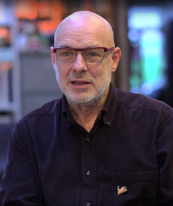

# Brian Eno

## Biografía

Brian Peter George Eno (Woodbridge, Suffolk, 15 de mayo de 1948), artísticamente Brian Eno, es un compositor, activista,​ cantante, artista conceptual, artista visual, ingeniero de audio, inventor, escritor, fotógrafo y productor musical inglés.​ A lo largo de su trayectoria ha desarrollado trabajos en géneros musicales como el ambient -del que se le considera un pionero-,​ el glam-rock -con Roxy Music-,​ la música electrónica​ y experimental.​ Considerado un visionario y un innovador en muchos campos de la música,​ también ha desarrollado trabajos en otras disciplinas artísticas, en especial las instalaciones y las artes visuales.​ Fue el compositor del archivo de sonido de inicio de sesión de Windows 95, denominado «The Microsoft Sound», y ha colaborado en el desarrollo del generador de música algorítmica Kōan.​ En su trayectoria ha obtenido galardones en los premios BRIT (1994 y 1996), BAFTA (2012) y Grammy (1988, 2001, 2002, 2006, 2009 y 2010).​ Ha colaborado en proyectos conjuntos con artistas como Robert Fripp, Cluster, Harold Budd, David Bowie o David Byrne y producido álbumes para artistas como John Cale, Talking Heads, Devo, Ultravox, U2, Laurie Anderson, Grace Jones, Slowdive, Coldplay, James Blake, Kevin Shields, Camel, Travis, James o Damon Albarn. En 1996 Eno, entre otros, fundó la Long Now Foundation, con el fin de enseñar a la gente a pensar sobre el futuro de la sociedad a muy largo plazo.​ Es columnista en el periódico británico The Observer.

## Estilo musical

Brian Peter George Eno ( Woodbridge, Suffolk, 15 de mayo de 1948), artísticamente Brian Eno, es un compositor, activista, [ 1 ] ​ cantante, artista conceptual, artista visual, ingeniero de audio, inventor, escritor, fotógrafo y productor musical inglés. [ 2 ] ​ A lo largo de su trayectoria ha desarrollado trabajos en géneros musicales como el ambient -del que se le considera un pionero-, [ 3 ] ​ el glam-rock -con Roxy Music -, [ 4 ] ​ la música electrónica [ 5 ] ​ y experimental. [ 6 ] ​

## Anécdotas y curiosidades

2 Subsección de cambio de carrera 2.1 Década de 1970 2.2 Década de 1980 2.3 Década de 1990 2.4 Década de 2000 2.5 Década de 2010 2.6 Década de 2020 2.7 Productor discográfico 2.8 Microsoft Sound 2.9 Trabajo en vídeo 2.10 Música generativa 2.10.1 Música generativa 1 2.10.2 Extractos publicados

## Top 10 bandas sonoras

1. ***Dune (Título en España: Dune)***
    * **Póster:** [link](088_brian_eno/posters/poster_dune_1984.jpg)
2. ***The Lovely Bones (Título en España: The Lovely Bones)***
    * **Póster:** [link](088_brian_eno/posters/poster_the_lovely_bones_2009.jpg)
3. ***Opera (Título en España: Terror en la ópera)***
    * **Póster:** [link](088_brian_eno/posters/poster_opera_1987.jpg)
4. ***Me and Earl and the Dying Girl (Título en España: Yo, él y Raquel)***
    * **Póster:** [link](088_brian_eno/posters/poster_me_and_earl_and_the_dying_girl_2015.jpg)
5. ***The Jacket (Título en España: The jacket)***
    * **Póster:** [link](088_brian_eno/posters/poster_the_jacket_2005.jpg)
6. ***Jubilee (Título en España: Jubilee)***
    * **Póster:** [link](088_brian_eno/posters/poster_jubilee_1978.jpg)
7. ***Sebastiane (Título en España: Sebastiane)***
    * **Póster:** [link](088_brian_eno/posters/poster_sebastiane_1976.jpg)
8. ***The Pillow Book (Título en España: The Pillow Book)***
    * **Póster:** [link](088_brian_eno/posters/poster_the_pillow_book_1995.jpg)
9. ***Coldplay: A Head Full of Dreams (Título en España: Coldplay: A Head Full of Dreams)***
    * **Póster:** [link](088_brian_eno/posters/poster_coldplay_a_head_full_of_dreams_2018.jpg)
10. ***The Pervert's Guide to Cinema (Título en España: Guía de cine para pervertidos)***
    * **Póster:** [link](088_brian_eno/posters/poster_the_pervert_s_guide_to_cinema_2006.jpg)

## Filmografía completa

- Eno (Título en España: Eno) (1973) · [Póster](088_brian_eno/posters/poster_eno_1973.jpg)
- The Devil's Men (Título en España: Poseidos por el demonio) (1976) · [Póster](088_brian_eno/posters/poster_the_devil_s_men_1976.jpg)
- Sebastiane (Título en España: Sebastiane) (1976) · [Póster](088_brian_eno/posters/poster_sebastiane_1976.jpg)
- Alternative 3 (Título en España: Alternative 3) (1977) · [Póster](088_brian_eno/posters/poster_alternative_3_1977.jpg)
- Jubilee (Título en España: Jubilee) (1978) · [Póster](088_brian_eno/posters/poster_jubilee_1978.jpg)
- Roxette (Título en España: Roxette) (1978) · [Póster](088_brian_eno/posters/poster_roxette_1978.jpg)
- Remembrance (Título en España: Remembrance) (1982) · [Póster](088_brian_eno/posters/poster_remembrance_1982.jpg)
- Dune (Título en España: Dune) (1984) · [Póster](088_brian_eno/posters/poster_dune_1984.jpg)
- Frevel (Título en España: Frevel) (1984) · [Póster](088_brian_eno/posters/poster_frevel_1984.jpg)
- Oblique Strategist Too (Título en España: Oblique Strategist Too) (1984) · [Póster](088_brian_eno/posters/poster_oblique_strategist_too_1984.jpg)
- The Kitchen Presents: Two Moon July (Título en España: The Kitchen Presents: Two Moon July) (1986) · [Póster](088_brian_eno/posters/poster_the_kitchen_presents_two_moon_july_1986.jpg)
- Opera (Título en España: Terror en la ópera) (1987) · [Póster](088_brian_eno/posters/poster_opera_1987.jpg)
- Brian Eno:  Imaginary Landscapes (Título en España: Brian Eno:  Imaginary Landscapes) (1989) · [Póster](088_brian_eno/posters/poster_brian_eno_imaginary_landscapes_1989.jpg)
- One Eno (Título en España: One Eno) (1993) · [Póster](088_brian_eno/posters/poster_one_eno_1993.jpg)
- Words for the Dying (Título en España: Words for the Dying) (1993) · [Póster](088_brian_eno/posters/poster_words_for_the_dying_1993.jpg)
- Pavarotti & Friends 3 - Together for the Children of Bosnia (Título en España: Pavarotti & Friends 3 - Together for the Children of Bosnia) (1995) · [Póster](088_brian_eno/posters/poster_pavarotti_friends_3_together_for_the_children_of_bosnia_1995.jpg)
- The Making of the 'Outside' Album (Título en España: The Making of the 'Outside' Album) (1995) · [Póster](088_brian_eno/posters/poster_the_making_of_the_outside_album_1995.jpg)
- The Pillow Book (Título en España: The Pillow Book) (1995) · [Póster](088_brian_eno/posters/poster_the_pillow_book_1995.jpg)
- Classic Albums: U2 - The Joshua Tree (Título en España: Classic Albums: U2 - The Joshua Tree) (1999) · [Póster](088_brian_eno/posters/poster_classic_albums_u2_the_joshua_tree_1999.jpg)
- Simon mágus (Título en España: Simon mágus) (1999) · [Póster](088_brian_eno/posters/poster_simon_m_gus_1999.jpg)
- Anton Corbijn: Geen Stil Leven (Título en España: Anton Corbijn: Geen Stil Leven) (2000) · [Póster](088_brian_eno/posters/poster_anton_corbijn_geen_stil_leven_2000.jpg)
- Buddy Boy (Título en España: Buddy Boy) (2000) · [Póster](088_brian_eno/posters/poster_buddy_boy_2000.jpg)
- Free Will And Testament: The Robert Wyatt Story (Título en España: Free Will And Testament: The Robert Wyatt Story) (2001) · [Póster](088_brian_eno/posters/poster_free_will_and_testament_the_robert_wyatt_story_2001.jpg)
- In the Ocean (Título en España: In the Ocean) (2001) · [Póster](088_brian_eno/posters/poster_in_the_ocean_2001.jpg)
- Roxy Music Musikladen 1973 (Título en España: Roxy Music Musikladen 1973) (2001) · [Póster](088_brian_eno/posters/poster_roxy_music_musikladen_1973_2001.jpg)
- 1 Giant Leap (Título en España: 1 Giant Leap) (2002) · [Póster](088_brian_eno/posters/poster_1_giant_leap_2002.jpg)
- David Bowie - Sound and Vision (Título en España: David Bowie - Sound and Vision) (2003) · [Póster](088_brian_eno/posters/poster_david_bowie_sound_and_vision_2003.jpg)
- Fear X (Título en España: Fear X) (2003) · [Póster](088_brian_eno/posters/poster_fear_x_2003.jpg)
- Clean (Título en España: Clean) (2004) · [Póster](088_brian_eno/posters/poster_clean_2004.jpg)
- Roxy Music: Inside 1972-1974 (Título en España: Roxy Music: Inside 1972-1974) (2004) · [Póster](088_brian_eno/posters/poster_roxy_music_inside_1972_1974_2004.jpg)
- The Jacket (Título en España: The jacket) (2005) · [Póster](088_brian_eno/posters/poster_the_jacket_2005.jpg)
- The Pervert's Guide to Cinema (Título en España: Guía de cine para pervertidos) (2006) · [Póster](088_brian_eno/posters/poster_the_pervert_s_guide_to_cinema_2006.jpg)
- Scott Walker: 30 Century Man (Título en España: Scott Walker: 30 Century Man) (2007) · [Póster](088_brian_eno/posters/poster_scott_walker_30_century_man_2007.jpg)
- Roxy Music - The Thrill of It All: A Visual History 1972-1982 (Título en España: Roxy Music - The Thrill of It All: A Visual History 1972-1982) (2008) · [Póster](088_brian_eno/posters/poster_roxy_music_the_thrill_of_it_all_a_visual_history_1972_1982_2008.jpg)
- Linear (Título en España: Linear) (2009) · [Póster](088_brian_eno/posters/poster_linear_2009.jpg)
- Roxy Music: More Than This - The Story of Roxy Music (Título en España: Roxy Music: More Than This - The Story of Roxy Music) (2009) · [Póster](088_brian_eno/posters/poster_roxy_music_more_than_this_the_story_of_roxy_music_2009.jpg)
- The Lovely Bones (Título en España: The Lovely Bones) (2009) · [Póster](088_brian_eno/posters/poster_the_lovely_bones_2009.jpg)
- Brian Eno: Another Green World (Título en España: Brian Eno: Another Green World) (2010) · [Póster](088_brian_eno/posters/poster_brian_eno_another_green_world_2010.jpg)
- U2360° Tour: Squaring The Circle (Título en España: U2360° Tour: Squaring The Circle) (2010) · [Póster](088_brian_eno/posters/poster_u2360_tour_squaring_the_circle_2010.jpg)
- Brian Eno 1971–1977: The Man Who Fell To Earth (Título en España: Brian Eno 1971–1977: The Man Who Fell To Earth) (2011) · [Póster](088_brian_eno/posters/poster_brian_eno_1971_1977_the_man_who_fell_to_earth_2011.jpg)
- Ride, Rise, Roar (Título en España: Ride, Rise, Roar) (2011) · [Póster](088_brian_eno/posters/poster_ride_rise_roar_2011.jpg)
- The British Guide to Showing Off (Título en España: The British Guide to Showing Off) (2011) · [Póster](088_brian_eno/posters/poster_the_british_guide_to_showing_off_2011.jpg)
- U2: From the Sky Down (Título en España: U2: From The Sky Down) (2011) · [Póster](088_brian_eno/posters/poster_u2_from_the_sky_down_2011.jpg)
- David Bowie: Five Years (Título en España: David Bowie: Cinco años) (2013) · [Póster](088_brian_eno/posters/poster_david_bowie_five_years_2013.jpg)
- We Are Many (Título en España: We Are Many) (2014) · [Póster](088_brian_eno/posters/poster_we_are_many_2014.jpg)
- What Difference Does It Make? (Título en España: What Difference Does It Make?) (2014) · [Póster](088_brian_eno/posters/poster_what_difference_does_it_make_2014.jpg)
- Slowdive: Souvlaki (Título en España: Slowdive: Souvlaki) (2015) · [Póster](088_brian_eno/posters/poster_slowdive_souvlaki_2015.jpg)
- Me and Earl and the Dying Girl (Título en España: Yo, él y Raquel) (2015) · [Póster](088_brian_eno/posters/poster_me_and_earl_and_the_dying_girl_2015.jpg)
- Coldplay: A Head Full of Dreams (Título en España: Coldplay: A Head Full of Dreams) (2018) · [Póster](088_brian_eno/posters/poster_coldplay_a_head_full_of_dreams_2018.jpg)
- 2025: The Long Hot Winter (Título en España: 2025: The Long Hot Winter) (2019) · [Póster](088_brian_eno/posters/poster_2025_the_long_hot_winter_2019.jpg)
- The SpongeBob Musical: Live on Stage! (Título en España: The SpongeBob Musical: Live on Stage!) (2019) · [Póster](088_brian_eno/posters/poster_the_spongebob_musical_live_on_stage_2019.jpg)
- The Year of the Everlasting Storm (Título en España: The Year of the Everlasting Storm) (2021) · [Póster](088_brian_eno/posters/poster_the_year_of_the_everlasting_storm_2021.jpg)
- CAN and Me (Título en España: CAN and Me) (2022) · [Póster](088_brian_eno/posters/poster_can_and_me_2022.jpg)
- Roxy Music and Bryan Ferry at the BBC (Título en España: Roxy Music and Bryan Ferry at the BBC) (2022) · [Póster](088_brian_eno/posters/poster_roxy_music_and_bryan_ferry_at_the_bbc_2022.jpg)
- We Are As Gods (Título en España: We Are As Gods) (2022) · [Póster](088_brian_eno/posters/poster_we_are_as_gods_2022.jpg)
- Brian Eno & Roger Eno: Live at the Acropolis, Athens (Título en España: Brian Eno & Roger Eno: Live at the Acropolis, Athens) (2023) · [Póster](088_brian_eno/posters/poster_brian_eno_roger_eno_live_at_the_acropolis_athens_2023.jpg)
- DEVO (Título en España: DEVO) (2024) · [Póster](088_brian_eno/posters/poster_devo_2024.jpg)
- Daedalus (Título en España: Daedalus) (2024) · [Póster](088_brian_eno/posters/poster_daedalus_2024.jpg)
- Eno (Título en España: Eno) (2024) · [Póster](088_brian_eno/posters/poster_eno_2024.jpg)
- Together for Palestine (Título en España: Together for Palestine) (2025) · [Póster](088_brian_eno/posters/poster_together_for_palestine_2025.jpg)

## Premios y nominaciones

* 1994 – Premio de Música de Frankfurt – (Ganador)
* 2012 – Diseñador real para la industria – (Ganador)
* Salón de la fama del rock and roll – (Ganador)

## Fuentes adicionales

* [MundoBSO](https://www.mundobso.com/compositor/eno-brian) — site:mundobso.com
* [MundoBSO (2)](https://w.mundobso.com/bso/cartero-siempre-llama-dos-veces-el) — site:mundobso.com
* [MundoBSO (3)](https://www.mundobso.com/bso/capitan-america-civil-war) — site:mundobso.com
* [Film Score Monthly](https://filmscoremonthly.com/daily/article.cfm?articleID=7846) — site:filmscoremonthly.com
* [Film Score Monthly (2)](https://www.filmscoremonthly.com/board/posts.cfm?threadID=157571) — site:filmscoremonthly.com
* [Film Score Monthly (3)](https://filmscoremonthly.com/daily/article.cfm?articleID=7845) — site:filmscoremonthly.com
* [SoundtrackCollector](https://www.soundtrackcollector.com/title/7472/Opera) — site:soundtrackcollector.com
* [SoundtrackCollector (2)](https://www.soundtrackcollector.com) — site:soundtrackcollector.com
* [SoundtrackCollector (3)](https://www.soundtrackcollector.com/title/92163/Wall+Street:+Money+Never+Sleeps) — site:soundtrackcollector.com
* [WhatSong](https://www.whatsong.org/tvshow/mr-robot/episode/48313) — site:whatsong.org
* [WhatSong (2)](https://www.whatsong.org/tvshow/northern-exposure/episode/36187) — site:whatsong.org
* [WhatSong (3)](https://www.whatsong.org/movie/wall-street-money-never-sleeps) — site:whatsong.org

## Notas externas

* MundoBSO: Nació en Woodbridge (Reino Unido), el 15 de mayo de 1948. Compositor de música electrónica que ha alcanzado un amplio prestigio en su prolífica carrera musical, donde ha publicado numerosos álbumes. En el cine, su participación es más puntual. Nació en Woodbridge (Reino Unido), el 15 de mayo de 1948. Compositor de música electrónica que ha alcanzado un amplio prestigio en su prolífica carrera musical, donde ha publicado numerosos álbumes. En el cine, su participación es más puntual.
* MundoBSO (3): Compositor: Jackman, Henry Sello: Hollywood Duración: 69 minutos Información de la película Título original: Captain America: Civil War Director: Anthony Russo, Joe Russo Nacionalidad: EE UU Año: 2016 Argumento Continuación de Captain America: The Winter Soldier (14). Cuando otro incidente internacional involucra a Los Vengadores y causan varios daños colaterales, aumentan las presiones políticas para exigir más responsabilidades y determinar cuándo deben contratar los servicios del grupo de superhéroes. Esta nueva situación dividirá a Los Vengadores, mientras intentan proteger al mundo de un nuevo y terrible villano. Compositor: Jackman, Henry Sello: Hollywood Duración: 69 minutos
* SoundtrackCollector (2): 14 de enero - Confesión de un comisionado de policía de Riz Ortolani a la fiscalía 3 de diciembre - Wolf Hall de Debbie Wiseman: El espejo y la luz
* WhatSong: El jefe de AllSafe hablando con su marido Este no es Brian Eno. Suena más como la banda sonora de Drive: Wrong Floor - Cliff Martinez Maxence Cyrin - It's Kind of a Funny Story (Música de la película)
* WhatSong (2): Escena final, Ed y Chris bailan con la Princesa la Grulla. Escena final, Ed y Chris bailan con la Princesa la Grulla.
* WhatSong (3): 00:01 Primera canción cuando la limusina recoge a un chico de la prisión. Brian Eno - Todo lo que sucede, sucederá hoy
* www.publico.es: El músico británico reta al público con un disco de música instrumental basado en la improvisación Brian Eno está relajado. Mientras otros artistas no salen del cuarto del baño sin tenerlo todo controlado a sabiendas de que su música tendrá una breve esperanza de vida en el mercado, él ofrece su disco con la idea de que perdurará, aunque la gente no provoque disturbios en las tiendas para comprarlo.
* tapeop.com: Con sus primeros años en Roxy Music, álbumes artísticos en solitario en los años 70, la creación y conceptualización de música "ambient", colaboraciones innovadoras con David Bowie y como productor de álbumes para Devo, Talking Heads, U2, James y Coldplay, Brian Eno no debería necesitar presentación para los lectores de esta revista. Probablemente nadie ha discutido y analizado tanto el arte de capturar música como Eno. Obviamente está dotado de una mente constantemente activa. Durante mucho tiempo ha sido un sueño para mí conocer a este hombre, así como también hacerle preguntas sobre la música y el arte de grabar. Un reciente día soleado en Londres nos encontró a John y a mí caminando por una calle sin salida que conduce al taller de Eno cerca del...
* music.hyperreal.org: De Downbeat, probablemente 1979. Amablemente mecanografiado y proporcionado por David Bass. Brian Eno pronunció la siguiente conferencia durante New Music New York, el primer Festival New Music America patrocinado en 1979 por Kitchen. Sus comentarios fueron amplificados por demostraciones de sus propias grabaciones; Aquí hemos intentado extraer el sentido general de sus puntos más específicos.
* mixdownmag.com.au: Brian Eno, artista visual, compositor, productor discográfico y autodenominado “no músico”, fue el cerebro detrás de algunos de los mejores álbumes de todos los tiempos, incluidos algunos propios. Quizás el artista conceptual más prolífico de la música del siglo XX, Eno cumplió 74 años en la última quincena. Hoy, echamos un vistazo a algunas de las formas en que Eno definió y cambió el panorama de la música tal como la conocemos.
* www.britannica.com: Nuestros editores revisarán lo que ha enviado y determinarán si deben revisar el artículo. BBC - La entrevista - Artista y músico - Brian Eno
* britishmusiccollection.org.uk: Brian Eno o simplemente como Eno, es un músico, compositor, productor discográfico, cantante y artista visual inglés, conocido como uno de los principales innovadores de la música ambiental. Eno fue alumno de Roy Ascott en su Groundcourse en Ipswich Civic College. Luego estudió en la escuela de arte Colchester Institute en Essex, Inglaterra, inspirándose en la pintura minimalista. Durante su estancia en el curso de arte del Instituto, también adquirió experiencia en tocar y hacer música a través de sesiones de enseñanza realizadas en la escuela de música adyacente. Se unió a la banda Roxy Music como sintetizador a principios de la década de 1970. El éxito de Roxy Music en la escena del glam rock llegó rápidamente, pero Eno pronto se cansó de hacer giras y de...
