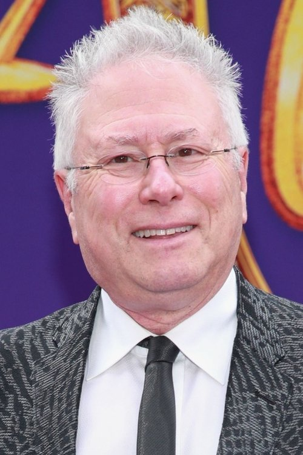

# Alan Menken

## Biografía

El término Alan (también Alán), un nombre, puede referirse, en esta enciclopedia:

## Estilo musical

Otros proyectos de FSO FSO Big Band FSO Film en Concierto Total Soundtrack Los Bridgerton en Concierto

El compositor Alan Menken nos habla sobre su trabajo componiendo los temas nuevos para 'La Bella y la Bestia' y sus intenciones para los futuros proyectos de Disney. Puede que no conozcas su nombre, pero deberías porque es probable que tu infancia haya sido marcada a fuego por su trabajo. Alan Menken, compositor de bandas sonoras de Disney inolvidables como ' Aladdin ' o ' Hércules ', nos concedió una entrevista en la que se mostró cercano y sencillo, incluso nos dio una agradable sorpresa al final. En la entrevista nos ha contado cómo fue el trabajo con Bill Condon y cómo se plantearon tanto las tres nuevas composiciones para ' La Bella y la Bestia ' como la reedición de las clásicas. Como...

## Anécdotas y curiosidades

2 Alternancia de carrera Subsección de carrera 2.1 1974–1987: inicio de carrera y avance 2.2 1989–2007: trabajo en Disney Renaissance y Broadway 2.3 2008–2016: regreso a Broadway 2.4 2017–presente: películas de acción real de Disney

## Top 10 bandas sonoras

1. ***Tangled (Título en España: Enredados)***
    * **Póster:** [link](089_alan_menken/posters/poster_tangled_2010.jpg)
2. ***Beauty and the Beast (Título en España: La bella y la bestia)***
    * **Póster:** [link](089_alan_menken/posters/poster_beauty_and_the_beast_1991.jpg)
3. ***Aladdin (Título en España: Aladdin)***
    * **Póster:** [link](089_alan_menken/posters/poster_aladdin_1992.jpg)
4. ***Pocahontas (Título en España: Pocahontas)***
    * **Póster:** [link](089_alan_menken/posters/poster_pocahontas_1995.jpg)
5. ***The Little Mermaid (Título en España: La sirenita)***
    * **Póster:** [link](089_alan_menken/posters/poster_the_little_mermaid_1989.jpg)
6. ***The Hunchback of Notre Dame (Título en España: El jorobado de Notre Dame)***
    * **Póster:** [link](089_alan_menken/posters/poster_the_hunchback_of_notre_dame_1996.jpg)

## Filmografía completa

- Little Shop of Horrors (Título en España: La tienda de los horrores) (1986) · [Póster](089_alan_menken/posters/poster_little_shop_of_horrors_1986.jpg)
- The Little Mermaid (Título en España: La sirenita) (1989) · [Póster](089_alan_menken/posters/poster_the_little_mermaid_1989.jpg)
- Beauty and the Beast (Título en España: La bella y la bestia) (1991) · [Póster](089_alan_menken/posters/poster_beauty_and_the_beast_1991.jpg)
- Aladdin (Título en España: Aladdin) (1992) · [Póster](089_alan_menken/posters/poster_aladdin_1992.jpg)
- The Making of Aladdin: A Whole New World (Título en España: The Making of Aladdin: A Whole New World) (1992) · [Póster](089_alan_menken/posters/poster_the_making_of_aladdin_a_whole_new_world_1992.jpg)
- Life with Mikey (Título en España: ¡Dadme un respiro!) (1993) · [Póster](089_alan_menken/posters/poster_life_with_mikey_1993.jpg)
- Aladdin on Ice (Título en España: Aladdin on Ice) (1995) · [Póster](089_alan_menken/posters/poster_aladdin_on_ice_1995.jpg)
- Pocahontas (Título en España: Pocahontas) (1995) · [Póster](089_alan_menken/posters/poster_pocahontas_1995.jpg)
- Beauty and the Beast: A Concert on Ice (Título en España: Beauty and the Beast: A Concert on Ice) (1996) · [Póster](089_alan_menken/posters/poster_beauty_and_the_beast_a_concert_on_ice_1996.jpg)
- The Hunchback of Notre Dame (Título en España: El jorobado de Notre Dame) (1996) · [Póster](089_alan_menken/posters/poster_the_hunchback_of_notre_dame_1996.jpg)
- Hercules (Título en España: Hércules) (1997) · [Póster](089_alan_menken/posters/poster_hercules_1997.jpg)
- Listen to Her Heart: The Life and Music of Laurie Beechman (Título en España: Listen to Her Heart: The Life and Music of Laurie Beechman) (2003) · [Póster](089_alan_menken/posters/poster_listen_to_her_heart_the_life_and_music_of_laurie_beechman_2003.jpg)
- Diamond in the Rough: The Making of Aladdin (Título en España: Diamond in the Rough: The Making of Aladdin) (2004) · [Póster](089_alan_menken/posters/poster_diamond_in_the_rough_the_making_of_aladdin_2004.jpg)
- Noel (Título en España: Noel) (2004) · [Póster](089_alan_menken/posters/poster_noel_2004.jpg)
- Home on the Range (Título en España: Zafarrancho en el rancho) (2004) · [Póster](089_alan_menken/posters/poster_home_on_the_range_2004.jpg)
- The Shaggy Dog (Título en España: Cariño, estoy hecho un perro) (2006) · [Póster](089_alan_menken/posters/poster_the_shaggy_dog_2006.jpg)
- Treasures Untold: The Making of Disney's 'The Little Mermaid' (Título en España: Treasures Untold: The Making of Disney's 'The Little Mermaid') (2006) · [Póster](089_alan_menken/posters/poster_treasures_untold_the_making_of_disney_s_the_little_mermaid_2006.jpg)
- Enchanted (Título en España: Encantada: La historia de Giselle) (2007) · [Póster](089_alan_menken/posters/poster_enchanted_2007.jpg)
- Waking Sleeping Beauty (Título en España: Despertando a la Bella Durmiente) (2009) · [Póster](089_alan_menken/posters/poster_waking_sleeping_beauty_2009.jpg)
- The Boys: The Sherman Brothers' Story (Título en España: La historia secreta de los hermanos Sherman) (2009) · [Póster](089_alan_menken/posters/poster_the_boys_the_sherman_brothers_story_2009.jpg)
- Beyond Beauty: The Untold Stories Behind the Making of Beauty and the Beast (Título en España: Beyond Beauty: The Untold Stories Behind the Making of Beauty and the Beast) (2010) · [Póster](089_alan_menken/posters/poster_beyond_beauty_the_untold_stories_behind_the_making_of_beauty_and_the_beast_2010.jpg)
- Tangled (Título en España: Enredados) (2010) · [Póster](089_alan_menken/posters/poster_tangled_2010.jpg)
- Mirror Mirror (Título en España: Blancanieves (Mirror, Mirror)) (2012) · [Póster](089_alan_menken/posters/poster_mirror_mirror_2012.jpg)
- Behind the Magic: Snow White and the Seven Dwarfs (Título en España: Behind the Magic: Snow White and the Seven Dwarfs) (2015) · [Póster](089_alan_menken/posters/poster_behind_the_magic_snow_white_and_the_seven_dwarfs_2015.jpg)
- Disney's Broadway Hits at London's Royal Albert Hall (Título en España: Disney's Broadway Hits at London's Royal Albert Hall) (2016) · [Póster](089_alan_menken/posters/poster_disney_s_broadway_hits_at_london_s_royal_albert_hall_2016.jpg)
- Sausage Party (Título en España: La fiesta de las salchichas) (2016) · [Póster](089_alan_menken/posters/poster_sausage_party_2016.jpg)
- Beauty and the Beast (Título en España: La bella y la bestia) (2017) · [Póster](089_alan_menken/posters/poster_beauty_and_the_beast_2017.jpg)
- Howard (Título en España: Howard) (2018) · [Póster](089_alan_menken/posters/poster_howard_2018.jpg)
- Aladdin (Título en España: Aladdín) (2019) · [Póster](089_alan_menken/posters/poster_aladdin_2019.jpg)
- The Little Mermaid Live! (Título en España: El maravilloso mundo de Disney presenta: ¡La sirenita en directo!) (2019) · [Póster](089_alan_menken/posters/poster_the_little_mermaid_live_2019.jpg)
- An Evening with Alan Menken (Título en España: An Evening with Alan Menken) (2020) · [Póster](089_alan_menken/posters/poster_an_evening_with_alan_menken_2020.jpg)
- The Disney Family Singalong (Título en España: La familia Disney cantando juntos) (2020) · [Póster](089_alan_menken/posters/poster_the_disney_family_singalong_2020.jpg)
- Disenchanted (Título en España: Desencantada: Vuelve Giselle) (2022) · [Póster](089_alan_menken/posters/poster_disenchanted_2022.jpg)
- Hollywood in Vienna 2022: A Celebration of Disney Classics - Featuring Alan Menken (Título en España: Hollywood in Vienna 2022: A Celebration of Disney Classics - Featuring Alan Menken) (2022) · [Póster](089_alan_menken/posters/poster_hollywood_in_vienna_2022_a_celebration_of_disney_classics_featuring_alan_menken_2022.jpg)
- The Little Mermaid (Título en España: La sirenita) (2023) · [Póster](089_alan_menken/posters/poster_the_little_mermaid_2023.jpg)
- Spellbound (Título en España: Hechizados) (2024) · [Póster](089_alan_menken/posters/poster_spellbound_2024.jpg)

## Premios y nominaciones

* 1987 – Premio de la Academia a la mejor canción original – por *Mean Green Mother From Outer Space* – (Nominación)
* 1989 – Premio Globo de Oro a la Mejor Canción Original – por *Kiss the Girls (Título en España: El coleccionista de amantes)* – (Nominación)
* 1990 – Premio Globo de Oro a la Mejor Canción Original – por *The Little Mermaid (Título en España: La sirenita)* – (Ganador)
* 1990 – Premio Globo de Oro a la mejor banda sonora original – por *The Little Mermaid (Título en España: La sirenita)* – (Ganador)
* 1990 – Premio de la Academia a la mejor banda sonora original – por *The Little Mermaid (Título en España: La sirenita)* – (Ganador)
* 1990 – Premio de la Academia a la mejor banda sonora original – por *The Little Mermaid (Título en España: La sirenita)* – (Nominación)
* 1990 – Premio de la Academia a la mejor canción original – por *The Little Mermaid (Título en España: La sirenita)* – (Ganador)
* 1991 – Premio Golden Raspberry a la peor canción original – por *The Measure of a Man (Título en España: The Measure of a Man)* – (Nominación)
* 1991 – Premio Grammy a la mejor canción escrita para medios visuales – por *The Little Mermaid (Título en España: La sirenita)* – (Ganador)
* 1991 – Premio Grammy al Mejor Álbum de Música Infantil – por *The Little Mermaid: Original Motion Picture Soundtrack* – (Ganador)
* 1992 – Premio Globo de Oro a la Mejor Canción Original – por *Beauty and the Beast (Título en España: La bella y la bestia)* – (Ganador)
* 1992 – Premio Globo de Oro a la mejor banda sonora original – por *Beauty and the Beast (Título en España: La bella y la bestia)* – (Ganador)
* 1992 – Premio de la Academia a la mejor banda sonora original – por *Beauty and the Beast (Título en España: La bella y la bestia)* – (Ganador)
* 1992 – Premio de la Academia a la mejor banda sonora original – por *Beauty and the Beast (Título en España: La bella y la bestia)* – (Nominación)
* 1992 – Premio de la Academia a la mejor canción original – por *Beauty and the Beast (Título en España: La bella y la bestia)* – (Ganador)
* 1993 – Premio Globo de Oro a la Mejor Canción Original – por *The Making of Aladdin: A Whole New World (Título en España: The Making of Aladdin: A Whole New World)* – (Ganador)
* 1993 – Premio Globo de Oro a la Mejor Canción Original – por *Aladdin (Título en España: Aladdín)* – (Ganador)
* 1993 – Premio Globo de Oro a la mejor banda sonora original – por *Aladdin (Título en España: Aladdín)* – (Ganador)
* 1993 – Premio Grammy a la mejor banda sonora para medios visuales – por *Beauty and the Beast: Original Motion Picture Soundtrack* – (Ganador)
* 1993 – Premio Grammy a la mejor canción escrita para medios visuales – por *Beauty and the Beast (Título en España: La bella y la bestia)* – (Ganador)
* 1993 – Premio Grammy al Mejor Álbum Musical para Niños – por *Beauty and the Beast: Original Motion Picture Soundtrack* – (Ganador)
* 1993 – Premio de la Academia a la mejor banda sonora original – por *Aladdin (Título en España: Aladdín)* – (Ganador)
* 1993 – Premio de la Academia a la mejor banda sonora original – por *Aladdin (Título en España: Aladdín)* – (Nominación)
* 1993 – Premio de la Academia a la mejor canción original – por *The Making of Aladdin: A Whole New World (Título en España: The Making of Aladdin: A Whole New World)* – (Ganador)
* 1994 – Premio Grammy a la Canción del Año – por *A Whole New World (Aladdin’s Theme)* – (Ganador)
* 1994 – Premio Grammy a la Canción del Año – por *Aladdin (Título en España: Aladdín)* – (Ganador)
* 1994 – Premio Grammy a la mejor banda sonora para medios visuales – por *Aladdin: Original Motion Picture Soundtrack* – (Ganador)
* 1994 – Premio Grammy a la mejor canción escrita para medios visuales – por *The Making of Aladdin: A Whole New World (Título en España: The Making of Aladdin: A Whole New World)* – (Ganador)
* 1994 – Premio Grammy a la mejor canción escrita para medios visuales – por *Aladdin (Título en España: Aladdín)* – (Ganador)
* 1994 – Premio Grammy al Mejor Álbum Musical para Niños – por *Aladdin: Original Motion Picture Soundtrack* – (Ganador)
* 1994 – Premio Tony a la mejor banda sonora original – por *Beauty and the Beast (Título en España: La bella y la bestia)* – (Nominación)
* 1996 – Premio Globo de Oro a la Mejor Canción Original – por *Disney Sing-Along Songs: Colors of the Wind (Título en España: Disney Sing-Along Songs: Colors of the Wind)* – (Ganador)
* 1996 – Premio Grammy a la mejor canción escrita para medios visuales – por *Disney Sing-Along Songs: Colors of the Wind (Título en España: Disney Sing-Along Songs: Colors of the Wind)* – (Ganador)
* 1996 – Premio de la Academia a la mejor banda sonora original de comedia o musical – por *Pocahontas (Título en España: Pocahontas)* – (Ganador)
* 1996 – Premio de la Academia a la mejor banda sonora original de comedia o musical – por *Pocahontas (Título en España: Pocahontas)* – (Nominación)
* 1996 – Premio de la Academia a la mejor canción original – por *Disney Sing-Along Songs: Colors of the Wind (Título en España: Disney Sing-Along Songs: Colors of the Wind)* – (Ganador)
* 1997 – Premio de la Academia a la mejor banda sonora original de comedia o musical – por *The Hunchback of Notre Dame (Título en España: El jorobado de Notre Dame)* – (Nominación)
* 1998 – Premio de la Academia a la mejor canción original – por *かぞくへ (Título en España: かぞくへ)* – (Nominación)
* 2001 – Leyendas de Disney – (Ganador)
* 2008 – Premio Tony a la mejor banda sonora original – por *The Little Mermaid The Musical (Título en España: The Little Mermaid The Musical)* – (Nominación)
* 2008 – Premio de la Academia a la mejor canción original – por *Happy Working Song* – (Nominación)
* 2008 – Premio de la Academia a la mejor canción original – por *So Close (Título en España: So Close)* – (Nominación)
* 2008 – Premio de la Academia a la mejor canción original – por *仮面ライダーゼロワン カンガルーからナニが飛び出す？そんなの自分でカンガルー！はい、或人じゃないと！ (Título en España: Kamen Rider Zero-One: ¿Qué saldrá del canguro? ¡Piénsalo tú mismo! ¡Si! ¡Debo ser yo, Aruto!)* – (Nominación)
* 2011 – Premio Tony a la mejor banda sonora original – por *Sister Act (Título en España: Sister Act (Una monja de cuidado))* – (Nominación)
* 2011 – Premio de la Academia a la mejor canción original – por *I'm Beginning To See the Light (Título en España: I'm Beginning To See the Light)* – (Nominación)
* 2012 – Premio Grammy a la mejor canción escrita para medios visuales – por *Tangled (Título en España: Enredados)* – (Ganador)
* 2012 – Premio Tony a la mejor banda sonora original – por *Newsies (Título en España: Newsies)* – (Ganador)
* 2014 – Premio Tony a la mejor banda sonora original – por *Aladdin (Título en España: Aladdín)* – (Nominación)
* Premio Emmy diurno – (Ganador)
* Premio Globo de Oro a la Mejor Canción Original – por *Ali Zaoua, prince de la rue (Título en España: Ali Zaoua, príncipe de Casablanca)* – (Nominación)
* Premio de la liga dramática – (Ganador)
* estrella en el Paseo de la Fama de Hollywood – (Ganador)

## Fuentes adicionales

* [MundoBSO](https://www.mundobso.com/compositor/menken-alan) — site:mundobso.com
* [MundoBSO (2)](https://www.mundobso.com/bso/hercules-alan-menken) — site:mundobso.com
* [MundoBSO (3)](https://www.mundobso.com/bso/lobo-y-el-leon-el) — site:mundobso.com
* [Film Score Monthly](https://filmscoremonthly.com/board/posts.cfm?forumID=1&pageID=4&threadID=108893&archive=0) — site:filmscoremonthly.com
* [Film Score Monthly (2)](https://www.filmscoremonthly.com/board/posts.cfm?forumID=1&pageID=4&threadID=108893&archive=0) — site:filmscoremonthly.com
* [Film Score Monthly (3)](https://www.filmscoremonthly.com/board/posts.cfm?threadID=20585&forumID=1&archive=1) — site:filmscoremonthly.com
* [SoundtrackCollector](https://www.soundtrackcollector.com/title/7136/Aladdin) — site:soundtrackcollector.com
* [SoundtrackCollector (2)](https://www.soundtrackcollector.com/title/2019/Little+Mermaid,+The) — site:soundtrackcollector.com
* [SoundtrackCollector (3)](https://www.soundtrackcollector.com) — site:soundtrackcollector.com
* [WhatSong](https://www.whatsong.org/movie/the-adventures-of-pocahontas-indian-princess) — site:whatsong.org
* [WhatSong (2)](https://www.whatsong.org/movie/the-little-mermaid) — site:whatsong.org
* [WhatSong (3)](https://www.whatsong.org/movie/tangled) — site:whatsong.org

## Notas externas

* MundoBSO: Nació en Nueva York (EE UU), el 22 de julio de 1949. Comenzó a trabajar en el teatro a finales de los setenta, obteniendo en 1982 un importante éxito con "Little Shop of Horrors", cuya versión cinematográfica supondría su debut en el cine. Los estudios Disney le encargaron que escribiese la partitura de The Little Mermaid (89), y a partir de ahí su carrera fue fulminante. Nació en Nueva York (EE UU), el 22 de julio de 1949. Comenzó a trabajar en el teatro a finales de los setenta, obteniendo en 1982 un importante éxito con "Little Shop of Horrors", cuya versión cinematográfica supondría su debut en el cine. Los estudios Disney le encargaron que escribiese la partitura de The Little Mermaid...
* MundoBSO (2): Compositor: Menken, Alan Sello: Disney Duración: 48 minutos Información de la película Título original: Hercules Director: Ron Clements, John Musker Nacionalidad: EE UU Año: 1997 Argumento Libre adaptación del clásico de la mitología griega, realizado por la Disney en dibujos animados, con las aventuras del joven Hércules, hijo del dios Zeus, que debe convertirse en héroe para poder ser inmortal. Premios Oscar: 1 nominación Globos de oro: 1 nominación Compositor: Menken, Alan Sello: Disney Duración: 48 minutos
* MundoBSO (3): Compositor: Amar, Armand Sello: Long Distance Duración: 54 minutos Información de la película Título original: Le loup et le lion Director: Gilles de Maistre Nacionalidad: Francia Año: 2021 Argumento Una joven regresa a la casa de su infancia en una isla de Canadá. Allí su vida da un vuelco cuando rescata a un cachorro de lobo y a un cachorro de león. A medida que los animales crecen, los tres forman un vínculo inseparable, hasta que son separados. Compositor: Amar, Armand Sello: Long Distance Duración: 54 minutos
* SoundtrackCollector (3): 14 de enero - Confesión de un comisionado de policía de Riz Ortolani a la fiscalía 3 de diciembre - Wolf Hall de Debbie Wiseman: El espejo y la luz
* WhatSong: 00:01 Un barco que transportaba colonos británicos de la Compañía Virginia navega hacia América del Norte en busca de oro. Estalla una tormenta y Smith salva la vida de Thomas cuando cae por la borda.
* WhatSong (2): Alan Menken - La Sirenita (Banda sonora original de Walt Disney Records) [Edición especial] 00:01 Eric disfruta del viaje por mar. Los marineros le hablan del rey Tritón.
* WhatSong (3): Mandy Moore - Enredados (Banda Sonora de la Película) 00:05 Rapunzel canta por la mañana mientras limpia su torre con Pascal su camaleón.
* www.ecartelera.com: El compositor Alan Menken nos habla sobre su trabajo componiendo los temas nuevos para 'La Bella y la Bestia' y sus intenciones para los futuros proyectos de Disney. Puede que no conozcas su nombre, pero deberías porque es probable que tu infancia haya sido marcada a fuego por su trabajo. Alan Menken, compositor de bandas sonoras de Disney inolvidables como ' Aladdin ' o ' Hércules ', nos concedió una entrevista en la que se mostró cercano y sencillo, incluso nos dio una agradable sorpresa al final. En la entrevista nos ha contado cómo fue el trabajo con Bill Condon y cómo se plantearon tanto las tres nuevas composiciones para ' La Bella y la Bestia ' como la reedición de las clásicas. Como...
* filmsymphony.es: Otros proyectos FSO FSO Big Band FSO Film in Concert Total Soundtrack Los Bridgerton en Concierto Galería FSO en Imágenes FSO en Vídeos FSO en Prensa escrita FSO en Televisión
* www.denvercenter.org: English English Español Français Deutsch Italiano 한국어 简体中文 日本語 Русский Tiếng Việt العربية Afsoomaali Visítenos TEATROS Y ASIENTOS Teatro Buell Ópera Ellie Caulkins Teatro Garner Galleria Teatro Jones Teatro Kilstrom Teatro Conservatorio Randy Weeks Teatro Singleton Teatro Wolf MAPAS, DIRECCIONES Y ESTACIONAMIENTO Planifique su visita Mapas, direcciones y estacionamiento Restaurantes Tours entre bastidores Hoteles Servicios de accesibilidad Guía para principiantes BOX OFFICE & WILL CALL Nuestros agentes de taquilla están aquí para ayudar: en persona, por correo electrónico, por teléfono y en línea. Además, los agentes están disponibles en cada lobby una hora y media antes del telón. APRENDE MÁS
* www.aperionaudio.com: Altavoces por tipo Altavoces por tipo Altavoces de torre Altavoces de estantería Altavoces de canal central Instalación personalizada Subwoofers Super Tweeters Instalación personalizada Instalación personalizada Altavoces Clearus de pared y de pared Theatrus Cinema Studio
* www.alanmenken.com: La grabación Hercules Original London Cast se lanzará el 10 de octubre para descarga y transmisión digital, el 21 de noviembre en CD y el 5 de diciembre en vinilo. La adaptación teatral del éxito de Disney se estrena en el Theatre Royal Drury Lane el 24 de junio de 2025.
