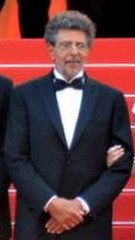

# Gabriel Yared

## Biografía

Gabriel Yared (Beirut, 6 de octubre de 1949) es un compositor libanés conocido principalmente por su trabajo en el cine francés y estadounidense. Su trabajo en Francia incluye las bandas sonoras de Betty Blue y Camille Claudel. Más tarde comenzó a trabajar en películas de idioma inglés, concretamente las dirigidas por Anthony Minghella. Ganó un Premio Oscar y un Premio Grammy por su trabajo en El paciente inglés (1996) y fue nominado por El talento de Mr. Ripley (1999) y Cold Mountain (2003).

## Estilo musical

2 Partituras de películas Alternar subsección de partituras de películas 2.1 Banda sonora de Troya

Sam y Dean cortan leña para una pira funeraria mientras recuerdan su tiempo con Charlie. La mejor fuente en línea de música de películas y televisión. Copyright © 2018 - 2026 Whatsong.org. Reservados todos los derechos.

## Anécdotas y curiosidades

Gabriel Yared (árabe: غبريال يارد; nacido el 7 de octubre de 1949) es un compositor francés-libanés, más conocido por su trabajo en el cine francés y estadounidense.

## Top 10 bandas sonoras

1. ***The Talented Mr. Ripley (Título en España: El talento de Mr. Ripley)***
    * **Póster:** [link](090_gabriel_yared/posters/poster_the_talented_mr_ripley_1999.jpg)
2. ***The English Patient (Título en España: El paciente inglés)***
    * **Póster:** [link](090_gabriel_yared/posters/poster_the_english_patient_1996.jpg)
3. ***Cold Mountain (Título en España: Cold Mountain)***
    * **Póster:** [link](090_gabriel_yared/posters/poster_cold_mountain_2003.jpg)
4. ***City of Angels (Título en España: City of Angels)***
    * **Póster:** [link](090_gabriel_yared/posters/poster_city_of_angels_1998.jpg)
5. ***1408 (Título en España: 1408)***
    * **Póster:** [link](090_gabriel_yared/posters/poster_1408_2007.jpg)
6. ***Das Leben der Anderen (Título en España: La vida de los otros)***
    * **Póster:** [link](090_gabriel_yared/posters/poster_das_leben_der_anderen_2006.jpg)
7. ***Judy (Título en España: Judy)***
    * **Póster:** [link](090_gabriel_yared/posters/poster_judy_2019.jpg)
8. ***L'Amant (Título en España: El amante)***
    * **Póster:** [link](090_gabriel_yared/posters/poster_l_amant_1992.jpg)
9. ***37°2 le matin (Título en España: Betty Blue)***
    * **Póster:** [link](090_gabriel_yared/posters/poster_37_2_le_matin_1986.jpg)
10. ***Message in a Bottle (Título en España: Mensaje en una botella)***
    * **Póster:** [link](090_gabriel_yared/posters/poster_message_in_a_bottle_1999.jpg)

## Filmografía completa

- Sauve qui peut (la vie) (Título en España: Salve quien pueda, la vida) (1980) · [Póster](090_gabriel_yared/posters/poster_sauve_qui_peut_la_vie_1980.jpg)
- Malevil (Título en España: Malevil) (1981) · [Póster](090_gabriel_yared/posters/poster_malevil_1981.jpg)
- حروب صغيرة (Título en España: حروب صغيرة) (1982) · [Póster](090_gabriel_yared/posters/poster_poster_1982.jpg)
- Hanna K. (Título en España: Hanna K.) (1983) · [Póster](090_gabriel_yared/posters/poster_hanna_k_1983.jpg)
- La Java des Ombres (Título en España: La Java des Ombres) (1983) · [Póster](090_gabriel_yared/posters/poster_la_java_des_ombres_1983.jpg)
- La Lune dans le caniveau (Título en España: La luna bajo el asfalto) (1983) · [Póster](090_gabriel_yared/posters/poster_la_lune_dans_le_caniveau_1983.jpg)
- Sarah (Título en España: Sarah) (1983) · [Póster](090_gabriel_yared/posters/poster_sarah_1983.jpg)
- Nemo (Título en España: Dream one, sueños interminables) (1984) · [Póster](090_gabriel_yared/posters/poster_nemo_1984.jpg)
- La Diagonale du fou (Título en España: La diagonal del loco) (1984) · [Póster](090_gabriel_yared/posters/poster_la_diagonale_du_fou_1984.jpg)
- Tir à vue (Título en España: Tir à vue) (1984) · [Póster](090_gabriel_yared/posters/poster_tir_vue_1984.jpg)
- وداعا بونابرت (Título en España: Adiós, Bonaparte) (1985) · [Póster](090_gabriel_yared/posters/poster_poster_1985.jpg)
- La prisonnière (Título en España: La prisionera) (1985) · [Póster](090_gabriel_yared/posters/poster_la_prisonni_re_1985.jpg)
- Le téléphone sonne toujours deux fois (Título en España: Le téléphone sonne toujours deux fois) (1985) · [Póster](090_gabriel_yared/posters/poster_le_t_l_phone_sonne_toujours_deux_fois_1985.jpg)
- 37°2 le matin (Título en España: Betty Blue) (1986) · [Póster](090_gabriel_yared/posters/poster_37_2_le_matin_1986.jpg)
- Désordre (Título en España: Désordre) (1986) · [Póster](090_gabriel_yared/posters/poster_d_sordre_1986.jpg)
- Agent Trouble (Título en España: Agent Trouble) (1987) · [Póster](090_gabriel_yared/posters/poster_agent_trouble_1987.jpg)
- Comment Wang-Fô fut sauvé (Título en España: Cómo se salvó Wang Fo) (1987) · [Póster](090_gabriel_yared/posters/poster_comment_wang_f_fut_sauv_1987.jpg)
- Gandahar (Título en España: Gandahar, los años luz) (1987) · [Póster](090_gabriel_yared/posters/poster_gandahar_1987.jpg)
- L'Homme voilé (Título en España: L'Homme voilé) (1987) · [Póster](090_gabriel_yared/posters/poster_l_homme_voil_1987.jpg)
- Beyond Therapy (Título en España: Tres en un diván) (1987) · [Póster](090_gabriel_yared/posters/poster_beyond_therapy_1987.jpg)
- Camille Claudel (Título en España: La pasión de Camille Claudel) (1988) · [Póster](090_gabriel_yared/posters/poster_camille_claudel_1988.jpg)
- Le Testament d'un poète juif assassiné (Título en España: Le Testament d'un poète juif assassiné) (1988) · [Póster](090_gabriel_yared/posters/poster_le_testament_d_un_po_te_juif_assassin_1988.jpg)
- Les Saisons du plaisir (Título en España: Les Saisons du plaisir) (1988) · [Póster](090_gabriel_yared/posters/poster_les_saisons_du_plaisir_1988.jpg)
- Une nuit à l'Assemblée Nationale (Título en España: Une nuit à l'Assemblée Nationale) (1988) · [Póster](090_gabriel_yared/posters/poster_une_nuit_l_assembl_e_nationale_1988.jpg)
- Romero (Título en España: Romero) (1989) · [Póster](090_gabriel_yared/posters/poster_romero_1989.jpg)
- La Putain du roi (Título en España: La puta del rey) (1990) · [Póster](090_gabriel_yared/posters/poster_la_putain_du_roi_1990.jpg)
- Les 1001 nuits (Título en España: Les 1001 nuits) (1990) · [Póster](090_gabriel_yared/posters/poster_les_1001_nuits_1990.jpg)
- Tatie Danielle (Título en España: Qué hacemos con la abuela (Tatie Danielle)) (1990) · [Póster](090_gabriel_yared/posters/poster_tatie_danielle_1990.jpg)
- Vincent & Theo (Título en España: Vincent y Theo) (1990) · [Póster](090_gabriel_yared/posters/poster_vincent_theo_1990.jpg)
- L'Amant (Título en España: El amante) (1992) · [Póster](090_gabriel_yared/posters/poster_l_amant_1992.jpg)
- IP5: L'île aux pachydermes (Título en España: IP5: L'île aux pachydermes) (1992) · [Póster](090_gabriel_yared/posters/poster_ip5_l_le_aux_pachydermes_1992.jpg)
- La Fille de l'air (Título en España: La Fille de l'air) (1992) · [Póster](090_gabriel_yared/posters/poster_la_fille_de_l_air_1992.jpg)
- The First Circle (Título en España: The First Circle) (1992) · [Póster](090_gabriel_yared/posters/poster_the_first_circle_1992.jpg)
- Map of the Human Heart (Título en España: El mapa del sentimiento humano) (1993) · [Póster](090_gabriel_yared/posters/poster_map_of_the_human_heart_1993.jpg)
- Les Marmottes (Título en España: Les Marmottes) (1993) · [Póster](090_gabriel_yared/posters/poster_les_marmottes_1993.jpg)
- Profil Bas (Título en España: Profil Bas) (1993) · [Póster](090_gabriel_yared/posters/poster_profil_bas_1993.jpg)
- Des feux mal éteints (Título en España: Des feux mal éteints) (1994) · [Póster](090_gabriel_yared/posters/poster_des_feux_mal_teints_1994.jpg)
- Fall from Grace (Título en España: Operación Fortaleza) (1994) · [Póster](090_gabriel_yared/posters/poster_fall_from_grace_1994.jpg)
- Guillaumet, les ailes du courage (Título en España: Guillaumet, les ailes du courage) (1995) · [Póster](090_gabriel_yared/posters/poster_guillaumet_les_ailes_du_courage_1995.jpg)
- Noir comme le souvenir (Título en España: Oscuros recuerdos) (1995) · [Póster](090_gabriel_yared/posters/poster_noir_comme_le_souvenir_1995.jpg)
- The English Patient (Título en España: El paciente inglés) (1996) · [Póster](090_gabriel_yared/posters/poster_the_english_patient_1996.jpg)
- City of Angels (Título en España: City of Angels) (1998) · [Póster](090_gabriel_yared/posters/poster_city_of_angels_1998.jpg)
- Clavigo (Título en España: Clavigo) (1999) · [Póster](090_gabriel_yared/posters/poster_clavigo_1999.jpg)
- The Talented Mr. Ripley (Título en España: El talento de Mr. Ripley) (1999) · [Póster](090_gabriel_yared/posters/poster_the_talented_mr_ripley_1999.jpg)
- Message in a Bottle (Título en España: Mensaje en una botella) (1999) · [Póster](090_gabriel_yared/posters/poster_message_in_a_bottle_1999.jpg)
- The Talented Mr. Ripley: Making the Soundtrack (Título en España: The Talented Mr. Ripley: Making the Soundtrack) (1999) · [Póster](090_gabriel_yared/posters/poster_the_talented_mr_ripley_making_the_soundtrack_1999.jpg)
- The Next Best Thing (Título en España: Algo casi perfecto) (2000) · [Póster](090_gabriel_yared/posters/poster_the_next_best_thing_2000.jpg)
- Autumn in New York (Título en España: Otoño en Nueva York) (2000) · [Póster](090_gabriel_yared/posters/poster_autumn_in_new_york_2000.jpg)
- Lisa (Título en España: Lisa) (2001) · [Póster](090_gabriel_yared/posters/poster_lisa_2001.jpg)
- L'idole (Título en España: L'idole) (2002) · [Póster](090_gabriel_yared/posters/poster_l_idole_2002.jpg)
- Possession (Título en España: Posesión) (2002) · [Póster](090_gabriel_yared/posters/poster_possession_2002.jpg)
- The One and Only (Título en España: The One and Only) (2002) · [Póster](090_gabriel_yared/posters/poster_the_one_and_only_2002.jpg)
- Bon voyage (Título en España: Bon voyage) (2003) · [Póster](090_gabriel_yared/posters/poster_bon_voyage_2003.jpg)
- Cold Mountain (Título en España: Cold Mountain) (2003) · [Póster](090_gabriel_yared/posters/poster_cold_mountain_2003.jpg)
- Les marins perdus (Título en España: Les marins perdus) (2003) · [Póster](090_gabriel_yared/posters/poster_les_marins_perdus_2003.jpg)
- Sylvia (Título en España: Sylvia) (2003) · [Póster](090_gabriel_yared/posters/poster_sylvia_2003.jpg)
- Shall We Dance? (Título en España: ¿Bailamos?) (2004) · [Póster](090_gabriel_yared/posters/poster_shall_we_dance_2004.jpg)
- L'avion (Título en España: L'avion) (2005) · [Póster](090_gabriel_yared/posters/poster_l_avion_2005.jpg)
- Azur et Asmar (Título en España: Azur y Asmar) (2006) · [Póster](090_gabriel_yared/posters/poster_azur_et_asmar_2006.jpg)
- Breaking and Entering (Título en España: Breaking and Entering) (2006) · [Póster](090_gabriel_yared/posters/poster_breaking_and_entering_2006.jpg)
- Das Leben der Anderen (Título en España: La vida de los otros) (2006) · [Póster](090_gabriel_yared/posters/poster_das_leben_der_anderen_2006.jpg)
- 1408 (Título en España: 1408) (2007) · [Póster](090_gabriel_yared/posters/poster_1408_2007.jpg)
- A Room with a View (Título en España: Una habitación con vistas) (2007) · [Póster](090_gabriel_yared/posters/poster_a_room_with_a_view_2007.jpg)
- Adam Resurrected (Título en España: Adam Resucitado) (2008) · [Póster](090_gabriel_yared/posters/poster_adam_resurrected_2008.jpg)
- Amelia (Título en España: Amelia) (2009) · [Póster](090_gabriel_yared/posters/poster_amelia_2009.jpg)
- Coco Chanel & Igor Stravinsky (Título en España: Coco Chanel & Igor Stravinsky) (2009) · [Póster](090_gabriel_yared/posters/poster_coco_chanel_igor_stravinsky_2009.jpg)
- Le Bal des actrices (Título en España: El baile de las actrices) (2009) · [Póster](090_gabriel_yared/posters/poster_le_bal_des_actrices_2009.jpg)
- Le Hérisson (Título en España: El erizo) (2009) · [Póster](090_gabriel_yared/posters/poster_le_h_risson_2009.jpg)
- In the Land of Blood and Honey (Título en España: En tierra de sangre y miel) (2011) · [Póster](090_gabriel_yared/posters/poster_in_the_land_of_blood_and_honey_2011.jpg)
- Belle du Seigneur (Título en España: Bella del Señor) (2012) · [Póster](090_gabriel_yared/posters/poster_belle_du_seigneur_2012.jpg)
- Les Saveurs du Palais (Título en España: La cocinera del Presidente) (2012) · [Póster](090_gabriel_yared/posters/poster_les_saveurs_du_palais_2012.jpg)
- En kongelig affære (Título en España: Un asunto real) (2012) · [Póster](090_gabriel_yared/posters/poster_en_kongelig_aff_re_2012.jpg)
- Blue Notes and Bungalows (Título en España: Blue Notes and Bungalows) (2013) · [Póster](090_gabriel_yared/posters/poster_blue_notes_and_bungalows_2013.jpg)
- A Promise (Título en España: La promesa) (2013) · [Póster](090_gabriel_yared/posters/poster_a_promise_2013.jpg)
- Kahlil Gibran's The Prophet (Título en España: El profeta) (2014) · [Póster](090_gabriel_yared/posters/poster_kahlil_gibran_s_the_prophet_2014.jpg)
- Tom à la ferme (Título en España: Tom en la granja) (2014) · [Póster](090_gabriel_yared/posters/poster_tom_la_ferme_2014.jpg)
- In Secret (Título en España: Una pasión oculta (Thérèse Raquin)) (2014) · [Póster](090_gabriel_yared/posters/poster_in_secret_2014.jpg)
- By the Sea (Título en España: Frente al mar) (2015) · [Póster](090_gabriel_yared/posters/poster_by_the_sea_2015.jpg)
- Françoise Hardy - La discrète (Título en España: Françoise Hardy - La discrète) (2016) · [Póster](090_gabriel_yared/posters/poster_fran_oise_hardy_la_discr_te_2016.jpg)
- The Promise (Título en España: La promesa) (2016) · [Póster](090_gabriel_yared/posters/poster_the_promise_2016.jpg)
- Chocolat (Título en España: Monsieur Chocolat) (2016) · [Póster](090_gabriel_yared/posters/poster_chocolat_2016.jpg)
- Juste la fin du monde (Título en España: Sólo el fin del mundo) (2016) · [Póster](090_gabriel_yared/posters/poster_juste_la_fin_du_monde_2016.jpg)
- Dilili à Paris (Título en España: Dilili en París) (2018) · [Póster](090_gabriel_yared/posters/poster_dilili_paris_2018.jpg)
- The Happy Prince (Título en España: La importancia de llamarse Oscar Wilde) (2018) · [Póster](090_gabriel_yared/posters/poster_the_happy_prince_2018.jpg)
- Judy (Título en España: Judy) (2019) · [Póster](090_gabriel_yared/posters/poster_judy_2019.jpg)
- The Death & Life of John F. Donovan (Título en España: Mi vida con John F. Donovan) (2019) · [Póster](090_gabriel_yared/posters/poster_the_death_life_of_john_f_donovan_2019.jpg)
- La vita davanti a sé (Título en España: La vida por delante) (2020) · [Póster](090_gabriel_yared/posters/poster_la_vita_davanti_a_s_2020.jpg)
- Broken Keys (Título en España: Broken Keys) (2022) · [Póster](090_gabriel_yared/posters/poster_broken_keys_2022.jpg)
- L'Envol (Título en España: Scarlet (L'envol)) (2023) · [Póster](090_gabriel_yared/posters/poster_l_envol_2023.jpg)
- L'Amour et les Forêts (Título en España: Solo para mi) (2023) · [Póster](090_gabriel_yared/posters/poster_l_amour_et_les_for_ts_2023.jpg)
- Tempo (Título en España: Tempo) (2023) · [Póster](090_gabriel_yared/posters/poster_tempo_2023.jpg)
- My Way (Título en España: A mi manera) (2024) · [Póster](090_gabriel_yared/posters/poster_my_way_2024.jpg)
- Il était une fois Michel Legrand (Título en España: Érase una vez Michel Legrand) (2024) · [Póster](090_gabriel_yared/posters/poster_il_tait_une_fois_michel_legrand_2024.jpg)
- Killerwood (Título en España: Killerwood) (2025) · [Póster](090_gabriel_yared/posters/poster_killerwood_2025.jpg)

## Premios y nominaciones

* 1997 – Comendador de Artes y Letras – (Ganador)
* 1997 – Premio de la Academia a la mejor banda sonora dramática original – por *The English Patient (Título en España: El paciente inglés)* – (Ganador)
* 1997 – Premio de la Academia a la mejor banda sonora dramática original – por *The English Patient (Título en España: El paciente inglés)* – (Nominación)
* 2000 – Premio de la Academia a la mejor banda sonora original – por *The Talented Mr. Ripley (Título en España: El talento de Mr. Ripley)* – (Nominación)
* 2004 – Premio de la Academia a la mejor banda sonora original – por *Cold Mountain (Título en España: Cold Mountain)* – (Nominación)
* 2006 – Premio de Cine Europeo al Mejor Compositor – por *For The Lives of Others (Título en España: For The Lives of Others)* – (Nominación)
* 2010 – Premio de la Academia de Cine Europeo al Logro en el Cine Mundial – (Ganador)
* 2012 – Premio de Cine Europeo al Mejor Compositor – por *Eine königliche Affäre (Título en España: Eine königliche Affäre)* – (Nominación)

## Fuentes adicionales

* [MundoBSO](https://www.mundobso.com/agoras/la-troya-de-gabriel-yared-ii) — site:mundobso.com
* [MundoBSO (2)](https://w.mundobso.com/bso/cartero-siempre-llama-dos-veces-el) — site:mundobso.com
* [MundoBSO (3)](https://www.mundobso.com/bso/cantinflas) — site:mundobso.com
* [Film Score Monthly](https://www.filmscoremonthly.com/board/posts.cfm?threadID=111941&forumID=1&archive=0) — site:filmscoremonthly.com
* [Film Score Monthly (2)](https://www.filmscoremonthly.com/daily/article.cfm?articleID=4446) — site:filmscoremonthly.com
* [Film Score Monthly (3)](https://filmscoremonthly.com/board/posts.cfm?threadID=119133&forumID=1&archive=0) — site:filmscoremonthly.com
* [SoundtrackCollector](https://www.soundtrackcollector.com/catalog/composerdiscography.php?composerid=15) — site:soundtrackcollector.com
* [SoundtrackCollector (2)](https://www.soundtrackcollector.com/title/78136/Gabriel+Yared:+Film+Music+(1983+-+2001)) — site:soundtrackcollector.com
* [SoundtrackCollector (3)](https://www.soundtrackcollector.com/catalog/composerdiscography.php?composerid=15&offset=240) — site:soundtrackcollector.com
* [WhatSong](https://www.whatsong.org/movie/the-english-patient) — site:whatsong.org
* [WhatSong (2)](https://www.whatsong.org/tvshow/how-i-met-your-mother/episode/44483) — site:whatsong.org
* [WhatSong (3)](https://www.whatsong.org/tvshow/supernatural/episode/3659) — site:whatsong.org

## Notas externas

* MundoBSO (3): Compositor: Baños, Roque Sello: Movic Duración: 29 minutos Información de la película Título original: Cantinflas Director: Sebastian del Amo Nacionalidad: México Año: 2014 Argumento Filme biográfico en torno al popular comediante mexicano, que triunfó en el mundo entero. Premios IFMCA: 1 nominación Compositor: Baños, Roque Sello: Movic Duración: 29 minutos
* WhatSong: Gabriel Yared, Véase Siang Wong - Piano Movie Lounge, vol. 2 Gabriel Yared, Véase Siang Wong - Piano Movie Lounge, vol. 2
* WhatSong (2): Lily y Robin bailan con los dos nerds del último año de secundaria. Se reproduce de fondo cuando Lilly, Robin y Barney intentan entrar a la fiesta. La canción es una canción que está incluida en iMovie.
* WhatSong (3): Sam y Dean cortan leña para una pira funeraria mientras recuerdan su tiempo con Charlie. La mejor fuente en línea de música de películas y televisión. Copyright © 2018 - 2026 Whatsong.org. Reservados todos los derechos.
* www.eninarothe.com: En 2016 me reuní con el compositor ganador del Oscar Gabriel Yared. Este año, en el Festival de Cine de Roma, me quedé impresionado por su música de fondo para 'Judy', la película que podría ganarle un Oscar a Renee Zellweger. Sus notas nos llevan a nosotros, la audiencia, a través de la última parte de la vida de Judy Garland y a sus luchas internas. Son sutilmente discretos, como debería serlo una partitura de fondo. Y esa es la genialidad del trabajo de Yared. Continúe leyendo para ver la entrevista original, publicada en el HuffPost. ¿Conoces esa sensación que tienes cuando suena tu canción favorita en la radio y estás conduciendo por una calle tranquila sin nadie alrededor? Sí, esa emoción que te embarga, te recuerda tiempos pasados ​​pasados ​​en...
* yellowbandini.com: En las huellas de / Bandes Originales es una colección documental sobre los más grandes compositores de música de cine. ¿Cómo nace la música de cine, cómo se “hace”? Esta colección pretende cuestionar las relaciones entre música y cine, pero también reflexionar más profundamente sobre el proceso creativo. Autores de gran reputación son testigos privilegiados. A través de su conocimiento y experiencia pueden compartir su pasión con nosotros, mientras analizan su profesión. Este retrato de Gabriel Yared es el primer documental de la colección “Original Bands / In the Tracks of” dedicada a los más grandes compositores internacionales de música...
* www.allmusic.com: Compositor cinematográfico ganador del Oscar por El paciente inglés asociado con el cine de autor francés y estadounidense. Para configurar su servicio de transmisión preferido, inicie sesión en su cuenta AllMusic
* www.allocine.fr: Ej.: Olivia Wilde, Robert De Niro, Dakota Johnson, Brad Pitt Encuentra todos los horarios e información de tu cine en el número de AlloCiné: 0 892 892 892 (0,90 €/minuto)
* www.encyclopedia.com: Nacido el 7 de octubre de 1949 en Beirut, Líbano. Educación: Asistió a la Ecole Normale de Musique, París, 1972. Direcciones: Gerente - First Artists Management, 16000 Ventura Blvd., Suite 605, Encino, CA 91436.
* www.sensacine.com: Por ejemplo: Scarlett Johansson, Margot Robbie, Charlize Theron
* music.apple.com: Ciudad de los Ángeles Ciudad de los Ángeles (Música de la película)â·â1998 Ciudad de los Ángeles (Música de la película)â·â1998
* www.wisemusicclassical.com: Gabriel Yared nació en 1949 y vivió en el Líbano durante los primeros dieciocho años de su vida. Asistió a un internado jesuita en Beirut, donde pasó la mayor parte de su tiempo entre los 4 y los 14 años. Paralelamente a sus estudios, aprendió música por su cuenta, practicando con el órgano de la escuela y leyendo el repertorio gracias a la biblioteca musical de los jesuitas. Lo que más le fascinaba era lo que escuchaba y pronto decidió aprender las técnicas de composición musical, y lo persiguió leyendo el repertorio clásico. Aunque se benefició de una educación clásica con los grandes maestros, entre ellos Dutilleux y Maurice Ohanna, sigue siendo en el fondo un ferviente autodidacta...
