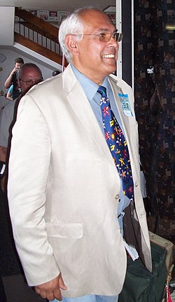

# Trevor Jones

## Biografía

Trevor Alfred Charles Jones (Ciudad del Cabo, 23 de marzo de 1949) es un compositor sudafricano de música para cine, que se hizo célebre a raíz de su trabajo para la película El último mohicano (Michael Mann, 1992). También puso música a En el nombre del padre (Jim Sheridan, 1993), película en la que también se oyen canciones de Bono, Sinead O'Connor, Bob Marley, Jimi Hendrix y Thin Lizzy

## Estilo musical

Trevor Alfred Charles Jones ( Ciudad del Cabo, 23 de marzo de 1949) es un compositor sudafricano de música para cine, que se hizo célebre a raíz de su trabajo para la película El último mohicano ( Michael Mann, 1992). También puso música a En el nombre del padre ( Jim Sheridan, 1993), película en la que también se oyen canciones de Bono, Sinead O'Connor, Bob Marley, Jimi Hendrix y Thin Lizzy

## Anécdotas y curiosidades

Trevor Alfred Charles Jones (nacido el 23 de marzo de 1949) es un compositor sudafricano de bandas sonoras para cine y televisión que ha trabajado principalmente en el Reino Unido. [ 1 ] [ 2 ]

## Top 10 bandas sonoras

1. ***Notting Hill (Título en España: Notting Hill)***
    * **Póster:** [link](091_trevor_jones/posters/poster_notting_hill_1999.jpg)
2. ***The Last of the Mohicans (Título en España: El último mohicano)***
    * **Póster:** [link](091_trevor_jones/posters/poster_the_last_of_the_mohicans_1992.jpg)
3. ***The League of Extraordinary Gentlemen (Título en España: La liga de los hombres extraordinarios)***
    * **Póster:** [link](091_trevor_jones/posters/poster_the_league_of_extraordinary_gentlemen_2003.jpg)
4. ***In the Name of the Father (Título en España: En el nombre del padre)***
    * **Póster:** [link](091_trevor_jones/posters/poster_in_the_name_of_the_father_1993.jpg)
5. ***Mississippi Burning (Título en España: Arde Mississippi)***
    * **Póster:** [link](091_trevor_jones/posters/poster_mississippi_burning_1988.jpg)
6. ***Angel Heart (Título en España: El corazón del ángel)***
    * **Póster:** [link](091_trevor_jones/posters/poster_angel_heart_1987.jpg)
7. ***G.I. Jane (Título en España: La teniente O'Neil)***
    * **Póster:** [link](091_trevor_jones/posters/poster_g_i_jane_1997.jpg)
8. ***Arachnophobia (Título en España: Aracnofobia)***
    * **Póster:** [link](091_trevor_jones/posters/poster_arachnophobia_1990.jpg)
9. ***Sea of Love (Título en España: Melodía de seducción)***
    * **Póster:** [link](091_trevor_jones/posters/poster_sea_of_love_1989.jpg)
10. ***Brassed Off (Título en España: Tocando el viento)***
    * **Póster:** [link](091_trevor_jones/posters/poster_brassed_off_1996.jpg)

## Filmografía completa

- Britannia (Título en España: Britannia) (1979) · [Póster](091_trevor_jones/posters/poster_britannia_1979.jpg)
- Excalibur (Título en España: Excalibur) (1981) · [Póster](091_trevor_jones/posters/poster_excalibur_1981.jpg)
- Time Bandits (Título en España: Los héroes del tiempo) (1981) · [Póster](091_trevor_jones/posters/poster_time_bandits_1981.jpg)
- The Dark Crystal (Título en España: Cristal oscuro) (1982) · [Póster](091_trevor_jones/posters/poster_the_dark_crystal_1982.jpg)
- The Sender (Título en España: Sueños siniestros) (1982) · [Póster](091_trevor_jones/posters/poster_the_sender_1982.jpg)
- The Appointment (Título en España: La cita) (1983) · [Póster](091_trevor_jones/posters/poster_the_appointment_1983.jpg)
- Nate and Hayes (Título en España: Los piratas de las islas salvajes) (1983) · [Póster](091_trevor_jones/posters/poster_nate_and_hayes_1983.jpg)
- The World of 'The Dark Crystal' (Título en España: The World of 'The Dark Crystal') (1983) · [Póster](091_trevor_jones/posters/poster_the_world_of_the_dark_crystal_1983.jpg)
- Those Glory Glory Days (Título en España: Those Glory Glory Days) (1983) · [Póster](091_trevor_jones/posters/poster_those_glory_glory_days_1983.jpg)
- Aderyn Papur... and Pigs Might Fly (Título en España: Aderyn Papur... and Pigs Might Fly) (1984) · [Póster](091_trevor_jones/posters/poster_aderyn_papur_and_pigs_might_fly_1984.jpg)
- Dr. Fischer of Geneva (Título en España: Dr. Fischer of Geneva) (1984) · [Póster](091_trevor_jones/posters/poster_dr_fischer_of_geneva_1984.jpg)
- This Office Life (Título en España: This Office Life) (1984) · [Póster](091_trevor_jones/posters/poster_this_office_life_1984.jpg)
- Runaway Train (Título en España: El tren del infierno) (1985) · [Póster](091_trevor_jones/posters/poster_runaway_train_1985.jpg)
- Labyrinth (Título en España: Dentro del laberinto) (1986) · [Póster](091_trevor_jones/posters/poster_labyrinth_1986.jpg)
- Inside the Labyrinth (Título en España: Inside the Labyrinth) (1986) · [Póster](091_trevor_jones/posters/poster_inside_the_labyrinth_1986.jpg)
- Sweet Lies (Título en España: Dulces mentiras) (1987) · [Póster](091_trevor_jones/posters/poster_sweet_lies_1987.jpg)
- Angel Heart (Título en España: El corazón del ángel) (1987) · [Póster](091_trevor_jones/posters/poster_angel_heart_1987.jpg)
- Mississippi Burning (Título en España: Arde Mississippi) (1988) · [Póster](091_trevor_jones/posters/poster_mississippi_burning_1988.jpg)
- Just Ask for Diamond (Título en España: Just Ask for Diamond) (1988) · [Póster](091_trevor_jones/posters/poster_just_ask_for_diamond_1988.jpg)
- Dominick and Eugene (Título en España: La fuerza de un ser menor) (1988) · [Póster](091_trevor_jones/posters/poster_dominick_and_eugene_1988.jpg)
- Murder on the Moon (Título en España: Asesinato en la Luna) (1989) · [Póster](091_trevor_jones/posters/poster_murder_on_the_moon_1989.jpg)
- Sea of Love (Título en España: Melodía de seducción) (1989) · [Póster](091_trevor_jones/posters/poster_sea_of_love_1989.jpg)
- Arachnophobia (Título en España: Aracnofobia) (1990) · [Póster](091_trevor_jones/posters/poster_arachnophobia_1990.jpg)
- Guns: A Day in the Death of America (Título en España: Guns: A Day in the Death of America) (1990) · [Póster](091_trevor_jones/posters/poster_guns_a_day_in_the_death_of_america_1990.jpg)
- Bad Influence (Título en España: Malas influencias) (1990) · [Póster](091_trevor_jones/posters/poster_bad_influence_1990.jpg)
- By Dawn's Early Light (Título en España: Misiles al Amanecer) (1990) · [Póster](091_trevor_jones/posters/poster_by_dawn_s_early_light_1990.jpg)
- Chains of Gold (Título en España: Cadenas de oro) (1991) · [Póster](091_trevor_jones/posters/poster_chains_of_gold_1991.jpg)
- True Colors (Título en España: El color de la ambición) (1991) · [Póster](091_trevor_jones/posters/poster_true_colors_1991.jpg)
- CrissCross (Título en España: CrissCross) (1992) · [Póster](091_trevor_jones/posters/poster_crisscross_1992.jpg)
- The Last of the Mohicans (Título en España: El último mohicano) (1992) · [Póster](091_trevor_jones/posters/poster_the_last_of_the_mohicans_1992.jpg)
- Freejack (Título en España: Freejack (Sin identidad)) (1992) · [Póster](091_trevor_jones/posters/poster_freejack_1992.jpg)
- Blame It on the Bellboy (Título en España: Échale la culpa al botones) (1992) · [Póster](091_trevor_jones/posters/poster_blame_it_on_the_bellboy_1992.jpg)
- Death Train (Título en España: El tren de la muerte) (1993) · [Póster](091_trevor_jones/posters/poster_death_train_1993.jpg)
- In the Name of the Father (Título en España: En el nombre del padre) (1993) · [Póster](091_trevor_jones/posters/poster_in_the_name_of_the_father_1993.jpg)
- Cliffhanger (Título en España: Máximo riesgo) (1993) · [Póster](091_trevor_jones/posters/poster_cliffhanger_1993.jpg)
- Hideaway (Título en España: Asesino del más allá) (1995) · [Póster](091_trevor_jones/posters/poster_hideaway_1995.jpg)
- Kiss of Death (Título en España: El sabor de la muerte) (1995) · [Póster](091_trevor_jones/posters/poster_kiss_of_death_1995.jpg)
- Richard III (Título en España: Ricardo III) (1995) · [Póster](091_trevor_jones/posters/poster_richard_iii_1995.jpg)
- Loch Ness (Título en España: Lago Ness) (1996) · [Póster](091_trevor_jones/posters/poster_loch_ness_1996.jpg)
- Brassed Off (Título en España: Tocando el viento) (1996) · [Póster](091_trevor_jones/posters/poster_brassed_off_1996.jpg)
- Lawn Dogs (Título en España: Inocencia rebelde (Lawn Dogs)) (1997) · [Póster](091_trevor_jones/posters/poster_lawn_dogs_1997.jpg)
- G.I. Jane (Título en España: La teniente O'Neil) (1997) · [Póster](091_trevor_jones/posters/poster_g_i_jane_1997.jpg)
- Roseanna's Grave (Título en España: Por amor a Rosana) (1997) · [Póster](091_trevor_jones/posters/poster_roseanna_s_grave_1997.jpg)
- Dark City (Título en España: Dark City) (1998) · [Póster](091_trevor_jones/posters/poster_dark_city_1998.jpg)
- Titanic Town (Título en España: En primera línea) (1998) · [Póster](091_trevor_jones/posters/poster_titanic_town_1998.jpg)
- Desperate Measures (Título en España: Medidas desesperadas) (1998) · [Póster](091_trevor_jones/posters/poster_desperate_measures_1998.jpg)
- Talk of Angels (Título en España: Pasiones Rotas) (1998) · [Póster](091_trevor_jones/posters/poster_talk_of_angels_1998.jpg)
- The Mighty (Título en España: Un mundo a su medida) (1998) · [Póster](091_trevor_jones/posters/poster_the_mighty_1998.jpg)
- Molly (Título en España: Molly) (1999) · [Póster](091_trevor_jones/posters/poster_molly_1999.jpg)
- Notting Hill (Título en España: Notting Hill) (1999) · [Póster](091_trevor_jones/posters/poster_notting_hill_1999.jpg)
- Thirteen Days (Título en España: Trece días) (2000) · [Póster](091_trevor_jones/posters/poster_thirteen_days_2000.jpg)
- From Hell (Título en España: Desde el infierno) (2001) · [Póster](091_trevor_jones/posters/poster_from_hell_2001.jpg)
- The Long Run (Título en España: La larga marcha) (2001) · [Póster](091_trevor_jones/posters/poster_the_long_run_2001.jpg)
- To End All Wars (Título en España: Más allá del deber) (2001) · [Póster](091_trevor_jones/posters/poster_to_end_all_wars_2001.jpg)
- Crossroads (Título en España: Crossroads: hasta el final) (2002) · [Póster](091_trevor_jones/posters/poster_crossroads_2002.jpg)
- I'll Be There (Título en España: Asuntos de familia) (2003) · [Póster](091_trevor_jones/posters/poster_i_ll_be_there_2003.jpg)
- The League of Extraordinary Gentlemen (Título en España: La liga de los hombres extraordinarios) (2003) · [Póster](091_trevor_jones/posters/poster_the_league_of_extraordinary_gentlemen_2003.jpg)
- Around the World in 80 Days (Título en España: La vuelta al mundo en 80 días) (2004) · [Póster](091_trevor_jones/posters/poster_around_the_world_in_80_days_2004.jpg)
- Chaos (Título en España: Caos) (2005) · [Póster](091_trevor_jones/posters/poster_chaos_2005.jpg)
- 亡国のイージス (Título en España: 亡国のイージス) (2005) · [Póster](091_trevor_jones/posters/poster_poster_2005.jpg)
- Fields Of Freedom (Título en España: Fields Of Freedom) (2006) · [Póster](091_trevor_jones/posters/poster_fields_of_freedom_2006.jpg)
- George Washington: We Fight to Be Free (Título en España: George Washington: We Fight to Be Free) (2006) · [Póster](091_trevor_jones/posters/poster_george_washington_we_fight_to_be_free_2006.jpg)
- Three and Out (Título en España: Three and Out) (2008) · [Póster](091_trevor_jones/posters/poster_three_and_out_2008.jpg)
- Making The Last of the Mohicans (Título en España: Making The Last of the Mohicans) (2010) · [Póster](091_trevor_jones/posters/poster_making_the_last_of_the_mohicans_2010.jpg)
- How to Steal 2 Million (Título en España: How to Steal 2 Million) (2011) · [Póster](091_trevor_jones/posters/poster_how_to_steal_2_million_2011.jpg)
- Excalibur: Behind the Movie (Título en España: Excalibur: Behind the Movie) (2013) · [Póster](091_trevor_jones/posters/poster_excalibur_behind_the_movie_2013.jpg)

## Premios y nominaciones

* BAFTA – por *Best Film Music* – (Nominación)
* Emmy – por *Outstanding Music Composition* – (Nominación)
* Emmy – por *Outstanding Music Composition for a Limited Series* – (Nominación)
* Globo de Oro – (Nominación)
* Globo de Oro – por *Best Original Score* – (Nominación)
* Globo de Oro – por *Best Original Song* – (Nominación)
* Premio de la Academia – por *Best Live Action Short Film* – (Nominación)
* Óscar – por *Oscar consideration). Although all were displeased with the circumstances* – (Nominación)

## Fuentes adicionales

* [MundoBSO](https://www.mundobso.com/compositor/jones-trevor) — site:mundobso.com
* [MundoBSO (2)](https://w.mundobso.com/bso/cartero-siempre-llama-dos-veces-el) — site:mundobso.com
* [MundoBSO (3)](https://www.mundobso.com/bso/milla-verde-la) — site:mundobso.com
* [Film Score Monthly](https://www.filmscoremonthly.com/board/posts.cfm?pageID=5&forumID=1&threadID=21311&archive=1) — site:filmscoremonthly.com
* [Film Score Monthly (2)](https://www.filmscoremonthly.com/daily/article.cfm/articleID/2745/The-Dark-Crystal/) — site:filmscoremonthly.com
* [Film Score Monthly (3)](https://www.filmscoremonthly.com/board/posts.cfm?threadID=134598&forumID=1&archive=0) — site:filmscoremonthly.com
* [SoundtrackCollector](https://www.soundtrackcollector.com/catalog/composerdiscography.php?composerid=37&offset=80) — site:soundtrackcollector.com
* [SoundtrackCollector (2)](https://www.soundtrackcollector.com/title/2509/Sea+Of+Love) — site:soundtrackcollector.com
* [SoundtrackCollector (3)](https://www.soundtrackcollector.com/title/5559/Last+Of+The+Mohicans,+The) — site:soundtrackcollector.com
* [WhatSong](https://www.whatsong.org/tvshow/how-i-met-your-mother/episode/44483) — site:whatsong.org
* [WhatSong (2)](https://www.whatsong.org/tvshow/9-1-1/episode/71629) — site:whatsong.org
* [WhatSong (3)](https://www.whatsong.org/tvshow/grown-ish/episode/82123) — site:whatsong.org

## Notas externas

* MundoBSO: Nació en Ciudad del Cabo (Sudáfrica), el 23 de marzo de 1949. C ompositor reconocido especialmente por sus partituras para películas de primera línea en las décadas de los 80 y 90. Con la llegada del nuevo siglo, fue desapareciendo paulatinamente hasta ingresar, al igual que otros ilustres colegas como Elliot Goldenthal o Bruce Broughton, en el triste club de los composit ores olvidados para Hollywood y el cine en general. Desde muy pequeño mostró vocación por la música, y a la edad de seis años ya había decidido que dedicaría su vida a componer. Habiéndose trasladado a Inglaterra con su familia, entró a estudiar de joven en la Royal Academy of Music de Londres, gracias a una beca. Tras...
* MundoBSO (3): Compositor: Newman, Thomas Sello: Warner Duración: 66 minutos Información de la película Título original: The Green Mile Director: Frank Darabont Nacionalidad: EE UU Año: 1999 Argumento A mediados de los años treinta, un guarda de prisiones que custodia a los condenados a muerte descubre poderes sobrenaturales en un inmenso hombre negro, acusado de haber asesinado a dos niñas. Eso le llevará a creer en su inocencia. Premios Saturn: 1 nominación Compositor: Newman, Thomas Sello: Warner Duración: 66 minutos
* WhatSong: Lily y Robin bailan con los dos nerds del último año de secundaria. Se reproduce de fondo cuando Lilly, Robin y Barney intentan entrar a la fiesta. La canción es una canción que está incluida en iMovie.
* WhatSong (2): Talking Heads - Favoritos populares 1976-1992: Sand In the Vaseline The Naked and Famous - Passive Me, Aggressive You (Remixes y caras B)
* WhatSong (3): Luca está pensando en él y en el encuentro sexual de Zoey de la noche anterior. Luca está estresado por su "yo". Texto a Zoey y su falta de respuesta.
* soundtrackfest.com: Contenido Artículos Noticias Micronoticias Calendarios Calendario 2019 Calendario 2018 Calendario 2017 Calendarios Calendario 2019 Calendario 2018 Calendario 2017
* moviemusicuk.us: ¿Podemos empezar con Merlín? Eso fue un gran éxito para usted. Hay muchísima música, más de dos horas. Cuando hay tanta música, ¿te toma más tiempo escribirla? No. Creo que la puntuación de Merlín fue de tres semanas y media en total, unos 24 o 25 días o algo así. El caso es que en la televisión se supone que se escribe mucho más rápido que en el cine, principalmente porque los presupuestos son menores y eso significa que no puedes dedicar tanto tiempo al proyecto porque los horarios son más ajustados, aunque a mí no me cuesta más venir a una película tres o cuatro semanas antes. Sólo soy yo quien escribe en ese momento. Pero incluso con el período de postproducción más corto, uno descubre que la gente tiende...
* soundtrackfest.com: Calendarios Calendario 2019 Calendario 2018 Calendario 2017 Compositores Entrevistas Premios Maestros Joe Hisaishi Ennio Morricone John Williams Hans Zimmer
* culture.fandom.com: Explorar la página principal Discutir todas las páginas Comunidad Mapas interactivos Publicaciones de blog recientes Páginas modificadas recientemente Lady Miss Kier Canal 4 Reino Unido KLF Bandera de Kenia Juegos Olímpicos de verano de 1972 Plátanos en pijama
* music.apple.com: Promentory El último de los mohicanos (banda sonora original de la película)â·â1992 El último de los mohicanos (banda sonora original de la película)â·â1992
* www.scorefilia.com: The Last of the Mohicans (1992) lo encumbró entre los compositores de culto. Su carrera desde esa fecha ha dado tumbos, algunos irregulares y otros como Merlin (1998) o Cleopatra (1999) que lo sostienen entre los pocos músicos capaces de transmitir el hedor del pasado, aunque nos llegue a través de sintetizadores y de voces irreales. Pero Trevor Jones a veces nos ha sorprendido con proyectos electrónicos como G.I. Jane (1997) que de no ser él estaríamos ante un músico pop muy cercano a las tesis de Trevor Rabin. Aunque Trevor Jones nació en Cape City (República de Sudáfrica) el 23 de marzo de 1949 debe la mayor parte de su carrera como músico a la educación recibida en el Reino...
* kids.kiddle.co: Trevor Alfred Charles Jones nació el 23 de marzo de 1949 en Sudáfrica. Es un compositor talentoso que crea música para películas y programas de televisión. La mayor parte de su trabajo se ha realizado en el Reino Unido. Trevor Jones es conocido por su música de las décadas de 1980 y 1990. Compuso para muchas películas famosas. Estos incluyen Excalibur, Tren fugitivo, El cristal oscuro, Laberinto, Mississippi en llamas, El último de los mohicanos y En el nombre del padre. Ha trabajado con directores famosos como John Boorman, Jim Henson y Michael Mann.
