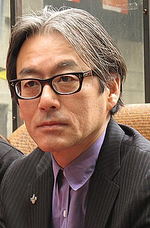

# Shigeru Umebayashi

## Biografía

Shigeru Umebayashi (梅林茂 Umebayashi Shigeru) es un compositor japonés nacido el 19 de febrero de 1951 en Kitakyushu, Fukuoka. Fue el líder de la famosa banda japonesa de rock new-wave EX. Cuando se disolvió la banda en 1985, empezó a escribir música para el cine. En ese mismo año recibió varios premios musicales por Sorekara y Tomoyo Shizukani Nemure como el Music Award en Maiichi Film Contest, el Japanese Academic Music Award, así como otros premios en los Festivales de Cine de Yokohama y Osaka. Hasta el momento ha compuesto más de 40 bandas sonoras japonesas y chinas, siendo quizá más conocido en occidente por su colaboración con directores como Wong Kar-wai, Fa yeung nin wa (2001), 2046 (2004), My Blueberry Nights (2007), y Zhang Yimou, House of Flying Daggers, La casa de las dagas voladoras (2004). Shigeru Umebayashi es también el compositor de la música del primer musical serbio Charleston & Vendetta (2008).

## Estilo musical

Umebayashi, que alguna vez fue líder y bajista de la banda japonesa de rock new wave EX, comenzó a componer películas en 1985, cuando la banda se disolvió. [ 2 ] Tiene más de 30 bandas sonoras de películas japonesas y chinas en su haber [ 3 ] y quizás sea más conocido en Occidente por "Yumeji's Theme" (originalmente de Yumeji de Seijun Suzuki), incluido en In the Mood for Love (2000) del director Wong Kar-wai. Umebayashi compuso la mayor parte de la película de seguimiento de Wong Kar-wai, 2046 (2004), y House of Flying Daggers.

## Anécdotas y curiosidades

Compositores: Korzeniowski, Abel | Umebayashi, Shigeru Sello: Relativity Media Duración: 52 minutos Título original: A Single Man Director: Tom Ford Nacionalidad: EE UU Año: 2009

## Top 10 bandas sonoras

1. ***Hannibal Rising (Título en España: Hannibal, el origen del mal)***
    * **Póster:** [link](095_shigeru_umebayashi/posters/poster_hannibal_rising_2007.jpg)
2. ***花樣年華 (Título en España: Deseando amar)***
    * **Póster:** [link](095_shigeru_umebayashi/posters/poster_poster_2000.jpg)
3. ***2046 (Título en España: 2046)***
    * **Póster:** [link](095_shigeru_umebayashi/posters/poster_2046_2004.jpg)
4. ***霍元甲 (Título en España: Fearless - Sin miedo)***
    * **Póster:** [link](095_shigeru_umebayashi/posters/poster_poster_2006.jpg)
5. ***十面埋伏 (Título en España: La casa de las dagas voladoras)***
    * **Póster:** [link](095_shigeru_umebayashi/posters/poster_poster_2004.jpg)
6. ***一代宗師 (Título en España: The Grandmaster)***
    * **Póster:** [link](095_shigeru_umebayashi/posters/poster_poster_2013.jpg)
7. ***滿城盡帶黃金甲 (Título en España: La maldición de la flor dorada)***
    * **Póster:** [link](095_shigeru_umebayashi/posters/poster_poster_2006.jpg)
8. ***Crouching Tiger, Hidden Dragon: Sword of Destiny (Título en España: Tigre y dragón 2: La espada del destino)***
    * **Póster:** [link](095_shigeru_umebayashi/posters/poster_crouching_tiger_hidden_dragon_sword_of_destiny_2016.jpg)
9. ***Trishna (Título en España: Trishna)***
    * **Póster:** [link](095_shigeru_umebayashi/posters/poster_trishna_2011.jpg)
10. ***黄飞鸿之英雄有梦 (Título en España: El renacer de una leyenda)***
    * **Póster:** [link](095_shigeru_umebayashi/posters/poster_poster_2014.jpg)

## Filmografía completa

- 断線 (Título en España: 断線) (1983) · [Póster](095_shigeru_umebayashi/posters/poster_poster_1983.jpg)
- いつか誰かが殺される (Título en España: いつか誰かが殺される) (1984) · [Póster](095_shigeru_umebayashi/posters/poster_poster_1984.jpg)
- それから (Título en España: それから) (1985) · [Póster](095_shigeru_umebayashi/posters/poster_poster_1985.jpg)
- 友よ、静かに瞑れ (Título en España: 友よ、静かに瞑れ) (1985) · [Póster](095_shigeru_umebayashi/posters/poster_poster_1985.jpg)
- 紳士同盟 (Título en España: 紳士同盟) (1986) · [Póster](095_shigeru_umebayashi/posters/poster_poster_1986.jpg)
- 悲しい色やねん (Título en España: 悲しい色やねん) (1988) · [Póster](095_shigeru_umebayashi/posters/poster_poster_1988.jpg)
- 鉄拳 (Título en España: 鉄拳) (1990) · [Póster](095_shigeru_umebayashi/posters/poster_poster_1990.jpg)
- 夢二 (Título en España: 夢二) (1991) · [Póster](095_shigeru_umebayashi/posters/poster_poster_1991.jpg)
- ありふれた愛に関する調査 (Título en España: ありふれた愛に関する調査) (1992) · [Póster](095_shigeru_umebayashi/posters/poster_poster_1992.jpg)
- 眠らない街 新宿鮫 (Título en España: 眠らない街 新宿鮫) (1993) · [Póster](095_shigeru_umebayashi/posters/poster_poster_1993.jpg)
- よい子と遊ぼう (Título en España: よい子と遊ぼう) (1994) · [Póster](095_shigeru_umebayashi/posters/poster_poster_1994.jpg)
- 居酒屋ゆうれい (Título en España: 居酒屋ゆうれい) (1994) · [Póster](095_shigeru_umebayashi/posters/poster_poster_1994.jpg)
- Boxer Joe (Título en España: Boxer Joe) (1995) · [Póster](095_shigeru_umebayashi/posters/poster_boxer_joe_1995.jpg)
- 南京的基督 (Título en España: 南京的基督) (1995) · [Póster](095_shigeru_umebayashi/posters/poster_poster_1995.jpg)
- G4特工 (Título en España: G4特工) (1997) · [Póster](095_shigeru_umebayashi/posters/poster_g4_1997.jpg)
- いちご同盟 (Título en España: いちご同盟) (1997) · [Póster](095_shigeru_umebayashi/posters/poster_poster_1997.jpg)
- 私たちが好きだったこと (Título en España: 私たちが好きだったこと) (1997) · [Póster](095_shigeru_umebayashi/posters/poster_poster_1997.jpg)
- 不夜城 (Título en España: 不夜城) (1998) · [Póster](095_shigeru_umebayashi/posters/poster_poster_1998.jpg)
- 花樣年華 (Título en España: Deseando amar) (2000) · [Póster](095_shigeru_umebayashi/posters/poster_poster_2000.jpg)
- 公元2000 (Título en España: 公元2000) (2000) · [Póster](095_shigeru_umebayashi/posters/poster_2000_2000.jpg)
- 陰陽師 (Título en España: The Ying Yang Master) (2001) · [Póster](095_shigeru_umebayashi/posters/poster_poster_2001.jpg)
- 光の雨 (Título en España: 光の雨) (2001) · [Póster](095_shigeru_umebayashi/posters/poster_poster_2001.jpg)
- 少女 (Título en España: 少女) (2001) · [Póster](095_shigeru_umebayashi/posters/poster_poster_2001.jpg)
- 慌心假期 (Título en España: 慌心假期) (2001) · [Póster](095_shigeru_umebayashi/posters/poster_poster_2001.jpg)
- 周渔的火车 (Título en España: El tren de Zhou Yu) (2002) · [Póster](095_shigeru_umebayashi/posters/poster_poster_2002.jpg)
- 陰陽師II (Título en España: The Ying Yang Master) (2003) · [Póster](095_shigeru_umebayashi/posters/poster_ii_2003.jpg)
- 戀之風景 (Título en España: 戀之風景) (2003) · [Póster](095_shigeru_umebayashi/posters/poster_poster_2003.jpg)
- 2046 (Título en España: 2046) (2004) · [Póster](095_shigeru_umebayashi/posters/poster_2046_2004.jpg)
- 十面埋伏 (Título en España: La casa de las dagas voladoras) (2004) · [Póster](095_shigeru_umebayashi/posters/poster_poster_2004.jpg)
- 데이지 (Título en España: Daisy) (2006) · [Póster](095_shigeru_umebayashi/posters/poster_poster_2006.jpg)
- 霍元甲 (Título en España: Fearless - Sin miedo) (2006) · [Póster](095_shigeru_umebayashi/posters/poster_poster_2006.jpg)
- 滿城盡帶黃金甲 (Título en España: La maldición de la flor dorada) (2006) · [Póster](095_shigeru_umebayashi/posters/poster_poster_2006.jpg)
- Mare Nero (Título en España: Mare Nero) (2006) · [Póster](095_shigeru_umebayashi/posters/poster_mare_nero_2006.jpg)
- Hannibal Rising (Título en España: Hannibal, el origen del mal) (2007) · [Póster](095_shigeru_umebayashi/posters/poster_hannibal_rising_2007.jpg)
- Absurdistan (Título en España: Absurdistan) (2008) · [Póster](095_shigeru_umebayashi/posters/poster_absurdistan_2008.jpg)
- Incendiary (Título en España: Incendiary) (2008) · [Póster](095_shigeru_umebayashi/posters/poster_incendiary_2008.jpg)
- Чарлстон за Огњенку (Título en España: Чарлстон за Огњенку) (2008) · [Póster](095_shigeru_umebayashi/posters/poster_poster_2008.jpg)
- 殺人犯 (Título en España: 殺人犯) (2009) · [Póster](095_shigeru_umebayashi/posters/poster_poster_2009.jpg)
- 苏乞儿 (Título en España: True Legend) (2010) · [Póster](095_shigeru_umebayashi/posters/poster_poster_2010.jpg)
- Trishna (Título en España: Trishna) (2011) · [Póster](095_shigeru_umebayashi/posters/poster_trishna_2011.jpg)
- Días de gracia (Título en España: Días de gracia) (2012) · [Póster](095_shigeru_umebayashi/posters/poster_d_as_de_gracia_2012.jpg)
- 铜雀台 (Título en España: Tong que tai (Los asesinos)) (2012) · [Póster](095_shigeru_umebayashi/posters/poster_poster_2012.jpg)
- 大追捕 (Título en España: 大追捕) (2012) · [Póster](095_shigeru_umebayashi/posters/poster_poster_2012.jpg)
- Come il vento (Título en España: Come il vento) (2013) · [Póster](095_shigeru_umebayashi/posters/poster_come_il_vento_2013.jpg)
- 一代宗師 (Título en España: The Grandmaster) (2013) · [Póster](095_shigeru_umebayashi/posters/poster_poster_2013.jpg)
- 黄飞鸿之英雄有梦 (Título en España: El renacer de una leyenda) (2014) · [Póster](095_shigeru_umebayashi/posters/poster_poster_2014.jpg)
- 觸不可及 (Título en España: 觸不可及) (2014) · [Póster](095_shigeru_umebayashi/posters/poster_poster_2014.jpg)
- La novia (Título en España: La novia) (2015) · [Póster](095_shigeru_umebayashi/posters/poster_la_novia_2015.jpg)
- 罗曼蒂克消亡史 (Título en España: The Wasted Times) (2016) · [Póster](095_shigeru_umebayashi/posters/poster_poster_2016.jpg)
- Crouching Tiger, Hidden Dragon: Sword of Destiny (Título en España: Tigre y dragón 2: La espada del destino) (2016) · [Póster](095_shigeru_umebayashi/posters/poster_crouching_tiger_hidden_dragon_sword_of_destiny_2016.jpg)
- 夺冠 (Título en España: 夺冠) (2020) · [Póster](095_shigeru_umebayashi/posters/poster_poster_2020.jpg)
- 侍神令 (Título en España: El maestro del yin y el yang) (2021) · [Póster](095_shigeru_umebayashi/posters/poster_poster_2021.jpg)
- Greetings from Crîngași (Título en España: Greetings from Crîngași) (2023) · [Póster](095_shigeru_umebayashi/posters/poster_greetings_from_cr_nga_i_2023.jpg)
- In the Belly of a Tiger (Título en España: In the Belly of a Tiger) (2024) · [Póster](095_shigeru_umebayashi/posters/poster_in_the_belly_of_a_tiger_2024.jpg)
- 草木人间 (Título en España: 草木人间) (2024) · [Póster](095_shigeru_umebayashi/posters/poster_poster_2024.jpg)
- 我的世界没有我 (Título en España: 我的世界没有我) (2025) · [Póster](095_shigeru_umebayashi/posters/poster_poster_2025.jpg)
- 花樣年華2001 (Título en España: 花樣年華2001) (2025) · [Póster](095_shigeru_umebayashi/posters/poster_2001_2025.jpg)

## Fuentes adicionales

* [MundoBSO](https://www.mundobso.com/bso/hombre-soltero-un) — site:mundobso.com
* [MundoBSO (2)](https://www.mundobso.com/bso/capitan-america-civil-war) — site:mundobso.com
* [MundoBSO (3)](https://www.mundobso.com/bso/despiadados-los) — site:mundobso.com
* [Film Score Monthly](https://www.filmscoremonthly.com/daily/article.cfm/articleID/7958/Film-Score-Friday-12321/) — site:filmscoremonthly.com
* [Film Score Monthly (2)](https://www.filmscoremonthly.com/daily/article.cfm?articleID=7936) — site:filmscoremonthly.com
* [Film Score Monthly (3)](https://www.filmscoremonthly.com/daily/article.cfm/articleID/8190/Film-Score-Friday-12624/) — site:filmscoremonthly.com
* [SoundtrackCollector](https://www.soundtrackcollector.com/title/87850/Single+Man,+A) — site:soundtrackcollector.com
* [SoundtrackCollector (2)](https://www.soundtrackcollector.com/catalog/composerdiscography.php?composerid=105) — site:soundtrackcollector.com
* [SoundtrackCollector (3)](https://www.soundtrackcollector.com/title/101751/Yi+Dai+Zong+Shi) — site:soundtrackcollector.com
* [WhatSong](https://www.whatsong.org/tvshow/top-gear/episode/51737) — site:whatsong.org
* [WhatSong (2)](https://www.whatsong.org/tvshow/how-i-met-your-mother/episode/44483) — site:whatsong.org
* [WhatSong (3)](https://www.whatsong.org/tvshow/supernatural/episode/3659) — site:whatsong.org

## Notas externas

* MundoBSO: Compositores: Korzeniowski, Abel | Umebayashi, Shigeru Sello: Relativity Media Duración: 52 minutos Título original: A Single Man Director: Tom Ford Nacionalidad: EE UU Año: 2009
* MundoBSO (2): Compositor: Jackman, Henry Sello: Hollywood Duración: 69 minutos Información de la película Título original: Captain America: Civil War Director: Anthony Russo, Joe Russo Nacionalidad: EE UU Año: 2016 Argumento Continuación de Captain America: The Winter Soldier (14). Cuando otro incidente internacional involucra a Los Vengadores y causan varios daños colaterales, aumentan las presiones políticas para exigir más responsabilidades y determinar cuándo deben contratar los servicios del grupo de superhéroes. Esta nueva situación dividirá a Los Vengadores, mientras intentan proteger al mundo de un nuevo y terrible villano. Compositor: Jackman, Henry Sello: Hollywood Duración: 69 minutos
* MundoBSO (3): Compositor: Morricone, Ennio Sello: Screen Trax Duración: 37 minutos Información de la película Título original: I crudeli Director: Sergio Corbucci Nacionalidad: Italia Año: 1967 Argumento Al acabar la guerra de Secesión norteamericana, un coronel sudista organiza un ejército para seguir combatiendo, y cuenta para ello con la ayuda de sus tres hijos. Compositor: Morricone, Ennio Sello: Screen Trax Duración: 37 minutos
* WhatSong: Rachid Taha - Black Hawk Down (banda sonora original de la película) Jeremy y James silban brevemente, luego se escucha la canción real, mientras el trío se da cuenta de la dificultad del desafío que se les ha planteado, luego se suben a sus camiones y parten por primera vez.
* WhatSong (2): Lily y Robin bailan con los dos nerds del último año de secundaria. Se reproduce de fondo cuando Lilly, Robin y Barney intentan entrar a la fiesta. La canción es una canción que está incluida en iMovie.
* WhatSong (3): Sam y Dean cortan leña para una pira funeraria mientras recuerdan su tiempo con Charlie. La mejor fuente en línea de música de películas y televisión. Copyright © 2018 - 2026 Whatsong.org. Reservados todos los derechos.
* www.shigeru-umebayashi.com: Shigeru Umebayashi (también conocido como Ume) nació en Kitakyushu, Japón. Ume comenzó a componer música para películas en 1984 y su talento fue rápidamente reconocido al año siguiente cuando su música para Sorekara (And Then) ganó múltiples premios. Desde entonces, ha compuesto para más de 30 películas japonesas. A nivel internacional, Ume es mejor conocido por el tema de Yumeji en In the Mood for Love (2000) de Wong Kar-Wai, así como por sus colaboraciones con Wong en 2046 (2004) y The Grandmaster (2013). También trabajó con Zhang Yimou en House of Flying Daggers (2004) y Curse of the Golden Flower (2006), componiendo la célebre canción final Lovers para la soprano Kathleen Battle. Las partituras de Ume han recibido numerosos honores, tales...
* music.apple.com: Zhou Yu's Train (banda sonora original de la película) Tema de Yumeji (tema de "In the Mood for Love") Tema de Yumeji (banda sonora original de la película) - Singleâ·â2001
* nanu.blog.br: ¡La melancolía en las composiciones de las bandas sonoras de Shigeru Umebayashi! Shigeru Umebayashi es un compositor japonés conocido mundialmente por escribir las bandas sonoras de películas famosas, más concretamente del director Wong Kar Wai, como El amor de las flores, 2046 y Un beso robado. También conocido como Ume, Shigeru Umebayashi comenzó a componer bandas sonoras en la década de 1980, tras dejar la banda de rock japonesa EX, que lideraba.
* shigeru-umebayashi.com: Shigeru Umebayashi (también conocido como Ume) nació en Kitakyushu, Japón. Ume comenzó a componer música para películas en 1984 y su talento fue rápidamente reconocido al año siguiente cuando su música para Sorekara (And Then) ganó múltiples premios. Desde entonces, ha compuesto para más de 30 películas japonesas. A nivel internacional, Ume es mejor conocido por el tema de Yumeji en In the Mood for Love (2000) de Wong Kar-Wai, así como por sus colaboraciones con Wong en 2046 (2004) y The Grandmaster (2013). También trabajó con Zhang Yimou en House of Flying Daggers (2004) y Curse of the Golden Flower (2006), componiendo la célebre canción final Lovers para la soprano Kathleen Battle. Las partituras de Ume han recibido numerosos honores, tales...
* hotcorn.com: Netflix arranca motores con Motorvalley: cuando correr no se trata de ganar, sino de mantenerse con vida VIDEO I El diablo viste de Prada 2: tráiler online
* wisemusiccreative.com: Sólo un año después de que comenzara a componer música para películas en 1984, el talento de Shigeru Umebayashi fue reconocido cuando su música para la producción cinematográfica japonesa Sorekara (And Then; 1985) ganó varios premios de música para películas. Desde su descubrimiento a través del director de cine japonés Yoshimitsu Morita en 1985, Shigeru Umebayashi ha compuesto la música de más de 30 películas japonesas. También es un compositor de cine de renombre internacional, mejor conocido por crear el tema de Yumeji en la película del director de cine de Hong Kong Wong Kar-Wai, In The Mood for Love (2000). Además de ampliar su diversa cartera, Umebayashi ha trabajado con la italiana Roberta Torre en Mare nero (Dark Sea; 2006), el inglés Peter Webber en Hannibal Rising (2007),...
